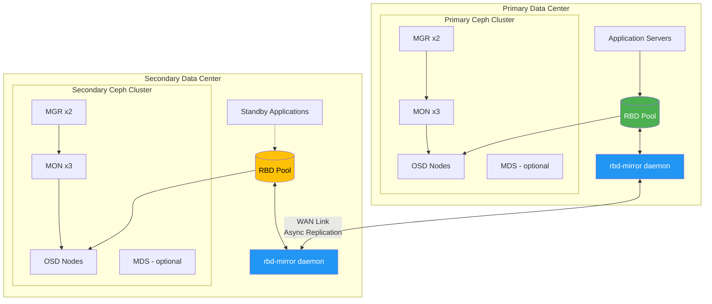
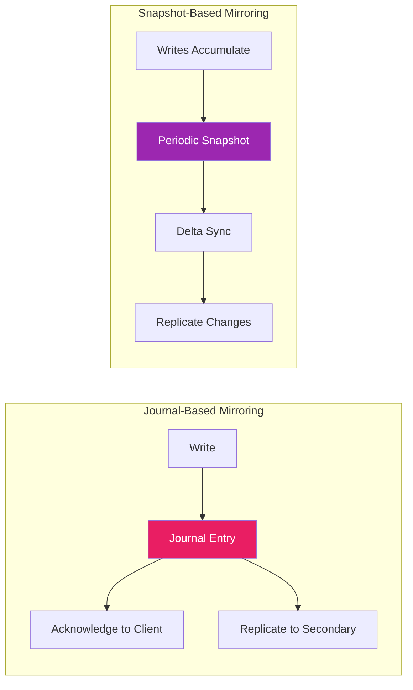
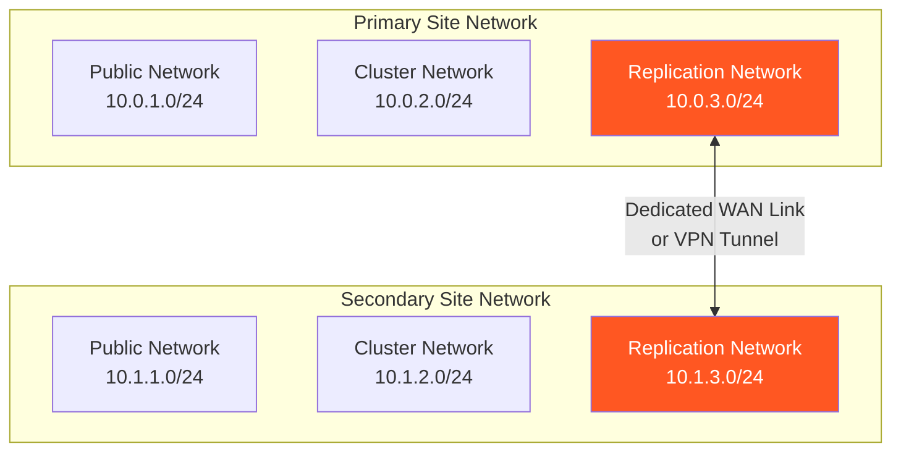

# How to Build Ceph RBD Mirroring

Author: [nawazdhandala](https://github.com/nawazdhandala)

Tags: Ceph, RBD, Mirroring, Disaster Recovery

Description: A complete guide to building Ceph RBD mirroring infrastructure from scratch, covering architecture design, cluster setup, peer configuration, and production deployment strategies.

---

> Building a robust data replication system is not about copying bytes between clusters. It is about designing an architecture that survives network partitions, handles split-brain scenarios gracefully, and recovers automatically when things go wrong.

Ceph RBD mirroring enables asynchronous replication of block device images between geographically distributed Ceph clusters. This guide walks you through building a complete mirroring infrastructure from the ground up, with emphasis on architecture decisions, implementation details, and production-ready configurations.

## Architecture Overview

Before writing any commands, let us understand what we are building. RBD mirroring involves two or more Ceph clusters that replicate block device images between each other.



### Key Components

**rbd-mirror daemon:** The workhorse of replication. It runs on the secondary cluster and pulls changes from the primary. Each daemon can handle multiple pools and images.

**Pools:** Mirroring is configured at the pool level. Both clusters must have pools with matching names and mirroring enabled.

**Peers:** The trust relationship between clusters. Peers exchange authentication tokens and cluster configuration.

**Images:** Individual block devices that get replicated. Each image can use journal-based or snapshot-based mirroring.

## Choosing Your Mirroring Mode

Ceph RBD supports two mirroring modes, each with distinct trade-offs.



### Journal-Based Mirroring

Every write is recorded in a journal before acknowledgment. The rbd-mirror daemon replays journal entries on the secondary cluster in order.

**Advantages:**
- Lowest Recovery Point Objective (RPO) - typically seconds
- Maintains write ordering guarantees
- Suitable for databases and transactional workloads

**Disadvantages:**
- Higher write latency due to journaling overhead
- Requires the journaling feature enabled on images
- More complex recovery procedures

### Snapshot-Based Mirroring

Periodic snapshots capture the image state. The rbd-mirror daemon syncs only the changed blocks between snapshots.

**Advantages:**
- Lower overhead on the primary cluster
- Simpler implementation and troubleshooting
- Works with any image features

**Disadvantages:**
- Higher RPO - based on snapshot interval
- No write ordering guarantee between snapshots
- Larger initial sync for big changes

### Decision Matrix

| Requirement | Journal-Based | Snapshot-Based |
|-------------|---------------|----------------|
| RPO < 1 minute | Yes | No |
| Low write latency | No | Yes |
| Database workloads | Recommended | Acceptable |
| Backup workloads | Overkill | Recommended |
| Bandwidth constrained | Challenging | Better |

## Prerequisites and Planning

Before building, ensure you have these requirements in place.

### Hardware Requirements

Each cluster needs:
- Minimum 3 monitor nodes (can be colocated with other services)
- At least 3 OSD nodes with sufficient storage
- Network connectivity between sites (dedicated WAN link recommended)
- rbd-mirror host (can run on MGR nodes in smaller deployments)

### Network Requirements

Calculate your bandwidth needs based on change rate:

```bash
# Estimate replication bandwidth
# Formula: (Daily change rate in GB) * 8 / (Replication window in seconds)
# Example: 100GB daily changes, replicated over 24 hours
# (100 * 8) / 86400 = 9.26 Mbps minimum

# For real-time journal mirroring, estimate peak write throughput:
# If peak writes = 500 MB/s, you need 4 Gbps for real-time replication
```

Recommended network architecture:



### Software Requirements

Both clusters should run compatible Ceph versions:

```bash
# Check Ceph version on both clusters
ceph version

# Recommended: Both clusters on the same major version
# Minimum: Secondary cluster >= Primary cluster version
# Example output: ceph version 18.2.0 (quincy)

# Install rbd-mirror package on secondary cluster
# For Ubuntu/Debian:
apt-get install ceph-rbd-mirror

# For RHEL/CentOS:
dnf install ceph-rbd-mirror
```

## Step 1: Prepare the Primary Cluster

Start by configuring the primary cluster with the necessary pools and settings.

### Create the Mirroring Pool

Create a dedicated pool for mirrored images. Using a separate pool makes management easier and allows different replication policies.

```bash
# Connect to a monitor node on the PRIMARY cluster
# Create the pool with appropriate PG count
# Rule of thumb: (OSDs * 100) / replica_count / pool_count

# For a 12 OSD cluster with 3x replication:
ceph osd pool create rbd-mirror 128 128 replicated

# Initialize the pool for RBD use
rbd pool init rbd-mirror

# Set the application tag
ceph osd pool application enable rbd-mirror rbd

# Verify the pool is created
ceph osd pool ls detail | grep rbd-mirror
```

### Enable Pool-Level Mirroring

Enable mirroring on the pool. You can choose between pool mode (all images mirrored) or image mode (selective mirroring).

```bash
# Enable pool-level mirroring
# Mode 'pool': All images in this pool are automatically mirrored
# Mode 'image': Only explicitly enabled images are mirrored
rbd mirror pool enable rbd-mirror pool

# Verify mirroring is enabled
rbd mirror pool info rbd-mirror
# Output should show:
# Mode: pool
# Site Name: <not set>
```

### Set the Site Name

Give your primary cluster a meaningful site name. This appears in status outputs and helps identify which cluster you are working with.

```bash
# Set a descriptive site name for the primary cluster
rbd mirror pool peer bootstrap create \
    --site-name dc1-primary \
    rbd-mirror > /tmp/bootstrap-token-primary

# View the generated token (base64 encoded)
cat /tmp/bootstrap-token-primary

# The token contains:
# - Cluster FSID (unique cluster identifier)
# - Monitor addresses
# - CephX authentication credentials
# - Site name
```

Keep this token secure. It contains authentication credentials that allow the secondary cluster to connect.

## Step 2: Prepare the Secondary Cluster

The secondary cluster needs matching configuration.

### Create Matching Pool

The pool name must match exactly on both clusters.

```bash
# Connect to a monitor node on the SECONDARY cluster
# Create pool with the same name
ceph osd pool create rbd-mirror 128 128 replicated

# Initialize for RBD
rbd pool init rbd-mirror

# Enable the application tag
ceph osd pool application enable rbd-mirror rbd

# Enable mirroring in the same mode as primary
rbd mirror pool enable rbd-mirror pool

# Verify configuration
rbd mirror pool info rbd-mirror
```

### Import the Bootstrap Token

Transfer the bootstrap token from the primary cluster and import it on the secondary.

```bash
# Securely copy the token from primary site
# Option 1: SCP
scp user@primary-mon:/tmp/bootstrap-token-primary /tmp/

# Option 2: Copy via secure channel (recommended for production)
# Use your organization's secure file transfer method

# Import the token to establish peering
rbd mirror pool peer bootstrap import \
    --site-name dc2-secondary \
    --direction rx-tx \
    rbd-mirror /tmp/bootstrap-token-primary

# The --direction flag specifies replication direction:
# rx-only: This cluster only receives (read-only secondary)
# rx-tx: Bidirectional capability (can become primary if needed)
```

### Verify Peer Connection

Confirm the clusters can communicate.

```bash
# On the SECONDARY cluster
rbd mirror pool info rbd-mirror

# Expected output:
# Mode: pool
# Site Name: dc2-secondary
# Peers:
#   UUID: <unique-id>
#   Site Name: dc1-primary
#   Mirror UUID: <uuid>
#   Direction: rx-tx

# On the PRIMARY cluster
rbd mirror pool info rbd-mirror

# Should show dc2-secondary as a peer
```

## Step 3: Deploy the rbd-mirror Daemon

The rbd-mirror daemon does the actual replication work. It typically runs on the secondary cluster.

### Option A: Deploy with Cephadm (Recommended)

For clusters managed by cephadm, deployment is straightforward.

```bash
# On the SECONDARY cluster
# Deploy rbd-mirror with automatic placement
ceph orch apply rbd-mirror

# Or specify exact placement
ceph orch apply rbd-mirror --placement="2 node1,node2"

# Check deployment status
ceph orch ls | grep rbd-mirror
ceph orch ps --daemon-type rbd-mirror

# View daemon logs
ceph orch logs rbd-mirror
```

### Option B: Manual Deployment with Systemd

For manual installations or when you need more control.

```bash
# Create the rbd-mirror user with required capabilities
ceph auth get-or-create client.rbd-mirror.dc2 \
    mon 'profile rbd-mirror' \
    osd 'profile rbd' \
    -o /etc/ceph/ceph.client.rbd-mirror.dc2.keyring

# Secure the keyring file
chmod 600 /etc/ceph/ceph.client.rbd-mirror.dc2.keyring
chown ceph:ceph /etc/ceph/ceph.client.rbd-mirror.dc2.keyring

# Create systemd service configuration
cat > /etc/systemd/system/ceph-rbd-mirror@.service << 'EOF'
[Unit]
Description=Ceph RBD mirror daemon
After=network-online.target
Wants=network-online.target

[Service]
Type=simple
User=ceph
Group=ceph
ExecStart=/usr/bin/rbd-mirror -f --id %i
Restart=on-failure
RestartSec=10

[Install]
WantedBy=multi-user.target
EOF

# Reload systemd and enable the service
systemctl daemon-reload
systemctl enable ceph-rbd-mirror@rbd-mirror.dc2
systemctl start ceph-rbd-mirror@rbd-mirror.dc2

# Check service status
systemctl status ceph-rbd-mirror@rbd-mirror.dc2
```

### Configure Daemon Parameters

Tune the rbd-mirror daemon for your environment.

```bash
# Set configuration options for the daemon
# These can be set globally or per-daemon

# Number of concurrent image syncs (increase for more parallelism)
ceph config set client.rbd-mirror rbd_mirror_concurrent_image_syncs 5

# Journal commit delay in seconds (lower = faster failover, more overhead)
ceph config set client.rbd-mirror rbd_mirror_journal_commit_age 5

# Memory target for the daemon (in bytes)
ceph config set client.rbd-mirror rbd_mirror_memory_target 4294967296

# Verify settings
ceph config get client.rbd-mirror rbd_mirror_concurrent_image_syncs
```

## Step 4: Create Mirrored Images

With the infrastructure in place, create images that will be replicated.

### Journal-Based Images

For workloads requiring the lowest RPO.

```bash
# On the PRIMARY cluster
# Create an image with journaling enabled
rbd create rbd-mirror/database-primary \
    --size 500G \
    --image-feature exclusive-lock,journaling

# The journaling feature is required for journal-based mirroring
# exclusive-lock ensures only one client can write at a time

# Verify the image was created
rbd info rbd-mirror/database-primary

# Check mirroring status (should auto-enable in pool mode)
rbd mirror image status rbd-mirror/database-primary
```

### Snapshot-Based Images

For backup workloads or bandwidth-constrained environments.

```bash
# On the PRIMARY cluster
# Create an image for snapshot-based mirroring
rbd create rbd-mirror/backup-data \
    --size 1T \
    --image-feature exclusive-lock

# Enable snapshot mirroring mode for this image
rbd mirror image enable rbd-mirror/backup-data snapshot

# Set up automatic snapshot schedule
# This creates mirror snapshots every 15 minutes
rbd mirror snapshot schedule add \
    --pool rbd-mirror \
    --image backup-data \
    15m

# List snapshot schedules
rbd mirror snapshot schedule ls --pool rbd-mirror --image backup-data
```

### Configure Pool-Wide Snapshot Schedule

Apply a default schedule to all snapshot-mirrored images in a pool.

```bash
# Set a pool-level snapshot schedule
# All snapshot-mode images in this pool will use this schedule
rbd mirror snapshot schedule add --pool rbd-mirror 1h

# You can add multiple schedules for different intervals
# Frequent during business hours
rbd mirror snapshot schedule add --pool rbd-mirror 15m \
    --start-time 08:00:00

# Less frequent overnight
rbd mirror snapshot schedule add --pool rbd-mirror 4h \
    --start-time 20:00:00

# View all schedules
rbd mirror snapshot schedule ls --pool rbd-mirror --recursive
```

## Step 5: Monitor Replication Status

Monitoring is critical for a disaster recovery system. You need to know if replication is working before you need it.

### Check Pool Status

Get an overview of mirroring health at the pool level.

```bash
# Simple status check
rbd mirror pool status rbd-mirror

# Detailed status with per-image information
rbd mirror pool status rbd-mirror --verbose

# JSON output for scripting
rbd mirror pool status rbd-mirror --format json | jq .
```

### Check Individual Image Status

Monitor specific images for detailed replication state.

```bash
# Check a specific image
rbd mirror image status rbd-mirror/database-primary

# Expected output for a healthy image:
# database-primary:
#   global_id:   abc123-def456-...
#   state:       up+replaying
#   description: replaying, {"bytes_per_second":1048576,"entries_behind":0}
#   last_update: 2026-01-30 10:30:00

# State meanings:
# up+replaying: Normal operation, replaying journal entries
# up+syncing: Initial sync in progress
# up+stopped: Primary image, not receiving
# error: Something is wrong, check logs
```

### Build a Monitoring Script

Create a script to check mirroring health across all images.

```bash
#!/bin/bash
# monitor-rbd-mirror.sh
# Checks RBD mirroring status and alerts on issues

POOL="${1:-rbd-mirror}"
ALERT_THRESHOLD_ENTRIES=100
ALERT_THRESHOLD_LAG_SECONDS=300

echo "=== RBD Mirror Status Report ==="
echo "Pool: $POOL"
echo "Timestamp: $(date)"
echo ""

# Get pool status in JSON format
STATUS=$(rbd mirror pool status "$POOL" --format json 2>/dev/null)

if [ $? -ne 0 ]; then
    echo "ERROR: Failed to get pool status"
    exit 1
fi

# Parse overall health
HEALTH=$(echo "$STATUS" | jq -r '.summary.health')
echo "Overall Health: $HEALTH"
echo ""

# Check daemon status
DAEMON_HEALTH=$(echo "$STATUS" | jq -r '.summary.daemon_health')
echo "Daemon Health: $DAEMON_HEALTH"

# Count images by state
echo ""
echo "Image Summary:"
echo "$STATUS" | jq -r '.summary.states | to_entries[] | "  \(.key): \(.value)"'

# Check each image
echo ""
echo "Image Details:"
echo "$STATUS" | jq -r '.images[] | "  \(.name): \(.state)"'

# Alert on issues
ISSUES=0

# Check for images in error state
ERROR_COUNT=$(echo "$STATUS" | jq '[.images[] | select(.state | contains("error"))] | length')
if [ "$ERROR_COUNT" -gt 0 ]; then
    echo ""
    echo "ALERT: $ERROR_COUNT images in error state!"
    ISSUES=$((ISSUES + 1))
fi

# Check for high replication lag
echo "$STATUS" | jq -r '.images[] | select(.description != null) | "\(.name)|\(.description)"' | \
while IFS='|' read -r name desc; do
    if [[ "$desc" == *"entries_behind"* ]]; then
        behind=$(echo "$desc" | grep -oP '"entries_behind":\K[0-9]+' || echo "0")
        if [ "$behind" -gt "$ALERT_THRESHOLD_ENTRIES" ]; then
            echo "ALERT: $name has $behind entries behind!"
        fi
    fi
done

echo ""
if [ "$HEALTH" != "OK" ]; then
    echo "RESULT: Issues detected - investigate immediately"
    exit 1
else
    echo "RESULT: All systems healthy"
    exit 0
fi
```

### Prometheus Metrics Integration

The rbd-mirror daemon exposes Prometheus metrics for integration with monitoring systems.

```bash
# Check if metrics are exposed (default port 9283)
curl -s http://localhost:9283/metrics | grep rbd_mirror

# Key metrics to monitor:
# ceph_rbd_mirror_image_state - Current state of each image
# ceph_rbd_mirror_image_replay_bytes - Bytes replayed
# ceph_rbd_mirror_image_replay_latency - Replication lag
```

Create Prometheus alerting rules for critical conditions.

```yaml
# prometheus-rbd-mirror-alerts.yaml
groups:
  - name: rbd-mirror-alerts
    interval: 30s
    rules:
      - alert: RBDMirrorDaemonDown
        expr: up{job="rbd-mirror"} == 0
        for: 2m
        labels:
          severity: critical
        annotations:
          summary: "RBD mirror daemon is down"
          description: "The rbd-mirror daemon has been unreachable for 2 minutes"

      - alert: RBDMirrorImageError
        expr: ceph_rbd_mirror_image_state{state="error"} > 0
        for: 5m
        labels:
          severity: critical
        annotations:
          summary: "RBD mirror image in error state"
          description: "Image {{ $labels.image }} is in error state"

      - alert: RBDMirrorHighLag
        expr: ceph_rbd_mirror_image_replay_latency > 300
        for: 10m
        labels:
          severity: warning
        annotations:
          summary: "High RBD mirror replication lag"
          description: "Image {{ $labels.image }} has {{ $value }}s replication lag"
```

## Step 6: Test Your Setup

Never trust a disaster recovery system you have not tested. Perform these validations before relying on mirroring.

### Test 1: Verify Data Replication

Write data on the primary and confirm it appears on the secondary.

```bash
# On PRIMARY cluster
# Map the image
rbd device map rbd-mirror/database-primary
# Note the device, e.g., /dev/rbd0

# Create a filesystem and mount
mkfs.xfs /dev/rbd0
mkdir -p /mnt/test-primary
mount /dev/rbd0 /mnt/test-primary

# Write test data
echo "Test data written at $(date)" > /mnt/test-primary/test-file.txt
sync

# Unmount and unmap
umount /mnt/test-primary
rbd device unmap /dev/rbd0

# Wait for replication (check status until caught up)
rbd mirror image status rbd-mirror/database-primary
# Wait for entries_behind: 0

# On SECONDARY cluster
# Map the image (read-only since it is being mirrored)
rbd device map rbd-mirror/database-primary
mount -o ro /dev/rbd0 /mnt/test-secondary

# Verify data
cat /mnt/test-secondary/test-file.txt
# Should show the content written on primary

# Clean up
umount /mnt/test-secondary
rbd device unmap /dev/rbd0
```

### Test 2: Measure Replication Lag

Understand your actual RPO under load.

```bash
#!/bin/bash
# measure-replication-lag.sh
# Writes data and measures time to replicate

POOL="rbd-mirror"
IMAGE="test-lag"
ITERATIONS=10

# Create test image on primary
rbd create "$POOL/$IMAGE" --size 1G --image-feature exclusive-lock,journaling
rbd mirror image enable "$POOL/$IMAGE" journal

# Map on primary
DEVICE=$(rbd device map "$POOL/$IMAGE")

for i in $(seq 1 $ITERATIONS); do
    WRITE_TIME=$(date +%s.%N)

    # Write 1MB of data
    dd if=/dev/urandom of="$DEVICE" bs=1M count=1 seek=$i oflag=direct 2>/dev/null

    # Poll secondary until caught up
    while true; do
        STATUS=$(rbd mirror image status "$POOL/$IMAGE" --format json)
        BEHIND=$(echo "$STATUS" | jq -r '.peer_sites[0].entries_behind // 0')

        if [ "$BEHIND" == "0" ]; then
            REPLICATED_TIME=$(date +%s.%N)
            LAG=$(echo "$REPLICATED_TIME - $WRITE_TIME" | bc)
            echo "Iteration $i: Replication lag = ${LAG}s"
            break
        fi
        sleep 0.1
    done
done

# Clean up
rbd device unmap "$DEVICE"
rbd rm "$POOL/$IMAGE"
```

### Test 3: Failover Drill

Practice the failover procedure before you need it for real.

```bash
# This is a planned failover test
# Document everything and time each step

echo "Starting failover drill at $(date)"

# Step 1: Stop writes on primary
# In production, this means stopping applications
echo "Step 1: Stopping writes on primary"

# Step 2: Demote primary image
echo "Step 2: Demoting primary image"
rbd mirror image demote rbd-mirror/database-primary

# Step 3: Wait for final sync
echo "Step 3: Waiting for final sync"
while true; do
    STATUS=$(rbd mirror image status rbd-mirror/database-primary --format json)
    STATE=$(echo "$STATUS" | jq -r '.state')
    if [[ "$STATE" == *"stopped"* ]] || [[ "$STATE" == *"unknown"* ]]; then
        echo "Primary demoted, state: $STATE"
        break
    fi
    sleep 1
done

# On SECONDARY cluster
# Step 4: Promote secondary
echo "Step 4: Promoting secondary"
rbd mirror image promote rbd-mirror/database-primary

# Step 5: Verify promotion
echo "Step 5: Verifying promotion"
rbd mirror image status rbd-mirror/database-primary

echo "Failover drill completed at $(date)"
```

## Step 7: Production Hardening

Before going to production, implement these hardening measures.

### High Availability for rbd-mirror

Run multiple rbd-mirror daemons for redundancy.

```bash
# With cephadm, deploy multiple instances
ceph orch apply rbd-mirror --placement="3"

# The daemons will coordinate and distribute work
# If one daemon fails, others take over its images

# Verify HA setup
ceph orch ps --daemon-type rbd-mirror
```

### Network Redundancy

Configure multiple network paths for replication.

```bash
# Update ceph.conf to use multiple monitor addresses
# On SECONDARY cluster

cat >> /etc/ceph/ceph.conf << 'EOF'
[global]
# Multiple paths to primary cluster monitors
mon_host = 10.0.3.10:6789,10.0.3.11:6789,10.0.3.12:6789

# Enable messenger v2 for better performance
ms_bind_msgr2 = true

# TCP tuning for WAN links
ms_tcp_nodelay = true
ms_tcp_rcvbuf = 0
ms_tcp_prefetch_max_size = 131072
EOF
```

### Encryption in Transit

Secure replication traffic between sites.

```bash
# Enable encryption for Ceph messenger
ceph config set global ms_cluster_mode secure
ceph config set global ms_service_mode secure
ceph config set global ms_client_mode secure

# Verify encryption is enabled
ceph config get global ms_cluster_mode
```

### Resource Limits

Prevent rbd-mirror from consuming excessive resources.

```bash
# Set memory limits
ceph config set client.rbd-mirror rbd_mirror_memory_target 4294967296

# Limit concurrent operations
ceph config set client.rbd-mirror rbd_mirror_concurrent_image_syncs 5
ceph config set client.rbd-mirror rbd_mirror_concurrent_image_deletes 2

# Set sync throttling to avoid saturating network
ceph config set client.rbd-mirror rbd_mirror_sync_point_update_age 30
```

## Troubleshooting Common Issues

### Images Stuck in Syncing State

When an image never completes initial sync.

```bash
# Check sync progress
rbd mirror image status rbd-mirror/stuck-image --verbose

# Look for the sync percentage
# If stuck at same percentage, check:

# 1. Network connectivity
ping primary-monitor

# 2. Authentication issues
ceph auth get client.rbd-mirror.dc2

# 3. Disk space on secondary
ceph df

# 4. Force resync if needed (last resort)
rbd mirror image resync rbd-mirror/stuck-image
```

### Replication Lag Increasing

When the secondary falls further behind.

```bash
# Check daemon logs for errors
journalctl -u ceph-rbd-mirror@* -f

# Common causes:
# 1. Network bandwidth saturated
iftop -i eth0

# 2. Slow OSDs on secondary
ceph osd perf

# 3. Too many images for daemon to handle
# Increase concurrent syncs or add more daemons
ceph config set client.rbd-mirror rbd_mirror_concurrent_image_syncs 10

# 4. Large writes overwhelming journal
# Consider switching to snapshot mode for bulk data
```

### Split-Brain After Network Partition

Both clusters think they are primary.

```bash
# This should not happen with proper configuration
# But if it does:

# 1. Identify which cluster has the latest data
rbd mirror image status rbd-mirror/image-name
# Check last_update timestamp on both clusters

# 2. On the cluster with OLDER data, demote the image
rbd mirror image demote rbd-mirror/image-name

# 3. On the cluster with NEWER data, verify it is primary
rbd mirror image status rbd-mirror/image-name

# 4. Resync the demoted cluster
rbd mirror image resync rbd-mirror/image-name
```

### Daemon Crashes or Restarts

When rbd-mirror daemon is unstable.

```bash
# Check for crash dumps
ls -la /var/crash/

# Review daemon logs for errors
journalctl -u ceph-rbd-mirror@rbd-mirror.dc2 --no-pager | tail -100

# Check for resource exhaustion
# Memory
free -h
# File descriptors
lsof -p $(pgrep rbd-mirror) | wc -l

# Reduce load if necessary
ceph config set client.rbd-mirror rbd_mirror_concurrent_image_syncs 2
```

## Summary

Building Ceph RBD mirroring involves several key steps:

1. **Plan your architecture** - Decide on mirroring mode, network topology, and capacity requirements
2. **Prepare both clusters** - Create matching pools and enable mirroring
3. **Establish peering** - Exchange bootstrap tokens between clusters
4. **Deploy rbd-mirror** - Run the daemon on the secondary cluster
5. **Create mirrored images** - Configure images with appropriate features
6. **Monitor continuously** - Set up alerting for replication health
7. **Test regularly** - Practice failover before you need it

The key to successful disaster recovery is preparation. Test your failover procedures, document your runbooks, and monitor your replication lag. When disaster strikes, you want to execute a well-practiced plan, not figure things out under pressure.

RBD mirroring provides a solid foundation for cross-site data protection. Combined with proper monitoring and tested procedures, it delivers the resilience that production workloads demand.
