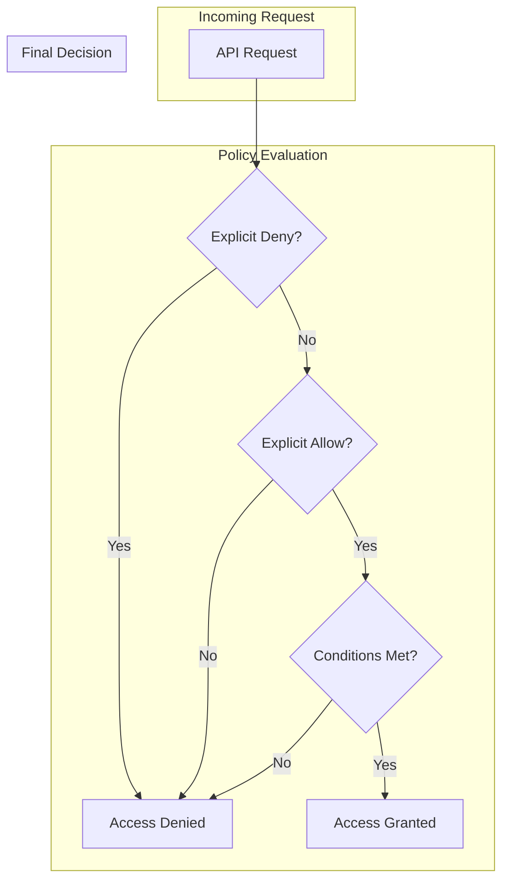
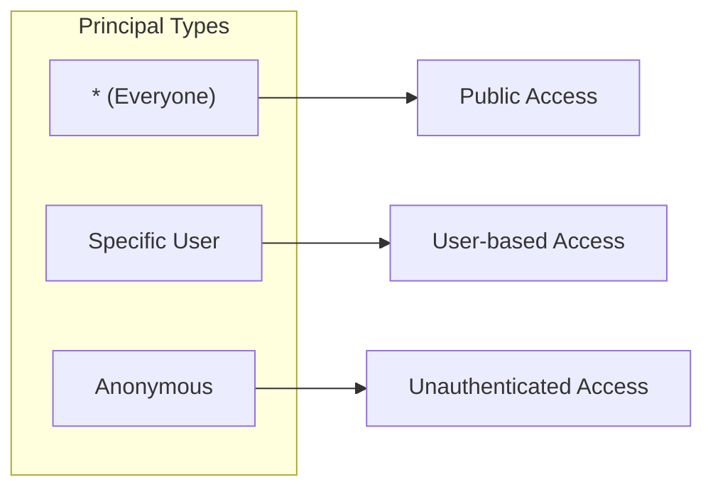
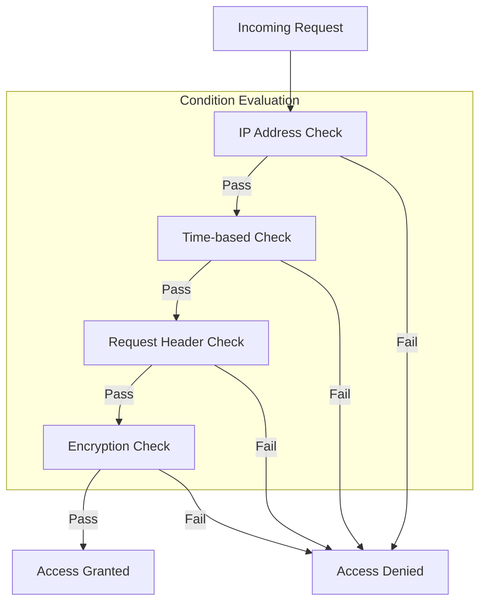

# How to Create Ceph RGW Bucket Policies

Author: [nawazdhandala](https://github.com/nawazdhandala)

Tags: Ceph, Storage, ObjectStorage, AccessControl

Description: A practical guide to implementing S3-compatible bucket policies in Ceph RADOS Gateway for fine-grained access control.

---

Ceph RADOS Gateway (RGW) provides S3-compatible object storage with full support for bucket policies. These policies let you control who can access your buckets and what actions they can perform, all without modifying your application code. If you have used AWS S3 bucket policies, you already know the syntax.

## Understanding Bucket Policies

Bucket policies are JSON documents that define access rules for a bucket and its objects. They follow the same structure as AWS IAM policies.



### Policy Structure

Every bucket policy contains these elements:

```json
{
  "Version": "2012-10-17",
  "Id": "unique-policy-id",
  "Statement": [
    {
      "Sid": "statement-identifier",
      "Effect": "Allow",
      "Principal": { "AWS": ["arn:aws:iam::account-id:user/username"] },
      "Action": ["s3:GetObject"],
      "Resource": ["arn:aws:s3:::bucket-name/*"],
      "Condition": {}
    }
  ]
}
```

## Prerequisites

Before working with bucket policies, ensure RGW is configured correctly.

### Verify RGW Installation

```bash
# Check RGW daemon status
ceph orch ps --daemon-type rgw

# Verify RGW endpoint is accessible
curl -I http://your-rgw-endpoint:7480
```

### Create Admin User with Full Permissions

```bash
# Create an admin user for policy management
radosgw-admin user create \
  --uid=admin \
  --display-name="Admin User" \
  --caps="buckets=*;users=*;usage=*;metadata=*"

# Note the access_key and secret_key from the output
```

### Configure AWS CLI for Ceph RGW

```bash
# Configure a profile for your Ceph RGW
aws configure --profile ceph
# Enter your access key, secret key
# Set region to default or your configured region

# Create an alias for convenience
alias s3ceph='aws --profile ceph --endpoint-url http://your-rgw-endpoint:7480 s3api'
```

## Basic Bucket Policies

### Public Read Access

Allow anyone to read objects in a bucket. Use this for static website hosting or public assets.

```json
{
  "Version": "2012-10-17",
  "Id": "PublicReadPolicy",
  "Statement": [
    {
      "Sid": "AllowPublicRead",
      "Effect": "Allow",
      "Principal": "*",
      "Action": [
        "s3:GetObject"
      ],
      "Resource": [
        "arn:aws:s3:::public-assets/*"
      ]
    }
  ]
}
```

Apply the policy:

```bash
# Save the policy to a file
cat > public-read-policy.json << 'EOF'
{
  "Version": "2012-10-17",
  "Id": "PublicReadPolicy",
  "Statement": [
    {
      "Sid": "AllowPublicRead",
      "Effect": "Allow",
      "Principal": "*",
      "Action": ["s3:GetObject"],
      "Resource": ["arn:aws:s3:::public-assets/*"]
    }
  ]
}
EOF

# Apply the policy to your bucket
s3ceph put-bucket-policy \
  --bucket public-assets \
  --policy file://public-read-policy.json
```

### Restrict to Specific Users

Grant specific users read and write access while denying everyone else.

```json
{
  "Version": "2012-10-17",
  "Id": "UserRestrictedAccess",
  "Statement": [
    {
      "Sid": "AllowSpecificUsers",
      "Effect": "Allow",
      "Principal": {
        "AWS": [
          "arn:aws:iam:::user/alice",
          "arn:aws:iam:::user/bob"
        ]
      },
      "Action": [
        "s3:GetObject",
        "s3:PutObject",
        "s3:DeleteObject",
        "s3:ListBucket"
      ],
      "Resource": [
        "arn:aws:s3:::team-data",
        "arn:aws:s3:::team-data/*"
      ]
    }
  ]
}
```

### Read-Only Access for a Group

Allow a group of users to only read objects, preventing modifications.

```json
{
  "Version": "2012-10-17",
  "Id": "ReadOnlyAccess",
  "Statement": [
    {
      "Sid": "AllowReadOnly",
      "Effect": "Allow",
      "Principal": {
        "AWS": [
          "arn:aws:iam:::user/viewer1",
          "arn:aws:iam:::user/viewer2",
          "arn:aws:iam:::user/viewer3"
        ]
      },
      "Action": [
        "s3:GetObject",
        "s3:GetObjectVersion",
        "s3:ListBucket",
        "s3:ListBucketVersions"
      ],
      "Resource": [
        "arn:aws:s3:::reports-bucket",
        "arn:aws:s3:::reports-bucket/*"
      ]
    }
  ]
}
```

## Principal Configuration

The Principal element specifies who the policy applies to.

### Principal Types



### Allow Everyone (Public)

```json
{
  "Principal": "*"
}
```

### Allow Specific User

```json
{
  "Principal": {
    "AWS": "arn:aws:iam:::user/username"
  }
}
```

### Allow Multiple Users

```json
{
  "Principal": {
    "AWS": [
      "arn:aws:iam:::user/alice",
      "arn:aws:iam:::user/bob",
      "arn:aws:iam:::user/charlie"
    ]
  }
}
```

### Allow by Tenant (Multi-tenancy)

```json
{
  "Principal": {
    "AWS": "arn:aws:iam::tenant-name:user/username"
  }
}
```

## Action Configuration

Actions define what operations the policy allows or denies.

### Common S3 Actions

| Action | Description |
|--------|-------------|
| `s3:GetObject` | Download objects |
| `s3:PutObject` | Upload objects |
| `s3:DeleteObject` | Delete objects |
| `s3:ListBucket` | List objects in bucket |
| `s3:GetBucketPolicy` | Read bucket policy |
| `s3:PutBucketPolicy` | Modify bucket policy |
| `s3:GetBucketAcl` | Read bucket ACL |
| `s3:PutBucketAcl` | Modify bucket ACL |
| `s3:GetObjectAcl` | Read object ACL |
| `s3:PutObjectAcl` | Modify object ACL |

### Wildcard Actions

```json
{
  "Action": "s3:*"
}
```

```json
{
  "Action": "s3:Get*"
}
```

### Upload-Only Policy

Allow users to upload but not download or list objects. Useful for log collection.

```json
{
  "Version": "2012-10-17",
  "Id": "UploadOnlyPolicy",
  "Statement": [
    {
      "Sid": "AllowUploadOnly",
      "Effect": "Allow",
      "Principal": {
        "AWS": "arn:aws:iam:::user/log-collector"
      },
      "Action": [
        "s3:PutObject"
      ],
      "Resource": [
        "arn:aws:s3:::log-bucket/*"
      ]
    }
  ]
}
```

## Resource Configuration

Resources specify which buckets and objects the policy applies to.

### Bucket-Level Resource

```json
{
  "Resource": "arn:aws:s3:::bucket-name"
}
```

### Object-Level Resource (All Objects)

```json
{
  "Resource": "arn:aws:s3:::bucket-name/*"
}
```

### Object-Level Resource (Prefix)

```json
{
  "Resource": "arn:aws:s3:::bucket-name/logs/*"
}
```

### Multiple Resources

```json
{
  "Resource": [
    "arn:aws:s3:::bucket-name",
    "arn:aws:s3:::bucket-name/*"
  ]
}
```

### Folder-Based Access Control

Give users access only to their own folder.

```json
{
  "Version": "2012-10-17",
  "Id": "FolderBasedAccess",
  "Statement": [
    {
      "Sid": "AllowListBucket",
      "Effect": "Allow",
      "Principal": {
        "AWS": "arn:aws:iam:::user/alice"
      },
      "Action": [
        "s3:ListBucket"
      ],
      "Resource": [
        "arn:aws:s3:::shared-bucket"
      ],
      "Condition": {
        "StringLike": {
          "s3:prefix": ["alice/*"]
        }
      }
    },
    {
      "Sid": "AllowUserFolder",
      "Effect": "Allow",
      "Principal": {
        "AWS": "arn:aws:iam:::user/alice"
      },
      "Action": [
        "s3:GetObject",
        "s3:PutObject",
        "s3:DeleteObject"
      ],
      "Resource": [
        "arn:aws:s3:::shared-bucket/alice/*"
      ]
    }
  ]
}
```

## Condition Keys for Fine-Grained Access

Conditions add extra requirements that must be met for the policy to apply.



### IP Address Restriction

Allow access only from specific IP ranges.

```json
{
  "Version": "2012-10-17",
  "Id": "IPRestrictionPolicy",
  "Statement": [
    {
      "Sid": "AllowFromOfficeNetwork",
      "Effect": "Allow",
      "Principal": "*",
      "Action": [
        "s3:GetObject",
        "s3:PutObject"
      ],
      "Resource": [
        "arn:aws:s3:::internal-docs/*"
      ],
      "Condition": {
        "IpAddress": {
          "aws:SourceIp": [
            "192.168.1.0/24",
            "10.0.0.0/8"
          ]
        }
      }
    }
  ]
}
```

### Deny Access from Specific IPs

Block access from known bad actors.

```json
{
  "Version": "2012-10-17",
  "Id": "IPDenyPolicy",
  "Statement": [
    {
      "Sid": "DenyBadActors",
      "Effect": "Deny",
      "Principal": "*",
      "Action": "s3:*",
      "Resource": [
        "arn:aws:s3:::sensitive-data",
        "arn:aws:s3:::sensitive-data/*"
      ],
      "Condition": {
        "IpAddress": {
          "aws:SourceIp": [
            "203.0.113.0/24"
          ]
        }
      }
    }
  ]
}
```

### Require HTTPS (Secure Transport)

Deny requests that do not use HTTPS.

```json
{
  "Version": "2012-10-17",
  "Id": "RequireHTTPS",
  "Statement": [
    {
      "Sid": "DenyInsecureTransport",
      "Effect": "Deny",
      "Principal": "*",
      "Action": "s3:*",
      "Resource": [
        "arn:aws:s3:::secure-bucket",
        "arn:aws:s3:::secure-bucket/*"
      ],
      "Condition": {
        "Bool": {
          "aws:SecureTransport": "false"
        }
      }
    }
  ]
}
```

### Time-Based Access

Allow access only during business hours (requires client to send date header).

```json
{
  "Version": "2012-10-17",
  "Id": "TimeBasedAccess",
  "Statement": [
    {
      "Sid": "AllowBusinessHours",
      "Effect": "Allow",
      "Principal": {
        "AWS": "arn:aws:iam:::user/contractor"
      },
      "Action": [
        "s3:GetObject",
        "s3:PutObject"
      ],
      "Resource": [
        "arn:aws:s3:::project-files/*"
      ],
      "Condition": {
        "DateGreaterThan": {
          "aws:CurrentTime": "2024-01-01T00:00:00Z"
        },
        "DateLessThan": {
          "aws:CurrentTime": "2024-12-31T23:59:59Z"
        }
      }
    }
  ]
}
```

### Object Size Restriction

Limit the size of objects users can upload.

```json
{
  "Version": "2012-10-17",
  "Id": "SizeRestriction",
  "Statement": [
    {
      "Sid": "LimitUploadSize",
      "Effect": "Deny",
      "Principal": "*",
      "Action": [
        "s3:PutObject"
      ],
      "Resource": [
        "arn:aws:s3:::limited-bucket/*"
      ],
      "Condition": {
        "NumericGreaterThan": {
          "s3:content-length-range": "104857600"
        }
      }
    }
  ]
}
```

### Require Server-Side Encryption

Force all uploads to use server-side encryption.

```json
{
  "Version": "2012-10-17",
  "Id": "RequireEncryption",
  "Statement": [
    {
      "Sid": "DenyUnencryptedUploads",
      "Effect": "Deny",
      "Principal": "*",
      "Action": "s3:PutObject",
      "Resource": "arn:aws:s3:::encrypted-bucket/*",
      "Condition": {
        "StringNotEquals": {
          "s3:x-amz-server-side-encryption": "AES256"
        }
      }
    }
  ]
}
```

## Cross-Account Access Policies

Allow users from different Ceph tenants (accounts) to access your buckets.

### Cross-Account Read Access

```json
{
  "Version": "2012-10-17",
  "Id": "CrossAccountRead",
  "Statement": [
    {
      "Sid": "AllowPartnerRead",
      "Effect": "Allow",
      "Principal": {
        "AWS": "arn:aws:iam::partner-tenant:user/partner-user"
      },
      "Action": [
        "s3:GetObject",
        "s3:ListBucket"
      ],
      "Resource": [
        "arn:aws:s3:::shared-data",
        "arn:aws:s3:::shared-data/*"
      ]
    }
  ]
}
```

### Cross-Account Write Access

```json
{
  "Version": "2012-10-17",
  "Id": "CrossAccountWrite",
  "Statement": [
    {
      "Sid": "AllowPartnerUpload",
      "Effect": "Allow",
      "Principal": {
        "AWS": "arn:aws:iam::partner-tenant:user/uploader"
      },
      "Action": [
        "s3:PutObject",
        "s3:PutObjectAcl"
      ],
      "Resource": [
        "arn:aws:s3:::incoming-data/*"
      ],
      "Condition": {
        "StringEquals": {
          "s3:x-amz-acl": "bucket-owner-full-control"
        }
      }
    }
  ]
}
```

### Cross-Account Full Access with IP Restriction

```json
{
  "Version": "2012-10-17",
  "Id": "CrossAccountSecure",
  "Statement": [
    {
      "Sid": "AllowPartnerFromSpecificIP",
      "Effect": "Allow",
      "Principal": {
        "AWS": "arn:aws:iam::partner-tenant:user/partner-admin"
      },
      "Action": [
        "s3:GetObject",
        "s3:PutObject",
        "s3:DeleteObject",
        "s3:ListBucket"
      ],
      "Resource": [
        "arn:aws:s3:::collaboration-bucket",
        "arn:aws:s3:::collaboration-bucket/*"
      ],
      "Condition": {
        "IpAddress": {
          "aws:SourceIp": ["203.0.113.50/32"]
        },
        "Bool": {
          "aws:SecureTransport": "true"
        }
      }
    }
  ]
}
```

## Managing Bucket Policies

### Apply a Policy

```bash
# From a file
s3ceph put-bucket-policy \
  --bucket my-bucket \
  --policy file://policy.json

# Inline (for simple policies)
s3ceph put-bucket-policy \
  --bucket my-bucket \
  --policy '{
    "Version": "2012-10-17",
    "Statement": [{
      "Effect": "Allow",
      "Principal": "*",
      "Action": "s3:GetObject",
      "Resource": "arn:aws:s3:::my-bucket/*"
    }]
  }'
```

### View Current Policy

```bash
s3ceph get-bucket-policy --bucket my-bucket
```

### Delete a Policy

```bash
s3ceph delete-bucket-policy --bucket my-bucket
```

### Validate Policy Before Applying

Use a JSON validator to check syntax:

```bash
# Check JSON syntax
cat policy.json | python3 -m json.tool

# Or use jq
jq '.' policy.json
```

## Debugging Policy Issues

### Common Problems

**Policy not taking effect:**
- Check that the bucket name in Resource matches exactly
- Verify Principal ARN format
- Ensure the policy JSON is valid

**Access denied despite Allow rule:**
- Look for explicit Deny statements (Deny always wins)
- Check condition keys match the request
- Verify user credentials are correct

### Enable RGW Debug Logging

```bash
# Increase RGW log verbosity temporarily
ceph daemon rgw.your-rgw-name config set debug_rgw 20

# Check logs
tail -f /var/log/ceph/ceph-rgw.*.log | grep -i policy

# Reset log level when done
ceph daemon rgw.your-rgw-name config set debug_rgw 1
```

### Test Policy with curl

```bash
# Test anonymous access
curl -I http://rgw-endpoint:7480/bucket-name/object-key

# Test authenticated access
aws --profile ceph --endpoint-url http://rgw-endpoint:7480 \
  s3api get-object \
  --bucket bucket-name \
  --key object-key \
  /tmp/downloaded-file
```

## Complete Example: Multi-Tier Access Control

This example demonstrates a bucket with multiple access levels.

```json
{
  "Version": "2012-10-17",
  "Id": "MultiTierAccessPolicy",
  "Statement": [
    {
      "Sid": "DenyInsecureTransport",
      "Effect": "Deny",
      "Principal": "*",
      "Action": "s3:*",
      "Resource": [
        "arn:aws:s3:::company-data",
        "arn:aws:s3:::company-data/*"
      ],
      "Condition": {
        "Bool": {
          "aws:SecureTransport": "false"
        }
      }
    },
    {
      "Sid": "AdminFullAccess",
      "Effect": "Allow",
      "Principal": {
        "AWS": [
          "arn:aws:iam:::user/admin"
        ]
      },
      "Action": "s3:*",
      "Resource": [
        "arn:aws:s3:::company-data",
        "arn:aws:s3:::company-data/*"
      ]
    },
    {
      "Sid": "DevelopersReadWrite",
      "Effect": "Allow",
      "Principal": {
        "AWS": [
          "arn:aws:iam:::user/dev1",
          "arn:aws:iam:::user/dev2",
          "arn:aws:iam:::user/dev3"
        ]
      },
      "Action": [
        "s3:GetObject",
        "s3:PutObject",
        "s3:ListBucket"
      ],
      "Resource": [
        "arn:aws:s3:::company-data",
        "arn:aws:s3:::company-data/dev/*"
      ],
      "Condition": {
        "IpAddress": {
          "aws:SourceIp": ["10.0.0.0/8"]
        }
      }
    },
    {
      "Sid": "ViewersReadOnly",
      "Effect": "Allow",
      "Principal": {
        "AWS": [
          "arn:aws:iam:::user/viewer1",
          "arn:aws:iam:::user/viewer2"
        ]
      },
      "Action": [
        "s3:GetObject",
        "s3:ListBucket"
      ],
      "Resource": [
        "arn:aws:s3:::company-data",
        "arn:aws:s3:::company-data/public/*"
      ]
    },
    {
      "Sid": "PartnerUploadOnly",
      "Effect": "Allow",
      "Principal": {
        "AWS": "arn:aws:iam::partner-tenant:user/uploader"
      },
      "Action": [
        "s3:PutObject"
      ],
      "Resource": [
        "arn:aws:s3:::company-data/incoming/*"
      ],
      "Condition": {
        "StringEquals": {
          "s3:x-amz-acl": "bucket-owner-full-control"
        }
      }
    }
  ]
}
```

## Best Practices

1. **Start with Deny, then Allow** - Use explicit Deny statements first, then layer Allow statements on top.

2. **Use Least Privilege** - Grant only the minimum permissions needed for each user or application.

3. **Avoid Principal "*" in Production** - Public access should be intentional and limited to specific actions.

4. **Always Require HTTPS** - Add a Deny statement for insecure transport on sensitive buckets.

5. **Use IP Restrictions** - Combine user-based access with IP-based restrictions for defense in depth.

6. **Document Your Policies** - Use meaningful Sid values and keep a changelog of policy modifications.

7. **Test Before Applying** - Validate JSON syntax and test policies in a non-production environment first.

8. **Audit Regularly** - Review bucket policies periodically to remove stale access grants.

---

Bucket policies give you precise control over who can access your Ceph object storage without touching application code. Combined with RGW's S3 compatibility, you get enterprise-grade access control on infrastructure you own. Start with simple policies, add conditions as needed, and always test in staging before production.
