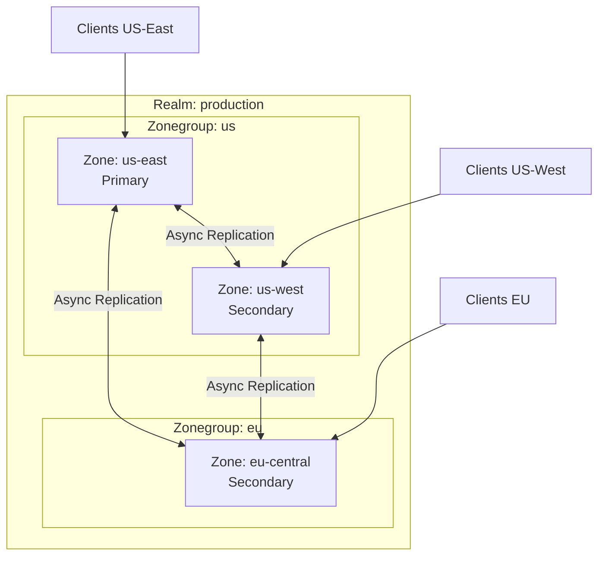
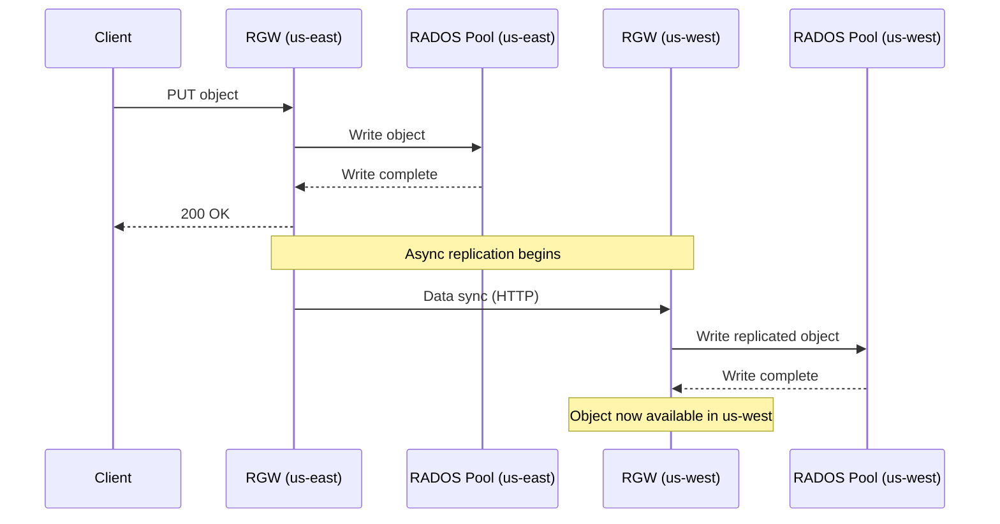
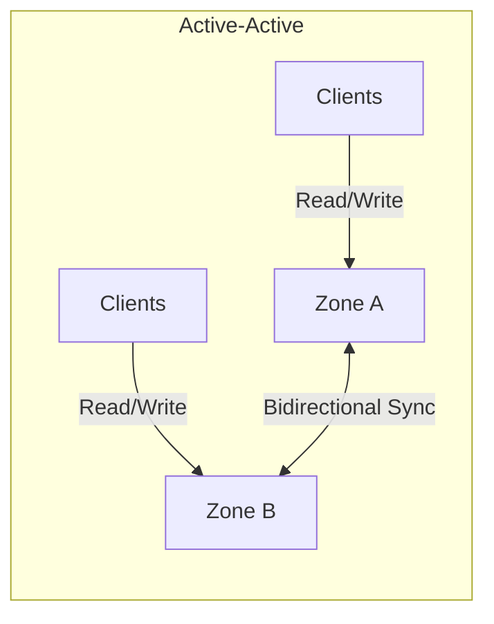
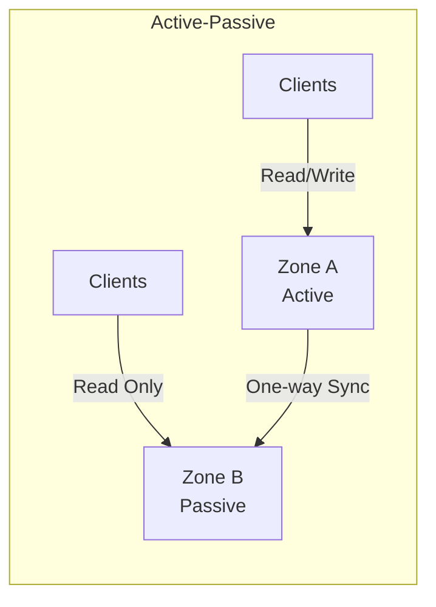
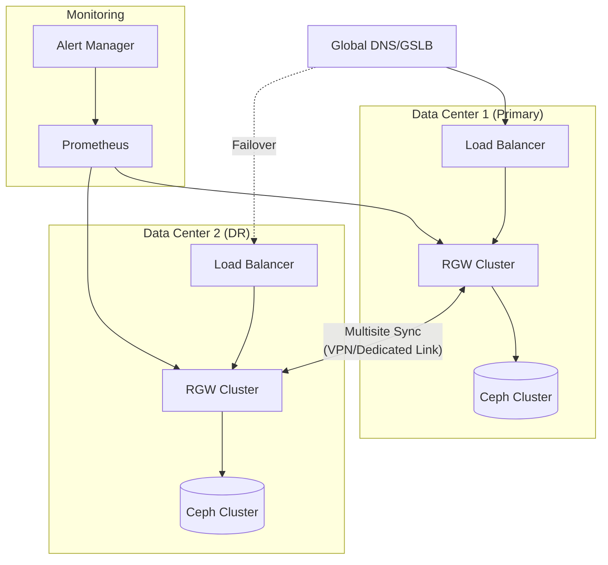

# How to Implement Ceph RGW Multisite

Author: [nawazdhandala](https://github.com/nawazdhandala)

Tags: Ceph, Storage, ObjectStorage, MultiSite

Description: A complete guide to configuring Ceph RGW multisite for geo-distributed object storage with active-active replication, failover, and disaster recovery.

---

Ceph RADOS Gateway (RGW) multisite enables geo-distributed object storage with automatic data replication across data centers. Whether you need disaster recovery, data locality, or global content distribution, RGW multisite delivers S3-compatible storage that spans regions.

## RGW Multisite Architecture

RGW multisite uses a hierarchical model with three core components:

- **Realm**: The top-level container representing your entire multisite deployment
- **Zonegroup**: A collection of zones that share the same data (analogous to a region)
- **Zone**: A cluster of RGW instances that share the same data pool



### How Replication Works

RGW multisite uses asynchronous replication. When an object is written to one zone:

1. The write completes immediately on the local zone
2. The data sync process replicates the object to other zones
3. Metadata sync ensures bucket and user information stays consistent

This model provides eventual consistency across zones while delivering low-latency writes to local clients.

## Prerequisites

Before configuring multisite, ensure you have:

- Two or more Ceph clusters with RGW deployed
- Network connectivity between clusters (typically over VPN or dedicated links)
- Synchronized time across all clusters (NTP configured)
- Sufficient bandwidth for replication traffic

## Step-by-Step Configuration

### Step 1: Create the Realm

The realm is created once and shared across all clusters. Start on your primary cluster:

```bash
# Create a new realm named 'production'
# This will be the top-level container for all zones
radosgw-admin realm create --rgw-realm=production --default

# Pull the realm configuration to verify
radosgw-admin realm get --rgw-realm=production
```

Output will show the realm ID and configuration:

```json
{
    "id": "a1b2c3d4-e5f6-7890-abcd-ef1234567890",
    "name": "production",
    "current_period": "...",
    "epoch": 1
}
```

### Step 2: Create the Master Zonegroup

The zonegroup defines which zones replicate data to each other:

```bash
# Create the master zonegroup
# --master flag designates this as the primary zonegroup
# --endpoints lists the RGW endpoints for this zone
radosgw-admin zonegroup create \
    --rgw-zonegroup=us \
    --rgw-realm=production \
    --endpoints=https://rgw-us-east.example.com:443 \
    --master \
    --default
```

### Step 3: Create the Master Zone

The master zone handles metadata operations and serves as the authoritative source:

```bash
# Create the master zone within the zonegroup
# --access-key and --secret are for the sync user
radosgw-admin zone create \
    --rgw-zonegroup=us \
    --rgw-zone=us-east \
    --endpoints=https://rgw-us-east.example.com:443 \
    --master \
    --default \
    --access-key=SYNC_ACCESS_KEY \
    --secret=SYNC_SECRET_KEY
```

### Step 4: Create the Sync User

Create a system user for replication between zones:

```bash
# Create a system user for sync operations
# This user needs caps for all metadata and data operations
radosgw-admin user create \
    --uid=sync-user \
    --display-name="Sync User" \
    --access-key=SYNC_ACCESS_KEY \
    --secret=SYNC_SECRET_KEY \
    --system

# Grant the user full capabilities
radosgw-admin caps add \
    --uid=sync-user \
    --caps="buckets=*;users=*;usage=*;metadata=*;zone=*"
```

### Step 5: Commit the Period

After making changes to the realm configuration, commit the period:

```bash
# Update the period to apply all configuration changes
# This generates a new period ID that secondary zones will pull
radosgw-admin period update --commit
```

### Step 6: Update RGW Configuration

Update your ceph.conf or the config database on the primary cluster:

```ini
[client.rgw.us-east]
rgw_realm = production
rgw_zonegroup = us
rgw_zone = us-east
rgw_frontends = beast port=8080 ssl_port=443 ssl_certificate=/etc/ceph/rgw.crt ssl_private_key=/etc/ceph/rgw.key
```

Or using the config command:

```bash
# Set configuration for the RGW daemon
ceph config set client.rgw.us-east rgw_realm production
ceph config set client.rgw.us-east rgw_zonegroup us
ceph config set client.rgw.us-east rgw_zone us-east
```

Restart the RGW daemon:

```bash
systemctl restart ceph-radosgw@rgw.us-east
```

### Step 7: Configure the Secondary Zone

On the secondary cluster, pull the realm configuration:

```bash
# Pull the realm from the master zone
# This downloads all realm, zonegroup, and zone configurations
radosgw-admin realm pull \
    --url=https://rgw-us-east.example.com:443 \
    --access-key=SYNC_ACCESS_KEY \
    --secret=SYNC_SECRET_KEY

# Set the pulled realm as default
radosgw-admin realm default --rgw-realm=production
```

Create the secondary zone:

```bash
# Create the secondary zone
# Note: no --master flag, this is a replica zone
radosgw-admin zone create \
    --rgw-zonegroup=us \
    --rgw-zone=us-west \
    --endpoints=https://rgw-us-west.example.com:443 \
    --access-key=SYNC_ACCESS_KEY \
    --secret=SYNC_SECRET_KEY

# Commit the changes
radosgw-admin period update --commit
```

Update the secondary cluster configuration:

```bash
ceph config set client.rgw.us-west rgw_realm production
ceph config set client.rgw.us-west rgw_zonegroup us
ceph config set client.rgw.us-west rgw_zone us-west

systemctl restart ceph-radosgw@rgw.us-west
```

## Multisite Replication Flow



## Active-Active vs Active-Passive Modes

### Active-Active Configuration

In active-active mode, clients can read and write to any zone. This is the default multisite behavior:



**Advantages:**
- Low latency for all clients regardless of location
- No single point of failure
- Seamless failover

**Considerations:**
- Eventual consistency between zones
- Potential for write conflicts (last-write-wins)
- Higher bandwidth requirements

### Active-Passive Configuration

For active-passive, configure the secondary zone as read-only:

```bash
# On the secondary zone, set it to read-only
radosgw-admin zone modify \
    --rgw-zone=us-west \
    --read-only

radosgw-admin period update --commit
```



**Advantages:**
- Simpler conflict resolution
- Lower bandwidth requirements
- Clear disaster recovery target

**Use cases:**
- Disaster recovery
- Compliance and data archival
- Read replicas for analytics

## Monitoring Sync Status

### Check Overall Sync Status

```bash
# View the current sync status across all zones
radosgw-admin sync status

# Example output:
#          realm production (id)
#      zonegroup us (id)
#           zone us-east (id)
#   metadata sync no sync (zone is master)
#       data sync source: us-west (id)
#                         syncing
#                         full sync: 0/128 shards
#                         incremental sync: 128/128 shards
#                         data is caught up with source
```

### Monitor Replication Lag

```bash
# Get detailed sync status including lag
radosgw-admin data sync status --source-zone=us-west

# Check for stuck sync operations
radosgw-admin data sync status --source-zone=us-west --shard-id=0
```

### Prometheus Metrics

RGW exposes metrics for monitoring sync status:

```yaml
# Prometheus scrape config for RGW metrics
scrape_configs:
  - job_name: 'ceph-rgw'
    static_configs:
      - targets:
          - 'rgw-us-east.example.com:9283'
          - 'rgw-us-west.example.com:9283'
    metrics_path: /metrics
```

Key metrics to monitor:

```promql
# Replication lag in seconds
ceph_rgw_data_sync_source_last_update_lag_seconds

# Sync errors
rate(ceph_rgw_data_sync_source_sync_errors_total[5m])

# Objects pending sync
ceph_rgw_data_sync_source_entries_behind
```

## Failover and Disaster Recovery

### Planned Failover

For maintenance or planned migration, perform a controlled failover:

```bash
# Step 1: Stop writes to the primary zone (optional but recommended)
# Configure your load balancer to stop routing traffic

# Step 2: Wait for sync to complete
radosgw-admin sync status
# Verify "data is caught up with source"

# Step 3: Promote secondary to master
radosgw-admin zone modify \
    --rgw-zone=us-west \
    --master

# Step 4: Demote the old primary
radosgw-admin zone modify \
    --rgw-zone=us-east \
    --master=false

# Step 5: Commit the changes
radosgw-admin period update --commit

# Step 6: Update DNS or load balancer to point to new primary
```

### Unplanned Failover (Disaster Recovery)

When the primary zone is unavailable:

```bash
# On the secondary zone that will become primary

# Step 1: Promote to master (force if primary is unreachable)
radosgw-admin zone modify \
    --rgw-zone=us-west \
    --master

# Step 2: Commit the period
# Use --yes-i-really-mean-it if the old master is unreachable
radosgw-admin period update --commit --yes-i-really-mean-it

# Step 3: Update client endpoints
# DNS, load balancer, or application configuration
```

### Recovery After Disaster

When the failed zone comes back online:

```bash
# On the recovered zone

# Step 1: Pull the current realm configuration
radosgw-admin realm pull \
    --url=https://rgw-us-west.example.com:443 \
    --access-key=SYNC_ACCESS_KEY \
    --secret=SYNC_SECRET_KEY

# Step 2: Re-create the zone as secondary
radosgw-admin zone create \
    --rgw-zonegroup=us \
    --rgw-zone=us-east \
    --endpoints=https://rgw-us-east.example.com:443 \
    --access-key=SYNC_ACCESS_KEY \
    --secret=SYNC_SECRET_KEY

# Step 3: Commit and restart
radosgw-admin period update --commit
systemctl restart ceph-radosgw@rgw.us-east

# Step 4: Monitor resync progress
watch radosgw-admin sync status
```

## Disaster Recovery Architecture



## Advanced Configuration

### Bucket Granular Sync

Control which buckets replicate to which zones:

```bash
# Enable sync for specific bucket only
radosgw-admin bucket sync enable \
    --bucket=critical-data \
    --source-zone=us-east

# Disable sync for a bucket (keep it local only)
radosgw-admin bucket sync disable \
    --bucket=temp-data \
    --source-zone=us-east
```

### Sync Policy Configuration

Fine-tune replication with sync policies:

```bash
# Create a sync policy group
radosgw-admin sync group create \
    --bucket=my-bucket \
    --group-id=replicate-to-dr \
    --status=enabled

# Add a pipe to specify source and destination
radosgw-admin sync group pipe create \
    --bucket=my-bucket \
    --group-id=replicate-to-dr \
    --pipe-id=to-dr \
    --source-zones=us-east \
    --dest-zones=us-west
```

### Bandwidth Throttling

Limit replication bandwidth to avoid impacting production traffic:

```bash
# Set maximum sync bandwidth (bytes per second)
ceph config set client.rgw rgw_sync_data_inject_err_probability 0
ceph config set client.rgw rgw_data_sync_spawn_window 16
ceph config set client.rgw rgw_data_sync_poll_interval 30
```

## Best Practices

1. **Use dedicated networks** for sync traffic to avoid impacting client performance
2. **Monitor sync lag** continuously and alert when it exceeds thresholds
3. **Test failover regularly** with planned DR drills
4. **Document runbooks** for both planned and unplanned failover scenarios
5. **Size bandwidth appropriately** based on your write throughput
6. **Use SSL/TLS** for all inter-zone communication
7. **Implement GSLB** for automatic client failover
8. **Keep time synchronized** across all clusters using NTP

## Troubleshooting

### Sync Stuck or Slow

```bash
# Check for errors in sync
radosgw-admin data sync status --source-zone=us-east

# Look for specific shard issues
for i in $(seq 0 127); do
    radosgw-admin data sync status --source-zone=us-east --shard-id=$i
done

# Check RGW logs for errors
journalctl -u ceph-radosgw@rgw.us-west -f | grep -i sync
```

### Metadata Sync Issues

```bash
# Check metadata sync status
radosgw-admin metadata sync status

# Force metadata sync
radosgw-admin metadata sync init
```

### Period Mismatch

```bash
# View current period
radosgw-admin period get

# Pull latest period from master
radosgw-admin period pull --url=https://master-rgw:443

# Commit to apply
radosgw-admin period update --commit
```

---

Ceph RGW multisite transforms object storage from a single-cluster solution into a globally distributed platform. Whether you need active-active deployments for performance or active-passive for disaster recovery, the flexibility of realms, zonegroups, and zones lets you design the topology that fits your requirements. Start with a simple two-zone setup, validate your replication and failover procedures, then expand as your needs grow.
