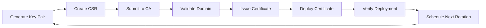
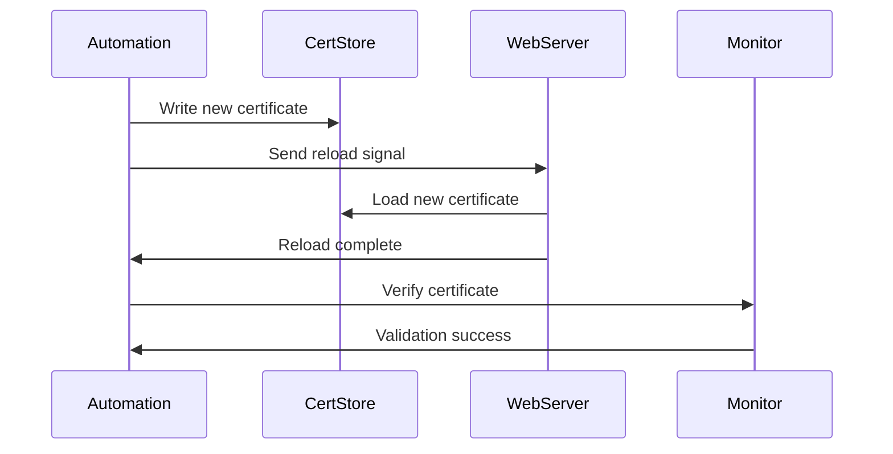
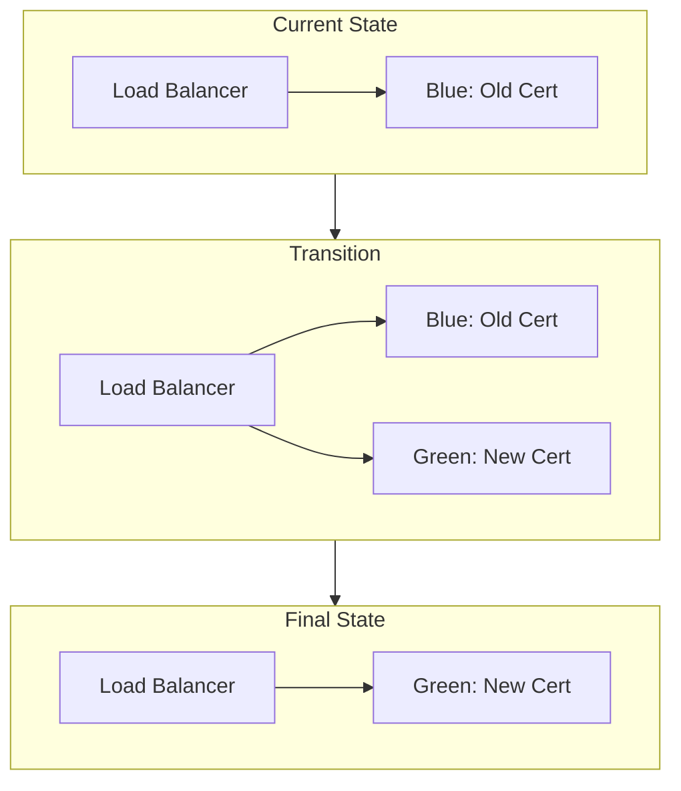
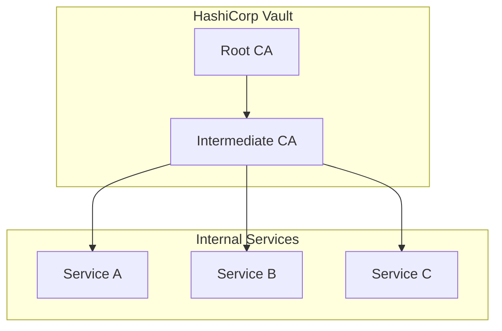

# How to Implement Certificate Rotation

Author: [nawazdhandala](https://github.com/nawazdhandala)

Tags: Security, Certificates, TLS, Automation

Description: Learn to implement certificate rotation for automated SSL/TLS certificate renewal.

---

Expired certificates cause outages. It happens to everyone, from small startups to major tech companies. The solution is automated certificate rotation, which replaces certificates before they expire without manual intervention.

This guide covers the practical implementation of certificate rotation for web services, internal services, and Kubernetes environments.

## Why Certificate Rotation Matters

Certificates have expiration dates for security reasons. Short-lived certificates limit the damage if a private key gets compromised. But shorter validity periods mean more frequent renewals, which creates operational burden.

Manual certificate management leads to predictable problems:

- Someone forgets to renew before expiration
- The person who knows the process is on vacation
- Renewal happens but deployment fails silently
- Staging certificates accidentally go to production

Automated rotation solves these issues by treating certificate renewal as code.

## Certificate Lifecycle Overview

The rotation process follows a predictable pattern. Understanding this flow helps you design reliable automation.



Each step can fail, so your automation needs error handling and alerting at every stage.

## Rotation Strategies

There are two main approaches to certificate rotation: in-place replacement and blue-green deployment.

### In-Place Replacement

The simplest approach replaces the certificate file and reloads the service. This works well for services that support hot reloading.



### Blue-Green Deployment

For services that cannot reload certificates without downtime, deploy a new instance with the new certificate, then switch traffic.



## Implementation with Certbot

Certbot from Let's Encrypt handles most of the complexity for public-facing services. Here is a production-ready setup with automatic rotation.

Install Certbot and configure it to run as a systemd timer for reliable scheduling.

```bash
# Install certbot
apt-get update && apt-get install -y certbot

# Obtain initial certificate
certbot certonly \
    --standalone \
    --non-interactive \
    --agree-tos \
    --email admin@example.com \
    --domains example.com,www.example.com
```

Create a renewal hook script that handles certificate deployment and service reload. This script runs automatically after successful renewal.

```bash
#!/bin/bash
# /etc/letsencrypt/renewal-hooks/deploy/reload-nginx.sh

# Log rotation event for auditing
logger -t certbot "Certificate renewed for $RENEWED_DOMAINS"

# Copy certificates to nginx location
cp /etc/letsencrypt/live/example.com/fullchain.pem /etc/nginx/ssl/
cp /etc/letsencrypt/live/example.com/privkey.pem /etc/nginx/ssl/

# Set proper permissions
chmod 600 /etc/nginx/ssl/privkey.pem

# Test nginx configuration before reload
nginx -t

# Reload nginx if config test passed
if [ $? -eq 0 ]; then
    systemctl reload nginx
    logger -t certbot "Nginx reloaded successfully"
else
    logger -t certbot "Nginx config test failed, skipping reload"
    exit 1
fi
```

Set up a systemd timer for regular renewal checks. Certbot only renews certificates within 30 days of expiration.

```ini
# /etc/systemd/system/certbot-renewal.timer
[Unit]
Description=Certbot Renewal Timer

[Timer]
OnCalendar=*-*-* 02:30:00
RandomizedDelaySec=3600
Persistent=true

[Install]
WantedBy=timers.target
```

```ini
# /etc/systemd/system/certbot-renewal.service
[Unit]
Description=Certbot Renewal Service
After=network-online.target

[Service]
Type=oneshot
ExecStart=/usr/bin/certbot renew --quiet
ExecStartPost=/bin/bash -c 'systemctl reload nginx || true'
```

Enable the timer to start automatic renewals.

```bash
systemctl enable --now certbot-renewal.timer
```

## Kubernetes Certificate Management with cert-manager

For Kubernetes environments, cert-manager automates certificate lifecycle management. It integrates with various certificate authorities and handles rotation automatically.

Install cert-manager using Helm for easy upgrades and configuration.

```bash
# Add the Jetstack Helm repository
helm repo add jetstack https://charts.jetstack.io
helm repo update

# Install cert-manager with CRDs
helm install cert-manager jetstack/cert-manager \
    --namespace cert-manager \
    --create-namespace \
    --set installCRDs=true
```

Create a ClusterIssuer for Let's Encrypt. This issuer handles certificate requests across all namespaces.

```yaml
# cluster-issuer.yaml
apiVersion: cert-manager.io/v1
kind: ClusterIssuer
metadata:
  name: letsencrypt-prod
spec:
  acme:
    # Production ACME server
    server: https://acme-v02.api.letsencrypt.org/directory
    email: admin@example.com
    privateKeySecretRef:
      name: letsencrypt-prod-key
    solvers:
      # HTTP-01 challenge for most use cases
      - http01:
          ingress:
            class: nginx
```

Request certificates by creating Certificate resources. cert-manager handles renewal automatically when certificates approach expiration.

```yaml
# certificate.yaml
apiVersion: cert-manager.io/v1
kind: Certificate
metadata:
  name: example-com-tls
  namespace: production
spec:
  secretName: example-com-tls-secret
  issuerRef:
    name: letsencrypt-prod
    kind: ClusterIssuer
  commonName: example.com
  dnsNames:
    - example.com
    - www.example.com
    - api.example.com
  # Renew 30 days before expiration
  renewBefore: 720h
```

Configure your Ingress to use the certificate. The secret is automatically updated when rotation occurs.

```yaml
# ingress.yaml
apiVersion: networking.k8s.io/v1
kind: Ingress
metadata:
  name: example-ingress
  namespace: production
  annotations:
    cert-manager.io/cluster-issuer: letsencrypt-prod
spec:
  ingressClassName: nginx
  tls:
    - hosts:
        - example.com
        - www.example.com
      secretName: example-com-tls-secret
  rules:
    - host: example.com
      http:
        paths:
          - path: /
            pathType: Prefix
            backend:
              service:
                name: web-service
                port:
                  number: 80
```

## Internal PKI with HashiCorp Vault

For internal services, running your own PKI gives you control over certificate policies and eliminates dependency on external services.



Enable the PKI secrets engine and configure the certificate authority.

```bash
# Enable PKI secrets engine
vault secrets enable pki

# Set maximum TTL to 10 years for root CA
vault secrets tune -max-lease-ttl=87600h pki

# Generate root certificate
vault write pki/root/generate/internal \
    common_name="Internal Root CA" \
    ttl=87600h
```

Create an intermediate CA for issuing service certificates. This limits exposure if the intermediate key is compromised.

```bash
# Enable PKI for intermediate
vault secrets enable -path=pki_int pki
vault secrets tune -max-lease-ttl=43800h pki_int

# Generate intermediate CSR
vault write -format=json pki_int/intermediate/generate/internal \
    common_name="Internal Intermediate CA" \
    | jq -r '.data.csr' > pki_intermediate.csr

# Sign with root CA
vault write -format=json pki/root/sign-intermediate \
    csr=@pki_intermediate.csr \
    format=pem_bundle \
    ttl=43800h \
    | jq -r '.data.certificate' > signed_certificate.pem

# Import signed certificate
vault write pki_int/intermediate/set-signed \
    certificate=@signed_certificate.pem
```

Create a role for issuing short-lived service certificates.

```bash
# Create role for service certificates
vault write pki_int/roles/service-cert \
    allowed_domains="internal.example.com" \
    allow_subdomains=true \
    max_ttl=72h \
    ttl=24h
```

Request certificates from your services using the Vault agent or API.

```bash
# Request certificate via API
vault write pki_int/issue/service-cert \
    common_name="api.internal.example.com" \
    ttl=24h
```

## Monitoring and Alerting

Certificate rotation should be invisible when working correctly. Set up monitoring to catch problems before they cause outages.

Create a script that checks certificate expiration and reports to your monitoring system.

```python
#!/usr/bin/env python3
# check_cert_expiry.py

import ssl
import socket
from datetime import datetime, timezone
import sys

def check_certificate(hostname, port=443):
    """Check certificate expiration for a hostname."""
    context = ssl.create_default_context()

    try:
        with socket.create_connection((hostname, port), timeout=10) as sock:
            with context.wrap_socket(sock, server_hostname=hostname) as ssock:
                cert = ssock.getpeercert()

        # Parse expiration date
        expire_date = datetime.strptime(
            cert['notAfter'],
            '%b %d %H:%M:%S %Y %Z'
        ).replace(tzinfo=timezone.utc)

        days_remaining = (expire_date - datetime.now(timezone.utc)).days

        return {
            'hostname': hostname,
            'expires': expire_date.isoformat(),
            'days_remaining': days_remaining,
            'status': 'ok' if days_remaining > 14 else 'warning'
        }

    except Exception as e:
        return {
            'hostname': hostname,
            'error': str(e),
            'status': 'error'
        }

if __name__ == '__main__':
    hosts = ['example.com', 'api.example.com', 'www.example.com']

    for host in hosts:
        result = check_certificate(host)
        print(f"{result['hostname']}: {result.get('days_remaining', 'N/A')} days")

        if result['status'] != 'ok':
            sys.exit(1)
```

## Troubleshooting Common Issues

When rotation fails, check these common causes:

**Certificate deployed but service not reloaded**: Many web servers cache certificates in memory. Verify your reload hook actually runs and succeeds.

**Permission errors on certificate files**: Private keys need restrictive permissions (600). Group readable permissions will cause some services to reject the key.

**DNS propagation delays**: ACME HTTP-01 challenges require DNS to resolve correctly. New subdomains may need time to propagate.

**Rate limits from Let's Encrypt**: Production rate limits are generous but can be hit during testing. Use the staging server for development.

Check certificate status with OpenSSL to verify correct deployment.

```bash
# Check certificate from server
echo | openssl s_client -connect example.com:443 2>/dev/null \
    | openssl x509 -noout -dates -subject

# Check local certificate file
openssl x509 -in /etc/nginx/ssl/fullchain.pem -noout -dates -subject
```

## Summary

Certificate rotation removes a common source of outages from your infrastructure. The key principles are:

- Automate everything from issuance to deployment
- Use short-lived certificates when possible
- Monitor expiration dates independently of rotation
- Test your rotation process regularly
- Keep deployment hooks idempotent

Start with Certbot for public services or cert-manager for Kubernetes. Once basic rotation works, add monitoring and gradually reduce certificate lifetimes. Your future self will thank you when you never have to explain another certificate expiration incident.
