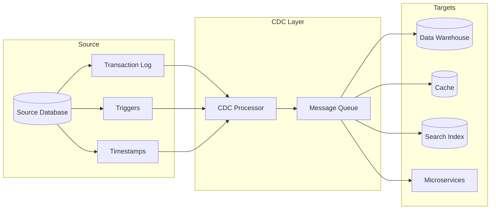
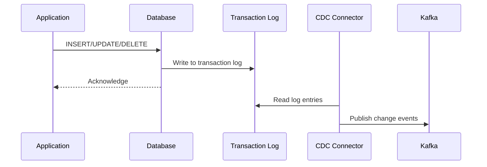
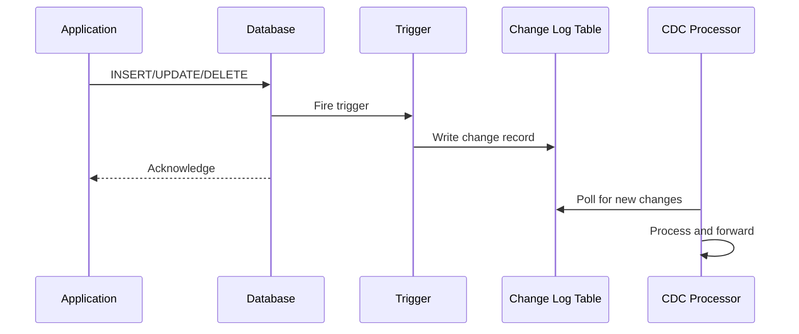
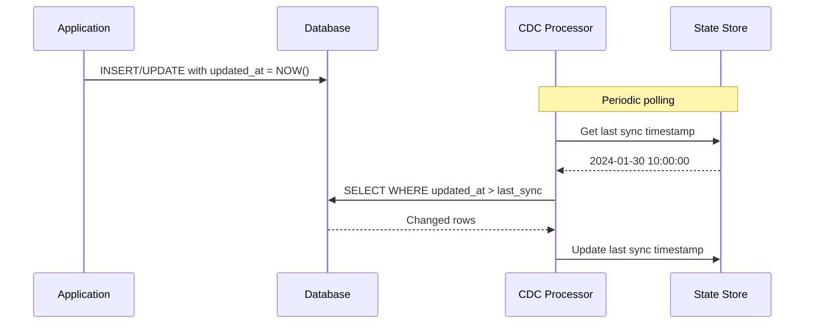
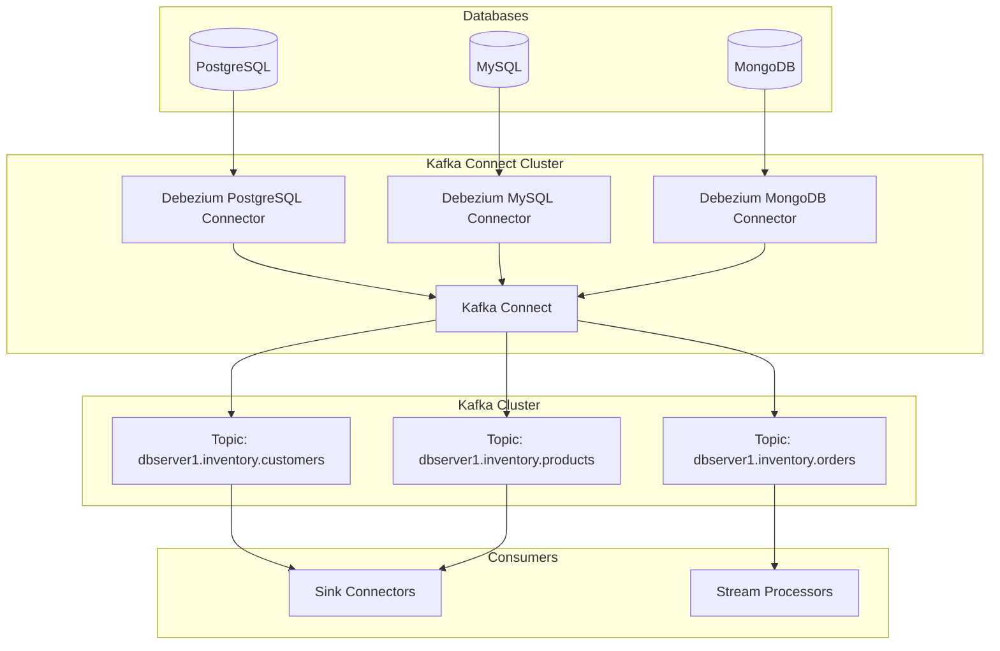
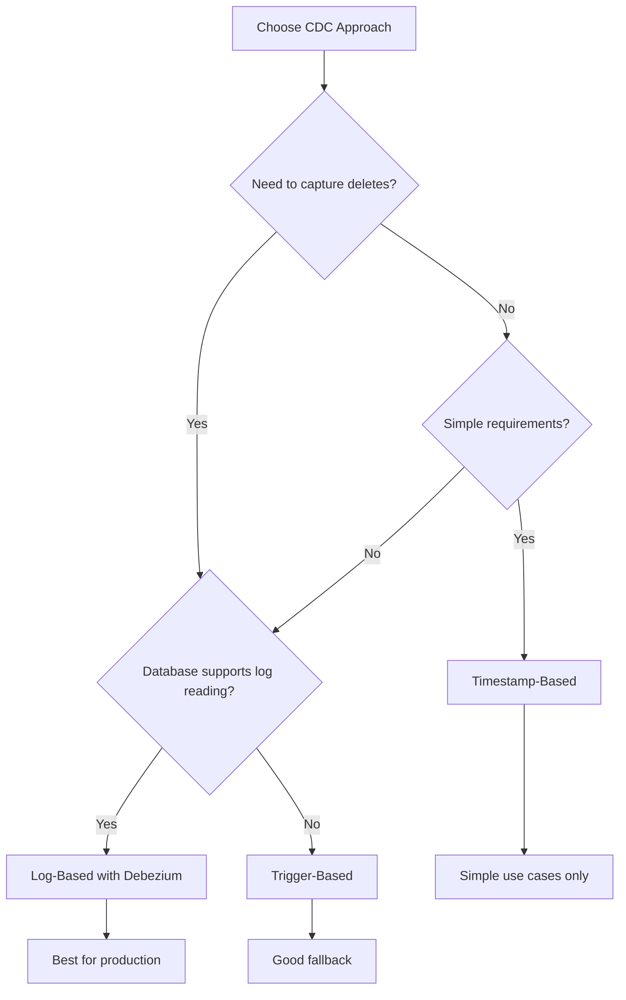

# How to Build Change Data Capture

Author: [nawazdhandala](https://github.com/nawazdhandala)

Tags: CDC, Data Pipeline, Database, Streaming

Description: Learn how to implement change data capture for real-time data synchronization.

---

Change Data Capture (CDC) is a design pattern that identifies and captures changes made to data in a database, then delivers those changes in real-time to downstream systems. Whether you are building data warehouses, synchronizing microservices, or maintaining audit logs, CDC is essential for modern data pipelines.

In this guide, we will explore three primary CDC implementation approaches: log-based, trigger-based, and timestamp-based. We will also dive into practical examples using Debezium and Kafka Connect.

## Why Change Data Capture?

Traditional batch ETL processes have significant limitations:

- **High latency**: Data can be hours or days old
- **Resource intensive**: Full table scans put load on production databases
- **Missing intermediate states**: Only captures final state, not the journey

CDC solves these problems by capturing changes as they happen, enabling:

- Real-time data synchronization
- Event-driven architectures
- Efficient incremental data loading
- Complete audit trails

## CDC Architecture Overview



## Approach 1: Log-Based CDC

Log-based CDC reads the database transaction log (also called write-ahead log, binary log, or redo log) to capture changes. This is the most efficient and least intrusive method.

### How It Works



### Advantages

- **Zero impact on source database**: Reads logs asynchronously
- **Captures all changes**: Including intermediate states
- **Preserves transaction order**: Changes are captured in commit order
- **No schema modifications required**: Works with existing tables

### Disadvantages

- **Database-specific implementation**: Each database has different log formats
- **Requires database privileges**: Need access to read transaction logs
- **Log retention limits**: Must process logs before they are purged

### Example: PostgreSQL Logical Replication

PostgreSQL supports logical replication through its Write-Ahead Log (WAL). Here is how to set it up:

```sql
-- Step 1: Configure PostgreSQL for logical replication
-- Add these settings to postgresql.conf

-- Enable logical decoding
-- wal_level = logical

-- Keep enough WAL segments for CDC
-- max_replication_slots = 4

-- Allow replication connections
-- max_wal_senders = 4

-- Step 2: Create a publication for the tables you want to track
CREATE PUBLICATION cdc_publication FOR TABLE
    customers,
    orders,
    order_items;

-- Step 3: Create a replication slot for your CDC consumer
-- This slot will track the position in the WAL
SELECT pg_create_logical_replication_slot(
    'cdc_slot',           -- Slot name
    'pgoutput'            -- Output plugin (built into PostgreSQL)
);

-- Step 4: Query changes from the replication slot
-- This returns changes since the last read
SELECT * FROM pg_logical_slot_get_changes(
    'cdc_slot',           -- Slot name
    NULL,                 -- Start LSN (NULL means from current position)
    NULL,                 -- Max number of changes (NULL means all)
    'proto_version', '1', -- Protocol version
    'publication_names', 'cdc_publication'  -- Publication to read from
);
```

### Example: MySQL Binary Log

MySQL uses binary logs for replication. Here is a Python example using the mysql-replication library:

```python
"""
MySQL Binary Log CDC Consumer

This module demonstrates how to capture changes from MySQL
binary logs using the mysql-replication library.
"""

from pymysqlreplication import BinLogStreamReader
from pymysqlreplication.row_event import (
    WriteRowsEvent,
    UpdateRowsEvent,
    DeleteRowsEvent
)
import json
from datetime import datetime
from typing import Dict, Any, Generator


def create_binlog_stream(
    host: str,
    port: int,
    user: str,
    password: str,
    schema: str,
    tables: list[str]
) -> BinLogStreamReader:
    """
    Create a binary log stream reader for CDC.

    Args:
        host: MySQL server hostname
        port: MySQL server port
        user: MySQL username with REPLICATION SLAVE privilege
        password: MySQL password
        schema: Database schema to monitor
        tables: List of table names to capture changes from

    Returns:
        BinLogStreamReader configured for the specified tables
    """
    # MySQL connection settings for replication
    mysql_settings = {
        "host": host,
        "port": port,
        "user": user,
        "passwd": password
    }

    # Create the stream reader
    # only_events filters to row-level change events
    # only_tables restricts to specific tables
    # blocking=True keeps the connection open for continuous reading
    stream = BinLogStreamReader(
        connection_settings=mysql_settings,
        server_id=100,  # Unique ID for this CDC consumer
        only_events=[
            WriteRowsEvent,   # INSERT operations
            UpdateRowsEvent,  # UPDATE operations
            DeleteRowsEvent   # DELETE operations
        ],
        only_tables=tables,
        only_schemas=[schema],
        blocking=True,  # Wait for new events
        resume_stream=True  # Resume from last position
    )

    return stream


def process_change_events(
    stream: BinLogStreamReader
) -> Generator[Dict[str, Any], None, None]:
    """
    Process binary log events and yield structured change records.

    Args:
        stream: BinLogStreamReader instance

    Yields:
        Dictionary containing change event details
    """
    for binlog_event in stream:
        # Determine the operation type based on event class
        if isinstance(binlog_event, WriteRowsEvent):
            operation = "INSERT"
        elif isinstance(binlog_event, UpdateRowsEvent):
            operation = "UPDATE"
        elif isinstance(binlog_event, DeleteRowsEvent):
            operation = "DELETE"
        else:
            continue

        # Process each row in the event
        # A single event can contain multiple row changes
        for row in binlog_event.rows:
            change_record = {
                "timestamp": datetime.utcnow().isoformat(),
                "database": binlog_event.schema,
                "table": binlog_event.table,
                "operation": operation,
                "position": {
                    "log_file": stream.log_file,
                    "log_pos": stream.log_pos
                }
            }

            # Extract row data based on operation type
            if operation == "INSERT":
                # For inserts, we only have the new values
                change_record["after"] = row["values"]
                change_record["before"] = None
            elif operation == "UPDATE":
                # For updates, we have both before and after images
                change_record["before"] = row["before_values"]
                change_record["after"] = row["after_values"]
            elif operation == "DELETE":
                # For deletes, we only have the old values
                change_record["before"] = row["values"]
                change_record["after"] = None

            yield change_record


def main():
    """Main entry point for the CDC consumer."""
    # Create the binary log stream
    stream = create_binlog_stream(
        host="localhost",
        port=3306,
        user="cdc_user",
        password="secure_password",
        schema="ecommerce",
        tables=["customers", "orders", "products"]
    )

    print("Starting CDC consumer...")
    print("Listening for changes on: customers, orders, products")

    try:
        # Process change events continuously
        for change in process_change_events(stream):
            # In production, you would publish to Kafka or another queue
            print(json.dumps(change, indent=2, default=str))
    except KeyboardInterrupt:
        print("\nShutting down CDC consumer...")
    finally:
        stream.close()


if __name__ == "__main__":
    main()
```

## Approach 2: Trigger-Based CDC

Trigger-based CDC uses database triggers to capture changes and write them to a separate changelog table.

### How It Works



### Advantages

- **Database agnostic**: Works on any database that supports triggers
- **Explicit control**: You decide exactly what to capture
- **Immediate consistency**: Changes are captured in the same transaction

### Disadvantages

- **Performance overhead**: Triggers add latency to write operations
- **Maintenance burden**: Triggers must be updated when schema changes
- **Storage costs**: Change log tables can grow large

### Example: PostgreSQL Trigger-Based CDC

```sql
-- Step 1: Create the change log table
-- This table stores all captured changes
CREATE TABLE change_log (
    id BIGSERIAL PRIMARY KEY,
    table_name VARCHAR(255) NOT NULL,
    operation VARCHAR(10) NOT NULL,  -- INSERT, UPDATE, DELETE
    old_data JSONB,                   -- Previous row state (for UPDATE/DELETE)
    new_data JSONB,                   -- New row state (for INSERT/UPDATE)
    changed_at TIMESTAMP DEFAULT CURRENT_TIMESTAMP,
    transaction_id BIGINT DEFAULT txid_current(),
    processed BOOLEAN DEFAULT FALSE   -- Flag for CDC processor
);

-- Create an index for efficient polling
CREATE INDEX idx_change_log_unprocessed
ON change_log(changed_at)
WHERE processed = FALSE;

-- Step 2: Create a generic trigger function
-- This function handles all three operations
CREATE OR REPLACE FUNCTION capture_changes()
RETURNS TRIGGER AS $$
BEGIN
    -- Handle each operation type differently
    IF TG_OP = 'INSERT' THEN
        INSERT INTO change_log (table_name, operation, new_data)
        VALUES (
            TG_TABLE_NAME,
            'INSERT',
            to_jsonb(NEW)  -- Convert the new row to JSON
        );
        RETURN NEW;

    ELSIF TG_OP = 'UPDATE' THEN
        -- Only log if data actually changed
        IF OLD IS DISTINCT FROM NEW THEN
            INSERT INTO change_log (table_name, operation, old_data, new_data)
            VALUES (
                TG_TABLE_NAME,
                'UPDATE',
                to_jsonb(OLD),  -- Previous state
                to_jsonb(NEW)   -- New state
            );
        END IF;
        RETURN NEW;

    ELSIF TG_OP = 'DELETE' THEN
        INSERT INTO change_log (table_name, operation, old_data)
        VALUES (
            TG_TABLE_NAME,
            'DELETE',
            to_jsonb(OLD)  -- Deleted row data
        );
        RETURN OLD;
    END IF;

    RETURN NULL;
END;
$$ LANGUAGE plpgsql;

-- Step 3: Attach triggers to tables you want to monitor
-- Each table needs its own trigger
CREATE TRIGGER customers_cdc_trigger
    AFTER INSERT OR UPDATE OR DELETE ON customers
    FOR EACH ROW EXECUTE FUNCTION capture_changes();

CREATE TRIGGER orders_cdc_trigger
    AFTER INSERT OR UPDATE OR DELETE ON orders
    FOR EACH ROW EXECUTE FUNCTION capture_changes();

CREATE TRIGGER products_cdc_trigger
    AFTER INSERT OR UPDATE OR DELETE ON products
    FOR EACH ROW EXECUTE FUNCTION capture_changes();

-- Step 4: Query to fetch unprocessed changes
-- Use this in your CDC processor
SELECT
    id,
    table_name,
    operation,
    old_data,
    new_data,
    changed_at,
    transaction_id
FROM change_log
WHERE processed = FALSE
ORDER BY changed_at, id
LIMIT 1000;

-- Step 5: Mark changes as processed after consumption
UPDATE change_log
SET processed = TRUE
WHERE id IN (/* list of processed IDs */);
```

### Python CDC Processor for Trigger-Based CDC

```python
"""
Trigger-Based CDC Processor

This module polls the change_log table and forwards
changes to downstream systems.
"""

import psycopg2
import psycopg2.extras
import json
import time
from typing import List, Dict, Any
from dataclasses import dataclass
from kafka import KafkaProducer


@dataclass
class ChangeEvent:
    """Represents a single change event from the database."""
    id: int
    table_name: str
    operation: str
    old_data: Dict[str, Any]
    new_data: Dict[str, Any]
    changed_at: str
    transaction_id: int


class TriggerBasedCDC:
    """
    CDC processor that polls a change log table and
    publishes events to Kafka.
    """

    def __init__(
        self,
        db_config: Dict[str, str],
        kafka_bootstrap_servers: List[str],
        poll_interval: float = 1.0,
        batch_size: int = 1000
    ):
        """
        Initialize the CDC processor.

        Args:
            db_config: PostgreSQL connection parameters
            kafka_bootstrap_servers: List of Kafka broker addresses
            poll_interval: Seconds between polls when no data found
            batch_size: Maximum changes to process per batch
        """
        self.db_config = db_config
        self.poll_interval = poll_interval
        self.batch_size = batch_size

        # Initialize Kafka producer with JSON serialization
        self.producer = KafkaProducer(
            bootstrap_servers=kafka_bootstrap_servers,
            value_serializer=lambda v: json.dumps(v, default=str).encode('utf-8'),
            key_serializer=lambda k: k.encode('utf-8') if k else None
        )

    def get_connection(self):
        """Create a new database connection."""
        return psycopg2.connect(**self.db_config)

    def fetch_changes(self, conn) -> List[ChangeEvent]:
        """
        Fetch unprocessed changes from the change log.

        Args:
            conn: Database connection

        Returns:
            List of ChangeEvent objects
        """
        query = """
            SELECT
                id,
                table_name,
                operation,
                old_data,
                new_data,
                changed_at,
                transaction_id
            FROM change_log
            WHERE processed = FALSE
            ORDER BY changed_at, id
            LIMIT %s
        """

        with conn.cursor(cursor_factory=psycopg2.extras.DictCursor) as cur:
            cur.execute(query, (self.batch_size,))
            rows = cur.fetchall()

            return [
                ChangeEvent(
                    id=row['id'],
                    table_name=row['table_name'],
                    operation=row['operation'],
                    old_data=row['old_data'],
                    new_data=row['new_data'],
                    changed_at=row['changed_at'].isoformat(),
                    transaction_id=row['transaction_id']
                )
                for row in rows
            ]

    def mark_processed(self, conn, change_ids: List[int]):
        """
        Mark changes as processed in the database.

        Args:
            conn: Database connection
            change_ids: List of change log IDs to mark
        """
        if not change_ids:
            return

        query = """
            UPDATE change_log
            SET processed = TRUE
            WHERE id = ANY(%s)
        """

        with conn.cursor() as cur:
            cur.execute(query, (change_ids,))
        conn.commit()

    def publish_to_kafka(self, change: ChangeEvent):
        """
        Publish a change event to Kafka.

        The topic is derived from the table name.
        The key is the primary key from the changed data.

        Args:
            change: ChangeEvent to publish
        """
        # Construct the topic name from table
        topic = f"cdc.{change.table_name}"

        # Extract a key from the data (assuming 'id' is primary key)
        data = change.new_data or change.old_data
        key = str(data.get('id')) if data else None

        # Build the event payload
        event = {
            "source": {
                "table": change.table_name,
                "transaction_id": change.transaction_id
            },
            "operation": change.operation,
            "timestamp": change.changed_at,
            "before": change.old_data,
            "after": change.new_data
        }

        # Send to Kafka asynchronously
        future = self.producer.send(topic, key=key, value=event)

        # Optional: wait for acknowledgment
        # future.get(timeout=10)

    def process_batch(self) -> int:
        """
        Process a single batch of changes.

        Returns:
            Number of changes processed
        """
        conn = self.get_connection()
        try:
            # Fetch pending changes
            changes = self.fetch_changes(conn)

            if not changes:
                return 0

            # Publish each change to Kafka
            for change in changes:
                self.publish_to_kafka(change)

            # Flush Kafka producer to ensure delivery
            self.producer.flush()

            # Mark all changes as processed
            change_ids = [c.id for c in changes]
            self.mark_processed(conn, change_ids)

            return len(changes)

        finally:
            conn.close()

    def run(self):
        """
        Main processing loop.

        Continuously polls for changes and processes them.
        """
        print("Starting trigger-based CDC processor...")

        while True:
            try:
                processed = self.process_batch()

                if processed > 0:
                    print(f"Processed {processed} changes")
                else:
                    # No changes found, wait before next poll
                    time.sleep(self.poll_interval)

            except KeyboardInterrupt:
                print("\nShutting down...")
                break
            except Exception as e:
                print(f"Error processing batch: {e}")
                time.sleep(self.poll_interval)

        self.producer.close()


# Usage example
if __name__ == "__main__":
    db_config = {
        "host": "localhost",
        "port": 5432,
        "database": "ecommerce",
        "user": "cdc_user",
        "password": "secure_password"
    }

    cdc = TriggerBasedCDC(
        db_config=db_config,
        kafka_bootstrap_servers=["localhost:9092"],
        poll_interval=1.0,
        batch_size=1000
    )

    cdc.run()
```

## Approach 3: Timestamp-Based CDC

Timestamp-based CDC uses a modification timestamp column to identify changed records. This is the simplest approach but has notable limitations.

### How It Works



### Advantages

- **Simple to implement**: No special database features required
- **Works everywhere**: Supported by all databases
- **Easy to understand**: Clear and straightforward logic

### Disadvantages

- **Cannot capture deletes**: Deleted rows disappear from queries
- **Requires schema changes**: Need timestamp column on every table
- **Clock skew issues**: Distributed systems may have inconsistent timestamps
- **Misses intermediate changes**: Only sees latest state at poll time

### Example: Timestamp-Based CDC Implementation

```python
"""
Timestamp-Based CDC Implementation

This approach uses updated_at columns to track changes.
Simple but cannot detect deletes without soft-delete patterns.
"""

import psycopg2
import psycopg2.extras
from datetime import datetime, timedelta
from typing import Dict, List, Any, Optional
import json
import redis


class TimestampBasedCDC:
    """
    CDC processor using timestamp-based change detection.

    Requires tables to have an 'updated_at' column that is
    automatically updated on every modification.
    """

    def __init__(
        self,
        db_config: Dict[str, str],
        redis_url: str,
        tables: List[str]
    ):
        """
        Initialize the timestamp-based CDC processor.

        Args:
            db_config: Database connection parameters
            redis_url: Redis URL for storing sync state
            tables: List of table names to monitor
        """
        self.db_config = db_config
        self.tables = tables

        # Use Redis to store the last sync timestamp per table
        # This survives restarts and can be shared across workers
        self.redis_client = redis.from_url(redis_url)

    def get_connection(self):
        """Create a database connection."""
        return psycopg2.connect(**self.db_config)

    def get_last_sync_time(self, table: str) -> datetime:
        """
        Get the last sync timestamp for a table.

        Args:
            table: Table name

        Returns:
            Last sync timestamp, or epoch if never synced
        """
        key = f"cdc:last_sync:{table}"
        value = self.redis_client.get(key)

        if value:
            return datetime.fromisoformat(value.decode('utf-8'))

        # Default to epoch (sync all historical data)
        return datetime(1970, 1, 1)

    def set_last_sync_time(self, table: str, timestamp: datetime):
        """
        Update the last sync timestamp for a table.

        Args:
            table: Table name
            timestamp: New sync timestamp
        """
        key = f"cdc:last_sync:{table}"
        self.redis_client.set(key, timestamp.isoformat())

    def fetch_changes(
        self,
        conn,
        table: str,
        since: datetime,
        batch_size: int = 1000
    ) -> List[Dict[str, Any]]:
        """
        Fetch rows modified since the given timestamp.

        Args:
            conn: Database connection
            table: Table name to query
            since: Fetch rows modified after this time
            batch_size: Maximum rows to fetch

        Returns:
            List of changed row dictionaries
        """
        # Build query dynamically
        # Note: In production, use parameterized table names carefully
        query = f"""
            SELECT *
            FROM {table}
            WHERE updated_at > %s
            ORDER BY updated_at ASC
            LIMIT %s
        """

        with conn.cursor(cursor_factory=psycopg2.extras.RealDictCursor) as cur:
            cur.execute(query, (since, batch_size))
            return [dict(row) for row in cur.fetchall()]

    def detect_deletes_with_soft_delete(
        self,
        conn,
        table: str,
        since: datetime
    ) -> List[Dict[str, Any]]:
        """
        Detect soft-deleted records.

        This requires a 'deleted_at' column in your schema.
        Records are marked deleted rather than physically removed.

        Args:
            conn: Database connection
            table: Table name
            since: Check for deletions after this time

        Returns:
            List of deleted row dictionaries
        """
        query = f"""
            SELECT *
            FROM {table}
            WHERE deleted_at IS NOT NULL
              AND deleted_at > %s
            ORDER BY deleted_at ASC
        """

        with conn.cursor(cursor_factory=psycopg2.extras.RealDictCursor) as cur:
            cur.execute(query, (since,))
            return [dict(row) for row in cur.fetchall()]

    def process_table(self, table: str) -> int:
        """
        Process changes for a single table.

        Args:
            table: Table name to process

        Returns:
            Number of changes detected
        """
        conn = self.get_connection()
        try:
            # Get the last sync point
            last_sync = self.get_last_sync_time(table)

            # Fetch changed rows
            changes = self.fetch_changes(conn, table, last_sync)

            if not changes:
                return 0

            # Process each change
            for row in changes:
                change_event = {
                    "table": table,
                    "operation": "UPSERT",  # Cannot distinguish INSERT vs UPDATE
                    "timestamp": row.get('updated_at', datetime.utcnow()).isoformat(),
                    "data": row
                }

                # Forward to downstream system
                self.forward_change(change_event)

            # Update sync timestamp to the latest updated_at
            # Add small buffer to handle clock precision
            latest = max(row['updated_at'] for row in changes)
            self.set_last_sync_time(table, latest)

            return len(changes)

        finally:
            conn.close()

    def forward_change(self, change_event: Dict[str, Any]):
        """
        Forward a change event to downstream systems.

        Override this method to implement your forwarding logic.

        Args:
            change_event: The change event to forward
        """
        # Example: Print to console
        print(json.dumps(change_event, indent=2, default=str))

    def run_once(self) -> Dict[str, int]:
        """
        Run a single sync cycle for all tables.

        Returns:
            Dictionary mapping table names to change counts
        """
        results = {}

        for table in self.tables:
            try:
                count = self.process_table(table)
                results[table] = count
            except Exception as e:
                print(f"Error processing {table}: {e}")
                results[table] = -1

        return results


# SQL schema requirements for timestamp-based CDC
SCHEMA_EXAMPLE = """
-- Every table needs these columns for timestamp-based CDC

-- The updated_at column tracks modifications
ALTER TABLE customers
ADD COLUMN updated_at TIMESTAMP DEFAULT CURRENT_TIMESTAMP;

-- Trigger to automatically update the timestamp
CREATE OR REPLACE FUNCTION update_timestamp()
RETURNS TRIGGER AS $$
BEGIN
    NEW.updated_at = CURRENT_TIMESTAMP;
    RETURN NEW;
END;
$$ LANGUAGE plpgsql;

CREATE TRIGGER customers_update_timestamp
    BEFORE UPDATE ON customers
    FOR EACH ROW EXECUTE FUNCTION update_timestamp();

-- Optional: Add soft delete support
ALTER TABLE customers
ADD COLUMN deleted_at TIMESTAMP DEFAULT NULL;

-- Create indexes for efficient CDC queries
CREATE INDEX idx_customers_updated_at ON customers(updated_at);
CREATE INDEX idx_customers_deleted_at ON customers(deleted_at)
WHERE deleted_at IS NOT NULL;
"""
```

## Production Implementation with Debezium

Debezium is the industry standard for log-based CDC. It provides connectors for PostgreSQL, MySQL, MongoDB, SQL Server, and more.

### Debezium Architecture



### Docker Compose Setup

```yaml
# docker-compose.yml
# Complete Debezium CDC stack with Kafka and PostgreSQL

version: '3.8'

services:
  # Zookeeper for Kafka coordination
  zookeeper:
    image: confluentinc/cp-zookeeper:7.5.0
    hostname: zookeeper
    container_name: zookeeper
    ports:
      - "2181:2181"
    environment:
      ZOOKEEPER_CLIENT_PORT: 2181
      ZOOKEEPER_TICK_TIME: 2000

  # Kafka message broker
  kafka:
    image: confluentinc/cp-kafka:7.5.0
    hostname: kafka
    container_name: kafka
    depends_on:
      - zookeeper
    ports:
      - "9092:9092"
      - "29092:29092"
    environment:
      KAFKA_BROKER_ID: 1
      KAFKA_ZOOKEEPER_CONNECT: 'zookeeper:2181'
      KAFKA_LISTENER_SECURITY_PROTOCOL_MAP: PLAINTEXT:PLAINTEXT,PLAINTEXT_HOST:PLAINTEXT
      KAFKA_ADVERTISED_LISTENERS: PLAINTEXT://kafka:29092,PLAINTEXT_HOST://localhost:9092
      KAFKA_OFFSETS_TOPIC_REPLICATION_FACTOR: 1
      KAFKA_GROUP_INITIAL_REBALANCE_DELAY_MS: 0
      KAFKA_TRANSACTION_STATE_LOG_MIN_ISR: 1
      KAFKA_TRANSACTION_STATE_LOG_REPLICATION_FACTOR: 1

  # PostgreSQL database with logical replication enabled
  postgres:
    image: postgres:15
    hostname: postgres
    container_name: postgres
    ports:
      - "5432:5432"
    environment:
      POSTGRES_USER: postgres
      POSTGRES_PASSWORD: postgres
      POSTGRES_DB: inventory
    command:
      - "postgres"
      - "-c"
      - "wal_level=logical"              # Enable logical decoding
      - "-c"
      - "max_replication_slots=4"        # Allow replication slots
      - "-c"
      - "max_wal_senders=4"              # Allow WAL streaming
    volumes:
      - postgres_data:/var/lib/postgresql/data
      - ./init.sql:/docker-entrypoint-initdb.d/init.sql

  # Kafka Connect with Debezium connectors
  connect:
    image: debezium/connect:2.4
    hostname: connect
    container_name: connect
    depends_on:
      - kafka
      - postgres
    ports:
      - "8083:8083"
    environment:
      BOOTSTRAP_SERVERS: kafka:29092
      GROUP_ID: 1
      CONFIG_STORAGE_TOPIC: connect_configs
      OFFSET_STORAGE_TOPIC: connect_offsets
      STATUS_STORAGE_TOPIC: connect_statuses
      CONFIG_STORAGE_REPLICATION_FACTOR: 1
      OFFSET_STORAGE_REPLICATION_FACTOR: 1
      STATUS_STORAGE_REPLICATION_FACTOR: 1

  # Kafka UI for monitoring
  kafka-ui:
    image: provectuslabs/kafka-ui:latest
    container_name: kafka-ui
    depends_on:
      - kafka
      - connect
    ports:
      - "8080:8080"
    environment:
      KAFKA_CLUSTERS_0_NAME: local
      KAFKA_CLUSTERS_0_BOOTSTRAPSERVERS: kafka:29092
      KAFKA_CLUSTERS_0_KAFKACONNECT_0_NAME: connect
      KAFKA_CLUSTERS_0_KAFKACONNECT_0_ADDRESS: http://connect:8083

volumes:
  postgres_data:
```

### Database Initialization Script

```sql
-- init.sql
-- Initialize the database with sample tables and data

-- Create the inventory schema
CREATE SCHEMA IF NOT EXISTS inventory;

-- Customers table
CREATE TABLE inventory.customers (
    id SERIAL PRIMARY KEY,
    first_name VARCHAR(255) NOT NULL,
    last_name VARCHAR(255) NOT NULL,
    email VARCHAR(255) UNIQUE NOT NULL,
    created_at TIMESTAMP DEFAULT CURRENT_TIMESTAMP,
    updated_at TIMESTAMP DEFAULT CURRENT_TIMESTAMP
);

-- Products table
CREATE TABLE inventory.products (
    id SERIAL PRIMARY KEY,
    name VARCHAR(255) NOT NULL,
    description TEXT,
    price DECIMAL(10, 2) NOT NULL,
    quantity INTEGER DEFAULT 0,
    created_at TIMESTAMP DEFAULT CURRENT_TIMESTAMP,
    updated_at TIMESTAMP DEFAULT CURRENT_TIMESTAMP
);

-- Orders table
CREATE TABLE inventory.orders (
    id SERIAL PRIMARY KEY,
    customer_id INTEGER REFERENCES inventory.customers(id),
    order_date TIMESTAMP DEFAULT CURRENT_TIMESTAMP,
    total_amount DECIMAL(10, 2),
    status VARCHAR(50) DEFAULT 'pending',
    created_at TIMESTAMP DEFAULT CURRENT_TIMESTAMP,
    updated_at TIMESTAMP DEFAULT CURRENT_TIMESTAMP
);

-- Order items table
CREATE TABLE inventory.order_items (
    id SERIAL PRIMARY KEY,
    order_id INTEGER REFERENCES inventory.orders(id),
    product_id INTEGER REFERENCES inventory.products(id),
    quantity INTEGER NOT NULL,
    unit_price DECIMAL(10, 2) NOT NULL,
    created_at TIMESTAMP DEFAULT CURRENT_TIMESTAMP
);

-- Insert sample data
INSERT INTO inventory.customers (first_name, last_name, email) VALUES
    ('John', 'Doe', 'john.doe@example.com'),
    ('Jane', 'Smith', 'jane.smith@example.com'),
    ('Bob', 'Johnson', 'bob.johnson@example.com');

INSERT INTO inventory.products (name, description, price, quantity) VALUES
    ('Laptop', 'High-performance laptop', 1299.99, 50),
    ('Mouse', 'Wireless ergonomic mouse', 49.99, 200),
    ('Keyboard', 'Mechanical keyboard', 149.99, 100);

-- Create publication for Debezium
-- This tells PostgreSQL which tables to include in logical replication
CREATE PUBLICATION dbz_publication FOR ALL TABLES;
```

### Debezium Connector Configuration

```json
{
  "name": "inventory-connector",
  "config": {
    "connector.class": "io.debezium.connector.postgresql.PostgresConnector",
    "database.hostname": "postgres",
    "database.port": "5432",
    "database.user": "postgres",
    "database.password": "postgres",
    "database.dbname": "inventory",

    "topic.prefix": "dbserver1",

    "schema.include.list": "inventory",
    "table.include.list": "inventory.customers,inventory.orders,inventory.products,inventory.order_items",

    "plugin.name": "pgoutput",
    "publication.name": "dbz_publication",
    "slot.name": "debezium_slot",

    "snapshot.mode": "initial",

    "tombstones.on.delete": "true",

    "key.converter": "org.apache.kafka.connect.json.JsonConverter",
    "key.converter.schemas.enable": "false",
    "value.converter": "org.apache.kafka.connect.json.JsonConverter",
    "value.converter.schemas.enable": "false",

    "transforms": "unwrap",
    "transforms.unwrap.type": "io.debezium.transforms.ExtractNewRecordState",
    "transforms.unwrap.drop.tombstones": "false",
    "transforms.unwrap.delete.handling.mode": "rewrite",
    "transforms.unwrap.add.fields": "op,source.ts_ms"
  }
}
```

### Deploying the Connector

```bash
#!/bin/bash
# deploy-connector.sh
# Script to deploy the Debezium connector

# Wait for Kafka Connect to be ready
echo "Waiting for Kafka Connect to start..."
while ! curl -s http://localhost:8083/connectors > /dev/null; do
    sleep 5
done
echo "Kafka Connect is ready!"

# Deploy the connector
echo "Deploying Debezium PostgreSQL connector..."
curl -X POST http://localhost:8083/connectors \
    -H "Content-Type: application/json" \
    -d @connector-config.json

echo ""
echo "Connector deployed! Check status with:"
echo "curl http://localhost:8083/connectors/inventory-connector/status"
```

### Consuming CDC Events

```python
"""
Debezium CDC Event Consumer

This module demonstrates how to consume and process
CDC events from Debezium via Kafka.
"""

from kafka import KafkaConsumer
import json
from typing import Dict, Any, Callable
from dataclasses import dataclass
from enum import Enum


class Operation(Enum):
    """CDC operation types from Debezium."""
    CREATE = "c"    # Insert
    UPDATE = "u"    # Update
    DELETE = "d"    # Delete
    READ = "r"      # Snapshot read


@dataclass
class CDCEvent:
    """
    Represents a parsed Debezium CDC event.

    Attributes:
        operation: The type of database operation
        before: Row state before the change (None for INSERT)
        after: Row state after the change (None for DELETE)
        source: Metadata about the change source
        timestamp: When the change occurred
    """
    operation: Operation
    before: Dict[str, Any]
    after: Dict[str, Any]
    source: Dict[str, Any]
    timestamp: int


class DebeziumConsumer:
    """
    Consumer for Debezium CDC events from Kafka.

    Handles event parsing and provides hooks for processing
    different operation types.
    """

    def __init__(
        self,
        bootstrap_servers: list[str],
        topics: list[str],
        group_id: str
    ):
        """
        Initialize the Debezium consumer.

        Args:
            bootstrap_servers: Kafka broker addresses
            topics: List of CDC topics to subscribe to
            group_id: Consumer group ID for offset management
        """
        self.consumer = KafkaConsumer(
            *topics,
            bootstrap_servers=bootstrap_servers,
            group_id=group_id,
            auto_offset_reset='earliest',
            enable_auto_commit=True,
            value_deserializer=lambda m: json.loads(m.decode('utf-8')) if m else None
        )

        # Handler functions for each operation type
        self.handlers: Dict[Operation, Callable[[CDCEvent], None]] = {}

    def on_create(self, handler: Callable[[CDCEvent], None]):
        """Register handler for INSERT operations."""
        self.handlers[Operation.CREATE] = handler

    def on_update(self, handler: Callable[[CDCEvent], None]):
        """Register handler for UPDATE operations."""
        self.handlers[Operation.UPDATE] = handler

    def on_delete(self, handler: Callable[[CDCEvent], None]):
        """Register handler for DELETE operations."""
        self.handlers[Operation.DELETE] = handler

    def parse_event(self, message) -> CDCEvent:
        """
        Parse a raw Kafka message into a CDCEvent.

        Debezium events have the following structure:
        {
            "before": {...},  # Previous row state
            "after": {...},   # New row state
            "source": {...},  # Change metadata
            "op": "c|u|d|r",  # Operation type
            "ts_ms": 1234567  # Timestamp
        }

        Args:
            message: Raw Kafka message

        Returns:
            Parsed CDCEvent object
        """
        value = message.value

        # Handle tombstone messages (null value for deletes)
        if value is None:
            return None

        # Parse the operation type
        op_code = value.get('op', value.get('__op'))
        operation = Operation(op_code) if op_code else Operation.READ

        return CDCEvent(
            operation=operation,
            before=value.get('before'),
            after=value.get('after'),
            source=value.get('source', {}),
            timestamp=value.get('ts_ms', 0)
        )

    def process_event(self, event: CDCEvent):
        """
        Route an event to the appropriate handler.

        Args:
            event: Parsed CDC event
        """
        if event is None:
            return

        handler = self.handlers.get(event.operation)
        if handler:
            handler(event)
        else:
            print(f"No handler for operation: {event.operation}")

    def run(self):
        """
        Start consuming and processing events.

        This method blocks and processes events continuously.
        """
        print(f"Starting consumer for topics: {self.consumer.subscription()}")

        try:
            for message in self.consumer:
                # Extract topic info for logging
                topic = message.topic
                partition = message.partition
                offset = message.offset

                # Parse and process the event
                event = self.parse_event(message)

                if event:
                    print(f"[{topic}:{partition}:{offset}] "
                          f"Operation: {event.operation.name}")
                    self.process_event(event)

        except KeyboardInterrupt:
            print("\nShutting down consumer...")
        finally:
            self.consumer.close()


# Example usage
def main():
    """Example of consuming Debezium CDC events."""

    consumer = DebeziumConsumer(
        bootstrap_servers=["localhost:9092"],
        topics=[
            "dbserver1.inventory.customers",
            "dbserver1.inventory.orders",
            "dbserver1.inventory.products"
        ],
        group_id="cdc-processor-group"
    )

    # Define handlers for each operation type
    @consumer.on_create
    def handle_create(event: CDCEvent):
        """Handle new records."""
        table = event.source.get('table', 'unknown')
        print(f"  New record in {table}:")
        print(f"    Data: {json.dumps(event.after, indent=4)}")

    @consumer.on_update
    def handle_update(event: CDCEvent):
        """Handle updated records."""
        table = event.source.get('table', 'unknown')
        print(f"  Updated record in {table}:")
        print(f"    Before: {json.dumps(event.before, indent=4)}")
        print(f"    After: {json.dumps(event.after, indent=4)}")

    @consumer.on_delete
    def handle_delete(event: CDCEvent):
        """Handle deleted records."""
        table = event.source.get('table', 'unknown')
        print(f"  Deleted record from {table}:")
        print(f"    Data: {json.dumps(event.before, indent=4)}")

    # Start processing
    consumer.run()


if __name__ == "__main__":
    main()
```

## Comparing CDC Approaches

| Feature | Log-Based | Trigger-Based | Timestamp-Based |
|---------|-----------|---------------|-----------------|
| Performance Impact | Minimal | Moderate | Minimal |
| Captures Deletes | Yes | Yes | No (without soft delete) |
| Captures All Changes | Yes | Yes | No (only latest state) |
| Schema Changes Required | No | Yes (triggers) | Yes (timestamp column) |
| Database Privileges | Replication | Standard | Standard |
| Implementation Complexity | High | Medium | Low |
| Latency | Very Low | Low | Medium (polling) |

## Best Practices

### 1. Choose the Right Approach



### 2. Handle Schema Evolution

```python
"""
Schema Evolution Handler for CDC

Demonstrates how to handle schema changes gracefully
in your CDC pipeline.
"""

from typing import Dict, Any, Optional
import json


class SchemaRegistry:
    """
    Simple schema registry for tracking table schemas.

    In production, consider using Confluent Schema Registry
    or AWS Glue Schema Registry.
    """

    def __init__(self):
        self.schemas: Dict[str, Dict[str, Any]] = {}

    def register_schema(self, table: str, schema: Dict[str, Any]):
        """Register or update a table schema."""
        version = self.schemas.get(table, {}).get('version', 0) + 1
        self.schemas[table] = {
            'version': version,
            'fields': schema,
            'previous': self.schemas.get(table)
        }

    def get_schema(self, table: str) -> Optional[Dict[str, Any]]:
        """Get the current schema for a table."""
        return self.schemas.get(table)


def handle_schema_change(
    event: Dict[str, Any],
    expected_fields: set,
    defaults: Dict[str, Any]
) -> Dict[str, Any]:
    """
    Handle events with different schemas than expected.

    This function normalizes events to match the expected schema,
    adding default values for missing fields.

    Args:
        event: The CDC event data
        expected_fields: Set of field names we expect
        defaults: Default values for missing fields

    Returns:
        Normalized event data
    """
    data = event.get('after') or event.get('before', {})

    # Check for missing fields
    missing = expected_fields - set(data.keys())

    # Check for extra fields (new columns)
    extra = set(data.keys()) - expected_fields

    if missing:
        print(f"Warning: Missing fields in event: {missing}")
        # Add default values for missing fields
        for field in missing:
            data[field] = defaults.get(field)

    if extra:
        print(f"Info: New fields detected: {extra}")
        # New fields are kept but logged for awareness

    return data
```

### 3. Implement Idempotent Processing

```python
"""
Idempotent CDC Event Processor

Ensures events can be processed multiple times safely,
which is essential for at-least-once delivery semantics.
"""

import hashlib
import json
from typing import Dict, Any, Optional
import redis


class IdempotentProcessor:
    """
    Processor that ensures each event is processed exactly once.

    Uses Redis to track processed event IDs with TTL for cleanup.
    """

    def __init__(self, redis_url: str, ttl_seconds: int = 86400):
        """
        Initialize the idempotent processor.

        Args:
            redis_url: Redis connection URL
            ttl_seconds: How long to remember processed events
        """
        self.redis = redis.from_url(redis_url)
        self.ttl = ttl_seconds

    def generate_event_id(self, event: Dict[str, Any]) -> str:
        """
        Generate a unique ID for an event.

        Combines source metadata to create a deterministic ID.

        Args:
            event: CDC event

        Returns:
            Unique event identifier
        """
        source = event.get('source', {})

        # Combine unique identifiers from the source
        id_components = [
            source.get('connector', ''),
            source.get('db', ''),
            source.get('schema', ''),
            source.get('table', ''),
            str(source.get('lsn', '')),  # Log sequence number
            str(source.get('txId', ''))  # Transaction ID
        ]

        id_string = ':'.join(id_components)
        return hashlib.sha256(id_string.encode()).hexdigest()

    def is_processed(self, event_id: str) -> bool:
        """Check if an event has already been processed."""
        return self.redis.exists(f"cdc:processed:{event_id}") > 0

    def mark_processed(self, event_id: str):
        """Mark an event as processed."""
        key = f"cdc:processed:{event_id}"
        self.redis.setex(key, self.ttl, "1")

    def process_event(
        self,
        event: Dict[str, Any],
        processor_func
    ) -> Optional[Any]:
        """
        Process an event idempotently.

        Args:
            event: CDC event to process
            processor_func: Function to call for processing

        Returns:
            Result of processor_func, or None if already processed
        """
        event_id = self.generate_event_id(event)

        # Check if already processed
        if self.is_processed(event_id):
            print(f"Skipping duplicate event: {event_id[:16]}...")
            return None

        # Process the event
        result = processor_func(event)

        # Mark as processed after successful processing
        self.mark_processed(event_id)

        return result
```

### 4. Monitor Your CDC Pipeline

```python
"""
CDC Pipeline Monitoring

Key metrics to track for a healthy CDC pipeline.
"""

from dataclasses import dataclass
from datetime import datetime
from typing import Dict
import time


@dataclass
class CDCMetrics:
    """Metrics for CDC pipeline monitoring."""

    # Throughput metrics
    events_processed: int = 0
    events_per_second: float = 0.0

    # Latency metrics
    current_lag_ms: int = 0
    max_lag_ms: int = 0
    avg_processing_time_ms: float = 0.0

    # Error metrics
    errors_total: int = 0
    errors_per_minute: float = 0.0

    # Position metrics
    last_processed_lsn: str = ""
    last_processed_timestamp: datetime = None


class CDCMonitor:
    """
    Monitor for CDC pipeline health.

    Tracks key metrics and provides alerting hooks.
    """

    def __init__(self, lag_threshold_ms: int = 30000):
        """
        Initialize the monitor.

        Args:
            lag_threshold_ms: Alert if lag exceeds this (default 30s)
        """
        self.metrics = CDCMetrics()
        self.lag_threshold = lag_threshold_ms
        self.start_time = time.time()
        self.processing_times = []

    def record_event_processed(
        self,
        event_timestamp_ms: int,
        processing_time_ms: float
    ):
        """
        Record that an event was processed.

        Args:
            event_timestamp_ms: When the change occurred (from source)
            processing_time_ms: How long processing took
        """
        now_ms = int(time.time() * 1000)

        # Update counts
        self.metrics.events_processed += 1

        # Calculate lag (time from change to processing)
        lag = now_ms - event_timestamp_ms
        self.metrics.current_lag_ms = lag
        self.metrics.max_lag_ms = max(self.metrics.max_lag_ms, lag)

        # Track processing times for average
        self.processing_times.append(processing_time_ms)
        if len(self.processing_times) > 1000:
            self.processing_times = self.processing_times[-1000:]

        self.metrics.avg_processing_time_ms = (
            sum(self.processing_times) / len(self.processing_times)
        )

        # Calculate throughput
        elapsed = time.time() - self.start_time
        self.metrics.events_per_second = self.metrics.events_processed / elapsed

        # Check for alerts
        self._check_alerts()

    def record_error(self, error: Exception):
        """Record a processing error."""
        self.metrics.errors_total += 1

    def _check_alerts(self):
        """Check if any alert conditions are met."""
        if self.metrics.current_lag_ms > self.lag_threshold:
            print(f"ALERT: CDC lag is {self.metrics.current_lag_ms}ms "
                  f"(threshold: {self.lag_threshold}ms)")

    def get_metrics(self) -> Dict:
        """Get current metrics as a dictionary."""
        return {
            "events_processed": self.metrics.events_processed,
            "events_per_second": round(self.metrics.events_per_second, 2),
            "current_lag_ms": self.metrics.current_lag_ms,
            "max_lag_ms": self.metrics.max_lag_ms,
            "avg_processing_time_ms": round(self.metrics.avg_processing_time_ms, 2),
            "errors_total": self.metrics.errors_total
        }
```

## Conclusion

Change Data Capture is a powerful pattern for building real-time data pipelines. Here is a summary of what we covered:

1. **Log-based CDC** is the gold standard for production systems. Use Debezium with Kafka Connect for a battle-tested solution.

2. **Trigger-based CDC** is a good alternative when log access is not available or when you need custom capture logic.

3. **Timestamp-based CDC** is the simplest approach but has significant limitations. Use it only for simple use cases where you do not need to track deletes.

4. **Best practices** include handling schema evolution, implementing idempotent processing, and monitoring your pipeline closely.

The code examples in this post provide a foundation for building your own CDC pipeline. Start with Debezium for most use cases, and customize as needed for your specific requirements.

## Further Reading

- [Debezium Documentation](https://debezium.io/documentation/)
- [Kafka Connect Documentation](https://kafka.apache.org/documentation/#connect)
- [PostgreSQL Logical Replication](https://www.postgresql.org/docs/current/logical-replication.html)
- [MySQL Binary Log](https://dev.mysql.com/doc/refman/8.0/en/binary-log.html)
