# How to Build Change Failure Rate

Author: [nawazdhandala](https://github.com/nawazdhandala)

Tags: DevOps, DORA Metrics, Change Failure Rate, Quality

Description: Learn to implement change failure rate tracking with deployment correlation, incident linking, and root cause analysis for release quality improvement.

---

Change Failure Rate (CFR) measures what percentage of your deployments cause problems. It is one of four DORA metrics that predict software delivery performance. A high CFR means your releases frequently break production. A low CFR means your deployment pipeline is producing reliable changes.

This guide shows you how to build a CFR tracking system from scratch - defining what counts as a failure, correlating deployments with incidents, calculating the metric, and using it to improve.

## What Is Change Failure Rate?


The formula is simple:

```
Change Failure Rate = (Failed Deployments / Total Deployments) * 100
```

DORA benchmarks:
- Elite: 0-15%
- High: 16-30%
- Medium: 31-45%
- Low: 46-60%+

## Step 1: Define What Counts as a Failure

The hardest part of CFR is agreeing on what "failure" means. Different teams define it differently.

### Common Failure Definitions


| Definition | Pros | Cons |
|------------|------|------|
| **Rollback triggered** | Unambiguous, easy to track | Misses partial failures, teams may avoid rollbacks |
| **Hotfix deployed within 24h** | Captures quick fixes | Hotfixes can be improvements, not failures |
| **Incident created** | Links to existing process | Depends on incident discipline |
| **SLO breach within window** | Objective, measurable | May catch unrelated issues |
| **Any of the above** | Comprehensive | More complex to implement |

### Recommended Approach

Use a composite definition with severity weighting:

```typescript
interface DeploymentOutcome {
  deploymentId: string;
  timestamp: Date;
  service: string;

  // Failure indicators
  rollbackTriggered: boolean;
  hotfixWithin24h: boolean;
  incidentLinked: boolean;
  sloBreachWithinWindow: boolean;

  // Severity
  failureSeverity: 'none' | 'minor' | 'major' | 'critical';
}

function classifyDeployment(outcome: DeploymentOutcome): boolean {
  // Critical: automatic failure
  if (outcome.rollbackTriggered) return true;

  // Major: failure if incident is Sev1 or Sev2
  if (outcome.incidentLinked && outcome.failureSeverity !== 'minor') {
    return true;
  }

  // SLO breach during detection window
  if (outcome.sloBreachWithinWindow) return true;

  // Hotfix alone might not be a failure - depends on context
  // Consider: was it fixing a regression or adding a feature?
  if (outcome.hotfixWithin24h && outcome.incidentLinked) {
    return true;
  }

  return false;
}
```

### Detection Window

How long after a deployment do you look for failures?

```mermaid
gantt
    title Detection Window Options
    dateFormat HH:mm
    axisFormat %H:%M

    section Deploy
    Deployment : milestone, 00:00, 0h

    section 1h Window
    Short detection : 00:00, 1h

    section 4h Window
    Medium detection : 00:00, 4h

    section 24h Window
    Long detection : 00:00, 24h
```



- **1-4 hours**: Catches immediate issues, fast feedback
- **24 hours**: Catches delayed problems, may include unrelated issues
- **Until next deploy**: Natural boundary, variable length

Start with 4 hours for web services. Adjust based on your typical incident detection time.

## Step 2: Track Deployments

You need a deployment registry that captures every production change.

### Deployment Event Schema

```typescript
interface DeploymentEvent {
  // Identity
  id: string;
  timestamp: Date;

  // What changed
  service: string;
  environment: string;
  version: string;
  commitSha: string;

  // Who and how
  deployer: string;
  deployMethod: 'ci' | 'manual' | 'rollback' | 'hotfix';

  // Context
  prNumber?: number;
  changeDescription: string;
  changedFiles: number;

  // Outcome (updated later)
  status: 'in_progress' | 'succeeded' | 'failed' | 'rolled_back';
  failureReason?: string;
}
```

### CI/CD Integration

Send deployment events from your pipeline:

```yaml
# GitHub Actions example
name: Deploy

on:
  push:
    branches: [main]

jobs:
  deploy:
    runs-on: ubuntu-latest
    steps:
      - name: Record deployment start
        run: |
          curl -X POST "${{ secrets.METRICS_API }}/deployments" \
            -H "Content-Type: application/json" \
            -d '{
              "id": "${{ github.run_id }}",
              "timestamp": "'$(date -u +%Y-%m-%dT%H:%M:%SZ)'",
              "service": "${{ github.repository }}",
              "environment": "production",
              "version": "${{ github.sha }}",
              "commitSha": "${{ github.sha }}",
              "deployer": "${{ github.actor }}",
              "deployMethod": "ci",
              "prNumber": ${{ github.event.pull_request.number || 'null' }},
              "status": "in_progress"
            }'

      - name: Deploy application
        run: ./deploy.sh

      - name: Record deployment success
        if: success()
        run: |
          curl -X PATCH "${{ secrets.METRICS_API }}/deployments/${{ github.run_id }}" \
            -H "Content-Type: application/json" \
            -d '{"status": "succeeded"}'

      - name: Record deployment failure
        if: failure()
        run: |
          curl -X PATCH "${{ secrets.METRICS_API }}/deployments/${{ github.run_id }}" \
            -H "Content-Type: application/json" \
            -d '{"status": "failed", "failureReason": "deploy_script_failed"}'
```

### Kubernetes Deployment Tracking

For Kubernetes, use a webhook or controller:

```typescript
// Deployment watcher using @kubernetes/client-node
import * as k8s from '@kubernetes/client-node';

const kc = new k8s.KubeConfig();
kc.loadFromDefault();

const watch = new k8s.Watch(kc);

async function watchDeployments() {
  await watch.watch(
    '/apis/apps/v1/deployments',
    { allowWatchBookmarks: true },
    (type, deployment) => {
      if (type === 'MODIFIED' && isNewRevision(deployment)) {
        recordDeployment({
          id: `${deployment.metadata.namespace}-${deployment.metadata.name}-${deployment.metadata.generation}`,
          timestamp: new Date(),
          service: deployment.metadata.name,
          environment: deployment.metadata.namespace,
          version: deployment.spec.template.spec.containers[0].image,
          commitSha: deployment.metadata.annotations?.['app.kubernetes.io/commit'] || 'unknown',
          deployer: deployment.metadata.annotations?.['app.kubernetes.io/deployer'] || 'unknown',
          deployMethod: detectDeployMethod(deployment),
          status: 'in_progress'
        });
      }
    },
    (err) => console.error('Watch error:', err)
  );
}

function isNewRevision(deployment: k8s.V1Deployment): boolean {
  const observedGeneration = deployment.status?.observedGeneration || 0;
  const generation = deployment.metadata?.generation || 0;
  return generation > observedGeneration;
}

function detectDeployMethod(deployment: k8s.V1Deployment): string {
  const annotations = deployment.metadata?.annotations || {};
  if (annotations['argocd.argoproj.io/hook']) return 'ci';
  if (annotations['rollback']) return 'rollback';
  return 'ci';
}
```

## Step 3: Correlate Deployments with Incidents

The core challenge: linking incidents back to the deployment that caused them.


### Correlation Algorithm

```typescript
interface Incident {
  id: string;
  createdAt: Date;
  resolvedAt?: Date;
  severity: 'sev1' | 'sev2' | 'sev3' | 'sev4';
  affectedServices: string[];
  rootCause?: string;
  linkedDeploymentId?: string;
}

interface CorrelationResult {
  deploymentId: string;
  confidence: 'high' | 'medium' | 'low';
  reason: string;
}

function correlateIncidentToDeployment(
  incident: Incident,
  deployments: DeploymentEvent[],
  windowHours: number = 4
): CorrelationResult | null {
  const windowStart = new Date(
    incident.createdAt.getTime() - windowHours * 60 * 60 * 1000
  );

  // Find deployments in window for affected services
  const candidates = deployments.filter(d =>
    d.timestamp >= windowStart &&
    d.timestamp <= incident.createdAt &&
    incident.affectedServices.includes(d.service) &&
    d.status !== 'failed' // Exclude already-failed deploys
  );

  if (candidates.length === 0) return null;

  // Sort by proximity to incident (most recent first)
  candidates.sort((a, b) =>
    b.timestamp.getTime() - a.timestamp.getTime()
  );

  const closest = candidates[0];
  const timeDiffMinutes =
    (incident.createdAt.getTime() - closest.timestamp.getTime()) / 60000;

  // Determine confidence based on timing and context
  let confidence: 'high' | 'medium' | 'low';
  let reason: string;

  if (timeDiffMinutes <= 30) {
    confidence = 'high';
    reason = `Incident occurred ${Math.round(timeDiffMinutes)} minutes after deployment`;
  } else if (timeDiffMinutes <= 120) {
    confidence = 'medium';
    reason = `Incident occurred ${Math.round(timeDiffMinutes)} minutes after deployment`;
  } else {
    confidence = 'low';
    reason = `Deployment found within window but ${Math.round(timeDiffMinutes)} minutes before incident`;
  }

  // Boost confidence if rollback or hotfix followed
  if (closest.status === 'rolled_back') {
    confidence = 'high';
    reason = 'Deployment was rolled back after incident';
  }

  return {
    deploymentId: closest.id,
    confidence,
    reason
  };
}
```

### Rollback Detection

Detect when a deployment triggers a rollback:

```typescript
function detectRollback(deployments: DeploymentEvent[]): void {
  // Sort by timestamp
  const sorted = [...deployments].sort(
    (a, b) => a.timestamp.getTime() - b.timestamp.getTime()
  );

  for (let i = 1; i < sorted.length; i++) {
    const current = sorted[i];
    const previous = sorted[i - 1];

    // Check if current deploy is a rollback of previous
    if (
      current.service === previous.service &&
      current.deployMethod === 'rollback'
    ) {
      // Mark the previous deployment as rolled back
      previous.status = 'rolled_back';
      previous.failureReason = 'rollback_triggered';

      // Time between deploy and rollback
      const rollbackTime =
        current.timestamp.getTime() - previous.timestamp.getTime();
      console.log(
        `Rollback detected: ${previous.id} rolled back after ${rollbackTime / 60000} minutes`
      );
    }

    // Detect version rollback (even without explicit rollback flag)
    if (
      current.service === previous.service &&
      isOlderVersion(current.version, previous.version)
    ) {
      previous.status = 'rolled_back';
      previous.failureReason = 'version_rollback';
    }
  }
}

function isOlderVersion(current: string, previous: string): boolean {
  // Simple semver check - customize for your versioning scheme
  const currentParts = current.split('.').map(Number);
  const previousParts = previous.split('.').map(Number);

  for (let i = 0; i < Math.max(currentParts.length, previousParts.length); i++) {
    const c = currentParts[i] || 0;
    const p = previousParts[i] || 0;
    if (c < p) return true;
    if (c > p) return false;
  }
  return false;
}
```

## Step 4: Calculate and Store CFR

### Time-Series Calculation

```typescript
interface CFRDataPoint {
  timestamp: Date;
  window: 'daily' | 'weekly' | 'monthly';
  service?: string;

  totalDeployments: number;
  failedDeployments: number;
  changeFailureRate: number;

  // Breakdown
  rollbacks: number;
  hotfixes: number;
  incidentLinked: number;
}

function calculateCFR(
  deployments: DeploymentEvent[],
  window: 'daily' | 'weekly' | 'monthly',
  service?: string
): CFRDataPoint[] {
  // Filter by service if specified
  let filtered = service
    ? deployments.filter(d => d.service === service)
    : deployments;

  // Group by time window
  const groups = groupByWindow(filtered, window);

  return Object.entries(groups).map(([timestamp, deploys]) => {
    const failed = deploys.filter(d =>
      d.status === 'rolled_back' ||
      d.status === 'failed' ||
      d.failureReason
    );

    const rollbacks = failed.filter(d => d.status === 'rolled_back').length;
    const hotfixes = failed.filter(d => d.deployMethod === 'hotfix').length;
    const incidentLinked = failed.filter(d => d.failureReason?.includes('incident')).length;

    return {
      timestamp: new Date(timestamp),
      window,
      service,
      totalDeployments: deploys.length,
      failedDeployments: failed.length,
      changeFailureRate: deploys.length > 0
        ? (failed.length / deploys.length) * 100
        : 0,
      rollbacks,
      hotfixes,
      incidentLinked
    };
  });
}

function groupByWindow(
  deployments: DeploymentEvent[],
  window: 'daily' | 'weekly' | 'monthly'
): Record<string, DeploymentEvent[]> {
  const groups: Record<string, DeploymentEvent[]> = {};

  for (const deploy of deployments) {
    let key: string;
    const d = deploy.timestamp;

    switch (window) {
      case 'daily':
        key = `${d.getFullYear()}-${d.getMonth() + 1}-${d.getDate()}`;
        break;
      case 'weekly':
        const weekStart = new Date(d);
        weekStart.setDate(d.getDate() - d.getDay());
        key = weekStart.toISOString().split('T')[0];
        break;
      case 'monthly':
        key = `${d.getFullYear()}-${d.getMonth() + 1}`;
        break;
    }

    if (!groups[key]) groups[key] = [];
    groups[key].push(deploy);
  }

  return groups;
}
```

### Database Schema

```sql
-- Deployments table
CREATE TABLE deployments (
  id VARCHAR(255) PRIMARY KEY,
  timestamp TIMESTAMP NOT NULL,
  service VARCHAR(255) NOT NULL,
  environment VARCHAR(50) NOT NULL,
  version VARCHAR(255) NOT NULL,
  commit_sha VARCHAR(40),
  deployer VARCHAR(255),
  deploy_method VARCHAR(50),
  pr_number INTEGER,
  change_description TEXT,
  changed_files INTEGER,
  status VARCHAR(50) DEFAULT 'in_progress',
  failure_reason TEXT,
  created_at TIMESTAMP DEFAULT CURRENT_TIMESTAMP,
  updated_at TIMESTAMP DEFAULT CURRENT_TIMESTAMP
);

-- Indexes for common queries
CREATE INDEX idx_deployments_timestamp ON deployments(timestamp);
CREATE INDEX idx_deployments_service ON deployments(service);
CREATE INDEX idx_deployments_status ON deployments(status);

-- CFR aggregates (materialized for performance)
CREATE TABLE cfr_daily (
  date DATE NOT NULL,
  service VARCHAR(255),
  total_deployments INTEGER NOT NULL,
  failed_deployments INTEGER NOT NULL,
  change_failure_rate DECIMAL(5,2) NOT NULL,
  rollbacks INTEGER DEFAULT 0,
  hotfixes INTEGER DEFAULT 0,
  incident_linked INTEGER DEFAULT 0,
  PRIMARY KEY (date, service)
);

-- Incident-deployment links
CREATE TABLE incident_deployment_links (
  incident_id VARCHAR(255) NOT NULL,
  deployment_id VARCHAR(255) NOT NULL,
  confidence VARCHAR(20) NOT NULL,
  reason TEXT,
  linked_at TIMESTAMP DEFAULT CURRENT_TIMESTAMP,
  PRIMARY KEY (incident_id, deployment_id),
  FOREIGN KEY (deployment_id) REFERENCES deployments(id)
);
```

## Step 5: Build Trending and Visualization

### CFR Dashboard Data

```typescript
interface CFRDashboard {
  // Current state
  currentCFR: number;
  trend: 'improving' | 'stable' | 'degrading';

  // Historical
  history: CFRDataPoint[];

  // Breakdown
  byService: Array<{
    service: string;
    cfr: number;
    deployments: number;
  }>;

  // Recent failures
  recentFailures: Array<{
    deploymentId: string;
    service: string;
    timestamp: Date;
    reason: string;
    incidentId?: string;
  }>;
}

async function getDashboardData(
  days: number = 30
): Promise<CFRDashboard> {
  const endDate = new Date();
  const startDate = new Date();
  startDate.setDate(startDate.getDate() - days);

  const deployments = await getDeployments(startDate, endDate);
  const history = calculateCFR(deployments, 'daily');

  // Calculate current CFR (last 7 days)
  const recent = deployments.filter(d =>
    d.timestamp >= new Date(Date.now() - 7 * 24 * 60 * 60 * 1000)
  );
  const recentFailed = recent.filter(d =>
    d.status === 'rolled_back' || d.failureReason
  );
  const currentCFR = recent.length > 0
    ? (recentFailed.length / recent.length) * 100
    : 0;

  // Determine trend (compare to previous period)
  const previousWeek = deployments.filter(d => {
    const ts = d.timestamp.getTime();
    const oneWeekAgo = Date.now() - 7 * 24 * 60 * 60 * 1000;
    const twoWeeksAgo = Date.now() - 14 * 24 * 60 * 60 * 1000;
    return ts >= twoWeeksAgo && ts < oneWeekAgo;
  });
  const previousFailed = previousWeek.filter(d =>
    d.status === 'rolled_back' || d.failureReason
  );
  const previousCFR = previousWeek.length > 0
    ? (previousFailed.length / previousWeek.length) * 100
    : 0;

  let trend: 'improving' | 'stable' | 'degrading';
  if (currentCFR < previousCFR - 5) trend = 'improving';
  else if (currentCFR > previousCFR + 5) trend = 'degrading';
  else trend = 'stable';

  // Group by service
  const serviceMap = new Map<string, { total: number; failed: number }>();
  for (const d of recent) {
    const entry = serviceMap.get(d.service) || { total: 0, failed: 0 };
    entry.total++;
    if (d.status === 'rolled_back' || d.failureReason) entry.failed++;
    serviceMap.set(d.service, entry);
  }

  const byService = Array.from(serviceMap.entries())
    .map(([service, data]) => ({
      service,
      cfr: data.total > 0 ? (data.failed / data.total) * 100 : 0,
      deployments: data.total
    }))
    .sort((a, b) => b.cfr - a.cfr);

  // Recent failures
  const recentFailures = recentFailed
    .sort((a, b) => b.timestamp.getTime() - a.timestamp.getTime())
    .slice(0, 10)
    .map(d => ({
      deploymentId: d.id,
      service: d.service,
      timestamp: d.timestamp,
      reason: d.failureReason || 'Unknown',
      incidentId: undefined // Would come from incident_deployment_links
    }));

  return {
    currentCFR,
    trend,
    history,
    byService,
    recentFailures
  };
}
```

### Visualization with Mermaid

Weekly CFR trend visualization:


## Step 6: Root Cause Analysis

Track why deployments fail to drive improvements.

### Failure Categories


### Root Cause Tracking

```typescript
type FailureCategory =
  | 'configuration_error'
  | 'code_bug'
  | 'infrastructure'
  | 'dependency_failure'
  | 'performance_regression'
  | 'security_issue'
  | 'data_issue'
  | 'unknown';

interface FailureAnalysis {
  deploymentId: string;
  category: FailureCategory;
  subcategory?: string;
  description: string;

  // What fixed it
  resolution: 'rollback' | 'hotfix' | 'config_change' | 'manual_intervention';
  resolutionTime: number; // minutes

  // Prevention
  preventable: boolean;
  preventionSuggestion?: string;
}

async function analyzeFailure(
  deployment: DeploymentEvent,
  incident?: Incident
): Promise<FailureAnalysis> {
  // Auto-categorize based on signals
  let category: FailureCategory = 'unknown';
  let subcategory: string | undefined;

  if (incident?.rootCause) {
    // Parse from incident postmortem
    const rootCause = incident.rootCause.toLowerCase();

    if (rootCause.includes('config') || rootCause.includes('env')) {
      category = 'configuration_error';
      subcategory = rootCause.includes('env') ? 'environment_variable' : 'config_file';
    } else if (rootCause.includes('null') || rootCause.includes('exception')) {
      category = 'code_bug';
    } else if (rootCause.includes('timeout') || rootCause.includes('connection')) {
      category = 'dependency_failure';
    } else if (rootCause.includes('memory') || rootCause.includes('cpu') || rootCause.includes('latency')) {
      category = 'performance_regression';
    }
  }

  // Determine resolution type
  let resolution: FailureAnalysis['resolution'];
  if (deployment.status === 'rolled_back') {
    resolution = 'rollback';
  } else if (deployment.deployMethod === 'hotfix') {
    resolution = 'hotfix';
  } else {
    resolution = 'manual_intervention';
  }

  return {
    deploymentId: deployment.id,
    category,
    subcategory,
    description: incident?.rootCause || deployment.failureReason || 'Unknown',
    resolution,
    resolutionTime: 0, // Calculate from incident timeline
    preventable: ['configuration_error', 'code_bug'].includes(category),
    preventionSuggestion: getSuggestion(category)
  };
}

function getSuggestion(category: FailureCategory): string {
  const suggestions: Record<FailureCategory, string> = {
    configuration_error: 'Add config validation in CI pipeline',
    code_bug: 'Increase test coverage for edge cases',
    infrastructure: 'Implement infrastructure smoke tests',
    dependency_failure: 'Add circuit breakers and dependency health checks',
    performance_regression: 'Add load testing to deployment pipeline',
    security_issue: 'Run security scans before deployment',
    data_issue: 'Validate data migrations in staging',
    unknown: 'Improve incident documentation'
  };
  return suggestions[category];
}
```

## Step 7: Improvement Strategies

### Strategy Selection Based on CFR


### Actionable Improvements

| CFR Range | Problem | Action |
|-----------|---------|--------|
| > 45% | Too many failures | Add staging gate, require two reviewers, slow deploy frequency |
| 30-45% | Significant failures | Add integration tests, implement canary deploys |
| 15-30% | Room for improvement | Add feature flags, improve monitoring |
| < 15% | Good performance | Maintain practices, try increasing deploy frequency |

### Implementation Checklist

1. **Immediate (Week 1)**
   - Set up deployment event tracking
   - Define failure criteria with team
   - Create incident-deployment linking process

2. **Short-term (Month 1)**
   - Build CFR dashboard
   - Set up weekly CFR review meeting
   - Start categorizing failure root causes

3. **Medium-term (Quarter 1)**
   - Implement automated rollback detection
   - Add CFR alerts (threshold breaches)
   - Build service-level CFR breakdown

4. **Long-term (Quarter 2+)**
   - Correlate CFR with other DORA metrics
   - Predict risky deployments based on patterns
   - Automate improvement suggestions

## Complete Example: CFR API

```typescript
import express from 'express';

const app = express();
app.use(express.json());

// In-memory store (use database in production)
const deployments: DeploymentEvent[] = [];
const incidents: Incident[] = [];

// Record deployment
app.post('/deployments', (req, res) => {
  const deployment: DeploymentEvent = {
    ...req.body,
    timestamp: new Date(req.body.timestamp)
  };
  deployments.push(deployment);
  res.status(201).json(deployment);
});

// Update deployment status
app.patch('/deployments/:id', (req, res) => {
  const deployment = deployments.find(d => d.id === req.params.id);
  if (!deployment) {
    return res.status(404).json({ error: 'Deployment not found' });
  }

  Object.assign(deployment, req.body);

  // Auto-detect rollbacks
  detectRollback(deployments.filter(d => d.service === deployment.service));

  res.json(deployment);
});

// Record incident and correlate
app.post('/incidents', (req, res) => {
  const incident: Incident = {
    ...req.body,
    createdAt: new Date(req.body.createdAt)
  };
  incidents.push(incident);

  // Correlate with deployment
  const correlation = correlateIncidentToDeployment(
    incident,
    deployments,
    4 // 4 hour window
  );

  if (correlation) {
    incident.linkedDeploymentId = correlation.deploymentId;

    // Update deployment
    const deployment = deployments.find(d => d.id === correlation.deploymentId);
    if (deployment) {
      deployment.failureReason = `incident_${incident.id}`;
    }
  }

  res.status(201).json({ incident, correlation });
});

// Get CFR metrics
app.get('/metrics/cfr', (req, res) => {
  const days = parseInt(req.query.days as string) || 30;
  const service = req.query.service as string;

  const startDate = new Date();
  startDate.setDate(startDate.getDate() - days);

  const filtered = deployments.filter(d =>
    d.timestamp >= startDate &&
    (!service || d.service === service)
  );

  const failed = filtered.filter(d =>
    d.status === 'rolled_back' || d.failureReason
  );

  const cfr = filtered.length > 0
    ? (failed.length / filtered.length) * 100
    : 0;

  res.json({
    period: { start: startDate, end: new Date() },
    service: service || 'all',
    totalDeployments: filtered.length,
    failedDeployments: failed.length,
    changeFailureRate: Math.round(cfr * 100) / 100,
    history: calculateCFR(filtered, 'daily', service)
  });
});

// Get dashboard data
app.get('/dashboard/cfr', async (req, res) => {
  const data = await getDashboardData(30);
  res.json(data);
});

app.listen(3000, () => {
  console.log('CFR API running on port 3000');
});
```

## Summary

Change Failure Rate is a lagging indicator - it tells you how well your deployment pipeline is working after the fact. To use it effectively:

1. **Define failures clearly** - Get team agreement on what counts
2. **Track deployments consistently** - Every production change needs to be recorded
3. **Correlate with incidents** - Link failures to specific deployments
4. **Calculate and trend** - Watch the metric over time, not just point-in-time
5. **Analyze root causes** - Understand why failures happen to prevent them
6. **Take action** - Use CFR data to drive process and tooling improvements

Start simple. Track deployments, mark failures manually, calculate CFR weekly. Then automate and refine as you learn what matters for your team.

A good CFR target for most teams is under 15%. If you are above 30%, focus on slowing down and adding quality gates before optimizing for speed.
