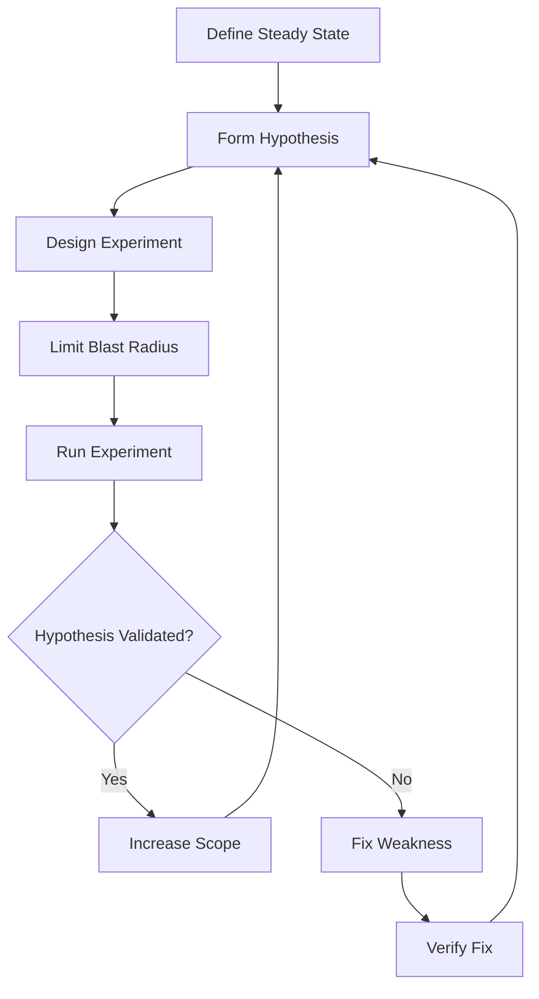
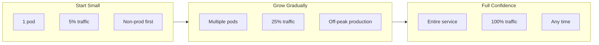
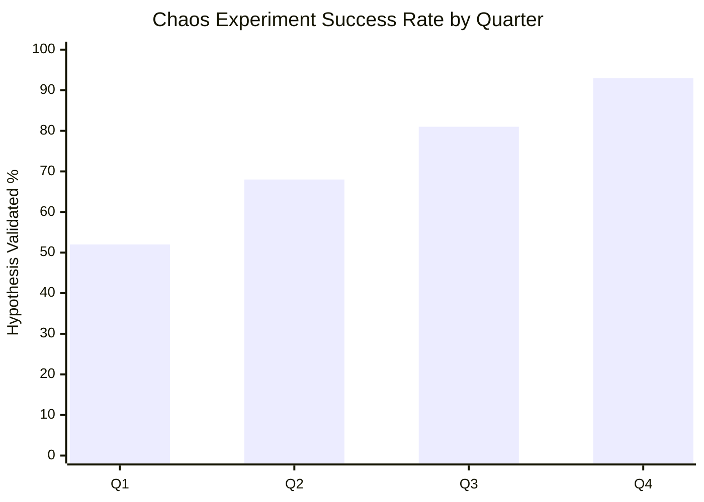

# How to Implement Chaos Engineering Practices

Author: [nawazdhandala](https://www.github.com/nawazdhandala)

Tags: Chaos Engineering, SRE, Reliability, Testing, Resilience

Description: Implement chaos engineering practices with hypothesis-driven experiments, blast radius control, and automated chaos testing in production.

---

Production systems fail in unexpected ways. The database that worked perfectly in staging suddenly hits connection limits. The service mesh that passed all load tests cannot handle a network partition. These surprises happen because traditional testing cannot simulate the messy reality of distributed systems under stress.

Chaos engineering flips the script. Instead of hoping your system handles failures, you prove it does by intentionally breaking things in controlled ways. This guide walks through implementing chaos engineering practices that turn production reliability from guesswork into measurable confidence.

## The Scientific Method for Systems

Chaos engineering borrows from science: form a hypothesis, run an experiment, observe results, and learn. Every chaos experiment follows this structure.



The steady state is your starting point. It defines what "normal" looks like through measurable business metrics, not internal system metrics. Good steady state indicators include order completion rate, search response time, and login success percentage. These tell you if customers are happy regardless of what is happening internally.

## Building Your First Experiment

Start with something that will not page anyone at 3 AM if it goes wrong. A non-critical background service makes a good first target. Here is a complete experiment framework you can adapt.

Define the experiment configuration first. This captures everything needed to run, monitor, and roll back safely.

```python
# chaos_experiment.py - Framework for running hypothesis-driven experiments

from dataclasses import dataclass, field
from typing import Dict, List, Optional
from datetime import datetime
import json
import requests

@dataclass
class SteadyStateDefinition:
    """
    Define what 'normal' looks like for your service.
    These metrics should reflect customer experience, not internal details.
    """
    metric_name: str
    threshold: float
    comparison: str  # 'greater_than', 'less_than', 'equals'

    def evaluate(self, current_value: float) -> bool:
        # Check if current value meets steady state requirement
        if self.comparison == 'greater_than':
            return current_value > self.threshold
        elif self.comparison == 'less_than':
            return current_value < self.threshold
        else:
            return current_value == self.threshold


@dataclass
class ChaosExperiment:
    """
    Complete experiment definition with safety controls built in.
    """
    name: str
    hypothesis: str
    target_service: str
    steady_state_checks: List[SteadyStateDefinition]
    injection_type: str  # 'latency', 'failure', 'resource'
    injection_params: Dict
    duration_seconds: int
    rollback_steps: List[str]
    max_impact_threshold: float = 0.1  # Abort if error rate exceeds 10%

    def to_json(self) -> str:
        # Serialize experiment for logging and reproducibility
        return json.dumps({
            'name': self.name,
            'hypothesis': self.hypothesis,
            'target': self.target_service,
            'injection': self.injection_type,
            'params': self.injection_params,
            'duration': self.duration_seconds
        }, indent=2)


# Example: Create a latency injection experiment
def create_database_latency_experiment() -> ChaosExperiment:
    """
    Test how your service handles slow database responses.
    This is one of the most common real-world failure modes.
    """
    return ChaosExperiment(
        name="database-latency-tolerance",
        hypothesis=(
            "When database latency increases to 200ms, "
            "the API will maintain 99% success rate by using "
            "cached responses and timeouts"
        ),
        target_service="user-service",
        steady_state_checks=[
            SteadyStateDefinition(
                metric_name="api_success_rate",
                threshold=0.99,
                comparison="greater_than"
            ),
            SteadyStateDefinition(
                metric_name="p95_response_time_ms",
                threshold=500,
                comparison="less_than"
            )
        ],
        injection_type="latency",
        injection_params={
            "target": "postgresql",
            "latency_ms": 200,
            "jitter_ms": 50  # Add variance for realism
        },
        duration_seconds=300,
        rollback_steps=[
            "Remove network latency rules",
            "Verify database connectivity",
            "Check connection pool health"
        ]
    )
```

## Controlling Blast Radius

The blast radius is the potential impact of your experiment. Keeping it small protects both your users and your team's willingness to keep running experiments.



Implement blast radius controls directly in your experiment runner.

```python
# blast_radius.py - Control the scope of chaos experiments

from enum import Enum
from typing import List, Optional
import random

class BlastRadiusLevel(Enum):
    """
    Progressive levels of experiment impact.
    Always start at MINIMAL and graduate upward.
    """
    MINIMAL = "minimal"      # Single instance, canary traffic
    LIMITED = "limited"      # Few instances, subset of traffic
    MODERATE = "moderate"    # Multiple instances, significant traffic
    FULL = "full"           # Entire service (only after many successful runs)


class BlastRadiusController:
    """
    Manages which targets are affected by chaos experiments.
    Ensures experiments stay within defined boundaries.
    """

    def __init__(self, level: BlastRadiusLevel):
        self.level = level
        # Define limits for each level
        self.limits = {
            BlastRadiusLevel.MINIMAL: {
                'max_instances': 1,
                'max_traffic_percent': 5,
                'allowed_environments': ['staging']
            },
            BlastRadiusLevel.LIMITED: {
                'max_instances': 2,
                'max_traffic_percent': 10,
                'allowed_environments': ['staging', 'production']
            },
            BlastRadiusLevel.MODERATE: {
                'max_instances': 5,
                'max_traffic_percent': 25,
                'allowed_environments': ['staging', 'production']
            },
            BlastRadiusLevel.FULL: {
                'max_instances': -1,  # Unlimited
                'max_traffic_percent': 100,
                'allowed_environments': ['staging', 'production']
            }
        }

    def select_targets(
        self,
        available_instances: List[str],
        environment: str
    ) -> List[str]:
        """
        Select which instances to target based on blast radius level.
        Returns empty list if environment is not allowed at this level.
        """
        limits = self.limits[self.level]

        # Check if environment is allowed
        if environment not in limits['allowed_environments']:
            print(f"Environment {environment} not allowed at {self.level.value} level")
            return []

        max_count = limits['max_instances']

        # Return all instances if unlimited
        if max_count == -1:
            return available_instances

        # Randomly select up to max_count instances
        count = min(max_count, len(available_instances))
        return random.sample(available_instances, count)

    def get_traffic_percentage(self) -> int:
        """Return the maximum traffic percentage for this blast radius level."""
        return self.limits[self.level]['max_traffic_percent']

    def can_escalate(self, success_count: int, required_successes: int = 5) -> bool:
        """
        Determine if we have enough successful experiments to increase blast radius.
        Require multiple successes before expanding scope.
        """
        return success_count >= required_successes
```

## Automated Chaos Testing Pipeline

Manual experiments teach you a lot, but automated chaos integrated into your CI/CD pipeline catches regressions continuously.

```yaml
# .github/workflows/chaos-pipeline.yml
# Run chaos experiments after deployment to catch resilience regressions

name: Post-Deploy Chaos Testing

on:
  deployment_status:
    # Trigger after successful deployment

jobs:
  chaos-validation:
    if: github.event.deployment_status.state == 'success'
    runs-on: ubuntu-latest

    steps:
      - name: Checkout chaos experiments
        uses: actions/checkout@v4

      - name: Setup Python
        uses: actions/setup-python@v5
        with:
          python-version: '3.11'

      - name: Install dependencies
        run: pip install -r chaos-requirements.txt

      - name: Verify steady state before chaos
        id: pre-check
        run: |
          # Confirm the system is healthy before we break anything
          python scripts/verify_steady_state.py \
            --service ${{ github.event.deployment.payload.service }} \
            --environment ${{ github.event.deployment.environment }}

      - name: Run minimal blast radius experiments
        if: steps.pre-check.outcome == 'success'
        run: |
          # Start with smallest possible impact
          python scripts/run_experiments.py \
            --blast-radius minimal \
            --service ${{ github.event.deployment.payload.service }} \
            --duration 120

      - name: Evaluate experiment results
        run: |
          # Check if hypotheses were validated
          python scripts/evaluate_results.py \
            --fail-on-regression true

      - name: Post results to PR
        if: always()
        uses: actions/github-script@v7
        with:
          script: |
            // Add chaos experiment results as PR comment
            const results = require('./chaos-results.json');
            const body = `## Chaos Experiment Results\n\n` +
              `Hypothesis validated: ${results.validated}\n` +
              `Services tested: ${results.services.join(', ')}\n` +
              `Duration: ${results.duration}s`;
            github.rest.issues.createComment({
              owner: context.repo.owner,
              repo: context.repo.repo,
              issue_number: context.issue.number,
              body: body
            });
```

## Real-World Failure Injection

Here are practical implementations for common failure types you should test.

Network failures reveal how your services handle connectivity problems.

```python
# network_chaos.py - Inject network failures using iptables or tc

import subprocess
import time
from contextlib import contextmanager

class NetworkChaos:
    """
    Inject network failures using Linux networking tools.
    Requires root or CAP_NET_ADMIN capability.
    """

    def __init__(self, interface: str = "eth0"):
        self.interface = interface

    @contextmanager
    def inject_latency(self, latency_ms: int, target_port: Optional[int] = None):
        """
        Add network latency to outgoing traffic.
        Optionally target a specific port (e.g., database connections).
        """
        try:
            # Add queuing discipline for traffic shaping
            subprocess.run([
                "tc", "qdisc", "add", "dev", self.interface,
                "root", "handle", "1:", "prio"
            ], check=True)

            # Add delay to traffic
            subprocess.run([
                "tc", "qdisc", "add", "dev", self.interface,
                "parent", "1:3", "handle", "30:",
                "netem", "delay", f"{latency_ms}ms"
            ], check=True)

            if target_port:
                # Filter to only affect specific port
                subprocess.run([
                    "tc", "filter", "add", "dev", self.interface,
                    "protocol", "ip", "parent", "1:0", "prio", "3",
                    "u32", "match", "ip", "dport", str(target_port), "0xffff",
                    "flowid", "1:3"
                ], check=True)

            print(f"Injected {latency_ms}ms latency on {self.interface}")
            yield

        finally:
            # Always clean up
            subprocess.run([
                "tc", "qdisc", "del", "dev", self.interface, "root"
            ], check=False)  # Ignore errors during cleanup
            print("Removed latency injection")

    @contextmanager
    def inject_packet_loss(self, loss_percent: float):
        """
        Drop a percentage of packets to simulate unreliable network.
        Even 1% packet loss can severely impact TCP performance.
        """
        try:
            subprocess.run([
                "tc", "qdisc", "add", "dev", self.interface,
                "root", "netem", "loss", f"{loss_percent}%"
            ], check=True)

            print(f"Injected {loss_percent}% packet loss")
            yield

        finally:
            subprocess.run([
                "tc", "qdisc", "del", "dev", self.interface, "root"
            ], check=False)
            print("Removed packet loss injection")


# Usage example with automatic cleanup
if __name__ == "__main__":
    chaos = NetworkChaos()

    # Test database latency tolerance
    with chaos.inject_latency(latency_ms=100, target_port=5432):
        # Your application continues running
        # Monitor metrics during this window
        time.sleep(60)

    # Latency automatically removed when context exits
```

## Measuring Resilience Progress

Track how your chaos engineering practice improves system reliability over time.



Key metrics to track:

- **Experiment coverage**: Percentage of services with active chaos experiments
- **Hypothesis validation rate**: How often systems behave as expected
- **Mean time to recovery**: How quickly the system returns to steady state
- **Findings per experiment**: Issues discovered before they became incidents

## Getting Buy-In From Stakeholders

Running experiments in production requires trust. Build it gradually by starting small, communicating constantly, and sharing wins.

Document every experiment result, especially the ones that find problems. Each weakness discovered before an outage is a story about how chaos engineering protected the business. Share these stories in incident reviews and planning meetings.

Start with Game Days where the team gathers to run experiments together. This builds familiarity and reduces anxiety about controlled failure. Once comfortable, move toward continuous automated chaos that runs without human intervention.

---

Chaos engineering transforms hope into evidence. Instead of assuming your circuit breakers work, you prove they do. Instead of guessing about failover behavior, you observe it directly. The investment pays off not just in fewer outages but in the confidence to move faster because you know exactly how your systems handle stress.

Start with one experiment on one non-critical service. Form a hypothesis, inject a failure, observe what happens. Whatever the result, you will learn something valuable about how your system actually works under pressure.
