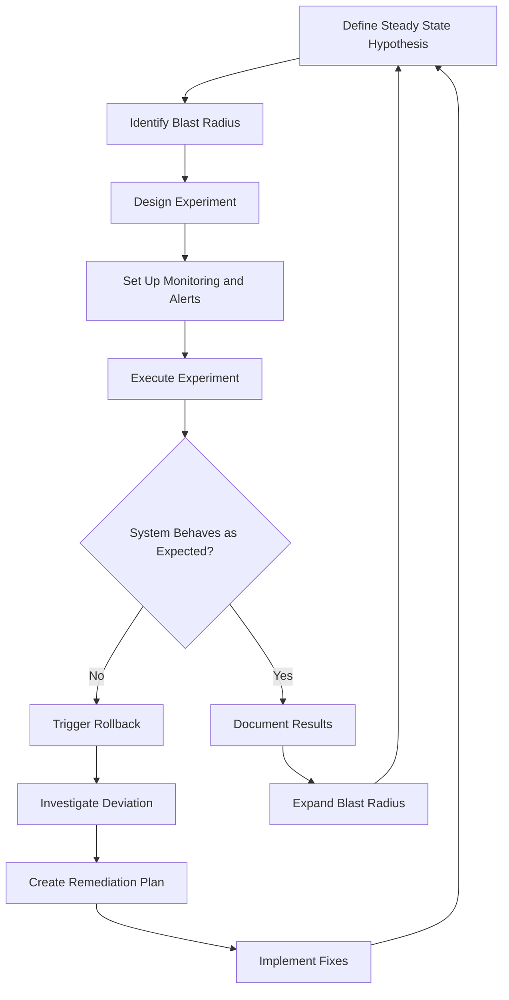
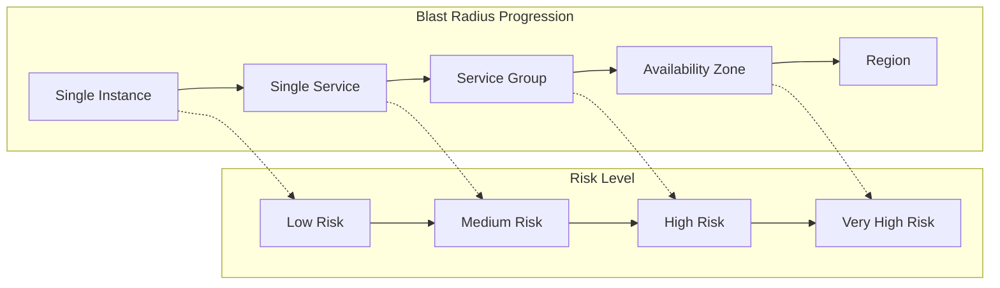

# How to Implement Chaos Testing Strategies

Author: [nawazdhandala](https://github.com/nawazdhandala)

Tags: Testing, ChaosEngineering, Resilience, Reliability

Description: A practical guide to designing and implementing chaos experiments that validate system resilience without causing uncontrolled outages.

---

Your system is humming along beautifully. Metrics are green, customers are happy, and the team is confident. Then a single network partition takes down your entire payment processing pipeline, costing the business thousands per minute. The postmortem reveals a cascading failure that nobody anticipated.

This scenario plays out daily across organizations of all sizes. The uncomfortable truth is that production systems fail in unpredictable ways, and the only way to prepare for these failures is to practice them intentionally. This is where chaos testing comes in.

Chaos testing is the discipline of deliberately injecting failures into your systems to discover weaknesses before they become incidents. Netflix pioneered this approach with Chaos Monkey in 2011, and it has since evolved into a mature engineering practice adopted by companies worldwide.

> "The best way to avoid failure is to fail constantly." - Netflix Engineering

## What is Chaos Engineering?

Chaos engineering is not about randomly breaking things. It is a scientific approach to understanding system behavior under stress. The goal is to build confidence in your system's ability to withstand turbulent conditions in production.

The core principle is simple: if you cannot predict how your system will fail, you cannot prevent those failures from impacting users. By running controlled experiments, you gain empirical evidence about your system's resilience.

## The Chaos Experiment Workflow

A well-designed chaos experiment follows a structured process. Here is the workflow that ensures experiments are safe, informative, and actionable:



This workflow ensures that every experiment starts with a clear hypothesis and ends with actionable insights.

## Defining the Steady State Hypothesis

The steady state hypothesis describes the normal, healthy behavior of your system. It is the baseline against which you measure the impact of your chaos experiments.

A good steady state hypothesis is:

- **Measurable**: Based on concrete metrics you can observe
- **User-centric**: Focused on outcomes that matter to customers
- **Bounded**: Has clear thresholds for acceptable behavior

Here is an example of defining a steady state hypothesis in code:

```python
# steady_state.py
# Define the steady state hypothesis for your chaos experiment

from dataclasses import dataclass
from typing import List, Callable
import time


@dataclass
class SteadyStateMetric:
    """
    Represents a single metric in the steady state hypothesis.
    Each metric has a name, a function to measure it, and acceptable bounds.
    """
    name: str
    measure_fn: Callable[[], float]  # Function that returns current metric value
    min_threshold: float             # Minimum acceptable value
    max_threshold: float             # Maximum acceptable value


class SteadyStateHypothesis:
    """
    A collection of metrics that define system health.
    All metrics must be within bounds for the hypothesis to hold.
    """

    def __init__(self, name: str, metrics: List[SteadyStateMetric]):
        self.name = name
        self.metrics = metrics

    def validate(self) -> dict:
        """
        Check if all metrics are within acceptable bounds.
        Returns a dictionary with validation results for each metric.
        """
        results = {
            "hypothesis": self.name,
            "timestamp": time.time(),
            "metrics": [],
            "all_valid": True
        }

        for metric in self.metrics:
            current_value = metric.measure_fn()
            is_valid = metric.min_threshold <= current_value <= metric.max_threshold

            results["metrics"].append({
                "name": metric.name,
                "current_value": current_value,
                "min_threshold": metric.min_threshold,
                "max_threshold": metric.max_threshold,
                "is_valid": is_valid
            })

            if not is_valid:
                results["all_valid"] = False

        return results


# Example: Define steady state for an e-commerce checkout service
def measure_latency_p99():
    """Fetch p99 latency from your metrics system"""
    # In production, this would query Prometheus, Datadog, or similar
    return fetch_metric("checkout_latency_p99_ms")


def measure_error_rate():
    """Calculate current error rate as a percentage"""
    total = fetch_metric("checkout_requests_total")
    errors = fetch_metric("checkout_errors_total")
    return (errors / total) * 100 if total > 0 else 0


def measure_throughput():
    """Measure requests per second"""
    return fetch_metric("checkout_requests_per_second")


# Create the hypothesis with three key metrics
checkout_hypothesis = SteadyStateHypothesis(
    name="Checkout Service Health",
    metrics=[
        SteadyStateMetric(
            name="P99 Latency",
            measure_fn=measure_latency_p99,
            min_threshold=0,      # Latency cannot be negative
            max_threshold=500     # Must be under 500ms
        ),
        SteadyStateMetric(
            name="Error Rate",
            measure_fn=measure_error_rate,
            min_threshold=0,      # Error rate cannot be negative
            max_threshold=0.1     # Must be under 0.1%
        ),
        SteadyStateMetric(
            name="Throughput",
            measure_fn=measure_throughput,
            min_threshold=100,    # Must handle at least 100 RPS
            max_threshold=10000   # Upper bound for sanity check
        )
    ]
)
```

## Controlling the Blast Radius

The blast radius is the scope of impact that a chaos experiment can have. Starting with a small blast radius and gradually expanding it is crucial for safe experimentation.



Here is how to implement blast radius controls:

```python
# blast_radius.py
# Control the scope of chaos experiments to minimize risk

from enum import Enum
from dataclasses import dataclass
from typing import List, Optional
import random


class BlastRadiusLevel(Enum):
    """
    Define the levels of blast radius from smallest to largest.
    Each level represents increased scope and risk.
    """
    INSTANCE = "instance"           # Single container or VM
    SERVICE = "service"             # All instances of one service
    SERVICE_GROUP = "service_group" # Related services (e.g., payment stack)
    ZONE = "availability_zone"      # Entire availability zone
    REGION = "region"               # Entire region


@dataclass
class BlastRadiusConfig:
    """
    Configuration for controlling experiment scope.
    """
    level: BlastRadiusLevel
    percentage: float              # Percentage of targets to affect (0-100)
    target_tags: dict              # Tags to filter targets
    excluded_targets: List[str]   # Specific targets to never affect
    max_concurrent: int            # Maximum targets affected simultaneously


class BlastRadiusController:
    """
    Manages target selection and ensures experiments stay within bounds.
    """

    def __init__(self, config: BlastRadiusConfig):
        self.config = config
        self.affected_targets = []

    def select_targets(self, available_targets: List[dict]) -> List[dict]:
        """
        Select targets for the experiment based on configuration.
        Filters by tags, excludes protected targets, and limits scope.
        """
        # Step 1: Filter by tags
        filtered = [
            t for t in available_targets
            if self._matches_tags(t, self.config.target_tags)
        ]

        # Step 2: Remove excluded targets
        filtered = [
            t for t in filtered
            if t["id"] not in self.config.excluded_targets
        ]

        # Step 3: Apply percentage limit
        num_targets = int(len(filtered) * (self.config.percentage / 100))
        num_targets = min(num_targets, self.config.max_concurrent)

        # Step 4: Randomly select targets
        selected = random.sample(filtered, min(num_targets, len(filtered)))

        self.affected_targets = selected
        return selected

    def _matches_tags(self, target: dict, required_tags: dict) -> bool:
        """Check if a target has all required tags"""
        target_tags = target.get("tags", {})
        return all(
            target_tags.get(k) == v
            for k, v in required_tags.items()
        )

    def get_affected_count(self) -> int:
        """Return the number of currently affected targets"""
        return len(self.affected_targets)


# Example: Start with minimal blast radius
minimal_config = BlastRadiusConfig(
    level=BlastRadiusLevel.INSTANCE,
    percentage=10,                      # Only affect 10% of instances
    target_tags={"env": "staging"},     # Only target staging environment
    excluded_targets=[
        "db-primary-1",                 # Never touch the primary database
        "payment-gateway-1"             # Never touch payment processing
    ],
    max_concurrent=1                    # Only one instance at a time
)

# Example: Expanded blast radius for mature systems
expanded_config = BlastRadiusConfig(
    level=BlastRadiusLevel.SERVICE,
    percentage=33,                      # Affect one third of service instances
    target_tags={"env": "production", "tier": "non-critical"},
    excluded_targets=["db-primary-1"],
    max_concurrent=5
)
```

## Designing Chaos Experiments

A chaos experiment should test a specific hypothesis about system behavior. Here are common experiment types:

### Network Chaos

Network failures are among the most common causes of distributed system outages. Testing network resilience is essential.

```python
# network_chaos.py
# Inject network failures to test system resilience

import subprocess
import time
from dataclasses import dataclass
from typing import Optional
from contextlib import contextmanager


@dataclass
class NetworkChaosConfig:
    """Configuration for network chaos injection"""
    target_host: str              # Host to affect
    latency_ms: Optional[int]     # Add latency in milliseconds
    packet_loss_percent: float    # Percentage of packets to drop
    duration_seconds: int         # How long to run the experiment
    interface: str = "eth0"       # Network interface to affect


class NetworkChaosInjector:
    """
    Inject network failures using Linux traffic control (tc).
    Requires root privileges to modify network settings.
    """

    def __init__(self, config: NetworkChaosConfig):
        self.config = config
        self.is_active = False

    def start(self):
        """
        Apply network chaos rules using tc (traffic control).
        This adds latency and packet loss to outgoing traffic.
        """
        if self.is_active:
            raise RuntimeError("Chaos injection already active")

        # Build the tc command to add latency and packet loss
        # Using netem (network emulator) qdisc
        cmd_parts = [
            "tc", "qdisc", "add", "dev", self.config.interface,
            "root", "netem"
        ]

        # Add latency if specified
        if self.config.latency_ms:
            cmd_parts.extend(["delay", f"{self.config.latency_ms}ms"])

        # Add packet loss if specified
        if self.config.packet_loss_percent > 0:
            cmd_parts.extend(["loss", f"{self.config.packet_loss_percent}%"])

        # Execute the command
        subprocess.run(cmd_parts, check=True)
        self.is_active = True

        print(f"Network chaos started: {self.config.latency_ms}ms latency, "
              f"{self.config.packet_loss_percent}% packet loss")

    def stop(self):
        """
        Remove network chaos rules and restore normal operation.
        This is critical for rollback procedures.
        """
        if not self.is_active:
            return

        # Remove the netem qdisc to restore normal networking
        cmd = ["tc", "qdisc", "del", "dev", self.config.interface, "root"]
        subprocess.run(cmd, check=True)
        self.is_active = False

        print("Network chaos stopped, normal operation restored")

    @contextmanager
    def inject(self):
        """
        Context manager for safe chaos injection.
        Automatically cleans up even if an exception occurs.
        """
        try:
            self.start()
            yield
        finally:
            self.stop()


# Example: Test how the system handles 200ms latency and 5% packet loss
def run_network_chaos_experiment():
    config = NetworkChaosConfig(
        target_host="api-service",
        latency_ms=200,
        packet_loss_percent=5.0,
        duration_seconds=300,  # 5 minutes
        interface="eth0"
    )

    injector = NetworkChaosInjector(config)

    # Use context manager for automatic cleanup
    with injector.inject():
        print("Experiment running, monitoring system behavior...")
        time.sleep(config.duration_seconds)

    print("Experiment complete")
```

### Resource Exhaustion

Testing how your system behaves when CPU, memory, or disk resources are constrained:

```python
# resource_chaos.py
# Simulate resource exhaustion to test system limits

import os
import threading
import time
from dataclasses import dataclass
from typing import Optional, List
import mmap


@dataclass
class ResourceChaosConfig:
    """Configuration for resource exhaustion experiments"""
    cpu_load_percent: Optional[int]     # Target CPU utilization
    memory_consume_mb: Optional[int]     # Memory to consume in MB
    disk_fill_mb: Optional[int]          # Disk space to consume in MB
    duration_seconds: int                 # Experiment duration
    target_path: str = "/tmp/chaos"       # Path for disk fill


class CPUStressor:
    """
    Generate CPU load by running intensive calculations.
    Uses multiple threads to stress all available cores.
    """

    def __init__(self, target_percent: int, duration: int):
        self.target_percent = target_percent
        self.duration = duration
        self.stop_flag = threading.Event()
        self.threads: List[threading.Thread] = []

    def _cpu_burn(self):
        """
        Burn CPU cycles in a controlled manner.
        Alternates between work and sleep to achieve target utilization.
        """
        while not self.stop_flag.is_set():
            # Work period proportional to target percentage
            work_time = self.target_percent / 100.0 * 0.1
            sleep_time = (100 - self.target_percent) / 100.0 * 0.1

            # Burn CPU with floating point operations
            end_time = time.time() + work_time
            while time.time() < end_time:
                _ = 999999 ** 0.5

            # Sleep to control utilization
            time.sleep(sleep_time)

    def start(self):
        """Start CPU stress on all available cores"""
        num_cores = os.cpu_count() or 1

        for _ in range(num_cores):
            thread = threading.Thread(target=self._cpu_burn, daemon=True)
            thread.start()
            self.threads.append(thread)

        print(f"CPU stress started: targeting {self.target_percent}% on {num_cores} cores")

    def stop(self):
        """Stop all CPU stress threads"""
        self.stop_flag.set()
        for thread in self.threads:
            thread.join(timeout=1)
        self.threads.clear()
        print("CPU stress stopped")


class MemoryStressor:
    """
    Consume memory to test system behavior under memory pressure.
    Uses mmap for efficient memory allocation.
    """

    def __init__(self, consume_mb: int):
        self.consume_mb = consume_mb
        self.allocations: List[mmap.mmap] = []

    def start(self):
        """
        Allocate the specified amount of memory.
        Touches all pages to ensure memory is actually consumed.
        """
        chunk_size = 100 * 1024 * 1024  # 100 MB chunks
        remaining = self.consume_mb * 1024 * 1024

        while remaining > 0:
            size = min(chunk_size, remaining)
            # Create anonymous memory mapping
            allocation = mmap.mmap(-1, size)
            # Touch the memory to ensure it is allocated
            allocation.write(b'\x00' * size)
            allocation.seek(0)
            self.allocations.append(allocation)
            remaining -= size

        print(f"Memory stress started: consuming {self.consume_mb} MB")

    def stop(self):
        """Release all allocated memory"""
        for allocation in self.allocations:
            allocation.close()
        self.allocations.clear()
        print("Memory stress stopped")


class DiskStressor:
    """
    Fill disk space to test system behavior when storage is limited.
    Creates large files in the specified directory.
    """

    def __init__(self, fill_mb: int, target_path: str):
        self.fill_mb = fill_mb
        self.target_path = target_path
        self.created_files: List[str] = []

    def start(self):
        """
        Create files to consume the specified disk space.
        Uses sparse files for efficiency where possible.
        """
        os.makedirs(self.target_path, exist_ok=True)

        # Create files in 1 GB chunks
        chunk_mb = 1024
        remaining = self.fill_mb
        file_num = 0

        while remaining > 0:
            size_mb = min(chunk_mb, remaining)
            file_path = os.path.join(self.target_path, f"chaos_fill_{file_num}.dat")

            # Write actual data to ensure disk space is consumed
            with open(file_path, 'wb') as f:
                # Write in 1 MB blocks
                block = b'\x00' * (1024 * 1024)
                for _ in range(size_mb):
                    f.write(block)

            self.created_files.append(file_path)
            remaining -= size_mb
            file_num += 1

        print(f"Disk stress started: consuming {self.fill_mb} MB at {self.target_path}")

    def stop(self):
        """Remove all created files and free disk space"""
        for file_path in self.created_files:
            try:
                os.remove(file_path)
            except OSError:
                pass
        self.created_files.clear()
        print("Disk stress stopped, files removed")
```

## Implementing Rollback Procedures

Rollback procedures are your safety net. Every chaos experiment must have a clear, tested rollback plan that can be executed quickly.

```python
# rollback.py
# Implement robust rollback procedures for chaos experiments

import time
import logging
from dataclasses import dataclass, field
from typing import Callable, List, Optional
from enum import Enum
from contextlib import contextmanager

logging.basicConfig(level=logging.INFO)
logger = logging.getLogger("chaos_rollback")


class RollbackTrigger(Enum):
    """Conditions that can trigger an automatic rollback"""
    MANUAL = "manual"                    # Operator initiated
    TIMEOUT = "timeout"                  # Experiment exceeded duration
    THRESHOLD_BREACH = "threshold"       # Metrics exceeded safe bounds
    SYSTEM_ALERT = "alert"               # External alerting system triggered
    HEALTH_CHECK_FAIL = "health_check"   # Health checks failing


@dataclass
class RollbackStep:
    """
    A single step in the rollback procedure.
    Steps are executed in order, with error handling.
    """
    name: str
    action: Callable[[], bool]     # Function that performs the rollback
    timeout_seconds: int = 60       # Maximum time for this step
    required: bool = True           # If True, failure aborts remaining steps

    def execute(self) -> bool:
        """
        Execute the rollback step with timeout protection.
        Returns True if successful, False otherwise.
        """
        logger.info(f"Executing rollback step: {self.name}")
        start_time = time.time()

        try:
            success = self.action()
            elapsed = time.time() - start_time

            if success:
                logger.info(f"Step '{self.name}' completed in {elapsed:.2f}s")
            else:
                logger.error(f"Step '{self.name}' failed after {elapsed:.2f}s")

            return success

        except Exception as e:
            logger.error(f"Step '{self.name}' raised exception: {e}")
            return False


@dataclass
class RollbackPlan:
    """
    Complete rollback plan for a chaos experiment.
    Contains all steps needed to restore system to normal state.
    """
    experiment_id: str
    steps: List[RollbackStep] = field(default_factory=list)
    notification_channels: List[str] = field(default_factory=list)

    def add_step(self, step: RollbackStep):
        """Add a step to the rollback plan"""
        self.steps.append(step)

    def execute(self, trigger: RollbackTrigger) -> bool:
        """
        Execute the complete rollback plan.
        Returns True if all required steps succeeded.
        """
        logger.warning(f"ROLLBACK INITIATED for {self.experiment_id}")
        logger.warning(f"Trigger: {trigger.value}")

        self._send_notification(f"Rollback started: {self.experiment_id}")

        all_success = True

        for step in self.steps:
            success = step.execute()

            if not success and step.required:
                logger.critical(f"Required step '{step.name}' failed, aborting rollback")
                all_success = False
                break
            elif not success:
                logger.warning(f"Optional step '{step.name}' failed, continuing")

        if all_success:
            logger.info("Rollback completed successfully")
            self._send_notification(f"Rollback completed: {self.experiment_id}")
        else:
            logger.critical("ROLLBACK FAILED - MANUAL INTERVENTION REQUIRED")
            self._send_notification(f"ROLLBACK FAILED: {self.experiment_id} - URGENT")

        return all_success

    def _send_notification(self, message: str):
        """Send notifications to configured channels"""
        for channel in self.notification_channels:
            logger.info(f"Notification to {channel}: {message}")
            # In production, integrate with Slack, PagerDuty, etc.


class ChaosExperimentRunner:
    """
    Orchestrates chaos experiments with automatic rollback.
    Monitors system health and triggers rollback when needed.
    """

    def __init__(
        self,
        experiment_id: str,
        steady_state_check: Callable[[], bool],
        rollback_plan: RollbackPlan,
        check_interval_seconds: int = 10
    ):
        self.experiment_id = experiment_id
        self.steady_state_check = steady_state_check
        self.rollback_plan = rollback_plan
        self.check_interval = check_interval_seconds
        self.is_running = False

    @contextmanager
    def run_experiment(self, chaos_action: Callable, duration_seconds: int):
        """
        Run a chaos experiment with automatic monitoring and rollback.

        Args:
            chaos_action: Function that injects chaos
            duration_seconds: Maximum experiment duration
        """
        logger.info(f"Starting experiment: {self.experiment_id}")

        # Verify steady state before starting
        if not self.steady_state_check():
            logger.error("System not in steady state, aborting experiment")
            raise RuntimeError("Pre-experiment steady state check failed")

        self.is_running = True
        start_time = time.time()
        rollback_triggered = False

        try:
            # Inject chaos
            chaos_action()

            # Monitor during experiment
            while self.is_running:
                elapsed = time.time() - start_time

                # Check duration limit
                if elapsed >= duration_seconds:
                    logger.info("Experiment duration reached")
                    break

                # Check steady state
                if not self.steady_state_check():
                    logger.warning("Steady state violated, triggering rollback")
                    rollback_triggered = True
                    break

                time.sleep(self.check_interval)

            yield

        except Exception as e:
            logger.error(f"Experiment error: {e}")
            rollback_triggered = True
            raise

        finally:
            self.is_running = False

            # Execute rollback
            if rollback_triggered:
                trigger = RollbackTrigger.THRESHOLD_BREACH
            else:
                trigger = RollbackTrigger.TIMEOUT

            self.rollback_plan.execute(trigger)

            # Verify system recovered
            time.sleep(5)  # Allow time for recovery
            if not self.steady_state_check():
                logger.critical("System did not recover after rollback")


# Example: Create a complete rollback plan
def create_network_chaos_rollback() -> RollbackPlan:
    """Create a rollback plan for network chaos experiments"""

    plan = RollbackPlan(
        experiment_id="network-latency-001",
        notification_channels=["slack-sre", "pagerduty"]
    )

    # Step 1: Remove network rules
    plan.add_step(RollbackStep(
        name="Remove traffic control rules",
        action=lambda: remove_tc_rules("eth0"),
        timeout_seconds=30,
        required=True
    ))

    # Step 2: Verify network connectivity
    plan.add_step(RollbackStep(
        name="Verify network health",
        action=lambda: verify_network_connectivity(),
        timeout_seconds=60,
        required=True
    ))

    # Step 3: Restart affected services if needed
    plan.add_step(RollbackStep(
        name="Restart affected services",
        action=lambda: restart_services(["api-gateway", "order-service"]),
        timeout_seconds=120,
        required=False  # Optional, only if services are unhealthy
    ))

    # Step 4: Clear any circuit breakers
    plan.add_step(RollbackStep(
        name="Reset circuit breakers",
        action=lambda: reset_circuit_breakers(),
        timeout_seconds=30,
        required=False
    ))

    return plan
```

## Complete Chaos Testing Framework

Here is a complete framework that ties everything together:

```python
# chaos_framework.py
# Complete chaos testing framework with all components

import time
import json
import logging
from dataclasses import dataclass, field
from typing import Dict, List, Callable, Optional, Any
from datetime import datetime
from enum import Enum

logging.basicConfig(level=logging.INFO)
logger = logging.getLogger("chaos_framework")


class ExperimentStatus(Enum):
    """Possible states of a chaos experiment"""
    PENDING = "pending"
    RUNNING = "running"
    COMPLETED = "completed"
    FAILED = "failed"
    ROLLED_BACK = "rolled_back"


@dataclass
class ExperimentResult:
    """
    Captures the complete results of a chaos experiment.
    Used for analysis and reporting.
    """
    experiment_id: str
    status: ExperimentStatus
    start_time: datetime
    end_time: datetime
    steady_state_before: Dict[str, Any]
    steady_state_after: Dict[str, Any]
    hypothesis_validated: bool
    observations: List[str] = field(default_factory=list)
    metrics_collected: Dict[str, List[float]] = field(default_factory=dict)

    def to_json(self) -> str:
        """Serialize results for storage and sharing"""
        return json.dumps({
            "experiment_id": self.experiment_id,
            "status": self.status.value,
            "start_time": self.start_time.isoformat(),
            "end_time": self.end_time.isoformat(),
            "duration_seconds": (self.end_time - self.start_time).total_seconds(),
            "hypothesis_validated": self.hypothesis_validated,
            "observations": self.observations,
            "metrics": self.metrics_collected
        }, indent=2)


@dataclass
class ChaosExperiment:
    """
    Defines a complete chaos experiment with all necessary components.
    """
    id: str
    name: str
    description: str
    hypothesis: str

    # Steady state definition
    steady_state_metrics: Dict[str, Callable[[], float]]
    steady_state_thresholds: Dict[str, tuple]  # metric_name: (min, max)

    # Chaos injection
    inject_action: Callable[[], None]
    revert_action: Callable[[], None]

    # Configuration
    duration_seconds: int = 300
    warmup_seconds: int = 30
    cooldown_seconds: int = 60

    # Safety controls
    abort_conditions: List[Callable[[], bool]] = field(default_factory=list)
    max_impact_percent: float = 10.0  # Maximum acceptable deviation


class ChaosTestRunner:
    """
    Executes chaos experiments safely and collects results.
    Provides automatic rollback and comprehensive reporting.
    """

    def __init__(self):
        self.results: List[ExperimentResult] = []

    def run_experiment(self, experiment: ChaosExperiment) -> ExperimentResult:
        """
        Execute a chaos experiment following the scientific method.

        1. Capture steady state before
        2. Inject chaos
        3. Monitor during experiment
        4. Revert chaos
        5. Capture steady state after
        6. Analyze and report
        """
        logger.info(f"Starting experiment: {experiment.name}")
        logger.info(f"Hypothesis: {experiment.hypothesis}")

        start_time = datetime.now()
        observations = []
        metrics_collected: Dict[str, List[float]] = {
            name: [] for name in experiment.steady_state_metrics
        }

        # Step 1: Capture initial steady state
        steady_state_before = self._capture_steady_state(experiment)
        logger.info(f"Initial steady state: {steady_state_before}")

        if not self._validate_steady_state(steady_state_before, experiment):
            logger.error("System not in valid steady state, aborting")
            return ExperimentResult(
                experiment_id=experiment.id,
                status=ExperimentStatus.FAILED,
                start_time=start_time,
                end_time=datetime.now(),
                steady_state_before=steady_state_before,
                steady_state_after={},
                hypothesis_validated=False,
                observations=["Aborted: initial steady state invalid"]
            )

        # Step 2: Warmup period
        logger.info(f"Warmup period: {experiment.warmup_seconds}s")
        time.sleep(experiment.warmup_seconds)

        try:
            # Step 3: Inject chaos
            logger.warning("INJECTING CHAOS")
            experiment.inject_action()
            observations.append(f"Chaos injected at {datetime.now().isoformat()}")

            # Step 4: Monitor during experiment
            experiment_start = time.time()
            while time.time() - experiment_start < experiment.duration_seconds:
                # Collect metrics
                for name, measure_fn in experiment.steady_state_metrics.items():
                    try:
                        value = measure_fn()
                        metrics_collected[name].append(value)
                    except Exception as e:
                        observations.append(f"Metric collection error for {name}: {e}")

                # Check abort conditions
                for condition in experiment.abort_conditions:
                    if condition():
                        logger.critical("Abort condition triggered")
                        observations.append("Experiment aborted due to safety condition")
                        raise RuntimeError("Abort condition triggered")

                time.sleep(5)  # Check every 5 seconds

            observations.append(f"Chaos duration completed at {datetime.now().isoformat()}")

        except Exception as e:
            logger.error(f"Experiment error: {e}")
            observations.append(f"Error during experiment: {e}")

        finally:
            # Step 5: Revert chaos (always executed)
            logger.warning("REVERTING CHAOS")
            try:
                experiment.revert_action()
                observations.append(f"Chaos reverted at {datetime.now().isoformat()}")
            except Exception as e:
                logger.critical(f"Failed to revert chaos: {e}")
                observations.append(f"CRITICAL: Failed to revert chaos: {e}")

        # Step 6: Cooldown period
        logger.info(f"Cooldown period: {experiment.cooldown_seconds}s")
        time.sleep(experiment.cooldown_seconds)

        # Step 7: Capture final steady state
        steady_state_after = self._capture_steady_state(experiment)
        logger.info(f"Final steady state: {steady_state_after}")

        # Step 8: Validate hypothesis
        hypothesis_validated = self._validate_steady_state(
            steady_state_after, experiment
        )

        if hypothesis_validated:
            logger.info("HYPOTHESIS VALIDATED: System remained resilient")
            status = ExperimentStatus.COMPLETED
        else:
            logger.warning("HYPOTHESIS INVALIDATED: System did not recover")
            status = ExperimentStatus.ROLLED_BACK

        # Create result
        result = ExperimentResult(
            experiment_id=experiment.id,
            status=status,
            start_time=start_time,
            end_time=datetime.now(),
            steady_state_before=steady_state_before,
            steady_state_after=steady_state_after,
            hypothesis_validated=hypothesis_validated,
            observations=observations,
            metrics_collected=metrics_collected
        )

        self.results.append(result)
        logger.info(f"Experiment complete. Results:\n{result.to_json()}")

        return result

    def _capture_steady_state(self, experiment: ChaosExperiment) -> Dict[str, float]:
        """Capture current values of all steady state metrics"""
        state = {}
        for name, measure_fn in experiment.steady_state_metrics.items():
            try:
                state[name] = measure_fn()
            except Exception as e:
                logger.error(f"Failed to capture metric {name}: {e}")
                state[name] = None
        return state

    def _validate_steady_state(
        self,
        state: Dict[str, float],
        experiment: ChaosExperiment
    ) -> bool:
        """Check if all metrics are within acceptable thresholds"""
        for name, (min_val, max_val) in experiment.steady_state_thresholds.items():
            value = state.get(name)
            if value is None:
                return False
            if not (min_val <= value <= max_val):
                logger.warning(f"Metric {name}={value} outside bounds [{min_val}, {max_val}]")
                return False
        return True


# Example: Define and run a complete chaos experiment
def example_chaos_experiment():
    """
    Example: Test if the order service handles database latency gracefully.
    """

    # Define the experiment
    experiment = ChaosExperiment(
        id="db-latency-001",
        name="Database Latency Resilience",
        description="Verify order service handles 500ms database latency without errors",
        hypothesis="When database latency increases to 500ms, the order service "
                   "should maintain error rate below 1% and p99 latency below 2000ms",

        steady_state_metrics={
            "error_rate": lambda: get_metric("order_service_error_rate"),
            "latency_p99": lambda: get_metric("order_service_latency_p99_ms"),
            "throughput": lambda: get_metric("order_service_rps")
        },

        steady_state_thresholds={
            "error_rate": (0, 1.0),      # Error rate must be 0-1%
            "latency_p99": (0, 2000),    # p99 latency must be under 2000ms
            "throughput": (50, 1000)      # Throughput must be 50-1000 RPS
        },

        inject_action=lambda: inject_db_latency(500),  # Add 500ms latency
        revert_action=lambda: remove_db_latency(),     # Remove latency

        duration_seconds=300,    # Run for 5 minutes
        warmup_seconds=30,       # 30 second warmup
        cooldown_seconds=60,     # 60 second cooldown

        abort_conditions=[
            lambda: get_metric("order_service_error_rate") > 5.0,  # Abort if error rate > 5%
        ],

        max_impact_percent=10.0
    )

    # Run the experiment
    runner = ChaosTestRunner()
    result = runner.run_experiment(experiment)

    return result
```

## Best Practices for Chaos Testing

1. **Start in Non-Production**: Begin chaos experiments in staging or development environments before moving to production.

2. **Automate Everything**: Manual chaos testing does not scale. Automate experiment execution, monitoring, and rollback.

3. **Communicate Widely**: Notify stakeholders before running experiments. Create a chaos testing calendar.

4. **Keep Experiments Small**: Test one failure mode at a time. Combining failures makes it harder to identify root causes.

5. **Document Findings**: Every experiment should produce a report, whether the hypothesis was validated or not.

6. **Build Confidence Gradually**: Start with the smallest blast radius and expand only after building confidence.

7. **Integrate with CI/CD**: Run chaos experiments as part of your deployment pipeline to catch regressions.

## Tools for Chaos Engineering

Several open source and commercial tools can help you implement chaos testing:

- **Chaos Monkey**: Netflix's original tool for random instance termination
- **Gremlin**: Commercial platform with a wide range of failure injection capabilities
- **Litmus**: Kubernetes-native chaos engineering framework
- **Chaos Toolkit**: Open source framework for declarative chaos experiments
- **Pumba**: Docker-focused chaos testing tool

## Conclusion

Chaos testing transforms reliability from hope into evidence. By deliberately injecting failures and observing system behavior, you build confidence that your systems can withstand real-world turbulence.

The key is to approach chaos testing scientifically: define hypotheses, control blast radius, monitor carefully, and always have a rollback plan. Start small, learn continuously, and gradually expand the scope of your experiments.

Remember, the goal is not to break things. The goal is to discover weaknesses before your customers do.

**About OneUptime:** We provide comprehensive observability and incident management tools that support chaos engineering practices. Our platform helps you monitor steady state, detect deviations, and respond to incidents quickly. Learn more at [OneUptime.com](https://oneuptime.com).

**Related Reading:**

- [The Five Stages of SRE Maturity](https://oneuptime.com/blog/post/2025-09-01-the-five-stages-of-sre-maturity/view)
- [SRE Best Practices](https://oneuptime.com/blog/post/2025-11-28-sre-best-practices/view)
- [What is Site Reliability Engineering](https://oneuptime.com/blog/post/2025-11-28-what-is-site-reliability-engineering/view)
