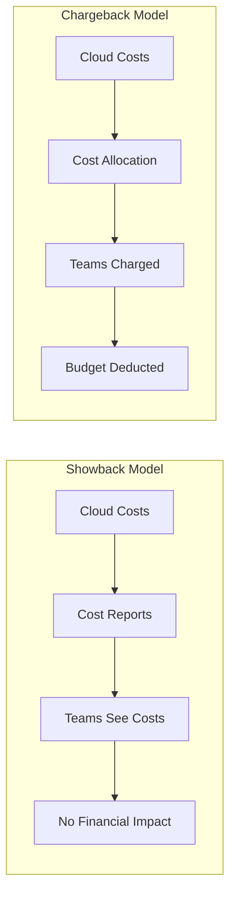
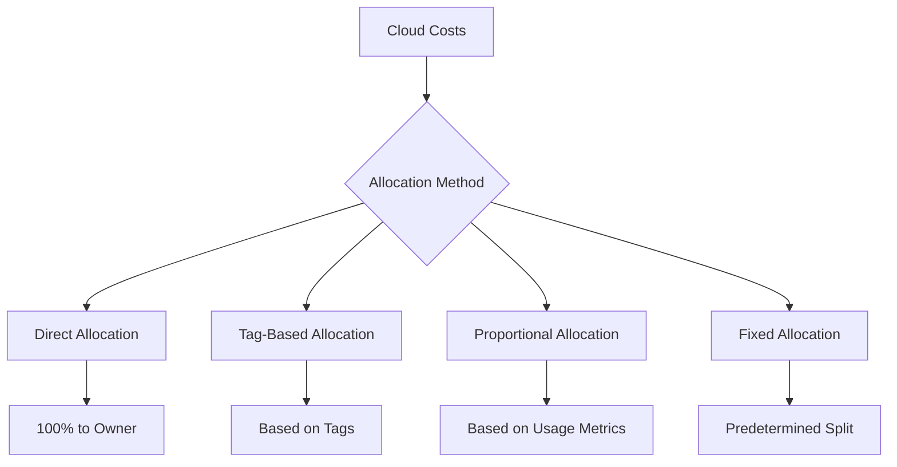
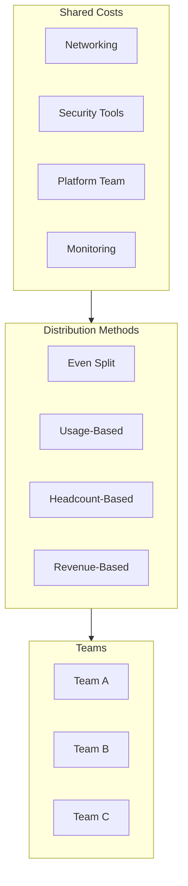
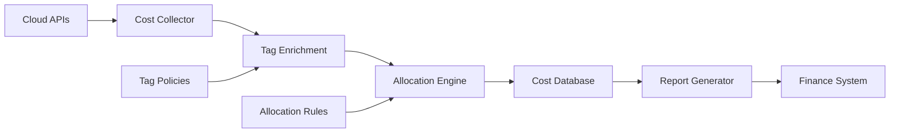
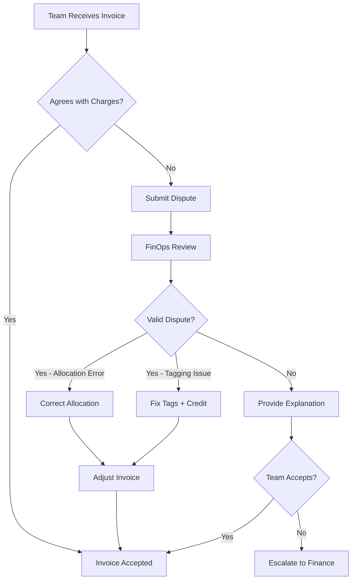

# How to Implement Chargeback Models

Author: [nawazdhandala](https://github.com/nawazdhandala)

Tags: FinOps, Cost Allocation, Chargeback, Cloud, Cost Management, Cloud Economics

Description: Learn how to implement chargeback models for cloud cost accountability.

---

Cloud spending grows 30-40% year over year for most organizations, yet only 20% can accurately attribute costs to the teams or products that generate them. Chargeback models fix this by making cost consumption visible and accountable. This guide walks through implementing chargeback from scratch.

## Chargeback vs Showback

Before implementing anything, understand the fundamental difference between these two approaches.



### Showback

Showback provides visibility without financial accountability. Teams see their costs but don't pay for them from their budgets.

**When to use:**
- Starting FinOps journey
- Building cost awareness culture
- Organizations without mature budgeting processes
- When accurate allocation is still being developed

### Chargeback

Chargeback directly charges teams for their consumption. Costs hit departmental budgets.

**When to use:**
- Mature FinOps practice
- Strong tagging compliance (>90%)
- Clear ownership model
- Finance integration complete

### Hybrid Approach

Most organizations start with showback and graduate to chargeback over 6-12 months.

```python
# Example: Determine model based on tagging compliance
def determine_allocation_model(team_id: str, compliance_rate: float) -> str:
    """
    Decide whether to use showback or chargeback based on tagging compliance.

    Args:
        team_id: The team identifier
        compliance_rate: Percentage of resources properly tagged (0.0 to 1.0)

    Returns:
        'chargeback' if compliance is high enough, 'showback' otherwise
    """
    CHARGEBACK_THRESHOLD = 0.90  # 90% tagging compliance required

    if compliance_rate >= CHARGEBACK_THRESHOLD:
        return 'chargeback'
    else:
        # Log teams not meeting threshold
        print(f"Team {team_id} at {compliance_rate:.1%} compliance - using showback")
        return 'showback'
```

## Cost Allocation Methods

Cost allocation is the foundation of chargeback. You need accurate, consistent ways to attribute costs to cost centers.



### Method 1: Direct Allocation

Costs go directly to the owning team. Works when resources have clear, single owners.

```yaml
# AWS resource tagging example for direct allocation
Resources:
  ProductionDatabase:
    Type: AWS::RDS::DBInstance
    Properties:
      DBInstanceIdentifier: orders-db
      Tags:
        - Key: cost-center
          Value: "CC-1234"
        - Key: team
          Value: "platform-team"
        - Key: environment
          Value: "production"
        - Key: service
          Value: "order-service"
```

```python
from dataclasses import dataclass
from decimal import Decimal
from typing import Dict, List

@dataclass
class CostAllocation:
    resource_id: str
    cost: Decimal
    cost_center: str
    team: str
    environment: str

def allocate_direct(
    resources: List[Dict],
    costs: Dict[str, Decimal]
) -> List[CostAllocation]:
    """
    Allocate costs directly based on resource tags.

    Args:
        resources: List of resources with tags
        costs: Dictionary mapping resource_id to cost

    Returns:
        List of cost allocations
    """
    allocations = []

    for resource in resources:
        resource_id = resource['resource_id']
        tags = resource.get('tags', {})

        if resource_id not in costs:
            continue

        allocation = CostAllocation(
            resource_id=resource_id,
            cost=costs[resource_id],
            cost_center=tags.get('cost-center', 'UNALLOCATED'),
            team=tags.get('team', 'unknown'),
            environment=tags.get('environment', 'unknown')
        )
        allocations.append(allocation)

    return allocations
```

### Method 2: Tag-Based Allocation

Use resource tags to determine cost ownership. Most flexible and commonly used method.

```python
from typing import Dict, List, Optional
from decimal import Decimal
from collections import defaultdict

class TagBasedAllocator:
    """Allocate costs based on resource tags with fallback rules."""

    def __init__(self, tag_hierarchy: List[str]):
        """
        Initialize with tag priority hierarchy.

        Args:
            tag_hierarchy: Ordered list of tag keys to check
                          First match wins
        """
        self.tag_hierarchy = tag_hierarchy

    def get_cost_center(self, tags: Dict[str, str]) -> Optional[str]:
        """Find cost center from tags using hierarchy."""
        for tag_key in self.tag_hierarchy:
            if tag_key in tags:
                return tags[tag_key]
        return None

    def allocate(
        self,
        resources: List[Dict],
        default_cost_center: str = "SHARED"
    ) -> Dict[str, Decimal]:
        """
        Allocate all resource costs to cost centers.

        Returns:
            Dictionary mapping cost_center to total cost
        """
        allocations = defaultdict(Decimal)
        untagged_costs = Decimal('0')

        for resource in resources:
            cost = Decimal(str(resource.get('cost', 0)))
            tags = resource.get('tags', {})

            cost_center = self.get_cost_center(tags)

            if cost_center:
                allocations[cost_center] += cost
            else:
                untagged_costs += cost
                allocations[default_cost_center] += cost

        return dict(allocations), untagged_costs

# Usage example
allocator = TagBasedAllocator(
    tag_hierarchy=[
        'cost-center',      # First priority
        'team',             # Second priority
        'project',          # Third priority
        'application'       # Last resort
    ]
)

resources = [
    {'resource_id': 'i-abc123', 'cost': 150.00, 'tags': {'cost-center': 'CC-1234', 'team': 'platform'}},
    {'resource_id': 'i-def456', 'cost': 200.00, 'tags': {'team': 'data-team'}},
    {'resource_id': 'i-ghi789', 'cost': 100.00, 'tags': {}},  # Untagged
]

allocations, untagged = allocator.allocate(resources)
print(f"Allocations: {allocations}")
print(f"Untagged costs: ${untagged}")
```

### Method 3: Proportional Allocation

Split costs based on measurable usage metrics. Essential for shared resources.

```python
from dataclasses import dataclass
from decimal import Decimal, ROUND_HALF_UP
from typing import Dict, List

@dataclass
class UsageMetric:
    team: str
    metric_value: float  # CPU hours, requests, storage GB, etc.

def allocate_proportional(
    total_cost: Decimal,
    usage_metrics: List[UsageMetric]
) -> Dict[str, Decimal]:
    """
    Allocate shared costs proportionally based on usage.

    Args:
        total_cost: Total cost to allocate
        usage_metrics: List of team usage metrics

    Returns:
        Dictionary mapping team to allocated cost
    """
    total_usage = sum(m.metric_value for m in usage_metrics)

    if total_usage == 0:
        # Avoid division by zero - split evenly
        num_teams = len(usage_metrics)
        even_split = total_cost / num_teams
        return {m.team: even_split for m in usage_metrics}

    allocations = {}
    allocated_sum = Decimal('0')

    for i, metric in enumerate(usage_metrics):
        proportion = Decimal(str(metric.metric_value)) / Decimal(str(total_usage))

        if i == len(usage_metrics) - 1:
            # Last team gets remainder to avoid rounding errors
            allocation = total_cost - allocated_sum
        else:
            allocation = (total_cost * proportion).quantize(
                Decimal('0.01'),
                rounding=ROUND_HALF_UP
            )

        allocations[metric.team] = allocation
        allocated_sum += allocation

    return allocations

# Example: Kubernetes cluster cost allocation
cluster_cost = Decimal('10000.00')  # Monthly cluster cost

team_usage = [
    UsageMetric(team='platform', metric_value=2500),    # 2500 CPU hours
    UsageMetric(team='data', metric_value=4000),        # 4000 CPU hours
    UsageMetric(team='frontend', metric_value=1500),    # 1500 CPU hours
    UsageMetric(team='backend', metric_value=2000),     # 2000 CPU hours
]

allocations = allocate_proportional(cluster_cost, team_usage)
for team, cost in allocations.items():
    print(f"{team}: ${cost}")
```

### Method 4: Fixed Allocation

Predetermined split based on agreements, not actual usage.

```python
from decimal import Decimal
from typing import Dict

class FixedAllocator:
    """Allocate costs based on fixed percentages."""

    def __init__(self, allocation_rules: Dict[str, float]):
        """
        Initialize with allocation percentages.

        Args:
            allocation_rules: Dictionary mapping cost_center to percentage
                             Percentages should sum to 1.0
        """
        total = sum(allocation_rules.values())
        if abs(total - 1.0) > 0.001:
            raise ValueError(f"Allocation percentages must sum to 1.0, got {total}")

        self.allocation_rules = allocation_rules

    def allocate(self, total_cost: Decimal) -> Dict[str, Decimal]:
        """Allocate total cost according to fixed rules."""
        allocations = {}

        for cost_center, percentage in self.allocation_rules.items():
            allocations[cost_center] = total_cost * Decimal(str(percentage))

        return allocations

# Example: Data platform fixed cost allocation
data_platform_allocator = FixedAllocator({
    'analytics': 0.40,      # 40% - heaviest users
    'ml-team': 0.30,        # 30% - model training
    'reporting': 0.20,      # 20% - BI dashboards
    'engineering': 0.10,    # 10% - ad-hoc queries
})

monthly_cost = Decimal('50000.00')
allocations = data_platform_allocator.allocate(monthly_cost)
```

## Shared Cost Distribution

Shared costs are the hardest part of chargeback. These include infrastructure that multiple teams use: networking, security tools, platform teams, and support services.



### Strategy 1: Even Distribution

Simplest approach - divide shared costs equally among all teams.

```python
from decimal import Decimal
from typing import List, Dict

def distribute_evenly(
    shared_costs: Dict[str, Decimal],
    teams: List[str]
) -> Dict[str, Dict[str, Decimal]]:
    """
    Distribute shared costs evenly across all teams.

    Args:
        shared_costs: Dictionary of cost category to amount
        teams: List of team names

    Returns:
        Nested dict: team -> cost_category -> amount
    """
    num_teams = len(teams)
    distribution = {team: {} for team in teams}

    for category, total_cost in shared_costs.items():
        per_team_cost = total_cost / num_teams

        for team in teams:
            distribution[team][category] = per_team_cost

    return distribution

# Example
shared_costs = {
    'networking': Decimal('5000.00'),
    'security': Decimal('3000.00'),
    'monitoring': Decimal('2000.00'),
}

teams = ['platform', 'backend', 'frontend', 'data']
distribution = distribute_evenly(shared_costs, teams)
```

### Strategy 2: Weighted Distribution

Different costs use different weighting factors.

```python
from decimal import Decimal
from typing import Dict
from dataclasses import dataclass

@dataclass
class TeamMetrics:
    headcount: int
    compute_spend: Decimal
    data_transfer_gb: float
    revenue_attribution: Decimal

class WeightedDistributor:
    """Distribute shared costs using different weights per cost type."""

    def __init__(self, team_metrics: Dict[str, TeamMetrics]):
        self.team_metrics = team_metrics
        self._calculate_totals()

    def _calculate_totals(self):
        """Pre-calculate totals for normalization."""
        self.total_headcount = sum(m.headcount for m in self.team_metrics.values())
        self.total_compute = sum(m.compute_spend for m in self.team_metrics.values())
        self.total_transfer = sum(m.data_transfer_gb for m in self.team_metrics.values())
        self.total_revenue = sum(m.revenue_attribution for m in self.team_metrics.values())

    def distribute(
        self,
        cost_type: str,
        amount: Decimal
    ) -> Dict[str, Decimal]:
        """
        Distribute a cost using the appropriate weighting method.

        Cost type mappings:
        - 'platform_support' -> headcount
        - 'networking' -> data_transfer
        - 'shared_compute' -> compute_spend
        - 'overhead' -> revenue
        """
        distribution = {}

        for team, metrics in self.team_metrics.items():
            if cost_type == 'platform_support':
                weight = metrics.headcount / self.total_headcount
            elif cost_type == 'networking':
                weight = metrics.data_transfer_gb / self.total_transfer
            elif cost_type == 'shared_compute':
                weight = float(metrics.compute_spend / self.total_compute)
            elif cost_type == 'overhead':
                weight = float(metrics.revenue_attribution / self.total_revenue)
            else:
                # Default to even distribution
                weight = 1 / len(self.team_metrics)

            distribution[team] = amount * Decimal(str(weight))

        return distribution

# Example usage
team_metrics = {
    'platform': TeamMetrics(
        headcount=10,
        compute_spend=Decimal('20000'),
        data_transfer_gb=500,
        revenue_attribution=Decimal('0')  # Cost center
    ),
    'backend': TeamMetrics(
        headcount=25,
        compute_spend=Decimal('50000'),
        data_transfer_gb=2000,
        revenue_attribution=Decimal('5000000')
    ),
    'data': TeamMetrics(
        headcount=15,
        compute_spend=Decimal('80000'),
        data_transfer_gb=5000,
        revenue_attribution=Decimal('2000000')
    ),
}

distributor = WeightedDistributor(team_metrics)

# Platform support cost distributed by headcount
support_distribution = distributor.distribute('platform_support', Decimal('15000'))

# Network cost distributed by data transfer
network_distribution = distributor.distribute('networking', Decimal('8000'))
```

### Strategy 3: Tiered Shared Cost Model

Some costs allocated directly, some shared, some amortized.

```python
from enum import Enum
from decimal import Decimal
from typing import Dict, List
from dataclasses import dataclass

class AllocationTier(Enum):
    DIRECT = "direct"           # 100% to single owner
    SHARED_USAGE = "shared_usage"    # Split by usage
    SHARED_EVEN = "shared_even"      # Split evenly
    AMORTIZED = "amortized"     # Spread over time

@dataclass
class CostItem:
    name: str
    amount: Decimal
    tier: AllocationTier
    owner: str = None  # Required for DIRECT tier

class TieredAllocator:
    """Allocate costs using a tiered model."""

    def __init__(
        self,
        teams: List[str],
        usage_weights: Dict[str, float]
    ):
        self.teams = teams
        self.usage_weights = usage_weights

    def allocate(self, cost_items: List[CostItem]) -> Dict[str, Decimal]:
        """Process all cost items and return team totals."""
        team_costs = {team: Decimal('0') for team in self.teams}

        for item in cost_items:
            if item.tier == AllocationTier.DIRECT:
                if item.owner and item.owner in team_costs:
                    team_costs[item.owner] += item.amount

            elif item.tier == AllocationTier.SHARED_USAGE:
                for team in self.teams:
                    weight = Decimal(str(self.usage_weights.get(team, 0)))
                    team_costs[team] += item.amount * weight

            elif item.tier == AllocationTier.SHARED_EVEN:
                per_team = item.amount / len(self.teams)
                for team in self.teams:
                    team_costs[team] += per_team

            elif item.tier == AllocationTier.AMORTIZED:
                # Amortized costs typically spread evenly
                per_team = item.amount / len(self.teams)
                for team in self.teams:
                    team_costs[team] += per_team

        return team_costs

# Example
allocator = TieredAllocator(
    teams=['platform', 'backend', 'frontend'],
    usage_weights={'platform': 0.2, 'backend': 0.5, 'frontend': 0.3}
)

monthly_costs = [
    CostItem('EC2 - API servers', Decimal('10000'), AllocationTier.DIRECT, owner='backend'),
    CostItem('EC2 - Web servers', Decimal('5000'), AllocationTier.DIRECT, owner='frontend'),
    CostItem('RDS Shared Database', Decimal('8000'), AllocationTier.SHARED_USAGE),
    CostItem('CloudWatch', Decimal('2000'), AllocationTier.SHARED_EVEN),
    CostItem('Reserved Instance Amortization', Decimal('3000'), AllocationTier.AMORTIZED),
]

team_totals = allocator.allocate(monthly_costs)
```

## Chargeback Automation

Manual chargeback doesn't scale. Automate the entire pipeline from cost collection to invoice generation.



### Automated Cost Collection

```python
import boto3
from datetime import datetime, timedelta
from decimal import Decimal
from typing import Dict, List, Optional
from dataclasses import dataclass
import json

@dataclass
class CostRecord:
    date: str
    service: str
    resource_id: str
    cost: Decimal
    tags: Dict[str, str]

class AWSCostCollector:
    """Collect cost and usage data from AWS Cost Explorer."""

    def __init__(self, profile: Optional[str] = None):
        session_kwargs = {'profile_name': profile} if profile else {}
        self.session = boto3.Session(**session_kwargs)
        self.ce_client = self.session.client('ce')

    def get_cost_and_usage(
        self,
        start_date: str,
        end_date: str,
        granularity: str = 'DAILY'
    ) -> List[CostRecord]:
        """
        Fetch cost data with resource-level tags.

        Args:
            start_date: Start date (YYYY-MM-DD)
            end_date: End date (YYYY-MM-DD)
            granularity: DAILY, MONTHLY, or HOURLY

        Returns:
            List of CostRecord objects
        """
        records = []

        response = self.ce_client.get_cost_and_usage(
            TimePeriod={
                'Start': start_date,
                'End': end_date
            },
            Granularity=granularity,
            Metrics=['UnblendedCost'],
            GroupBy=[
                {'Type': 'DIMENSION', 'Key': 'SERVICE'},
                {'Type': 'TAG', 'Key': 'cost-center'},
            ]
        )

        for result in response['ResultsByTime']:
            date = result['TimePeriod']['Start']

            for group in result['Groups']:
                service = group['Keys'][0]
                cost_center = group['Keys'][1].replace('cost-center$', '') or 'UNTAGGED'
                cost = Decimal(group['Metrics']['UnblendedCost']['Amount'])

                records.append(CostRecord(
                    date=date,
                    service=service,
                    resource_id='aggregated',
                    cost=cost,
                    tags={'cost-center': cost_center}
                ))

        return records

    def get_resource_tags(self, resource_arns: List[str]) -> Dict[str, Dict[str, str]]:
        """Fetch tags for specific resources."""
        tagging_client = self.session.client('resourcegroupstaggingapi')

        tags_map = {}

        response = tagging_client.get_resources(
            ResourceARNList=resource_arns
        )

        for resource in response['ResourceTagMappingList']:
            arn = resource['ResourceARN']
            tags = {t['Key']: t['Value'] for t in resource['Tags']}
            tags_map[arn] = tags

        return tags_map

# Scheduled collection job
def daily_cost_collection():
    """Run daily to collect previous day's costs."""
    collector = AWSCostCollector()

    yesterday = datetime.now() - timedelta(days=1)
    start_date = yesterday.strftime('%Y-%m-%d')
    end_date = datetime.now().strftime('%Y-%m-%d')

    records = collector.get_cost_and_usage(start_date, end_date)

    # Store in database
    store_cost_records(records)

    return len(records)
```

### Allocation Engine

```python
from decimal import Decimal
from typing import Dict, List, Optional
from dataclasses import dataclass, field
from datetime import datetime
import json

@dataclass
class AllocationRule:
    name: str
    match_conditions: Dict[str, str]  # Tag key-value pairs to match
    allocation_method: str  # 'direct', 'proportional', 'fixed'
    allocation_config: Dict  # Method-specific configuration
    priority: int = 0

@dataclass
class AllocatedCost:
    original_cost: Decimal
    cost_center: str
    allocation_method: str
    allocation_date: datetime
    metadata: Dict = field(default_factory=dict)

class AllocationEngine:
    """Apply allocation rules to cost records."""

    def __init__(self, rules: List[AllocationRule]):
        # Sort rules by priority (highest first)
        self.rules = sorted(rules, key=lambda r: r.priority, reverse=True)

    def matches_conditions(
        self,
        record_tags: Dict[str, str],
        conditions: Dict[str, str]
    ) -> bool:
        """Check if record tags match rule conditions."""
        for key, value in conditions.items():
            if record_tags.get(key) != value:
                return False
        return True

    def allocate_record(
        self,
        record: CostRecord,
        team_metrics: Optional[Dict] = None
    ) -> List[AllocatedCost]:
        """
        Allocate a single cost record.

        Returns:
            List of AllocatedCost (may be multiple for split allocations)
        """
        allocations = []

        for rule in self.rules:
            if not self.matches_conditions(record.tags, rule.match_conditions):
                continue

            if rule.allocation_method == 'direct':
                cost_center = rule.allocation_config.get('cost_center')
                if not cost_center:
                    cost_center = record.tags.get('cost-center', 'UNALLOCATED')

                allocations.append(AllocatedCost(
                    original_cost=record.cost,
                    cost_center=cost_center,
                    allocation_method='direct',
                    allocation_date=datetime.now(),
                    metadata={'rule': rule.name}
                ))
                break  # First matching rule wins

            elif rule.allocation_method == 'proportional':
                if not team_metrics:
                    continue

                metric_key = rule.allocation_config.get('metric_key')
                total_metric = sum(m.get(metric_key, 0) for m in team_metrics.values())

                for team, metrics in team_metrics.items():
                    proportion = metrics.get(metric_key, 0) / total_metric if total_metric > 0 else 0

                    allocations.append(AllocatedCost(
                        original_cost=record.cost * Decimal(str(proportion)),
                        cost_center=team,
                        allocation_method='proportional',
                        allocation_date=datetime.now(),
                        metadata={
                            'rule': rule.name,
                            'proportion': proportion,
                            'metric_key': metric_key
                        }
                    ))
                break

            elif rule.allocation_method == 'fixed':
                splits = rule.allocation_config.get('splits', {})

                for cost_center, percentage in splits.items():
                    allocations.append(AllocatedCost(
                        original_cost=record.cost * Decimal(str(percentage)),
                        cost_center=cost_center,
                        allocation_method='fixed',
                        allocation_date=datetime.now(),
                        metadata={
                            'rule': rule.name,
                            'percentage': percentage
                        }
                    ))
                break

        # No matching rule - allocate to unallocated bucket
        if not allocations:
            allocations.append(AllocatedCost(
                original_cost=record.cost,
                cost_center='UNALLOCATED',
                allocation_method='default',
                allocation_date=datetime.now(),
                metadata={'reason': 'no_matching_rule'}
            ))

        return allocations

# Example rules configuration
rules = [
    AllocationRule(
        name='production-direct',
        match_conditions={'environment': 'production'},
        allocation_method='direct',
        allocation_config={},
        priority=100
    ),
    AllocationRule(
        name='shared-database',
        match_conditions={'service': 'Amazon RDS', 'shared': 'true'},
        allocation_method='proportional',
        allocation_config={'metric_key': 'database_queries'},
        priority=90
    ),
    AllocationRule(
        name='platform-overhead',
        match_conditions={'team': 'platform'},
        allocation_method='fixed',
        allocation_config={
            'splits': {
                'backend': 0.40,
                'frontend': 0.30,
                'data': 0.30
            }
        },
        priority=80
    ),
]
```

### Invoice Generation

```python
from decimal import Decimal
from typing import Dict, List
from dataclasses import dataclass
from datetime import datetime
import json

@dataclass
class LineItem:
    description: str
    category: str
    amount: Decimal
    details: Dict

@dataclass
class Invoice:
    invoice_id: str
    cost_center: str
    billing_period: str
    generated_at: datetime
    line_items: List[LineItem]
    total: Decimal
    currency: str = 'USD'

class InvoiceGenerator:
    """Generate chargeback invoices from allocated costs."""

    def __init__(self, org_name: str):
        self.org_name = org_name
        self.invoice_counter = 0

    def generate_invoice_id(self, cost_center: str, period: str) -> str:
        """Generate unique invoice ID."""
        self.invoice_counter += 1
        return f"INV-{cost_center}-{period}-{self.invoice_counter:04d}"

    def aggregate_costs(
        self,
        allocations: List[AllocatedCost],
        cost_center: str
    ) -> Dict[str, Decimal]:
        """Aggregate costs by category for a cost center."""
        aggregated = {}

        for allocation in allocations:
            if allocation.cost_center != cost_center:
                continue

            category = allocation.metadata.get('service', 'Other')

            if category not in aggregated:
                aggregated[category] = Decimal('0')

            aggregated[category] += allocation.original_cost

        return aggregated

    def create_invoice(
        self,
        allocations: List[AllocatedCost],
        cost_center: str,
        billing_period: str
    ) -> Invoice:
        """Create invoice for a cost center."""
        aggregated = self.aggregate_costs(allocations, cost_center)

        line_items = []
        total = Decimal('0')

        for category, amount in sorted(aggregated.items()):
            line_items.append(LineItem(
                description=f"{category} - {billing_period}",
                category=category,
                amount=amount,
                details={'billing_period': billing_period}
            ))
            total += amount

        return Invoice(
            invoice_id=self.generate_invoice_id(cost_center, billing_period),
            cost_center=cost_center,
            billing_period=billing_period,
            generated_at=datetime.now(),
            line_items=line_items,
            total=total
        )

    def export_to_json(self, invoice: Invoice) -> str:
        """Export invoice to JSON for finance system integration."""
        return json.dumps({
            'invoice_id': invoice.invoice_id,
            'cost_center': invoice.cost_center,
            'billing_period': invoice.billing_period,
            'generated_at': invoice.generated_at.isoformat(),
            'line_items': [
                {
                    'description': item.description,
                    'category': item.category,
                    'amount': str(item.amount),
                }
                for item in invoice.line_items
            ],
            'total': str(invoice.total),
            'currency': invoice.currency
        }, indent=2)
```

## Dispute Resolution

Even the best chargeback system will have disputes. Build a formal process.



### Dispute Management System

```python
from enum import Enum
from dataclasses import dataclass, field
from datetime import datetime
from typing import List, Optional
import uuid

class DisputeStatus(Enum):
    SUBMITTED = "submitted"
    UNDER_REVIEW = "under_review"
    APPROVED = "approved"
    REJECTED = "rejected"
    ESCALATED = "escalated"
    RESOLVED = "resolved"

class DisputeType(Enum):
    ALLOCATION_ERROR = "allocation_error"
    TAGGING_ISSUE = "tagging_issue"
    SHARED_COST_SPLIT = "shared_cost_split"
    UNRECOGNIZED_CHARGE = "unrecognized_charge"
    OTHER = "other"

@dataclass
class DisputeComment:
    author: str
    content: str
    timestamp: datetime = field(default_factory=datetime.now)

@dataclass
class Dispute:
    id: str
    invoice_id: str
    cost_center: str
    submitter: str
    dispute_type: DisputeType
    disputed_amount: float
    description: str
    status: DisputeStatus = DisputeStatus.SUBMITTED
    comments: List[DisputeComment] = field(default_factory=list)
    resolution: Optional[str] = None
    credit_amount: Optional[float] = None
    created_at: datetime = field(default_factory=datetime.now)
    resolved_at: Optional[datetime] = None

class DisputeManager:
    """Manage chargeback disputes."""

    def __init__(self):
        self.disputes: dict[str, Dispute] = {}
        self.sla_days = 5  # Resolution SLA

    def submit_dispute(
        self,
        invoice_id: str,
        cost_center: str,
        submitter: str,
        dispute_type: DisputeType,
        disputed_amount: float,
        description: str
    ) -> Dispute:
        """Submit a new dispute."""
        dispute = Dispute(
            id=str(uuid.uuid4()),
            invoice_id=invoice_id,
            cost_center=cost_center,
            submitter=submitter,
            dispute_type=dispute_type,
            disputed_amount=disputed_amount,
            description=description
        )

        self.disputes[dispute.id] = dispute

        # Auto-assign based on dispute type
        self._auto_assign(dispute)

        return dispute

    def _auto_assign(self, dispute: Dispute):
        """Auto-assign dispute to appropriate reviewer."""
        if dispute.dispute_type == DisputeType.TAGGING_ISSUE:
            assignee = "platform-team"
        elif dispute.dispute_type == DisputeType.SHARED_COST_SPLIT:
            assignee = "finops-team"
        else:
            assignee = "finops-team"

        dispute.comments.append(DisputeComment(
            author="system",
            content=f"Auto-assigned to {assignee}"
        ))

    def add_comment(self, dispute_id: str, author: str, content: str):
        """Add comment to dispute."""
        dispute = self.disputes.get(dispute_id)
        if dispute:
            dispute.comments.append(DisputeComment(
                author=author,
                content=content
            ))

    def approve_dispute(
        self,
        dispute_id: str,
        reviewer: str,
        credit_amount: float,
        resolution: str
    ):
        """Approve dispute and issue credit."""
        dispute = self.disputes.get(dispute_id)
        if not dispute:
            raise ValueError(f"Dispute {dispute_id} not found")

        dispute.status = DisputeStatus.APPROVED
        dispute.credit_amount = credit_amount
        dispute.resolution = resolution
        dispute.resolved_at = datetime.now()

        dispute.comments.append(DisputeComment(
            author=reviewer,
            content=f"Approved. Credit: ${credit_amount:.2f}. {resolution}"
        ))

    def reject_dispute(
        self,
        dispute_id: str,
        reviewer: str,
        reason: str
    ):
        """Reject dispute with explanation."""
        dispute = self.disputes.get(dispute_id)
        if not dispute:
            raise ValueError(f"Dispute {dispute_id} not found")

        dispute.status = DisputeStatus.REJECTED
        dispute.resolution = reason
        dispute.resolved_at = datetime.now()

        dispute.comments.append(DisputeComment(
            author=reviewer,
            content=f"Rejected. {reason}"
        ))

    def get_overdue_disputes(self) -> List[Dispute]:
        """Get disputes past SLA."""
        overdue = []
        now = datetime.now()

        for dispute in self.disputes.values():
            if dispute.status in [DisputeStatus.SUBMITTED, DisputeStatus.UNDER_REVIEW]:
                days_open = (now - dispute.created_at).days
                if days_open > self.sla_days:
                    overdue.append(dispute)

        return overdue

    def generate_dispute_report(self) -> dict:
        """Generate dispute metrics report."""
        total = len(self.disputes)
        by_status = {}
        by_type = {}
        total_disputed = 0
        total_credited = 0

        for dispute in self.disputes.values():
            # By status
            status = dispute.status.value
            by_status[status] = by_status.get(status, 0) + 1

            # By type
            dtype = dispute.dispute_type.value
            by_type[dtype] = by_type.get(dtype, 0) + 1

            total_disputed += dispute.disputed_amount
            if dispute.credit_amount:
                total_credited += dispute.credit_amount

        return {
            'total_disputes': total,
            'by_status': by_status,
            'by_type': by_type,
            'total_disputed_amount': total_disputed,
            'total_credited_amount': total_credited,
            'credit_rate': total_credited / total_disputed if total_disputed > 0 else 0,
            'overdue_count': len(self.get_overdue_disputes())
        }
```

## Reporting and Visibility

Visibility drives behavior change. Build dashboards that make costs impossible to ignore.

### Cost Report Generator

```python
from decimal import Decimal
from typing import Dict, List, Optional
from dataclasses import dataclass
from datetime import datetime, timedelta
import json

@dataclass
class CostTrend:
    period: str
    amount: Decimal
    change_percent: Optional[float] = None

@dataclass
class TeamCostReport:
    team: str
    current_period_cost: Decimal
    previous_period_cost: Decimal
    change_percent: float
    budget: Optional[Decimal]
    budget_utilization: Optional[float]
    top_services: List[Dict]
    cost_trend: List[CostTrend]

class CostReporter:
    """Generate cost reports and dashboards."""

    def __init__(self, cost_data: Dict):
        self.cost_data = cost_data

    def generate_team_report(
        self,
        team: str,
        current_period: str,
        previous_period: str,
        budget: Optional[Decimal] = None
    ) -> TeamCostReport:
        """Generate detailed cost report for a team."""
        current_costs = self._get_period_costs(team, current_period)
        previous_costs = self._get_period_costs(team, previous_period)

        current_total = sum(current_costs.values())
        previous_total = sum(previous_costs.values())

        change_percent = (
            float((current_total - previous_total) / previous_total * 100)
            if previous_total > 0 else 0
        )

        # Top services by cost
        top_services = sorted(
            [{'service': k, 'cost': v} for k, v in current_costs.items()],
            key=lambda x: x['cost'],
            reverse=True
        )[:5]

        # Budget utilization
        budget_util = None
        if budget:
            budget_util = float(current_total / budget * 100)

        return TeamCostReport(
            team=team,
            current_period_cost=current_total,
            previous_period_cost=previous_total,
            change_percent=change_percent,
            budget=budget,
            budget_utilization=budget_util,
            top_services=top_services,
            cost_trend=self._get_cost_trend(team, months=6)
        )

    def _get_period_costs(self, team: str, period: str) -> Dict[str, Decimal]:
        """Get costs by service for a team and period."""
        # Implementation depends on data storage
        return self.cost_data.get(team, {}).get(period, {})

    def _get_cost_trend(self, team: str, months: int) -> List[CostTrend]:
        """Get cost trend over specified months."""
        # Implementation depends on data storage
        return []

    def generate_executive_summary(
        self,
        period: str,
        teams: List[str]
    ) -> Dict:
        """Generate executive-level cost summary."""
        summary = {
            'period': period,
            'generated_at': datetime.now().isoformat(),
            'total_cost': Decimal('0'),
            'team_breakdown': [],
            'top_growth_teams': [],
            'top_cost_teams': [],
            'unallocated_costs': Decimal('0')
        }

        team_costs = []

        for team in teams:
            costs = self._get_period_costs(team, period)
            total = sum(costs.values())

            team_costs.append({
                'team': team,
                'cost': total
            })

            summary['total_cost'] += total

        # Sort for top lists
        summary['team_breakdown'] = team_costs
        summary['top_cost_teams'] = sorted(
            team_costs,
            key=lambda x: x['cost'],
            reverse=True
        )[:5]

        return summary

    def export_for_dashboard(self, report: TeamCostReport) -> Dict:
        """Export report in dashboard-friendly format."""
        return {
            'team': report.team,
            'metrics': {
                'current_cost': float(report.current_period_cost),
                'previous_cost': float(report.previous_period_cost),
                'change_percent': report.change_percent,
                'budget': float(report.budget) if report.budget else None,
                'budget_utilization': report.budget_utilization
            },
            'top_services': [
                {'name': s['service'], 'cost': float(s['cost'])}
                for s in report.top_services
            ],
            'trend': [
                {'period': t.period, 'cost': float(t.amount)}
                for t in report.cost_trend
            ]
        }
```

### Dashboard Metrics

```python
from typing import Dict, List
from decimal import Decimal
from dataclasses import dataclass

@dataclass
class FinOpsMetrics:
    """Key metrics for FinOps dashboard."""
    tagging_compliance: float        # % of resources tagged
    allocation_coverage: float       # % of costs allocated
    budget_variance: float           # % over/under budget
    forecast_accuracy: float         # How accurate were predictions
    unit_cost: Decimal              # Cost per unit (transaction, user, etc.)
    cost_per_engineer: Decimal      # Total cloud / engineering headcount

class MetricsCalculator:
    """Calculate FinOps KPIs."""

    def calculate_tagging_compliance(
        self,
        resources: List[Dict],
        required_tags: List[str]
    ) -> float:
        """Calculate percentage of resources with required tags."""
        if not resources:
            return 0.0

        compliant = 0

        for resource in resources:
            tags = resource.get('tags', {})
            has_all_required = all(tag in tags for tag in required_tags)
            if has_all_required:
                compliant += 1

        return compliant / len(resources) * 100

    def calculate_allocation_coverage(
        self,
        total_cost: Decimal,
        unallocated_cost: Decimal
    ) -> float:
        """Calculate percentage of costs that are allocated."""
        if total_cost == 0:
            return 100.0

        allocated = total_cost - unallocated_cost
        return float(allocated / total_cost * 100)

    def calculate_budget_variance(
        self,
        actual_cost: Decimal,
        budget: Decimal
    ) -> float:
        """Calculate budget variance percentage."""
        if budget == 0:
            return 0.0

        variance = (actual_cost - budget) / budget * 100
        return float(variance)

    def calculate_unit_economics(
        self,
        total_cost: Decimal,
        unit_count: int,
        unit_name: str = "transaction"
    ) -> Dict:
        """Calculate cost per unit."""
        if unit_count == 0:
            return {'unit': unit_name, 'cost_per_unit': 0, 'count': 0}

        cost_per_unit = total_cost / unit_count

        return {
            'unit': unit_name,
            'cost_per_unit': float(cost_per_unit),
            'count': unit_count,
            'total_cost': float(total_cost)
        }

    def generate_dashboard_metrics(
        self,
        resources: List[Dict],
        costs: Dict,
        budget: Decimal,
        transactions: int,
        headcount: int
    ) -> FinOpsMetrics:
        """Generate all dashboard metrics."""
        required_tags = ['cost-center', 'team', 'environment']

        total_cost = sum(Decimal(str(c)) for c in costs.values())
        unallocated = costs.get('UNALLOCATED', Decimal('0'))

        return FinOpsMetrics(
            tagging_compliance=self.calculate_tagging_compliance(
                resources, required_tags
            ),
            allocation_coverage=self.calculate_allocation_coverage(
                total_cost, Decimal(str(unallocated))
            ),
            budget_variance=self.calculate_budget_variance(total_cost, budget),
            forecast_accuracy=0.0,  # Requires historical data
            unit_cost=total_cost / transactions if transactions > 0 else Decimal('0'),
            cost_per_engineer=total_cost / headcount if headcount > 0 else Decimal('0')
        )
```

## Implementation Checklist

Follow this phased approach to implement chargeback:

### Phase 1: Foundation (Month 1-2)
- [ ] Define tagging taxonomy (cost-center, team, environment, service)
- [ ] Implement tag enforcement policies
- [ ] Set up cost data collection pipeline
- [ ] Establish cost center mappings

### Phase 2: Showback (Month 3-4)
- [ ] Build allocation rules for direct costs
- [ ] Create team cost dashboards
- [ ] Send weekly cost reports
- [ ] Track tagging compliance metrics

### Phase 3: Shared Costs (Month 5-6)
- [ ] Define shared cost categories
- [ ] Implement proportional allocation
- [ ] Document allocation methodology
- [ ] Get stakeholder sign-off on splits

### Phase 4: Chargeback (Month 7-8)
- [ ] Integrate with finance systems
- [ ] Implement invoice generation
- [ ] Create dispute resolution process
- [ ] Establish SLAs for dispute handling

### Phase 5: Optimization (Ongoing)
- [ ] Add budget vs actual alerts
- [ ] Implement anomaly detection
- [ ] Build forecasting capabilities
- [ ] Create optimization recommendations

## Common Pitfalls to Avoid

1. **Starting with chargeback before tagging is mature** - You need 90%+ compliance first
2. **Allocating 100% of costs immediately** - Start with direct costs, add shared costs gradually
3. **No dispute process** - Teams will push back; have a fair process ready
4. **Too granular too fast** - Start with team-level, add service-level later
5. **Ignoring shared costs** - They're hard but often 30-40% of total spend
6. **No stakeholder buy-in** - Finance and engineering leadership must agree on methodology

---

Chargeback transforms cloud costs from an IT problem into a business decision. When teams own their costs, they optimize their costs. Start simple, iterate based on feedback, and remember that 80% accuracy shipped beats 100% accuracy planned.
