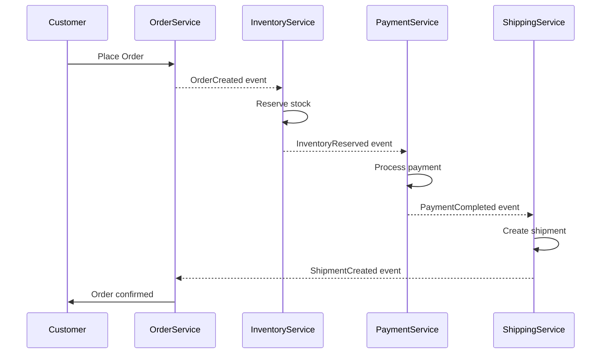
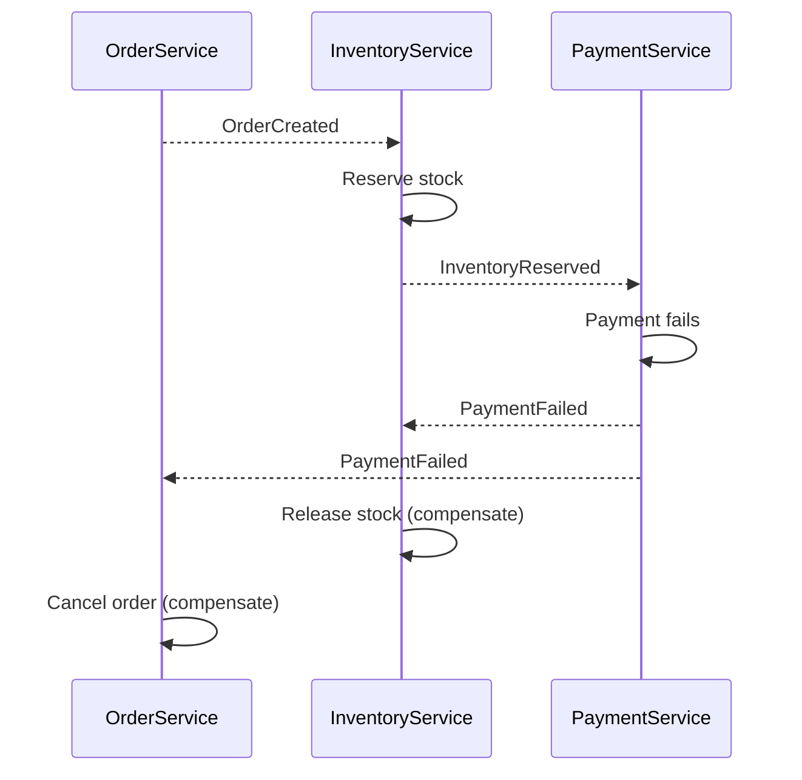
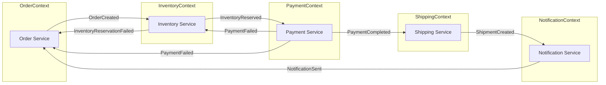

# How to Implement the Choreography Pattern in Microservices

Author: [nawazdhandala](https://github.com/nawazdhandala)

Tags: Microservices, Choreography, Events, Patterns

Description: Learn how to implement the choreography pattern for decoupled, event-driven microservices with saga compensation strategies.

---

In microservices architecture, coordinating distributed transactions across multiple services is one of the hardest problems to solve. The choreography pattern offers an elegant solution: instead of a central coordinator telling each service what to do, services react to events and make their own decisions.

This guide walks through the choreography pattern in depth, including when to use it, how to implement it, and how to handle failures with saga compensation.

---

## Table of Contents

1. What is the Choreography Pattern?
2. Choreography vs Orchestration
3. When to Use Choreography
4. Event-Driven Architecture Basics
5. Implementing Choreography with Events
6. Saga Compensation for Failure Handling
7. Event Schema Design
8. Practical Example: Order Processing
9. Monitoring and Debugging Choreographed Flows
10. Common Pitfalls and How to Avoid Them

---

## 1. What is the Choreography Pattern?

The choreography pattern is a coordination approach where each service publishes domain events when its state changes, and other services subscribe to those events to trigger their own operations. There is no central brain directing traffic. Each participant knows its role and reacts accordingly.

Think of it like a dance where everyone knows the steps. No one is shouting instructions from the sidelines. Each dancer watches the others and moves in response.



Each service listens for specific events and publishes its own events after completing its work. The flow emerges from these interactions rather than being explicitly programmed into a coordinator.

---

## 2. Choreography vs Orchestration

| Aspect | Choreography | Orchestration |
|--------|--------------|---------------|
| Control | Decentralized, no single point | Centralized orchestrator |
| Coupling | Loose, services only know events | Tighter, orchestrator knows all services |
| Visibility | Harder to trace flow | Easy to see full workflow |
| Failure handling | Each service handles its own compensation | Orchestrator manages rollback |
| Scalability | Better, no bottleneck | Orchestrator can become bottleneck |
| Complexity | Distributed across services | Concentrated in orchestrator |

**Use choreography when:**
- Services are owned by different teams
- You need maximum decoupling
- The workflow is relatively simple
- You want to avoid single points of failure

**Use orchestration when:**
- You need clear visibility into complex workflows
- Business logic requires conditional branching
- You need centralized error handling
- The workflow changes frequently

Many production systems use a hybrid approach: orchestration within a bounded context and choreography between bounded contexts.

---

## 3. When to Use Choreography

Choreography shines in specific scenarios:

**Event-driven domains:** When your business naturally thinks in terms of "when X happens, do Y." For example, "when an order is placed, reserve inventory."

**Independent team ownership:** When different teams own different services and you want them to evolve independently without coordinating deployments.

**Simple linear flows:** When the workflow is mostly sequential without complex branching logic.

**High availability requirements:** When you cannot afford a single point of failure that would halt all transactions.

Choreography struggles with:
- Complex conditional logic (if payment fails, try alternative, else cancel)
- Long-running transactions requiring human intervention
- Workflows needing centralized monitoring and management
- Scenarios where rollback order matters critically

---

## 4. Event-Driven Architecture Basics

Before implementing choreography, you need solid event infrastructure:

### Event Types

**Domain Events:** Represent something that happened in the business domain. Past tense naming: `OrderCreated`, `PaymentProcessed`, `InventoryReserved`.

**Integration Events:** Domain events published for consumption by other bounded contexts. May be simplified or transformed versions of internal domain events.

### Event Broker Selection

| Broker | Best For | Considerations |
|--------|----------|----------------|
| Apache Kafka | High throughput, event sourcing | Complex operations, needs expertise |
| RabbitMQ | Traditional messaging patterns | Simpler setup, good for most cases |
| AWS SNS/SQS | AWS-native applications | Managed service, good integration |
| Redis Streams | Low latency, simpler use cases | Limited durability options |

### Event Delivery Guarantees

**At-least-once:** Events may be delivered multiple times. Services must be idempotent.

**At-most-once:** Events delivered once or not at all. Possible data loss.

**Exactly-once:** Theoretical ideal, practically achieved through at-least-once + idempotency.

For choreography, at-least-once delivery with idempotent handlers is the standard approach.

---

## 5. Implementing Choreography with Events

### Event Publisher

```typescript
// events/publisher.ts
import { Kafka, Producer } from 'kafkajs';

interface DomainEvent {
  eventId: string;
  eventType: string;
  aggregateId: string;
  aggregateType: string;
  timestamp: string;
  payload: Record<string, unknown>;
  metadata: {
    correlationId: string;
    causationId?: string;
  };
}

class EventPublisher {
  private producer: Producer;

  constructor(kafka: Kafka) {
    this.producer = kafka.producer();
  }

  async connect(): Promise<void> {
    await this.producer.connect();
  }

  async publish(topic: string, event: DomainEvent): Promise<void> {
    await this.producer.send({
      topic,
      messages: [
        {
          key: event.aggregateId,
          value: JSON.stringify(event),
          headers: {
            'event-type': event.eventType,
            'correlation-id': event.metadata.correlationId,
          },
        },
      ],
    });
  }

  async disconnect(): Promise<void> {
    await this.producer.disconnect();
  }
}

export { EventPublisher, DomainEvent };
```

### Event Consumer

```typescript
// events/consumer.ts
import { Kafka, Consumer, EachMessagePayload } from 'kafkajs';
import { DomainEvent } from './publisher';

type EventHandler = (event: DomainEvent) => Promise<void>;

class EventConsumer {
  private consumer: Consumer;
  private handlers: Map<string, EventHandler[]> = new Map();

  constructor(kafka: Kafka, groupId: string) {
    this.consumer = kafka.consumer({ groupId });
  }

  async connect(): Promise<void> {
    await this.consumer.connect();
  }

  async subscribe(topics: string[]): Promise<void> {
    for (const topic of topics) {
      await this.consumer.subscribe({ topic, fromBeginning: false });
    }
  }

  on(eventType: string, handler: EventHandler): void {
    const existing = this.handlers.get(eventType) || [];
    this.handlers.set(eventType, [...existing, handler]);
  }

  async start(): Promise<void> {
    await this.consumer.run({
      eachMessage: async (payload: EachMessagePayload) => {
        const event: DomainEvent = JSON.parse(
          payload.message.value?.toString() || '{}'
        );
        const handlers = this.handlers.get(event.eventType) || [];

        for (const handler of handlers) {
          await handler(event);
        }
      },
    });
  }
}

export { EventConsumer };
```

### Service Implementation

```typescript
// services/inventory-service.ts
import { EventPublisher, EventConsumer, DomainEvent } from '../events';
import { v4 as uuid } from 'uuid';

interface InventoryReservation {
  orderId: string;
  items: { sku: string; quantity: number }[];
}

class InventoryService {
  private publisher: EventPublisher;
  private consumer: EventConsumer;
  private reservations: Map<string, InventoryReservation> = new Map();

  constructor(publisher: EventPublisher, consumer: EventConsumer) {
    this.publisher = publisher;
    this.consumer = consumer;
    this.setupHandlers();
  }

  private setupHandlers(): void {
    // React to OrderCreated events
    this.consumer.on('OrderCreated', async (event) => {
      await this.handleOrderCreated(event);
    });

    // React to PaymentFailed events for compensation
    this.consumer.on('PaymentFailed', async (event) => {
      await this.handlePaymentFailed(event);
    });
  }

  private async handleOrderCreated(event: DomainEvent): Promise<void> {
    const { orderId, items } = event.payload as {
      orderId: string;
      items: { sku: string; quantity: number }[];
    };

    try {
      // Check and reserve inventory
      const reserved = await this.reserveStock(orderId, items);

      if (reserved) {
        // Publish success event
        await this.publisher.publish('inventory-events', {
          eventId: uuid(),
          eventType: 'InventoryReserved',
          aggregateId: orderId,
          aggregateType: 'Order',
          timestamp: new Date().toISOString(),
          payload: { orderId, items },
          metadata: {
            correlationId: event.metadata.correlationId,
            causationId: event.eventId,
          },
        });
      } else {
        // Publish failure event
        await this.publisher.publish('inventory-events', {
          eventId: uuid(),
          eventType: 'InventoryReservationFailed',
          aggregateId: orderId,
          aggregateType: 'Order',
          timestamp: new Date().toISOString(),
          payload: { orderId, reason: 'Insufficient stock' },
          metadata: {
            correlationId: event.metadata.correlationId,
            causationId: event.eventId,
          },
        });
      }
    } catch (error) {
      // Publish failure event on error
      await this.publisher.publish('inventory-events', {
        eventId: uuid(),
        eventType: 'InventoryReservationFailed',
        aggregateId: orderId,
        aggregateType: 'Order',
        timestamp: new Date().toISOString(),
        payload: { orderId, reason: (error as Error).message },
        metadata: {
          correlationId: event.metadata.correlationId,
          causationId: event.eventId,
        },
      });
    }
  }

  private async handlePaymentFailed(event: DomainEvent): Promise<void> {
    const { orderId } = event.payload as { orderId: string };

    // Compensating action: release reserved inventory
    await this.releaseReservation(orderId);

    await this.publisher.publish('inventory-events', {
      eventId: uuid(),
      eventType: 'InventoryReleased',
      aggregateId: orderId,
      aggregateType: 'Order',
      timestamp: new Date().toISOString(),
      payload: { orderId },
      metadata: {
        correlationId: event.metadata.correlationId,
        causationId: event.eventId,
      },
    });
  }

  private async reserveStock(
    orderId: string,
    items: { sku: string; quantity: number }[]
  ): Promise<boolean> {
    // Business logic to reserve stock
    // Returns false if insufficient inventory
    this.reservations.set(orderId, { orderId, items });
    return true;
  }

  private async releaseReservation(orderId: string): Promise<void> {
    // Business logic to release reserved stock
    this.reservations.delete(orderId);
  }
}

export { InventoryService };
```

---

## 6. Saga Compensation for Failure Handling

In choreography, when a step fails, each service must know how to undo its own changes. This is the saga pattern applied in a decentralized way.



### Compensation Event Mapping

Each service maintains a mapping of which events trigger compensation:

```typescript
// services/compensation-map.ts
interface CompensationRule {
  triggerEvent: string;
  compensationAction: string;
  handler: (event: DomainEvent) => Promise<void>;
}

class CompensationRegistry {
  private rules: CompensationRule[] = [];

  register(rule: CompensationRule): void {
    this.rules.push(rule);
  }

  getRulesForEvent(eventType: string): CompensationRule[] {
    return this.rules.filter((r) => r.triggerEvent === eventType);
  }
}

// Usage in Inventory Service
const compensationRegistry = new CompensationRegistry();

compensationRegistry.register({
  triggerEvent: 'PaymentFailed',
  compensationAction: 'ReleaseInventory',
  handler: async (event) => {
    const { orderId } = event.payload as { orderId: string };
    await inventoryRepository.release(orderId);
  },
});

compensationRegistry.register({
  triggerEvent: 'ShippingFailed',
  compensationAction: 'ReleaseInventory',
  handler: async (event) => {
    const { orderId } = event.payload as { orderId: string };
    await inventoryRepository.release(orderId);
  },
});
```

### Idempotent Compensation

Compensation handlers must be idempotent because events can be delivered multiple times:

```typescript
// repositories/inventory-repository.ts
class InventoryRepository {
  private processedEvents: Set<string> = new Set();

  async release(orderId: string, eventId: string): Promise<void> {
    // Check if already processed
    if (this.processedEvents.has(eventId)) {
      console.log(`Event ${eventId} already processed, skipping`);
      return;
    }

    // Perform compensation
    const reservation = await this.findReservation(orderId);
    if (reservation) {
      await this.restoreStock(reservation.items);
      await this.deleteReservation(orderId);
    }

    // Mark as processed
    this.processedEvents.add(eventId);
    await this.persistProcessedEvent(eventId);
  }

  private async findReservation(orderId: string) {
    // Database lookup
  }

  private async restoreStock(items: { sku: string; quantity: number }[]) {
    // Restore inventory levels
  }

  private async deleteReservation(orderId: string) {
    // Remove reservation record
  }

  private async persistProcessedEvent(eventId: string) {
    // Store in database for crash recovery
  }
}
```

---

## 7. Event Schema Design

Well-designed events are critical for choreography to work smoothly across teams.

### Event Structure

```typescript
interface BaseEvent {
  // Identity
  eventId: string;          // Unique identifier for this event
  eventType: string;        // What happened: "OrderCreated"

  // Source
  aggregateId: string;      // ID of the entity that changed
  aggregateType: string;    // Type of entity: "Order"

  // Timing
  timestamp: string;        // ISO 8601 timestamp

  // Tracing
  metadata: {
    correlationId: string;  // Groups all events in a flow
    causationId?: string;   // The event that caused this one
    userId?: string;        // Who initiated the flow
  };
}

interface OrderCreatedEvent extends BaseEvent {
  eventType: 'OrderCreated';
  payload: {
    orderId: string;
    customerId: string;
    items: {
      sku: string;
      quantity: number;
      unitPrice: number;
    }[];
    totalAmount: number;
    currency: string;
  };
}
```

### Schema Evolution

Events are contracts. Changing them can break consumers. Follow these rules:

**Safe changes:**
- Adding optional fields
- Adding new event types
- Deprecating fields (but keep them)

**Breaking changes (avoid):**
- Removing fields
- Renaming fields
- Changing field types

Use schema versioning when breaking changes are unavoidable:

```typescript
interface OrderCreatedEventV2 extends BaseEvent {
  eventType: 'OrderCreated';
  version: 2;
  payload: {
    orderId: string;
    customerId: string;
    lineItems: {  // Renamed from 'items'
      productId: string;  // Changed from 'sku'
      quantity: number;
      price: {
        amount: number;
        currency: string;  // Moved from top level
      };
    }[];
  };
}
```

---

## 8. Practical Example: Order Processing

Let's build a complete order processing flow with choreography.

### System Overview



### Order Service

```typescript
// services/order-service.ts
import { EventPublisher, EventConsumer, DomainEvent } from '../events';
import { v4 as uuid } from 'uuid';

interface Order {
  id: string;
  customerId: string;
  items: { sku: string; quantity: number; price: number }[];
  status: 'pending' | 'confirmed' | 'cancelled' | 'shipped';
  totalAmount: number;
}

class OrderService {
  private publisher: EventPublisher;
  private consumer: EventConsumer;
  private orders: Map<string, Order> = new Map();

  constructor(publisher: EventPublisher, consumer: EventConsumer) {
    this.publisher = publisher;
    this.consumer = consumer;
    this.setupHandlers();
  }

  private setupHandlers(): void {
    this.consumer.on('PaymentCompleted', async (event) => {
      await this.handlePaymentCompleted(event);
    });

    this.consumer.on('PaymentFailed', async (event) => {
      await this.handlePaymentFailed(event);
    });

    this.consumer.on('InventoryReservationFailed', async (event) => {
      await this.handleInventoryFailed(event);
    });

    this.consumer.on('ShipmentCreated', async (event) => {
      await this.handleShipmentCreated(event);
    });
  }

  async createOrder(
    customerId: string,
    items: { sku: string; quantity: number; price: number }[]
  ): Promise<Order> {
    const orderId = uuid();
    const correlationId = uuid();
    const totalAmount = items.reduce(
      (sum, item) => sum + item.price * item.quantity,
      0
    );

    const order: Order = {
      id: orderId,
      customerId,
      items,
      status: 'pending',
      totalAmount,
    };

    this.orders.set(orderId, order);

    // Publish event to start the choreographed flow
    await this.publisher.publish('order-events', {
      eventId: uuid(),
      eventType: 'OrderCreated',
      aggregateId: orderId,
      aggregateType: 'Order',
      timestamp: new Date().toISOString(),
      payload: {
        orderId,
        customerId,
        items,
        totalAmount,
      },
      metadata: {
        correlationId,
      },
    });

    return order;
  }

  private async handlePaymentCompleted(event: DomainEvent): Promise<void> {
    const { orderId } = event.payload as { orderId: string };
    const order = this.orders.get(orderId);

    if (order) {
      order.status = 'confirmed';
      this.orders.set(orderId, order);
    }
  }

  private async handlePaymentFailed(event: DomainEvent): Promise<void> {
    const { orderId } = event.payload as { orderId: string };
    await this.cancelOrder(orderId, event.metadata.correlationId, event.eventId);
  }

  private async handleInventoryFailed(event: DomainEvent): Promise<void> {
    const { orderId } = event.payload as { orderId: string };
    await this.cancelOrder(orderId, event.metadata.correlationId, event.eventId);
  }

  private async handleShipmentCreated(event: DomainEvent): Promise<void> {
    const { orderId } = event.payload as { orderId: string };
    const order = this.orders.get(orderId);

    if (order) {
      order.status = 'shipped';
      this.orders.set(orderId, order);
    }
  }

  private async cancelOrder(
    orderId: string,
    correlationId: string,
    causationId: string
  ): Promise<void> {
    const order = this.orders.get(orderId);

    if (order && order.status === 'pending') {
      order.status = 'cancelled';
      this.orders.set(orderId, order);

      await this.publisher.publish('order-events', {
        eventId: uuid(),
        eventType: 'OrderCancelled',
        aggregateId: orderId,
        aggregateType: 'Order',
        timestamp: new Date().toISOString(),
        payload: { orderId },
        metadata: {
          correlationId,
          causationId,
        },
      });
    }
  }
}

export { OrderService, Order };
```

### Payment Service

```typescript
// services/payment-service.ts
import { EventPublisher, EventConsumer, DomainEvent } from '../events';
import { v4 as uuid } from 'uuid';

interface Payment {
  id: string;
  orderId: string;
  amount: number;
  status: 'pending' | 'completed' | 'failed' | 'refunded';
}

class PaymentService {
  private publisher: EventPublisher;
  private consumer: EventConsumer;
  private payments: Map<string, Payment> = new Map();

  constructor(publisher: EventPublisher, consumer: EventConsumer) {
    this.publisher = publisher;
    this.consumer = consumer;
    this.setupHandlers();
  }

  private setupHandlers(): void {
    this.consumer.on('InventoryReserved', async (event) => {
      await this.handleInventoryReserved(event);
    });

    this.consumer.on('ShippingFailed', async (event) => {
      await this.handleShippingFailed(event);
    });
  }

  private async handleInventoryReserved(event: DomainEvent): Promise<void> {
    const { orderId, totalAmount } = event.payload as {
      orderId: string;
      totalAmount: number;
    };

    const paymentId = uuid();
    const payment: Payment = {
      id: paymentId,
      orderId,
      amount: totalAmount,
      status: 'pending',
    };

    this.payments.set(paymentId, payment);

    try {
      // Process payment with external gateway
      const success = await this.processPayment(payment);

      if (success) {
        payment.status = 'completed';
        this.payments.set(paymentId, payment);

        await this.publisher.publish('payment-events', {
          eventId: uuid(),
          eventType: 'PaymentCompleted',
          aggregateId: paymentId,
          aggregateType: 'Payment',
          timestamp: new Date().toISOString(),
          payload: {
            paymentId,
            orderId,
            amount: totalAmount,
          },
          metadata: {
            correlationId: event.metadata.correlationId,
            causationId: event.eventId,
          },
        });
      } else {
        payment.status = 'failed';
        this.payments.set(paymentId, payment);

        await this.publisher.publish('payment-events', {
          eventId: uuid(),
          eventType: 'PaymentFailed',
          aggregateId: paymentId,
          aggregateType: 'Payment',
          timestamp: new Date().toISOString(),
          payload: {
            paymentId,
            orderId,
            reason: 'Payment declined',
          },
          metadata: {
            correlationId: event.metadata.correlationId,
            causationId: event.eventId,
          },
        });
      }
    } catch (error) {
      payment.status = 'failed';
      this.payments.set(paymentId, payment);

      await this.publisher.publish('payment-events', {
        eventId: uuid(),
        eventType: 'PaymentFailed',
        aggregateId: paymentId,
        aggregateType: 'Payment',
        timestamp: new Date().toISOString(),
        payload: {
          paymentId,
          orderId,
          reason: (error as Error).message,
        },
        metadata: {
          correlationId: event.metadata.correlationId,
          causationId: event.eventId,
        },
      });
    }
  }

  private async handleShippingFailed(event: DomainEvent): Promise<void> {
    const { orderId } = event.payload as { orderId: string };

    // Find payment for this order and refund
    for (const payment of this.payments.values()) {
      if (payment.orderId === orderId && payment.status === 'completed') {
        await this.refundPayment(payment);

        payment.status = 'refunded';
        this.payments.set(payment.id, payment);

        await this.publisher.publish('payment-events', {
          eventId: uuid(),
          eventType: 'PaymentRefunded',
          aggregateId: payment.id,
          aggregateType: 'Payment',
          timestamp: new Date().toISOString(),
          payload: {
            paymentId: payment.id,
            orderId,
            amount: payment.amount,
          },
          metadata: {
            correlationId: event.metadata.correlationId,
            causationId: event.eventId,
          },
        });
        break;
      }
    }
  }

  private async processPayment(payment: Payment): Promise<boolean> {
    // Integration with payment gateway
    // Returns true if successful
    return true;
  }

  private async refundPayment(payment: Payment): Promise<void> {
    // Refund logic
  }
}

export { PaymentService };
```

---

## 9. Monitoring and Debugging Choreographed Flows

Choreography makes it harder to see the big picture. Invest in observability.

### Correlation ID Propagation

Every event in a flow shares the same correlation ID. Use it to trace the entire journey:

```typescript
// middleware/correlation.ts
import { trace, context } from '@opentelemetry/api';

function extractCorrelationId(event: DomainEvent): string {
  return event.metadata.correlationId;
}

function createSpanForEvent(event: DomainEvent) {
  const tracer = trace.getTracer('choreography-tracer');
  const span = tracer.startSpan(`handle.${event.eventType}`, {
    attributes: {
      'event.id': event.eventId,
      'event.type': event.eventType,
      'correlation.id': event.metadata.correlationId,
      'causation.id': event.metadata.causationId || 'none',
      'aggregate.id': event.aggregateId,
      'aggregate.type': event.aggregateType,
    },
  });
  return span;
}
```

### Event Flow Visualization

Build a query to reconstruct flows from your event store or logging system:

```sql
-- Find all events in a choreographed flow
SELECT
  event_id,
  event_type,
  aggregate_type,
  aggregate_id,
  timestamp,
  payload
FROM events
WHERE correlation_id = 'abc-123'
ORDER BY timestamp ASC;
```

### Health Checks for Event Processing

```typescript
// health/event-health.ts
interface EventProcessingHealth {
  service: string;
  lastEventProcessed: string | null;
  lastEventTimestamp: string | null;
  lag: number;
  status: 'healthy' | 'degraded' | 'unhealthy';
}

class EventHealthMonitor {
  private lastProcessedTime: Date | null = null;
  private processedCount = 0;
  private errorCount = 0;

  recordProcessed(): void {
    this.lastProcessedTime = new Date();
    this.processedCount++;
  }

  recordError(): void {
    this.errorCount++;
  }

  getHealth(): EventProcessingHealth {
    const lag = this.lastProcessedTime
      ? Date.now() - this.lastProcessedTime.getTime()
      : Infinity;

    let status: 'healthy' | 'degraded' | 'unhealthy' = 'healthy';
    if (lag > 60000) status = 'degraded';
    if (lag > 300000 || this.errorCount > 10) status = 'unhealthy';

    return {
      service: 'inventory-service',
      lastEventProcessed: this.lastProcessedTime?.toISOString() || null,
      lastEventTimestamp: null,
      lag,
      status,
    };
  }
}
```

---

## 10. Common Pitfalls and How to Avoid Them

### Pitfall 1: Missing Events

**Problem:** An event is published but no service picks it up, leaving the flow incomplete.

**Solution:** Implement dead letter queues and monitoring for unprocessed events:

```typescript
// Configure dead letter queue in Kafka
const consumerConfig = {
  groupId: 'inventory-service',
  retry: {
    maxRetries: 3,
    initialRetryTime: 300,
    retries: 3,
  },
};

// After max retries, publish to dead letter topic
async function handleWithDeadLetter(
  event: DomainEvent,
  handler: (e: DomainEvent) => Promise<void>
): Promise<void> {
  try {
    await handler(event);
  } catch (error) {
    await publisher.publish('dead-letter-events', {
      ...event,
      metadata: {
        ...event.metadata,
        error: (error as Error).message,
        failedAt: new Date().toISOString(),
      },
    });
  }
}
```

### Pitfall 2: Event Ordering Issues

**Problem:** Events arrive out of order, causing invalid state transitions.

**Solution:** Use aggregate versioning and handle out-of-order events gracefully:

```typescript
interface VersionedEvent extends DomainEvent {
  aggregateVersion: number;
}

async function handleVersionedEvent(event: VersionedEvent): Promise<void> {
  const currentVersion = await getAggregateVersion(event.aggregateId);

  if (event.aggregateVersion <= currentVersion) {
    // Already processed or duplicate
    console.log(`Skipping event with version ${event.aggregateVersion}`);
    return;
  }

  if (event.aggregateVersion > currentVersion + 1) {
    // Missing intermediate events, queue for later
    await queueForLater(event);
    return;
  }

  // Process normally
  await processEvent(event);
  await updateAggregateVersion(event.aggregateId, event.aggregateVersion);
}
```

### Pitfall 3: Circular Event Dependencies

**Problem:** Service A publishes an event that triggers Service B, which publishes an event that triggers Service A, creating an infinite loop.

**Solution:** Design events to be terminal or include loop detection:

```typescript
interface EventWithDepth extends DomainEvent {
  metadata: {
    correlationId: string;
    causationId?: string;
    depth: number;  // Track event chain depth
  };
}

async function publishWithDepthCheck(
  event: EventWithDepth,
  maxDepth: number = 10
): Promise<void> {
  if (event.metadata.depth >= maxDepth) {
    console.error(`Event chain depth exceeded for correlation ${event.metadata.correlationId}`);
    await publishToAlertTopic(event);
    return;
  }

  await publisher.publish('events', event);
}
```

### Pitfall 4: Incomplete Compensation

**Problem:** A failure event triggers compensation in some services but not others.

**Solution:** Use a compensation registry and verify all compensations completed:

```typescript
// Track expected compensations for each failure type
const compensationExpectations = new Map<string, string[]>([
  ['PaymentFailed', ['InventoryReleased', 'OrderCancelled']],
  ['ShippingFailed', ['PaymentRefunded', 'InventoryReleased', 'OrderCancelled']],
]);

async function verifyCompensation(
  correlationId: string,
  failureEvent: string
): Promise<void> {
  const expected = compensationExpectations.get(failureEvent) || [];
  const received = await getEventsForCorrelation(correlationId);
  const receivedTypes = received.map((e) => e.eventType);

  const missing = expected.filter((e) => !receivedTypes.includes(e));

  if (missing.length > 0) {
    console.error(`Missing compensations for ${correlationId}: ${missing.join(', ')}`);
    await triggerManualReview(correlationId, missing);
  }
}
```

---

## Summary

The choreography pattern enables loosely coupled microservices to coordinate through events without a central orchestrator. Each service reacts to events, performs its work, and publishes its own events.

Key takeaways:

| Aspect | Recommendation |
|--------|----------------|
| Event design | Use past tense naming, include correlation/causation IDs, version schemas |
| Compensation | Every service must handle its own rollback, keep handlers idempotent |
| Observability | Trace flows with correlation IDs, monitor event lag, use dead letter queues |
| Error handling | Plan for out-of-order events, missing events, and circular dependencies |
| Testing | Test happy paths and all failure scenarios including partial failures |

Choreography is not always the right choice. For complex workflows with many conditional branches, consider orchestration or a hybrid approach. But when your domain naturally fits event-driven thinking and you value decoupling, choreography lets your services dance together without stepping on each other's toes.

---

**Related Reading:**

- [What are Traces and Spans in OpenTelemetry](/blog/post/2025-08-27-traces-and-spans-in-opentelemetry/)
- [SRE Best Practices](/blog/post/2025-11-28-sre-best-practices/)
