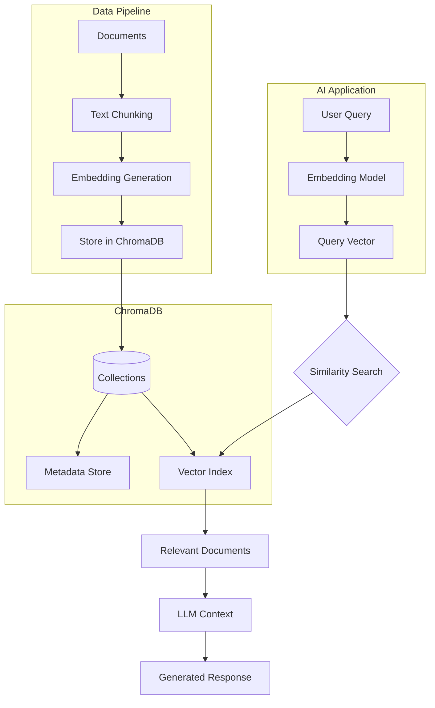
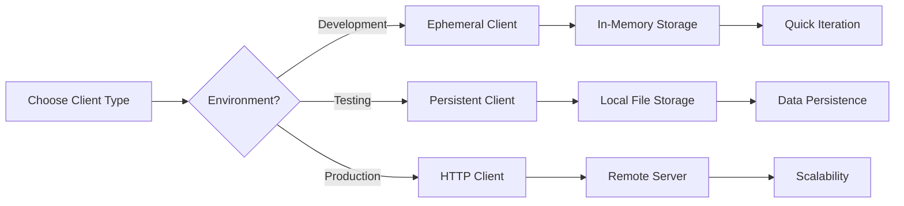
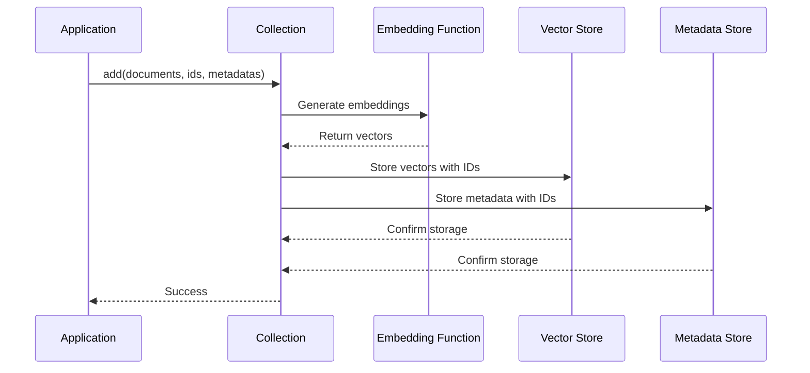
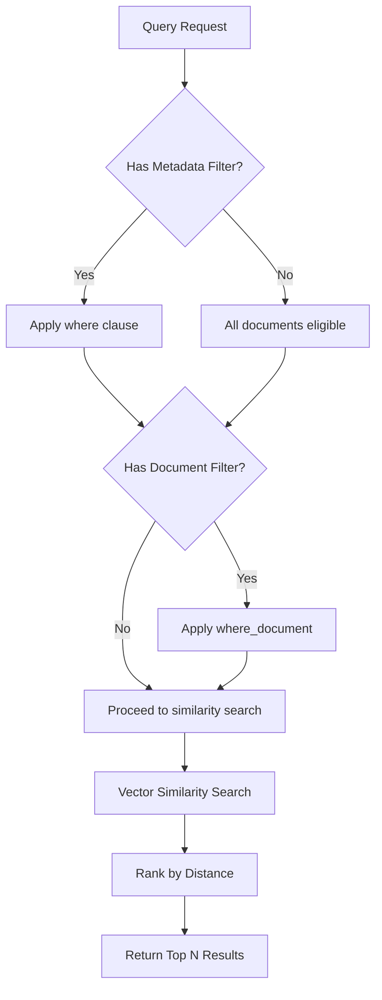
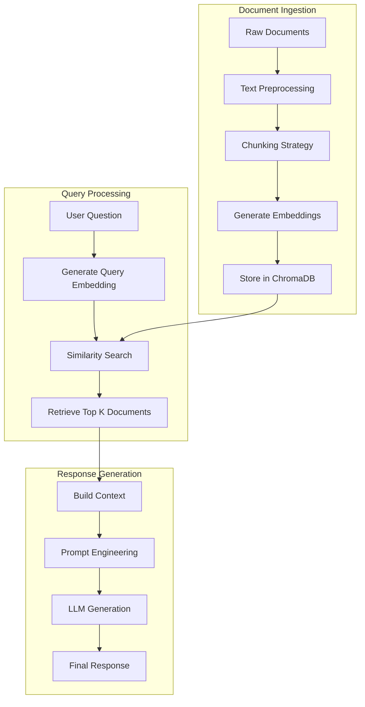

# How to Create ChromaDB Integration

Author: [nawazdhandala](https://github.com/nawazdhandala)

Tags: ChromaDB, Vector Database, Embeddings, RAG

Description: Learn to integrate ChromaDB for local-first vector storage with collection management, metadata filtering, and embedding functions for RAG applications.

---

## Introduction

ChromaDB is an open-source embedding database designed for AI applications. It provides a simple yet powerful way to store, search, and retrieve vector embeddings - making it an excellent choice for building Retrieval-Augmented Generation (RAG) systems, semantic search engines, and recommendation systems.

In this guide, we will walk through creating a complete ChromaDB integration, covering everything from basic setup to advanced querying patterns.

## Architecture Overview

Before diving into the code, let us understand how ChromaDB fits into a typical AI application architecture.



## Installation

First, install ChromaDB using pip:

```bash
pip install chromadb
```

For production deployments with additional features, you may want to install optional dependencies:

```bash
pip install chromadb[client]  # For client-server mode
```

## Client Setup

ChromaDB offers multiple client modes depending on your use case. Let us explore each option.

### Ephemeral Client (In-Memory)

The ephemeral client stores data in memory and is perfect for testing and development:

```python
import chromadb

# Create an ephemeral client - data exists only in memory
client = chromadb.Client()

# Verify the connection
print(f"ChromaDB heartbeat: {client.heartbeat()}")
```

### Persistent Client (Local Storage)

For applications that need data persistence across restarts:

```python
import chromadb
from chromadb.config import Settings

# Create a persistent client with local storage
client = chromadb.PersistentClient(
    path="./chroma_db",
    settings=Settings(
        anonymized_telemetry=False,
        allow_reset=True
    )
)

print(f"Data will be stored at: ./chroma_db")
```

### HTTP Client (Client-Server Mode)

For production deployments, use the HTTP client to connect to a ChromaDB server:

```python
import chromadb

# Connect to a ChromaDB server
client = chromadb.HttpClient(
    host="localhost",
    port=8000,
    headers={"Authorization": "Bearer your-api-key"}  # Optional auth
)

# Test the connection
print(f"Server heartbeat: {client.heartbeat()}")
```

## Client Setup Flow



## Working with Collections

Collections are the primary way to organize your embeddings in ChromaDB. Think of them as tables in a traditional database.

### Creating Collections

```python
import chromadb

client = chromadb.PersistentClient(path="./chroma_db")

# Create a new collection
collection = client.create_collection(
    name="documents",
    metadata={"description": "Main document collection"}
)

# Or get an existing collection (creates if not exists)
collection = client.get_or_create_collection(
    name="documents",
    metadata={"description": "Main document collection"}
)

print(f"Collection '{collection.name}' ready with {collection.count()} documents")
```

### Collection with Custom Embedding Function

ChromaDB allows you to specify custom embedding functions:

```python
import chromadb
from chromadb.utils import embedding_functions

# Use OpenAI embeddings
openai_ef = embedding_functions.OpenAIEmbeddingFunction(
    api_key="your-openai-api-key",
    model_name="text-embedding-3-small"
)

# Create collection with OpenAI embeddings
collection = client.get_or_create_collection(
    name="openai_docs",
    embedding_function=openai_ef
)

# Use Sentence Transformers (local, no API needed)
sentence_transformer_ef = embedding_functions.SentenceTransformerEmbeddingFunction(
    model_name="all-MiniLM-L6-v2"
)

# Create collection with local embeddings
local_collection = client.get_or_create_collection(
    name="local_docs",
    embedding_function=sentence_transformer_ef
)
```

### Managing Collections

```python
# List all collections
collections = client.list_collections()
for col in collections:
    print(f"Collection: {col.name}, Count: {col.count()}")

# Get a specific collection
collection = client.get_collection(name="documents")

# Delete a collection
client.delete_collection(name="old_collection")

# Get collection count
doc_count = collection.count()
print(f"Total documents: {doc_count}")
```

## Adding Documents and Embeddings

ChromaDB provides flexible ways to add data to your collections.

### Adding Documents with Auto-Generated Embeddings

```python
# Add documents - embeddings are generated automatically
collection.add(
    documents=[
        "ChromaDB is a vector database for AI applications.",
        "Vector databases store high-dimensional embeddings.",
        "RAG combines retrieval with language model generation."
    ],
    ids=["doc1", "doc2", "doc3"],
    metadatas=[
        {"source": "blog", "category": "database"},
        {"source": "documentation", "category": "concepts"},
        {"source": "tutorial", "category": "ai"}
    ]
)
```

### Adding Pre-Computed Embeddings

If you have already generated embeddings, you can add them directly:

```python
import numpy as np

# Pre-computed embeddings (384 dimensions for all-MiniLM-L6-v2)
embeddings = [
    np.random.rand(384).tolist(),
    np.random.rand(384).tolist()
]

collection.add(
    embeddings=embeddings,
    documents=["First document text", "Second document text"],
    ids=["emb1", "emb2"],
    metadatas=[
        {"type": "precomputed"},
        {"type": "precomputed"}
    ]
)
```

### Batch Operations for Large Datasets

For large datasets, process documents in batches:

```python
def add_documents_in_batches(collection, documents, batch_size=100):
    """Add documents to collection in batches for better performance."""
    total = len(documents)

    for i in range(0, total, batch_size):
        batch = documents[i:i + batch_size]
        batch_ids = [f"doc_{j}" for j in range(i, min(i + batch_size, total))]
        batch_docs = [doc["text"] for doc in batch]
        batch_metadata = [doc.get("metadata", {}) for doc in batch]

        collection.add(
            documents=batch_docs,
            ids=batch_ids,
            metadatas=batch_metadata
        )

        print(f"Added batch {i // batch_size + 1}/{(total + batch_size - 1) // batch_size}")

# Example usage
documents = [
    {"text": f"Document number {i}", "metadata": {"index": i}}
    for i in range(1000)
]

add_documents_in_batches(collection, documents, batch_size=100)
```

## Data Flow for Document Storage



## Querying and Similarity Search

The real power of ChromaDB lies in its querying capabilities.

### Basic Query

```python
# Query with text - embedding is generated automatically
results = collection.query(
    query_texts=["What is a vector database?"],
    n_results=5
)

# Access results
for i, doc in enumerate(results["documents"][0]):
    distance = results["distances"][0][i]
    metadata = results["metadatas"][0][i]
    doc_id = results["ids"][0][i]

    print(f"Rank {i + 1}:")
    print(f"  ID: {doc_id}")
    print(f"  Distance: {distance:.4f}")
    print(f"  Metadata: {metadata}")
    print(f"  Content: {doc[:100]}...")
    print()
```

### Query with Pre-Computed Embeddings

```python
# If you have pre-computed query embeddings
query_embedding = np.random.rand(384).tolist()

results = collection.query(
    query_embeddings=[query_embedding],
    n_results=10,
    include=["documents", "metadatas", "distances", "embeddings"]
)
```

### Multiple Queries at Once

```python
# Run multiple queries in a single call
results = collection.query(
    query_texts=[
        "How do vector databases work?",
        "What is RAG architecture?",
        "Explain embedding models"
    ],
    n_results=3
)

# Results are organized by query
for query_idx, query in enumerate(results["documents"]):
    print(f"Results for query {query_idx + 1}:")
    for doc_idx, doc in enumerate(query):
        print(f"  {doc_idx + 1}. {doc[:50]}...")
```

## Metadata Filtering

ChromaDB supports powerful metadata filtering to narrow down search results.

### Basic Filters

```python
# Filter by exact match
results = collection.query(
    query_texts=["database concepts"],
    n_results=10,
    where={"category": "database"}
)

# Filter with comparison operators
results = collection.query(
    query_texts=["recent articles"],
    n_results=10,
    where={"timestamp": {"$gt": 1700000000}}
)
```

### Available Filter Operators

```python
# Equality
where = {"field": "value"}
where = {"field": {"$eq": "value"}}

# Inequality
where = {"field": {"$ne": "value"}}

# Numeric comparisons
where = {"count": {"$gt": 10}}    # Greater than
where = {"count": {"$gte": 10}}   # Greater than or equal
where = {"count": {"$lt": 100}}   # Less than
where = {"count": {"$lte": 100}}  # Less than or equal

# In list
where = {"category": {"$in": ["tech", "science", "ai"]}}

# Not in list
where = {"category": {"$nin": ["spam", "draft"]}}
```

### Compound Filters

```python
# AND condition
results = collection.query(
    query_texts=["machine learning"],
    n_results=10,
    where={
        "$and": [
            {"category": "ai"},
            {"published": True},
            {"views": {"$gt": 1000}}
        ]
    }
)

# OR condition
results = collection.query(
    query_texts=["programming tutorials"],
    n_results=10,
    where={
        "$or": [
            {"language": "python"},
            {"language": "javascript"}
        ]
    }
)

# Combined AND/OR
results = collection.query(
    query_texts=["advanced topics"],
    n_results=10,
    where={
        "$and": [
            {"published": True},
            {
                "$or": [
                    {"level": "advanced"},
                    {"level": "expert"}
                ]
            }
        ]
    }
)
```

### Document Content Filtering

```python
# Filter based on document content
results = collection.query(
    query_texts=["introduction"],
    n_results=10,
    where_document={"$contains": "getting started"}
)

# Combine with metadata filters
results = collection.query(
    query_texts=["tutorial"],
    n_results=10,
    where={"category": "beginner"},
    where_document={"$contains": "step by step"}
)
```

## Filtering Logic Flow



## Updating and Deleting Data

### Updating Documents

```python
# Update existing documents
collection.update(
    ids=["doc1", "doc2"],
    documents=[
        "Updated content for document 1",
        "Updated content for document 2"
    ],
    metadatas=[
        {"source": "blog", "category": "database", "updated": True},
        {"source": "documentation", "category": "concepts", "updated": True}
    ]
)

# Upsert - update if exists, insert if not
collection.upsert(
    ids=["doc1", "new_doc"],
    documents=[
        "Upserted content for existing doc",
        "Brand new document content"
    ],
    metadatas=[
        {"type": "upserted"},
        {"type": "new"}
    ]
)
```

### Deleting Documents

```python
# Delete by IDs
collection.delete(ids=["doc1", "doc2"])

# Delete by filter
collection.delete(where={"category": "deprecated"})

# Delete all documents matching content filter
collection.delete(where_document={"$contains": "outdated"})

# Combine filters
collection.delete(
    where={
        "$and": [
            {"status": "draft"},
            {"created_at": {"$lt": 1600000000}}
        ]
    }
)
```

## Persistence and Data Management

### Persistent Storage Configuration

```python
import chromadb
from chromadb.config import Settings

# Configure persistent storage with custom settings
client = chromadb.PersistentClient(
    path="./production_db",
    settings=Settings(
        anonymized_telemetry=False,
        allow_reset=False,  # Prevent accidental data deletion
        is_persistent=True
    )
)

# Data is automatically persisted after each operation
collection = client.get_or_create_collection("production_docs")
collection.add(
    documents=["Important production data"],
    ids=["prod_1"]
)
# Data is now safely stored on disk
```

### Backup and Migration

```python
import shutil
import os
from datetime import datetime

def backup_chromadb(source_path, backup_dir):
    """Create a backup of the ChromaDB database."""
    timestamp = datetime.now().strftime("%Y%m%d_%H%M%S")
    backup_path = os.path.join(backup_dir, f"chroma_backup_{timestamp}")

    shutil.copytree(source_path, backup_path)
    print(f"Backup created at: {backup_path}")
    return backup_path

def migrate_collection(source_client, dest_client, collection_name, batch_size=100):
    """Migrate a collection from one client to another."""
    source_collection = source_client.get_collection(collection_name)

    # Get all data from source
    total_count = source_collection.count()

    # Create destination collection
    dest_collection = dest_client.get_or_create_collection(
        name=collection_name,
        metadata=source_collection.metadata
    )

    # Migrate in batches
    for offset in range(0, total_count, batch_size):
        results = source_collection.get(
            limit=batch_size,
            offset=offset,
            include=["documents", "metadatas", "embeddings"]
        )

        if results["ids"]:
            dest_collection.add(
                ids=results["ids"],
                documents=results["documents"],
                metadatas=results["metadatas"],
                embeddings=results["embeddings"]
            )

        print(f"Migrated {min(offset + batch_size, total_count)}/{total_count}")

    print(f"Migration complete: {total_count} documents")

# Usage
backup_chromadb("./chroma_db", "./backups")
```

## Complete RAG Integration Example

Here is a complete example showing how to build a RAG system with ChromaDB:

```python
import chromadb
from chromadb.utils import embedding_functions
import openai

class RAGSystem:
    def __init__(self, db_path="./rag_db", openai_api_key=None):
        """Initialize the RAG system with ChromaDB."""
        self.client = chromadb.PersistentClient(path=db_path)

        # Set up embedding function
        if openai_api_key:
            self.embedding_fn = embedding_functions.OpenAIEmbeddingFunction(
                api_key=openai_api_key,
                model_name="text-embedding-3-small"
            )
        else:
            self.embedding_fn = embedding_functions.SentenceTransformerEmbeddingFunction(
                model_name="all-MiniLM-L6-v2"
            )

        # Create or get collection
        self.collection = self.client.get_or_create_collection(
            name="knowledge_base",
            embedding_function=self.embedding_fn,
            metadata={"hnsw:space": "cosine"}  # Use cosine similarity
        )

        self.openai_client = openai.OpenAI(api_key=openai_api_key) if openai_api_key else None

    def add_documents(self, documents, metadatas=None):
        """Add documents to the knowledge base."""
        ids = [f"doc_{self.collection.count() + i}" for i in range(len(documents))]

        self.collection.add(
            documents=documents,
            ids=ids,
            metadatas=metadatas or [{}] * len(documents)
        )

        return ids

    def search(self, query, n_results=5, where=None):
        """Search for relevant documents."""
        results = self.collection.query(
            query_texts=[query],
            n_results=n_results,
            where=where,
            include=["documents", "metadatas", "distances"]
        )

        return results

    def generate_response(self, query, n_context=5):
        """Generate a response using RAG."""
        # Retrieve relevant context
        search_results = self.search(query, n_results=n_context)

        # Build context from retrieved documents
        context_parts = []
        for i, doc in enumerate(search_results["documents"][0]):
            metadata = search_results["metadatas"][0][i]
            source = metadata.get("source", "Unknown")
            context_parts.append(f"[Source: {source}]\n{doc}")

        context = "\n\n---\n\n".join(context_parts)

        # Generate response with LLM
        if self.openai_client:
            response = self.openai_client.chat.completions.create(
                model="gpt-4",
                messages=[
                    {
                        "role": "system",
                        "content": "You are a helpful assistant. Use the provided context to answer questions. If the context does not contain relevant information, say so."
                    },
                    {
                        "role": "user",
                        "content": f"Context:\n{context}\n\nQuestion: {query}"
                    }
                ],
                temperature=0.7
            )
            return {
                "answer": response.choices[0].message.content,
                "sources": search_results["metadatas"][0],
                "context_used": search_results["documents"][0]
            }
        else:
            return {
                "context": context,
                "sources": search_results["metadatas"][0],
                "message": "OpenAI client not configured - returning context only"
            }

# Usage example
rag = RAGSystem(db_path="./my_rag_db")

# Add knowledge base documents
rag.add_documents(
    documents=[
        "ChromaDB is an open-source embedding database for AI applications.",
        "Vector databases enable semantic search by comparing embedding similarities.",
        "RAG systems combine retrieval with generation for accurate responses."
    ],
    metadatas=[
        {"source": "chromadb_docs", "topic": "overview"},
        {"source": "vector_db_guide", "topic": "concepts"},
        {"source": "rag_tutorial", "topic": "architecture"}
    ]
)

# Query the system
result = rag.search("How does ChromaDB work?")
print("Search Results:", result)
```

## RAG System Architecture



## Best Practices

### 1. Choose the Right Embedding Model

```python
# For general purpose - good balance of speed and quality
sentence_transformer_ef = embedding_functions.SentenceTransformerEmbeddingFunction(
    model_name="all-MiniLM-L6-v2"  # 384 dimensions, fast
)

# For higher quality - better semantic understanding
openai_ef = embedding_functions.OpenAIEmbeddingFunction(
    api_key="your-key",
    model_name="text-embedding-3-small"  # 1536 dimensions
)

# For multilingual support
multilingual_ef = embedding_functions.SentenceTransformerEmbeddingFunction(
    model_name="paraphrase-multilingual-MiniLM-L12-v2"
)
```

### 2. Optimize Collection Settings

```python
# Configure HNSW index for better performance
collection = client.get_or_create_collection(
    name="optimized_collection",
    metadata={
        "hnsw:space": "cosine",      # Distance metric
        "hnsw:construction_ef": 200,  # Higher = better quality, slower indexing
        "hnsw:search_ef": 100,        # Higher = better quality, slower search
        "hnsw:M": 16                   # Connections per element
    }
)
```

### 3. Implement Proper Error Handling

```python
from chromadb.errors import InvalidCollectionException

def safe_query(collection, query_text, n_results=5):
    """Safely query a collection with error handling."""
    try:
        results = collection.query(
            query_texts=[query_text],
            n_results=n_results
        )
        return {"success": True, "results": results}
    except InvalidCollectionException as e:
        return {"success": False, "error": f"Collection error: {e}"}
    except Exception as e:
        return {"success": False, "error": f"Query failed: {e}"}
```

### 4. Monitor Collection Health

```python
def get_collection_stats(collection):
    """Get statistics about a collection."""
    count = collection.count()

    # Sample some documents to check metadata
    sample = collection.get(limit=10, include=["metadatas"])

    metadata_keys = set()
    for meta in sample["metadatas"]:
        metadata_keys.update(meta.keys())

    return {
        "total_documents": count,
        "metadata_fields": list(metadata_keys),
        "sample_ids": sample["ids"]
    }

stats = get_collection_stats(collection)
print(f"Collection has {stats['total_documents']} documents")
print(f"Metadata fields: {stats['metadata_fields']}")
```

## Conclusion

ChromaDB provides a powerful and flexible foundation for building AI applications that require vector storage and similarity search. Its simplicity in setup - whether using an ephemeral client for development or a persistent client for production - combined with its rich querying capabilities and metadata filtering make it an excellent choice for RAG systems and semantic search applications.

Key takeaways:

- Start with the ephemeral client for rapid prototyping, then move to persistent storage for production
- Choose embedding models based on your specific needs - local models for privacy, API-based for quality
- Use metadata filtering to narrow down search results and improve relevance
- Implement batch operations for large-scale data ingestion
- Always include proper error handling and monitoring in production systems

With these patterns and practices, you can build robust AI applications that leverage the full power of vector search and retrieval-augmented generation.

## Resources

- [ChromaDB Documentation](https://docs.trychroma.com/)
- [ChromaDB GitHub Repository](https://github.com/chroma-core/chroma)
- [Sentence Transformers](https://www.sbert.net/)
- [OpenAI Embeddings Guide](https://platform.openai.com/docs/guides/embeddings)
