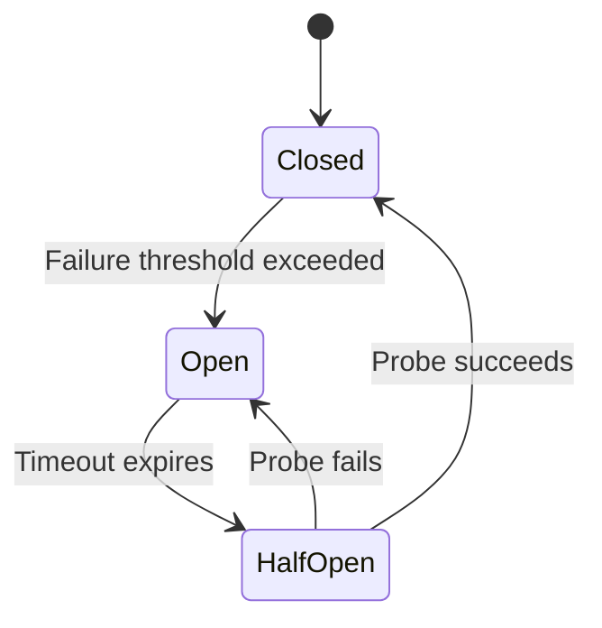

# How to Build Circuit Breaker Implementation

Author: [nawazdhandala](https://www.github.com/nawazdhandala)

Tags: Microservices, Resilience, Design Patterns, Fault Tolerance, Distributed Systems

Description: Implement the circuit breaker pattern from scratch with states, thresholds, half-open testing, and integration with monitoring systems.

---

When services fail in a distributed system, the ripple effects can be devastating. A single slow or unresponsive dependency can tie up threads, exhaust connection pools, and bring your entire application to its knees. The circuit breaker pattern addresses this by detecting failures early and preventing cascading outages.

In this guide, you will build a circuit breaker from scratch. Rather than relying on a library, understanding the internals helps you make better decisions about configuration and troubleshooting in production.

## Understanding the Circuit Breaker Pattern

The circuit breaker pattern takes its name from electrical circuit breakers that protect your home from power surges. In software, it wraps potentially failing operations and monitors their health. When failures exceed a threshold, the circuit "opens" and immediately rejects requests without attempting the actual operation.

Here is how the three states work:



**Closed**: Normal operation. Requests pass through and the breaker tracks success and failure counts.

**Open**: The breaker has detected too many failures. All requests fail immediately without calling the downstream service.

**Half-Open**: After a timeout period, the breaker allows a limited number of test requests through. If they succeed, the circuit closes. If they fail, it opens again.

## Building the Core Circuit Breaker

Let us start with the fundamental structure. We need to track state, failure counts, and timing information.

```typescript
// Define the three possible states for our circuit breaker
enum CircuitState {
  CLOSED = "CLOSED",
  OPEN = "OPEN",
  HALF_OPEN = "HALF_OPEN",
}

// Configuration options that control circuit breaker behavior
interface CircuitBreakerConfig {
  // Number of failures before the circuit opens
  failureThreshold: number;
  // Number of successes needed in half-open state to close the circuit
  successThreshold: number;
  // How long to wait before transitioning from open to half-open (ms)
  timeout: number;
  // Optional callback when state changes
  onStateChange?: (from: CircuitState, to: CircuitState) => void;
}

// Internal statistics tracked by the circuit breaker
interface CircuitStats {
  failures: number;
  successes: number;
  lastFailureTime: number | null;
  consecutiveSuccesses: number;
}
```

Now we implement the main circuit breaker class with state management:

```typescript
class CircuitBreaker {
  private state: CircuitState = CircuitState.CLOSED;
  private stats: CircuitStats = {
    failures: 0,
    successes: 0,
    lastFailureTime: null,
    consecutiveSuccesses: 0,
  };
  private config: CircuitBreakerConfig;

  constructor(config: CircuitBreakerConfig) {
    // Store configuration with sensible defaults
    this.config = {
      failureThreshold: config.failureThreshold || 5,
      successThreshold: config.successThreshold || 2,
      timeout: config.timeout || 30000,
      onStateChange: config.onStateChange,
    };
  }

  // Get the current state of the circuit
  getState(): CircuitState {
    return this.state;
  }

  // Transition to a new state and notify listeners
  private transitionTo(newState: CircuitState): void {
    if (this.state !== newState) {
      const oldState = this.state;
      this.state = newState;

      // Reset stats when transitioning to closed state
      if (newState === CircuitState.CLOSED) {
        this.stats.failures = 0;
        this.stats.consecutiveSuccesses = 0;
      }

      // Notify callback if configured
      if (this.config.onStateChange) {
        this.config.onStateChange(oldState, newState);
      }
    }
  }
}
```

## Implementing the Execute Method

The execute method is where the circuit breaker logic comes together. It decides whether to allow requests and tracks their outcomes.

```typescript
class CircuitBreaker {
  // ... previous code ...

  // Execute a function through the circuit breaker
  async execute<T>(fn: () => Promise<T>): Promise<T> {
    // Check if we should allow this request
    if (!this.canExecute()) {
      throw new Error("Circuit breaker is OPEN - request rejected");
    }

    try {
      // Attempt to execute the wrapped function
      const result = await fn();
      this.recordSuccess();
      return result;
    } catch (error) {
      this.recordFailure();
      throw error;
    }
  }

  // Determine if a request should be allowed through
  private canExecute(): boolean {
    switch (this.state) {
      case CircuitState.CLOSED:
        // Always allow requests when closed
        return true;

      case CircuitState.OPEN:
        // Check if timeout has elapsed to transition to half-open
        if (this.shouldAttemptReset()) {
          this.transitionTo(CircuitState.HALF_OPEN);
          return true;
        }
        return false;

      case CircuitState.HALF_OPEN:
        // Allow limited requests to probe the service
        return true;

      default:
        return false;
    }
  }

  // Check if enough time has passed to try resetting the circuit
  private shouldAttemptReset(): boolean {
    if (!this.stats.lastFailureTime) {
      return false;
    }
    const elapsed = Date.now() - this.stats.lastFailureTime;
    return elapsed >= this.config.timeout;
  }
}
```

## Tracking Success and Failure

Recording outcomes correctly is essential for proper state transitions:

```typescript
class CircuitBreaker {
  // ... previous code ...

  // Record a successful operation
  private recordSuccess(): void {
    this.stats.successes++;
    this.stats.consecutiveSuccesses++;

    // In half-open state, check if we have enough successes to close
    if (this.state === CircuitState.HALF_OPEN) {
      if (this.stats.consecutiveSuccesses >= this.config.successThreshold) {
        this.transitionTo(CircuitState.CLOSED);
      }
    }
  }

  // Record a failed operation
  private recordFailure(): void {
    this.stats.failures++;
    this.stats.lastFailureTime = Date.now();
    this.stats.consecutiveSuccesses = 0;

    // Check if we need to open the circuit
    if (this.state === CircuitState.CLOSED) {
      if (this.stats.failures >= this.config.failureThreshold) {
        this.transitionTo(CircuitState.OPEN);
      }
    }

    // In half-open state, any failure opens the circuit again
    if (this.state === CircuitState.HALF_OPEN) {
      this.transitionTo(CircuitState.OPEN);
    }
  }
}
```

## Adding Monitoring Integration

Production systems need observability. Here is how to add metrics and event emission:

```typescript
// Event types emitted by the circuit breaker
interface CircuitBreakerEvents {
  stateChange: { from: CircuitState; to: CircuitState; timestamp: number };
  failure: { error: Error; timestamp: number };
  success: { duration: number; timestamp: number };
  rejected: { timestamp: number };
}

class MonitoredCircuitBreaker extends CircuitBreaker {
  private listeners: Map<string, Function[]> = new Map();
  private metrics = {
    totalRequests: 0,
    successfulRequests: 0,
    failedRequests: 0,
    rejectedRequests: 0,
  };

  // Subscribe to circuit breaker events
  on<K extends keyof CircuitBreakerEvents>(
    event: K,
    callback: (data: CircuitBreakerEvents[K]) => void
  ): void {
    if (!this.listeners.has(event)) {
      this.listeners.set(event, []);
    }
    this.listeners.get(event)!.push(callback);
  }

  // Emit an event to all subscribers
  private emit<K extends keyof CircuitBreakerEvents>(
    event: K,
    data: CircuitBreakerEvents[K]
  ): void {
    const callbacks = this.listeners.get(event) || [];
    callbacks.forEach((cb) => cb(data));
  }

  // Get current metrics for monitoring dashboards
  getMetrics() {
    return {
      ...this.metrics,
      state: this.getState(),
      failureRate:
        this.metrics.totalRequests > 0
          ? this.metrics.failedRequests / this.metrics.totalRequests
          : 0,
    };
  }
}
```

## Putting It All Together

Here is a complete example showing the circuit breaker protecting an HTTP service:

```typescript
import axios from "axios";

// Create a circuit breaker for our payment service
const paymentCircuitBreaker = new MonitoredCircuitBreaker({
  failureThreshold: 5,
  successThreshold: 2,
  timeout: 30000,
  onStateChange: (from, to) => {
    console.log(`Circuit breaker state: ${from} -> ${to}`);
    // Send alert to monitoring system when circuit opens
    if (to === CircuitState.OPEN) {
      alertOps("Payment service circuit breaker opened!");
    }
  },
});

// Wrap the payment service call with circuit breaker protection
async function processPayment(orderId: string, amount: number): Promise<void> {
  try {
    await paymentCircuitBreaker.execute(async () => {
      const response = await axios.post(
        "https://payment-service/charge",
        { orderId, amount },
        { timeout: 5000 }
      );
      return response.data;
    });
  } catch (error) {
    if (error.message.includes("Circuit breaker is OPEN")) {
      // Return cached response or queue for retry
      await queuePaymentForRetry(orderId, amount);
      return;
    }
    throw error;
  }
}

// Helper to queue failed payments for later processing
async function queuePaymentForRetry(
  orderId: string,
  amount: number
): Promise<void> {
  // Implementation depends on your queue system
  console.log(`Queued payment for order ${orderId}`);
}

// Stub for alerting function
function alertOps(message: string): void {
  console.log(`ALERT: ${message}`);
}
```

## Advanced: Sliding Window for Failure Rate

Instead of a simple counter, you can use a sliding window to calculate failure rates over a time period:

```typescript
class SlidingWindowCircuitBreaker extends CircuitBreaker {
  private window: { timestamp: number; success: boolean }[] = [];
  private windowDuration: number;

  constructor(
    config: CircuitBreakerConfig & { windowDuration: number; failureRate: number }
  ) {
    super(config);
    this.windowDuration = config.windowDuration || 60000;
  }

  // Clean old entries and add new result to the sliding window
  private addToWindow(success: boolean): void {
    const now = Date.now();
    // Remove entries outside the window
    this.window = this.window.filter(
      (entry) => now - entry.timestamp < this.windowDuration
    );
    // Add the new entry
    this.window.push({ timestamp: now, success });
  }

  // Calculate current failure rate from the sliding window
  private getFailureRate(): number {
    if (this.window.length === 0) {
      return 0;
    }
    const failures = this.window.filter((entry) => !entry.success).length;
    return failures / this.window.length;
  }
}
```

## Testing Your Circuit Breaker

Always test circuit breaker behavior before deploying:

```typescript
describe("CircuitBreaker", () => {
  it("should open after reaching failure threshold", async () => {
    const breaker = new CircuitBreaker({
      failureThreshold: 3,
      successThreshold: 2,
      timeout: 1000,
    });

    // Simulate failures
    const failingFn = async () => {
      throw new Error("Service unavailable");
    };

    for (let i = 0; i < 3; i++) {
      try {
        await breaker.execute(failingFn);
      } catch (e) {
        // Expected failures
      }
    }

    expect(breaker.getState()).toBe(CircuitState.OPEN);
  });

  it("should transition to half-open after timeout", async () => {
    const breaker = new CircuitBreaker({
      failureThreshold: 1,
      successThreshold: 1,
      timeout: 100,
    });

    // Trip the circuit
    try {
      await breaker.execute(async () => {
        throw new Error("fail");
      });
    } catch (e) {}

    // Wait for timeout
    await new Promise((resolve) => setTimeout(resolve, 150));

    // Next call should be allowed (half-open state)
    await breaker.execute(async () => "success");
    expect(breaker.getState()).toBe(CircuitState.CLOSED);
  });
});
```

## Best Practices

**Choose thresholds based on traffic patterns.** High-traffic services should use percentage-based failure rates rather than absolute counts. Low-traffic services work better with consecutive failure counts.

**Set timeouts appropriately.** Critical services need shorter timeouts to recover quickly. Less critical services can have longer timeouts to give dependencies more time to stabilize.

**Always implement fallbacks.** When the circuit opens, your application should gracefully degrade rather than throwing errors to users. Consider cached responses, default values, or queueing for retry.

**Monitor circuit breaker state.** Add metrics for state transitions, failure rates, and rejection counts. Alert when circuits open so your team can investigate.

**Test failure scenarios.** Use chaos engineering techniques to verify circuit breakers work as expected under real failure conditions.

## Conclusion

Building a circuit breaker from scratch gives you deep insight into how this pattern protects distributed systems. While production systems often use battle-tested libraries, understanding the mechanics helps you configure them correctly and debug issues when they arise.

The key principles are straightforward: track failures, open the circuit when a threshold is exceeded, and periodically test recovery. Adding monitoring and proper fallback strategies transforms a simple pattern into a robust resilience mechanism.

Start with conservative thresholds and adjust based on observed behavior in your specific environment. Every system has different characteristics, and tuning requires real-world data.
