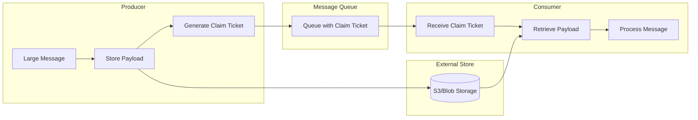
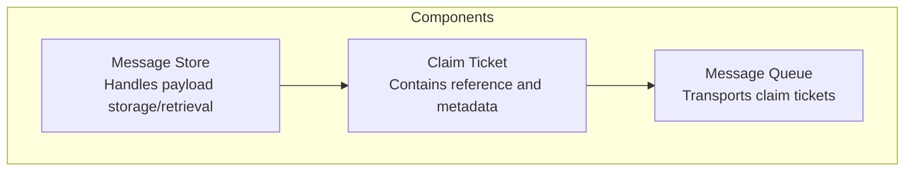
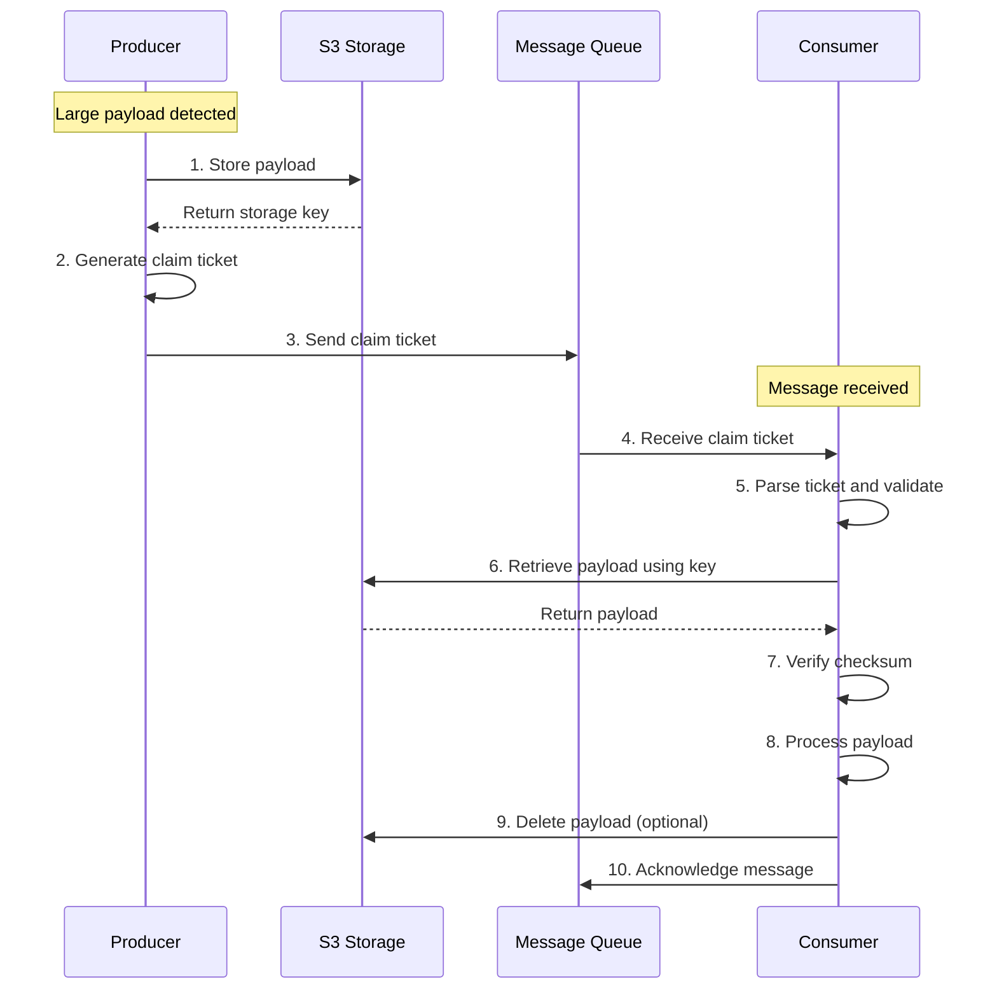
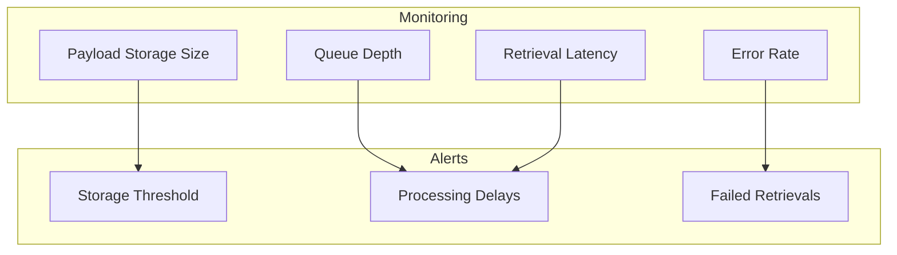

# How to Build Claim Check Pattern

Author: [nawazdhandala](https://github.com/nawazdhandala)

Tags: Message Queues, Integration Patterns, Design Patterns, Backend

Description: Learn how to implement the claim check pattern for handling large messages efficiently.

---

## Introduction

When working with message queues like RabbitMQ, Apache Kafka, or AWS SQS, you will often encounter message size limits. Most message brokers impose restrictions on payload sizes, typically ranging from 256 KB to a few megabytes. The **Claim Check Pattern** (also known as Reference-Based Messaging) solves this problem by storing large payloads externally and passing only a reference through the message queue.

## What is the Claim Check Pattern?

The Claim Check Pattern is an enterprise integration pattern that handles large messages by:

1. Storing the large payload in an external data store (like S3 or Azure Blob Storage)
2. Sending a small "claim ticket" (reference) through the message queue
3. Having the consumer retrieve the full payload using the claim ticket

Think of it like checking your luggage at an airport. You hand over your large bag and receive a small claim ticket. When you arrive at your destination, you present the ticket to retrieve your luggage.

## Architecture Overview



## When to Use the Claim Check Pattern

Use this pattern when:

- Your messages exceed the broker's size limit
- You want to reduce network bandwidth consumption
- You need to process the same large payload multiple times
- You want to decouple message transport from payload storage

Avoid this pattern when:

- Messages are consistently small
- Latency is critical and the extra storage roundtrip is unacceptable
- You cannot guarantee the external store's availability

## Implementation Components

The pattern consists of three main components:



## Step-by-Step Implementation

### Step 1: Define the Claim Ticket Structure

The claim ticket should contain enough information to retrieve the payload and validate its integrity.

```typescript
// claim-ticket.ts
// Defines the structure of a claim ticket that references stored payloads

interface ClaimTicket {
    // Unique identifier for retrieving the payload
    ticketId: string;

    // Location of the stored payload (e.g., S3 bucket and key)
    storageLocation: {
        bucket: string;
        key: string;
        region?: string;
    };

    // Metadata for validation and processing
    metadata: {
        contentType: string;
        contentLength: number;
        checksum: string;          // SHA-256 hash for integrity verification
        createdAt: Date;
        expiresAt?: Date;          // Optional TTL for automatic cleanup
    };

    // Original message context
    context: {
        correlationId: string;
        messageType: string;
        sender: string;
    };
}
```

### Step 2: Create the Message Store Service

The message store handles all interactions with the external storage system.

```typescript
// message-store.ts
// Service for storing and retrieving large payloads from S3

import {
    S3Client,
    PutObjectCommand,
    GetObjectCommand,
    DeleteObjectCommand
} from '@aws-sdk/client-s3';
import { createHash } from 'crypto';
import { v4 as uuidv4 } from 'uuid';

interface StoreResult {
    ticketId: string;
    bucket: string;
    key: string;
    checksum: string;
    contentLength: number;
}

class MessageStore {
    private s3Client: S3Client;
    private bucketName: string;

    constructor(region: string, bucketName: string) {
        // Initialize S3 client with the specified region
        this.s3Client = new S3Client({ region });
        this.bucketName = bucketName;
    }

    /**
     * Store a large payload in S3 and return storage details
     * @param payload - The data to store (Buffer or string)
     * @param contentType - MIME type of the content
     * @returns Storage details including the generated key and checksum
     */
    async storePayload(
        payload: Buffer | string,
        contentType: string
    ): Promise<StoreResult> {
        // Generate a unique key for this payload
        const ticketId = uuidv4();
        const key = `claim-check/${new Date().toISOString().split('T')[0]}/${ticketId}`;

        // Convert string to Buffer if necessary
        const payloadBuffer = Buffer.isBuffer(payload)
            ? payload
            : Buffer.from(payload, 'utf-8');

        // Calculate checksum for integrity verification
        const checksum = createHash('sha256')
            .update(payloadBuffer)
            .digest('hex');

        // Upload the payload to S3
        const command = new PutObjectCommand({
            Bucket: this.bucketName,
            Key: key,
            Body: payloadBuffer,
            ContentType: contentType,
            // Add metadata for tracking and debugging
            Metadata: {
                'x-claim-ticket-id': ticketId,
                'x-checksum': checksum,
                'x-created-at': new Date().toISOString()
            }
        });

        await this.s3Client.send(command);

        return {
            ticketId,
            bucket: this.bucketName,
            key,
            checksum,
            contentLength: payloadBuffer.length
        };
    }

    /**
     * Retrieve a payload from S3 using the storage location
     * @param bucket - S3 bucket name
     * @param key - S3 object key
     * @param expectedChecksum - Expected SHA-256 checksum for validation
     * @returns The retrieved payload as a Buffer
     */
    async retrievePayload(
        bucket: string,
        key: string,
        expectedChecksum: string
    ): Promise<Buffer> {
        const command = new GetObjectCommand({
            Bucket: bucket,
            Key: key
        });

        const response = await this.s3Client.send(command);

        // Convert the readable stream to a Buffer
        const chunks: Uint8Array[] = [];
        for await (const chunk of response.Body as AsyncIterable<Uint8Array>) {
            chunks.push(chunk);
        }
        const payload = Buffer.concat(chunks);

        // Verify checksum to ensure data integrity
        const actualChecksum = createHash('sha256')
            .update(payload)
            .digest('hex');

        if (actualChecksum !== expectedChecksum) {
            throw new Error(
                `Checksum mismatch: expected ${expectedChecksum}, got ${actualChecksum}`
            );
        }

        return payload;
    }

    /**
     * Delete a payload from S3 (for cleanup after processing)
     * @param bucket - S3 bucket name
     * @param key - S3 object key
     */
    async deletePayload(bucket: string, key: string): Promise<void> {
        const command = new DeleteObjectCommand({
            Bucket: bucket,
            Key: key
        });

        await this.s3Client.send(command);
    }
}

export { MessageStore, StoreResult };
```

### Step 3: Implement the Producer

The producer stores the payload and sends the claim ticket through the message queue.

```typescript
// producer.ts
// Handles creating and sending claim tickets for large messages

import { MessageStore } from './message-store';
import { ClaimTicket } from './claim-ticket';
import amqp from 'amqplib';
import { v4 as uuidv4 } from 'uuid';

// Configuration threshold: messages larger than this use claim check
const SIZE_THRESHOLD_BYTES = 256 * 1024; // 256 KB

class ClaimCheckProducer {
    private messageStore: MessageStore;
    private channel: amqp.Channel | null = null;
    private queueName: string;

    constructor(
        messageStore: MessageStore,
        queueName: string
    ) {
        this.messageStore = messageStore;
        this.queueName = queueName;
    }

    /**
     * Initialize the RabbitMQ connection
     */
    async connect(rabbitMqUrl: string): Promise<void> {
        const connection = await amqp.connect(rabbitMqUrl);
        this.channel = await connection.createChannel();

        // Ensure the queue exists with durability enabled
        await this.channel.assertQueue(this.queueName, {
            durable: true
        });
    }

    /**
     * Send a message, using claim check pattern if the payload is large
     * @param payload - The message payload
     * @param messageType - Type identifier for the message
     * @param contentType - MIME type of the payload
     */
    async sendMessage(
        payload: Buffer | string,
        messageType: string,
        contentType: string = 'application/json'
    ): Promise<void> {
        if (!this.channel) {
            throw new Error('Producer not connected. Call connect() first.');
        }

        const payloadBuffer = Buffer.isBuffer(payload)
            ? payload
            : Buffer.from(payload, 'utf-8');

        const correlationId = uuidv4();

        // Check if the message exceeds the size threshold
        if (payloadBuffer.length > SIZE_THRESHOLD_BYTES) {
            // Use claim check pattern for large messages
            await this.sendWithClaimCheck(
                payloadBuffer,
                messageType,
                contentType,
                correlationId
            );
        } else {
            // Send small messages directly through the queue
            await this.sendDirect(
                payloadBuffer,
                messageType,
                contentType,
                correlationId
            );
        }
    }

    /**
     * Store payload externally and send a claim ticket
     */
    private async sendWithClaimCheck(
        payload: Buffer,
        messageType: string,
        contentType: string,
        correlationId: string
    ): Promise<void> {
        // Store the large payload in S3
        const storeResult = await this.messageStore.storePayload(
            payload,
            contentType
        );

        // Create the claim ticket
        const claimTicket: ClaimTicket = {
            ticketId: storeResult.ticketId,
            storageLocation: {
                bucket: storeResult.bucket,
                key: storeResult.key
            },
            metadata: {
                contentType,
                contentLength: storeResult.contentLength,
                checksum: storeResult.checksum,
                createdAt: new Date(),
                // Set expiration to 24 hours from now
                expiresAt: new Date(Date.now() + 24 * 60 * 60 * 1000)
            },
            context: {
                correlationId,
                messageType,
                sender: process.env.SERVICE_NAME || 'unknown'
            }
        };

        // Send the claim ticket through the queue
        this.channel!.sendToQueue(
            this.queueName,
            Buffer.from(JSON.stringify(claimTicket)),
            {
                persistent: true,
                contentType: 'application/json',
                correlationId,
                // Header indicates this is a claim ticket, not a direct message
                headers: {
                    'x-message-pattern': 'claim-check',
                    'x-original-size': payload.length
                }
            }
        );

        console.log(`Sent claim ticket ${storeResult.ticketId} for ${payload.length} bytes`);
    }

    /**
     * Send a small message directly without claim check
     */
    private async sendDirect(
        payload: Buffer,
        messageType: string,
        contentType: string,
        correlationId: string
    ): Promise<void> {
        this.channel!.sendToQueue(
            this.queueName,
            payload,
            {
                persistent: true,
                contentType,
                correlationId,
                headers: {
                    'x-message-pattern': 'direct',
                    'x-message-type': messageType
                }
            }
        );

        console.log(`Sent direct message ${correlationId} (${payload.length} bytes)`);
    }
}

export { ClaimCheckProducer };
```

### Step 4: Implement the Consumer

The consumer receives claim tickets and retrieves the full payload from storage.

```typescript
// consumer.ts
// Handles receiving claim tickets and retrieving payloads

import { MessageStore } from './message-store';
import { ClaimTicket } from './claim-ticket';
import amqp from 'amqplib';

// Define a handler function type for processing messages
type MessageHandler = (
    payload: Buffer,
    messageType: string,
    correlationId: string
) => Promise<void>;

class ClaimCheckConsumer {
    private messageStore: MessageStore;
    private channel: amqp.Channel | null = null;
    private queueName: string;
    private deleteAfterProcessing: boolean;

    constructor(
        messageStore: MessageStore,
        queueName: string,
        deleteAfterProcessing: boolean = true
    ) {
        this.messageStore = messageStore;
        this.queueName = queueName;
        this.deleteAfterProcessing = deleteAfterProcessing;
    }

    /**
     * Initialize the RabbitMQ connection
     */
    async connect(rabbitMqUrl: string): Promise<void> {
        const connection = await amqp.connect(rabbitMqUrl);
        this.channel = await connection.createChannel();

        // Set prefetch to 1 to process one message at a time
        // This prevents overwhelming the consumer with large payloads
        await this.channel.prefetch(1);

        await this.channel.assertQueue(this.queueName, {
            durable: true
        });
    }

    /**
     * Start consuming messages from the queue
     * @param handler - Function to process each message
     */
    async startConsuming(handler: MessageHandler): Promise<void> {
        if (!this.channel) {
            throw new Error('Consumer not connected. Call connect() first.');
        }

        console.log(`Starting to consume from queue: ${this.queueName}`);

        await this.channel.consume(
            this.queueName,
            async (msg) => {
                if (!msg) return;

                try {
                    // Check the message pattern header
                    const pattern = msg.properties.headers?.['x-message-pattern'];
                    const correlationId = msg.properties.correlationId;

                    let payload: Buffer;
                    let messageType: string;

                    if (pattern === 'claim-check') {
                        // Parse the claim ticket and retrieve the payload
                        const result = await this.processClaimTicket(msg);
                        payload = result.payload;
                        messageType = result.messageType;
                    } else {
                        // Direct message, use the content as-is
                        payload = msg.content;
                        messageType = msg.properties.headers?.['x-message-type'] || 'unknown';
                    }

                    // Process the message with the provided handler
                    await handler(payload, messageType, correlationId);

                    // Acknowledge successful processing
                    this.channel!.ack(msg);

                } catch (error) {
                    console.error('Error processing message:', error);

                    // Reject the message and requeue it for retry
                    // In production, consider using a dead letter queue after max retries
                    this.channel!.nack(msg, false, true);
                }
            },
            { noAck: false } // Manual acknowledgment mode
        );
    }

    /**
     * Process a claim ticket message and retrieve the payload
     */
    private async processClaimTicket(
        msg: amqp.ConsumeMessage
    ): Promise<{ payload: Buffer; messageType: string }> {
        // Parse the claim ticket from the message body
        const claimTicket: ClaimTicket = JSON.parse(msg.content.toString());

        console.log(`Processing claim ticket: ${claimTicket.ticketId}`);

        // Check if the ticket has expired
        if (claimTicket.metadata.expiresAt) {
            const expiresAt = new Date(claimTicket.metadata.expiresAt);
            if (expiresAt < new Date()) {
                throw new Error(`Claim ticket ${claimTicket.ticketId} has expired`);
            }
        }

        // Retrieve the payload from storage
        const payload = await this.messageStore.retrievePayload(
            claimTicket.storageLocation.bucket,
            claimTicket.storageLocation.key,
            claimTicket.metadata.checksum
        );

        console.log(
            `Retrieved payload for ticket ${claimTicket.ticketId}: ` +
            `${payload.length} bytes`
        );

        // Optionally delete the payload after successful retrieval
        if (this.deleteAfterProcessing) {
            await this.messageStore.deletePayload(
                claimTicket.storageLocation.bucket,
                claimTicket.storageLocation.key
            );
            console.log(`Deleted payload for ticket ${claimTicket.ticketId}`);
        }

        return {
            payload,
            messageType: claimTicket.context.messageType
        };
    }
}

export { ClaimCheckConsumer };
```

## Complete Flow Diagram

Here is the complete message flow showing both the producer and consumer sides:



## Azure Blob Storage Implementation

If you are using Azure instead of AWS, here is an alternative implementation for the message store:

```typescript
// azure-message-store.ts
// Message store implementation using Azure Blob Storage

import {
    BlobServiceClient,
    ContainerClient
} from '@azure/storage-blob';
import { createHash } from 'crypto';
import { v4 as uuidv4 } from 'uuid';

interface StoreResult {
    ticketId: string;
    container: string;
    blobName: string;
    checksum: string;
    contentLength: number;
}

class AzureMessageStore {
    private containerClient: ContainerClient;
    private containerName: string;

    constructor(connectionString: string, containerName: string) {
        // Initialize the Blob Service Client
        const blobServiceClient = BlobServiceClient.fromConnectionString(
            connectionString
        );

        this.containerName = containerName;
        this.containerClient = blobServiceClient.getContainerClient(containerName);
    }

    /**
     * Ensure the container exists before storing blobs
     */
    async initialize(): Promise<void> {
        await this.containerClient.createIfNotExists();
    }

    /**
     * Store a large payload in Azure Blob Storage
     * @param payload - The data to store
     * @param contentType - MIME type of the content
     * @returns Storage details including the blob name and checksum
     */
    async storePayload(
        payload: Buffer | string,
        contentType: string
    ): Promise<StoreResult> {
        const ticketId = uuidv4();

        // Organize blobs by date for easier management
        const datePrefix = new Date().toISOString().split('T')[0];
        const blobName = `claim-check/${datePrefix}/${ticketId}`;

        const payloadBuffer = Buffer.isBuffer(payload)
            ? payload
            : Buffer.from(payload, 'utf-8');

        // Calculate checksum for integrity verification
        const checksum = createHash('sha256')
            .update(payloadBuffer)
            .digest('hex');

        // Get a reference to the blob
        const blockBlobClient = this.containerClient.getBlockBlobClient(blobName);

        // Upload the payload with metadata
        await blockBlobClient.upload(payloadBuffer, payloadBuffer.length, {
            blobHTTPHeaders: {
                blobContentType: contentType
            },
            metadata: {
                ticketId,
                checksum,
                createdAt: new Date().toISOString()
            }
        });

        return {
            ticketId,
            container: this.containerName,
            blobName,
            checksum,
            contentLength: payloadBuffer.length
        };
    }

    /**
     * Retrieve a payload from Azure Blob Storage
     * @param container - Container name
     * @param blobName - Blob name
     * @param expectedChecksum - Expected checksum for validation
     * @returns The retrieved payload as a Buffer
     */
    async retrievePayload(
        container: string,
        blobName: string,
        expectedChecksum: string
    ): Promise<Buffer> {
        const blockBlobClient = this.containerClient.getBlockBlobClient(blobName);

        // Download the blob content
        const downloadResponse = await blockBlobClient.download();

        // Convert the readable stream to a Buffer
        const chunks: Buffer[] = [];
        for await (const chunk of downloadResponse.readableStreamBody as AsyncIterable<Buffer>) {
            chunks.push(chunk);
        }
        const payload = Buffer.concat(chunks);

        // Verify checksum
        const actualChecksum = createHash('sha256')
            .update(payload)
            .digest('hex');

        if (actualChecksum !== expectedChecksum) {
            throw new Error(
                `Checksum mismatch: expected ${expectedChecksum}, got ${actualChecksum}`
            );
        }

        return payload;
    }

    /**
     * Delete a blob after processing
     */
    async deletePayload(container: string, blobName: string): Promise<void> {
        const blockBlobClient = this.containerClient.getBlockBlobClient(blobName);
        await blockBlobClient.delete();
    }
}

export { AzureMessageStore };
```

## Error Handling and Resilience

Implement proper error handling to make your claim check system robust:

```typescript
// error-handler.ts
// Centralized error handling for claim check operations

// Custom error types for specific failure scenarios
class ClaimCheckError extends Error {
    constructor(
        message: string,
        public readonly ticketId: string,
        public readonly cause?: Error
    ) {
        super(message);
        this.name = 'ClaimCheckError';
    }
}

class PayloadNotFoundError extends ClaimCheckError {
    constructor(ticketId: string, storageKey: string) {
        super(
            `Payload not found for ticket ${ticketId} at ${storageKey}`,
            ticketId
        );
        this.name = 'PayloadNotFoundError';
    }
}

class ChecksumMismatchError extends ClaimCheckError {
    constructor(
        ticketId: string,
        expected: string,
        actual: string
    ) {
        super(
            `Checksum mismatch for ticket ${ticketId}: ` +
            `expected ${expected}, got ${actual}`,
            ticketId
        );
        this.name = 'ChecksumMismatchError';
    }
}

class TicketExpiredError extends ClaimCheckError {
    constructor(ticketId: string, expiresAt: Date) {
        super(
            `Claim ticket ${ticketId} expired at ${expiresAt.toISOString()}`,
            ticketId
        );
        this.name = 'TicketExpiredError';
    }
}

// Retry utility with exponential backoff
async function withRetry<T>(
    operation: () => Promise<T>,
    maxRetries: number = 3,
    baseDelayMs: number = 1000
): Promise<T> {
    let lastError: Error | undefined;

    for (let attempt = 0; attempt < maxRetries; attempt++) {
        try {
            return await operation();
        } catch (error) {
            lastError = error as Error;

            // Do not retry on validation errors
            if (
                error instanceof ChecksumMismatchError ||
                error instanceof TicketExpiredError
            ) {
                throw error;
            }

            // Calculate delay with exponential backoff and jitter
            const delay = baseDelayMs * Math.pow(2, attempt) +
                Math.random() * 1000;

            console.warn(
                `Attempt ${attempt + 1} failed, retrying in ${delay}ms:`,
                error
            );

            await new Promise(resolve => setTimeout(resolve, delay));
        }
    }

    throw lastError;
}

export {
    ClaimCheckError,
    PayloadNotFoundError,
    ChecksumMismatchError,
    TicketExpiredError,
    withRetry
};
```

## Usage Example

Here is a complete example showing how to use the claim check pattern:

```typescript
// example-usage.ts
// Demonstrates how to use the claim check pattern

import { MessageStore } from './message-store';
import { ClaimCheckProducer } from './producer';
import { ClaimCheckConsumer } from './consumer';

async function main() {
    // Configuration
    const config = {
        aws: {
            region: 'us-east-1',
            bucket: 'my-claim-check-bucket'
        },
        rabbitmq: {
            url: 'amqp://localhost:5672'
        },
        queue: 'large-messages-queue'
    };

    // Initialize the message store
    const messageStore = new MessageStore(
        config.aws.region,
        config.aws.bucket
    );

    // Set up the producer
    const producer = new ClaimCheckProducer(messageStore, config.queue);
    await producer.connect(config.rabbitmq.url);

    // Set up the consumer
    const consumer = new ClaimCheckConsumer(messageStore, config.queue);
    await consumer.connect(config.rabbitmq.url);

    // Start consuming messages
    await consumer.startConsuming(async (payload, messageType, correlationId) => {
        console.log(`Processing message ${correlationId}`);
        console.log(`Type: ${messageType}`);
        console.log(`Payload size: ${payload.length} bytes`);

        // Process your payload here
        const data = JSON.parse(payload.toString());
        console.log('Data received:', data);
    });

    // Send a large message (this will use claim check)
    const largePayload = {
        type: 'data-export',
        records: Array(10000).fill({
            id: 1,
            name: 'Sample Record',
            data: 'x'.repeat(100)
        })
    };

    await producer.sendMessage(
        JSON.stringify(largePayload),
        'data-export',
        'application/json'
    );

    console.log('Large message sent successfully');
}

main().catch(console.error);
```

## Best Practices

### 1. Set Appropriate TTL

Always set an expiration time on stored payloads to prevent storage bloat:

```typescript
// Configure S3 lifecycle rules for automatic cleanup
const lifecycleConfig = {
    Rules: [
        {
            ID: 'ClaimCheckCleanup',
            Filter: {
                Prefix: 'claim-check/'
            },
            Status: 'Enabled',
            Expiration: {
                Days: 7  // Delete payloads older than 7 days
            }
        }
    ]
};
```

### 2. Monitor Storage and Queue Metrics



### 3. Use Compression for Large Payloads

```typescript
import { gzip, gunzip } from 'zlib';
import { promisify } from 'util';

const gzipAsync = promisify(gzip);
const gunzipAsync = promisify(gunzip);

// Compress before storing
async function compressPayload(payload: Buffer): Promise<Buffer> {
    return await gzipAsync(payload);
}

// Decompress after retrieval
async function decompressPayload(compressed: Buffer): Promise<Buffer> {
    return await gunzipAsync(compressed);
}
```

## Conclusion

The Claim Check Pattern is an essential tool for handling large messages in distributed systems. By storing large payloads externally and passing only references through your message queue, you can:

- Bypass message size limitations
- Reduce network bandwidth usage
- Improve message processing throughput
- Enable payload reuse across multiple consumers

When implementing this pattern, remember to:

- Always validate payload integrity with checksums
- Set appropriate TTLs to prevent storage bloat
- Implement proper error handling and retry logic
- Monitor both storage and queue metrics
- Consider compression for very large payloads

The pattern works well with any combination of message broker (RabbitMQ, Kafka, SQS) and object storage (S3, Azure Blob, GCS). Choose the implementation that best fits your existing infrastructure and operational expertise.
