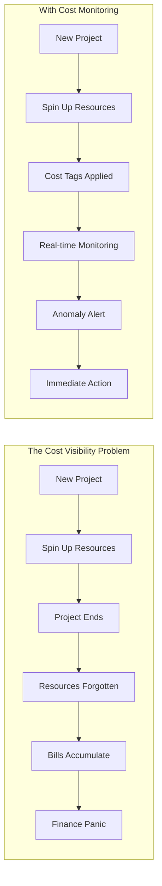
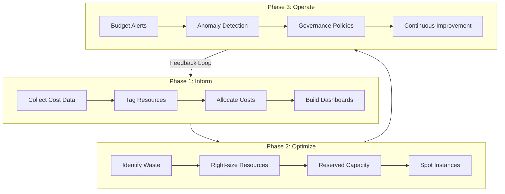
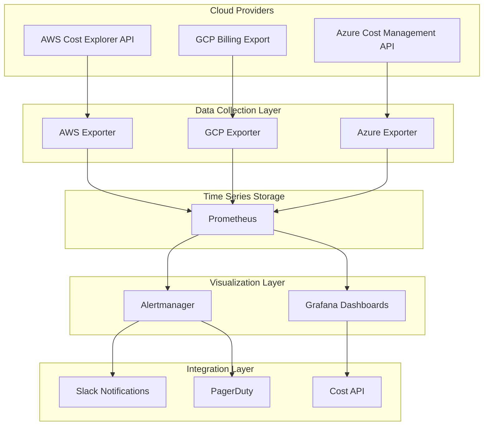
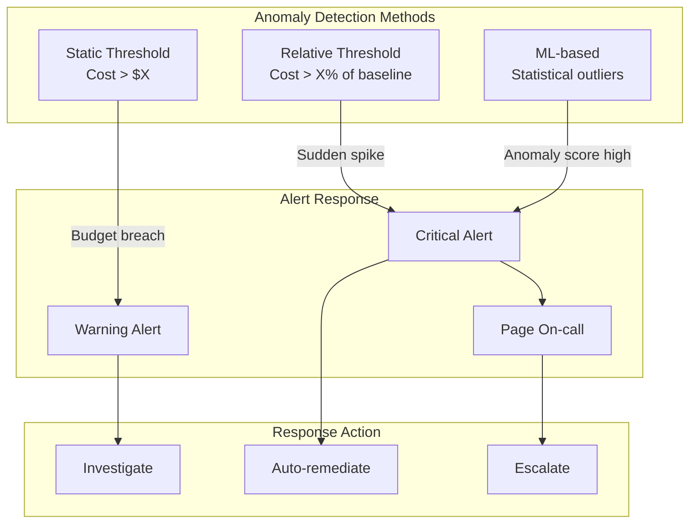
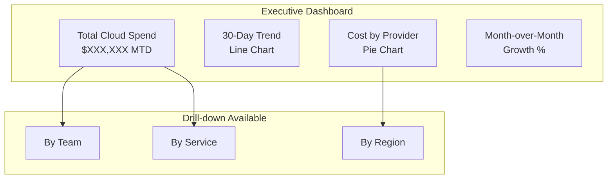

# How to Build Cloud Cost Monitoring

Author: [nawazdhandala](https://github.com/nawazdhandala)

Tags: FinOps, Cloud, Cost Optimization, Monitoring

Description: Learn how to implement cloud cost monitoring for visibility into infrastructure spending.

---

Cloud costs have a way of growing silently. One day you are running a simple workload, the next you are staring at a bill that makes you question every architectural decision. The problem is not cloud pricing itself. The problem is visibility. Without proper monitoring, you cannot optimize what you cannot see.

FinOps (Financial Operations) emerged as a discipline to bring engineering, finance, and business teams together around cloud cost management. At its core, FinOps requires real-time visibility into spending. This guide walks through building a cloud cost monitoring system that covers AWS, GCP, and Azure, using Prometheus for metrics collection and alerting.

---

## Table of Contents

1. Why Cloud Cost Monitoring Matters
2. FinOps Principles for Cost Visibility
3. Architecture Overview
4. AWS Cost Explorer Integration
5. GCP Billing Integration
6. Azure Cost Management Integration
7. Prometheus Cost Metrics
8. Building Custom Cost Exporters
9. Alerting on Cost Anomalies
10. Dashboard Design Patterns

---

## 1. Why Cloud Cost Monitoring Matters

Cloud spending often follows a predictable pattern: rapid growth followed by panic optimization. Teams spin up resources for projects, forget about them, and discover months later that idle infrastructure has been burning money.



The business case for cost monitoring is straightforward:

| Impact Area | Without Monitoring | With Monitoring |
|-------------|-------------------|-----------------|
| Cost Awareness | Monthly bill shock | Daily visibility |
| Optimization Speed | Weeks to identify waste | Minutes to alert |
| Budget Accuracy | Frequent overruns | Predictable spend |
| Team Accountability | Finger pointing | Clear ownership |
| Resource Efficiency | 30-40% waste typical | Under 10% waste |

---

## 2. FinOps Principles for Cost Visibility

FinOps is built on three phases: Inform, Optimize, and Operate. Cost monitoring enables the Inform phase, which feeds everything else.



Key FinOps metrics to track:

- **Total Cloud Spend**: Aggregate cost across all providers
- **Cost by Service**: Breakdown by compute, storage, network, database
- **Cost by Team/Project**: Allocation based on tags
- **Cost per Transaction**: Unit economics for business alignment
- **Waste Percentage**: Idle and unused resources
- **Commitment Coverage**: Reserved instance and savings plan utilization

---

## 3. Architecture Overview

A comprehensive cost monitoring system pulls data from multiple cloud providers, normalizes it, stores it in a time-series database, and exposes it through dashboards and alerts.



The architecture follows these principles:

1. **Provider Agnostic**: Normalize costs across clouds into common metrics
2. **Real-time Capable**: Update at least hourly for operational visibility
3. **Historically Rich**: Retain data for trend analysis and forecasting
4. **Tag-centric**: Enable allocation through consistent tagging
5. **Alert-driven**: Proactive notification of anomalies

---

## 4. AWS Cost Explorer Integration

AWS Cost Explorer provides programmatic access to cost and usage data. The API allows querying by time period, granularity, and grouping dimensions.

### Setting Up AWS Cost Explorer Access

First, create an IAM policy for cost data access:

```json
{
    "Version": "2012-10-17",
    "Statement": [
        {
            "Sid": "CostExplorerReadAccess",
            "Effect": "Allow",
            "Action": [
                "ce:GetCostAndUsage",
                "ce:GetCostForecast",
                "ce:GetReservationUtilization",
                "ce:GetSavingsPlansUtilization",
                "ce:GetDimensionValues",
                "ce:GetTags"
            ],
            "Resource": "*"
        }
    ]
}
```

### Python Cost Exporter for AWS

```python
# aws_cost_exporter.py
# Exports AWS cost data as Prometheus metrics
# Requires: boto3, prometheus_client

import boto3
from datetime import datetime, timedelta
from prometheus_client import Gauge, start_http_server
import time
import logging

# Configure logging for operational visibility
logging.basicConfig(level=logging.INFO)
logger = logging.getLogger(__name__)

# Define Prometheus metrics with appropriate labels
# Labels enable filtering and grouping in queries

# Total cost metric grouped by service
aws_cost_by_service = Gauge(
    'aws_cost_dollars',
    'AWS cost in dollars',
    ['service', 'account_id', 'region']
)

# Cost grouped by custom tags (team, environment, project)
aws_cost_by_tag = Gauge(
    'aws_cost_by_tag_dollars',
    'AWS cost in dollars grouped by tag',
    ['tag_key', 'tag_value', 'account_id']
)

# Daily cost trend for forecasting
aws_daily_cost = Gauge(
    'aws_daily_cost_dollars',
    'AWS daily cost in dollars',
    ['account_id', 'date']
)

# Reservation utilization percentage
aws_reservation_utilization = Gauge(
    'aws_reservation_utilization_percent',
    'AWS Reserved Instance utilization percentage',
    ['account_id', 'service']
)

# Savings plans coverage
aws_savings_plan_coverage = Gauge(
    'aws_savings_plan_coverage_percent',
    'AWS Savings Plans coverage percentage',
    ['account_id']
)


class AWSCostCollector:
    """
    Collects cost data from AWS Cost Explorer API and exposes
    it as Prometheus metrics. Handles pagination, rate limiting,
    and error recovery.
    """

    def __init__(self, account_id: str):
        """
        Initialize the collector with AWS credentials.
        Uses default credential chain (env vars, instance role, etc.)
        """
        self.ce_client = boto3.client('ce')
        self.account_id = account_id

        # Cache results to avoid API rate limits
        # Cost Explorer has a limit of 5 requests per second
        self.cache = {}
        self.cache_ttl = 3600  # 1 hour cache

    def get_cost_by_service(self, days: int = 7) -> dict:
        """
        Fetch cost breakdown by AWS service for the specified period.
        Groups by SERVICE dimension to show compute, storage, etc.
        """
        end_date = datetime.utcnow().date()
        start_date = end_date - timedelta(days=days)

        try:
            response = self.ce_client.get_cost_and_usage(
                TimePeriod={
                    'Start': start_date.isoformat(),
                    'End': end_date.isoformat()
                },
                # DAILY granularity for trend analysis
                # Use MONTHLY for longer periods to reduce data points
                Granularity='DAILY',
                Metrics=['UnblendedCost'],
                # Group by service to see cost breakdown
                GroupBy=[
                    {'Type': 'DIMENSION', 'Key': 'SERVICE'},
                    {'Type': 'DIMENSION', 'Key': 'REGION'}
                ]
            )
            return response
        except Exception as e:
            logger.error(f"Failed to fetch cost by service: {e}")
            return {}

    def get_cost_by_tag(self, tag_key: str, days: int = 7) -> dict:
        """
        Fetch cost breakdown by a specific tag key.
        Common tags: Team, Environment, Project, CostCenter
        """
        end_date = datetime.utcnow().date()
        start_date = end_date - timedelta(days=days)

        try:
            response = self.ce_client.get_cost_and_usage(
                TimePeriod={
                    'Start': start_date.isoformat(),
                    'End': end_date.isoformat()
                },
                Granularity='DAILY',
                Metrics=['UnblendedCost'],
                # Group by tag to enable team/project allocation
                GroupBy=[
                    {'Type': 'TAG', 'Key': tag_key}
                ]
            )
            return response
        except Exception as e:
            logger.error(f"Failed to fetch cost by tag {tag_key}: {e}")
            return {}

    def get_reservation_utilization(self) -> dict:
        """
        Fetch Reserved Instance utilization to track commitment efficiency.
        Low utilization indicates wasted reservations.
        """
        end_date = datetime.utcnow().date()
        start_date = end_date - timedelta(days=30)

        try:
            response = self.ce_client.get_reservation_utilization(
                TimePeriod={
                    'Start': start_date.isoformat(),
                    'End': end_date.isoformat()
                },
                Granularity='MONTHLY',
                GroupBy=[
                    {'Type': 'DIMENSION', 'Key': 'SERVICE'}
                ]
            )
            return response
        except Exception as e:
            logger.error(f"Failed to fetch reservation utilization: {e}")
            return {}

    def update_metrics(self):
        """
        Main collection loop. Fetches data from AWS and updates
        Prometheus metrics. Called periodically by the scheduler.
        """
        logger.info("Starting AWS cost metrics collection")

        # Collect cost by service
        service_costs = self.get_cost_by_service()
        if 'ResultsByTime' in service_costs:
            for result in service_costs['ResultsByTime']:
                for group in result.get('Groups', []):
                    # Extract service name and region from group keys
                    service = group['Keys'][0]
                    region = group['Keys'][1] if len(group['Keys']) > 1 else 'global'
                    cost = float(group['Metrics']['UnblendedCost']['Amount'])

                    # Update Prometheus gauge
                    aws_cost_by_service.labels(
                        service=service,
                        account_id=self.account_id,
                        region=region
                    ).set(cost)

        # Collect cost by common tags
        for tag_key in ['Team', 'Environment', 'Project', 'CostCenter']:
            tag_costs = self.get_cost_by_tag(tag_key)
            if 'ResultsByTime' in tag_costs:
                for result in tag_costs['ResultsByTime']:
                    for group in result.get('Groups', []):
                        tag_value = group['Keys'][0]
                        # Handle untagged resources
                        if not tag_value or tag_value == '':
                            tag_value = 'untagged'
                        cost = float(group['Metrics']['UnblendedCost']['Amount'])

                        aws_cost_by_tag.labels(
                            tag_key=tag_key,
                            tag_value=tag_value,
                            account_id=self.account_id
                        ).set(cost)

        # Collect reservation utilization
        ri_utilization = self.get_reservation_utilization()
        if 'UtilizationsByTime' in ri_utilization:
            for util in ri_utilization['UtilizationsByTime']:
                for group in util.get('Groups', []):
                    service = group['Key']
                    utilization = float(group['Utilization']['UtilizationPercentage'])

                    aws_reservation_utilization.labels(
                        account_id=self.account_id,
                        service=service
                    ).set(utilization)

        logger.info("Completed AWS cost metrics collection")


def main():
    """
    Entry point for the AWS cost exporter.
    Starts HTTP server for Prometheus scraping and runs collection loop.
    """
    # Start Prometheus metrics HTTP server
    # Prometheus will scrape this endpoint
    start_http_server(9090)
    logger.info("Started metrics server on port 9090")

    # Initialize collector
    # Account ID can come from environment or instance metadata
    account_id = boto3.client('sts').get_caller_identity()['Account']
    collector = AWSCostCollector(account_id)

    # Collection loop
    # AWS Cost Explorer data updates every few hours
    # No need to poll more frequently than hourly
    while True:
        collector.update_metrics()
        # Sleep for 1 hour between collections
        time.sleep(3600)


if __name__ == '__main__':
    main()
```

---

## 5. GCP Billing Integration

Google Cloud Platform exports billing data to BigQuery, providing rich querying capabilities. This approach offers more flexibility than API-based collection.

### Setting Up GCP Billing Export

Enable billing export in the GCP Console:

1. Navigate to Billing > Billing Export
2. Enable BigQuery export
3. Select or create a dataset for billing data
4. Choose detailed usage cost export

The export creates tables with this schema:

```sql
-- GCP billing export table structure
-- Table: billing_export_v1
-- Contains detailed usage and cost records

-- Key columns for cost analysis:
-- billing_account_id: The billing account
-- service.description: GCP service name (Compute Engine, Cloud Storage, etc.)
-- sku.description: Specific resource type
-- usage_start_time: When the usage began
-- usage_end_time: When the usage ended
-- project.id: GCP project identifier
-- labels: User-defined resource labels
-- cost: The cost in the billing currency
-- credits: Any applicable credits
```

### Python Cost Exporter for GCP

```python
# gcp_cost_exporter.py
# Exports GCP cost data from BigQuery as Prometheus metrics
# Requires: google-cloud-bigquery, prometheus_client

from google.cloud import bigquery
from prometheus_client import Gauge, start_http_server
from datetime import datetime, timedelta
import time
import logging

logging.basicConfig(level=logging.INFO)
logger = logging.getLogger(__name__)

# Define Prometheus metrics for GCP costs
gcp_cost_by_service = Gauge(
    'gcp_cost_dollars',
    'GCP cost in dollars',
    ['service', 'project_id']
)

gcp_cost_by_sku = Gauge(
    'gcp_cost_by_sku_dollars',
    'GCP cost in dollars by SKU',
    ['service', 'sku', 'project_id']
)

gcp_cost_by_label = Gauge(
    'gcp_cost_by_label_dollars',
    'GCP cost in dollars by label',
    ['label_key', 'label_value', 'project_id']
)

gcp_daily_cost = Gauge(
    'gcp_daily_cost_dollars',
    'GCP daily cost in dollars',
    ['project_id', 'date']
)

# Credits tracking (sustained use, committed use, etc.)
gcp_credits = Gauge(
    'gcp_credits_dollars',
    'GCP credits applied',
    ['credit_type', 'project_id']
)


class GCPCostCollector:
    """
    Collects cost data from GCP BigQuery billing export.
    BigQuery provides detailed billing data with labels and SKU-level granularity.
    """

    def __init__(self, billing_project: str, billing_dataset: str):
        """
        Initialize BigQuery client and configure billing table reference.

        Args:
            billing_project: GCP project containing billing export
            billing_dataset: BigQuery dataset with billing data
        """
        self.bq_client = bigquery.Client()
        self.billing_table = f"{billing_project}.{billing_dataset}.gcp_billing_export_v1_*"

    def query_cost_by_service(self, days: int = 7) -> list:
        """
        Query cost breakdown by GCP service.
        Uses UNNEST for labels array and aggregates by service.
        """
        query = f"""
        -- Aggregate costs by service and project
        -- Excludes credits for gross cost view
        SELECT
            service.description AS service,
            project.id AS project_id,
            SUM(cost) AS total_cost,
            -- Net cost after credits
            SUM(cost) + SUM(IFNULL(
                (SELECT SUM(c.amount) FROM UNNEST(credits) AS c), 0
            )) AS net_cost
        FROM `{self.billing_table}`
        WHERE
            -- Filter to recent period
            _PARTITIONTIME >= TIMESTAMP_SUB(CURRENT_TIMESTAMP(), INTERVAL {days} DAY)
            AND cost > 0
        GROUP BY
            service.description,
            project.id
        ORDER BY
            total_cost DESC
        """

        try:
            results = self.bq_client.query(query).result()
            return list(results)
        except Exception as e:
            logger.error(f"Failed to query cost by service: {e}")
            return []

    def query_cost_by_label(self, label_key: str, days: int = 7) -> list:
        """
        Query cost breakdown by a specific label.
        GCP labels are stored as an array requiring UNNEST.
        """
        query = f"""
        -- Aggregate costs by label value
        -- Useful for team, environment, or project allocation
        SELECT
            label.value AS label_value,
            project.id AS project_id,
            SUM(cost) AS total_cost
        FROM `{self.billing_table}`,
            UNNEST(labels) AS label
        WHERE
            _PARTITIONTIME >= TIMESTAMP_SUB(CURRENT_TIMESTAMP(), INTERVAL {days} DAY)
            AND label.key = @label_key
            AND cost > 0
        GROUP BY
            label.value,
            project.id
        ORDER BY
            total_cost DESC
        """

        job_config = bigquery.QueryJobConfig(
            query_parameters=[
                bigquery.ScalarQueryParameter("label_key", "STRING", label_key)
            ]
        )

        try:
            results = self.bq_client.query(query, job_config=job_config).result()
            return list(results)
        except Exception as e:
            logger.error(f"Failed to query cost by label {label_key}: {e}")
            return []

    def query_daily_costs(self, days: int = 30) -> list:
        """
        Query daily cost trend for forecasting and anomaly detection.
        """
        query = f"""
        -- Daily cost aggregation for trend analysis
        SELECT
            DATE(usage_start_time) AS date,
            project.id AS project_id,
            SUM(cost) AS total_cost
        FROM `{self.billing_table}`
        WHERE
            _PARTITIONTIME >= TIMESTAMP_SUB(CURRENT_TIMESTAMP(), INTERVAL {days} DAY)
        GROUP BY
            date,
            project.id
        ORDER BY
            date DESC
        """

        try:
            results = self.bq_client.query(query).result()
            return list(results)
        except Exception as e:
            logger.error(f"Failed to query daily costs: {e}")
            return []

    def query_credits(self, days: int = 30) -> list:
        """
        Query credits breakdown (sustained use discounts, committed use, etc.)
        """
        query = f"""
        -- Credit breakdown by type
        -- Negative amounts indicate savings
        SELECT
            credit.name AS credit_type,
            project.id AS project_id,
            SUM(credit.amount) AS credit_amount
        FROM `{self.billing_table}`,
            UNNEST(credits) AS credit
        WHERE
            _PARTITIONTIME >= TIMESTAMP_SUB(CURRENT_TIMESTAMP(), INTERVAL {days} DAY)
        GROUP BY
            credit.name,
            project.id
        ORDER BY
            credit_amount
        """

        try:
            results = self.bq_client.query(query).result()
            return list(results)
        except Exception as e:
            logger.error(f"Failed to query credits: {e}")
            return []

    def update_metrics(self):
        """
        Main collection loop. Queries BigQuery and updates Prometheus metrics.
        """
        logger.info("Starting GCP cost metrics collection")

        # Update cost by service
        for row in self.query_cost_by_service():
            gcp_cost_by_service.labels(
                service=row.service,
                project_id=row.project_id
            ).set(float(row.total_cost))

        # Update cost by common labels
        for label_key in ['team', 'environment', 'app', 'cost-center']:
            for row in self.query_cost_by_label(label_key):
                gcp_cost_by_label.labels(
                    label_key=label_key,
                    label_value=row.label_value or 'unlabeled',
                    project_id=row.project_id
                ).set(float(row.total_cost))

        # Update daily costs
        for row in self.query_daily_costs():
            gcp_daily_cost.labels(
                project_id=row.project_id,
                date=row.date.isoformat()
            ).set(float(row.total_cost))

        # Update credits
        for row in self.query_credits():
            gcp_credits.labels(
                credit_type=row.credit_type,
                project_id=row.project_id
            ).set(float(row.credit_amount))

        logger.info("Completed GCP cost metrics collection")


def main():
    """Entry point for GCP cost exporter."""
    start_http_server(9091)
    logger.info("Started metrics server on port 9091")

    # Configure with your billing export location
    collector = GCPCostCollector(
        billing_project="your-billing-project",
        billing_dataset="billing_export"
    )

    while True:
        collector.update_metrics()
        # GCP billing export updates every few hours
        time.sleep(3600)


if __name__ == '__main__':
    main()
```

---

## 6. Azure Cost Management Integration

Azure Cost Management provides both REST APIs and export capabilities. The API approach offers real-time data while exports are better for historical analysis.

### Setting Up Azure Cost Management Access

Create a service principal with Cost Management Reader role:

```bash
# Create service principal for cost data access
az ad sp create-for-rbac \
    --name "cost-monitoring-sp" \
    --role "Cost Management Reader" \
    --scopes "/subscriptions/{subscription-id}"

# Output contains appId, password, and tenant for authentication
```

### Python Cost Exporter for Azure

```python
# azure_cost_exporter.py
# Exports Azure cost data as Prometheus metrics
# Requires: azure-identity, azure-mgmt-costmanagement, prometheus_client

from azure.identity import DefaultAzureCredential
from azure.mgmt.costmanagement import CostManagementClient
from prometheus_client import Gauge, start_http_server
from datetime import datetime, timedelta
import time
import logging

logging.basicConfig(level=logging.INFO)
logger = logging.getLogger(__name__)

# Define Prometheus metrics for Azure costs
azure_cost_by_service = Gauge(
    'azure_cost_dollars',
    'Azure cost in dollars',
    ['service_name', 'subscription_id', 'resource_group']
)

azure_cost_by_tag = Gauge(
    'azure_cost_by_tag_dollars',
    'Azure cost in dollars by tag',
    ['tag_name', 'tag_value', 'subscription_id']
)

azure_daily_cost = Gauge(
    'azure_daily_cost_dollars',
    'Azure daily cost in dollars',
    ['subscription_id', 'date']
)

azure_budget_consumed = Gauge(
    'azure_budget_consumed_percent',
    'Azure budget consumption percentage',
    ['budget_name', 'subscription_id']
)

azure_reservation_utilization = Gauge(
    'azure_reservation_utilization_percent',
    'Azure reservation utilization percentage',
    ['reservation_id', 'subscription_id']
)


class AzureCostCollector:
    """
    Collects cost data from Azure Cost Management API.
    Uses the query API for flexible cost analysis.
    """

    def __init__(self, subscription_id: str):
        """
        Initialize Azure client with default credential chain.
        Works with managed identity, CLI credentials, or environment variables.
        """
        self.credential = DefaultAzureCredential()
        self.subscription_id = subscription_id
        self.client = CostManagementClient(
            self.credential,
            subscription_id
        )
        # Scope for subscription-level queries
        self.scope = f"/subscriptions/{subscription_id}"

    def query_cost_by_service(self, days: int = 7) -> dict:
        """
        Query cost breakdown by Azure service (meter category).
        Uses the Cost Management query API with grouping.
        """
        end_date = datetime.utcnow().date()
        start_date = end_date - timedelta(days=days)

        # Build query definition
        query = {
            "type": "ActualCost",
            "timeframe": "Custom",
            "timePeriod": {
                "from": start_date.isoformat(),
                "to": end_date.isoformat()
            },
            "dataset": {
                "granularity": "Daily",
                "aggregation": {
                    "totalCost": {
                        "name": "Cost",
                        "function": "Sum"
                    }
                },
                # Group by service name and resource group
                "grouping": [
                    {
                        "type": "Dimension",
                        "name": "ServiceName"
                    },
                    {
                        "type": "Dimension",
                        "name": "ResourceGroup"
                    }
                ]
            }
        }

        try:
            result = self.client.query.usage(
                scope=self.scope,
                parameters=query
            )
            return result.as_dict()
        except Exception as e:
            logger.error(f"Failed to query cost by service: {e}")
            return {}

    def query_cost_by_tag(self, tag_name: str, days: int = 7) -> dict:
        """
        Query cost breakdown by a specific tag.
        Azure tags enable cost allocation by team, environment, project.
        """
        end_date = datetime.utcnow().date()
        start_date = end_date - timedelta(days=days)

        query = {
            "type": "ActualCost",
            "timeframe": "Custom",
            "timePeriod": {
                "from": start_date.isoformat(),
                "to": end_date.isoformat()
            },
            "dataset": {
                "granularity": "None",
                "aggregation": {
                    "totalCost": {
                        "name": "Cost",
                        "function": "Sum"
                    }
                },
                # Group by tag for allocation
                "grouping": [
                    {
                        "type": "Tag",
                        "name": tag_name
                    }
                ]
            }
        }

        try:
            result = self.client.query.usage(
                scope=self.scope,
                parameters=query
            )
            return result.as_dict()
        except Exception as e:
            logger.error(f"Failed to query cost by tag {tag_name}: {e}")
            return {}

    def get_budgets(self) -> list:
        """
        Retrieve budget definitions and current consumption.
        Budgets help track spending against targets.
        """
        try:
            budgets = self.client.budgets.list(scope=self.scope)
            return list(budgets)
        except Exception as e:
            logger.error(f"Failed to fetch budgets: {e}")
            return []

    def parse_query_result(self, result: dict) -> list:
        """
        Parse the Cost Management query result into usable rows.
        The API returns data in a columnar format that needs transformation.
        """
        if not result or 'properties' not in result:
            return []

        properties = result['properties']
        columns = properties.get('columns', [])
        rows = properties.get('rows', [])

        # Map column names to indices
        col_map = {col['name']: idx for idx, col in enumerate(columns)}

        parsed = []
        for row in rows:
            parsed.append({
                col['name']: row[idx] for idx, col in enumerate(columns)
            })

        return parsed

    def update_metrics(self):
        """
        Main collection loop. Queries Azure and updates Prometheus metrics.
        """
        logger.info("Starting Azure cost metrics collection")

        # Update cost by service
        service_result = self.query_cost_by_service()
        for row in self.parse_query_result(service_result):
            service_name = row.get('ServiceName', 'Unknown')
            resource_group = row.get('ResourceGroup', 'Unknown')
            cost = float(row.get('Cost', 0))

            azure_cost_by_service.labels(
                service_name=service_name,
                subscription_id=self.subscription_id,
                resource_group=resource_group
            ).set(cost)

        # Update cost by common tags
        for tag_name in ['Team', 'Environment', 'Project', 'CostCenter']:
            tag_result = self.query_cost_by_tag(tag_name)
            for row in self.parse_query_result(tag_result):
                tag_value = row.get(tag_name, 'untagged')
                cost = float(row.get('Cost', 0))

                azure_cost_by_tag.labels(
                    tag_name=tag_name,
                    tag_value=tag_value or 'untagged',
                    subscription_id=self.subscription_id
                ).set(cost)

        # Update budget consumption
        for budget in self.get_budgets():
            budget_name = budget.name
            if budget.current_spend and budget.amount:
                consumed_percent = (
                    budget.current_spend.amount / budget.amount
                ) * 100
                azure_budget_consumed.labels(
                    budget_name=budget_name,
                    subscription_id=self.subscription_id
                ).set(consumed_percent)

        logger.info("Completed Azure cost metrics collection")


def main():
    """Entry point for Azure cost exporter."""
    start_http_server(9092)
    logger.info("Started metrics server on port 9092")

    # Configure with your subscription ID
    collector = AzureCostCollector(
        subscription_id="your-subscription-id"
    )

    while True:
        collector.update_metrics()
        time.sleep(3600)


if __name__ == '__main__':
    main()
```

---

## 7. Prometheus Cost Metrics

With exporters running, configure Prometheus to scrape cost metrics and enable alerting on cost anomalies.

### Prometheus Configuration

```yaml
# prometheus.yml
# Prometheus configuration for cloud cost monitoring

global:
  # Scrape interval for cost metrics
  # Cost data does not change frequently, hourly is sufficient
  scrape_interval: 1h
  evaluation_interval: 1m

# Alerting configuration
alerting:
  alertmanagers:
    - static_configs:
        - targets:
            - alertmanager:9093

# Load alert rules
rule_files:
  - /etc/prometheus/rules/cost_alerts.yml

# Scrape configurations for cost exporters
scrape_configs:
  # AWS Cost Exporter
  - job_name: 'aws-costs'
    static_configs:
      - targets: ['aws-cost-exporter:9090']
    # Longer scrape timeout for API calls
    scrape_timeout: 60s
    # Add cloud provider label
    relabel_configs:
      - source_labels: []
        target_label: cloud_provider
        replacement: aws

  # GCP Cost Exporter
  - job_name: 'gcp-costs'
    static_configs:
      - targets: ['gcp-cost-exporter:9091']
    scrape_timeout: 60s
    relabel_configs:
      - source_labels: []
        target_label: cloud_provider
        replacement: gcp

  # Azure Cost Exporter
  - job_name: 'azure-costs'
    static_configs:
      - targets: ['azure-cost-exporter:9092']
    scrape_timeout: 60s
    relabel_configs:
      - source_labels: []
        target_label: cloud_provider
        replacement: azure
```

### Recording Rules for Cost Aggregation

```yaml
# cost_recording_rules.yml
# Pre-compute common cost aggregations for faster queries

groups:
  - name: cost_aggregations
    interval: 1h
    rules:
      # Total cost across all cloud providers
      - record: cloud:total_cost:sum
        expr: |
          sum(aws_cost_dollars) +
          sum(gcp_cost_dollars) +
          sum(azure_cost_dollars)

      # Cost by cloud provider
      - record: cloud:cost_by_provider:sum
        expr: |
          sum by (cloud_provider) (
            label_replace(aws_cost_dollars, "cloud_provider", "aws", "", "") or
            label_replace(gcp_cost_dollars, "cloud_provider", "gcp", "", "") or
            label_replace(azure_cost_dollars, "cloud_provider", "azure", "", "")
          )

      # Cost by team (from tags)
      - record: cloud:cost_by_team:sum
        expr: |
          sum by (tag_value) (
            aws_cost_by_tag_dollars{tag_key="Team"} or
            gcp_cost_by_label_dollars{label_key="team"} or
            azure_cost_by_tag_dollars{tag_name="Team"}
          )

      # 7-day average daily cost (for anomaly detection baseline)
      - record: cloud:daily_cost:avg7d
        expr: |
          avg_over_time(cloud:total_cost:sum[7d])

      # Cost growth rate (week over week)
      - record: cloud:cost_growth:rate
        expr: |
          (cloud:total_cost:sum - cloud:total_cost:sum offset 7d) /
          cloud:total_cost:sum offset 7d * 100
```

### Alert Rules for Cost Anomalies

```yaml
# cost_alerts.yml
# Alert rules for cloud cost monitoring

groups:
  - name: cost_alerts
    rules:
      # Alert when daily cost exceeds threshold
      - alert: HighDailyCost
        expr: cloud:total_cost:sum > 10000
        for: 1h
        labels:
          severity: warning
          team: finops
        annotations:
          summary: "High daily cloud cost detected"
          description: |
            Total daily cloud cost is {{ $value | printf "%.2f" }} dollars,
            which exceeds the threshold of $10,000.

      # Alert on sudden cost spike (50% above 7-day average)
      - alert: CostSpike
        expr: |
          cloud:total_cost:sum > cloud:daily_cost:avg7d * 1.5
        for: 2h
        labels:
          severity: critical
          team: finops
        annotations:
          summary: "Cloud cost spike detected"
          description: |
            Current daily cost ({{ $value | printf "%.2f" }}) is more than
            50% above the 7-day average.

      # Alert when team exceeds budget
      - alert: TeamBudgetExceeded
        expr: |
          cloud:cost_by_team:sum > 5000
        for: 1h
        labels:
          severity: warning
          team: '{{ $labels.tag_value }}'
        annotations:
          summary: "Team {{ $labels.tag_value }} exceeded budget"
          description: |
            Team {{ $labels.tag_value }} has spent {{ $value | printf "%.2f" }}
            dollars, exceeding the $5,000 budget.

      # Alert on low reservation utilization
      - alert: LowReservationUtilization
        expr: |
          aws_reservation_utilization_percent < 70 or
          azure_reservation_utilization_percent < 70
        for: 24h
        labels:
          severity: warning
          team: finops
        annotations:
          summary: "Low reserved instance utilization"
          description: |
            Reservation utilization is {{ $value | printf "%.1f" }}%,
            which is below the target of 70%.

      # Alert on high percentage of untagged costs
      - alert: HighUntaggedCosts
        expr: |
          sum(aws_cost_by_tag_dollars{tag_value="untagged"}) /
          sum(aws_cost_dollars) * 100 > 20
        for: 24h
        labels:
          severity: warning
          team: finops
        annotations:
          summary: "High percentage of untagged resources"
          description: |
            {{ $value | printf "%.1f" }}% of costs are from untagged
            resources, making cost allocation difficult.

      # Alert when Azure budget is 80% consumed
      - alert: AzureBudgetWarning
        expr: azure_budget_consumed_percent > 80
        for: 1h
        labels:
          severity: warning
          team: finops
        annotations:
          summary: "Azure budget {{ $labels.budget_name }} is 80% consumed"
          description: |
            Budget {{ $labels.budget_name }} has consumed {{ $value | printf "%.1f" }}%
            of the allocated amount.
```

---

## 8. Building Custom Cost Exporters

For specialized cost tracking, you may need custom exporters. Here is a pattern for building cost-per-request metrics that tie infrastructure costs to business metrics.

```python
# custom_cost_exporter.py
# Calculates cost per transaction for unit economics
# Requires: prometheus_client, requests

from prometheus_client import Gauge, Counter, start_http_server
from datetime import datetime, timedelta
import requests
import time
import logging

logging.basicConfig(level=logging.INFO)
logger = logging.getLogger(__name__)

# Business-aligned cost metrics
cost_per_request = Gauge(
    'cost_per_request_dollars',
    'Cost per request in dollars',
    ['service', 'endpoint']
)

cost_per_transaction = Gauge(
    'cost_per_transaction_dollars',
    'Cost per business transaction in dollars',
    ['transaction_type']
)

cost_per_user = Gauge(
    'cost_per_user_dollars',
    'Cost per active user in dollars',
    ['user_tier']
)

# Infrastructure efficiency metrics
compute_efficiency = Gauge(
    'compute_efficiency_ratio',
    'Ratio of utilized to provisioned compute',
    ['service']
)


class UnitEconomicsCalculator:
    """
    Calculates unit economics by combining cloud cost data
    with application metrics (requests, transactions, users).
    """

    def __init__(self, prometheus_url: str):
        """
        Initialize with Prometheus URL for querying metrics.
        """
        self.prometheus_url = prometheus_url

    def query_prometheus(self, query: str) -> float:
        """
        Execute a PromQL query and return the result.
        """
        try:
            response = requests.get(
                f"{self.prometheus_url}/api/v1/query",
                params={'query': query}
            )
            data = response.json()

            if data['status'] == 'success' and data['data']['result']:
                return float(data['data']['result'][0]['value'][1])
            return 0.0
        except Exception as e:
            logger.error(f"Prometheus query failed: {e}")
            return 0.0

    def calculate_cost_per_request(self) -> dict:
        """
        Calculate cost per request for each service.
        Formula: (service cost) / (request count)
        """
        results = {}

        # Get service costs (daily)
        services = ['api-gateway', 'auth-service', 'data-service']

        for service in services:
            # Query daily cost for service
            cost_query = f'''
                sum(aws_cost_by_tag_dollars{{tag_key="Service", tag_value="{service}"}})
            '''
            daily_cost = self.query_prometheus(cost_query)

            # Query request count for the day
            request_query = f'''
                sum(increase(http_requests_total{{service="{service}"}}[24h]))
            '''
            request_count = self.query_prometheus(request_query)

            if request_count > 0:
                cost_per_req = daily_cost / request_count
                results[service] = cost_per_req

                # Update Prometheus metric
                cost_per_request.labels(
                    service=service,
                    endpoint='all'
                ).set(cost_per_req)

        return results

    def calculate_cost_per_transaction(self) -> dict:
        """
        Calculate cost per business transaction.
        Useful for understanding profitability of different actions.
        """
        results = {}

        transaction_types = [
            ('checkout', 'checkout-service'),
            ('signup', 'auth-service'),
            ('data_export', 'data-service')
        ]

        for tx_type, service in transaction_types:
            # Get cost for the service handling this transaction type
            cost_query = f'''
                sum(aws_cost_by_tag_dollars{{tag_key="Service", tag_value="{service}"}})
            '''
            daily_cost = self.query_prometheus(cost_query)

            # Get transaction count
            tx_query = f'''
                sum(increase(business_transactions_total{{type="{tx_type}"}}[24h]))
            '''
            tx_count = self.query_prometheus(tx_query)

            if tx_count > 0:
                cost_per_tx = daily_cost / tx_count
                results[tx_type] = cost_per_tx

                cost_per_transaction.labels(
                    transaction_type=tx_type
                ).set(cost_per_tx)

        return results

    def calculate_cost_per_user(self) -> dict:
        """
        Calculate cost per active user, segmented by tier.
        Helps understand margin by customer segment.
        """
        results = {}

        # Get total daily cloud cost
        total_cost_query = 'cloud:total_cost:sum'
        total_cost = self.query_prometheus(total_cost_query)

        # Get active users by tier
        for tier in ['free', 'pro', 'enterprise']:
            user_query = f'''
                count(user_last_active_timestamp{{tier="{tier}"}} > (time() - 86400))
            '''
            user_count = self.query_prometheus(user_query)

            if user_count > 0:
                # Allocate costs proportionally (simplified)
                # In practice, you might weight by usage patterns
                tier_cost = total_cost * (user_count / max(self.get_total_users(), 1))
                cost_per = tier_cost / user_count

                results[tier] = cost_per

                cost_per_user.labels(
                    user_tier=tier
                ).set(cost_per)

        return results

    def get_total_users(self) -> float:
        """Get total active users across all tiers."""
        query = 'count(user_last_active_timestamp > (time() - 86400))'
        return self.query_prometheus(query)

    def calculate_compute_efficiency(self) -> dict:
        """
        Calculate compute efficiency ratio.
        Compares utilized resources vs provisioned resources.
        """
        results = {}

        # Example: Compare CPU requests vs actual usage in Kubernetes
        services = ['api-gateway', 'auth-service', 'data-service']

        for service in services:
            # Get provisioned CPU (requests)
            provisioned_query = f'''
                sum(kube_pod_container_resource_requests{{
                    resource="cpu",
                    namespace="production",
                    pod=~"{service}.*"
                }})
            '''
            provisioned = self.query_prometheus(provisioned_query)

            # Get actual CPU usage
            usage_query = f'''
                sum(rate(container_cpu_usage_seconds_total{{
                    namespace="production",
                    pod=~"{service}.*"
                }}[5m]))
            '''
            usage = self.query_prometheus(usage_query)

            if provisioned > 0:
                efficiency = usage / provisioned
                results[service] = efficiency

                compute_efficiency.labels(
                    service=service
                ).set(efficiency)

        return results

    def update_all_metrics(self):
        """Run all calculations and update metrics."""
        logger.info("Calculating unit economics metrics")

        self.calculate_cost_per_request()
        self.calculate_cost_per_transaction()
        self.calculate_cost_per_user()
        self.calculate_compute_efficiency()

        logger.info("Completed unit economics calculation")


def main():
    """Entry point for unit economics exporter."""
    start_http_server(9093)
    logger.info("Started unit economics exporter on port 9093")

    calculator = UnitEconomicsCalculator(
        prometheus_url="http://prometheus:9090"
    )

    while True:
        calculator.update_all_metrics()
        # Hourly calculation is sufficient
        time.sleep(3600)


if __name__ == '__main__':
    main()
```

---

## 9. Alerting on Cost Anomalies

Effective cost alerting requires balancing sensitivity with noise. Too sensitive and you get alert fatigue. Too loose and you miss important events.

### Anomaly Detection Patterns



### Alertmanager Configuration for Cost Alerts

```yaml
# alertmanager.yml
# Alertmanager configuration for cost alerts

global:
  # Default receiver for unmatched alerts
  resolve_timeout: 5m

# Notification templates
templates:
  - '/etc/alertmanager/templates/*.tmpl'

# Routing tree
route:
  # Group cost alerts together
  group_by: ['alertname', 'team']
  group_wait: 30s
  group_interval: 5m
  repeat_interval: 4h
  receiver: 'default'

  routes:
    # Critical cost alerts go to Slack and PagerDuty
    - match:
        severity: critical
        team: finops
      receiver: 'finops-critical'
      continue: true

    # Warning alerts go to Slack only
    - match:
        severity: warning
        team: finops
      receiver: 'finops-warning'

    # Team-specific budget alerts
    - match_re:
        alertname: 'TeamBudgetExceeded'
      receiver: 'team-notification'
      group_by: ['team']

# Receivers
receivers:
  - name: 'default'
    slack_configs:
      - api_url: 'https://hooks.slack.com/services/XXX/YYY/ZZZ'
        channel: '#alerts-general'

  - name: 'finops-critical'
    slack_configs:
      - api_url: 'https://hooks.slack.com/services/XXX/YYY/ZZZ'
        channel: '#finops-alerts'
        title: 'Critical Cost Alert'
        text: |
          *Alert:* {{ .GroupLabels.alertname }}
          *Severity:* {{ .CommonLabels.severity }}
          *Description:* {{ .CommonAnnotations.description }}
    pagerduty_configs:
      - service_key: 'your-pagerduty-key'
        severity: critical

  - name: 'finops-warning'
    slack_configs:
      - api_url: 'https://hooks.slack.com/services/XXX/YYY/ZZZ'
        channel: '#finops-alerts'
        title: 'Cost Warning'
        text: |
          *Alert:* {{ .GroupLabels.alertname }}
          *Description:* {{ .CommonAnnotations.description }}

  - name: 'team-notification'
    slack_configs:
      - api_url: 'https://hooks.slack.com/services/XXX/YYY/ZZZ'
        # Dynamic channel based on team label
        channel: '#team-{{ .GroupLabels.team }}'
        title: 'Budget Alert for {{ .GroupLabels.team }}'
        text: |
          Your team's cloud spending has exceeded the budget threshold.
          {{ .CommonAnnotations.description }}

# Inhibition rules
inhibit_rules:
  # Suppress warning if critical is firing
  - source_match:
      severity: 'critical'
    target_match:
      severity: 'warning'
    equal: ['alertname']
```

---

## 10. Dashboard Design Patterns

Effective cost dashboards serve different audiences: executives want trends and totals, engineers want service-level detail, and FinOps teams want both plus anomaly detection.

### Executive Dashboard Panels



### Grafana Dashboard JSON

```json
{
  "title": "Cloud Cost Overview",
  "uid": "cloud-costs-overview",
  "panels": [
    {
      "title": "Total Cloud Spend (MTD)",
      "type": "stat",
      "gridPos": {"h": 4, "w": 6, "x": 0, "y": 0},
      "targets": [
        {
          "expr": "cloud:total_cost:sum",
          "legendFormat": "Total"
        }
      ],
      "fieldConfig": {
        "defaults": {
          "unit": "currencyUSD",
          "thresholds": {
            "steps": [
              {"color": "green", "value": null},
              {"color": "yellow", "value": 8000},
              {"color": "red", "value": 10000}
            ]
          }
        }
      }
    },
    {
      "title": "Cost by Cloud Provider",
      "type": "piechart",
      "gridPos": {"h": 8, "w": 6, "x": 6, "y": 0},
      "targets": [
        {
          "expr": "cloud:cost_by_provider:sum",
          "legendFormat": "{{cloud_provider}}"
        }
      ]
    },
    {
      "title": "Daily Cost Trend (30 days)",
      "type": "timeseries",
      "gridPos": {"h": 8, "w": 12, "x": 12, "y": 0},
      "targets": [
        {
          "expr": "sum(aws_daily_cost_dollars)",
          "legendFormat": "AWS"
        },
        {
          "expr": "sum(gcp_daily_cost_dollars)",
          "legendFormat": "GCP"
        },
        {
          "expr": "sum(azure_daily_cost_dollars)",
          "legendFormat": "Azure"
        }
      ],
      "fieldConfig": {
        "defaults": {
          "unit": "currencyUSD"
        }
      }
    },
    {
      "title": "Cost by Team",
      "type": "bargauge",
      "gridPos": {"h": 8, "w": 12, "x": 0, "y": 8},
      "targets": [
        {
          "expr": "topk(10, cloud:cost_by_team:sum)",
          "legendFormat": "{{tag_value}}"
        }
      ],
      "fieldConfig": {
        "defaults": {
          "unit": "currencyUSD"
        }
      }
    },
    {
      "title": "Cost Anomalies",
      "type": "table",
      "gridPos": {"h": 8, "w": 12, "x": 12, "y": 8},
      "targets": [
        {
          "expr": "(cloud:total_cost:sum - cloud:daily_cost:avg7d) / cloud:daily_cost:avg7d * 100",
          "legendFormat": "Deviation %"
        }
      ],
      "fieldConfig": {
        "defaults": {
          "thresholds": {
            "steps": [
              {"color": "green", "value": null},
              {"color": "yellow", "value": 20},
              {"color": "red", "value": 50}
            ]
          }
        }
      }
    }
  ]
}
```

### PromQL Queries for Common Reports

```yaml
# Common cost reporting queries

# Total spend this month
total_mtd: |
  sum(
    aws_cost_dollars or
    gcp_cost_dollars or
    azure_cost_dollars
  )

# Spend by service (top 10)
top_services: |
  topk(10,
    sum by (service) (
      aws_cost_by_service or
      gcp_cost_by_service or
      azure_cost_by_service
    )
  )

# Spend by team
by_team: |
  sum by (tag_value) (
    aws_cost_by_tag_dollars{tag_key="Team"} or
    gcp_cost_by_label_dollars{label_key="team"} or
    azure_cost_by_tag_dollars{tag_name="Team"}
  )

# Week over week change
wow_change: |
  (cloud:total_cost:sum - cloud:total_cost:sum offset 7d) /
  cloud:total_cost:sum offset 7d * 100

# Forecast (simple linear projection)
forecast_eom: |
  cloud:total_cost:sum * (
    days_in_month() / day_of_month()
  )

# Untagged resource percentage
untagged_pct: |
  sum(aws_cost_by_tag_dollars{tag_value="untagged"}) /
  sum(aws_cost_dollars) * 100

# Reservation utilization average
ri_utilization: |
  avg(
    aws_reservation_utilization_percent or
    azure_reservation_utilization_percent
  )

# Cost per transaction
cost_per_tx: |
  cloud:total_cost:sum /
  sum(increase(business_transactions_total[24h]))
```

---

## Summary

Building cloud cost monitoring requires integrating data from multiple cloud providers, normalizing it into a common format, and exposing it through metrics, dashboards, and alerts. The key components:

| Component | Purpose | Technology |
|-----------|---------|------------|
| Cost Exporters | Collect cloud billing data | Python, cloud SDKs |
| Time Series DB | Store cost metrics | Prometheus |
| Recording Rules | Pre-compute aggregations | PromQL |
| Alert Rules | Detect anomalies | Alertmanager |
| Dashboards | Visualize trends | Grafana |

Implementation checklist:

1. Enable billing exports/APIs for each cloud provider
2. Deploy cost exporters with appropriate credentials
3. Configure Prometheus scraping and recording rules
4. Define alert thresholds based on historical patterns
5. Build dashboards for different audiences
6. Establish tagging standards for cost allocation
7. Set up regular cost review meetings

Effective cost monitoring is not just about collecting data. It is about making that data actionable. When teams can see their spending in real time, tied to the resources they own, cost optimization becomes a natural part of engineering culture rather than a quarterly panic exercise.

---

**Related Reading:**

- [Datadog Dollars: Why Your Monitoring Bill Is Breaking the Bank](https://oneuptime.com/blog/post/2025-02-01-datadog-dollars-why-monitoring-is-breaking-the-bank/view)
- [How Moving from AWS to Bare-Metal Saved Us $230,000/yr](https://oneuptime.com/blog/post/2023-10-30-moving-from-aws-to-bare-metal/view)
- [Logs, Metrics and Traces: Turning Three Noisy Streams into One Story](https://oneuptime.com/blog/post/2025-08-20-three-pillars-of-observability-logs-metrics-traces/view)
