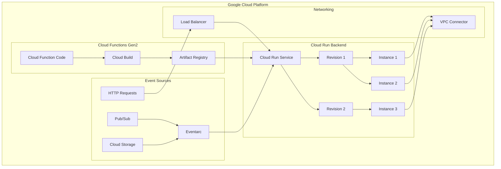
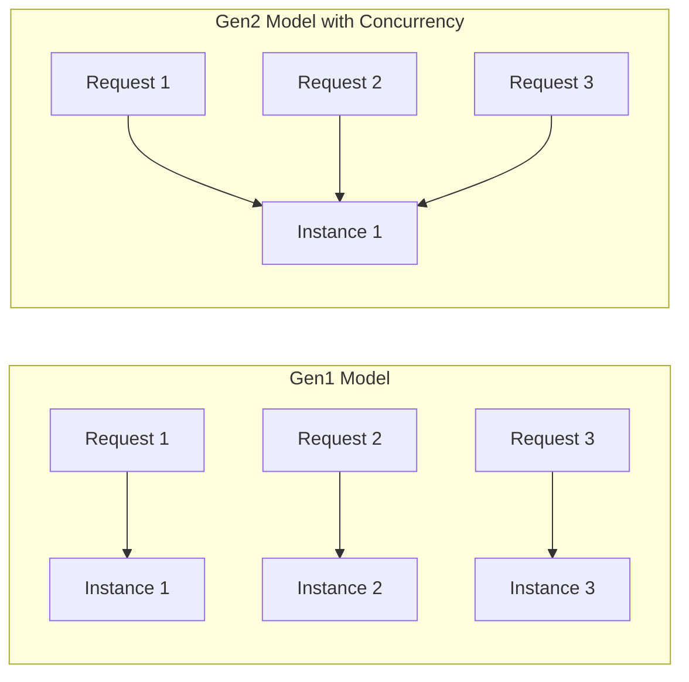
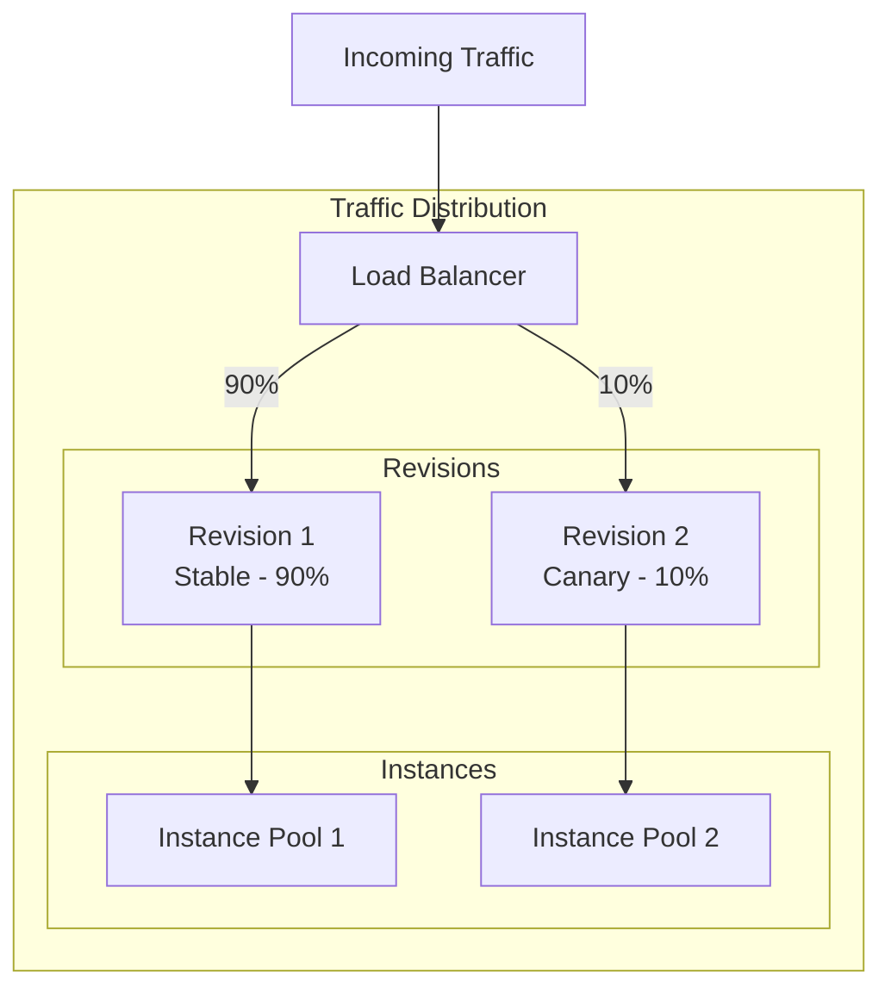
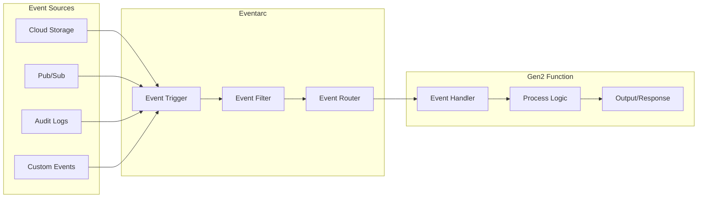

# How to Create Cloud Functions Gen2

Author: [nawazdhandala](https://github.com/nawazdhandala)

Tags: GCP, CloudFunctions, Serverless, Gen2

Description: A comprehensive guide to deploying serverless functions with Google Cloud Functions Gen2 and its Cloud Run integration.

---

## Introduction

Google Cloud Functions Gen2 represents a significant evolution in serverless computing on Google Cloud Platform. Built on top of Cloud Run, Gen2 brings powerful new capabilities including longer request timeouts, larger instances, concurrency support, and traffic splitting. This guide walks you through everything you need to know to get started with Cloud Functions Gen2.

## Gen1 vs Gen2: Key Differences

Understanding the differences between Gen1 and Gen2 helps you make informed decisions about which version to use for your workloads.

| Feature | Gen1 | Gen2 |
|---------|------|------|
| Maximum timeout | 9 minutes (HTTP), 9 minutes (event) | 60 minutes (HTTP), 9 minutes (event) |
| Maximum instance size | 8 GB RAM, 2 vCPU | 32 GB RAM, 8 vCPU |
| Concurrency | 1 request per instance | Up to 1000 requests per instance |
| Traffic splitting | Not supported | Supported via revisions |
| Minimum instances | Supported | Supported |
| VPC connector | Supported | Supported |
| Cloud Run integration | No | Yes (built on Cloud Run) |
| Eventarc integration | Limited | Full support |
| Cold start performance | Baseline | Improved |

### When to Choose Gen2

- You need longer execution times for HTTP functions
- Your workload benefits from handling multiple concurrent requests
- You want to use traffic splitting for gradual rollouts
- You need larger instance sizes for memory-intensive workloads
- You want tighter integration with Cloud Run features

### When Gen1 May Still Work

- Simple event-driven functions with low resource needs
- Existing workloads that work well and do not need migration
- Functions that must remain isolated (one request per instance)

## Gen2 Architecture

Cloud Functions Gen2 is built on top of Cloud Run, which means your functions run as containers managed by Cloud Run under the hood. This architecture provides several benefits including better scalability, improved cold start times, and access to Cloud Run features.



## Cloud Run Integration Benefits

Since Gen2 functions run on Cloud Run, you get access to powerful features:

### 1. Container-Based Deployment

Your function code is automatically containerized and stored in Artifact Registry. This means you can:

- View and manage container images
- Use the same image across multiple services
- Benefit from container security scanning

### 2. Revision Management

Each deployment creates a new revision, allowing you to:

- Roll back to previous versions instantly
- Compare performance between revisions
- Maintain deployment history

### 3. Unified Logging and Monitoring

Cloud Run integration provides:

- Detailed request logs in Cloud Logging
- Metrics in Cloud Monitoring
- Distributed tracing with Cloud Trace

## Creating Your First Gen2 Function

Let us create a simple HTTP function using Node.js.

### Project Setup

```bash
# Create a new directory for your function
mkdir my-gen2-function
cd my-gen2-function

# Initialize a Node.js project
npm init -y

# Install the Functions Framework
npm install @google-cloud/functions-framework
```

### Function Code

Create an `index.js` file with your function logic:

```javascript
// index.js
// Import the Functions Framework for handling HTTP requests
const functions = require('@google-cloud/functions-framework');

// Register an HTTP function that responds to GET and POST requests
// The function name 'helloWorld' will be used during deployment
functions.http('helloWorld', (req, res) => {
    // Extract the name from query parameters or request body
    // Default to 'World' if no name is provided
    const name = req.query.name || req.body.name || 'World';

    // Get the current timestamp for logging purposes
    const timestamp = new Date().toISOString();

    // Log the request for debugging and monitoring
    // These logs appear in Cloud Logging
    console.log(`[${timestamp}] Received request for name: ${name}`);

    // Send a JSON response with greeting and metadata
    res.json({
        message: `Hello, ${name}!`,
        timestamp: timestamp,
        // Include instance information to demonstrate concurrency
        instanceId: process.env.K_REVISION || 'local'
    });
});
```

### Package Configuration

Update your `package.json` to include the start script:

```json
{
    "name": "my-gen2-function",
    "version": "1.0.0",
    "main": "index.js",
    "scripts": {
        "start": "functions-framework --target=helloWorld"
    },
    "dependencies": {
        "@google-cloud/functions-framework": "^3.0.0"
    }
}
```

### Local Testing

Test your function locally before deploying:

```bash
# Start the local development server
npm start

# In another terminal, test the function
curl "http://localhost:8080?name=Developer"
```

### Deploying to Gen2

Deploy your function using the gcloud CLI:

```bash
# Deploy as a Gen2 function
gcloud functions deploy helloWorld \
    --gen2 \
    --runtime=nodejs20 \
    --region=us-central1 \
    --source=. \
    --entry-point=helloWorld \
    --trigger-http \
    --allow-unauthenticated \
    --memory=256MB \
    --timeout=60s
```

## Concurrency Configuration

One of the most powerful features of Gen2 is the ability to handle multiple concurrent requests per instance. This can significantly reduce costs and improve performance.

### Understanding Concurrency



### Setting Concurrency

You can configure concurrency during deployment:

```bash
# Deploy with concurrency set to 80 requests per instance
gcloud functions deploy helloWorld \
    --gen2 \
    --runtime=nodejs20 \
    --region=us-central1 \
    --source=. \
    --entry-point=helloWorld \
    --trigger-http \
    --concurrency=80 \
    --cpu=1 \
    --memory=512MB
```

### Concurrency Best Practices

```javascript
// index.js
// Example: Handling concurrent requests with shared resources
const functions = require('@google-cloud/functions-framework');

// Create a connection pool that can be shared across concurrent requests
// This is more efficient than creating a new connection for each request
const { Pool } = require('pg');

// Initialize the pool once when the instance starts
// All concurrent requests will share this pool
const pool = new Pool({
    // Use environment variables for configuration
    host: process.env.DB_HOST,
    database: process.env.DB_NAME,
    user: process.env.DB_USER,
    password: process.env.DB_PASSWORD,
    // Set pool size based on expected concurrency
    // Each concurrent request may need a connection
    max: 20,
    // Return idle connections to the pool
    idleTimeoutMillis: 30000,
    // Fail fast if no connections available
    connectionTimeoutMillis: 2000,
});

functions.http('queryDatabase', async (req, res) => {
    // Get a client from the pool
    // The pool manages connection reuse across concurrent requests
    const client = await pool.connect();

    try {
        // Execute the query
        const result = await client.query('SELECT NOW() as current_time');

        res.json({
            success: true,
            time: result.rows[0].current_time
        });
    } catch (error) {
        console.error('Database query failed:', error);
        res.status(500).json({
            success: false,
            error: 'Database query failed'
        });
    } finally {
        // Always release the client back to the pool
        // This is critical for concurrent request handling
        client.release();
    }
});
```

### Choosing the Right Concurrency Value

Consider these factors when setting concurrency:

| Workload Type | Recommended Concurrency | Reason |
|---------------|------------------------|--------|
| CPU-intensive | 1-10 | Avoid CPU contention |
| I/O-bound (API calls) | 50-100 | Maximize throughput |
| Memory-intensive | Based on memory/request | Prevent OOM errors |
| Mixed workloads | 10-50 | Balance resources |

## Traffic Splitting and Revisions

Gen2 functions support traffic splitting, allowing you to gradually roll out new versions or perform A/B testing.

### Traffic Splitting Architecture



### Implementing Traffic Splitting

First, deploy your initial version:

```bash
# Deploy the initial version
gcloud functions deploy myFunction \
    --gen2 \
    --runtime=nodejs20 \
    --region=us-central1 \
    --source=. \
    --entry-point=myFunction \
    --trigger-http
```

Get the underlying Cloud Run service name:

```bash
# List the Cloud Run services to find your function
gcloud run services list --region=us-central1
```

Deploy a new version and split traffic:

```bash
# Deploy a new version (creates a new revision)
gcloud functions deploy myFunction \
    --gen2 \
    --runtime=nodejs20 \
    --region=us-central1 \
    --source=. \
    --entry-point=myFunction \
    --trigger-http

# Split traffic between revisions using Cloud Run
# Send 90% to the previous revision and 10% to the new one
gcloud run services update-traffic myFunction \
    --region=us-central1 \
    --to-revisions=myFunction-00001-abc=90,myFunction-00002-xyz=10
```

### Gradual Rollout Strategy

```bash
#!/bin/bash
# gradual-rollout.sh
# Script to gradually increase traffic to a new revision

SERVICE_NAME="myFunction"
REGION="us-central1"
NEW_REVISION="myFunction-00002-xyz"
OLD_REVISION="myFunction-00001-abc"

# Array of traffic percentages for gradual rollout
TRAFFIC_STEPS=(10 25 50 75 100)

for PERCENTAGE in "${TRAFFIC_STEPS[@]}"; do
    OLD_PERCENTAGE=$((100 - PERCENTAGE))

    echo "Setting traffic: ${NEW_REVISION}=${PERCENTAGE}%, ${OLD_REVISION}=${OLD_PERCENTAGE}%"

    gcloud run services update-traffic ${SERVICE_NAME} \
        --region=${REGION} \
        --to-revisions=${NEW_REVISION}=${PERCENTAGE},${OLD_REVISION}=${OLD_PERCENTAGE}

    # Wait and monitor before increasing traffic
    echo "Waiting 5 minutes before next increment..."
    sleep 300

    # Add your monitoring checks here
    # Exit if error rates are too high
done

echo "Rollout complete!"
```

## Event-Driven Functions with Eventarc

Gen2 functions integrate with Eventarc for powerful event-driven architectures.

### Eventarc Architecture



### Cloud Storage Trigger Example

```javascript
// index.js
// Function triggered by Cloud Storage events
const functions = require('@google-cloud/functions-framework');
const { Storage } = require('@google-cloud/storage');

// Initialize the Storage client
const storage = new Storage();

// Register a CloudEvent function for storage triggers
// CloudEvents is the standard format for Gen2 event functions
functions.cloudEvent('processUpload', async (cloudEvent) => {
    // Extract event data from the CloudEvent
    // The data structure follows the CloudEvents specification
    const file = cloudEvent.data;

    console.log(`Processing file: ${file.name}`);
    console.log(`Bucket: ${file.bucket}`);
    console.log(`Content type: ${file.contentType}`);
    console.log(`Size: ${file.size} bytes`);
    console.log(`Event type: ${cloudEvent.type}`);

    // Only process specific file types
    if (!file.contentType.startsWith('image/')) {
        console.log('Skipping non-image file');
        return;
    }

    // Get a reference to the uploaded file
    const bucket = storage.bucket(file.bucket);
    const uploadedFile = bucket.file(file.name);

    try {
        // Download the file metadata
        const [metadata] = await uploadedFile.getMetadata();

        // Process the image (example: log metadata)
        console.log('File metadata:', JSON.stringify(metadata, null, 2));

        // Add custom metadata to mark as processed
        await uploadedFile.setMetadata({
            metadata: {
                processed: 'true',
                processedAt: new Date().toISOString()
            }
        });

        console.log(`Successfully processed: ${file.name}`);
    } catch (error) {
        console.error('Error processing file:', error);
        throw error; // Rethrow to trigger retry
    }
});
```

Deploy with a Cloud Storage trigger:

```bash
# Deploy the function with a Cloud Storage trigger
gcloud functions deploy processUpload \
    --gen2 \
    --runtime=nodejs20 \
    --region=us-central1 \
    --source=. \
    --entry-point=processUpload \
    --trigger-bucket=my-upload-bucket \
    --trigger-event-filters="type=google.cloud.storage.object.v1.finalized"
```

### Pub/Sub Trigger Example

```javascript
// index.js
// Function triggered by Pub/Sub messages
const functions = require('@google-cloud/functions-framework');

// Register a CloudEvent function for Pub/Sub triggers
functions.cloudEvent('processPubSubMessage', (cloudEvent) => {
    // The Pub/Sub message data is base64 encoded
    const base64Data = cloudEvent.data.message.data;

    // Decode the message
    const messageData = base64Data
        ? JSON.parse(Buffer.from(base64Data, 'base64').toString())
        : {};

    // Extract message attributes
    const attributes = cloudEvent.data.message.attributes || {};

    console.log('Received Pub/Sub message:');
    console.log('Message ID:', cloudEvent.data.message.messageId);
    console.log('Publish time:', cloudEvent.data.message.publishTime);
    console.log('Data:', JSON.stringify(messageData, null, 2));
    console.log('Attributes:', JSON.stringify(attributes, null, 2));

    // Process the message based on its content
    if (messageData.action === 'sendEmail') {
        console.log(`Sending email to: ${messageData.recipient}`);
        // Add email sending logic here
    } else if (messageData.action === 'generateReport') {
        console.log(`Generating report: ${messageData.reportType}`);
        // Add report generation logic here
    }

    // CloudEvent functions do not return a response
    // Errors should be thrown to trigger retries
});
```

Deploy with a Pub/Sub trigger:

```bash
# Create a Pub/Sub topic if it does not exist
gcloud pubsub topics create my-topic

# Deploy the function with a Pub/Sub trigger
gcloud functions deploy processPubSubMessage \
    --gen2 \
    --runtime=nodejs20 \
    --region=us-central1 \
    --source=. \
    --entry-point=processPubSubMessage \
    --trigger-topic=my-topic
```

## Python Example

Here is a Gen2 function example using Python:

```python
# main.py
# Gen2 Cloud Function using Python with async support
import functions_framework
import asyncio
import aiohttp
from datetime import datetime

# HTTP function that makes multiple external API calls concurrently
@functions_framework.http
def fetch_data(request):
    """
    HTTP Cloud Function that demonstrates async operations.
    Fetches data from multiple APIs concurrently for better performance.
    """
    # Parse request parameters
    request_json = request.get_json(silent=True)
    request_args = request.args

    # Get the list of URLs to fetch, with defaults
    urls = []
    if request_json and 'urls' in request_json:
        urls = request_json['urls']
    elif request_args and 'url' in request_args:
        urls = request_args.getlist('url')
    else:
        # Default URLs for demonstration
        urls = [
            'https://httpbin.org/get',
            'https://httpbin.org/headers',
            'https://httpbin.org/ip'
        ]

    # Run the async function in the event loop
    results = asyncio.run(fetch_all_urls(urls))

    return {
        'success': True,
        'timestamp': datetime.utcnow().isoformat(),
        'results': results
    }


async def fetch_all_urls(urls):
    """
    Fetch multiple URLs concurrently using aiohttp.
    This is more efficient than sequential requests.
    """
    async with aiohttp.ClientSession() as session:
        # Create tasks for all URLs
        tasks = [fetch_url(session, url) for url in urls]

        # Wait for all tasks to complete
        results = await asyncio.gather(*tasks, return_exceptions=True)

        # Process results
        processed_results = []
        for url, result in zip(urls, results):
            if isinstance(result, Exception):
                processed_results.append({
                    'url': url,
                    'success': False,
                    'error': str(result)
                })
            else:
                processed_results.append({
                    'url': url,
                    'success': True,
                    'status': result['status'],
                    'data': result['data']
                })

        return processed_results


async def fetch_url(session, url):
    """
    Fetch a single URL and return the response data.
    """
    async with session.get(url, timeout=30) as response:
        data = await response.json()
        return {
            'status': response.status,
            'data': data
        }
```

Requirements file for Python:

```text
# requirements.txt
functions-framework==3.*
aiohttp==3.*
```

Deploy the Python function:

```bash
gcloud functions deploy fetch_data \
    --gen2 \
    --runtime=python311 \
    --region=us-central1 \
    --source=. \
    --entry-point=fetch_data \
    --trigger-http \
    --allow-unauthenticated \
    --memory=512MB \
    --timeout=120s \
    --concurrency=50
```

## Environment Variables and Secrets

Gen2 functions support environment variables and Secret Manager integration:

```bash
# Deploy with environment variables
gcloud functions deploy myFunction \
    --gen2 \
    --runtime=nodejs20 \
    --region=us-central1 \
    --source=. \
    --entry-point=myFunction \
    --trigger-http \
    --set-env-vars="API_URL=https://api.example.com,LOG_LEVEL=info"

# Deploy with secrets from Secret Manager
gcloud functions deploy myFunction \
    --gen2 \
    --runtime=nodejs20 \
    --region=us-central1 \
    --source=. \
    --entry-point=myFunction \
    --trigger-http \
    --set-secrets="API_KEY=projects/my-project/secrets/api-key:latest"
```

Access secrets in your code:

```javascript
// index.js
// Accessing environment variables and secrets
const functions = require('@google-cloud/functions-framework');

functions.http('secureFunction', (req, res) => {
    // Environment variables are accessed via process.env
    const apiUrl = process.env.API_URL;
    const logLevel = process.env.LOG_LEVEL;

    // Secrets mounted as environment variables work the same way
    // The secret value is automatically retrieved from Secret Manager
    const apiKey = process.env.API_KEY;

    // Validate required configuration
    if (!apiKey) {
        console.error('API_KEY is not configured');
        return res.status(500).json({
            error: 'Server configuration error'
        });
    }

    // Use the configuration
    console.log(`Using API at ${apiUrl} with log level ${logLevel}`);

    res.json({
        message: 'Configuration loaded successfully',
        apiUrl: apiUrl,
        logLevel: logLevel,
        // Never log or return actual secret values
        hasApiKey: !!apiKey
    });
});
```

## Monitoring and Debugging

### Viewing Logs

```bash
# View logs for your function
gcloud functions logs read myFunction \
    --gen2 \
    --region=us-central1 \
    --limit=50

# Stream logs in real-time
gcloud beta functions logs read myFunction \
    --gen2 \
    --region=us-central1 \
    --limit=50 \
    --follow
```

### Structured Logging

```javascript
// index.js
// Using structured logging for better observability
const functions = require('@google-cloud/functions-framework');

functions.http('structuredLogging', (req, res) => {
    // Structured logs are automatically parsed by Cloud Logging
    // Use JSON format for complex log entries
    console.log(JSON.stringify({
        severity: 'INFO',
        message: 'Processing request',
        httpRequest: {
            requestMethod: req.method,
            requestUrl: req.url,
            userAgent: req.get('User-Agent'),
            remoteIp: req.ip
        },
        labels: {
            function: 'structuredLogging',
            environment: process.env.ENVIRONMENT || 'production'
        }
    }));

    // Simulate some processing
    const startTime = Date.now();

    // ... your processing logic here ...

    const duration = Date.now() - startTime;

    // Log completion with timing information
    console.log(JSON.stringify({
        severity: 'INFO',
        message: 'Request completed',
        duration_ms: duration,
        labels: {
            function: 'structuredLogging'
        }
    }));

    res.json({ success: true });
});
```

## Best Practices Summary

1. **Use appropriate concurrency**: Set concurrency based on your workload type and resource requirements.

2. **Implement connection pooling**: Share database connections and HTTP clients across concurrent requests.

3. **Handle cold starts**: Use minimum instances for latency-sensitive functions.

4. **Use traffic splitting**: Gradually roll out changes to catch issues early.

5. **Leverage structured logging**: Make debugging easier with well-formatted logs.

6. **Secure your functions**: Use Secret Manager for sensitive data and IAM for access control.

7. **Monitor performance**: Set up alerts for error rates and latency.

8. **Choose the right memory and CPU**: Match resources to your workload requirements.

## Conclusion

Cloud Functions Gen2 represents a significant leap forward in serverless computing on Google Cloud. By building on Cloud Run, Gen2 provides powerful features like concurrency, traffic splitting, and longer timeouts while maintaining the simplicity of the Cloud Functions deployment model. Whether you are building HTTP APIs, processing events, or creating background workers, Gen2 gives you the tools to build scalable, cost-effective serverless applications.

Start with a simple function, experiment with concurrency settings, and gradually adopt advanced features like traffic splitting as your needs grow. The integration with Cloud Run means you have a clear path to even more customization if you ever need it.
