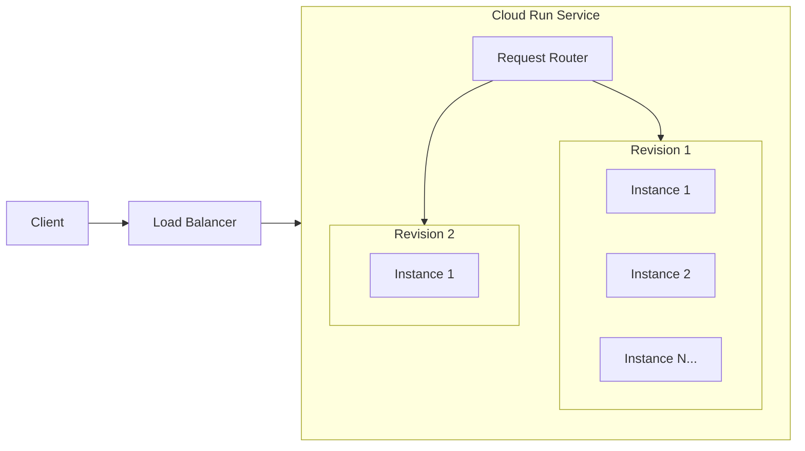
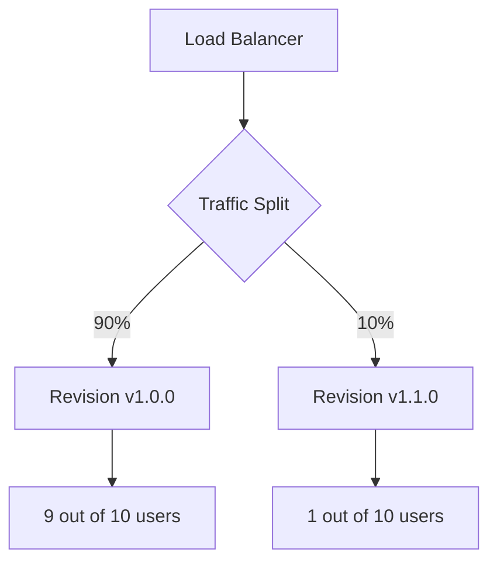
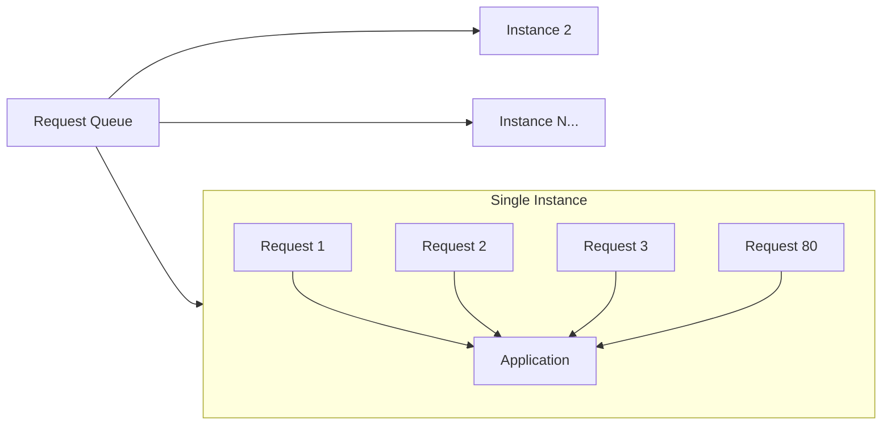
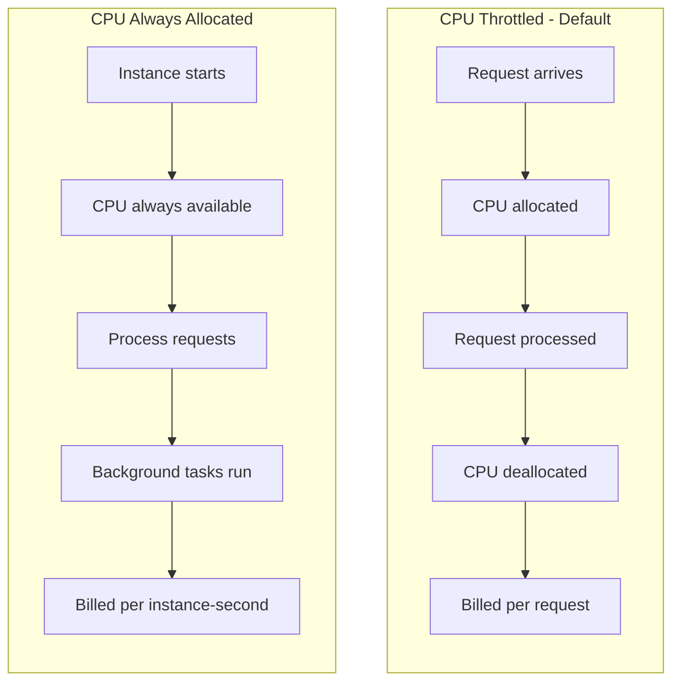
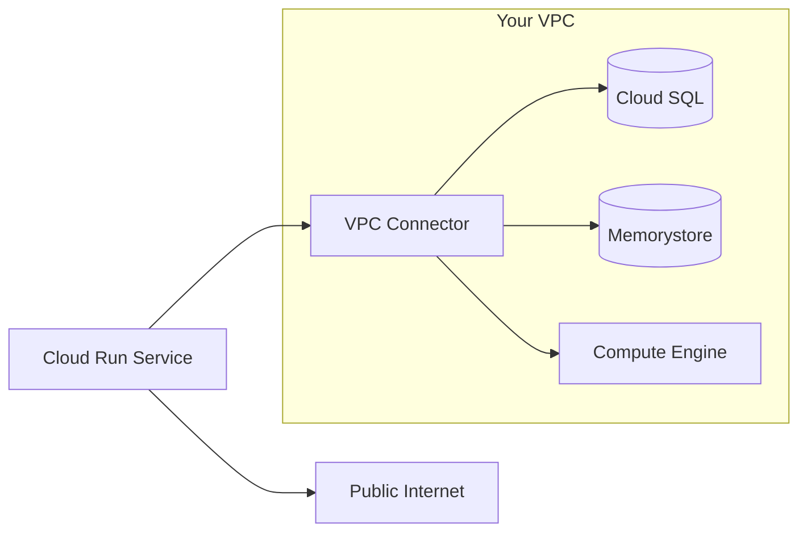

# How to Implement Cloud Run Services

Author: [nawazdhandala](https://github.com/nawazdhandala)

Tags: GCP, Cloud Run, Containers, Serverless

Description: A practical guide to deploying containerized applications on Google Cloud Run with gcloud CLI and Terraform, covering traffic management, concurrency, CPU allocation, and VPC connectivity.

---

Cloud Run lets you run containers without managing servers. You push a container image, Cloud Run handles scaling, load balancing, and TLS. Pay only for the requests you serve.

## How Cloud Run Handles Requests



When a request arrives:
1. Cloud Run routes it to a revision based on traffic split configuration
2. If no instances are running, one spins up (cold start)
3. Instances handle concurrent requests up to the configured limit
4. Idle instances scale down to zero after a timeout

## Deploying with gcloud CLI

### Basic Deployment

```bash
# Build and push your container image
gcloud builds submit --tag gcr.io/PROJECT_ID/myapp:v1

# Deploy to Cloud Run
gcloud run deploy myapp \
  --image gcr.io/PROJECT_ID/myapp:v1 \
  --region us-central1 \
  --platform managed \
  --allow-unauthenticated
```

### Production Configuration

```bash
gcloud run deploy myapp \
  --image gcr.io/PROJECT_ID/myapp:v1 \
  --region us-central1 \
  --platform managed \
  --port 8080 \
  --concurrency 80 \
  --min-instances 2 \
  --max-instances 100 \
  --memory 512Mi \
  --cpu 1 \
  --cpu-throttling \
  --timeout 300 \
  --set-env-vars "DB_HOST=10.0.0.5,LOG_LEVEL=info" \
  --service-account myapp-sa@PROJECT_ID.iam.gserviceaccount.com \
  --no-allow-unauthenticated
```

### Deploy from Source Code

Cloud Run can build from source using buildpacks:

```bash
gcloud run deploy myapp \
  --source . \
  --region us-central1
```

## Deploying with Terraform

### Basic Cloud Run Service

```hcl
terraform {
  required_providers {
    google = {
      source  = "hashicorp/google"
      version = "~> 5.0"
    }
  }
}

provider "google" {
  project = var.project_id
  region  = var.region
}

variable "project_id" {
  description = "GCP project ID"
  type        = string
}

variable "region" {
  description = "GCP region"
  type        = string
  default     = "us-central1"
}

resource "google_cloud_run_v2_service" "myapp" {
  name     = "myapp"
  location = var.region

  template {
    containers {
      image = "gcr.io/${var.project_id}/myapp:v1"

      ports {
        container_port = 8080
      }

      resources {
        limits = {
          cpu    = "1"
          memory = "512Mi"
        }
      }

      env {
        name  = "LOG_LEVEL"
        value = "info"
      }

      env {
        name = "DB_PASSWORD"
        value_source {
          secret_key_ref {
            secret  = google_secret_manager_secret.db_password.secret_id
            version = "latest"
          }
        }
      }
    }

    scaling {
      min_instance_count = 2
      max_instance_count = 100
    }

    max_instance_request_concurrency = 80
    timeout                          = "300s"
    service_account                  = google_service_account.myapp.email
  }

  traffic {
    type    = "TRAFFIC_TARGET_ALLOCATION_TYPE_LATEST"
    percent = 100
  }
}

resource "google_service_account" "myapp" {
  account_id   = "myapp-sa"
  display_name = "MyApp Service Account"
}

resource "google_secret_manager_secret" "db_password" {
  secret_id = "db-password"

  replication {
    auto {}
  }
}

# Allow unauthenticated access (public API)
resource "google_cloud_run_v2_service_iam_member" "public" {
  project  = google_cloud_run_v2_service.myapp.project
  location = google_cloud_run_v2_service.myapp.location
  name     = google_cloud_run_v2_service.myapp.name
  role     = "roles/run.invoker"
  member   = "allUsers"
}

output "service_url" {
  value = google_cloud_run_v2_service.myapp.uri
}
```

### With VPC Connector

```hcl
resource "google_vpc_access_connector" "connector" {
  name          = "myapp-connector"
  region        = var.region
  network       = google_compute_network.main.name
  ip_cidr_range = "10.8.0.0/28"

  min_instances = 2
  max_instances = 10

  machine_type = "e2-micro"
}

resource "google_compute_network" "main" {
  name                    = "main-vpc"
  auto_create_subnetworks = false
}

resource "google_compute_subnetwork" "private" {
  name          = "private-subnet"
  ip_cidr_range = "10.0.0.0/24"
  region        = var.region
  network       = google_compute_network.main.id

  private_ip_google_access = true
}

resource "google_cloud_run_v2_service" "myapp_with_vpc" {
  name     = "myapp"
  location = var.region

  template {
    containers {
      image = "gcr.io/${var.project_id}/myapp:v1"
    }

    vpc_access {
      connector = google_vpc_access_connector.connector.id
      egress    = "PRIVATE_RANGES_ONLY"
    }

    scaling {
      min_instance_count = 1
      max_instance_count = 50
    }
  }
}
```

## Traffic Splitting

Traffic splitting enables canary deployments and gradual rollouts.



### gcloud Traffic Management

```bash
# Deploy new revision without shifting traffic
gcloud run deploy myapp \
  --image gcr.io/PROJECT_ID/myapp:v2 \
  --region us-central1 \
  --no-traffic

# Split traffic between revisions
gcloud run services update-traffic myapp \
  --region us-central1 \
  --to-revisions myapp-00001-abc=90,myapp-00002-def=10

# Gradually shift more traffic
gcloud run services update-traffic myapp \
  --region us-central1 \
  --to-revisions myapp-00001-abc=50,myapp-00002-def=50

# Complete the rollout
gcloud run services update-traffic myapp \
  --region us-central1 \
  --to-latest
```

### Terraform Traffic Configuration

```hcl
resource "google_cloud_run_v2_service" "myapp" {
  name     = "myapp"
  location = var.region

  template {
    revision = "myapp-v2"
    containers {
      image = "gcr.io/${var.project_id}/myapp:v2"
    }
  }

  # Canary deployment: 10% to new revision
  traffic {
    type     = "TRAFFIC_TARGET_ALLOCATION_TYPE_REVISION"
    revision = "myapp-v1"
    percent  = 90
  }

  traffic {
    type     = "TRAFFIC_TARGET_ALLOCATION_TYPE_REVISION"
    revision = "myapp-v2"
    percent  = 10
  }
}
```

### Tag-Based Routing

Route specific traffic to revisions using URL tags:

```bash
# Add a tag to a revision for testing
gcloud run services update-traffic myapp \
  --region us-central1 \
  --set-tags canary=myapp-00002-def

# Access tagged revision directly
# https://canary---myapp-xyz123.a.run.app
```

## Concurrency Settings

Concurrency controls how many requests each instance handles simultaneously.



### Choosing the Right Concurrency

| Workload Type | Recommended Concurrency |
|--------------|------------------------|
| CPU-bound (image processing) | 1-4 |
| Balanced (typical web app) | 80 (default) |
| I/O-bound (API aggregation) | 100-250 |
| WebSocket connections | 1000 |

### gcloud Concurrency Configuration

```bash
# Low concurrency for CPU-heavy tasks
gcloud run deploy image-processor \
  --image gcr.io/PROJECT_ID/processor:v1 \
  --concurrency 1 \
  --cpu 2 \
  --memory 2Gi

# High concurrency for I/O-bound workloads
gcloud run deploy api-gateway \
  --image gcr.io/PROJECT_ID/gateway:v1 \
  --concurrency 250 \
  --cpu 1 \
  --memory 512Mi
```

### Terraform Concurrency

```hcl
resource "google_cloud_run_v2_service" "processor" {
  name     = "image-processor"
  location = var.region

  template {
    containers {
      image = "gcr.io/${var.project_id}/processor:v1"

      resources {
        limits = {
          cpu    = "2"
          memory = "2Gi"
        }
        cpu_idle = false  # Always allocate CPU
      }
    }

    max_instance_request_concurrency = 1

    scaling {
      min_instance_count = 0
      max_instance_count = 20
    }
  }
}
```

## CPU Allocation

Cloud Run offers two CPU allocation modes that affect billing and performance.

### CPU Allocation Modes



### When to Use Each Mode

**CPU Throttled (Default)**
- Standard web applications
- APIs with predictable request patterns
- Cost optimization for bursty traffic

**CPU Always Allocated**
- Background processing between requests
- WebSocket connections
- Streaming responses
- Applications that cache data in memory

### gcloud CPU Configuration

```bash
# CPU throttled (default) - CPU only during request processing
gcloud run deploy myapp \
  --image gcr.io/PROJECT_ID/myapp:v1 \
  --cpu 1 \
  --cpu-throttling

# CPU always allocated - for background work
gcloud run deploy worker \
  --image gcr.io/PROJECT_ID/worker:v1 \
  --cpu 2 \
  --no-cpu-throttling \
  --min-instances 1
```

### Terraform CPU Allocation

```hcl
# CPU throttled service
resource "google_cloud_run_v2_service" "api" {
  name     = "api"
  location = var.region

  template {
    containers {
      image = "gcr.io/${var.project_id}/api:v1"

      resources {
        limits = {
          cpu    = "1"
          memory = "512Mi"
        }
        cpu_idle = true  # Throttle CPU between requests
      }
    }
  }
}

# CPU always allocated service
resource "google_cloud_run_v2_service" "worker" {
  name     = "worker"
  location = var.region

  template {
    containers {
      image = "gcr.io/${var.project_id}/worker:v1"

      resources {
        limits = {
          cpu    = "2"
          memory = "1Gi"
        }
        cpu_idle          = false  # Keep CPU allocated
        startup_cpu_boost = true   # Extra CPU during startup
      }
    }

    scaling {
      min_instance_count = 1  # Keep at least one instance warm
      max_instance_count = 10
    }
  }
}
```

## VPC Connectors

VPC Connectors let Cloud Run access resources in your VPC, such as databases, Redis, or internal APIs.



### gcloud VPC Connector Setup

```bash
# Create a VPC connector
gcloud compute networks vpc-access connectors create myapp-connector \
  --region us-central1 \
  --network default \
  --range 10.8.0.0/28 \
  --min-instances 2 \
  --max-instances 10 \
  --machine-type e2-micro

# Deploy with VPC connector
gcloud run deploy myapp \
  --image gcr.io/PROJECT_ID/myapp:v1 \
  --region us-central1 \
  --vpc-connector myapp-connector \
  --vpc-egress private-ranges-only
```

### Egress Options

```bash
# Route only private IP ranges through VPC
gcloud run deploy myapp \
  --vpc-connector myapp-connector \
  --vpc-egress private-ranges-only

# Route all traffic through VPC (for NAT, firewall rules)
gcloud run deploy myapp \
  --vpc-connector myapp-connector \
  --vpc-egress all-traffic
```

### Complete Terraform VPC Setup

```hcl
# VPC and Subnet
resource "google_compute_network" "main" {
  name                    = "main-vpc"
  auto_create_subnetworks = false
}

resource "google_compute_subnetwork" "private" {
  name          = "private-subnet"
  ip_cidr_range = "10.0.0.0/24"
  region        = var.region
  network       = google_compute_network.main.id

  private_ip_google_access = true
}

# VPC Connector
resource "google_vpc_access_connector" "connector" {
  name   = "myapp-connector"
  region = var.region

  subnet {
    name = google_compute_subnetwork.connector.name
  }

  min_instances = 2
  max_instances = 10
  machine_type  = "e2-micro"
}

resource "google_compute_subnetwork" "connector" {
  name          = "connector-subnet"
  ip_cidr_range = "10.8.0.0/28"
  region        = var.region
  network       = google_compute_network.main.id
}

# Cloud SQL Instance
resource "google_sql_database_instance" "postgres" {
  name             = "myapp-db"
  database_version = "POSTGRES_15"
  region           = var.region

  settings {
    tier = "db-f1-micro"

    ip_configuration {
      ipv4_enabled    = false
      private_network = google_compute_network.main.id
    }
  }

  depends_on = [google_service_networking_connection.private_vpc]
}

resource "google_compute_global_address" "private_ip" {
  name          = "private-ip-range"
  purpose       = "VPC_PEERING"
  address_type  = "INTERNAL"
  prefix_length = 16
  network       = google_compute_network.main.id
}

resource "google_service_networking_connection" "private_vpc" {
  network                 = google_compute_network.main.id
  service                 = "servicenetworking.googleapis.com"
  reserved_peering_ranges = [google_compute_global_address.private_ip.name]
}

# Cloud Run with VPC access
resource "google_cloud_run_v2_service" "myapp" {
  name     = "myapp"
  location = var.region

  template {
    containers {
      image = "gcr.io/${var.project_id}/myapp:v1"

      env {
        name  = "DB_HOST"
        value = google_sql_database_instance.postgres.private_ip_address
      }
    }

    vpc_access {
      connector = google_vpc_access_connector.connector.id
      egress    = "PRIVATE_RANGES_ONLY"
    }
  }
}
```

## Health Checks and Startup Probes

Cloud Run supports startup probes and liveness checks:

```hcl
resource "google_cloud_run_v2_service" "myapp" {
  name     = "myapp"
  location = var.region

  template {
    containers {
      image = "gcr.io/${var.project_id}/myapp:v1"

      startup_probe {
        http_get {
          path = "/healthz"
          port = 8080
        }
        initial_delay_seconds = 5
        period_seconds        = 10
        failure_threshold     = 3
        timeout_seconds       = 3
      }

      liveness_probe {
        http_get {
          path = "/healthz"
          port = 8080
        }
        period_seconds    = 30
        failure_threshold = 3
        timeout_seconds   = 3
      }
    }
  }
}
```

## Custom Domains

```bash
# Map a custom domain
gcloud run domain-mappings create \
  --service myapp \
  --domain api.example.com \
  --region us-central1

# Get DNS records to configure
gcloud run domain-mappings describe \
  --domain api.example.com \
  --region us-central1
```

### Terraform Custom Domain

```hcl
resource "google_cloud_run_domain_mapping" "myapp" {
  name     = "api.example.com"
  location = var.region

  metadata {
    namespace = var.project_id
  }

  spec {
    route_name = google_cloud_run_v2_service.myapp.name
  }
}
```

## Monitoring and Observability

Cloud Run integrates with Cloud Monitoring and Cloud Trace:

```bash
# View logs
gcloud logging read "resource.type=cloud_run_revision \
  AND resource.labels.service_name=myapp" \
  --limit 50 \
  --format "table(timestamp,textPayload)"

# Get service metrics
gcloud monitoring dashboards create \
  --config-from-file=dashboard.json
```

For deeper observability, integrate with OpenTelemetry:

```hcl
resource "google_cloud_run_v2_service" "myapp" {
  name     = "myapp"
  location = var.region

  template {
    containers {
      image = "gcr.io/${var.project_id}/myapp:v1"

      env {
        name  = "OTEL_EXPORTER_OTLP_ENDPOINT"
        value = "https://otel.oneuptime.com/otlp"
      }

      env {
        name  = "OTEL_SERVICE_NAME"
        value = "myapp"
      }
    }
  }
}
```

## Cost Optimization Tips

1. **Use concurrency wisely** - Higher concurrency means fewer instances and lower costs
2. **Set min-instances to 0** for non-critical services to scale to zero
3. **Use CPU throttling** for request-driven workloads
4. **Right-size memory** - Start small and increase based on actual usage
5. **Use committed use discounts** for predictable workloads

```bash
# Cost-optimized configuration
gcloud run deploy myapp \
  --image gcr.io/PROJECT_ID/myapp:v1 \
  --concurrency 100 \
  --min-instances 0 \
  --max-instances 10 \
  --cpu 1 \
  --memory 256Mi \
  --cpu-throttling
```

---

Cloud Run offers a straightforward path to running containers in production. Start with the defaults, deploy your container, and iterate on configuration as you learn your application's resource needs. The combination of serverless scaling and familiar container tooling makes it a practical choice for teams that want to ship fast without managing infrastructure.
