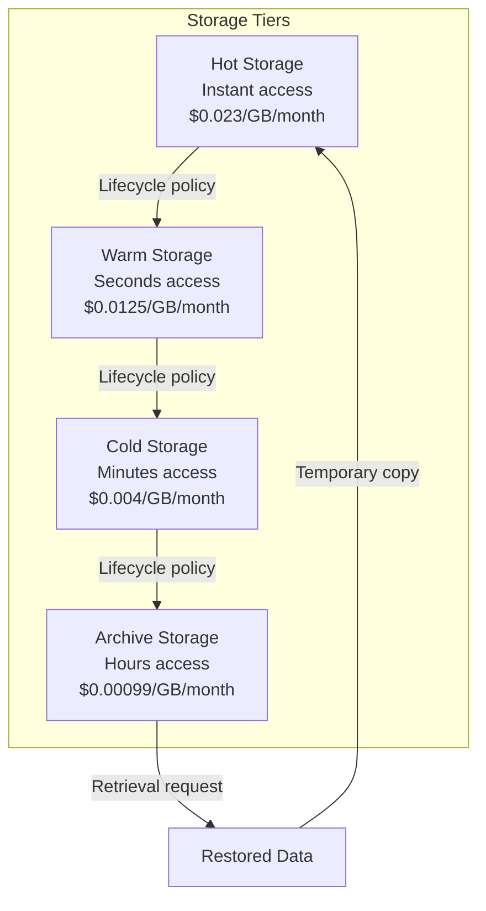
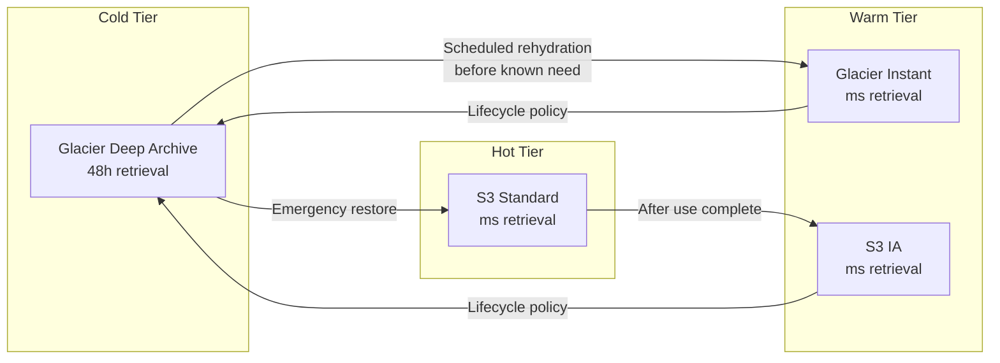

# How to Build Cold Storage Backups

Author: [nawazdhandala](https://github.com/nawazdhandala)

Tags: Backup, Storage, Cost Optimization, Archive

Description: Learn how to use cold storage for long-term backup retention with minimal costs.

---

Most organizations store far more data than they actively use. Archives, compliance records, historical logs, and old project files accumulate over years-and keeping them on hot storage burns money every month. Cold storage offers a smarter path: pay pennies per gigabyte for data you rarely access, while maintaining the durability guarantees you need for disaster recovery and compliance.

This guide walks through cold storage fundamentals, cost models, implementation patterns, and the critical details that determine whether your archive strategy succeeds or fails during recovery.

---

## TL;DR

- Cold storage costs 80-90% less than hot storage but has retrieval delays (minutes to hours)
- Use lifecycle policies to automatically transition data based on age and access patterns
- Plan for retrieval costs and time-data unavailable for hours can break RTOs
- Major options: AWS Glacier, Azure Archive, Google Archive, Backblaze B2, Wasabi
- Compliance requirements often mandate immutable, versioned cold archives
- Test your retrieval process regularly-archives that cannot be restored are worthless

---

## What Makes Storage "Cold"

Cold storage differs from standard object or block storage in three fundamental ways:

**1. Access Latency**: Retrieving data takes minutes to hours, not milliseconds. Cloud providers achieve low costs by storing data on slower media (tape libraries, high-density HDDs) or in formats that require reconstruction.

**2. Retrieval Costs**: You pay to get data out, not just to store it. Restoring 1 TB from Glacier Deep Archive costs around $20-100 depending on retrieval speed-negligible for disaster recovery but expensive for frequent access.

**3. Minimum Storage Duration**: Most cold tiers charge for early deletion. AWS Glacier has 90-day and 180-day minimums. Delete a file on day 89, and you still pay for 90 days.



---

## Cold Storage Retrieval Classes

Understanding retrieval options is critical for planning your RTO (Recovery Time Objective):

| Retrieval Type | Time to First Byte | Cost per GB | Best For |
|---------------|-------------------|-------------|----------|
| **Expedited** | 1-5 minutes | $0.03 | Urgent partial restores |
| **Standard** | 3-5 hours | $0.01 | Planned recovery operations |
| **Bulk** | 5-12 hours | $0.0025 | Large-scale disaster recovery |

AWS Glacier Deep Archive only supports Standard (12 hours) and Bulk (48 hours) retrieval. When you need data faster than that, you need a different tier.

### Retrieval Time Planning

Your backup strategy must account for retrieval delays:

```python
# Calculate realistic recovery timeline
def estimate_recovery_time(
    archive_size_gb: float,
    retrieval_class: str,
    network_bandwidth_mbps: float
) -> dict:
    """
    Estimate total time to recover data from cold storage.

    Args:
        archive_size_gb: Size of data to restore in gigabytes
        retrieval_class: 'expedited', 'standard', or 'bulk'
        network_bandwidth_mbps: Available download bandwidth

    Returns:
        Dictionary with retrieval time, download time, and total estimate
    """
    # Retrieval preparation time (time until data is available)
    retrieval_times = {
        'expedited': 5,      # 5 minutes
        'standard': 300,     # 5 hours in minutes
        'bulk': 720          # 12 hours in minutes
    }

    # Calculate download time after data is available
    # Convert GB to Mb, then divide by bandwidth
    download_time_minutes = (archive_size_gb * 8 * 1024) / (network_bandwidth_mbps * 60)

    retrieval_minutes = retrieval_times.get(retrieval_class, 300)
    total_minutes = retrieval_minutes + download_time_minutes

    return {
        'retrieval_wait_hours': retrieval_minutes / 60,
        'download_hours': download_time_minutes / 60,
        'total_hours': total_minutes / 60,
        'recommendation': 'Consider expedited if RTO < 6 hours'
                         if total_minutes > 360 else 'Standard retrieval acceptable'
    }

# Example: Restoring 500 GB over 1 Gbps connection
timeline = estimate_recovery_time(500, 'standard', 1000)
print(f"Total recovery time: {timeline['total_hours']:.1f} hours")
# Output: Total recovery time: 6.1 hours (5h retrieval + 1.1h download)
```

---

## Cost Savings Analysis

The financial case for cold storage is compelling. Here is a realistic comparison for 100 TB of backup data:

| Storage Class | Monthly Cost | Annual Cost | 5-Year Cost |
|--------------|-------------|-------------|-------------|
| S3 Standard | $2,300 | $27,600 | $138,000 |
| S3 Infrequent Access | $1,250 | $15,000 | $75,000 |
| S3 Glacier Instant | $400 | $4,800 | $24,000 |
| S3 Glacier Flexible | $360 | $4,320 | $21,600 |
| S3 Glacier Deep Archive | $99 | $1,188 | $5,940 |

**Deep Archive saves $132,060 over 5 years compared to Standard storage.**

But factor in retrieval costs for disaster recovery:

```python
def calculate_total_cost_of_ownership(
    data_size_tb: float,
    storage_years: int,
    expected_full_restores: int,
    storage_class: str
) -> dict:
    """
    Calculate true TCO including storage and expected retrieval costs.

    Args:
        data_size_tb: Total data size in terabytes
        storage_years: Planning horizon in years
        expected_full_restores: Number of full data restores expected
        storage_class: AWS storage class name

    Returns:
        Detailed cost breakdown
    """
    # Monthly storage costs per TB
    storage_costs = {
        's3_standard': 23.00,
        's3_ia': 12.50,
        'glacier_instant': 4.00,
        'glacier_flexible': 3.60,
        'glacier_deep': 0.99
    }

    # Retrieval costs per TB (standard retrieval)
    retrieval_costs = {
        's3_standard': 0,
        's3_ia': 10.00,
        'glacier_instant': 30.00,
        'glacier_flexible': 10.00,
        'glacier_deep': 20.00
    }

    monthly_storage = data_size_tb * storage_costs[storage_class]
    total_storage = monthly_storage * 12 * storage_years
    total_retrieval = data_size_tb * retrieval_costs[storage_class] * expected_full_restores

    return {
        'monthly_storage_cost': monthly_storage,
        'total_storage_cost': total_storage,
        'total_retrieval_cost': total_retrieval,
        'total_tco': total_storage + total_retrieval,
        'cost_per_tb_per_year': (total_storage + total_retrieval) / (data_size_tb * storage_years)
    }

# Compare scenarios: 100 TB, 5 years, expect 2 full restores
for tier in ['s3_standard', 'glacier_flexible', 'glacier_deep']:
    tco = calculate_total_cost_of_ownership(100, 5, 2, tier)
    print(f"{tier}: ${tco['total_tco']:,.0f} TCO over 5 years")
```

---

## AWS Glacier Implementation

AWS Glacier remains the most popular cold storage option. Here is how to build a production-ready backup pipeline:

### Setting Up Lifecycle Policies

Use S3 Lifecycle rules to automatically transition objects:

```json
{
  "Rules": [
    {
      "ID": "ArchiveOldBackups",
      "Status": "Enabled",
      "Filter": {
        "Prefix": "backups/"
      },
      "Transitions": [
        {
          "Days": 30,
          "StorageClass": "STANDARD_IA"
        },
        {
          "Days": 90,
          "StorageClass": "GLACIER"
        },
        {
          "Days": 365,
          "StorageClass": "DEEP_ARCHIVE"
        }
      ],
      "Expiration": {
        "Days": 2555
      }
    }
  ]
}
```

Apply this with the AWS CLI:

```bash
# Apply lifecycle policy to backup bucket
aws s3api put-bucket-lifecycle-configuration \
  --bucket my-backup-bucket \
  --lifecycle-configuration file://lifecycle-policy.json

# Verify the policy was applied
aws s3api get-bucket-lifecycle-configuration \
  --bucket my-backup-bucket
```

### Direct Upload to Glacier

For large archives, upload directly to Glacier using multipart uploads:

```python
import boto3
import hashlib
from concurrent.futures import ThreadPoolExecutor

class GlacierUploader:
    """
    Handles multipart uploads to AWS Glacier for large backup files.

    Glacier requires tree-hash verification, so we compute hashes
    during upload to ensure data integrity.
    """

    def __init__(self, vault_name: str, region: str = 'us-east-1'):
        self.glacier = boto3.client('glacier', region_name=region)
        self.vault_name = vault_name
        self.part_size = 1024 * 1024 * 128  # 128 MB parts

    def upload_archive(self, file_path: str, description: str) -> str:
        """
        Upload a file to Glacier with multipart upload for large files.

        Args:
            file_path: Path to the file to upload
            description: Archive description for later identification

        Returns:
            Archive ID for retrieval
        """
        import os
        file_size = os.path.getsize(file_path)

        if file_size < self.part_size:
            # Small file: single upload
            return self._upload_single(file_path, description)
        else:
            # Large file: multipart upload
            return self._upload_multipart(file_path, description)

    def _upload_single(self, file_path: str, description: str) -> str:
        """Upload small files in a single request."""
        with open(file_path, 'rb') as f:
            response = self.glacier.upload_archive(
                vaultName=self.vault_name,
                archiveDescription=description,
                body=f
            )
        return response['archiveId']

    def _upload_multipart(self, file_path: str, description: str) -> str:
        """
        Upload large files using multipart upload.

        Multipart uploads allow resumable transfers and parallel
        part uploads for faster throughput.
        """
        import os
        file_size = os.path.getsize(file_path)

        # Initiate multipart upload
        response = self.glacier.initiate_multipart_upload(
            vaultName=self.vault_name,
            archiveDescription=description,
            partSize=str(self.part_size)
        )
        upload_id = response['uploadId']

        try:
            # Upload parts
            part_hashes = []
            with open(file_path, 'rb') as f:
                part_number = 0
                while True:
                    data = f.read(self.part_size)
                    if not data:
                        break

                    # Calculate byte range for this part
                    start = part_number * self.part_size
                    end = start + len(data) - 1

                    # Upload the part
                    self.glacier.upload_multipart_part(
                        vaultName=self.vault_name,
                        uploadId=upload_id,
                        range=f'bytes {start}-{end}/*',
                        body=data
                    )

                    # Store hash for tree-hash computation
                    part_hashes.append(hashlib.sha256(data).digest())
                    part_number += 1

            # Complete the upload
            tree_hash = self._compute_tree_hash(part_hashes)
            response = self.glacier.complete_multipart_upload(
                vaultName=self.vault_name,
                uploadId=upload_id,
                archiveSize=str(file_size),
                checksum=tree_hash
            )

            return response['archiveId']

        except Exception as e:
            # Abort on failure to avoid orphaned parts
            self.glacier.abort_multipart_upload(
                vaultName=self.vault_name,
                uploadId=upload_id
            )
            raise e

    def _compute_tree_hash(self, hashes: list) -> str:
        """Compute Glacier's tree hash from part hashes."""
        while len(hashes) > 1:
            new_hashes = []
            for i in range(0, len(hashes), 2):
                if i + 1 < len(hashes):
                    combined = hashes[i] + hashes[i + 1]
                    new_hashes.append(hashlib.sha256(combined).digest())
                else:
                    new_hashes.append(hashes[i])
            hashes = new_hashes
        return hashes[0].hex()


# Usage example
uploader = GlacierUploader('my-backup-vault', 'us-west-2')
archive_id = uploader.upload_archive(
    '/backups/database-2026-01-30.tar.gz',
    'PostgreSQL production backup 2026-01-30'
)
print(f"Uploaded to Glacier: {archive_id}")
```

### Retrieving from Glacier

Retrieval is a two-step process: initiate the job, then download when ready:

```python
import boto3
import time

class GlacierRetriever:
    """
    Handles retrieval of archives from AWS Glacier.

    Retrieval is asynchronous - you request the data, wait for
    preparation (hours), then download the restored archive.
    """

    def __init__(self, vault_name: str, region: str = 'us-east-1'):
        self.glacier = boto3.client('glacier', region_name=region)
        self.vault_name = vault_name

    def initiate_retrieval(
        self,
        archive_id: str,
        tier: str = 'Standard',
        sns_topic: str = None
    ) -> str:
        """
        Start an archive retrieval job.

        Args:
            archive_id: The Glacier archive ID to retrieve
            tier: 'Expedited', 'Standard', or 'Bulk'
            sns_topic: Optional SNS topic ARN for completion notification

        Returns:
            Job ID to check status and download result
        """
        job_params = {
            'Type': 'archive-retrieval',
            'ArchiveId': archive_id,
            'Tier': tier
        }

        if sns_topic:
            job_params['SNSTopic'] = sns_topic

        response = self.glacier.initiate_job(
            vaultName=self.vault_name,
            jobParameters=job_params
        )

        return response['jobId']

    def check_job_status(self, job_id: str) -> dict:
        """Check if retrieval job is complete."""
        response = self.glacier.describe_job(
            vaultName=self.vault_name,
            jobId=job_id
        )

        return {
            'completed': response['Completed'],
            'status_code': response.get('StatusCode'),
            'status_message': response.get('StatusMessage'),
            'archive_size': response.get('ArchiveSizeInBytes'),
            'completion_date': response.get('CompletionDate')
        }

    def download_output(self, job_id: str, output_path: str) -> None:
        """
        Download the retrieved archive once the job completes.

        Args:
            job_id: Completed retrieval job ID
            output_path: Local path to save the retrieved archive
        """
        response = self.glacier.get_job_output(
            vaultName=self.vault_name,
            jobId=job_id
        )

        # Stream to file to handle large archives
        with open(output_path, 'wb') as f:
            for chunk in response['body'].iter_chunks(chunk_size=1024*1024):
                f.write(chunk)

    def wait_and_download(
        self,
        archive_id: str,
        output_path: str,
        tier: str = 'Standard',
        poll_interval: int = 900  # 15 minutes
    ) -> None:
        """
        Convenience method: initiate retrieval, wait, and download.

        Note: This can block for hours. For production use,
        prefer async notification via SNS.
        """
        job_id = self.initiate_retrieval(archive_id, tier)
        print(f"Retrieval job started: {job_id}")

        while True:
            status = self.check_job_status(job_id)
            if status['completed']:
                print("Retrieval complete, downloading...")
                self.download_output(job_id, output_path)
                return

            print(f"Job in progress... waiting {poll_interval}s")
            time.sleep(poll_interval)


# Usage
retriever = GlacierRetriever('my-backup-vault', 'us-west-2')
retriever.wait_and_download(
    archive_id='ABC123...',
    output_path='/restore/database-backup.tar.gz',
    tier='Standard'  # 3-5 hours
)
```

---

## Alternative Cold Storage Services

AWS Glacier is not your only option. Here is how alternatives compare:

### Azure Archive Storage

```python
from azure.storage.blob import BlobServiceClient, BlobType

def upload_to_azure_archive(
    connection_string: str,
    container_name: str,
    blob_name: str,
    file_path: str
) -> None:
    """
    Upload a file directly to Azure Archive tier.

    Azure Archive has similar characteristics to Glacier Deep Archive:
    - ~$0.00099/GB/month storage
    - 15+ hour rehydration time
    - 180-day minimum storage
    """
    blob_service = BlobServiceClient.from_connection_string(connection_string)
    blob_client = blob_service.get_blob_client(container_name, blob_name)

    with open(file_path, 'rb') as data:
        blob_client.upload_blob(
            data,
            blob_type=BlobType.BlockBlob,
            standard_blob_tier='Archive'  # Direct to archive tier
        )

def rehydrate_from_azure_archive(
    connection_string: str,
    container_name: str,
    blob_name: str,
    priority: str = 'Standard'  # or 'High'
) -> None:
    """
    Initiate rehydration of an archived blob.

    Standard priority: up to 15 hours
    High priority: under 1 hour (higher cost)
    """
    blob_service = BlobServiceClient.from_connection_string(connection_string)
    blob_client = blob_service.get_blob_client(container_name, blob_name)

    # Rehydrate to Cool tier (cheapest option for temporary access)
    blob_client.set_standard_blob_tier(
        'Cool',
        rehydrate_priority=priority
    )
```

### Google Cloud Archive Storage

```python
from google.cloud import storage

def configure_gcs_lifecycle_for_archive(
    bucket_name: str,
    archive_after_days: int = 365
) -> None:
    """
    Set up GCS lifecycle rules to move objects to Archive class.

    Google Archive Storage:
    - $0.0012/GB/month (slightly higher than Glacier Deep)
    - No retrieval delay (data available immediately)
    - Higher retrieval costs ($0.05/GB)
    """
    client = storage.Client()
    bucket = client.get_bucket(bucket_name)

    # Define lifecycle rule
    bucket.lifecycle_rules = [
        {
            'action': {'type': 'SetStorageClass', 'storageClass': 'ARCHIVE'},
            'condition': {
                'age': archive_after_days,
                'matchesPrefix': ['backups/']
            }
        }
    ]

    bucket.patch()
    print(f"Configured {bucket_name} to archive after {archive_after_days} days")
```

### Backblaze B2 for Cost-Effective Archives

Backblaze B2 offers simpler pricing without retrieval tiers:

```bash
# Install B2 CLI
pip install b2

# Authorize
b2 authorize-account <applicationKeyId> <applicationKey>

# Upload backup to B2
b2 upload-file my-backup-bucket /backups/database.tar.gz backups/2026/01/database.tar.gz

# Download (no retrieval delay!)
b2 download-file-by-name my-backup-bucket backups/2026/01/database.tar.gz ./restored.tar.gz
```

B2 costs $0.005/GB/month with free egress to Cloudflare-making it excellent for backups that might need frequent verification.

---

## Compliance Considerations

Many industries require specific backup retention and immutability guarantees:

### Object Lock for Immutable Archives

AWS S3 Object Lock prevents deletion or modification:

```python
import boto3
from datetime import datetime, timedelta

def upload_with_object_lock(
    bucket: str,
    key: str,
    file_path: str,
    retention_days: int,
    mode: str = 'GOVERNANCE'  # or 'COMPLIANCE'
) -> None:
    """
    Upload a backup with Object Lock retention.

    GOVERNANCE mode: Can be overridden by users with special permissions
    COMPLIANCE mode: Cannot be deleted by anyone, including root, until retention expires

    Use COMPLIANCE for regulatory requirements (HIPAA, SOX, etc.)
    """
    s3 = boto3.client('s3')

    retain_until = datetime.utcnow() + timedelta(days=retention_days)

    with open(file_path, 'rb') as f:
        s3.put_object(
            Bucket=bucket,
            Key=key,
            Body=f,
            ObjectLockMode=mode,
            ObjectLockRetainUntilDate=retain_until
        )

    print(f"Uploaded {key} with {mode} lock until {retain_until.isoformat()}")

# Example: 7-year retention for financial records
upload_with_object_lock(
    bucket='compliance-archives',
    key='financial/2026/annual-report.tar.gz',
    file_path='/backups/annual-report.tar.gz',
    retention_days=2555,  # 7 years
    mode='COMPLIANCE'
)
```

### Audit Trail for Archive Access

Track all retrieval attempts for compliance auditing:

```python
import boto3
import json
from datetime import datetime

def log_archive_access(
    archive_id: str,
    action: str,
    user: str,
    reason: str,
    audit_bucket: str
) -> None:
    """
    Log archive access for compliance auditing.

    Maintain an immutable audit trail of who accessed what and why.
    """
    s3 = boto3.client('s3')

    audit_record = {
        'timestamp': datetime.utcnow().isoformat(),
        'archive_id': archive_id,
        'action': action,  # 'retrieve', 'delete_request', 'download'
        'user': user,
        'reason': reason,
        'source_ip': '...',  # Would come from request context
    }

    # Write to audit log with timestamp-based key
    key = f"audit-logs/{datetime.utcnow().strftime('%Y/%m/%d')}/{archive_id}-{action}.json"

    s3.put_object(
        Bucket=audit_bucket,
        Key=key,
        Body=json.dumps(audit_record),
        ContentType='application/json'
    )
```

---

## Cold-to-Warm Transition Strategies

Sometimes you need data faster than cold storage allows. Plan your transition strategy:



### Predictive Rehydration

If you know when data will be needed, start retrieval early:

```python
import boto3
from datetime import datetime, timedelta

class PredictiveRehydration:
    """
    Automatically rehydrate archives before scheduled needs.

    Use cases:
    - Annual audits that need last year's data
    - Quarterly compliance reviews
    - Scheduled disaster recovery tests
    """

    def __init__(self, vault_name: str):
        self.glacier = boto3.client('glacier')
        self.vault_name = vault_name

    def schedule_rehydration(
        self,
        archive_id: str,
        needed_by: datetime,
        buffer_hours: int = 24
    ) -> dict:
        """
        Calculate when to start retrieval to meet deadline.

        Args:
            archive_id: Archive to retrieve
            needed_by: When the data must be available
            buffer_hours: Extra time buffer for safety

        Returns:
            Scheduling recommendation
        """
        now = datetime.utcnow()

        # Retrieval times by tier
        tiers = {
            'Bulk': {'hours': 48, 'cost_factor': 1},
            'Standard': {'hours': 12, 'cost_factor': 4},
            'Expedited': {'hours': 0.25, 'cost_factor': 12}  # 15 minutes
        }

        hours_until_needed = (needed_by - now).total_seconds() / 3600

        # Find cheapest tier that meets deadline
        for tier, specs in tiers.items():
            if hours_until_needed >= specs['hours'] + buffer_hours:
                start_time = needed_by - timedelta(hours=specs['hours'] + buffer_hours)
                return {
                    'recommended_tier': tier,
                    'start_retrieval_at': start_time,
                    'estimated_ready': start_time + timedelta(hours=specs['hours']),
                    'buffer_remaining': buffer_hours
                }

        # Not enough time even for expedited
        return {
            'error': 'Insufficient time for retrieval',
            'hours_available': hours_until_needed,
            'minimum_required': 0.25 + buffer_hours
        }

# Example: Annual audit needs 2025 data by February 15
rehydrator = PredictiveRehydration('compliance-vault')
schedule = rehydrator.schedule_rehydration(
    archive_id='2025-annual-backup-xyz',
    needed_by=datetime(2026, 2, 15, 9, 0),  # Feb 15, 9 AM
    buffer_hours=24
)
print(f"Start retrieval on: {schedule['start_retrieval_at']}")
print(f"Use tier: {schedule['recommended_tier']}")
```

---

## Monitoring Cold Storage Operations

Track your archive health and costs:

```python
import boto3
from datetime import datetime, timedelta

def get_glacier_metrics(vault_name: str, days: int = 30) -> dict:
    """
    Gather metrics about Glacier vault usage.

    Monitor:
    - Storage growth trends
    - Retrieval frequency
    - Cost projections
    """
    glacier = boto3.client('glacier')
    cloudwatch = boto3.client('cloudwatch')

    # Get vault inventory summary
    vault = glacier.describe_vault(vaultName=vault_name)

    # Get CloudWatch metrics for retrievals
    end_time = datetime.utcnow()
    start_time = end_time - timedelta(days=days)

    retrieval_metrics = cloudwatch.get_metric_statistics(
        Namespace='AWS/S3',  # Glacier metrics are in S3 namespace for S3 Glacier
        MetricName='NumberOfObjects',
        Dimensions=[{'Name': 'BucketName', 'Value': vault_name}],
        StartTime=start_time,
        EndTime=end_time,
        Period=86400,  # Daily
        Statistics=['Sum']
    )

    return {
        'vault_name': vault_name,
        'archive_count': vault['NumberOfArchives'],
        'total_size_bytes': vault['SizeInBytes'],
        'total_size_gb': vault['SizeInBytes'] / (1024**3),
        'estimated_monthly_cost': (vault['SizeInBytes'] / (1024**3)) * 0.00099,
        'last_inventory_date': vault.get('LastInventoryDate')
    }

# Send to monitoring system
metrics = get_glacier_metrics('production-backups')
print(f"Vault size: {metrics['total_size_gb']:.2f} GB")
print(f"Monthly cost: ${metrics['estimated_monthly_cost']:.2f}")
```

---

## Backup Script with Cold Storage Integration

Here is a complete backup script that integrates hot storage for recent backups with cold storage for archives:

```bash
#!/bin/bash
# backup-with-cold-storage.sh
# Automated backup with tiered storage strategy

set -euo pipefail

# Configuration
BACKUP_SOURCE="/var/lib/postgresql/data"
S3_BUCKET="my-backup-bucket"
GLACIER_VAULT="long-term-archives"
RETENTION_HOT_DAYS=7
RETENTION_WARM_DAYS=30
HEARTBEAT_URL="https://oneuptime.com/heartbeat/backup_xyz"

# Generate backup filename with timestamp
TIMESTAMP=$(date +%Y%m%d_%H%M%S)
BACKUP_FILE="postgres_backup_${TIMESTAMP}.tar.gz"

# Send start heartbeat to OneUptime
curl -s -X POST "$HEARTBEAT_URL" \
  -H "Content-Type: application/json" \
  -d "{\"status\":\"started\",\"timestamp\":\"$(date -u +%Y-%m-%dT%H:%M:%SZ)\"}"

# Create backup
echo "Creating backup: $BACKUP_FILE"
tar -czf "/tmp/${BACKUP_FILE}" -C "$BACKUP_SOURCE" .

BACKUP_SIZE=$(stat -f%z "/tmp/${BACKUP_FILE}" 2>/dev/null || stat -c%s "/tmp/${BACKUP_FILE}")

# Upload to S3 (hot storage for immediate availability)
echo "Uploading to S3..."
aws s3 cp "/tmp/${BACKUP_FILE}" "s3://${S3_BUCKET}/backups/daily/${BACKUP_FILE}"

# The lifecycle policy handles transitions:
# - Day 0-7: S3 Standard (hot)
# - Day 7-30: S3 Infrequent Access (warm)
# - Day 30+: Glacier Flexible (cold)
# - Day 365+: Glacier Deep Archive (frozen)

# Cleanup local file
rm "/tmp/${BACKUP_FILE}"

# Send completion heartbeat with metrics
curl -s -X POST "$HEARTBEAT_URL" \
  -H "Content-Type: application/json" \
  -d "{
    \"status\":\"completed\",
    \"timestamp\":\"$(date -u +%Y-%m-%dT%H:%M:%SZ)\",
    \"backup_size\":${BACKUP_SIZE},
    \"backup_file\":\"${BACKUP_FILE}\",
    \"storage_tier\":\"hot\"
  }"

echo "Backup complete: ${BACKUP_FILE} (${BACKUP_SIZE} bytes)"
```

---

## Disaster Recovery Testing

Your cold storage backups are worthless if you cannot restore them. Schedule regular tests:

```python
import boto3
import hashlib
from datetime import datetime

class ColdStorageRecoveryTest:
    """
    Automated disaster recovery testing for cold storage archives.

    Run monthly to verify:
    1. Archives can be retrieved
    2. Data integrity is intact
    3. Restore process works within RTO
    """

    def __init__(self, vault_name: str, test_bucket: str):
        self.glacier = boto3.client('glacier')
        self.s3 = boto3.client('s3')
        self.vault_name = vault_name
        self.test_bucket = test_bucket

    def run_recovery_test(self, archive_id: str, expected_hash: str) -> dict:
        """
        Execute a full recovery test and verify integrity.

        Args:
            archive_id: Archive to test
            expected_hash: SHA256 hash of original backup

        Returns:
            Test results including timing and integrity verification
        """
        test_start = datetime.utcnow()
        results = {
            'archive_id': archive_id,
            'test_start': test_start.isoformat(),
            'steps': []
        }

        # Step 1: Initiate retrieval
        retrieval_start = datetime.utcnow()
        job = self.glacier.initiate_job(
            vaultName=self.vault_name,
            jobParameters={
                'Type': 'archive-retrieval',
                'ArchiveId': archive_id,
                'Tier': 'Standard'
            }
        )
        job_id = job['jobId']
        results['steps'].append({
            'step': 'initiate_retrieval',
            'job_id': job_id,
            'duration_seconds': (datetime.utcnow() - retrieval_start).total_seconds()
        })

        # Step 2: Wait for retrieval (in production, use SNS notification)
        # This is simplified - real implementation would be async

        # Step 3: Download and verify (after job completes)
        # ... download code here ...

        # Step 4: Verify integrity
        # actual_hash = calculate_sha256(downloaded_file)
        # integrity_ok = actual_hash == expected_hash

        results['test_end'] = datetime.utcnow().isoformat()
        results['total_duration_hours'] = (
            datetime.utcnow() - test_start
        ).total_seconds() / 3600

        return results

# Schedule monthly tests
def schedule_monthly_recovery_tests():
    """
    Create a test schedule for critical archives.

    Best practice: Test at least one archive from each
    category monthly, rotate through all archives quarterly.
    """
    test_schedule = {
        'week_1': 'database_backups',
        'week_2': 'application_data',
        'week_3': 'compliance_archives',
        'week_4': 'configuration_backups'
    }
    return test_schedule
```

---

## Key Takeaways

Building effective cold storage backups requires understanding the tradeoffs:

1. **Plan for retrieval time**: Cold storage retrieval takes hours, not seconds. Factor this into your RTO calculations.

2. **Use lifecycle policies**: Automate transitions between storage tiers based on data age. Manual management does not scale.

3. **Calculate true TCO**: Include retrieval costs in your planning. Deep Archive is cheap until you need the data.

4. **Test recovery regularly**: An untested backup is not a backup. Schedule monthly restoration drills.

5. **Consider compliance requirements**: Immutability, retention periods, and audit trails may be legally required.

6. **Monitor your archives**: Track storage growth, costs, and retrieval patterns. Surprises in cold storage mean surprise bills.

Cold storage transforms backup economics-but only if you design for its constraints. Build your archive strategy around realistic recovery scenarios, and you will have reliable long-term protection at a fraction of hot storage costs.

---

Ready to implement cold storage backups? Start by analyzing your current backup retention and access patterns. The data you have not touched in 90 days is probably costing you 10x more than it should.
