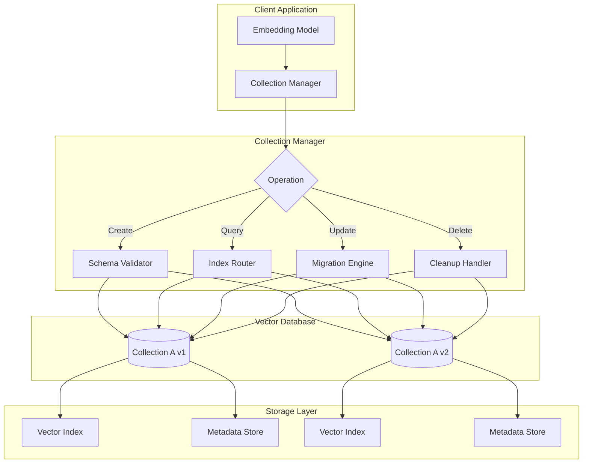
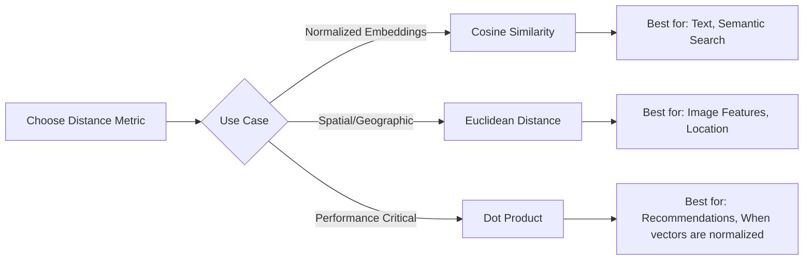
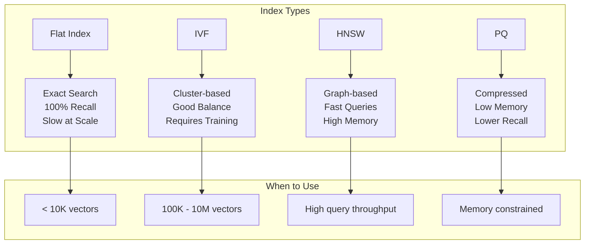
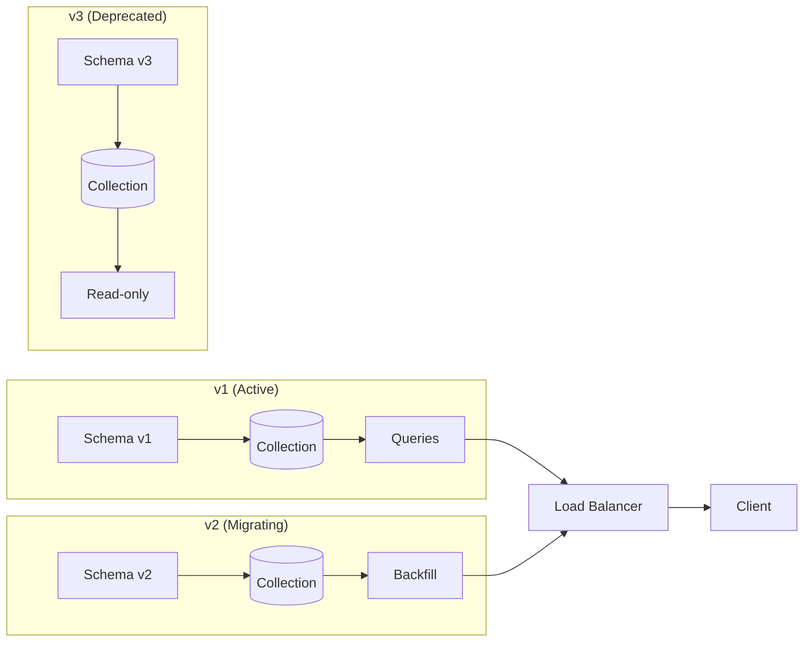
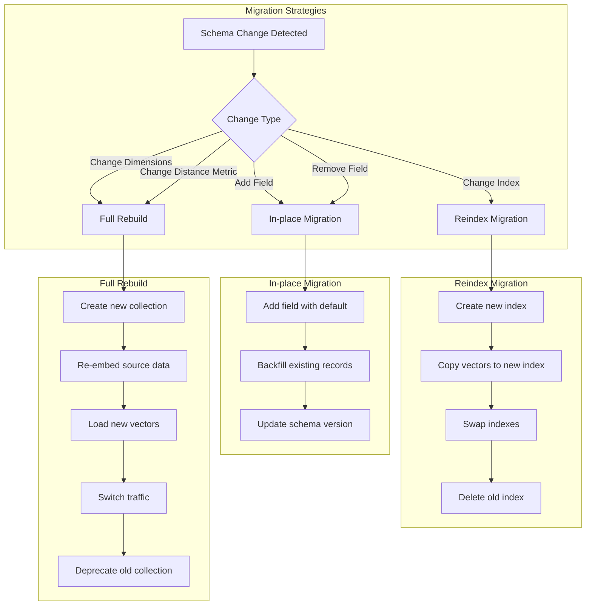
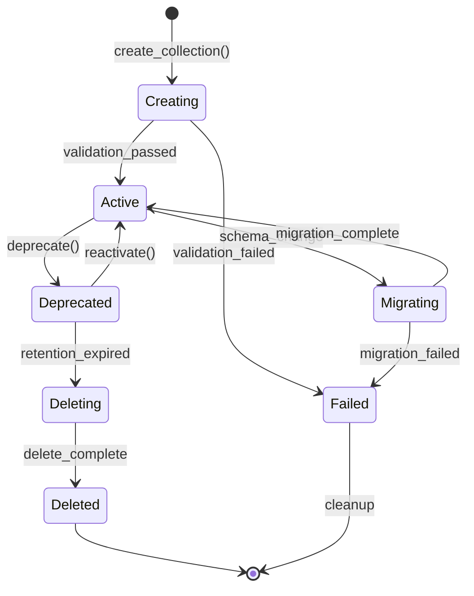
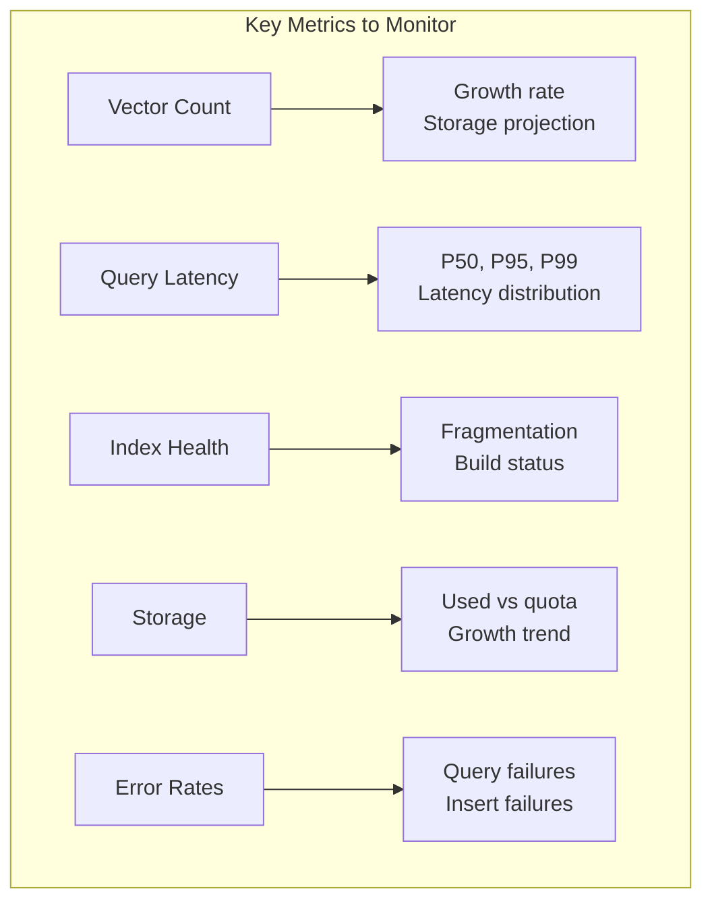

# How to Build Collection Management

Author: [nawazdhandala](https://github.com/nawazdhandala)

Tags: Vector Database, Collection Management, Schema Design, Data Organization

Description: Learn to implement collection management for vector databases with schema design, versioning, and lifecycle management for organized vector storage.

---

> Vector databases power modern AI applications - from semantic search to recommendation engines. But without proper **collection management**, your vector data becomes a disorganized mess that's hard to maintain, query, and scale.

A **collection** in a vector database is analogous to a table in a relational database. It holds vectors (embeddings) along with their metadata, defines the schema, and controls how similarity search operates. This guide covers everything you need to build robust collection management - from schema design to versioning, migrations, and cleanup.

---

## Table of Contents

1. What is a Collection?
2. Collection Architecture Overview
3. Schema Design Principles
4. Creating Collections
5. Index Configuration
6. Collection Versioning
7. Migration Strategies
8. Lifecycle Management
9. Cleanup and Maintenance
10. Best Practices
11. Common Pitfalls

---

## 1. What is a Collection?

A collection is the fundamental organizational unit in a vector database. It stores:

| Component | Description |
|-----------|-------------|
| Vectors | The numerical embeddings (e.g., 768-dimensional arrays from BERT) |
| Metadata | Structured fields attached to each vector (e.g., title, category, timestamp) |
| Schema | The definition of vector dimensions and metadata field types |
| Index | The data structure enabling fast similarity search (e.g., HNSW, IVF) |

Think of collections as purpose-specific containers. You might have:
- `product_embeddings` - for e-commerce search
- `document_chunks` - for RAG applications
- `user_preferences` - for recommendation systems

Each collection has its own schema, index configuration, and lifecycle.

---

## 2. Collection Architecture Overview

Here is how collection management fits into the overall vector database architecture:



The collection manager acts as an abstraction layer that handles:
- Schema validation before writes
- Routing queries to the correct collection version
- Coordinating migrations between versions
- Managing cleanup of deprecated collections

---

## 3. Schema Design Principles

A well-designed schema prevents headaches down the road. Consider these principles:

### 3.1 Define Clear Vector Specifications

```python
# Schema definition example
collection_schema = {
    "name": "document_embeddings",
    "vector_config": {
        "dimensions": 1536,  # Must match your embedding model
        "distance_metric": "cosine",  # cosine, euclidean, or dot_product
        "precision": "float32"  # float32, float16, or int8
    },
    "metadata_schema": {
        "document_id": {"type": "string", "indexed": True},
        "title": {"type": "string", "indexed": True},
        "category": {"type": "string", "indexed": True, "filterable": True},
        "created_at": {"type": "datetime", "indexed": True},
        "word_count": {"type": "integer", "indexed": False},
        "tags": {"type": "array[string]", "filterable": True}
    }
}
```

### 3.2 Choose the Right Distance Metric



| Metric | Best For | Notes |
|--------|----------|-------|
| Cosine | Text embeddings, semantic search | Measures angle, ignores magnitude |
| Euclidean | Image features, spatial data | Measures actual distance |
| Dot Product | Recommendations, pre-normalized vectors | Fastest computation |

### 3.3 Metadata Field Guidelines

- **Index filterable fields**: Fields you filter on should be indexed
- **Avoid high-cardinality indexes**: Don't index fields with millions of unique values
- **Use appropriate types**: Datetime for timestamps, not strings
- **Plan for filtering**: Decide upfront which fields need filter support

---

## 4. Creating Collections

Here is a complete collection creation implementation:

```python
from dataclasses import dataclass
from typing import Dict, List, Optional, Any
from enum import Enum
import hashlib
import json
from datetime import datetime

class DistanceMetric(Enum):
    COSINE = "cosine"
    EUCLIDEAN = "euclidean"
    DOT_PRODUCT = "dot_product"

class FieldType(Enum):
    STRING = "string"
    INTEGER = "integer"
    FLOAT = "float"
    BOOLEAN = "boolean"
    DATETIME = "datetime"
    ARRAY_STRING = "array[string]"
    ARRAY_INTEGER = "array[integer]"

@dataclass
class VectorConfig:
    dimensions: int
    distance_metric: DistanceMetric
    precision: str = "float32"

    def validate(self):
        if self.dimensions <= 0:
            raise ValueError("Dimensions must be positive")
        if self.dimensions > 4096:
            raise ValueError("Dimensions exceeds maximum (4096)")
        if self.precision not in ["float32", "float16", "int8"]:
            raise ValueError(f"Invalid precision: {self.precision}")

@dataclass
class MetadataField:
    name: str
    field_type: FieldType
    indexed: bool = False
    filterable: bool = False
    required: bool = False

class CollectionSchema:
    def __init__(
        self,
        name: str,
        vector_config: VectorConfig,
        metadata_fields: List[MetadataField],
        description: str = ""
    ):
        self.name = name
        self.vector_config = vector_config
        self.metadata_fields = metadata_fields
        self.description = description
        self.version = 1
        self.created_at = datetime.utcnow()

    def validate(self) -> List[str]:
        """Validate the schema and return any errors."""
        errors = []

        # Validate name
        if not self.name or not self.name.replace("_", "").isalnum():
            errors.append("Collection name must be alphanumeric with underscores")

        # Validate vector config
        try:
            self.vector_config.validate()
        except ValueError as e:
            errors.append(str(e))

        # Validate metadata fields
        field_names = set()
        for field in self.metadata_fields:
            if field.name in field_names:
                errors.append(f"Duplicate field name: {field.name}")
            field_names.add(field.name)

            if field.filterable and not field.indexed:
                errors.append(f"Field {field.name}: filterable requires indexed=True")

        return errors

    def get_schema_hash(self) -> str:
        """Generate a hash of the schema for version comparison."""
        schema_dict = {
            "name": self.name,
            "vector_dimensions": self.vector_config.dimensions,
            "distance_metric": self.vector_config.distance_metric.value,
            "fields": [
                {
                    "name": f.name,
                    "type": f.field_type.value,
                    "indexed": f.indexed
                }
                for f in sorted(self.metadata_fields, key=lambda x: x.name)
            ]
        }
        return hashlib.sha256(
            json.dumps(schema_dict, sort_keys=True).encode()
        ).hexdigest()[:12]

    def to_dict(self) -> Dict[str, Any]:
        """Serialize schema to dictionary."""
        return {
            "name": self.name,
            "version": self.version,
            "description": self.description,
            "vector_config": {
                "dimensions": self.vector_config.dimensions,
                "distance_metric": self.vector_config.distance_metric.value,
                "precision": self.vector_config.precision
            },
            "metadata_fields": [
                {
                    "name": f.name,
                    "type": f.field_type.value,
                    "indexed": f.indexed,
                    "filterable": f.filterable,
                    "required": f.required
                }
                for f in self.metadata_fields
            ],
            "schema_hash": self.get_schema_hash(),
            "created_at": self.created_at.isoformat()
        }
```

### 4.1 Collection Manager Implementation

```python
from typing import Dict, Optional
import logging

logger = logging.getLogger(__name__)

class CollectionManager:
    def __init__(self, vector_db_client):
        self.client = vector_db_client
        self.schemas: Dict[str, CollectionSchema] = {}
        self._load_existing_schemas()

    def _load_existing_schemas(self):
        """Load schemas from the database on initialization."""
        existing = self.client.list_collections()
        for collection_name in existing:
            schema_data = self.client.get_collection_metadata(collection_name)
            if schema_data:
                self.schemas[collection_name] = self._deserialize_schema(schema_data)

    def create_collection(
        self,
        schema: CollectionSchema,
        if_not_exists: bool = True
    ) -> bool:
        """Create a new collection with the given schema."""

        # Validate schema
        errors = schema.validate()
        if errors:
            raise ValueError(f"Schema validation failed: {errors}")

        # Check if collection exists
        if schema.name in self.schemas:
            if if_not_exists:
                logger.info(f"Collection {schema.name} already exists, skipping")
                return False
            raise ValueError(f"Collection {schema.name} already exists")

        # Create the collection in the database
        try:
            self.client.create_collection(
                name=schema.name,
                dimension=schema.vector_config.dimensions,
                metric=schema.vector_config.distance_metric.value,
                metadata=schema.to_dict()
            )

            # Create indexes for metadata fields
            for field in schema.metadata_fields:
                if field.indexed:
                    self.client.create_index(
                        collection=schema.name,
                        field=field.name,
                        field_type=field.field_type.value
                    )

            self.schemas[schema.name] = schema
            logger.info(f"Created collection {schema.name} (v{schema.version})")
            return True

        except Exception as e:
            logger.error(f"Failed to create collection {schema.name}: {e}")
            raise

    def get_collection(self, name: str) -> Optional[CollectionSchema]:
        """Get the schema for a collection."""
        return self.schemas.get(name)

    def list_collections(self) -> List[str]:
        """List all collection names."""
        return list(self.schemas.keys())

    def delete_collection(self, name: str, confirm: bool = False) -> bool:
        """Delete a collection. Requires explicit confirmation."""
        if not confirm:
            raise ValueError("Must set confirm=True to delete a collection")

        if name not in self.schemas:
            raise ValueError(f"Collection {name} does not exist")

        try:
            self.client.delete_collection(name)
            del self.schemas[name]
            logger.info(f"Deleted collection {name}")
            return True
        except Exception as e:
            logger.error(f"Failed to delete collection {name}: {e}")
            raise
```

---

## 5. Index Configuration

The index determines how vectors are organized for similarity search. Different indexes offer different trade-offs:



### 5.1 Index Configuration Code

```python
from dataclasses import dataclass
from typing import Optional
from enum import Enum

class IndexType(Enum):
    FLAT = "flat"
    IVF_FLAT = "ivf_flat"
    IVF_PQ = "ivf_pq"
    HNSW = "hnsw"

@dataclass
class HNSWConfig:
    m: int = 16  # Number of connections per layer
    ef_construction: int = 200  # Size of dynamic candidate list during construction
    ef_search: int = 100  # Size of dynamic candidate list during search

@dataclass
class IVFConfig:
    nlist: int = 100  # Number of clusters
    nprobe: int = 10  # Number of clusters to search
    pq_segments: Optional[int] = None  # For IVF_PQ: number of sub-vectors

@dataclass
class IndexConfig:
    index_type: IndexType
    hnsw_config: Optional[HNSWConfig] = None
    ivf_config: Optional[IVFConfig] = None

    @classmethod
    def for_small_collection(cls) -> "IndexConfig":
        """Flat index for collections under 10K vectors."""
        return cls(index_type=IndexType.FLAT)

    @classmethod
    def for_balanced_performance(cls, vector_count: int) -> "IndexConfig":
        """HNSW index tuned for the expected vector count."""
        # Adjust M based on dimensionality and recall requirements
        m = 16 if vector_count < 100000 else 32
        ef_construction = min(200, vector_count // 100)

        return cls(
            index_type=IndexType.HNSW,
            hnsw_config=HNSWConfig(
                m=m,
                ef_construction=max(100, ef_construction),
                ef_search=100
            )
        )

    @classmethod
    def for_memory_constrained(cls, vector_count: int) -> "IndexConfig":
        """IVF-PQ index for large collections with memory limits."""
        nlist = int(vector_count ** 0.5)  # sqrt(n) is a good starting point

        return cls(
            index_type=IndexType.IVF_PQ,
            ivf_config=IVFConfig(
                nlist=min(nlist, 4096),
                nprobe=min(nlist // 10, 128),
                pq_segments=8
            )
        )

def configure_index(
    collection_manager: CollectionManager,
    collection_name: str,
    index_config: IndexConfig
):
    """Apply index configuration to a collection."""
    schema = collection_manager.get_collection(collection_name)
    if not schema:
        raise ValueError(f"Collection {collection_name} not found")

    client = collection_manager.client

    if index_config.index_type == IndexType.HNSW:
        config = index_config.hnsw_config
        client.create_vector_index(
            collection=collection_name,
            index_type="hnsw",
            params={
                "m": config.m,
                "ef_construction": config.ef_construction
            }
        )
        # Set search parameters
        client.set_search_params(
            collection=collection_name,
            params={"ef": config.ef_search}
        )

    elif index_config.index_type == IndexType.IVF_PQ:
        config = index_config.ivf_config
        # IVF indexes require training on sample data
        sample_vectors = client.sample_vectors(collection_name, count=config.nlist * 50)
        client.create_vector_index(
            collection=collection_name,
            index_type="ivf_pq",
            params={
                "nlist": config.nlist,
                "m": config.pq_segments
            },
            training_data=sample_vectors
        )
        client.set_search_params(
            collection=collection_name,
            params={"nprobe": config.nprobe}
        )

    logger.info(f"Configured {index_config.index_type.value} index for {collection_name}")
```

---

## 6. Collection Versioning

Versioning is essential for managing schema changes without breaking existing applications. Here is a versioning system:



### 6.1 Version Registry

```python
from dataclasses import dataclass, field
from typing import Dict, List, Optional
from datetime import datetime
from enum import Enum
import json

class VersionStatus(Enum):
    ACTIVE = "active"  # Receiving writes and reads
    MIGRATING = "migrating"  # Being populated, limited reads
    DEPRECATED = "deprecated"  # Read-only, scheduled for deletion
    DELETED = "deleted"  # Soft-deleted, can be restored

@dataclass
class CollectionVersion:
    version: int
    schema_hash: str
    status: VersionStatus
    created_at: datetime
    deprecated_at: Optional[datetime] = None
    delete_after: Optional[datetime] = None
    vector_count: int = 0
    notes: str = ""

class VersionRegistry:
    def __init__(self, storage_client):
        self.storage = storage_client
        self._cache: Dict[str, List[CollectionVersion]] = {}

    def register_version(
        self,
        collection_name: str,
        schema: CollectionSchema,
        status: VersionStatus = VersionStatus.MIGRATING
    ) -> CollectionVersion:
        """Register a new version of a collection."""
        versions = self._get_versions(collection_name)

        # Determine version number
        max_version = max([v.version for v in versions], default=0)
        new_version = max_version + 1

        version_record = CollectionVersion(
            version=new_version,
            schema_hash=schema.get_schema_hash(),
            status=status,
            created_at=datetime.utcnow()
        )

        # Store version record
        self._save_version(collection_name, version_record)

        return version_record

    def get_active_version(self, collection_name: str) -> Optional[CollectionVersion]:
        """Get the currently active version for a collection."""
        versions = self._get_versions(collection_name)
        active = [v for v in versions if v.status == VersionStatus.ACTIVE]
        return active[0] if active else None

    def promote_version(self, collection_name: str, version: int) -> bool:
        """Promote a version to active status."""
        versions = self._get_versions(collection_name)

        # Demote current active version
        for v in versions:
            if v.status == VersionStatus.ACTIVE:
                v.status = VersionStatus.DEPRECATED
                v.deprecated_at = datetime.utcnow()
                self._save_version(collection_name, v)

        # Promote specified version
        target = next((v for v in versions if v.version == version), None)
        if not target:
            raise ValueError(f"Version {version} not found")

        target.status = VersionStatus.ACTIVE
        self._save_version(collection_name, target)

        logger.info(f"Promoted {collection_name} v{version} to active")
        return True

    def deprecate_version(
        self,
        collection_name: str,
        version: int,
        delete_after_days: int = 30
    ) -> bool:
        """Mark a version as deprecated with scheduled deletion."""
        versions = self._get_versions(collection_name)
        target = next((v for v in versions if v.version == version), None)

        if not target:
            raise ValueError(f"Version {version} not found")

        if target.status == VersionStatus.ACTIVE:
            raise ValueError("Cannot deprecate active version")

        target.status = VersionStatus.DEPRECATED
        target.deprecated_at = datetime.utcnow()
        target.delete_after = datetime.utcnow() + timedelta(days=delete_after_days)
        self._save_version(collection_name, target)

        return True

    def get_version_history(self, collection_name: str) -> List[Dict]:
        """Get the version history for reporting."""
        versions = self._get_versions(collection_name)
        return [
            {
                "version": v.version,
                "status": v.status.value,
                "schema_hash": v.schema_hash,
                "created_at": v.created_at.isoformat(),
                "deprecated_at": v.deprecated_at.isoformat() if v.deprecated_at else None,
                "vector_count": v.vector_count
            }
            for v in sorted(versions, key=lambda x: x.version, reverse=True)
        ]

    def _get_versions(self, collection_name: str) -> List[CollectionVersion]:
        if collection_name not in self._cache:
            self._cache[collection_name] = self.storage.load_versions(collection_name)
        return self._cache[collection_name]

    def _save_version(self, collection_name: str, version: CollectionVersion):
        self.storage.save_version(collection_name, version)
        # Invalidate cache
        if collection_name in self._cache:
            del self._cache[collection_name]
```

---

## 7. Migration Strategies

When schemas change, you need to migrate data safely. Here are the primary strategies:



### 7.1 Migration Engine

```python
from abc import ABC, abstractmethod
from typing import List, Callable, Optional, Generator
from dataclasses import dataclass
import time

@dataclass
class MigrationPlan:
    source_collection: str
    source_version: int
    target_collection: str
    target_version: int
    strategy: str
    estimated_records: int
    requires_reembedding: bool

class MigrationStrategy(ABC):
    @abstractmethod
    def can_handle(self, old_schema: CollectionSchema, new_schema: CollectionSchema) -> bool:
        pass

    @abstractmethod
    def execute(
        self,
        client,
        old_schema: CollectionSchema,
        new_schema: CollectionSchema,
        progress_callback: Optional[Callable[[int, int], None]] = None
    ) -> bool:
        pass

class AddFieldMigration(MigrationStrategy):
    """Handles adding new metadata fields."""

    def can_handle(self, old_schema: CollectionSchema, new_schema: CollectionSchema) -> bool:
        old_fields = {f.name for f in old_schema.metadata_fields}
        new_fields = {f.name for f in new_schema.metadata_fields}

        # Can handle if only new fields are added
        return old_fields.issubset(new_fields) and \
               old_schema.vector_config.dimensions == new_schema.vector_config.dimensions

    def execute(
        self,
        client,
        old_schema: CollectionSchema,
        new_schema: CollectionSchema,
        progress_callback: Optional[Callable[[int, int], None]] = None
    ) -> bool:
        old_field_names = {f.name for f in old_schema.metadata_fields}
        new_fields = [f for f in new_schema.metadata_fields if f.name not in old_field_names]

        for field in new_fields:
            # Add field to schema
            client.add_field(
                collection=old_schema.name,
                field_name=field.name,
                field_type=field.field_type.value,
                default_value=self._get_default(field.field_type)
            )

            # Create index if needed
            if field.indexed:
                client.create_index(
                    collection=old_schema.name,
                    field=field.name,
                    field_type=field.field_type.value
                )

        return True

    def _get_default(self, field_type: FieldType):
        defaults = {
            FieldType.STRING: "",
            FieldType.INTEGER: 0,
            FieldType.FLOAT: 0.0,
            FieldType.BOOLEAN: False,
            FieldType.ARRAY_STRING: [],
            FieldType.ARRAY_INTEGER: []
        }
        return defaults.get(field_type, None)

class ReindexMigration(MigrationStrategy):
    """Handles index configuration changes."""

    def can_handle(self, old_schema: CollectionSchema, new_schema: CollectionSchema) -> bool:
        # Same vectors, different index configuration
        return old_schema.vector_config.dimensions == new_schema.vector_config.dimensions

    def execute(
        self,
        client,
        old_schema: CollectionSchema,
        new_schema: CollectionSchema,
        progress_callback: Optional[Callable[[int, int], None]] = None
    ) -> bool:
        collection_name = old_schema.name
        temp_collection = f"{collection_name}_reindex_temp"

        # Create temporary collection with new schema
        client.create_collection(
            name=temp_collection,
            dimension=new_schema.vector_config.dimensions,
            metric=new_schema.vector_config.distance_metric.value
        )

        # Copy data in batches
        total = client.count(collection_name)
        batch_size = 1000
        copied = 0

        for batch in self._iter_batches(client, collection_name, batch_size):
            client.insert(temp_collection, batch)
            copied += len(batch)
            if progress_callback:
                progress_callback(copied, total)

        # Atomic swap
        client.rename_collection(collection_name, f"{collection_name}_old")
        client.rename_collection(temp_collection, collection_name)
        client.delete_collection(f"{collection_name}_old")

        return True

    def _iter_batches(self, client, collection: str, batch_size: int) -> Generator:
        offset = 0
        while True:
            batch = client.fetch(collection, limit=batch_size, offset=offset)
            if not batch:
                break
            yield batch
            offset += len(batch)

class FullRebuildMigration(MigrationStrategy):
    """Handles dimension changes requiring re-embedding."""

    def __init__(self, embedding_fn: Callable[[str], List[float]]):
        self.embedding_fn = embedding_fn

    def can_handle(self, old_schema: CollectionSchema, new_schema: CollectionSchema) -> bool:
        # Required when dimensions change
        return old_schema.vector_config.dimensions != new_schema.vector_config.dimensions

    def execute(
        self,
        client,
        old_schema: CollectionSchema,
        new_schema: CollectionSchema,
        progress_callback: Optional[Callable[[int, int], None]] = None
    ) -> bool:
        old_collection = old_schema.name
        new_collection = f"{old_schema.name}_v{new_schema.version}"

        # Create new collection
        client.create_collection(
            name=new_collection,
            dimension=new_schema.vector_config.dimensions,
            metric=new_schema.vector_config.distance_metric.value
        )

        # Re-embed and insert
        total = client.count(old_collection)
        batch_size = 100
        processed = 0

        for batch in self._iter_batches(client, old_collection, batch_size):
            new_vectors = []
            for record in batch:
                # Re-embed the source text
                source_text = record.get("metadata", {}).get("source_text", "")
                if source_text:
                    new_embedding = self.embedding_fn(source_text)
                    new_vectors.append({
                        "id": record["id"],
                        "vector": new_embedding,
                        "metadata": record.get("metadata", {})
                    })

            if new_vectors:
                client.insert(new_collection, new_vectors)

            processed += len(batch)
            if progress_callback:
                progress_callback(processed, total)

        return True

    def _iter_batches(self, client, collection: str, batch_size: int) -> Generator:
        offset = 0
        while True:
            batch = client.fetch(collection, limit=batch_size, offset=offset)
            if not batch:
                break
            yield batch
            offset += len(batch)

class MigrationEngine:
    def __init__(self, client, version_registry: VersionRegistry):
        self.client = client
        self.version_registry = version_registry
        self.strategies: List[MigrationStrategy] = []

    def register_strategy(self, strategy: MigrationStrategy):
        self.strategies.append(strategy)

    def plan_migration(
        self,
        old_schema: CollectionSchema,
        new_schema: CollectionSchema
    ) -> MigrationPlan:
        """Create a migration plan for the schema change."""
        for strategy in self.strategies:
            if strategy.can_handle(old_schema, new_schema):
                requires_reembedding = isinstance(strategy, FullRebuildMigration)

                return MigrationPlan(
                    source_collection=old_schema.name,
                    source_version=old_schema.version,
                    target_collection=new_schema.name,
                    target_version=new_schema.version,
                    strategy=strategy.__class__.__name__,
                    estimated_records=self.client.count(old_schema.name),
                    requires_reembedding=requires_reembedding
                )

        raise ValueError("No migration strategy can handle this schema change")

    def execute_migration(
        self,
        old_schema: CollectionSchema,
        new_schema: CollectionSchema,
        progress_callback: Optional[Callable[[int, int], None]] = None
    ) -> bool:
        """Execute the migration."""
        for strategy in self.strategies:
            if strategy.can_handle(old_schema, new_schema):
                # Register new version
                new_version = self.version_registry.register_version(
                    new_schema.name,
                    new_schema,
                    VersionStatus.MIGRATING
                )

                try:
                    success = strategy.execute(
                        self.client,
                        old_schema,
                        new_schema,
                        progress_callback
                    )

                    if success:
                        # Promote new version
                        self.version_registry.promote_version(
                            new_schema.name,
                            new_version.version
                        )
                        return True

                except Exception as e:
                    logger.error(f"Migration failed: {e}")
                    # Mark version as failed
                    self.version_registry.deprecate_version(
                        new_schema.name,
                        new_version.version,
                        delete_after_days=1
                    )
                    raise

        return False
```

---

## 8. Lifecycle Management

Collections have a lifecycle that needs to be managed:



### 8.1 Lifecycle Manager

```python
from datetime import datetime, timedelta
from typing import Dict, List, Optional
import threading
import time

class LifecycleManager:
    def __init__(
        self,
        collection_manager: CollectionManager,
        version_registry: VersionRegistry,
        check_interval_seconds: int = 3600
    ):
        self.collection_manager = collection_manager
        self.version_registry = version_registry
        self.check_interval = check_interval_seconds
        self._stop_event = threading.Event()
        self._thread: Optional[threading.Thread] = None

    def start(self):
        """Start the lifecycle management background thread."""
        self._thread = threading.Thread(target=self._run_lifecycle_checks, daemon=True)
        self._thread.start()
        logger.info("Lifecycle manager started")

    def stop(self):
        """Stop the lifecycle management background thread."""
        self._stop_event.set()
        if self._thread:
            self._thread.join(timeout=10)
        logger.info("Lifecycle manager stopped")

    def _run_lifecycle_checks(self):
        while not self._stop_event.is_set():
            try:
                self._check_deprecations()
                self._check_deletions()
                self._check_storage_thresholds()
            except Exception as e:
                logger.error(f"Lifecycle check failed: {e}")

            self._stop_event.wait(self.check_interval)

    def _check_deprecations(self):
        """Check for collections that should be deprecated."""
        for collection_name in self.collection_manager.list_collections():
            history = self.version_registry.get_version_history(collection_name)

            # Find versions that have been superseded for more than 7 days
            active_version = None
            for version_info in history:
                if version_info["status"] == "active":
                    active_version = version_info["version"]
                    break

            if not active_version:
                continue

            for version_info in history:
                if version_info["status"] == "migrating":
                    # Check if migration has stalled
                    created = datetime.fromisoformat(version_info["created_at"])
                    if datetime.utcnow() - created > timedelta(days=1):
                        logger.warning(
                            f"Migration stalled for {collection_name} v{version_info['version']}"
                        )

    def _check_deletions(self):
        """Delete collections past their retention period."""
        for collection_name in self.collection_manager.list_collections():
            history = self.version_registry.get_version_history(collection_name)

            for version_info in history:
                if version_info["status"] != "deprecated":
                    continue

                deprecated_at = version_info.get("deprecated_at")
                if not deprecated_at:
                    continue

                deprecated_date = datetime.fromisoformat(deprecated_at)
                # Default 30-day retention
                if datetime.utcnow() - deprecated_date > timedelta(days=30):
                    versioned_name = f"{collection_name}_v{version_info['version']}"
                    try:
                        self.collection_manager.delete_collection(
                            versioned_name,
                            confirm=True
                        )
                        logger.info(f"Deleted deprecated collection {versioned_name}")
                    except Exception as e:
                        logger.error(f"Failed to delete {versioned_name}: {e}")

    def _check_storage_thresholds(self):
        """Alert when collections exceed storage thresholds."""
        thresholds = {
            "warning": 0.8,  # 80% of quota
            "critical": 0.95  # 95% of quota
        }

        for collection_name in self.collection_manager.list_collections():
            stats = self.collection_manager.client.get_collection_stats(collection_name)

            if not stats or "storage_used" not in stats:
                continue

            usage_ratio = stats["storage_used"] / stats.get("storage_quota", float("inf"))

            if usage_ratio >= thresholds["critical"]:
                logger.critical(
                    f"Collection {collection_name} at {usage_ratio*100:.1f}% storage capacity"
                )
            elif usage_ratio >= thresholds["warning"]:
                logger.warning(
                    f"Collection {collection_name} at {usage_ratio*100:.1f}% storage capacity"
                )
```

---

## 9. Cleanup and Maintenance

Regular maintenance keeps your vector database healthy:

```python
from datetime import datetime, timedelta
from typing import Dict, List, Optional
import logging

logger = logging.getLogger(__name__)

class MaintenanceManager:
    def __init__(self, collection_manager: CollectionManager):
        self.collection_manager = collection_manager
        self.client = collection_manager.client

    def compact_collection(self, collection_name: str) -> Dict:
        """Compact a collection to reclaim space from deleted vectors."""
        before_stats = self.client.get_collection_stats(collection_name)

        self.client.compact(collection_name)

        after_stats = self.client.get_collection_stats(collection_name)

        space_reclaimed = before_stats.get("storage_used", 0) - after_stats.get("storage_used", 0)

        return {
            "collection": collection_name,
            "space_reclaimed_bytes": space_reclaimed,
            "before_storage": before_stats.get("storage_used", 0),
            "after_storage": after_stats.get("storage_used", 0)
        }

    def vacuum_deleted(self, collection_name: str, older_than_days: int = 7) -> int:
        """Permanently remove soft-deleted vectors."""
        cutoff = datetime.utcnow() - timedelta(days=older_than_days)

        deleted_count = self.client.vacuum(
            collection=collection_name,
            deleted_before=cutoff
        )

        logger.info(f"Vacuumed {deleted_count} vectors from {collection_name}")
        return deleted_count

    def rebuild_index(self, collection_name: str) -> bool:
        """Rebuild the vector index for optimal performance."""
        logger.info(f"Starting index rebuild for {collection_name}")

        # This can be a long operation
        self.client.rebuild_index(collection_name)

        logger.info(f"Index rebuild complete for {collection_name}")
        return True

    def analyze_collection(self, collection_name: str) -> Dict:
        """Analyze collection for potential issues."""
        stats = self.client.get_collection_stats(collection_name)
        schema = self.collection_manager.get_collection(collection_name)

        issues = []
        recommendations = []

        # Check vector count vs index type
        vector_count = stats.get("vector_count", 0)
        index_type = stats.get("index_type", "unknown")

        if vector_count > 100000 and index_type == "flat":
            issues.append("Flat index with >100K vectors - queries will be slow")
            recommendations.append("Consider migrating to HNSW or IVF index")

        if vector_count < 1000 and index_type in ["hnsw", "ivf"]:
            recommendations.append("Small collection - flat index may be more efficient")

        # Check for unused indexes
        for field in schema.metadata_fields:
            if field.indexed:
                field_stats = self.client.get_field_stats(collection_name, field.name)
                if field_stats.get("query_count", 0) == 0:
                    recommendations.append(f"Field '{field.name}' is indexed but never queried")

        # Check for hot metadata fields that aren't indexed
        query_patterns = self.client.get_query_patterns(collection_name)
        for pattern in query_patterns:
            field_name = pattern.get("filter_field")
            if field_name:
                field = next((f for f in schema.metadata_fields if f.name == field_name), None)
                if field and not field.indexed:
                    recommendations.append(f"Field '{field_name}' frequently filtered but not indexed")

        return {
            "collection": collection_name,
            "vector_count": vector_count,
            "storage_bytes": stats.get("storage_used", 0),
            "index_type": index_type,
            "issues": issues,
            "recommendations": recommendations
        }

    def cleanup_orphaned_vectors(self, collection_name: str) -> int:
        """Remove vectors without valid metadata references."""
        orphaned = self.client.find_orphaned(collection_name)

        if orphaned:
            self.client.delete(collection_name, ids=orphaned)
            logger.info(f"Removed {len(orphaned)} orphaned vectors from {collection_name}")

        return len(orphaned)

    def run_full_maintenance(self, collection_name: str) -> Dict:
        """Run all maintenance tasks on a collection."""
        results = {
            "collection": collection_name,
            "started_at": datetime.utcnow().isoformat(),
            "tasks": {}
        }

        # 1. Analyze first
        analysis = self.analyze_collection(collection_name)
        results["tasks"]["analyze"] = analysis

        # 2. Cleanup orphaned vectors
        orphaned_count = self.cleanup_orphaned_vectors(collection_name)
        results["tasks"]["cleanup_orphaned"] = {"removed": orphaned_count}

        # 3. Vacuum deleted
        vacuumed_count = self.vacuum_deleted(collection_name)
        results["tasks"]["vacuum"] = {"removed": vacuumed_count}

        # 4. Compact
        compact_result = self.compact_collection(collection_name)
        results["tasks"]["compact"] = compact_result

        # 5. Rebuild index if needed
        if analysis["issues"]:
            self.rebuild_index(collection_name)
            results["tasks"]["rebuild_index"] = {"completed": True}

        results["completed_at"] = datetime.utcnow().isoformat()
        return results
```

### 9.1 Scheduled Maintenance

```python
import schedule
import time
from typing import List

class MaintenanceScheduler:
    def __init__(self, maintenance_manager: MaintenanceManager):
        self.maintenance_manager = maintenance_manager
        self.collections: List[str] = []

    def register_collection(self, collection_name: str):
        self.collections.append(collection_name)

    def setup_schedule(self):
        # Daily compaction at 2 AM
        schedule.every().day.at("02:00").do(self._run_daily_maintenance)

        # Weekly full maintenance on Sunday at 3 AM
        schedule.every().sunday.at("03:00").do(self._run_weekly_maintenance)

        # Hourly health check
        schedule.every().hour.do(self._run_health_check)

    def _run_daily_maintenance(self):
        for collection in self.collections:
            try:
                self.maintenance_manager.vacuum_deleted(collection)
                self.maintenance_manager.compact_collection(collection)
            except Exception as e:
                logger.error(f"Daily maintenance failed for {collection}: {e}")

    def _run_weekly_maintenance(self):
        for collection in self.collections:
            try:
                self.maintenance_manager.run_full_maintenance(collection)
            except Exception as e:
                logger.error(f"Weekly maintenance failed for {collection}: {e}")

    def _run_health_check(self):
        for collection in self.collections:
            try:
                analysis = self.maintenance_manager.analyze_collection(collection)
                if analysis["issues"]:
                    logger.warning(f"Health issues in {collection}: {analysis['issues']}")
            except Exception as e:
                logger.error(f"Health check failed for {collection}: {e}")

    def run(self):
        self.setup_schedule()
        while True:
            schedule.run_pending()
            time.sleep(60)
```

---

## 10. Best Practices

### 10.1 Naming Conventions

```python
# Good collection names
GOOD_NAMES = [
    "product_embeddings_v1",
    "document_chunks",
    "user_preferences_prod",
    "faq_semantic_search"
]

# Bad collection names
BAD_NAMES = [
    "test",  # Too generic
    "my-collection",  # Hyphens can cause issues
    "Collection 1",  # Spaces are problematic
    "embeddings",  # Not descriptive enough
]

def validate_collection_name(name: str) -> bool:
    """Validate collection name follows conventions."""
    import re

    # Must be lowercase alphanumeric with underscores
    if not re.match(r'^[a-z][a-z0-9_]*$', name):
        return False

    # Must be between 3 and 64 characters
    if len(name) < 3 or len(name) > 64:
        return False

    # Must not end with underscore
    if name.endswith('_'):
        return False

    return True
```

### 10.2 Monitoring Checklist



### 10.3 Configuration Template

```yaml
# collection-config.yaml
collections:
  - name: product_embeddings
    vector_config:
      dimensions: 768
      distance_metric: cosine
      precision: float32

    index_config:
      type: hnsw
      params:
        m: 16
        ef_construction: 200
        ef_search: 100

    metadata_schema:
      - name: product_id
        type: string
        indexed: true
        required: true
      - name: category
        type: string
        indexed: true
        filterable: true
      - name: price
        type: float
        indexed: true
        filterable: true
      - name: updated_at
        type: datetime
        indexed: true

    lifecycle:
      retention_days: 90
      auto_compact: true
      compact_threshold: 0.2  # Compact when 20% deleted

    maintenance:
      vacuum_schedule: "0 2 * * *"  # Daily at 2 AM
      analyze_schedule: "0 3 * * 0"  # Weekly on Sunday
```

---

## 11. Common Pitfalls

### 11.1 Dimension Mismatch

```python
# WRONG: Creating vectors with wrong dimensions
collection_schema = CollectionSchema(
    name="documents",
    vector_config=VectorConfig(dimensions=768, distance_metric=DistanceMetric.COSINE),
    metadata_fields=[]
)

# But using an embedding model that outputs 1536 dimensions
embedding = get_embedding(text)  # Returns 1536-dimensional vector
client.insert(collection_schema.name, [{"vector": embedding}])  # FAILS!

# CORRECT: Always verify dimensions match
def safe_insert(collection_name: str, text: str, metadata: Dict):
    schema = collection_manager.get_collection(collection_name)
    embedding = get_embedding(text)

    if len(embedding) != schema.vector_config.dimensions:
        raise ValueError(
            f"Embedding dimensions ({len(embedding)}) do not match "
            f"collection dimensions ({schema.vector_config.dimensions})"
        )

    client.insert(collection_name, [{"vector": embedding, "metadata": metadata}])
```

### 11.2 Missing Index Updates

```python
# WRONG: Adding filterable field without index
new_schema = CollectionSchema(
    name="products",
    vector_config=VectorConfig(dimensions=768, distance_metric=DistanceMetric.COSINE),
    metadata_fields=[
        MetadataField(name="category", field_type=FieldType.STRING, filterable=True)
        # Missing indexed=True!
    ]
)

# CORRECT: Filterable fields must be indexed
new_schema = CollectionSchema(
    name="products",
    vector_config=VectorConfig(dimensions=768, distance_metric=DistanceMetric.COSINE),
    metadata_fields=[
        MetadataField(
            name="category",
            field_type=FieldType.STRING,
            indexed=True,  # Required for filtering
            filterable=True
        )
    ]
)
```

### 11.3 Ignoring Migration Requirements

```python
# WRONG: Changing dimensions without migration
old_schema.vector_config.dimensions = 1536  # Just changing the value
# Existing vectors are still 768-dimensional!

# CORRECT: Use migration engine for dimension changes
migration_engine = MigrationEngine(client, version_registry)
migration_engine.register_strategy(FullRebuildMigration(embedding_fn=get_embedding))

new_schema = CollectionSchema(
    name="documents",
    vector_config=VectorConfig(dimensions=1536, distance_metric=DistanceMetric.COSINE),
    metadata_fields=old_schema.metadata_fields
)
new_schema.version = old_schema.version + 1

# This will re-embed all documents
migration_engine.execute_migration(old_schema, new_schema)
```

### 11.4 No Backup Before Destructive Operations

```python
# WRONG: Deleting without backup
collection_manager.delete_collection("important_data", confirm=True)  # Data gone!

# CORRECT: Always backup before destructive operations
def safe_delete_collection(collection_name: str, backup_path: str):
    # 1. Create backup
    backup_manager.export_collection(collection_name, backup_path)
    logger.info(f"Backup created at {backup_path}")

    # 2. Verify backup
    if not backup_manager.verify_backup(backup_path):
        raise ValueError("Backup verification failed")

    # 3. Deprecate first (allows recovery window)
    version_registry.deprecate_version(
        collection_name,
        version=current_version,
        delete_after_days=7
    )

    # 4. Actual deletion happens via lifecycle manager after retention period
```

---

## Summary

Building robust collection management for vector databases requires attention to several key areas:

| Area | Key Considerations |
|------|-------------------|
| Schema Design | Match embedding model dimensions, choose appropriate distance metrics, plan metadata fields upfront |
| Index Configuration | Balance recall vs performance, tune parameters based on collection size |
| Versioning | Track schema changes, support rollback, maintain version history |
| Migrations | Choose appropriate strategy, handle dimension changes carefully, test before production |
| Lifecycle | Automate deprecation, enforce retention policies, monitor health |
| Maintenance | Regular compaction, index rebuilds, cleanup orphaned data |

Collection management is the foundation of a healthy vector database deployment. Invest time in getting it right, and you will avoid painful migrations and data loss down the road.

---

## See Also

- [Vector Database Fundamentals](/blog/post/vector-database-fundamentals/) - Understanding the basics of vector storage and retrieval
- [Embedding Model Selection Guide](/blog/post/embedding-model-selection/) - Choosing the right embedding model for your use case
- [Scaling Vector Search](/blog/post/scaling-vector-search/) - Techniques for handling millions of vectors

---

*Building AI-powered applications? [OneUptime](https://oneuptime.com) helps you monitor your vector database performance, track query latencies, and ensure your semantic search stays fast and reliable.*
