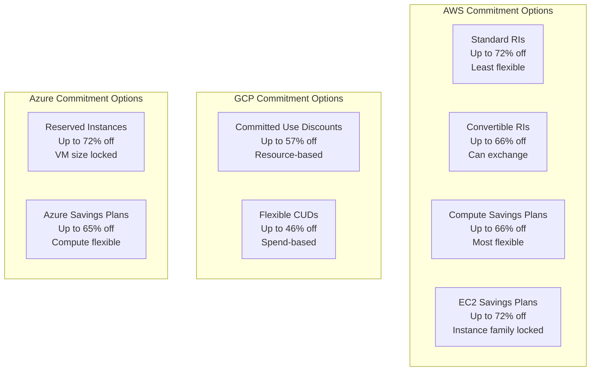
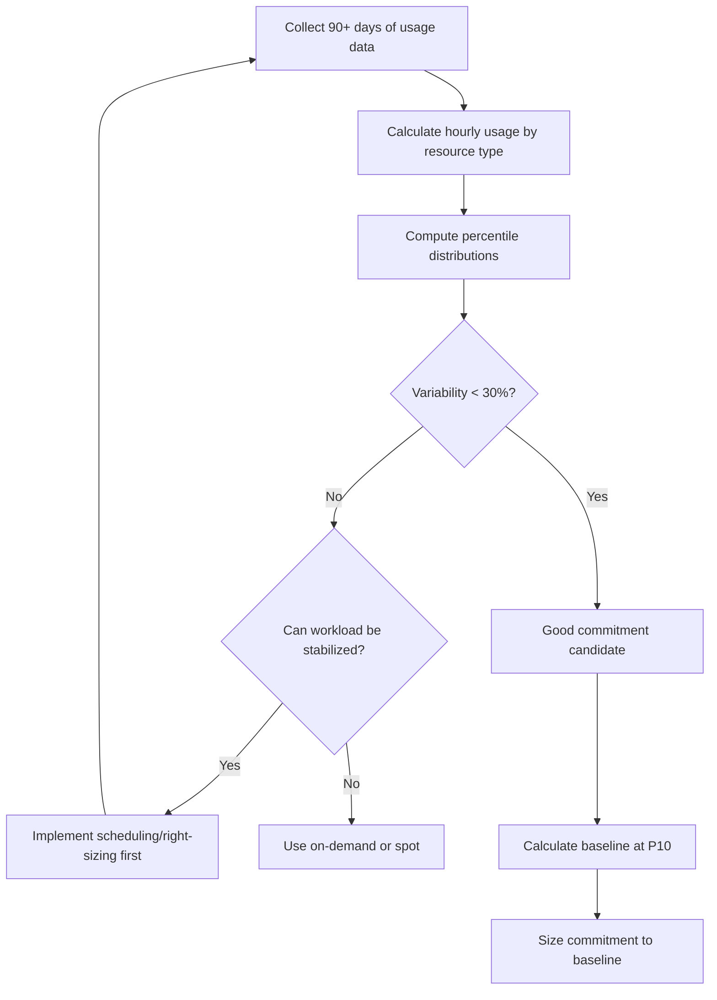
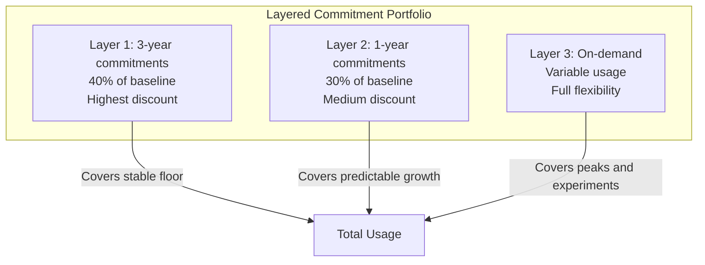
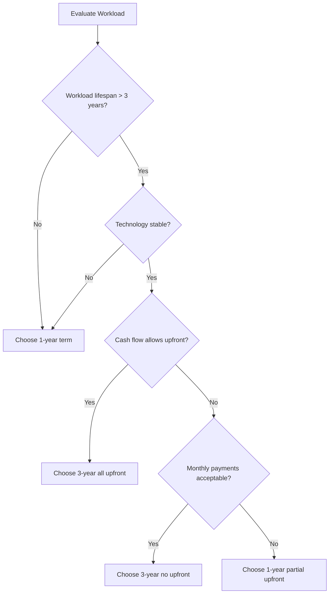
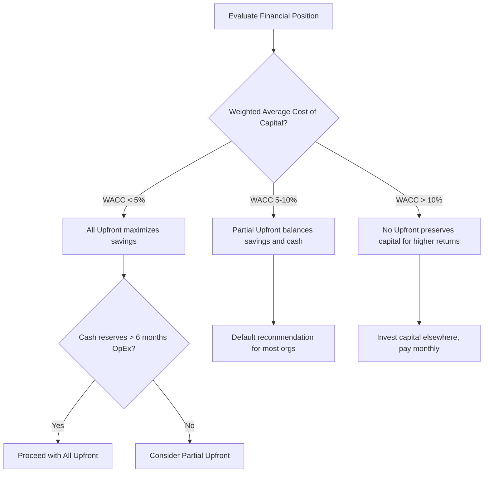
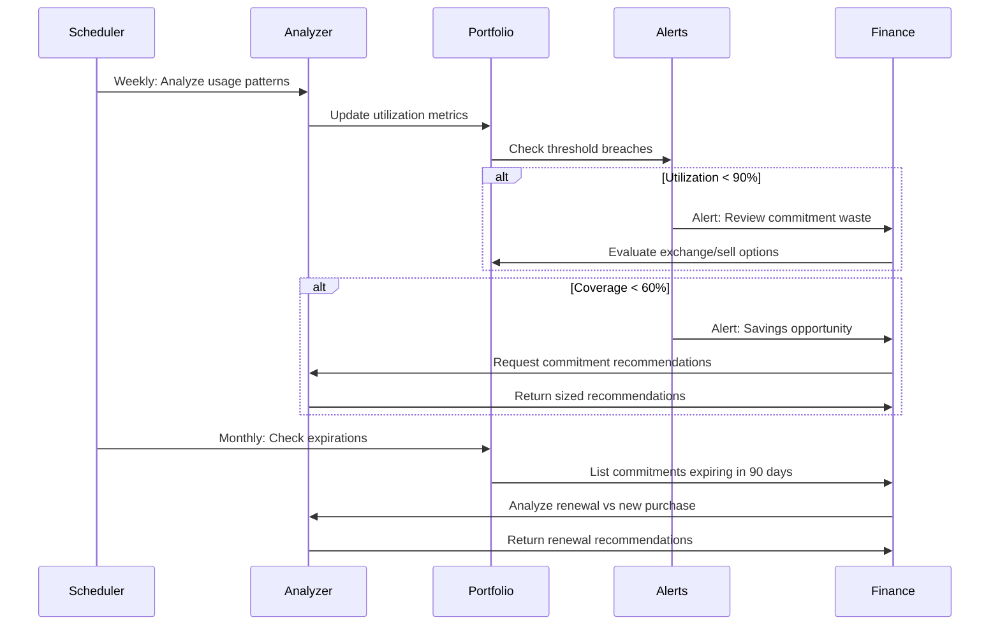

# How to Build Commitment Optimization

Author: [nawazdhandala](https://github.com/nawazdhandala)

Tags: Cloud, Cost Optimization, FinOps, Reserved Instances

Description: Learn how to optimize reserved capacity and savings plan commitments to reduce cloud costs by 30-70% while maintaining flexibility and avoiding costly mistakes.

---

Cloud providers offer significant discounts for committing to usage upfront. Reserved Instances (RIs), Savings Plans, and Committed Use Discounts can slash your compute bill by 30-70%. But commit too much and you waste money on unused capacity. Commit too little and you leave savings on the table. Building a commitment optimization strategy requires understanding your usage patterns, choosing the right commitment types, and continuously rebalancing your portfolio.

## Commitment Types Overview

Every major cloud provider offers discount mechanisms that trade flexibility for savings. Understanding the differences is crucial before committing a single dollar.



### AWS Commitment Types

| Type | Discount | Flexibility | Best For |
|------|----------|-------------|----------|
| Standard RIs | Up to 72% | Low - locked to instance type, AZ, OS | Stable, predictable workloads |
| Convertible RIs | Up to 66% | Medium - can exchange for different attributes | Evolving workloads |
| Compute Savings Plans | Up to 66% | High - any instance family, size, region, OS | Dynamic environments |
| EC2 Savings Plans | Up to 72% | Medium - locked to instance family in region | Known instance families |

### GCP Commitment Types

| Type | Discount | Flexibility | Best For |
|------|----------|-------------|----------|
| Resource-based CUDs | Up to 57% | Low - specific vCPU and memory amounts | Stable compute needs |
| Flexible CUDs | Up to 46% | High - applies to any compute | Variable workloads |

### Azure Commitment Types

| Type | Discount | Flexibility | Best For |
|------|----------|-------------|----------|
| Reserved Instances | Up to 72% | Low - VM size and region locked | Consistent VM sizes |
| Azure Savings Plans | Up to 65% | High - any compute service | Mixed compute usage |

## Usage Analysis for Commitment

Before purchasing any commitment, you need a clear picture of your baseline usage. The goal is to identify the **stable floor** of usage that runs consistently, which is ideal for commitments.

### Step 1: Export Usage Data

```python
import boto3
import pandas as pd
from datetime import datetime, timedelta

def get_ec2_usage_history(days=90):
    """
    Extract EC2 usage patterns from AWS Cost Explorer.
    Returns hourly normalized usage by instance family.
    """
    client = boto3.client('ce')

    end_date = datetime.now()
    start_date = end_date - timedelta(days=days)

    response = client.get_cost_and_usage(
        TimePeriod={
            'Start': start_date.strftime('%Y-%m-%d'),
            'End': end_date.strftime('%Y-%m-%d')
        },
        Granularity='HOURLY',
        Metrics=['UsageQuantity', 'NormalizedUsageAmount'],
        GroupBy=[
            {'Type': 'DIMENSION', 'Key': 'INSTANCE_TYPE_FAMILY'},
            {'Type': 'DIMENSION', 'Key': 'REGION'}
        ],
        Filter={
            'Dimensions': {
                'Key': 'SERVICE',
                'Values': ['Amazon Elastic Compute Cloud - Compute']
            }
        }
    )

    # Parse response into DataFrame
    records = []
    for result in response['ResultsByTime']:
        timestamp = result['TimePeriod']['Start']
        for group in result['Groups']:
            records.append({
                'timestamp': timestamp,
                'instance_family': group['Keys'][0],
                'region': group['Keys'][1],
                'normalized_hours': float(
                    group['Metrics']['NormalizedUsageAmount']['Amount']
                )
            })

    return pd.DataFrame(records)


def calculate_baseline_usage(df, percentile=10):
    """
    Calculate the stable baseline usage floor.
    Uses the 10th percentile to find consistently running capacity.
    """
    baseline = df.groupby(['instance_family', 'region']).agg({
        'normalized_hours': [
            ('p10', lambda x: x.quantile(0.10)),  # Baseline floor
            ('p50', lambda x: x.quantile(0.50)),  # Median
            ('p90', lambda x: x.quantile(0.90)),  # Peak
            ('mean', 'mean'),
            ('std', 'std')
        ]
    }).round(2)

    baseline.columns = ['baseline', 'median', 'peak', 'mean', 'std_dev']
    baseline['variability'] = (baseline['std_dev'] / baseline['mean']).round(2)

    return baseline.reset_index()
```

### Step 2: Identify Commitment Candidates

```python
def identify_commitment_candidates(baseline_df, min_baseline_hours=720):
    """
    Filter for workloads suitable for commitments.

    Criteria:
    - Minimum baseline usage (720 hours = 1 instance running 24/7 for 30 days)
    - Low variability (coefficient of variation < 0.3)
    - Consistent presence across the analysis period
    """
    candidates = baseline_df[
        (baseline_df['baseline'] >= min_baseline_hours) &
        (baseline_df['variability'] < 0.3)
    ].copy()

    # Calculate potential savings
    # Assuming 40% average savings from commitments
    candidates['monthly_on_demand_cost'] = candidates['mean'] * 0.10  # Example rate
    candidates['potential_monthly_savings'] = candidates['monthly_on_demand_cost'] * 0.40

    return candidates.sort_values('potential_monthly_savings', ascending=False)


# Example output visualization
def plot_usage_patterns(df, instance_family, region):
    """
    Visualize usage patterns to validate commitment decisions.
    Shows baseline floor, actual usage, and peak capacity.
    """
    import matplotlib.pyplot as plt

    filtered = df[
        (df['instance_family'] == instance_family) &
        (df['region'] == region)
    ].sort_values('timestamp')

    fig, ax = plt.subplots(figsize=(14, 6))

    ax.fill_between(filtered['timestamp'],
                    filtered['normalized_hours'],
                    alpha=0.3, label='Actual Usage')

    baseline = filtered['normalized_hours'].quantile(0.10)
    ax.axhline(y=baseline, color='green', linestyle='--',
               label=f'Baseline (P10): {baseline:.0f}')

    ax.axhline(y=filtered['normalized_hours'].quantile(0.90),
               color='red', linestyle='--',
               label=f'Peak (P90): {filtered["normalized_hours"].quantile(0.90):.0f}')

    ax.set_xlabel('Date')
    ax.set_ylabel('Normalized Hours')
    ax.set_title(f'Usage Pattern: {instance_family} in {region}')
    ax.legend()

    return fig
```

### Usage Analysis Decision Flow



## Commitment Sizing Strategies

The most common mistake in commitment optimization is over-committing. Here are battle-tested strategies for sizing commitments correctly.

### Strategy 1: Conservative Baseline Approach

Commit to your 10th percentile usage. This guarantees you will use every committed hour while leaving room for optimization.

```python
def calculate_conservative_commitment(usage_df, safety_margin=0.10):
    """
    Calculate commitment size using conservative baseline approach.

    Args:
        usage_df: DataFrame with hourly usage data
        safety_margin: Additional buffer below P10 (default 10%)

    Returns:
        Recommended commitment in normalized hours per hour
    """
    # Calculate P10 baseline
    p10_baseline = usage_df['normalized_hours'].quantile(0.10)

    # Apply safety margin
    recommended_commitment = p10_baseline * (1 - safety_margin)

    # Calculate coverage and savings
    total_usage = usage_df['normalized_hours'].sum()
    committed_usage = min(recommended_commitment * len(usage_df), total_usage)

    coverage_rate = committed_usage / total_usage

    return {
        'recommended_hourly_commitment': round(recommended_commitment, 2),
        'coverage_rate': round(coverage_rate * 100, 1),
        'committed_hours': round(committed_usage, 0),
        'on_demand_hours': round(total_usage - committed_usage, 0)
    }
```

### Strategy 2: Layered Commitment Approach

Build a portfolio with multiple commitment layers that expire at different times. This provides flexibility while maximizing savings.



```python
def design_layered_portfolio(usage_df, growth_rate=0.15):
    """
    Design a multi-layer commitment portfolio.

    Layer 1 (3-year): Most stable 40% of baseline - highest savings
    Layer 2 (1-year): Next 30% of baseline - medium savings
    Layer 3 (On-demand): Remaining variable usage - full flexibility
    """
    baseline = usage_df['normalized_hours'].quantile(0.10)
    median = usage_df['normalized_hours'].quantile(0.50)

    # Account for expected growth
    adjusted_baseline = baseline * (1 + growth_rate)

    portfolio = {
        'layer_1_3year': {
            'commitment': round(baseline * 0.40, 2),
            'discount': 0.60,  # 60% off on-demand
            'term_months': 36,
            'risk': 'Low - covers absolute minimum usage'
        },
        'layer_2_1year': {
            'commitment': round(baseline * 0.30, 2),
            'discount': 0.40,  # 40% off on-demand
            'term_months': 12,
            'risk': 'Medium - covers stable baseline'
        },
        'layer_3_ondemand': {
            'estimated_usage': round(median - (baseline * 0.70), 2),
            'discount': 0,
            'term_months': 0,
            'risk': 'None - pay as you go'
        }
    }

    # Calculate blended savings
    total_committed = portfolio['layer_1_3year']['commitment'] + \
                     portfolio['layer_2_1year']['commitment']

    weighted_discount = (
        (portfolio['layer_1_3year']['commitment'] * 0.60) +
        (portfolio['layer_2_1year']['commitment'] * 0.40)
    ) / total_committed

    portfolio['blended_discount'] = round(weighted_discount * 100, 1)
    portfolio['total_committed_hours'] = total_committed

    return portfolio
```

### Strategy 3: Rolling Purchase Strategy

Instead of buying all commitments at once, spread purchases over time to reduce timing risk and maintain flexibility.

```python
from datetime import datetime, timedelta

def generate_rolling_purchase_schedule(
    target_commitment: float,
    months_to_full_coverage: int = 6,
    commitment_term_months: int = 12
):
    """
    Generate a rolling purchase schedule to reach target commitment.

    Benefits:
    - Reduces timing risk (market changes, usage evolution)
    - Spreads cash outflow
    - Creates staggered expiration dates for flexibility
    """
    monthly_increment = target_commitment / months_to_full_coverage

    schedule = []
    current_date = datetime.now()

    for month in range(months_to_full_coverage):
        purchase_date = current_date + timedelta(days=30 * month)
        expiration_date = purchase_date + timedelta(days=30 * commitment_term_months)

        schedule.append({
            'purchase_date': purchase_date.strftime('%Y-%m-%d'),
            'amount': round(monthly_increment, 2),
            'cumulative_commitment': round(monthly_increment * (month + 1), 2),
            'expiration_date': expiration_date.strftime('%Y-%m-%d'),
            'coverage_percentage': round((month + 1) / months_to_full_coverage * 100, 1)
        })

    return schedule


# Example usage
schedule = generate_rolling_purchase_schedule(
    target_commitment=100,  # 100 normalized hours/hour
    months_to_full_coverage=6,
    commitment_term_months=12
)

# Output:
# Month 1: Purchase 16.67 hours, 16.7% coverage
# Month 2: Purchase 16.67 hours, 33.3% coverage
# Month 3: Purchase 16.67 hours, 50.0% coverage
# Month 4: Purchase 16.67 hours, 66.7% coverage
# Month 5: Purchase 16.67 hours, 83.3% coverage
# Month 6: Purchase 16.67 hours, 100.0% coverage
```

## Term Length Decisions

Choosing between 1-year and 3-year terms involves balancing savings against risk. Here is a framework for making this decision.



### Term Length Decision Matrix

```python
def recommend_term_length(
    workload_expected_lifespan_years: float,
    technology_stability_score: float,  # 0-1, 1 = very stable
    organization_growth_rate: float,    # Annual growth rate
    cash_availability: str              # 'high', 'medium', 'low'
) -> dict:
    """
    Recommend commitment term length based on workload characteristics.

    Returns recommendation with rationale.
    """

    # Risk factors
    lifespan_risk = 1 if workload_expected_lifespan_years < 2 else 0
    tech_risk = 1 if technology_stability_score < 0.7 else 0
    growth_risk = 1 if organization_growth_rate > 0.30 else 0

    total_risk = lifespan_risk + tech_risk + growth_risk

    if total_risk >= 2:
        term = '1-year'
        rationale = [
            'High uncertainty in workload longevity or technology',
            'Recommend shorter term for flexibility',
            'Re-evaluate commitment strategy annually'
        ]
    elif total_risk == 1:
        term = 'mixed'
        rationale = [
            'Moderate risk profile',
            'Consider 3-year for stable baseline (40%)',
            '1-year for remaining commitment (60%)',
            'Review quarterly'
        ]
    else:
        term = '3-year'
        rationale = [
            'Low risk profile - stable workload and technology',
            'Maximize savings with 3-year term',
            'Consider all-upfront if cash available'
        ]

    # Payment recommendation
    if cash_availability == 'high' and term in ['3-year', 'mixed']:
        payment = 'all-upfront'
        additional_savings = '5-10% additional discount'
    elif cash_availability == 'medium':
        payment = 'partial-upfront'
        additional_savings = '2-5% additional discount'
    else:
        payment = 'no-upfront'
        additional_savings = 'Preserves cash flow'

    return {
        'recommended_term': term,
        'recommended_payment': payment,
        'additional_savings': additional_savings,
        'rationale': rationale,
        'risk_score': total_risk
    }
```

### Break-Even Analysis

```python
def calculate_break_even(
    monthly_on_demand_cost: float,
    commitment_discount: float,
    upfront_payment: float,
    term_months: int
) -> dict:
    """
    Calculate break-even point for a commitment purchase.

    Args:
        monthly_on_demand_cost: What you would pay monthly without commitment
        commitment_discount: Discount percentage (e.g., 0.40 for 40% off)
        upfront_payment: Any upfront payment required
        term_months: Length of commitment in months

    Returns:
        Break-even analysis including months to break even
    """
    monthly_committed_cost = monthly_on_demand_cost * (1 - commitment_discount)
    monthly_savings = monthly_on_demand_cost - monthly_committed_cost

    # Account for upfront payment
    if upfront_payment > 0:
        months_to_break_even = upfront_payment / monthly_savings
    else:
        months_to_break_even = 0  # Immediate savings

    total_savings = (monthly_savings * term_months) - upfront_payment
    roi = total_savings / (upfront_payment if upfront_payment > 0
                           else monthly_committed_cost * term_months)

    return {
        'months_to_break_even': round(months_to_break_even, 1),
        'monthly_savings': round(monthly_savings, 2),
        'total_term_savings': round(total_savings, 2),
        'roi_percentage': round(roi * 100, 1),
        'risk_window_months': round(months_to_break_even, 0),
        'safe_after_month': int(months_to_break_even) + 1
    }


# Example: Compare 1-year vs 3-year
one_year = calculate_break_even(
    monthly_on_demand_cost=10000,
    commitment_discount=0.40,
    upfront_payment=0,
    term_months=12
)

three_year = calculate_break_even(
    monthly_on_demand_cost=10000,
    commitment_discount=0.60,
    upfront_payment=72000,  # 2 years upfront
    term_months=36
)

# 1-year: Immediate break-even, $48,000 total savings, lower risk
# 3-year: 12 month break-even, $144,000 total savings, higher initial risk
```

## Payment Option Analysis

Each payment option offers different trade-offs between cash flow and savings.

### AWS Payment Options Comparison

| Payment Option | Upfront Cost | Effective Discount | Cash Flow Impact | Best For |
|---------------|--------------|-------------------|------------------|----------|
| All Upfront | 100% | Highest (up to 72%) | High initial outlay | Cash-rich organizations |
| Partial Upfront | ~50% | Medium (up to 66%) | Moderate | Balanced approach |
| No Upfront | 0% | Lowest (up to 40%) | Predictable monthly | Cash-constrained orgs |

```python
def compare_payment_options(
    monthly_on_demand_cost: float,
    term_years: int = 1
) -> pd.DataFrame:
    """
    Compare all payment options for a given commitment.

    AWS EC2 Savings Plan discount approximations:
    - 1-year: All Upfront 40%, Partial 38%, No Upfront 36%
    - 3-year: All Upfront 60%, Partial 56%, No Upfront 52%
    """

    if term_years == 1:
        options = {
            'all_upfront': {'discount': 0.40, 'upfront_pct': 1.0},
            'partial_upfront': {'discount': 0.38, 'upfront_pct': 0.5},
            'no_upfront': {'discount': 0.36, 'upfront_pct': 0.0}
        }
    else:  # 3-year
        options = {
            'all_upfront': {'discount': 0.60, 'upfront_pct': 1.0},
            'partial_upfront': {'discount': 0.56, 'upfront_pct': 0.5},
            'no_upfront': {'discount': 0.52, 'upfront_pct': 0.0}
        }

    term_months = term_years * 12
    total_on_demand = monthly_on_demand_cost * term_months

    results = []
    for option, params in options.items():
        discounted_total = total_on_demand * (1 - params['discount'])
        upfront = discounted_total * params['upfront_pct']
        monthly = (discounted_total - upfront) / term_months if params['upfront_pct'] < 1 else 0

        results.append({
            'option': option,
            'discount_pct': params['discount'] * 100,
            'upfront_payment': round(upfront, 2),
            'monthly_payment': round(monthly, 2),
            'total_cost': round(discounted_total, 2),
            'total_savings': round(total_on_demand - discounted_total, 2),
            'npv_at_5pct': round(calculate_npv(upfront, monthly, term_months, 0.05), 2)
        })

    return pd.DataFrame(results)


def calculate_npv(upfront: float, monthly: float, months: int, annual_rate: float) -> float:
    """Calculate Net Present Value of payment stream."""
    monthly_rate = annual_rate / 12
    npv = upfront
    for month in range(1, months + 1):
        npv += monthly / ((1 + monthly_rate) ** month)
    return npv
```

### Payment Decision Framework



## Commitment Portfolio Management

Managing commitments is not a one-time activity. You need continuous monitoring and rebalancing.

### Portfolio Dashboard Metrics

```python
class CommitmentPortfolioManager:
    """
    Manage and monitor cloud commitment portfolio.
    """

    def __init__(self, commitments: list, usage_data: pd.DataFrame):
        self.commitments = commitments
        self.usage = usage_data

    def calculate_utilization(self) -> dict:
        """
        Calculate commitment utilization rate.
        Target: > 95% utilization to avoid waste.
        """
        total_committed = sum(c['hourly_commitment'] for c in self.commitments)
        total_used = self.usage['normalized_hours'].mean()

        utilization = min(total_used / total_committed, 1.0) if total_committed > 0 else 0

        return {
            'utilization_rate': round(utilization * 100, 1),
            'committed_hours': total_committed,
            'used_hours': round(total_used, 2),
            'wasted_hours': round(max(0, total_committed - total_used), 2),
            'status': 'healthy' if utilization > 0.95 else 'review_needed'
        }

    def calculate_coverage(self) -> dict:
        """
        Calculate what percentage of usage is covered by commitments.
        Target: 70-80% coverage for optimal balance.
        """
        total_committed = sum(c['hourly_commitment'] for c in self.commitments)
        total_used = self.usage['normalized_hours'].mean()

        coverage = total_committed / total_used if total_used > 0 else 0

        return {
            'coverage_rate': round(coverage * 100, 1),
            'on_demand_percentage': round((1 - min(coverage, 1)) * 100, 1),
            'recommendation': self._coverage_recommendation(coverage)
        }

    def _coverage_recommendation(self, coverage: float) -> str:
        if coverage < 0.60:
            return 'Under-committed: Consider purchasing additional commitments'
        elif coverage > 0.90:
            return 'Over-committed: Risk of waste, reduce future purchases'
        else:
            return 'Optimal coverage: Maintain current strategy'

    def get_expiring_commitments(self, days: int = 90) -> list:
        """
        List commitments expiring within specified days.
        """
        from datetime import datetime, timedelta

        cutoff = datetime.now() + timedelta(days=days)
        expiring = []

        for c in self.commitments:
            exp_date = datetime.strptime(c['expiration_date'], '%Y-%m-%d')
            if exp_date <= cutoff:
                c['days_until_expiration'] = (exp_date - datetime.now()).days
                expiring.append(c)

        return sorted(expiring, key=lambda x: x['days_until_expiration'])

    def generate_renewal_recommendations(self) -> list:
        """
        Generate recommendations for expiring commitments.
        """
        expiring = self.get_expiring_commitments(days=90)
        utilization = self.calculate_utilization()

        recommendations = []
        for commitment in expiring:
            if utilization['utilization_rate'] > 95:
                action = 'renew'
                rationale = 'High utilization, commitment is fully used'
            elif utilization['utilization_rate'] > 80:
                action = 'renew_reduced'
                rationale = 'Moderate utilization, consider reducing size by 10-20%'
            else:
                action = 'let_expire'
                rationale = 'Low utilization, let expire and right-size'

            recommendations.append({
                'commitment_id': commitment.get('id'),
                'expiration_date': commitment['expiration_date'],
                'current_size': commitment['hourly_commitment'],
                'recommended_action': action,
                'rationale': rationale
            })

        return recommendations
```

### Automated Monitoring Alerts

```python
def setup_commitment_alerts(portfolio_manager: CommitmentPortfolioManager):
    """
    Define alerting thresholds for commitment portfolio health.
    Integrate with monitoring tools like OneUptime.
    """

    alerts = {
        'low_utilization': {
            'condition': lambda pm: pm.calculate_utilization()['utilization_rate'] < 90,
            'severity': 'warning',
            'message': 'Commitment utilization below 90% - potential waste detected',
            'action': 'Review commitment portfolio and usage patterns'
        },
        'critical_low_utilization': {
            'condition': lambda pm: pm.calculate_utilization()['utilization_rate'] < 70,
            'severity': 'critical',
            'message': 'Commitment utilization critically low - significant waste',
            'action': 'Immediately review and consider selling/exchanging commitments'
        },
        'under_coverage': {
            'condition': lambda pm: pm.calculate_coverage()['coverage_rate'] < 50,
            'severity': 'info',
            'message': 'Coverage below 50% - savings opportunity available',
            'action': 'Evaluate purchasing additional commitments'
        },
        'expiring_soon': {
            'condition': lambda pm: len(pm.get_expiring_commitments(days=30)) > 0,
            'severity': 'warning',
            'message': 'Commitments expiring within 30 days',
            'action': 'Review and plan renewal or replacement'
        }
    }

    return alerts


# Example integration with monitoring
def check_portfolio_health(portfolio_manager):
    """
    Run health checks and return status for monitoring integration.
    """
    alerts = setup_commitment_alerts(portfolio_manager)
    triggered = []

    for alert_name, alert_config in alerts.items():
        if alert_config['condition'](portfolio_manager):
            triggered.append({
                'alert': alert_name,
                'severity': alert_config['severity'],
                'message': alert_config['message'],
                'action': alert_config['action']
            })

    return {
        'status': 'critical' if any(a['severity'] == 'critical' for a in triggered)
                  else 'warning' if triggered else 'healthy',
        'triggered_alerts': triggered,
        'metrics': {
            'utilization': portfolio_manager.calculate_utilization(),
            'coverage': portfolio_manager.calculate_coverage(),
            'expiring_30d': len(portfolio_manager.get_expiring_commitments(days=30))
        }
    }
```

### Portfolio Rebalancing Workflow



## Putting It All Together

Here is a complete commitment optimization workflow:

```python
class CommitmentOptimizer:
    """
    End-to-end commitment optimization workflow.
    """

    def __init__(self, cloud_provider: str = 'aws'):
        self.provider = cloud_provider
        self.usage_analyzer = None
        self.portfolio_manager = None

    def run_optimization_cycle(self) -> dict:
        """
        Execute full optimization cycle.
        Run monthly or when significant usage changes detected.
        """

        # Step 1: Collect and analyze usage
        usage_data = self._collect_usage_data(days=90)
        baseline = calculate_baseline_usage(usage_data)

        # Step 2: Identify candidates
        candidates = identify_commitment_candidates(baseline)

        # Step 3: Current portfolio health
        current_health = check_portfolio_health(self.portfolio_manager)

        # Step 4: Generate recommendations
        recommendations = self._generate_recommendations(
            candidates=candidates,
            current_health=current_health
        )

        # Step 5: Build purchase plan
        purchase_plan = self._build_purchase_plan(recommendations)

        return {
            'analysis_date': datetime.now().isoformat(),
            'usage_summary': {
                'total_baseline_hours': baseline['baseline'].sum(),
                'candidate_workloads': len(candidates),
                'current_coverage': current_health['metrics']['coverage']['coverage_rate']
            },
            'portfolio_health': current_health,
            'recommendations': recommendations,
            'purchase_plan': purchase_plan,
            'estimated_annual_savings': self._estimate_savings(purchase_plan)
        }

    def _generate_recommendations(self, candidates, current_health):
        """Generate actionable recommendations based on analysis."""

        recommendations = []

        # Handle under-coverage
        if current_health['metrics']['coverage']['coverage_rate'] < 70:
            for _, candidate in candidates.iterrows():
                rec = {
                    'type': 'new_purchase',
                    'workload': f"{candidate['instance_family']} in {candidate['region']}",
                    'recommended_commitment': candidate['baseline'] * 0.8,
                    'estimated_monthly_savings': candidate['potential_monthly_savings'],
                    'recommended_term': recommend_term_length(
                        workload_expected_lifespan_years=3,
                        technology_stability_score=0.8,
                        organization_growth_rate=0.15,
                        cash_availability='medium'
                    )
                }
                recommendations.append(rec)

        # Handle expiring commitments
        for renewal in self.portfolio_manager.generate_renewal_recommendations():
            recommendations.append({
                'type': 'renewal',
                **renewal
            })

        return recommendations

    def _build_purchase_plan(self, recommendations):
        """Convert recommendations into a phased purchase plan."""

        new_purchases = [r for r in recommendations if r['type'] == 'new_purchase']

        if not new_purchases:
            return {'purchases': [], 'total_upfront': 0}

        # Use rolling purchase strategy
        total_commitment = sum(r['recommended_commitment'] for r in new_purchases)
        schedule = generate_rolling_purchase_schedule(
            target_commitment=total_commitment,
            months_to_full_coverage=6,
            commitment_term_months=12
        )

        return {
            'strategy': 'rolling_6_month',
            'purchases': schedule,
            'total_commitment_target': total_commitment
        }

    def _estimate_savings(self, purchase_plan):
        """Estimate annual savings from recommended purchases."""

        if not purchase_plan.get('purchases'):
            return 0

        # Assume average 45% discount and $0.10/hour average rate
        total_hours = purchase_plan['total_commitment_target'] * 8760  # Annual hours
        on_demand_cost = total_hours * 0.10
        committed_cost = on_demand_cost * 0.55  # 45% discount

        return round(on_demand_cost - committed_cost, 2)
```

## Key Takeaways

1. **Start with data**: Analyze at least 90 days of usage before purchasing any commitments. The 10th percentile is your safe baseline.

2. **Layer your commitments**: Do not put all your eggs in one basket. Use a mix of 3-year (for stable floor) and 1-year (for flexibility) commitments.

3. **Roll purchases over time**: Spread purchases across 3-6 months to reduce timing risk and create staggered expirations.

4. **Monitor continuously**: Set up alerts for utilization below 90% and coverage below 60%. Review expiring commitments 90 days in advance.

5. **Match payment to cash flow**: All-upfront maximizes savings but ties up capital. Choose based on your organization's weighted average cost of capital.

6. **Automate the workflow**: Manual commitment management does not scale. Build or buy tools to continuously analyze usage and recommend adjustments.

Commitment optimization is not a one-time project but an ongoing discipline. The organizations that save the most treat their commitment portfolio like a financial asset: continuously monitored, regularly rebalanced, and aligned with business strategy.

## Further Reading

- [AWS Savings Plans User Guide](https://docs.aws.amazon.com/savingsplans/latest/userguide/)
- [GCP Committed Use Discounts](https://cloud.google.com/compute/docs/instances/committed-use-discounts-overview)
- [Azure Reservations](https://docs.microsoft.com/en-us/azure/cost-management-billing/reservations/)
- [FinOps Foundation - Commitment-Based Discounts](https://www.finops.org/framework/capabilities/commitment-based-discounts/)
