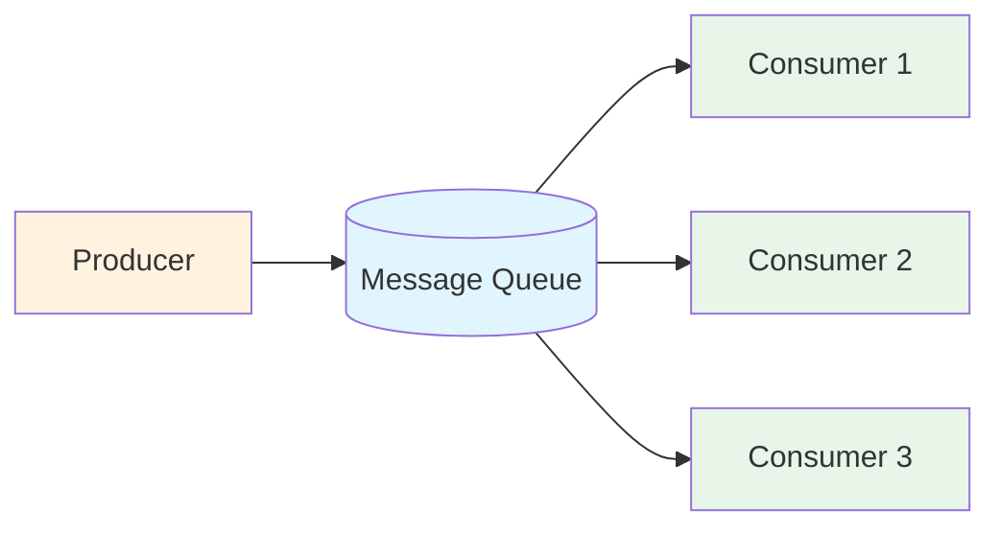
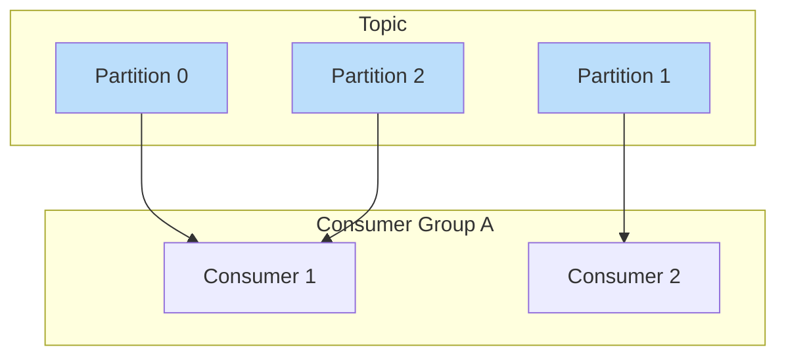
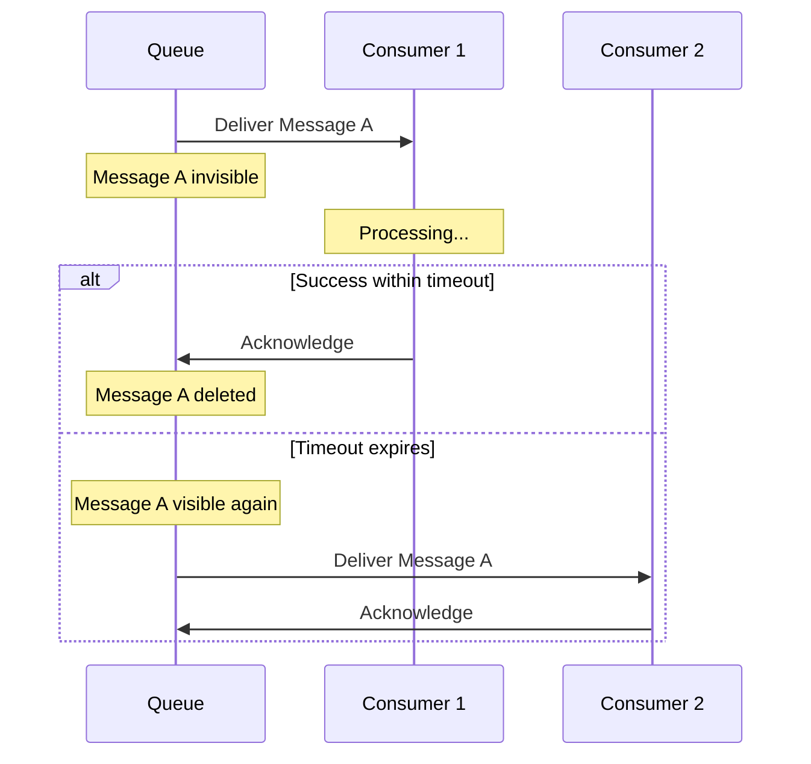
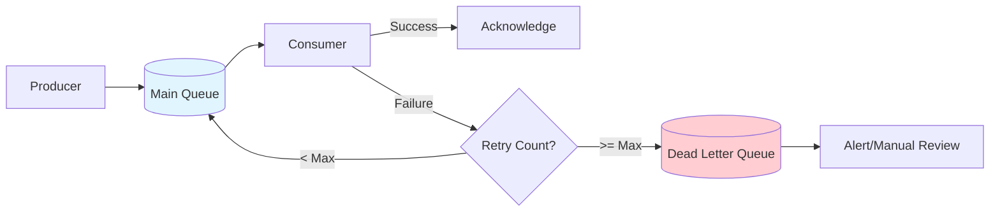
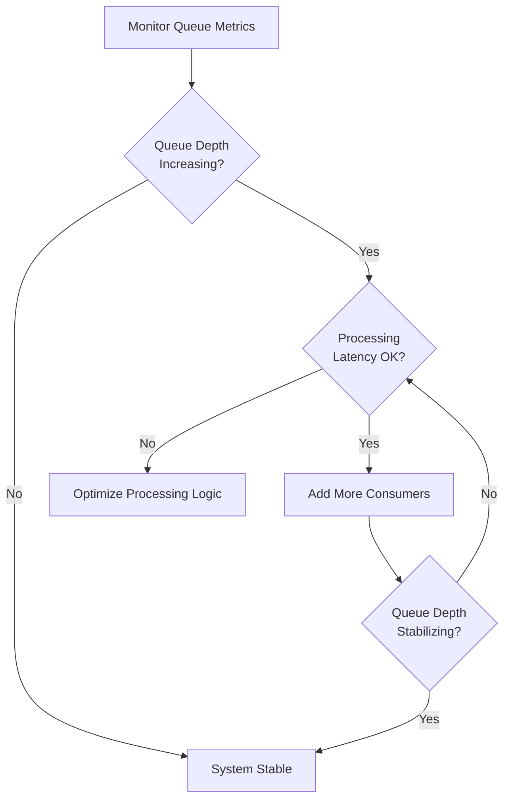

# How to Implement Competing Consumers

Author: [nawazdhandala](https://github.com/nawazdhandala)

Tags: Message Queues, Design Patterns, Scalability, Backend

Description: Learn how to implement the competing consumers pattern for scalable message processing.

---

Message queues are fundamental building blocks for distributed systems. As your application scales, a single consumer often cannot keep up with the rate of incoming messages. This is where the **Competing Consumers** pattern comes into play.

## What is the Competing Consumers Pattern?

The Competing Consumers pattern allows multiple consumer instances to read from the same message queue concurrently. Each message is processed by exactly one consumer, enabling horizontal scaling of message processing workloads.



## Key Concepts

Before diving into implementation, let us understand the core concepts that make this pattern work reliably.

### 1. Consumer Groups

A consumer group is a collection of consumer instances that work together to process messages from a queue or topic. The message broker ensures that each message is delivered to only one consumer within the group.



### 2. Message Acknowledgment

Message acknowledgment (or "acking") is how consumers tell the broker that a message has been successfully processed. Without proper acknowledgment, messages could be lost or processed multiple times.

**Acknowledgment Strategies:**

| Strategy | Description | Use Case |
|----------|-------------|----------|
| Auto-ack | Message is acknowledged immediately upon delivery | Low-value, idempotent operations |
| Manual-ack | Consumer explicitly acknowledges after processing | Critical business operations |
| Negative-ack (nack) | Consumer rejects the message for redelivery | Temporary processing failures |

### 3. Visibility Timeout

Visibility timeout (also called "invisibility period" or "delivery timeout") is the time window during which a message is hidden from other consumers while being processed. If the consumer fails to acknowledge the message within this period, the message becomes visible again for redelivery.



## Implementation Examples

Let us look at how to implement competing consumers with three popular message queue systems.

### RabbitMQ Implementation

RabbitMQ uses the concept of queues with multiple consumers. The broker distributes messages using a round-robin algorithm by default.

```python
# rabbitmq_consumer.py
# Competing consumers implementation with RabbitMQ using pika library

import pika
import time
import json
from typing import Callable

class RabbitMQCompetingConsumer:
    """
    A competing consumer implementation for RabbitMQ.
    Multiple instances of this class can run concurrently to process messages.
    """

    def __init__(self, host: str, queue_name: str, prefetch_count: int = 1):
        """
        Initialize the consumer.

        Args:
            host: RabbitMQ server hostname
            queue_name: Name of the queue to consume from
            prefetch_count: Number of unacknowledged messages to prefetch.
                           Set to 1 for fair dispatch among consumers.
        """
        self.host = host
        self.queue_name = queue_name
        self.prefetch_count = prefetch_count
        self.connection = None
        self.channel = None

    def connect(self):
        """Establish connection to RabbitMQ server."""
        # Create a blocking connection to RabbitMQ
        self.connection = pika.BlockingConnection(
            pika.ConnectionParameters(host=self.host)
        )
        self.channel = self.connection.channel()

        # Declare the queue (idempotent operation)
        # durable=True ensures the queue survives broker restarts
        self.channel.queue_declare(
            queue=self.queue_name,
            durable=True
        )

        # Set prefetch count to control load distribution
        # This ensures a consumer only gets N unacked messages at a time
        # Critical for fair distribution among competing consumers
        self.channel.basic_qos(prefetch_count=self.prefetch_count)

    def process_messages(self, callback: Callable):
        """
        Start consuming messages from the queue.

        Args:
            callback: Function to process each message.
                     Should accept (channel, method, properties, body) parameters.
        """
        def wrapper_callback(channel, method, properties, body):
            try:
                # Decode and process the message
                message = json.loads(body.decode('utf-8'))
                print(f"[Consumer] Processing message: {message}")

                # Execute the user-provided callback
                callback(message)

                # Manually acknowledge the message after successful processing
                # This removes the message from the queue permanently
                channel.basic_ack(delivery_tag=method.delivery_tag)
                print(f"[Consumer] Message acknowledged")

            except Exception as e:
                print(f"[Consumer] Error processing message: {e}")
                # Negative acknowledgment - requeue the message for retry
                # requeue=True puts the message back in the queue
                channel.basic_nack(
                    delivery_tag=method.delivery_tag,
                    requeue=True
                )

        # Register the consumer callback
        # auto_ack=False enables manual acknowledgment mode
        self.channel.basic_consume(
            queue=self.queue_name,
            on_message_callback=wrapper_callback,
            auto_ack=False  # Manual acknowledgment for reliability
        )

        print(f"[Consumer] Waiting for messages on queue: {self.queue_name}")
        self.channel.start_consuming()

    def close(self):
        """Clean up the connection."""
        if self.connection:
            self.connection.close()


# Example usage
if __name__ == "__main__":
    def handle_order(message):
        """Business logic to process an order."""
        order_id = message.get("order_id")
        print(f"Processing order: {order_id}")
        # Simulate processing time
        time.sleep(2)
        print(f"Order {order_id} processed successfully")

    # Create and start the consumer
    consumer = RabbitMQCompetingConsumer(
        host="localhost",
        queue_name="orders",
        prefetch_count=1  # Fair dispatch
    )
    consumer.connect()
    consumer.process_messages(handle_order)
```

### Apache Kafka Implementation

Kafka uses consumer groups natively. Consumers in the same group automatically coordinate to partition the workload.

```python
# kafka_consumer.py
# Competing consumers implementation with Apache Kafka

from kafka import KafkaConsumer, OffsetAndMetadata
from kafka.errors import KafkaError
import json
from typing import Callable, Optional

class KafkaCompetingConsumer:
    """
    A competing consumer implementation for Apache Kafka.
    Uses consumer groups for automatic workload distribution.
    """

    def __init__(
        self,
        bootstrap_servers: list,
        topic: str,
        group_id: str,
        auto_commit: bool = False
    ):
        """
        Initialize the Kafka consumer.

        Args:
            bootstrap_servers: List of Kafka broker addresses
            topic: Topic to subscribe to
            group_id: Consumer group ID. All consumers with the same
                     group_id will share the message processing load.
            auto_commit: Whether to automatically commit offsets.
                        Set to False for manual control over acknowledgments.
        """
        self.topic = topic
        self.group_id = group_id

        # Create the Kafka consumer instance
        self.consumer = KafkaConsumer(
            topic,
            bootstrap_servers=bootstrap_servers,
            group_id=group_id,
            # Deserialize message values from JSON
            value_deserializer=lambda m: json.loads(m.decode('utf-8')),
            # Manual offset management for reliable processing
            enable_auto_commit=auto_commit,
            # Start from earliest unprocessed message when joining group
            auto_offset_reset='earliest',
            # Session timeout for consumer group coordination
            # If consumer fails to heartbeat within this period,
            # it will be removed from the group and partitions rebalanced
            session_timeout_ms=30000,
            # Heartbeat interval should be 1/3 of session timeout
            heartbeat_interval_ms=10000,
            # Maximum records to fetch in a single poll
            max_poll_records=100
        )

    def process_messages(self, callback: Callable):
        """
        Start consuming and processing messages.

        Args:
            callback: Function to process each message.
                     Should accept the deserialized message value.
        """
        print(f"[Consumer] Started. Group: {self.group_id}, Topic: {self.topic}")

        try:
            # Main consumption loop
            for message in self.consumer:
                try:
                    print(f"[Consumer] Received message from partition "
                          f"{message.partition}, offset {message.offset}")

                    # Process the message using the callback
                    callback(message.value)

                    # Commit the offset after successful processing
                    # This acts as the acknowledgment in Kafka
                    # Only committed offsets are considered "processed"
                    self.consumer.commit({
                        message.topic_partition: OffsetAndMetadata(
                            message.offset + 1,  # Commit the next offset
                            None
                        )
                    })
                    print(f"[Consumer] Offset {message.offset} committed")

                except Exception as e:
                    print(f"[Consumer] Error processing message: {e}")
                    # In Kafka, not committing the offset means the message
                    # will be redelivered when the consumer restarts or
                    # when a rebalance occurs
                    # You may want to implement a dead letter queue here

        except KafkaError as e:
            print(f"[Consumer] Kafka error: {e}")
        finally:
            self.consumer.close()

    def close(self):
        """Clean up consumer resources."""
        self.consumer.close()


# Example: Running multiple competing consumers
if __name__ == "__main__":
    import threading

    def process_event(message):
        """Process a single event message."""
        event_type = message.get("event_type")
        event_id = message.get("event_id")
        print(f"Processing event {event_id} of type {event_type}")
        # Simulate work
        import time
        time.sleep(1)

    # In production, each consumer would run in a separate process/container
    # Here we demonstrate with threads for illustration
    def start_consumer(consumer_id):
        consumer = KafkaCompetingConsumer(
            bootstrap_servers=["localhost:9092"],
            topic="events",
            group_id="event-processors",  # Same group ID for competing consumers
            auto_commit=False
        )
        print(f"Consumer {consumer_id} starting...")
        consumer.process_messages(process_event)

    # Start multiple consumers in the same group
    threads = []
    for i in range(3):
        t = threading.Thread(target=start_consumer, args=(i,))
        t.start()
        threads.append(t)
```

### Amazon SQS Implementation

SQS provides competing consumers through its visibility timeout mechanism. Multiple consumers can poll the same queue, and messages become invisible to other consumers during processing.

```python
# sqs_consumer.py
# Competing consumers implementation with Amazon SQS

import boto3
import json
import time
from typing import Callable, Optional
from concurrent.futures import ThreadPoolExecutor

class SQSCompetingConsumer:
    """
    A competing consumer implementation for Amazon SQS.
    Uses visibility timeout for message processing coordination.
    """

    def __init__(
        self,
        queue_url: str,
        region_name: str = "us-east-1",
        visibility_timeout: int = 30,
        max_messages: int = 10,
        wait_time_seconds: int = 20
    ):
        """
        Initialize the SQS consumer.

        Args:
            queue_url: The URL of the SQS queue
            region_name: AWS region where the queue is located
            visibility_timeout: Seconds a message stays invisible after receipt.
                               Should be longer than your processing time.
            max_messages: Maximum messages to receive per poll (1-10)
            wait_time_seconds: Long polling wait time (0-20 seconds).
                              Higher values reduce API calls and costs.
        """
        self.queue_url = queue_url
        self.visibility_timeout = visibility_timeout
        self.max_messages = max_messages
        self.wait_time_seconds = wait_time_seconds

        # Create SQS client
        self.sqs = boto3.client('sqs', region_name=region_name)

    def receive_messages(self) -> list:
        """
        Receive messages from the queue using long polling.

        Returns:
            List of received messages
        """
        response = self.sqs.receive_message(
            QueueUrl=self.queue_url,
            MaxNumberOfMessages=self.max_messages,
            # Long polling reduces empty responses and API costs
            WaitTimeSeconds=self.wait_time_seconds,
            # Visibility timeout for this receive operation
            VisibilityTimeout=self.visibility_timeout,
            # Include all message attributes
            MessageAttributeNames=['All'],
            # Include system attributes like ApproximateReceiveCount
            AttributeNames=['All']
        )

        return response.get('Messages', [])

    def delete_message(self, receipt_handle: str):
        """
        Delete a message from the queue (acknowledge it).

        Args:
            receipt_handle: The receipt handle from the received message
        """
        self.sqs.delete_message(
            QueueUrl=self.queue_url,
            ReceiptHandle=receipt_handle
        )

    def extend_visibility_timeout(self, receipt_handle: str, seconds: int):
        """
        Extend the visibility timeout for a message being processed.
        Use this for long-running operations to prevent redelivery.

        Args:
            receipt_handle: The receipt handle from the received message
            seconds: New visibility timeout in seconds
        """
        self.sqs.change_message_visibility(
            QueueUrl=self.queue_url,
            ReceiptHandle=receipt_handle,
            VisibilityTimeout=seconds
        )

    def process_messages(self, callback: Callable, max_workers: int = 5):
        """
        Start consuming and processing messages.
        Uses a thread pool for concurrent message processing.

        Args:
            callback: Function to process each message body (dict)
            max_workers: Maximum concurrent processing threads
        """
        print(f"[Consumer] Starting to poll queue: {self.queue_url}")

        def process_single_message(message):
            """Process a single message with error handling."""
            receipt_handle = message['ReceiptHandle']
            message_id = message['MessageId']

            try:
                # Parse the message body
                body = json.loads(message['Body'])
                print(f"[Consumer] Processing message {message_id}")

                # Check how many times this message has been received
                receive_count = int(
                    message.get('Attributes', {}).get('ApproximateReceiveCount', 1)
                )
                if receive_count > 3:
                    print(f"[Consumer] Message {message_id} received {receive_count} times")
                    # Consider moving to dead letter queue

                # Execute the callback
                callback(body)

                # Delete the message (acknowledge successful processing)
                self.delete_message(receipt_handle)
                print(f"[Consumer] Message {message_id} processed and deleted")

            except json.JSONDecodeError as e:
                print(f"[Consumer] Invalid JSON in message {message_id}: {e}")
                # Delete malformed messages to prevent infinite retries
                self.delete_message(receipt_handle)

            except Exception as e:
                print(f"[Consumer] Error processing message {message_id}: {e}")
                # Do not delete - message will become visible again after timeout
                # SQS will automatically retry up to the redrive policy limit

        # Use thread pool for concurrent processing
        with ThreadPoolExecutor(max_workers=max_workers) as executor:
            while True:
                try:
                    # Long poll for messages
                    messages = self.receive_messages()

                    if messages:
                        print(f"[Consumer] Received {len(messages)} messages")
                        # Submit all messages for processing
                        executor.map(process_single_message, messages)

                except Exception as e:
                    print(f"[Consumer] Error receiving messages: {e}")
                    time.sleep(5)  # Back off on errors


# Example: Running with visibility timeout extension for long operations
if __name__ == "__main__":
    def process_video(message):
        """Example: Process a video transcoding job."""
        video_id = message.get("video_id")
        print(f"Starting transcoding for video {video_id}")

        # Simulate long-running operation
        for i in range(5):
            time.sleep(10)
            print(f"Video {video_id}: {(i+1)*20}% complete")

        print(f"Video {video_id} transcoding complete")

    consumer = SQSCompetingConsumer(
        queue_url="https://sqs.us-east-1.amazonaws.com/123456789/video-jobs",
        visibility_timeout=60,  # 60 seconds initial timeout
        max_messages=5,
        wait_time_seconds=20  # Long polling
    )

    consumer.process_messages(process_video, max_workers=3)
```

## Best Practices

### 1. Idempotent Message Processing

Since messages can be delivered more than once (at-least-once delivery), your processing logic should be idempotent.

```python
# Idempotent processing example using a deduplication store

class IdempotentProcessor:
    """
    Ensures messages are processed exactly once using deduplication.
    """

    def __init__(self, redis_client):
        self.redis = redis_client
        # Time to keep processed message IDs (24 hours)
        self.dedup_ttl_seconds = 86400

    def process_if_not_duplicate(self, message_id: str, callback: Callable) -> bool:
        """
        Process a message only if it has not been processed before.

        Args:
            message_id: Unique identifier for the message
            callback: Processing function to execute

        Returns:
            True if message was processed, False if it was a duplicate
        """
        dedup_key = f"processed:{message_id}"

        # Try to set the key (NX = only if not exists)
        # This is an atomic operation
        was_set = self.redis.set(
            dedup_key,
            "1",
            nx=True,  # Only set if not exists
            ex=self.dedup_ttl_seconds  # Expire after TTL
        )

        if not was_set:
            # Message was already processed
            print(f"Duplicate message {message_id}, skipping")
            return False

        try:
            # Process the message
            callback()
            return True
        except Exception:
            # Processing failed, remove the dedup key to allow retry
            self.redis.delete(dedup_key)
            raise
```

### 2. Graceful Shutdown

Handle shutdown signals properly to avoid losing messages mid-processing.

```python
import signal
import sys

class GracefulConsumer:
    """Consumer with graceful shutdown handling."""

    def __init__(self):
        self.should_stop = False
        self.currently_processing = False

        # Register signal handlers
        signal.signal(signal.SIGTERM, self._signal_handler)
        signal.signal(signal.SIGINT, self._signal_handler)

    def _signal_handler(self, signum, frame):
        """Handle shutdown signals gracefully."""
        print(f"[Consumer] Received signal {signum}, initiating graceful shutdown")
        self.should_stop = True

        if not self.currently_processing:
            # Safe to exit immediately if not processing
            sys.exit(0)

    def process_messages(self, get_message, process_callback):
        """Main processing loop with graceful shutdown."""
        while not self.should_stop:
            message = get_message()

            if message:
                self.currently_processing = True
                try:
                    process_callback(message)
                finally:
                    self.currently_processing = False

        print("[Consumer] Graceful shutdown complete")
```

### 3. Dead Letter Queues

Configure dead letter queues to handle messages that repeatedly fail processing.



### 4. Monitoring and Observability

Track key metrics for your competing consumers:

| Metric | Description | Alert Threshold |
|--------|-------------|-----------------|
| Queue Depth | Number of messages waiting | Sustained growth |
| Processing Latency | Time to process each message | p99 > SLA |
| Consumer Lag | How far behind consumers are | Growing lag |
| Error Rate | Failed processing attempts | > 1% of messages |
| Consumer Count | Active consumer instances | < minimum required |

## Scaling Considerations

### When to Add More Consumers



### Partition-Based Scaling (Kafka)

For Kafka, the number of partitions determines the maximum parallelism:

- 3 partitions = maximum 3 consumers per group
- Adding more consumers than partitions results in idle consumers
- Plan partition count based on expected peak throughput

## Conclusion

The Competing Consumers pattern is essential for building scalable, resilient message processing systems. Key takeaways:

1. **Choose the right acknowledgment strategy** based on your reliability requirements
2. **Set appropriate visibility timeouts** that exceed your processing time
3. **Implement idempotent processing** to handle duplicate deliveries
4. **Use dead letter queues** for messages that cannot be processed
5. **Monitor queue depth and consumer lag** to know when to scale

Whether you are using RabbitMQ, Kafka, or SQS, the core principles remain the same. Start with a simple implementation, add observability, and scale horizontally as your workload grows.

## Further Reading

- [Enterprise Integration Patterns: Competing Consumers](https://www.enterpriseintegrationpatterns.com/patterns/messaging/CompetingConsumers.html)
- [RabbitMQ Work Queues Tutorial](https://www.rabbitmq.com/tutorials/tutorial-two-python.html)
- [Kafka Consumer Groups](https://kafka.apache.org/documentation/#consumerconfigs)
- [Amazon SQS Visibility Timeout](https://docs.aws.amazon.com/AWSSimpleQueueService/latest/SQSDeveloperGuide/sqs-visibility-timeout.html)
