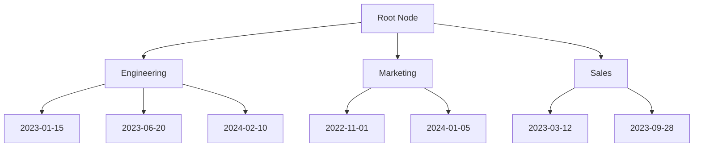
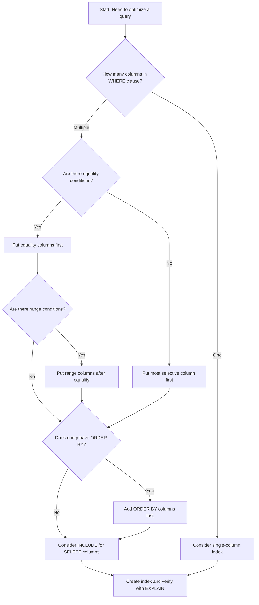

# How to Build Composite Index Design

Author: [nawazdhandala](https://github.com/nawazdhandala)

Tags: Database, Indexing, Performance, SQL

Description: Learn to build composite index design for optimizing multi-column queries and complex filters.

---

> A single-column index works well for simple queries, but real applications filter on multiple columns. Composite indexes let you optimize queries that filter, sort, or join on two or more columns at once. This guide covers the principles and practices for building effective composite indexes.

Composite indexes store multiple columns in a single B-tree structure. The column order determines which queries can use the index efficiently. Getting this order right is the difference between a fast query and a full table scan.

---

## How Composite Indexes Work

A composite index stores values from multiple columns as a concatenated key. The database sorts entries first by the leftmost column, then by the second column within each group, and so on.

The following diagram shows how a composite index on (department, hire_date) organizes data:



This structure allows the database to quickly locate all Engineering employees, then narrow down to a specific hire date range within that department.

---

## The Leftmost Prefix Rule

The most important concept in composite index design is the leftmost prefix rule. A composite index can satisfy queries that use:

- The first column alone
- The first and second columns together
- The first, second, and third columns together
- And so on for any leftmost prefix

The following table shows which queries can use an index on (a, b, c):

| Query Condition | Index Used | Notes |
|-----------------|------------|-------|
| WHERE a = 1 | Yes | Uses first column |
| WHERE a = 1 AND b = 2 | Yes | Uses first two columns |
| WHERE a = 1 AND b = 2 AND c = 3 | Yes | Uses all three columns |
| WHERE b = 2 | No | Missing leftmost column |
| WHERE b = 2 AND c = 3 | No | Missing leftmost column |
| WHERE a = 1 AND c = 3 | Partial | Uses only first column |

---

## Creating Composite Indexes

The syntax for creating a composite index is straightforward. You list the columns in the order that supports your query patterns.

This example creates a composite index on the orders table for queries that filter by customer and order date:

```sql
-- Create a composite index on customer_id and order_date
-- Column order matters: customer_id comes first because it has higher selectivity
CREATE INDEX idx_orders_customer_date
ON orders (customer_id, order_date);

-- This query uses the full index
SELECT * FROM orders
WHERE customer_id = 12345
AND order_date >= '2024-01-01';

-- This query uses only the first column of the index
SELECT * FROM orders
WHERE customer_id = 12345;

-- This query cannot use the index (missing customer_id)
SELECT * FROM orders
WHERE order_date >= '2024-01-01';
```

---

## Column Order Strategy

The order of columns in a composite index determines its effectiveness. Follow these guidelines when deciding column order:

**1. Put equality conditions before range conditions**

Columns used with = or IN should come before columns used with >, <, BETWEEN, or LIKE.

```sql
-- Good: equality column (status) first, range column (created_at) second
CREATE INDEX idx_tasks_status_created
ON tasks (status, created_at);

-- Query that benefits from this order
SELECT * FROM tasks
WHERE status = 'pending'
AND created_at >= '2024-01-01';
```

**2. Consider selectivity for equality columns**

When you have multiple equality conditions, place the most selective column (the one that filters out the most rows) first.

```sql
-- Assuming user_id is more selective than status
-- (fewer rows match a specific user than a specific status)
CREATE INDEX idx_orders_user_status
ON orders (user_id, status);

-- This query narrows down to one user first, then filters by status
SELECT * FROM orders
WHERE user_id = 42
AND status = 'shipped';
```

**3. Include sort columns last**

If your query includes ORDER BY, adding those columns at the end can avoid a separate sort operation.

```sql
-- Index supports both filtering and sorting
CREATE INDEX idx_posts_author_published
ON posts (author_id, published_at DESC);

-- Query uses index for both WHERE and ORDER BY
SELECT * FROM posts
WHERE author_id = 100
ORDER BY published_at DESC
LIMIT 10;
```

---

## Analyzing Index Usage with EXPLAIN

Always verify that your indexes work as expected using EXPLAIN or EXPLAIN ANALYZE. These commands show the query execution plan.

The following example demonstrates how to check if a composite index is being used:

```sql
-- Create a test table and index
CREATE TABLE events (
    id SERIAL PRIMARY KEY,
    user_id INTEGER NOT NULL,
    event_type VARCHAR(50) NOT NULL,
    created_at TIMESTAMP NOT NULL
);

-- Create composite index
CREATE INDEX idx_events_user_type_created
ON events (user_id, event_type, created_at);

-- Analyze the query plan
EXPLAIN ANALYZE
SELECT * FROM events
WHERE user_id = 1
AND event_type = 'login'
AND created_at >= '2024-01-01';

-- Expected output shows "Index Scan using idx_events_user_type_created"
```

Look for "Index Scan" or "Index Only Scan" in the output. If you see "Seq Scan" (sequential scan), the index is not being used.

---

## Covering Indexes

A covering index includes all columns needed by a query, allowing the database to answer the query using only the index without accessing the table data.

```sql
-- Covering index for a common reporting query
-- Includes queried columns (user_id, status) and selected columns (total, created_at)
CREATE INDEX idx_orders_covering
ON orders (user_id, status)
INCLUDE (total, created_at);

-- This query can be answered entirely from the index
SELECT user_id, status, total, created_at
FROM orders
WHERE user_id = 42
AND status = 'completed';
```

The INCLUDE clause (available in PostgreSQL 11+, SQL Server 2005+) adds columns to the leaf nodes of the index without including them in the sort order.

---

## Common Patterns and Examples

### Pattern 1: Multi-tenant Applications

Multi-tenant applications always filter by tenant. Put tenant_id first in every composite index.

```sql
-- Tenant-first indexing strategy
CREATE INDEX idx_documents_tenant_owner
ON documents (tenant_id, owner_id, created_at);

CREATE INDEX idx_documents_tenant_status
ON documents (tenant_id, status, updated_at);

-- All queries include tenant_id
SELECT * FROM documents
WHERE tenant_id = 'acme-corp'
AND owner_id = 55
ORDER BY created_at DESC;
```

### Pattern 2: Time-Series Data

Time-series data often filters by entity and time range.

```sql
-- Metric storage with composite index
CREATE INDEX idx_metrics_entity_time
ON metrics (entity_id, recorded_at DESC);

-- Query recent metrics for a specific entity
SELECT * FROM metrics
WHERE entity_id = 'server-001'
AND recorded_at >= NOW() - INTERVAL '1 hour'
ORDER BY recorded_at DESC;
```

### Pattern 3: Status and Date Filtering

Many applications track item status with timestamps.

```sql
-- Support queries for pending items by date
CREATE INDEX idx_jobs_status_scheduled
ON jobs (status, scheduled_at)
WHERE status IN ('pending', 'running');

-- Partial index only includes active jobs
-- Reduces index size and maintenance cost
SELECT * FROM jobs
WHERE status = 'pending'
AND scheduled_at <= NOW();
```

---

## Index Design Decision Flowchart

Use this flowchart to guide your composite index design decisions:



---

## Index Maintenance Considerations

Composite indexes require ongoing maintenance. Keep these factors in mind:

| Factor | Impact | Recommendation |
|--------|--------|----------------|
| Write overhead | Each INSERT/UPDATE/DELETE modifies the index | Limit to 3-5 indexes per table |
| Index size | More columns = larger index | Use INCLUDE instead of adding to key |
| Bloat | Dead tuples accumulate over time | Schedule regular REINDEX or VACUUM |
| Statistics | Stale stats lead to poor plans | Run ANALYZE after major data changes |

---

## Avoiding Common Mistakes

**Mistake 1: Too many indexes**

Each index slows down writes and consumes storage. Start with the indexes your queries need and add more only when profiling shows a bottleneck.

**Mistake 2: Wrong column order**

Review your WHERE clauses. If you filter by status and date but your index is (date, status), range queries on date will not use the status filter efficiently.

**Mistake 3: Ignoring partial indexes**

If you only query active records, a partial index can be much smaller and faster:

```sql
-- Instead of indexing all orders
CREATE INDEX idx_orders_active
ON orders (customer_id, created_at)
WHERE status != 'archived';
```

**Mistake 4: Not testing with realistic data**

Index performance depends on data distribution. Test with production-like data volumes and cardinality.

---

## Conclusion

Composite indexes are a powerful tool for optimizing multi-column queries. The key principles to remember:

- Column order follows the leftmost prefix rule
- Put equality conditions before range conditions
- Consider selectivity when ordering equality columns
- Use INCLUDE for covering indexes
- Always verify with EXPLAIN

Start with your most common and expensive queries. Create targeted composite indexes for each pattern, measure the improvement, and iterate. A well-designed composite index can turn a slow query into a fast one without any application code changes.

---

*Need to monitor your database query performance? [OneUptime](https://oneuptime.com) provides database monitoring with query analysis, slow query detection, and automatic alerting when performance degrades.*

**Related Reading:**
- [How to Implement Connection Pooling in Python for PostgreSQL](https://oneuptime.com/blog/post/2025-01-06-python-connection-pooling-postgresql/view)
