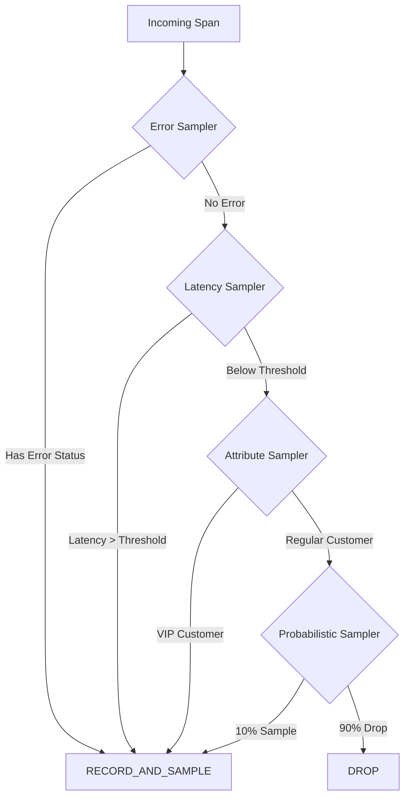
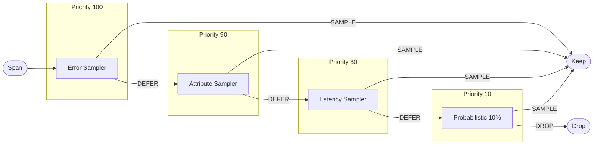
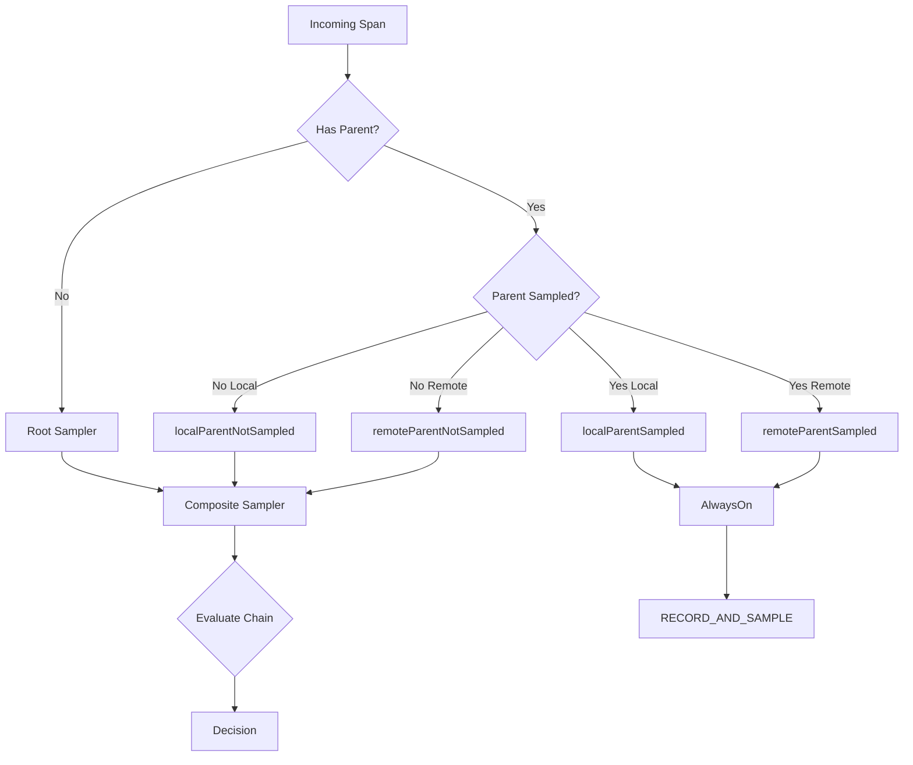

# How to Build Composite Sampling in OpenTelemetry

Author: [nawazdhandala](https://github.com/nawazdhandala)

Tags: Tracing, Sampling, Observability, OpenTelemetry

Description: Learn how to combine multiple sampling strategies into a single composite sampler for precise, cost-effective trace collection.

---

Single samplers are rarely enough. You want to keep all errors, sample high-latency requests, capture specific user tiers, and still maintain a baseline probabilistic sample. Trying to do this with one sampler is awkward. The solution: composite sampling.

A composite sampler chains multiple sampling strategies together, evaluating them in sequence or priority order until a decision is made. This gives you fine-grained control over which traces you keep without writing complex conditional logic everywhere.

This guide walks through the concepts, architecture, and implementation of composite samplers in OpenTelemetry for Node.js/TypeScript.

---

## Why Composite Sampling?

| Scenario | Single Sampler Problem | Composite Solution |
|----------|------------------------|-------------------|
| Keep 100% errors + 10% of everything else | TraceIdRatio misses most errors | Error sampler (priority 1) + Ratio sampler (fallback) |
| VIP customers always traced | No built-in "attribute-based" sampler | Attribute sampler + probabilistic fallback |
| Different rates per service/endpoint | One rate for all | Route-based sampler chain |
| Debug mode for specific trace IDs | Static config cannot adapt | Feature-flag sampler + default chain |

The pattern: stack specialized samplers from highest to lowest priority. First match wins.

---

## Sampling Decision Flow



Each sampler in the chain gets a chance to claim the span. If it returns `RECORD_AND_SAMPLE`, the chain stops. If it returns `NOT_RECORD` or defers, the next sampler evaluates.

---

## Core Concepts

### Sampler Interface

Every OpenTelemetry sampler implements the `Sampler` interface:

```typescript
interface Sampler {
  shouldSample(
    context: Context,
    traceId: string,
    spanName: string,
    spanKind: SpanKind,
    attributes: Attributes,
    links: Link[]
  ): SamplingResult;

  toString(): string;
}

interface SamplingResult {
  decision: SamplingDecision;
  attributes?: Attributes;
  traceState?: TraceState;
}

enum SamplingDecision {
  NOT_RECORD = 0,        // Drop the span
  RECORD = 1,            // Record but don't export
  RECORD_AND_SAMPLE = 2  // Record and export
}
```

### Composite Sampler Pattern

A composite sampler wraps multiple samplers and orchestrates their evaluation:

```typescript
class CompositeSampler implements Sampler {
  private samplers: Sampler[];

  constructor(samplers: Sampler[]) {
    this.samplers = samplers;
  }

  shouldSample(
    context: Context,
    traceId: string,
    spanName: string,
    spanKind: SpanKind,
    attributes: Attributes,
    links: Link[]
  ): SamplingResult {
    for (const sampler of this.samplers) {
      const result = sampler.shouldSample(
        context, traceId, spanName, spanKind, attributes, links
      );

      if (result.decision === SamplingDecision.RECORD_AND_SAMPLE) {
        return result;
      }
    }

    // No sampler claimed it, drop by default
    return { decision: SamplingDecision.NOT_RECORD };
  }

  toString(): string {
    return `CompositeSampler{${this.samplers.map(s => s.toString()).join(', ')}}`;
  }
}
```

---

## Building Custom Samplers

Before composing, you need samplers to compose. Here are reusable building blocks.

### Error-Based Sampler

Always keeps spans that have error status or error attributes:

```typescript
import {
  Sampler, SamplingResult, SamplingDecision,
  Context, SpanKind, Attributes, Link
} from '@opentelemetry/api';

class ErrorSampler implements Sampler {
  shouldSample(
    context: Context,
    traceId: string,
    spanName: string,
    spanKind: SpanKind,
    attributes: Attributes,
    links: Link[]
  ): SamplingResult {
    // Check for error indicators in attributes
    const hasError =
      attributes['error'] === true ||
      attributes['http.status_code'] >= 400 ||
      attributes['exception.type'] !== undefined;

    if (hasError) {
      return {
        decision: SamplingDecision.RECORD_AND_SAMPLE,
        attributes: { 'sampling.reason': 'error' }
      };
    }

    // Defer to next sampler
    return { decision: SamplingDecision.NOT_RECORD };
  }

  toString(): string {
    return 'ErrorSampler';
  }
}
```

### Attribute-Based Sampler

Samples based on span attributes (useful for VIP customers, specific routes, etc.):

```typescript
interface AttributeRule {
  key: string;
  values: (string | number | boolean)[];
  sampleRate?: number; // Optional: 1.0 means always, 0.5 means 50%
}

class AttributeSampler implements Sampler {
  private rules: AttributeRule[];

  constructor(rules: AttributeRule[]) {
    this.rules = rules;
  }

  shouldSample(
    context: Context,
    traceId: string,
    spanName: string,
    spanKind: SpanKind,
    attributes: Attributes,
    links: Link[]
  ): SamplingResult {
    for (const rule of this.rules) {
      const attrValue = attributes[rule.key];

      if (attrValue !== undefined && rule.values.includes(attrValue as any)) {
        const rate = rule.sampleRate ?? 1.0;

        if (rate >= 1.0 || Math.random() < rate) {
          return {
            decision: SamplingDecision.RECORD_AND_SAMPLE,
            attributes: {
              'sampling.reason': 'attribute_match',
              'sampling.rule': rule.key
            }
          };
        }
      }
    }

    return { decision: SamplingDecision.NOT_RECORD };
  }

  toString(): string {
    return `AttributeSampler{rules=${this.rules.length}}`;
  }
}
```

### Latency-Based Sampler (Head Sampling Variant)

For head sampling, you cannot know the actual latency. But you can use expected latency thresholds based on span name or kind:

```typescript
interface LatencyRule {
  spanNamePattern: RegExp;
  expectedMaxMs: number;
}

class ExpectedLatencySampler implements Sampler {
  private rules: LatencyRule[];

  constructor(rules: LatencyRule[]) {
    this.rules = rules;
  }

  shouldSample(
    context: Context,
    traceId: string,
    spanName: string,
    spanKind: SpanKind,
    attributes: Attributes,
    links: Link[]
  ): SamplingResult {
    // For head sampling, we sample endpoints known to be slow
    // Actual latency-based sampling requires tail sampling in Collector
    for (const rule of this.rules) {
      if (rule.spanNamePattern.test(spanName)) {
        return {
          decision: SamplingDecision.RECORD_AND_SAMPLE,
          attributes: { 'sampling.reason': 'slow_endpoint' }
        };
      }
    }

    return { decision: SamplingDecision.NOT_RECORD };
  }

  toString(): string {
    return `ExpectedLatencySampler{rules=${this.rules.length}}`;
  }
}
```

### Rate-Limited Sampler

Caps the number of sampled traces per second to control costs:

```typescript
class RateLimitedSampler implements Sampler {
  private maxPerSecond: number;
  private tokenBucket: number;
  private lastRefill: number;
  private innerSampler: Sampler;

  constructor(maxPerSecond: number, innerSampler: Sampler) {
    this.maxPerSecond = maxPerSecond;
    this.tokenBucket = maxPerSecond;
    this.lastRefill = Date.now();
    this.innerSampler = innerSampler;
  }

  private refillTokens(): void {
    const now = Date.now();
    const elapsed = (now - this.lastRefill) / 1000;
    this.tokenBucket = Math.min(
      this.maxPerSecond,
      this.tokenBucket + elapsed * this.maxPerSecond
    );
    this.lastRefill = now;
  }

  shouldSample(
    context: Context,
    traceId: string,
    spanName: string,
    spanKind: SpanKind,
    attributes: Attributes,
    links: Link[]
  ): SamplingResult {
    this.refillTokens();

    const innerResult = this.innerSampler.shouldSample(
      context, traceId, spanName, spanKind, attributes, links
    );

    if (innerResult.decision === SamplingDecision.RECORD_AND_SAMPLE) {
      if (this.tokenBucket >= 1) {
        this.tokenBucket -= 1;
        return innerResult;
      }
      // Rate limit exceeded, drop even though inner sampler said yes
      return {
        decision: SamplingDecision.NOT_RECORD,
        attributes: { 'sampling.dropped_reason': 'rate_limit' }
      };
    }

    return innerResult;
  }

  toString(): string {
    return `RateLimitedSampler{max=${this.maxPerSecond}, inner=${this.innerSampler}}`;
  }
}
```

---

## Priority-Based Composite Sampler

The simplest composite pattern: evaluate samplers in priority order. First one that returns `RECORD_AND_SAMPLE` wins.

```typescript
import {
  Sampler, SamplingResult, SamplingDecision,
  Context, SpanKind, Attributes, Link
} from '@opentelemetry/api';
import { TraceIdRatioBasedSampler } from '@opentelemetry/sdk-trace-base';

class PriorityCompositeSampler implements Sampler {
  private samplers: { sampler: Sampler; priority: number }[];

  constructor(samplers: { sampler: Sampler; priority: number }[]) {
    // Sort by priority (higher number = higher priority)
    this.samplers = [...samplers].sort((a, b) => b.priority - a.priority);
  }

  shouldSample(
    context: Context,
    traceId: string,
    spanName: string,
    spanKind: SpanKind,
    attributes: Attributes,
    links: Link[]
  ): SamplingResult {
    for (const { sampler } of this.samplers) {
      const result = sampler.shouldSample(
        context, traceId, spanName, spanKind, attributes, links
      );

      if (result.decision === SamplingDecision.RECORD_AND_SAMPLE) {
        return result;
      }
    }

    return { decision: SamplingDecision.NOT_RECORD };
  }

  toString(): string {
    return `PriorityCompositeSampler{${this.samplers.map(s =>
      `${s.sampler}@${s.priority}`).join(', ')}}`;
  }
}

// Usage
const compositeSampler = new PriorityCompositeSampler([
  { sampler: new ErrorSampler(), priority: 100 },
  { sampler: new AttributeSampler([
    { key: 'customer.tier', values: ['enterprise', 'premium'] }
  ]), priority: 90 },
  { sampler: new ExpectedLatencySampler([
    { spanNamePattern: /checkout|payment/, expectedMaxMs: 500 }
  ]), priority: 80 },
  { sampler: new TraceIdRatioBasedSampler(0.1), priority: 10 }
]);
```

---

## Decision Flow for Priority Sampler



---

## AND/OR Composite Patterns

Sometimes you need more complex logic than simple priority chains.

### AND Sampler (All Must Agree)

```typescript
class AndSampler implements Sampler {
  private samplers: Sampler[];

  constructor(samplers: Sampler[]) {
    this.samplers = samplers;
  }

  shouldSample(
    context: Context,
    traceId: string,
    spanName: string,
    spanKind: SpanKind,
    attributes: Attributes,
    links: Link[]
  ): SamplingResult {
    const mergedAttributes: Attributes = {};

    for (const sampler of this.samplers) {
      const result = sampler.shouldSample(
        context, traceId, spanName, spanKind, attributes, links
      );

      if (result.decision !== SamplingDecision.RECORD_AND_SAMPLE) {
        return { decision: SamplingDecision.NOT_RECORD };
      }

      Object.assign(mergedAttributes, result.attributes || {});
    }

    return {
      decision: SamplingDecision.RECORD_AND_SAMPLE,
      attributes: mergedAttributes
    };
  }

  toString(): string {
    return `AndSampler{${this.samplers.join(' AND ')}}`;
  }
}
```

### OR Sampler (Any Can Approve)

```typescript
class OrSampler implements Sampler {
  private samplers: Sampler[];

  constructor(samplers: Sampler[]) {
    this.samplers = samplers;
  }

  shouldSample(
    context: Context,
    traceId: string,
    spanName: string,
    spanKind: SpanKind,
    attributes: Attributes,
    links: Link[]
  ): SamplingResult {
    for (const sampler of this.samplers) {
      const result = sampler.shouldSample(
        context, traceId, spanName, spanKind, attributes, links
      );

      if (result.decision === SamplingDecision.RECORD_AND_SAMPLE) {
        return result;
      }
    }

    return { decision: SamplingDecision.NOT_RECORD };
  }

  toString(): string {
    return `OrSampler{${this.samplers.join(' OR ')}}`;
  }
}
```

### Complex Logic Example

Sample if: (error OR VIP customer) AND rate limit not exceeded

```typescript
const complexSampler = new AndSampler([
  new OrSampler([
    new ErrorSampler(),
    new AttributeSampler([{ key: 'customer.tier', values: ['enterprise'] }])
  ]),
  new RateLimitedSampler(100, new AlwaysOnSampler())
]);
```

---

## Integrating with OpenTelemetry SDK

Wire up the composite sampler in your telemetry initialization:

```typescript
// telemetry.ts
import { NodeSDK } from '@opentelemetry/sdk-node';
import { getNodeAutoInstrumentations } from '@opentelemetry/auto-instrumentations-node';
import { OTLPTraceExporter } from '@opentelemetry/exporter-trace-otlp-http';
import { Resource } from '@opentelemetry/resources';
import {
  ParentBasedSampler,
  TraceIdRatioBasedSampler,
  AlwaysOnSampler
} from '@opentelemetry/sdk-trace-base';
import { SemanticResourceAttributes } from '@opentelemetry/semantic-conventions';

// Import your custom samplers
import { PriorityCompositeSampler, ErrorSampler, AttributeSampler } from './samplers';

const traceExporter = new OTLPTraceExporter({
  url: process.env.OTEL_EXPORTER_OTLP_ENDPOINT || 'https://oneuptime.com/otlp/v1/traces',
  headers: { 'x-oneuptime-token': process.env.ONEUPTIME_TOKEN || '' },
});

// Build composite sampler
const rootSampler = new PriorityCompositeSampler([
  { sampler: new ErrorSampler(), priority: 100 },
  { sampler: new AttributeSampler([
    { key: 'customer.tier', values: ['enterprise', 'premium'], sampleRate: 1.0 },
    { key: 'http.route', values: ['/checkout', '/payment'], sampleRate: 0.5 }
  ]), priority: 90 },
  { sampler: new TraceIdRatioBasedSampler(0.1), priority: 10 }
]);

// Wrap in ParentBasedSampler to respect parent trace decisions
const sampler = new ParentBasedSampler({
  root: rootSampler,
  remoteParentSampled: new AlwaysOnSampler(),
  remoteParentNotSampled: rootSampler, // Re-evaluate for remote unsampled
  localParentSampled: new AlwaysOnSampler(),
  localParentNotSampled: rootSampler
});

export const sdk = new NodeSDK({
  traceExporter,
  sampler,
  resource: new Resource({
    [SemanticResourceAttributes.SERVICE_NAME]: 'api-service',
    [SemanticResourceAttributes.SERVICE_VERSION]: '2.1.0',
  }),
  instrumentations: [getNodeAutoInstrumentations()],
});

sdk.start();
```

---

## ParentBasedSampler Integration



The `ParentBasedSampler` wrapper ensures that:
- Root spans use your composite logic
- Child spans of sampled parents stay sampled (trace consistency)
- Child spans of unsampled parents can be re-evaluated or dropped

---

## OpenTelemetry Collector Tail Sampling

Head sampling (in SDK) decides before the span completes. Tail sampling (in Collector) decides after seeing the full trace. Combine both for best results.

Collector config for composite tail sampling:

```yaml
processors:
  tail_sampling:
    decision_wait: 10s
    num_traces: 100000
    expected_new_traces_per_sec: 1000
    policies:
      # Priority 1: Always keep errors
      - name: errors-policy
        type: status_code
        status_code:
          status_codes: [ERROR]

      # Priority 2: Always keep high latency
      - name: latency-policy
        type: latency
        latency:
          threshold_ms: 1000

      # Priority 3: Keep specific attributes
      - name: vip-customers
        type: string_attribute
        string_attribute:
          key: customer.tier
          values: [enterprise, premium]

      # Priority 4: Keep specific routes at higher rate
      - name: critical-routes
        type: and
        and:
          and_sub_policy:
            - name: route-match
              type: string_attribute
              string_attribute:
                key: http.route
                values: ["/checkout", "/payment", "/order"]
            - name: route-sample
              type: probabilistic
              probabilistic:
                sampling_percentage: 50

      # Fallback: Probabilistic baseline
      - name: baseline
        type: probabilistic
        probabilistic:
          sampling_percentage: 5

service:
  pipelines:
    traces:
      receivers: [otlp]
      processors: [tail_sampling, batch]
      exporters: [otlp]
```

---

## Full Implementation Example

Here is a complete, production-ready composite sampler module:

```typescript
// samplers/index.ts
import {
  Sampler,
  SamplingResult,
  SamplingDecision,
  Context,
  SpanKind,
  Attributes,
  Link,
} from '@opentelemetry/api';
import { TraceIdRatioBasedSampler, AlwaysOnSampler } from '@opentelemetry/sdk-trace-base';

// Re-export built-in samplers
export { TraceIdRatioBasedSampler, AlwaysOnSampler };

// Error sampler
export class ErrorSampler implements Sampler {
  shouldSample(
    _context: Context,
    _traceId: string,
    _spanName: string,
    _spanKind: SpanKind,
    attributes: Attributes
  ): SamplingResult {
    const isError =
      attributes['error'] === true ||
      (typeof attributes['http.status_code'] === 'number' &&
       attributes['http.status_code'] >= 400) ||
      attributes['exception.type'] !== undefined ||
      attributes['otel.status_code'] === 'ERROR';

    if (isError) {
      return {
        decision: SamplingDecision.RECORD_AND_SAMPLE,
        attributes: { 'sampling.reason': 'error' },
      };
    }
    return { decision: SamplingDecision.NOT_RECORD };
  }

  toString(): string {
    return 'ErrorSampler';
  }
}

// Attribute sampler
export interface AttributeRule {
  key: string;
  values: (string | number | boolean)[];
  sampleRate?: number;
}

export class AttributeSampler implements Sampler {
  constructor(private rules: AttributeRule[]) {}

  shouldSample(
    _context: Context,
    _traceId: string,
    _spanName: string,
    _spanKind: SpanKind,
    attributes: Attributes
  ): SamplingResult {
    for (const rule of this.rules) {
      const value = attributes[rule.key];
      if (value !== undefined && rule.values.includes(value as any)) {
        const rate = rule.sampleRate ?? 1.0;
        if (Math.random() < rate) {
          return {
            decision: SamplingDecision.RECORD_AND_SAMPLE,
            attributes: { 'sampling.reason': `attribute:${rule.key}` },
          };
        }
      }
    }
    return { decision: SamplingDecision.NOT_RECORD };
  }

  toString(): string {
    return `AttributeSampler{${this.rules.length} rules}`;
  }
}

// Span name pattern sampler
export class SpanNameSampler implements Sampler {
  constructor(
    private patterns: RegExp[],
    private sampleRate: number = 1.0
  ) {}

  shouldSample(
    _context: Context,
    _traceId: string,
    spanName: string
  ): SamplingResult {
    for (const pattern of this.patterns) {
      if (pattern.test(spanName)) {
        if (Math.random() < this.sampleRate) {
          return {
            decision: SamplingDecision.RECORD_AND_SAMPLE,
            attributes: { 'sampling.reason': 'span_name_match' },
          };
        }
      }
    }
    return { decision: SamplingDecision.NOT_RECORD };
  }

  toString(): string {
    return `SpanNameSampler{${this.patterns.length} patterns}`;
  }
}

// Priority composite sampler
export interface PrioritySamplerEntry {
  sampler: Sampler;
  priority: number;
}

export class PriorityCompositeSampler implements Sampler {
  private sorted: PrioritySamplerEntry[];

  constructor(entries: PrioritySamplerEntry[]) {
    this.sorted = [...entries].sort((a, b) => b.priority - a.priority);
  }

  shouldSample(
    context: Context,
    traceId: string,
    spanName: string,
    spanKind: SpanKind,
    attributes: Attributes,
    links: Link[]
  ): SamplingResult {
    for (const { sampler } of this.sorted) {
      const result = sampler.shouldSample(
        context,
        traceId,
        spanName,
        spanKind,
        attributes,
        links
      );
      if (result.decision === SamplingDecision.RECORD_AND_SAMPLE) {
        return result;
      }
    }
    return { decision: SamplingDecision.NOT_RECORD };
  }

  toString(): string {
    return `PriorityComposite{${this.sorted.map((e) => `${e.sampler}@p${e.priority}`).join(',')}}`;
  }
}

// AND sampler
export class AndSampler implements Sampler {
  constructor(private samplers: Sampler[]) {}

  shouldSample(
    context: Context,
    traceId: string,
    spanName: string,
    spanKind: SpanKind,
    attributes: Attributes,
    links: Link[]
  ): SamplingResult {
    const merged: Attributes = {};
    for (const sampler of this.samplers) {
      const result = sampler.shouldSample(
        context,
        traceId,
        spanName,
        spanKind,
        attributes,
        links
      );
      if (result.decision !== SamplingDecision.RECORD_AND_SAMPLE) {
        return { decision: SamplingDecision.NOT_RECORD };
      }
      Object.assign(merged, result.attributes || {});
    }
    return { decision: SamplingDecision.RECORD_AND_SAMPLE, attributes: merged };
  }

  toString(): string {
    return `And{${this.samplers.join(' && ')}}`;
  }
}

// OR sampler
export class OrSampler implements Sampler {
  constructor(private samplers: Sampler[]) {}

  shouldSample(
    context: Context,
    traceId: string,
    spanName: string,
    spanKind: SpanKind,
    attributes: Attributes,
    links: Link[]
  ): SamplingResult {
    for (const sampler of this.samplers) {
      const result = sampler.shouldSample(
        context,
        traceId,
        spanName,
        spanKind,
        attributes,
        links
      );
      if (result.decision === SamplingDecision.RECORD_AND_SAMPLE) {
        return result;
      }
    }
    return { decision: SamplingDecision.NOT_RECORD };
  }

  toString(): string {
    return `Or{${this.samplers.join(' || ')}}`;
  }
}
```

---

## Common Patterns

### Pattern 1: Error + VIP + Baseline

```typescript
const sampler = new PriorityCompositeSampler([
  { sampler: new ErrorSampler(), priority: 100 },
  { sampler: new AttributeSampler([
    { key: 'customer.tier', values: ['enterprise'] }
  ]), priority: 50 },
  { sampler: new TraceIdRatioBasedSampler(0.05), priority: 1 }
]);
```

### Pattern 2: Critical Paths at Higher Rate

```typescript
const sampler = new PriorityCompositeSampler([
  { sampler: new ErrorSampler(), priority: 100 },
  { sampler: new SpanNameSampler([/payment/, /checkout/], 0.5), priority: 80 },
  { sampler: new SpanNameSampler([/health/, /metrics/], 0.0), priority: 70 },
  { sampler: new TraceIdRatioBasedSampler(0.1), priority: 1 }
]);
```

### Pattern 3: Debug Mode Toggle

```typescript
class DebugModeSampler implements Sampler {
  shouldSample(
    _context: Context,
    _traceId: string,
    _spanName: string,
    _spanKind: SpanKind,
    attributes: Attributes
  ): SamplingResult {
    if (attributes['debug'] === true || process.env.DEBUG_SAMPLING === '1') {
      return {
        decision: SamplingDecision.RECORD_AND_SAMPLE,
        attributes: { 'sampling.reason': 'debug_mode' }
      };
    }
    return { decision: SamplingDecision.NOT_RECORD };
  }

  toString() { return 'DebugModeSampler'; }
}

const sampler = new PriorityCompositeSampler([
  { sampler: new DebugModeSampler(), priority: 1000 },
  { sampler: new ErrorSampler(), priority: 100 },
  { sampler: new TraceIdRatioBasedSampler(0.1), priority: 1 }
]);
```

---

## Testing Your Composite Sampler

```typescript
import { context, SpanKind } from '@opentelemetry/api';
import { PriorityCompositeSampler, ErrorSampler, AttributeSampler } from './samplers';
import { TraceIdRatioBasedSampler } from '@opentelemetry/sdk-trace-base';

describe('PriorityCompositeSampler', () => {
  const sampler = new PriorityCompositeSampler([
    { sampler: new ErrorSampler(), priority: 100 },
    { sampler: new AttributeSampler([
      { key: 'customer.tier', values: ['enterprise'] }
    ]), priority: 50 },
    { sampler: new TraceIdRatioBasedSampler(0.0), priority: 1 } // 0% baseline for testing
  ]);

  it('samples errors regardless of other attributes', () => {
    const result = sampler.shouldSample(
      context.active(),
      'abc123',
      'http.request',
      SpanKind.SERVER,
      { 'http.status_code': 500 },
      []
    );
    expect(result.decision).toBe(2); // RECORD_AND_SAMPLE
    expect(result.attributes?.['sampling.reason']).toBe('error');
  });

  it('samples enterprise customers', () => {
    const result = sampler.shouldSample(
      context.active(),
      'abc123',
      'http.request',
      SpanKind.SERVER,
      { 'customer.tier': 'enterprise' },
      []
    );
    expect(result.decision).toBe(2);
  });

  it('drops regular traffic with 0% baseline', () => {
    const result = sampler.shouldSample(
      context.active(),
      'abc123',
      'http.request',
      SpanKind.SERVER,
      { 'customer.tier': 'free' },
      []
    );
    expect(result.decision).toBe(0); // NOT_RECORD
  });
});
```

---

## Key Takeaways

1. **Composite samplers chain multiple strategies** in priority order for fine-grained control
2. **Error and VIP samplers should have highest priority** to ensure you never miss critical traces
3. **Use AND/OR combinators** for complex conditional logic
4. **Wrap with ParentBasedSampler** to maintain trace consistency across service boundaries
5. **Combine head sampling (SDK) with tail sampling (Collector)** for optimal coverage and cost control
6. **Add sampling reason attributes** to understand why traces were kept during analysis
7. **Test your sampler logic** to verify priority ordering and edge cases

Composite sampling gives you the control to balance observability needs against cost constraints. Build your sampler chain thoughtfully, monitor your sampling rates, and adjust priorities as your system evolves.

---

**Related Reading:**

- [How to reduce noise in OpenTelemetry](https://oneuptime.com/blog/post/2025-08-25-how-to-reduce-noise-in-opentelemetry/view)
- [Traces and Spans in OpenTelemetry](https://oneuptime.com/blog/post/2025-08-27-traces-and-spans-in-opentelemetry/view)
- [What is OpenTelemetry Collector and Why Use One](https://oneuptime.com/blog/post/2025-09-18-what-is-opentelemetry-collector-and-why-use-one/view)
