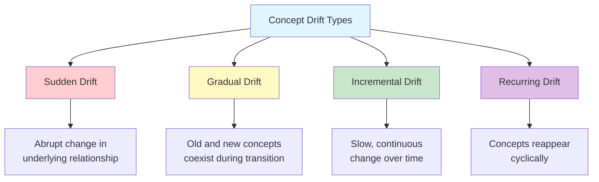
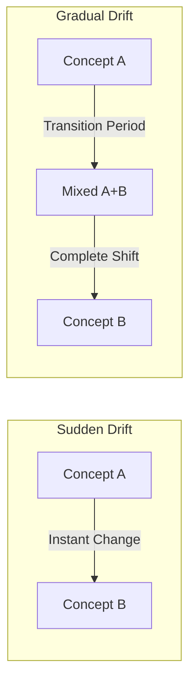
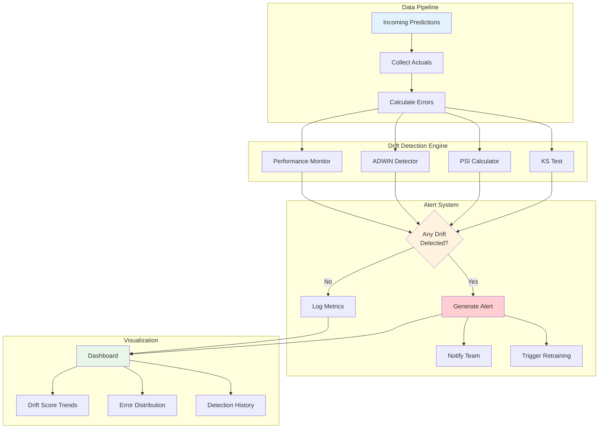
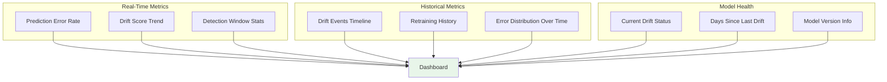

# How to Implement Concept Drift Detection

Author: [nawazdhandala](https://github.com/nawazdhandala)

Tags: MLOps, Machine Learning, Drift Detection, Monitoring

Description: Learn how to detect concept drift when the relationship between inputs and targets changes.

---

## Introduction

Concept drift is one of the most challenging problems in production machine learning systems. Unlike data drift, which occurs when input data distributions change, concept drift happens when the relationship between input features and target variables shifts over time. This means your model's learned patterns become outdated, even if the input data looks similar.

In this guide, we will explore practical approaches to detecting concept drift, including statistical methods, monitoring strategies, and implementation examples you can use in your ML pipelines.

## Understanding Concept Drift

Before diving into detection methods, let us understand the different types of concept drift and why they occur.

### Types of Concept Drift



### Sudden vs Gradual Drift

**Sudden Drift** occurs when the underlying concept changes abruptly. For example:
- A fraud detection model faces a new type of attack pattern
- Regulatory changes instantly alter customer behavior
- A competitor launches a disruptive product

**Gradual Drift** happens when the concept slowly transitions from one state to another:
- Customer preferences evolving over months
- Economic conditions slowly shifting market dynamics
- Seasonal patterns blending into each other



## Concept Drift Detection Methods

### 1. Performance-Based Detection

The most direct approach is monitoring model performance metrics over time. When performance degrades significantly, concept drift may be the cause.

```python
import numpy as np
from scipy import stats
from typing import List, Tuple, Optional
from dataclasses import dataclass
from collections import deque


@dataclass
class DriftDetectionResult:
    """
    Container for drift detection results.

    Attributes:
        is_drift_detected: Boolean indicating if drift was detected
        drift_score: Numeric score indicating drift severity
        p_value: Statistical p-value (if applicable)
        detection_method: Name of the detection method used
    """
    is_drift_detected: bool
    drift_score: float
    p_value: Optional[float] = None
    detection_method: str = ""


class PerformanceBasedDriftDetector:
    """
    Detects concept drift by monitoring model performance metrics.

    This detector compares recent performance against a reference
    window using statistical tests. Significant degradation triggers
    a drift alert.
    """

    def __init__(
        self,
        reference_window_size: int = 1000,
        detection_window_size: int = 100,
        significance_level: float = 0.05
    ):
        """
        Initialize the drift detector.

        Args:
            reference_window_size: Number of samples in reference window
            detection_window_size: Number of recent samples to compare
            significance_level: P-value threshold for drift detection
        """
        self.reference_window_size = reference_window_size
        self.detection_window_size = detection_window_size
        self.significance_level = significance_level

        # Use deque for efficient sliding window operations
        self.reference_errors: deque = deque(maxlen=reference_window_size)
        self.detection_errors: deque = deque(maxlen=detection_window_size)

    def update(self, prediction: float, actual: float) -> None:
        """
        Update detector with a new prediction-actual pair.

        Args:
            prediction: Model's predicted value
            actual: Ground truth value
        """
        # Calculate absolute error for this sample
        error = abs(prediction - actual)

        # Add to detection window first
        self.detection_errors.append(error)

        # Move oldest detection samples to reference when detection is full
        if len(self.detection_errors) == self.detection_window_size:
            if len(self.reference_errors) < self.reference_window_size:
                # Still building reference window
                self.reference_errors.append(error)

    def detect(self) -> DriftDetectionResult:
        """
        Check if concept drift has occurred.

        Uses a two-sample t-test to compare error distributions
        between reference and detection windows.

        Returns:
            DriftDetectionResult with detection outcome
        """
        # Need sufficient samples in both windows
        if (len(self.reference_errors) < self.reference_window_size // 2 or
            len(self.detection_errors) < self.detection_window_size // 2):
            return DriftDetectionResult(
                is_drift_detected=False,
                drift_score=0.0,
                p_value=None,
                detection_method="performance_ttest"
            )

        # Convert to arrays for statistical test
        reference_array = np.array(self.reference_errors)
        detection_array = np.array(self.detection_errors)

        # Perform Welch's t-test (does not assume equal variances)
        # Alternative='greater' tests if detection errors are higher
        t_statistic, p_value = stats.ttest_ind(
            detection_array,
            reference_array,
            equal_var=False,
            alternative='greater'
        )

        # Calculate effect size (Cohen's d) for drift severity
        pooled_std = np.sqrt(
            (np.var(reference_array) + np.var(detection_array)) / 2
        )
        effect_size = (
            (np.mean(detection_array) - np.mean(reference_array)) / pooled_std
            if pooled_std > 0 else 0
        )

        return DriftDetectionResult(
            is_drift_detected=p_value < self.significance_level,
            drift_score=effect_size,
            p_value=p_value,
            detection_method="performance_ttest"
        )


# Example usage
if __name__ == "__main__":
    # Create detector instance
    detector = PerformanceBasedDriftDetector(
        reference_window_size=500,
        detection_window_size=50,
        significance_level=0.05
    )

    # Simulate stable period (low errors)
    np.random.seed(42)
    for _ in range(500):
        pred = np.random.normal(100, 5)
        actual = pred + np.random.normal(0, 2)  # Small error
        detector.update(pred, actual)

    # Simulate concept drift (higher errors)
    for _ in range(50):
        pred = np.random.normal(100, 5)
        actual = pred + np.random.normal(10, 5)  # Larger systematic error
        detector.update(pred, actual)

    # Check for drift
    result = detector.detect()
    print(f"Drift Detected: {result.is_drift_detected}")
    print(f"Drift Score: {result.drift_score:.4f}")
    print(f"P-value: {result.p_value:.6f}")
```

### 2. Page-Hinkley Test

The Page-Hinkley test is a sequential analysis technique that detects changes in the average of a Gaussian signal. It is particularly effective for detecting gradual drift.

```python
class PageHinkleyDetector:
    """
    Page-Hinkley test for concept drift detection.

    This method monitors the cumulative difference between observed
    values and their mean. When this cumulative sum exceeds a threshold,
    drift is signaled.

    Particularly effective for detecting gradual drift in streaming data.
    """

    def __init__(
        self,
        delta: float = 0.005,
        lambda_threshold: float = 50.0,
        alpha: float = 0.9999
    ):
        """
        Initialize Page-Hinkley detector.

        Args:
            delta: Magnitude of acceptable change (tolerance)
            lambda_threshold: Detection threshold for cumulative sum
            alpha: Forgetting factor for mean estimation (0.99-0.9999)
        """
        self.delta = delta
        self.lambda_threshold = lambda_threshold
        self.alpha = alpha

        # Running statistics
        self.mean: float = 0.0
        self.sum: float = 0.0
        self.min_sum: float = float('inf')
        self.sample_count: int = 0

    def update(self, value: float) -> DriftDetectionResult:
        """
        Process a new sample and check for drift.

        Args:
            value: New observation (typically prediction error)

        Returns:
            DriftDetectionResult indicating current drift status
        """
        self.sample_count += 1

        # Update running mean with exponential smoothing
        if self.sample_count == 1:
            self.mean = value
        else:
            self.mean = self.alpha * self.mean + (1 - self.alpha) * value

        # Update cumulative sum
        # Subtracting delta allows for small acceptable changes
        self.sum += value - self.mean - self.delta

        # Track minimum sum seen so far
        self.min_sum = min(self.min_sum, self.sum)

        # Page-Hinkley statistic: difference from minimum
        ph_statistic = self.sum - self.min_sum

        # Drift detected if statistic exceeds threshold
        is_drift = ph_statistic > self.lambda_threshold

        return DriftDetectionResult(
            is_drift_detected=is_drift,
            drift_score=ph_statistic / self.lambda_threshold,
            p_value=None,  # PH test does not produce p-values
            detection_method="page_hinkley"
        )

    def reset(self) -> None:
        """Reset detector state after drift is handled."""
        self.mean = 0.0
        self.sum = 0.0
        self.min_sum = float('inf')
        self.sample_count = 0


# Demonstration of Page-Hinkley test
def demonstrate_page_hinkley():
    """Show how Page-Hinkley detects gradual drift."""
    detector = PageHinkleyDetector(
        delta=0.01,
        lambda_threshold=25.0,
        alpha=0.999
    )

    results = []

    # Phase 1: Stable performance (error around 0.1)
    for i in range(200):
        error = np.random.normal(0.1, 0.02)
        result = detector.update(error)
        results.append((i, error, result.drift_score, result.is_drift_detected))

    # Phase 2: Gradual drift (error slowly increasing)
    for i in range(200, 400):
        # Linear increase in error
        drift_factor = (i - 200) / 200 * 0.15
        error = np.random.normal(0.1 + drift_factor, 0.02)
        result = detector.update(error)
        results.append((i, error, result.drift_score, result.is_drift_detected))

        if result.is_drift_detected:
            print(f"Drift detected at sample {i}")
            print(f"Drift score: {result.drift_score:.4f}")
            break

    return results
```

### 3. ADWIN (Adaptive Windowing)

ADWIN is a popular algorithm that automatically adjusts its window size based on detected changes. It maintains a sliding window and splits it when a significant difference is found.

```python
class ADWINDetector:
    """
    ADWIN (Adaptive Windowing) drift detector.

    ADWIN maintains a variable-length window of recent data.
    When statistical evidence suggests the mean has changed,
    it drops the older portion of the window.

    Key advantage: No need to manually set window sizes.
    """

    def __init__(self, delta: float = 0.002):
        """
        Initialize ADWIN detector.

        Args:
            delta: Confidence parameter for change detection.
                   Smaller values mean higher confidence required.
        """
        self.delta = delta
        self.window: List[float] = []
        self.total: float = 0.0
        self.variance: float = 0.0
        self.width: int = 0

    def _calculate_epsilon(self, n1: int, n2: int) -> float:
        """
        Calculate the epsilon threshold for comparing subwindows.

        Args:
            n1: Size of first subwindow
            n2: Size of second subwindow

        Returns:
            Epsilon threshold based on Hoeffding bound
        """
        n = n1 + n2
        # Harmonic mean factor
        m = 1.0 / n1 + 1.0 / n2

        # Hoeffding bound calculation
        epsilon = np.sqrt(
            (2.0 / m) * np.log(2.0 / self.delta) / n
        ) + (2.0 / 3.0) * np.log(2.0 / self.delta) * m

        return epsilon

    def update(self, value: float) -> DriftDetectionResult:
        """
        Add a new value and check for drift.

        Args:
            value: New observation (typically 0/1 for correct/incorrect
                   or continuous error value)

        Returns:
            DriftDetectionResult with drift status
        """
        # Add new element to window
        self.window.append(value)
        self.total += value
        self.width = len(self.window)

        is_drift = False
        drift_score = 0.0

        # Need at least a few samples
        if self.width < 10:
            return DriftDetectionResult(
                is_drift_detected=False,
                drift_score=0.0,
                detection_method="adwin"
            )

        # Try different split points to find significant change
        for split_point in range(5, self.width - 5):
            # Calculate means for both subwindows
            window_1 = self.window[:split_point]
            window_2 = self.window[split_point:]

            n1 = len(window_1)
            n2 = len(window_2)

            mean_1 = sum(window_1) / n1
            mean_2 = sum(window_2) / n2

            # Calculate threshold
            epsilon = self._calculate_epsilon(n1, n2)

            # Check if means differ significantly
            mean_diff = abs(mean_1 - mean_2)

            if mean_diff > epsilon:
                # Drift detected: drop the older subwindow
                self.window = window_2
                self.total = sum(self.window)
                self.width = len(self.window)
                is_drift = True
                drift_score = mean_diff / epsilon
                break

        return DriftDetectionResult(
            is_drift_detected=is_drift,
            drift_score=drift_score,
            detection_method="adwin"
        )

    def get_window_size(self) -> int:
        """Return current window size."""
        return self.width
```

## Statistical Tests for Concept Drift

### Kolmogorov-Smirnov Test for Error Distribution Changes

```python
from scipy.stats import ks_2samp, wasserstein_distance


class ErrorDistributionDriftDetector:
    """
    Detects concept drift by comparing error distributions.

    Uses the Kolmogorov-Smirnov test to determine if the
    distribution of prediction errors has changed significantly.
    """

    def __init__(
        self,
        reference_size: int = 1000,
        test_size: int = 200,
        significance_level: float = 0.05
    ):
        """
        Initialize the error distribution drift detector.

        Args:
            reference_size: Number of samples in reference distribution
            test_size: Number of samples in test distribution
            significance_level: P-value threshold for significance
        """
        self.reference_size = reference_size
        self.test_size = test_size
        self.significance_level = significance_level

        self.reference_errors: List[float] = []
        self.test_errors: List[float] = []
        self.reference_locked: bool = False

    def add_sample(self, prediction: float, actual: float) -> None:
        """
        Add a new prediction-actual pair.

        Args:
            prediction: Model's predicted value
            actual: Ground truth value
        """
        error = prediction - actual  # Signed error to capture bias shift

        if not self.reference_locked:
            self.reference_errors.append(error)
            if len(self.reference_errors) >= self.reference_size:
                self.reference_locked = True
        else:
            self.test_errors.append(error)
            # Keep test window sliding
            if len(self.test_errors) > self.test_size:
                self.test_errors.pop(0)

    def detect_drift(self) -> DriftDetectionResult:
        """
        Run statistical tests to detect drift.

        Returns:
            DriftDetectionResult with KS test results
        """
        if len(self.test_errors) < self.test_size // 2:
            return DriftDetectionResult(
                is_drift_detected=False,
                drift_score=0.0,
                detection_method="ks_test"
            )

        # Kolmogorov-Smirnov two-sample test
        ks_statistic, p_value = ks_2samp(
            self.reference_errors,
            self.test_errors
        )

        # Also calculate Wasserstein distance as a drift magnitude measure
        w_distance = wasserstein_distance(
            self.reference_errors,
            self.test_errors
        )

        return DriftDetectionResult(
            is_drift_detected=p_value < self.significance_level,
            drift_score=w_distance,
            p_value=p_value,
            detection_method="ks_test"
        )

    def get_statistics(self) -> dict:
        """
        Get detailed statistics about error distributions.

        Returns:
            Dictionary with distribution statistics
        """
        ref_array = np.array(self.reference_errors)
        test_array = np.array(self.test_errors)

        return {
            "reference_mean": float(np.mean(ref_array)),
            "reference_std": float(np.std(ref_array)),
            "test_mean": float(np.mean(test_array)),
            "test_std": float(np.std(test_array)),
            "mean_shift": float(np.mean(test_array) - np.mean(ref_array)),
            "variance_ratio": float(np.var(test_array) / np.var(ref_array))
            if np.var(ref_array) > 0 else 0.0
        }
```

### Population Stability Index (PSI) for Drift Magnitude

```python
class PSIDriftDetector:
    """
    Population Stability Index (PSI) based drift detector.

    PSI measures how much a distribution has shifted from a baseline.
    Originally used in credit scoring, it is excellent for quantifying
    the magnitude of drift.

    Interpretation:
    - PSI < 0.1: No significant drift
    - 0.1 <= PSI < 0.25: Moderate drift, investigate
    - PSI >= 0.25: Significant drift, action required
    """

    def __init__(self, n_bins: int = 10):
        """
        Initialize PSI detector.

        Args:
            n_bins: Number of bins for discretizing continuous values
        """
        self.n_bins = n_bins
        self.reference_distribution: Optional[np.ndarray] = None
        self.bin_edges: Optional[np.ndarray] = None

    def fit_reference(self, reference_data: np.ndarray) -> None:
        """
        Fit the reference distribution.

        Args:
            reference_data: Array of reference values (e.g., errors)
        """
        # Create bins based on reference distribution
        self.reference_distribution, self.bin_edges = np.histogram(
            reference_data,
            bins=self.n_bins,
            density=True
        )

        # Normalize to get proportions
        self.reference_distribution = (
            self.reference_distribution / self.reference_distribution.sum()
        )

        # Add small constant to avoid division by zero
        self.reference_distribution = np.clip(
            self.reference_distribution,
            1e-10,
            None
        )

    def calculate_psi(self, test_data: np.ndarray) -> DriftDetectionResult:
        """
        Calculate PSI for test data against reference.

        Args:
            test_data: Array of test values to compare

        Returns:
            DriftDetectionResult with PSI score
        """
        if self.reference_distribution is None:
            raise ValueError("Must call fit_reference first")

        # Calculate test distribution using same bins
        test_distribution, _ = np.histogram(
            test_data,
            bins=self.bin_edges,
            density=True
        )

        # Normalize
        test_distribution = test_distribution / test_distribution.sum()
        test_distribution = np.clip(test_distribution, 1e-10, None)

        # Calculate PSI
        # PSI = sum((test - ref) * ln(test / ref))
        psi = np.sum(
            (test_distribution - self.reference_distribution) *
            np.log(test_distribution / self.reference_distribution)
        )

        # Determine drift severity
        if psi < 0.1:
            is_drift = False
        elif psi < 0.25:
            is_drift = True  # Moderate drift
        else:
            is_drift = True  # Significant drift

        return DriftDetectionResult(
            is_drift_detected=is_drift,
            drift_score=psi,
            detection_method="psi"
        )


# Example PSI usage
def demonstrate_psi():
    """Demonstrate PSI calculation."""
    detector = PSIDriftDetector(n_bins=10)

    # Reference: errors from stable model
    reference_errors = np.random.normal(0, 1, 1000)
    detector.fit_reference(reference_errors)

    # Test 1: Similar distribution (no drift)
    test_errors_stable = np.random.normal(0, 1, 200)
    result_stable = detector.calculate_psi(test_errors_stable)
    print(f"Stable - PSI: {result_stable.drift_score:.4f}, "
          f"Drift: {result_stable.is_drift_detected}")

    # Test 2: Shifted distribution (concept drift)
    test_errors_shifted = np.random.normal(0.5, 1.2, 200)
    result_shifted = detector.calculate_psi(test_errors_shifted)
    print(f"Shifted - PSI: {result_shifted.drift_score:.4f}, "
          f"Drift: {result_shifted.is_drift_detected}")
```

## Building a Complete Monitoring System



### Complete Monitoring Pipeline

```python
import json
import logging
from datetime import datetime
from typing import Dict, Any, Callable
from abc import ABC, abstractmethod


# Configure logging
logging.basicConfig(
    level=logging.INFO,
    format='%(asctime)s - %(name)s - %(levelname)s - %(message)s'
)
logger = logging.getLogger("concept_drift_monitor")


class AlertHandler(ABC):
    """Abstract base class for alert handlers."""

    @abstractmethod
    def send_alert(self, alert_data: Dict[str, Any]) -> None:
        """Send an alert notification."""
        pass


class LogAlertHandler(AlertHandler):
    """Simple alert handler that logs to console."""

    def send_alert(self, alert_data: Dict[str, Any]) -> None:
        logger.warning(f"DRIFT ALERT: {json.dumps(alert_data, indent=2)}")


class WebhookAlertHandler(AlertHandler):
    """Alert handler that sends to a webhook endpoint."""

    def __init__(self, webhook_url: str):
        self.webhook_url = webhook_url

    def send_alert(self, alert_data: Dict[str, Any]) -> None:
        # In production, use requests library
        # requests.post(self.webhook_url, json=alert_data)
        logger.info(f"Would send to {self.webhook_url}: {alert_data}")


class ConceptDriftMonitor:
    """
    Comprehensive concept drift monitoring system.

    Combines multiple detection methods and provides a unified
    interface for monitoring ML models in production.
    """

    def __init__(
        self,
        model_name: str,
        alert_handlers: List[AlertHandler] = None,
        config: Dict[str, Any] = None
    ):
        """
        Initialize the monitoring system.

        Args:
            model_name: Identifier for the model being monitored
            alert_handlers: List of handlers for drift alerts
            config: Configuration dictionary for detectors
        """
        self.model_name = model_name
        self.alert_handlers = alert_handlers or [LogAlertHandler()]
        self.config = config or {}

        # Initialize all detectors
        self._init_detectors()

        # Metrics storage
        self.metrics_history: List[Dict[str, Any]] = []
        self.alert_history: List[Dict[str, Any]] = []

    def _init_detectors(self) -> None:
        """Initialize all drift detection components."""

        # Performance-based detector
        self.performance_detector = PerformanceBasedDriftDetector(
            reference_window_size=self.config.get("reference_window", 1000),
            detection_window_size=self.config.get("detection_window", 100),
            significance_level=self.config.get("significance_level", 0.05)
        )

        # Page-Hinkley for gradual drift
        self.ph_detector = PageHinkleyDetector(
            delta=self.config.get("ph_delta", 0.005),
            lambda_threshold=self.config.get("ph_threshold", 50.0)
        )

        # ADWIN for adaptive detection
        self.adwin_detector = ADWINDetector(
            delta=self.config.get("adwin_delta", 0.002)
        )

        # Error distribution detector
        self.error_dist_detector = ErrorDistributionDriftDetector(
            reference_size=self.config.get("reference_window", 1000),
            test_size=self.config.get("detection_window", 100)
        )

    def process_prediction(
        self,
        prediction: float,
        actual: float,
        metadata: Dict[str, Any] = None
    ) -> Dict[str, DriftDetectionResult]:
        """
        Process a single prediction and check for drift.

        Args:
            prediction: Model's predicted value
            actual: Ground truth value
            metadata: Optional metadata about the prediction

        Returns:
            Dictionary mapping detector names to their results
        """
        timestamp = datetime.utcnow().isoformat()
        error = abs(prediction - actual)

        # Update all detectors
        self.performance_detector.update(prediction, actual)
        ph_result = self.ph_detector.update(error)
        adwin_result = self.adwin_detector.update(error)
        self.error_dist_detector.add_sample(prediction, actual)

        # Run detection
        results = {
            "performance": self.performance_detector.detect(),
            "page_hinkley": ph_result,
            "adwin": adwin_result,
            "ks_test": self.error_dist_detector.detect_drift()
        }

        # Check if any detector triggered
        any_drift = any(r.is_drift_detected for r in results.values())

        # Record metrics
        metrics = {
            "timestamp": timestamp,
            "prediction": prediction,
            "actual": actual,
            "error": error,
            "drift_detected": any_drift,
            "detector_results": {
                name: {
                    "is_drift": r.is_drift_detected,
                    "score": r.drift_score,
                    "p_value": r.p_value
                }
                for name, r in results.items()
            },
            "metadata": metadata or {}
        }
        self.metrics_history.append(metrics)

        # Generate alert if drift detected
        if any_drift:
            self._generate_alert(results, metrics)

        return results

    def _generate_alert(
        self,
        results: Dict[str, DriftDetectionResult],
        metrics: Dict[str, Any]
    ) -> None:
        """
        Generate and send drift alert.

        Args:
            results: Detection results from all detectors
            metrics: Current metrics snapshot
        """
        # Identify which detectors triggered
        triggered_detectors = [
            name for name, r in results.items()
            if r.is_drift_detected
        ]

        # Calculate overall severity (max of all scores)
        max_severity = max(r.drift_score for r in results.values())

        alert_data = {
            "alert_type": "concept_drift",
            "model_name": self.model_name,
            "timestamp": metrics["timestamp"],
            "triggered_detectors": triggered_detectors,
            "severity_score": max_severity,
            "severity_level": self._get_severity_level(max_severity),
            "detector_details": metrics["detector_results"],
            "recommendation": self._get_recommendation(max_severity)
        }

        self.alert_history.append(alert_data)

        # Send to all alert handlers
        for handler in self.alert_handlers:
            handler.send_alert(alert_data)

    @staticmethod
    def _get_severity_level(score: float) -> str:
        """Map drift score to severity level."""
        if score < 0.5:
            return "low"
        elif score < 1.0:
            return "medium"
        elif score < 2.0:
            return "high"
        else:
            return "critical"

    @staticmethod
    def _get_recommendation(score: float) -> str:
        """Generate recommendation based on severity."""
        if score < 0.5:
            return "Monitor closely. Consider investigating if drift persists."
        elif score < 1.0:
            return "Investigate root cause. Prepare for potential retraining."
        elif score < 2.0:
            return "Significant drift detected. Initiate retraining pipeline."
        else:
            return "Critical drift. Consider fallback model or immediate retraining."

    def get_summary(self) -> Dict[str, Any]:
        """
        Get monitoring summary statistics.

        Returns:
            Dictionary with summary metrics
        """
        if not self.metrics_history:
            return {"status": "no_data"}

        total_samples = len(self.metrics_history)
        drift_samples = sum(
            1 for m in self.metrics_history if m["drift_detected"]
        )

        recent_errors = [
            m["error"] for m in self.metrics_history[-100:]
        ]

        return {
            "model_name": self.model_name,
            "total_samples_processed": total_samples,
            "drift_detections": drift_samples,
            "drift_rate": drift_samples / total_samples,
            "total_alerts": len(self.alert_history),
            "recent_avg_error": np.mean(recent_errors) if recent_errors else 0,
            "recent_error_std": np.std(recent_errors) if recent_errors else 0,
            "adwin_window_size": self.adwin_detector.get_window_size()
        }


# Example: Complete monitoring setup
def run_monitoring_example():
    """Demonstrate complete monitoring pipeline."""

    # Initialize monitor with custom configuration
    monitor = ConceptDriftMonitor(
        model_name="price_prediction_v2",
        alert_handlers=[LogAlertHandler()],
        config={
            "reference_window": 500,
            "detection_window": 50,
            "significance_level": 0.05,
            "ph_delta": 0.01,
            "ph_threshold": 30.0
        }
    )

    np.random.seed(42)

    # Phase 1: Normal operation
    print("Phase 1: Normal operation")
    for i in range(500):
        true_value = 100 + np.random.normal(0, 10)
        prediction = true_value + np.random.normal(0, 2)
        monitor.process_prediction(
            prediction=prediction,
            actual=true_value,
            metadata={"phase": "normal", "sample_id": i}
        )

    print(f"Summary after normal phase: {monitor.get_summary()}")

    # Phase 2: Concept drift occurs
    print("\nPhase 2: Concept drift simulation")
    for i in range(500, 700):
        true_value = 100 + np.random.normal(0, 10)
        # Model becomes biased and less accurate
        prediction = true_value + np.random.normal(15, 5)
        results = monitor.process_prediction(
            prediction=prediction,
            actual=true_value,
            metadata={"phase": "drift", "sample_id": i}
        )

    print(f"\nFinal summary: {monitor.get_summary()}")
    print(f"\nTotal alerts generated: {len(monitor.alert_history)}")


if __name__ == "__main__":
    run_monitoring_example()
```

## Monitoring Dashboard Metrics

When building a monitoring dashboard, track these key metrics:



### Metric Collection Example

```python
from dataclasses import dataclass, field
from typing import List
import time


@dataclass
class MetricsCollector:
    """
    Collects and aggregates metrics for dashboard display.

    Maintains rolling windows of various metrics for efficient
    visualization and alerting.
    """

    window_size: int = 1000

    # Rolling metric storage
    errors: List[float] = field(default_factory=list)
    drift_scores: List[float] = field(default_factory=list)
    timestamps: List[float] = field(default_factory=list)
    drift_events: List[dict] = field(default_factory=list)

    def record_prediction(
        self,
        error: float,
        drift_score: float,
        is_drift: bool
    ) -> None:
        """Record metrics for a single prediction."""
        current_time = time.time()

        # Append to rolling windows
        self.errors.append(error)
        self.drift_scores.append(drift_score)
        self.timestamps.append(current_time)

        # Maintain window size
        if len(self.errors) > self.window_size:
            self.errors.pop(0)
            self.drift_scores.pop(0)
            self.timestamps.pop(0)

        # Record drift events
        if is_drift:
            self.drift_events.append({
                "timestamp": current_time,
                "drift_score": drift_score,
                "error_at_detection": error
            })

    def get_dashboard_data(self) -> Dict[str, Any]:
        """
        Get formatted data for dashboard display.

        Returns:
            Dictionary with dashboard-ready metrics
        """
        if not self.errors:
            return {"status": "no_data"}

        errors_array = np.array(self.errors)
        scores_array = np.array(self.drift_scores)

        return {
            # Current status
            "current_error": self.errors[-1],
            "current_drift_score": self.drift_scores[-1],

            # Rolling statistics
            "mean_error": float(np.mean(errors_array)),
            "std_error": float(np.std(errors_array)),
            "p50_error": float(np.percentile(errors_array, 50)),
            "p95_error": float(np.percentile(errors_array, 95)),
            "p99_error": float(np.percentile(errors_array, 99)),

            # Drift metrics
            "mean_drift_score": float(np.mean(scores_array)),
            "max_drift_score": float(np.max(scores_array)),

            # Event counts
            "total_drift_events": len(self.drift_events),
            "recent_drift_events": len([
                e for e in self.drift_events
                if time.time() - e["timestamp"] < 3600  # Last hour
            ]),

            # Time series data (for plotting)
            "error_series": self.errors[-100:],  # Last 100 points
            "drift_score_series": self.drift_scores[-100:],
            "samples_in_window": len(self.errors)
        }
```

## Best Practices

### 1. Combine Multiple Detection Methods

No single detection method is perfect for all scenarios. Use an ensemble approach:

```python
def ensemble_drift_detection(results: Dict[str, DriftDetectionResult]) -> bool:
    """
    Combine multiple detector outputs for robust detection.

    Uses a voting scheme where drift is confirmed if multiple
    detectors agree.
    """
    # Count detectors that triggered
    triggered_count = sum(
        1 for r in results.values() if r.is_drift_detected
    )

    # Require at least 2 detectors to agree
    return triggered_count >= 2
```

### 2. Set Appropriate Thresholds

```python
# Configuration recommendations by use case
THRESHOLD_CONFIGS = {
    # High-stakes applications: lower thresholds, faster detection
    "financial_fraud": {
        "significance_level": 0.01,
        "ph_threshold": 30.0,
        "detection_window": 50
    },
    # Standard applications: balanced thresholds
    "recommendation_system": {
        "significance_level": 0.05,
        "ph_threshold": 50.0,
        "detection_window": 100
    },
    # Stable environments: higher thresholds, fewer false alarms
    "batch_processing": {
        "significance_level": 0.10,
        "ph_threshold": 75.0,
        "detection_window": 200
    }
}
```

### 3. Handle Delayed Labels

In many real-world scenarios, ground truth labels are not immediately available:

```python
class DelayedLabelHandler:
    """
    Handles scenarios where labels arrive with a delay.

    Maintains a buffer of predictions and matches them with
    labels when they become available.
    """

    def __init__(self, max_delay_samples: int = 10000):
        self.prediction_buffer: Dict[str, Tuple[float, datetime]] = {}
        self.max_delay = max_delay_samples

    def store_prediction(
        self,
        prediction_id: str,
        prediction: float
    ) -> None:
        """Store a prediction awaiting its label."""
        self.prediction_buffer[prediction_id] = (
            prediction,
            datetime.utcnow()
        )

        # Clean old predictions
        if len(self.prediction_buffer) > self.max_delay:
            oldest_id = min(
                self.prediction_buffer.keys(),
                key=lambda k: self.prediction_buffer[k][1]
            )
            del self.prediction_buffer[oldest_id]

    def receive_label(
        self,
        prediction_id: str,
        actual: float
    ) -> Optional[Tuple[float, float]]:
        """
        Match a label with its prediction.

        Returns:
            Tuple of (prediction, actual) if found, None otherwise
        """
        if prediction_id in self.prediction_buffer:
            prediction, _ = self.prediction_buffer.pop(prediction_id)
            return (prediction, actual)
        return None
```

## Conclusion

Detecting concept drift is essential for maintaining ML model performance in production. Key takeaways:

1. **Use multiple detection methods**: Combine performance monitoring, statistical tests (Page-Hinkley, ADWIN, KS test), and distribution comparison (PSI) for robust detection.

2. **Understand your drift type**: Sudden drift requires fast detection windows, while gradual drift benefits from methods like Page-Hinkley that accumulate evidence over time.

3. **Set appropriate thresholds**: Balance between false alarms and missed drift based on your application's requirements and cost of errors.

4. **Build comprehensive monitoring**: Implement dashboards, alerting, and automated responses to drift detection.

5. **Plan for delayed labels**: Design your system to handle the reality that ground truth often arrives late.

By implementing these techniques, you can build ML systems that maintain reliability and automatically adapt to changing data relationships over time.

## Further Reading

- [Learning under Concept Drift: A Review](https://arxiv.org/abs/2004.05785)
- [A Survey on Concept Drift Adaptation](https://dl.acm.org/doi/10.1145/2523813)
- [Detecting Concept Drift With Statistical Process Control](https://ieeexplore.ieee.org/document/4053178)
