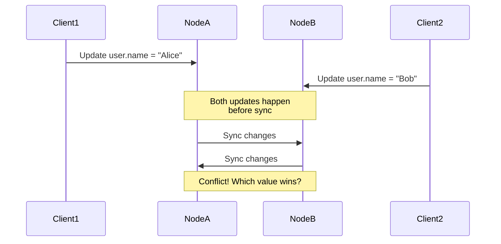
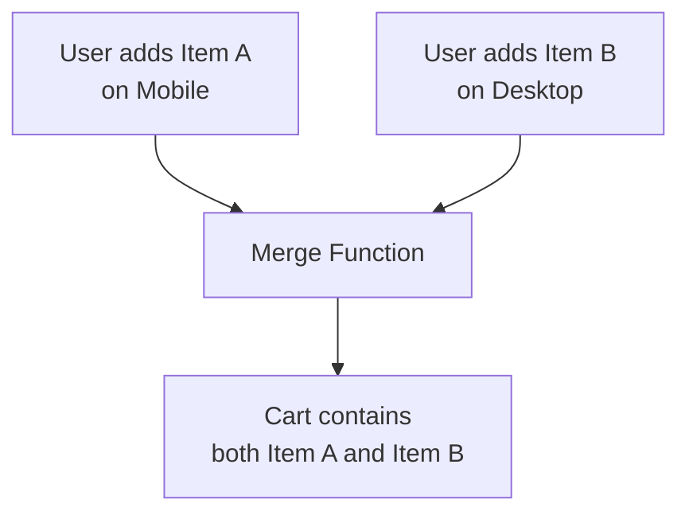
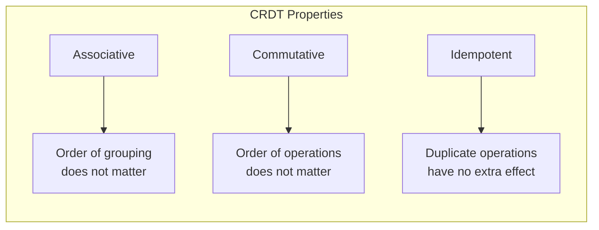
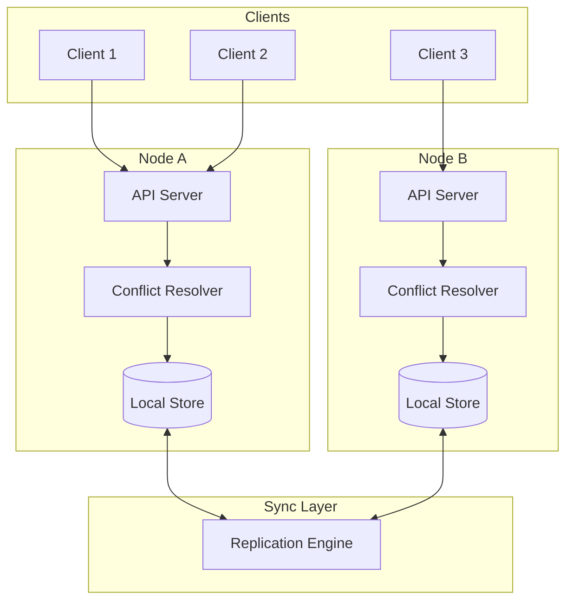

# How to Build Conflict Resolution

Author: [nawazdhandala](https://github.com/nawazdhandala)

Tags: Distributed Systems, Conflict Resolution, Database, Backend

Description: Learn how to implement conflict resolution strategies for distributed data systems.

---

## Introduction

In distributed systems, data is often replicated across multiple nodes for availability and performance. When multiple nodes can accept writes independently, conflicts become inevitable. This post explores practical strategies for building conflict resolution into your distributed data systems.

## Why Conflicts Happen

When you have multiple replicas that can accept writes, the same piece of data can be modified simultaneously on different nodes. Consider this scenario:



Without a conflict resolution strategy, your system cannot determine which value should be the canonical one.

## Strategy 1: Last-Write-Wins (LWW)

The simplest conflict resolution strategy is Last-Write-Wins. Each write is timestamped, and when conflicts occur, the write with the latest timestamp wins.

### Implementation

```typescript
// Define a timestamped value wrapper
// This structure pairs data with metadata for conflict resolution
interface TimestampedValue<T> {
  value: T;
  timestamp: number;      // Unix timestamp in milliseconds
  nodeId: string;         // Tie-breaker when timestamps match
}

// LWW Register implementation
// A register is a single-value container that can be read and written
class LWWRegister<T> {
  private state: TimestampedValue<T> | null = null;

  // Write a new value with the current timestamp
  write(value: T, nodeId: string): void {
    const newState: TimestampedValue<T> = {
      value,
      timestamp: Date.now(),
      nodeId,
    };

    // Only update if this write is newer than existing state
    if (this.shouldUpdate(newState)) {
      this.state = newState;
    }
  }

  // Merge incoming state from another replica
  // This is called during synchronization between nodes
  merge(incoming: TimestampedValue<T>): void {
    if (this.shouldUpdate(incoming)) {
      this.state = incoming;
    }
  }

  // Determine if incoming state should replace current state
  private shouldUpdate(incoming: TimestampedValue<T>): boolean {
    if (!this.state) return true;

    // Primary comparison: timestamp
    if (incoming.timestamp > this.state.timestamp) return true;
    if (incoming.timestamp < this.state.timestamp) return false;

    // Tie-breaker: lexicographic comparison of node IDs
    // This ensures deterministic resolution across all nodes
    return incoming.nodeId > this.state.nodeId;
  }

  // Read the current value
  read(): T | null {
    return this.state?.value ?? null;
  }

  // Export state for synchronization
  getState(): TimestampedValue<T> | null {
    return this.state;
  }
}
```

### Usage Example

```typescript
// Create registers on two different nodes
const nodeA = new LWWRegister<string>();
const nodeB = new LWWRegister<string>();

// Simulate concurrent writes
nodeA.write("Alice", "node-a");
nodeB.write("Bob", "node-b");

// Later, synchronize the nodes
const stateA = nodeA.getState();
const stateB = nodeB.getState();

if (stateA) nodeB.merge(stateA);
if (stateB) nodeA.merge(stateB);

// Both nodes now have the same value
// The one with the later timestamp (or higher nodeId if tied) wins
console.log(nodeA.read()); // Either "Alice" or "Bob"
console.log(nodeB.read()); // Same as above
```

### Pros and Cons of LWW

**Pros:**
- Simple to implement and understand
- Low storage overhead
- Always converges to a single value

**Cons:**
- Data loss: earlier writes are silently discarded
- Clock synchronization issues can cause unexpected behavior
- Not suitable when all concurrent changes matter

## Strategy 2: Custom Merge Functions

For more complex data types, you can define domain-specific merge logic that preserves information from all conflicting writes.

### Shopping Cart Example



### Implementation

```typescript
// Represent a shopping cart item with quantity
interface CartItem {
  productId: string;
  quantity: number;
  addedAt: number;  // Timestamp for tracking
}

// Shopping cart that merges by combining items
class MergeableCart {
  private items: Map<string, CartItem> = new Map();

  // Add an item to the cart
  addItem(productId: string, quantity: number): void {
    const existing = this.items.get(productId);

    if (existing) {
      // If item exists, add to the quantity
      existing.quantity += quantity;
      existing.addedAt = Date.now();
    } else {
      // New item in cart
      this.items.set(productId, {
        productId,
        quantity,
        addedAt: Date.now(),
      });
    }
  }

  // Remove an item from the cart
  removeItem(productId: string): void {
    this.items.delete(productId);
  }

  // Custom merge function that combines carts intelligently
  // This preserves additions from both sides
  merge(other: MergeableCart): void {
    for (const [productId, otherItem] of other.items) {
      const localItem = this.items.get(productId);

      if (!localItem) {
        // Item only exists in other cart, add it
        this.items.set(productId, { ...otherItem });
      } else {
        // Item exists in both carts
        // Take the maximum quantity (assumes additions are valid)
        // Use the latest timestamp
        this.items.set(productId, {
          productId,
          quantity: Math.max(localItem.quantity, otherItem.quantity),
          addedAt: Math.max(localItem.addedAt, otherItem.addedAt),
        });
      }
    }
  }

  // Get all items in the cart
  getItems(): CartItem[] {
    return Array.from(this.items.values());
  }

  // Export state for synchronization
  exportState(): Map<string, CartItem> {
    return new Map(this.items);
  }

  // Import state from another node
  importState(state: Map<string, CartItem>): void {
    this.items = new Map(state);
  }
}
```

### Usage Example

```typescript
// User has cart open on two devices
const mobileCart = new MergeableCart();
const desktopCart = new MergeableCart();

// User adds different items on each device
mobileCart.addItem("laptop", 1);
mobileCart.addItem("mouse", 2);

desktopCart.addItem("keyboard", 1);
desktopCart.addItem("mouse", 1);  // Also adds mouse, different quantity

// When carts sync, merge them
mobileCart.merge(desktopCart);

// Result: cart has laptop(1), mouse(2), keyboard(1)
// Mouse quantity is max(2, 1) = 2
console.log(mobileCart.getItems());
```

## Strategy 3: CRDTs (Conflict-free Replicated Data Types)

CRDTs are data structures that mathematically guarantee convergence without coordination. They are designed so that any order of operations applied to any replica will result in the same final state.

### How CRDTs Work



### G-Counter (Grow-only Counter)

A G-Counter is a CRDT that supports increment operations. It can only grow, never decrease.

```typescript
// G-Counter: A counter that can only increase
// Each node maintains its own count, and the total is the sum
class GCounter {
  // Map of nodeId to that node's contribution to the count
  private counts: Map<string, number> = new Map();
  private readonly nodeId: string;

  constructor(nodeId: string) {
    this.nodeId = nodeId;
    this.counts.set(nodeId, 0);
  }

  // Increment the counter (only affects this node's count)
  increment(amount: number = 1): void {
    if (amount < 0) {
      throw new Error("G-Counter can only be incremented by positive values");
    }
    const current = this.counts.get(this.nodeId) || 0;
    this.counts.set(this.nodeId, current + amount);
  }

  // Get the total count across all nodes
  value(): number {
    let total = 0;
    for (const count of this.counts.values()) {
      total += count;
    }
    return total;
  }

  // Merge with another G-Counter
  // Take the maximum count for each node
  // This guarantees convergence regardless of merge order
  merge(other: GCounter): void {
    for (const [nodeId, count] of other.counts) {
      const localCount = this.counts.get(nodeId) || 0;
      // Taking max ensures we never lose increments
      this.counts.set(nodeId, Math.max(localCount, count));
    }
  }

  // Export state for synchronization
  getState(): Map<string, number> {
    return new Map(this.counts);
  }
}
```

### PN-Counter (Positive-Negative Counter)

A PN-Counter supports both increment and decrement by combining two G-Counters.

```typescript
// PN-Counter: A counter that supports both increment and decrement
// Implemented as two G-Counters: one for increments, one for decrements
class PNCounter {
  private readonly positiveCounter: GCounter;
  private readonly negativeCounter: GCounter;

  constructor(nodeId: string) {
    // P tracks all increments
    this.positiveCounter = new GCounter(nodeId);
    // N tracks all decrements
    this.negativeCounter = new GCounter(nodeId);
  }

  // Increment the counter
  increment(amount: number = 1): void {
    this.positiveCounter.increment(amount);
  }

  // Decrement the counter
  decrement(amount: number = 1): void {
    // Decrementing adds to the negative counter
    this.negativeCounter.increment(amount);
  }

  // Get the current value (P - N)
  value(): number {
    return this.positiveCounter.value() - this.negativeCounter.value();
  }

  // Merge with another PN-Counter
  merge(other: PNCounter): void {
    this.positiveCounter.merge(other.positiveCounter);
    this.negativeCounter.merge(other.negativeCounter);
  }
}
```

### OR-Set (Observed-Remove Set)

An OR-Set is a set CRDT that supports both add and remove operations while handling concurrent modifications correctly.

```typescript
// Unique tag for each add operation
// This allows us to track which specific "add" a "remove" is canceling
interface ElementTag {
  element: string;
  addId: string;      // Unique identifier for this add operation
  timestamp: number;  // When the element was added
}

// OR-Set: A set that handles concurrent add/remove correctly
// Each add operation gets a unique tag
// Remove only affects tags that have been observed
class ORSet<T extends string> {
  // All element tags that have been added
  private elements: Map<string, Set<string>> = new Map();
  // All element tags that have been removed
  private tombstones: Set<string> = new Set();
  private readonly nodeId: string;

  constructor(nodeId: string) {
    this.nodeId = nodeId;
  }

  // Generate a unique ID for add operations
  private generateAddId(): string {
    return `${this.nodeId}-${Date.now()}-${Math.random().toString(36).slice(2)}`;
  }

  // Add an element to the set
  add(element: T): void {
    const addId = this.generateAddId();

    if (!this.elements.has(element)) {
      this.elements.set(element, new Set());
    }

    this.elements.get(element)!.add(addId);
  }

  // Remove an element from the set
  // This removes all known tags for the element
  remove(element: T): void {
    const tags = this.elements.get(element);

    if (tags) {
      // Move all current tags to tombstones
      for (const addId of tags) {
        this.tombstones.add(`${element}:${addId}`);
      }
      // Clear the element's tags
      tags.clear();
    }
  }

  // Check if an element is in the set
  has(element: T): boolean {
    const tags = this.elements.get(element);
    return tags !== undefined && tags.size > 0;
  }

  // Get all elements in the set
  values(): T[] {
    const result: T[] = [];
    for (const [element, tags] of this.elements) {
      if (tags.size > 0) {
        result.push(element as T);
      }
    }
    return result;
  }

  // Merge with another OR-Set
  merge(other: ORSet<T>): void {
    // First, merge tombstones
    for (const tombstone of other.tombstones) {
      this.tombstones.add(tombstone);
    }

    // Then, merge elements (but respect tombstones)
    for (const [element, otherTags] of other.elements) {
      if (!this.elements.has(element)) {
        this.elements.set(element, new Set());
      }

      const localTags = this.elements.get(element)!;

      for (const addId of otherTags) {
        const tombstoneKey = `${element}:${addId}`;
        // Only add if not tombstoned
        if (!this.tombstones.has(tombstoneKey)) {
          localTags.add(addId);
        }
      }
    }

    // Clean up any locally added elements that are now tombstoned
    for (const [element, tags] of this.elements) {
      for (const addId of tags) {
        if (this.tombstones.has(`${element}:${addId}`)) {
          tags.delete(addId);
        }
      }
    }
  }
}
```

### OR-Set Usage Example

```typescript
// Two nodes with OR-Sets
const setA = new ORSet<string>("node-a");
const setB = new ORSet<string>("node-b");

// Node A adds "apple" and "banana"
setA.add("apple");
setA.add("banana");

// Node B adds "apple" and "cherry"
setB.add("apple");
setB.add("cherry");

// Before sync, Node A removes "apple"
setA.remove("apple");

// Sync the sets
setA.merge(setB);
setB.merge(setA);

// Result on both nodes:
// - "apple" is present! (Node B's add happened concurrently with A's remove)
// - "banana" is present
// - "cherry" is present
console.log(setA.values()); // ["apple", "banana", "cherry"]
console.log(setB.values()); // ["apple", "banana", "cherry"]
```

## Practical Architecture

Here is how these strategies fit into a real distributed system:



### Choosing the Right Strategy

| Use Case | Recommended Strategy | Reason |
|----------|---------------------|--------|
| User profile fields | LWW | Simple fields where latest value is correct |
| Shopping cart | Custom merge | Need to preserve all additions |
| Like/view counts | G-Counter or PN-Counter | Mathematical convergence guaranteed |
| Tag collections | OR-Set | Need add/remove with concurrent safety |
| Collaborative text | Sequence CRDTs | Preserve all user edits |

## Building a Hybrid Resolver

In practice, you often need different strategies for different fields within the same document:

```typescript
// Define resolution strategies for different field types
type ResolutionStrategy = "lww" | "max" | "min" | "union" | "custom";

interface FieldConfig {
  strategy: ResolutionStrategy;
  customMerge?: (local: any, remote: any) => any;
}

// Hybrid resolver that applies different strategies per field
class HybridResolver<T extends Record<string, any>> {
  private config: Map<keyof T, FieldConfig>;

  constructor(config: Partial<Record<keyof T, FieldConfig>>) {
    this.config = new Map(Object.entries(config) as [keyof T, FieldConfig][]);
  }

  // Resolve conflicts between two versions of a document
  resolve(
    local: T,
    remote: T,
    localTimestamp: number,
    remoteTimestamp: number
  ): T {
    const result: Partial<T> = {};

    // Get all keys from both documents
    const allKeys = new Set([
      ...Object.keys(local),
      ...Object.keys(remote),
    ]) as Set<keyof T>;

    for (const key of allKeys) {
      const config = this.config.get(key) || { strategy: "lww" };
      result[key] = this.resolveField(
        local[key],
        remote[key],
        config,
        localTimestamp,
        remoteTimestamp
      );
    }

    return result as T;
  }

  // Apply the appropriate strategy for a single field
  private resolveField(
    localValue: any,
    remoteValue: any,
    config: FieldConfig,
    localTimestamp: number,
    remoteTimestamp: number
  ): any {
    // Handle missing values
    if (localValue === undefined) return remoteValue;
    if (remoteValue === undefined) return localValue;

    switch (config.strategy) {
      case "lww":
        // Last write wins based on timestamp
        return remoteTimestamp > localTimestamp ? remoteValue : localValue;

      case "max":
        // Take the maximum value (useful for counters, versions)
        return Math.max(localValue, remoteValue);

      case "min":
        // Take the minimum value
        return Math.min(localValue, remoteValue);

      case "union":
        // Merge arrays by union (remove duplicates)
        if (Array.isArray(localValue) && Array.isArray(remoteValue)) {
          return [...new Set([...localValue, ...remoteValue])];
        }
        return remoteTimestamp > localTimestamp ? remoteValue : localValue;

      case "custom":
        // Use custom merge function if provided
        if (config.customMerge) {
          return config.customMerge(localValue, remoteValue);
        }
        return remoteTimestamp > localTimestamp ? remoteValue : localValue;

      default:
        return remoteTimestamp > localTimestamp ? remoteValue : localValue;
    }
  }
}
```

### Using the Hybrid Resolver

```typescript
// Define a user profile type
interface UserProfile {
  name: string;           // LWW: use latest name
  email: string;          // LWW: use latest email
  loginCount: number;     // Max: never lose login counts
  tags: string[];         // Union: combine all tags
  preferences: object;    // Custom: deep merge
}

// Configure resolution strategies per field
const userResolver = new HybridResolver<UserProfile>({
  name: { strategy: "lww" },
  email: { strategy: "lww" },
  loginCount: { strategy: "max" },
  tags: { strategy: "union" },
  preferences: {
    strategy: "custom",
    customMerge: (local, remote) => {
      // Deep merge preferences
      return { ...local, ...remote };
    },
  },
});

// Example: resolve conflicting user profiles
const localProfile: UserProfile = {
  name: "Alice",
  email: "alice@old.com",
  loginCount: 50,
  tags: ["developer", "frontend"],
  preferences: { theme: "dark", notifications: true },
};

const remoteProfile: UserProfile = {
  name: "Alice Smith",
  email: "alice@new.com",
  loginCount: 45,
  tags: ["developer", "backend"],
  preferences: { theme: "light", language: "en" },
};

const resolved = userResolver.resolve(
  localProfile,
  remoteProfile,
  1000,  // local timestamp (older)
  2000   // remote timestamp (newer)
);

// Result:
// {
//   name: "Alice Smith",        // LWW: remote wins (newer)
//   email: "alice@new.com",     // LWW: remote wins (newer)
//   loginCount: 50,             // Max: local has higher count
//   tags: ["developer", "frontend", "backend"],  // Union
//   preferences: { theme: "light", notifications: true, language: "en" }
// }
```

## Testing Conflict Resolution

Always test your conflict resolution logic with various scenarios:

```typescript
// Test utility for simulating network partitions and conflicts
class ConflictSimulator<T> {
  // Simulate a network partition scenario
  static async simulatePartition<T>(
    createReplica: () => T,
    operations: {
      replicaA: (replica: T) => void;
      replicaB: (replica: T) => void;
    },
    merge: (a: T, b: T) => void
  ): Promise<{ replicaA: T; replicaB: T }> {
    // Create two independent replicas
    const replicaA = createReplica();
    const replicaB = createReplica();

    // Simulate concurrent operations during partition
    operations.replicaA(replicaA);
    operations.replicaB(replicaB);

    // Simulate network recovery and merge
    merge(replicaA, replicaB);
    merge(replicaB, replicaA);

    return { replicaA, replicaB };
  }
}

// Example test
async function testORSetConvergence() {
  const result = await ConflictSimulator.simulatePartition(
    () => new ORSet<string>("test-node"),
    {
      replicaA: (set) => {
        set.add("item1");
        set.add("item2");
        set.remove("item1");
      },
      replicaB: (set) => {
        set.add("item1");
        set.add("item3");
      },
    },
    (a, b) => a.merge(b)
  );

  // Both replicas should have the same values after merge
  const valuesA = result.replicaA.values().sort();
  const valuesB = result.replicaB.values().sort();

  console.assert(
    JSON.stringify(valuesA) === JSON.stringify(valuesB),
    "Replicas should converge to same state"
  );

  console.log("Test passed! Values:", valuesA);
}
```

## Key Takeaways

1. **Choose the right strategy**: LWW is simple but lossy. CRDTs guarantee convergence but have constraints. Custom merges offer flexibility but require careful design.

2. **Consider your data semantics**: What does a "conflict" mean for your application? Sometimes concurrent writes should merge, other times one should win.

3. **Test extensively**: Conflict resolution bugs are subtle and hard to reproduce. Build comprehensive test suites that simulate partitions.

4. **Monitor and log**: Track when conflicts occur and how they are resolved. This data helps tune your strategies.

5. **Design for eventual consistency**: Accept that replicas will temporarily diverge. Design your UX around this reality.

## Further Reading

- Martin Kleppmann's "Designing Data-Intensive Applications" covers distributed data in depth
- The original CRDT papers by Marc Shapiro provide mathematical foundations
- CRDTs are used in production by Figma, Redis, Riak, and many other systems

Building robust conflict resolution requires understanding both the theoretical foundations and practical trade-offs. Start simple with LWW, and evolve to more sophisticated strategies as your requirements demand.
