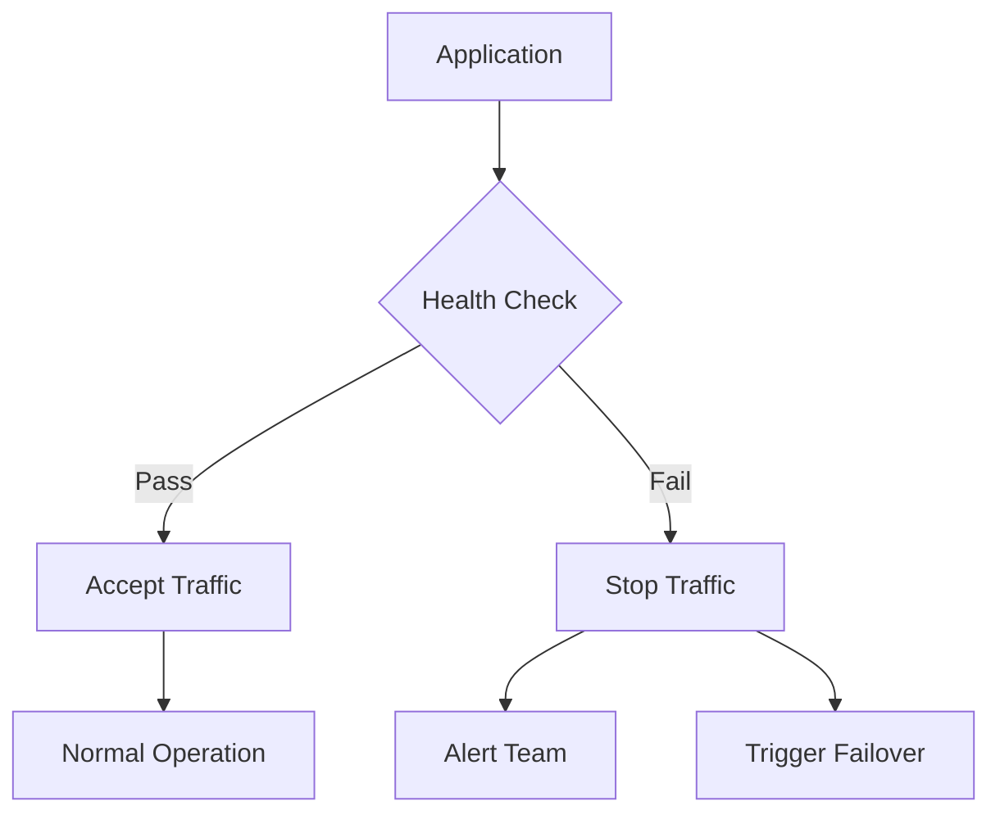
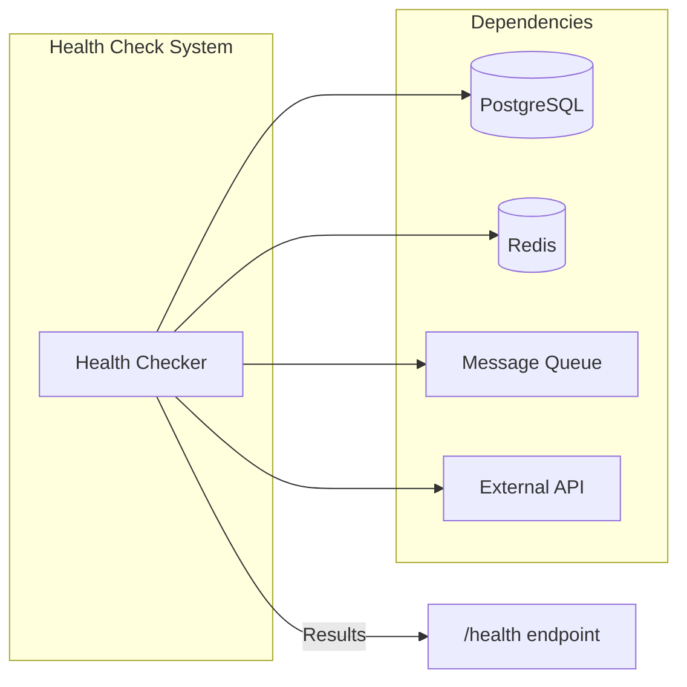

# How to Build Connection Health Checks

Author: [nawazdhandala](https://github.com/nawazdhandala)

Tags: Database, Health Checks, Monitoring, Reliability

Description: Learn to build connection health checks for validating database connections and detecting failures early.

---

Database connection failures are among the most common causes of application downtime. A query that worked seconds ago suddenly times out. Connection pools become exhausted. Network partitions silently drop packets. Without proper health checks, these issues cascade through your system before anyone notices.

Connection health checks validate that your application can communicate with its dependencies. They detect failures early, enable automatic recovery, and provide visibility into system health. This guide walks through building robust connection health checks from scratch.

## Why Connection Health Checks Matter

Applications depend on external services: databases, caches, message queues, and third-party APIs. When these connections fail, the impact varies based on how quickly you detect and respond to the failure.



Without health checks, a dead database connection might not be discovered until a user request fails. With health checks, you catch the problem within seconds and can take corrective action before users are affected.

## Anatomy of a Connection Health Check

A good health check answers one question: can I successfully communicate with this dependency? The check should be fast, lightweight, and accurate.

| Component | Purpose | Example |
|-----------|---------|---------|
| **Connectivity test** | Verify network path exists | TCP socket open |
| **Authentication test** | Credentials are valid | Login succeeds |
| **Functional test** | Service responds correctly | Simple query returns expected result |
| **Timeout** | Prevent hanging checks | 3 second maximum |

## Building a Database Health Check

The simplest database health check executes a trivial query. If the query succeeds, the connection is healthy.

```javascript
// database-health.js
const { Pool } = require('pg');

class DatabaseHealthCheck {
  constructor(pool) {
    this.pool = pool;
    this.lastCheckTime = null;
    this.lastCheckResult = null;
  }

  // Execute a simple query to verify the connection works
  async check() {
    const startTime = Date.now();

    try {
      const client = await this.pool.connect();
      try {
        // Use a trivial query that exercises the connection
        await client.query('SELECT 1');

        const latency = Date.now() - startTime;
        this.lastCheckTime = new Date();
        this.lastCheckResult = { healthy: true, latency };

        return this.lastCheckResult;
      } finally {
        // Always release the client back to the pool
        client.release();
      }
    } catch (error) {
      const latency = Date.now() - startTime;
      this.lastCheckTime = new Date();
      this.lastCheckResult = {
        healthy: false,
        latency,
        error: error.message
      };

      return this.lastCheckResult;
    }
  }
}

module.exports = { DatabaseHealthCheck };
```

This pattern works for any database. For MySQL, use `SELECT 1`. For Redis, use `PING`. The query should be fast enough that it does not add meaningful load to the database.

## Connection Pool Health Monitoring

Beyond simple connectivity, you should monitor the health of your connection pool. Exhausted pools cause request queuing and timeouts.

```javascript
// pool-health.js
class PoolHealthMonitor {
  constructor(pool, options = {}) {
    this.pool = pool;
    this.maxWaitTime = options.maxWaitTime || 5000;
    this.minAvailable = options.minAvailable || 2;
  }

  // Check pool statistics for signs of trouble
  getPoolStats() {
    return {
      total: this.pool.totalCount,
      idle: this.pool.idleCount,
      waiting: this.pool.waitingCount,
    };
  }

  // Determine if the pool is healthy based on current state
  isHealthy() {
    const stats = this.getPoolStats();

    // Unhealthy if too many requests are waiting for connections
    if (stats.waiting > stats.total) {
      return {
        healthy: false,
        reason: 'Connection pool exhausted',
        stats,
      };
    }

    // Unhealthy if no idle connections and requests are waiting
    if (stats.idle === 0 && stats.waiting > 0) {
      return {
        healthy: false,
        reason: 'No available connections',
        stats,
      };
    }

    return { healthy: true, stats };
  }
}

module.exports = { PoolHealthMonitor };
```

## Implementing Timeout Protection

Health checks must have timeouts. A hanging check is worse than a failed check because it blocks the caller indefinitely.

```javascript
// timeout-wrapper.js

// Wrap any async function with a timeout
function withTimeout(asyncFn, timeoutMs) {
  return async function(...args) {
    const timeoutPromise = new Promise((_, reject) => {
      setTimeout(() => {
        reject(new Error(`Health check timed out after ${timeoutMs}ms`));
      }, timeoutMs);
    });

    return Promise.race([
      asyncFn.apply(this, args),
      timeoutPromise,
    ]);
  };
}

// Usage example
const { DatabaseHealthCheck } = require('./database-health');

const dbHealth = new DatabaseHealthCheck(pool);
const checkWithTimeout = withTimeout(
  () => dbHealth.check(),
  3000  // 3 second timeout
);

// Now checkWithTimeout() will reject if it takes longer than 3 seconds
```

## Multi-Dependency Health Check System

Production applications often depend on multiple services. A unified health check system provides a single source of truth.



Here is a complete implementation that manages multiple health checks.

```javascript
// health-system.js
class HealthCheckSystem {
  constructor() {
    this.checks = new Map();
    this.results = new Map();
  }

  // Register a new health check
  register(name, checkFn, options = {}) {
    this.checks.set(name, {
      fn: checkFn,
      timeout: options.timeout || 5000,
      critical: options.critical !== false,  // Default to critical
      interval: options.interval || 30000,
    });
  }

  // Run a single health check with timeout protection
  async runCheck(name) {
    const check = this.checks.get(name);
    if (!check) {
      throw new Error(`Unknown health check: ${name}`);
    }

    const startTime = Date.now();

    try {
      const result = await Promise.race([
        check.fn(),
        new Promise((_, reject) =>
          setTimeout(() => reject(new Error('Timeout')), check.timeout)
        ),
      ]);

      const checkResult = {
        name,
        healthy: true,
        latency: Date.now() - startTime,
        timestamp: new Date().toISOString(),
        ...result,
      };

      this.results.set(name, checkResult);
      return checkResult;
    } catch (error) {
      const checkResult = {
        name,
        healthy: false,
        latency: Date.now() - startTime,
        timestamp: new Date().toISOString(),
        error: error.message,
      };

      this.results.set(name, checkResult);
      return checkResult;
    }
  }

  // Run all registered health checks in parallel
  async runAllChecks() {
    const checkNames = Array.from(this.checks.keys());
    const results = await Promise.all(
      checkNames.map(name => this.runCheck(name))
    );

    return results.reduce((acc, result) => {
      acc[result.name] = result;
      return acc;
    }, {});
  }

  // Determine overall system health
  async getSystemHealth() {
    const results = await this.runAllChecks();

    const criticalFailures = Object.entries(results)
      .filter(([name]) => this.checks.get(name).critical)
      .filter(([_, result]) => !result.healthy)
      .map(([name]) => name);

    return {
      healthy: criticalFailures.length === 0,
      criticalFailures,
      checks: results,
      timestamp: new Date().toISOString(),
    };
  }
}

module.exports = { HealthCheckSystem };
```

## Registering Common Dependencies

Here is how to register health checks for typical application dependencies.

```javascript
// setup-health-checks.js
const { Pool } = require('pg');
const Redis = require('ioredis');
const { HealthCheckSystem } = require('./health-system');

const health = new HealthCheckSystem();

// PostgreSQL health check
const pgPool = new Pool({ connectionString: process.env.DATABASE_URL });

health.register('postgres', async () => {
  const client = await pgPool.connect();
  try {
    const result = await client.query('SELECT NOW() as time');
    return { serverTime: result.rows[0].time };
  } finally {
    client.release();
  }
}, { critical: true, timeout: 3000 });

// Redis health check
const redis = new Redis(process.env.REDIS_URL);

health.register('redis', async () => {
  const pong = await redis.ping();
  const info = await redis.info('memory');
  return {
    connected: pong === 'PONG',
    memoryInfo: info.split('\n')[1],
  };
}, { critical: true, timeout: 2000 });

// External API health check (non-critical)
health.register('payment-gateway', async () => {
  const response = await fetch('https://api.example.com/health', {
    signal: AbortSignal.timeout(5000),
  });
  return {
    status: response.status,
    healthy: response.ok,
  };
}, { critical: false, timeout: 5000 });

module.exports = { health };
```

## Exposing Health Endpoints

Expose health check results through HTTP endpoints for use by load balancers, Kubernetes probes, and monitoring systems.

```javascript
// routes/health.js
const express = require('express');
const { health } = require('../setup-health-checks');

const router = express.Router();

// Quick liveness check - is the process running?
router.get('/live', (req, res) => {
  res.json({
    status: 'ok',
    uptime: process.uptime(),
  });
});

// Readiness check - can we serve traffic?
router.get('/ready', async (req, res) => {
  const systemHealth = await health.getSystemHealth();

  const statusCode = systemHealth.healthy ? 200 : 503;
  res.status(statusCode).json(systemHealth);
});

// Detailed health check - for debugging
router.get('/details', async (req, res) => {
  const systemHealth = await health.getSystemHealth();
  res.json({
    ...systemHealth,
    process: {
      pid: process.pid,
      uptime: process.uptime(),
      memoryUsage: process.memoryUsage(),
    },
  });
});

module.exports = router;
```

## Health Check Response Codes

Use appropriate HTTP status codes to communicate health status.

| Status Code | Meaning | Use Case |
|-------------|---------|----------|
| **200** | Healthy | All checks pass |
| **503** | Unavailable | Critical dependency down |
| **500** | Error | Health check itself failed |

## Best Practices

Follow these guidelines to build effective health checks.

**Keep checks fast.** A health check that takes 10 seconds defeats its purpose. Target sub-second response times.

**Use dedicated connections.** Do not let health checks compete with application traffic for connections.

**Check what matters.** A database health check should verify you can query, not just connect.

**Handle partial failures.** Distinguish between critical dependencies (must be healthy) and optional ones (nice to have).

**Add context to failures.** Include error messages and timestamps in health check responses to speed up debugging.

## Monitoring Health Check Results

Health checks generate valuable metrics. Track check latency, failure rates, and patterns over time.

```javascript
// metrics.js
class HealthMetrics {
  constructor() {
    this.history = new Map();
    this.maxHistorySize = 100;
  }

  // Record a health check result
  record(name, result) {
    if (!this.history.has(name)) {
      this.history.set(name, []);
    }

    const records = this.history.get(name);
    records.push({
      timestamp: Date.now(),
      healthy: result.healthy,
      latency: result.latency,
    });

    // Keep only recent history
    if (records.length > this.maxHistorySize) {
      records.shift();
    }
  }

  // Calculate success rate for a check
  getSuccessRate(name) {
    const records = this.history.get(name) || [];
    if (records.length === 0) return null;

    const successes = records.filter(r => r.healthy).length;
    return (successes / records.length) * 100;
  }

  // Get average latency for a check
  getAverageLatency(name) {
    const records = this.history.get(name) || [];
    if (records.length === 0) return null;

    const total = records.reduce((sum, r) => sum + r.latency, 0);
    return total / records.length;
  }
}

module.exports = { HealthMetrics };
```

## Summary

Connection health checks are essential for building reliable applications. They detect failures before users do, enable automatic traffic management, and provide visibility into system dependencies.

Start with simple connectivity tests and expand to cover all critical dependencies. Add timeouts to prevent hanging checks. Use appropriate HTTP status codes for integration with load balancers and orchestrators. Monitor health check metrics to identify trends before they become outages.

For more on building resilient applications, see our guide on [implementing health checks for Kubernetes](https://oneuptime.com/blog/post/2026-01-06-nodejs-health-checks-kubernetes/view).
