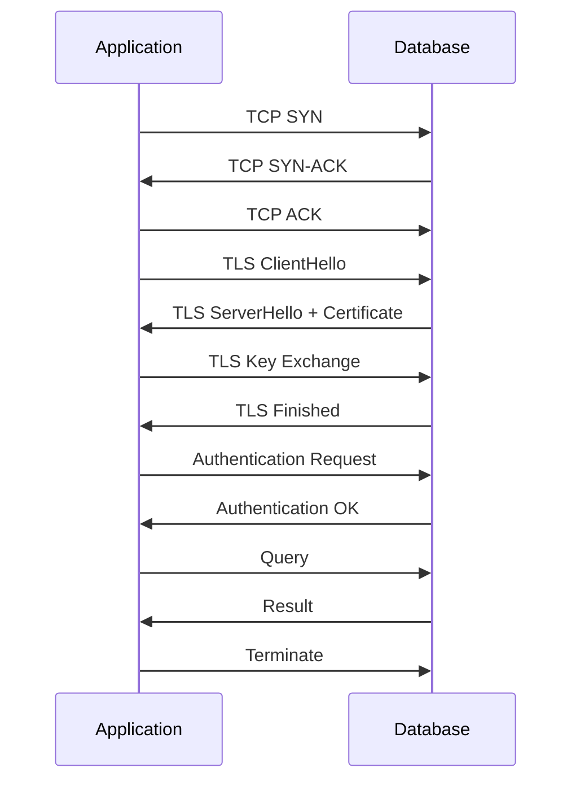
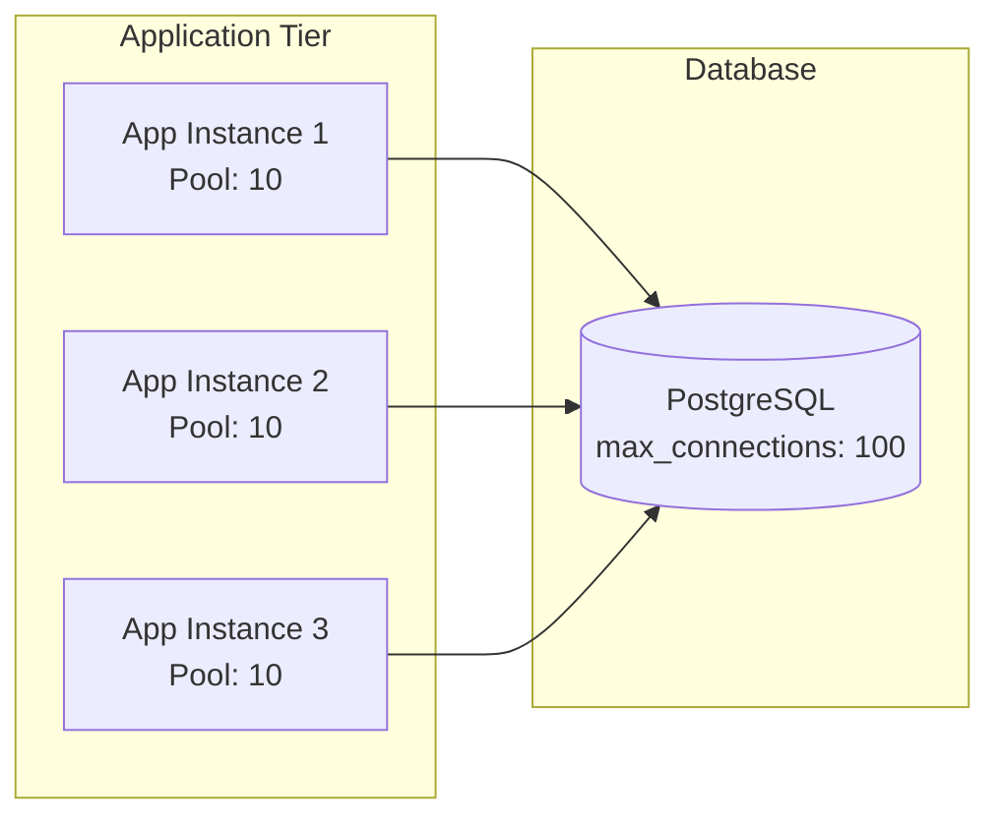
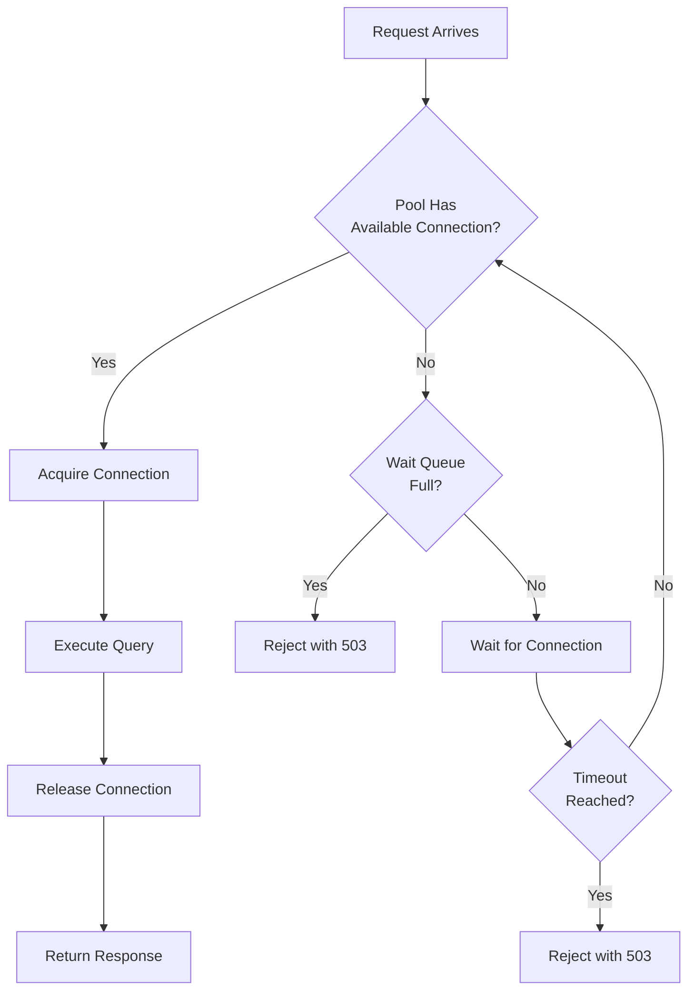

# How to Build Connection Pooling Strategies

Author: [nawazdhandala](https://github.com/nawazdhandala)

Tags: Database, Connection Pooling, HikariCP, Performance

Description: Learn to build connection pooling strategies for optimal database connection reuse and performance.

---

Every database connection comes with overhead. TCP handshakes, TLS negotiation, authentication, and protocol setup all take time. When your application opens a new connection for every query, these costs multiply across thousands of requests. Connection pooling solves this by maintaining a set of reusable connections, dramatically reducing latency and resource consumption.

## Why Connection Pooling Matters

Opening a database connection is expensive. A typical PostgreSQL connection setup involves several round trips between your application and the database server.



Without pooling, this entire sequence happens for every single query. With pooling, connections are established once and reused across many requests.

| Metric | Without Pooling | With Pooling |
|--------|----------------|--------------|
| Connection setup time | 20-100ms per query | 0ms (reused) |
| Database connections | Unbounded | Fixed pool size |
| Memory usage | High (per connection) | Predictable |
| Connection failures | Common under load | Rare |

## Core Pool Configuration Parameters

Every connection pool implementation shares a set of fundamental parameters. Understanding these is critical to building an effective pooling strategy.

| Parameter | Purpose | Typical Range |
|-----------|---------|---------------|
| **Minimum Pool Size** | Connections kept open even when idle | 2-10 |
| **Maximum Pool Size** | Hard ceiling on concurrent connections | 10-50 |
| **Connection Timeout** | How long to wait for an available connection | 5-30 seconds |
| **Idle Timeout** | When to close unused connections | 5-10 minutes |
| **Max Lifetime** | Force connection recycling | 30-60 minutes |
| **Validation Query** | Health check before handing out connection | SELECT 1 |

## Pool Sizing Strategy

The optimal pool size depends on your workload and database capacity. A common mistake is setting the pool too large, which actually hurts performance. More connections mean more context switching at the database level and increased memory usage.



A good starting formula for pool size is based on your database server cores.

```
pool_size = (core_count * 2) + spinning_disk_count
```

For a database server with 8 cores and SSDs, this gives you a pool size of around 16. If you have 4 application instances, each should use a pool of 4 connections.

## Implementing Connection Pooling in Node.js

The `pg` library for PostgreSQL includes built-in pooling. Here is a production-ready configuration.

```javascript
const { Pool } = require('pg');

// Create a connection pool with tuned settings
const pool = new Pool({
  host: process.env.DB_HOST,
  port: 5432,
  database: process.env.DB_NAME,
  user: process.env.DB_USER,
  password: process.env.DB_PASSWORD,

  // Pool sizing - adjust based on your workload
  min: 2,              // Keep at least 2 connections warm
  max: 10,             // Maximum concurrent connections

  // Timeouts
  connectionTimeoutMillis: 10000,  // Wait 10s for connection
  idleTimeoutMillis: 30000,        // Close idle connections after 30s

  // Connection health
  allowExitOnIdle: false,          // Keep pool alive
});

// Monitor pool events for observability
pool.on('connect', (client) => {
  console.log('New connection established');
});

pool.on('error', (err, client) => {
  console.error('Unexpected pool error:', err.message);
});

// Query helper with automatic connection return
async function query(text, params) {
  const start = Date.now();
  const result = await pool.query(text, params);
  const duration = Date.now() - start;

  // Log slow queries for investigation
  if (duration > 100) {
    console.warn('Slow query:', { text, duration, rows: result.rowCount });
  }

  return result;
}

module.exports = { pool, query };
```

## Connection Pool Health Checks

Stale connections cause intermittent failures. Implement validation to ensure connections are healthy before use.

```javascript
const { Pool } = require('pg');

const pool = new Pool({
  // ... other config
  max: 10,
});

// Validate connection before each use
async function getValidConnection() {
  const client = await pool.connect();

  try {
    // Quick health check
    await client.query('SELECT 1');
    return client;
  } catch (err) {
    // Connection is bad, release and get a new one
    client.release(true);  // true = destroy connection
    throw err;
  }
}

// Periodic pool health check
async function checkPoolHealth() {
  const client = await pool.connect();
  try {
    const result = await client.query('SELECT 1 as health');
    return result.rows[0].health === 1;
  } catch (err) {
    return false;
  } finally {
    client.release();
  }
}
```

## Connection Pool Monitoring

Track pool metrics to detect problems before they cause outages.

```javascript
const { Pool } = require('pg');
const prometheus = require('prom-client');

// Create metrics
const poolTotal = new prometheus.Gauge({
  name: 'db_pool_connections_total',
  help: 'Total number of connections in pool',
});

const poolIdle = new prometheus.Gauge({
  name: 'db_pool_connections_idle',
  help: 'Number of idle connections in pool',
});

const poolWaiting = new prometheus.Gauge({
  name: 'db_pool_waiting_count',
  help: 'Number of requests waiting for connection',
});

const pool = new Pool({ max: 10 });

// Update metrics every 5 seconds
setInterval(() => {
  poolTotal.set(pool.totalCount);
  poolIdle.set(pool.idleCount);
  poolWaiting.set(pool.waitingCount);
}, 5000);
```

## Connection Pooling with HikariCP (Java)

HikariCP is the gold standard for JVM connection pooling. It delivers exceptional performance through careful optimization.

```java
import com.zaxxer.hikari.HikariConfig;
import com.zaxxer.hikari.HikariDataSource;

public class DatabasePool {
    private static HikariDataSource dataSource;

    public static void initialize() {
        HikariConfig config = new HikariConfig();

        // Connection settings
        config.setJdbcUrl("jdbc:postgresql://localhost:5432/mydb");
        config.setUsername(System.getenv("DB_USER"));
        config.setPassword(System.getenv("DB_PASSWORD"));

        // Pool sizing
        config.setMinimumIdle(2);        // Minimum idle connections
        config.setMaximumPoolSize(10);   // Maximum total connections

        // Timeouts (in milliseconds)
        config.setConnectionTimeout(10000);  // Wait for connection
        config.setIdleTimeout(300000);       // 5 minutes idle before close
        config.setMaxLifetime(1800000);      // 30 minutes max lifetime

        // Connection validation
        config.setConnectionTestQuery("SELECT 1");
        config.setValidationTimeout(5000);

        // Performance optimizations
        config.addDataSourceProperty("cachePrepStmts", "true");
        config.addDataSourceProperty("prepStmtCacheSize", "250");
        config.addDataSourceProperty("prepStmtCacheSqlLimit", "2048");

        dataSource = new HikariDataSource(config);
    }

    public static Connection getConnection() throws SQLException {
        return dataSource.getConnection();
    }
}
```

## Handling Connection Exhaustion

When all connections are in use and requests keep arriving, your pool becomes exhausted. Handle this gracefully with timeouts and circuit breakers.



Implement a circuit breaker to prevent cascading failures when the database is overloaded.

```javascript
class PoolCircuitBreaker {
  constructor(pool, options = {}) {
    this.pool = pool;
    this.failures = 0;
    this.threshold = options.threshold || 5;
    this.resetTimeout = options.resetTimeout || 30000;
    this.state = 'CLOSED';
  }

  async query(text, params) {
    // Reject immediately if circuit is open
    if (this.state === 'OPEN') {
      throw new Error('Circuit breaker is open');
    }

    try {
      const result = await this.pool.query(text, params);
      this.onSuccess();
      return result;
    } catch (err) {
      this.onFailure();
      throw err;
    }
  }

  onSuccess() {
    this.failures = 0;
    this.state = 'CLOSED';
  }

  onFailure() {
    this.failures++;
    if (this.failures >= this.threshold) {
      this.state = 'OPEN';
      // Auto-reset after timeout
      setTimeout(() => {
        this.state = 'HALF_OPEN';
        this.failures = 0;
      }, this.resetTimeout);
    }
  }
}
```

## Connection Pooling Best Practices

Following these practices will help you avoid common pitfalls and build reliable database access.

| Practice | Reason |
|----------|--------|
| **Always release connections** | Leaked connections exhaust the pool |
| **Use try-finally blocks** | Ensures release even on errors |
| **Set connection timeouts** | Prevents indefinite waits |
| **Monitor pool metrics** | Catch exhaustion before outages |
| **Test under load** | Find your true connection needs |
| **Match pool to database limits** | Avoid exceeding max_connections |

## Graceful Shutdown

When your application shuts down, drain the connection pool properly to avoid leaving orphaned connections.

```javascript
async function shutdown() {
  console.log('Shutting down connection pool...');

  // Stop accepting new requests first
  server.close();

  // Wait for in-flight queries to complete
  await new Promise(resolve => setTimeout(resolve, 5000));

  // Close all pool connections
  await pool.end();

  console.log('Pool shutdown complete');
  process.exit(0);
}

process.on('SIGTERM', shutdown);
process.on('SIGINT', shutdown);
```

## Summary

Connection pooling transforms database access from a performance bottleneck into an efficient, predictable resource. Start with conservative pool sizes, monitor your metrics, and adjust based on actual production behavior. The right pooling strategy depends on your specific workload, but the principles remain constant: reuse connections, set appropriate timeouts, validate health, and handle exhaustion gracefully.
