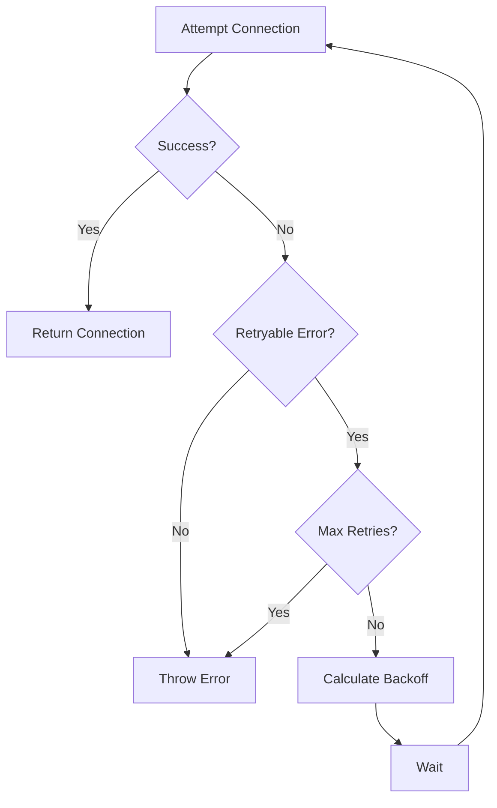
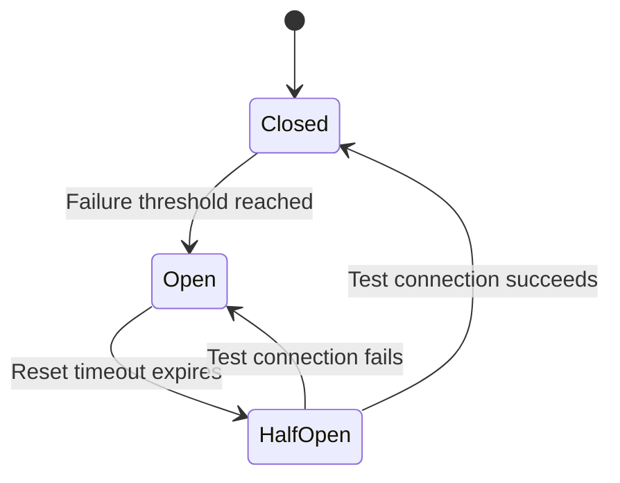

# How to Create Connection Retry Logic

Author: [nawazdhandala](https://github.com/nawazdhandala)

Tags: Database, Retry, Reliability, Resilience

Description: Learn to create connection retry logic with exponential backoff and circuit breakers for database connections.

---

Database connections fail. Networks glitch. Servers restart. Your application needs retry logic that handles transient failures gracefully without overwhelming a recovering database or creating cascade failures across your services.

This guide walks through implementing connection retry logic from basic patterns to production-ready solutions with circuit breakers and connection pooling.

## Why Connections Fail

Understanding failure modes helps you design better retry logic.

| Failure Type | Cause | Retry Strategy |
|--------------|-------|----------------|
| **Network timeout** | Firewall, routing issues, DNS | Exponential backoff with jitter |
| **Connection refused** | Database not ready, port blocked | Wait longer between retries |
| **Too many connections** | Pool exhausted, max_connections hit | Back off, check pool config |
| **Authentication error** | Wrong credentials, expired token | Do not retry, fail immediately |
| **Database overload** | High CPU/memory, slow queries | Circuit breaker, reduce load |

The key insight: only retry transient failures. Permanent failures like wrong credentials will never succeed no matter how many times you try.

## Retry Flow Overview

This diagram shows the decision flow for connection retry logic. Notice how permanent failures exit immediately while transient failures enter the backoff loop.



## Basic Retry Implementation

This simple retry function demonstrates the core pattern. It attempts a connection, catches errors, and retries with increasing delays. The `isRetryableError` check prevents wasting time on permanent failures.

```javascript
// Simple database connection with retry logic
// Uses exponential backoff to avoid overwhelming a recovering database
async function connectWithRetry(config, options = {}) {
  const {
    maxRetries = 5,
    initialDelay = 1000,
    maxDelay = 30000,
    factor = 2,
  } = options;

  let lastError;
  let delay = initialDelay;

  for (let attempt = 1; attempt <= maxRetries; attempt++) {
    try {
      // Attempt the connection
      const connection = await createConnection(config);
      console.log(`Connected on attempt ${attempt}`);
      return connection;
    } catch (error) {
      lastError = error;

      // Check if error is retryable
      if (!isRetryableError(error)) {
        throw error;
      }

      if (attempt === maxRetries) {
        throw new Error(
          `Failed to connect after ${maxRetries} attempts: ${error.message}`
        );
      }

      console.log(`Attempt ${attempt} failed: ${error.message}`);
      console.log(`Retrying in ${delay}ms...`);

      // Wait before next attempt
      await sleep(delay);

      // Exponential backoff with cap
      delay = Math.min(delay * factor, maxDelay);
    }
  }

  throw lastError;
}

// Helper to identify retryable errors
function isRetryableError(error) {
  const retryableCodes = [
    'ETIMEDOUT',
    'ECONNRESET',
    'ECONNREFUSED',
    'ENOTFOUND',
    'PROTOCOL_CONNECTION_LOST',
    'ER_CON_COUNT_ERROR',
  ];
  return retryableCodes.includes(error.code);
}

function sleep(ms) {
  return new Promise(resolve => setTimeout(resolve, ms));
}
```

## Adding Jitter to Prevent Thundering Herds

When multiple services restart simultaneously after an outage, they all retry at the same intervals. This synchronized retry pattern creates "thundering herds" that can overwhelm a recovering database. Jitter adds randomness to desynchronize retry attempts.

```javascript
// Calculate delay with jitter to spread out retries
// 'full': completely random between 0 and max
// 'equal': half fixed, half random for predictable bounds
// 'decorrelated': AWS-recommended approach with wider variation
function calculateDelayWithJitter(baseDelay, attempt, options = {}) {
  const { factor = 2, maxDelay = 30000, jitter = 'full' } = options;

  // Calculate exponential delay
  let delay = Math.min(baseDelay * Math.pow(factor, attempt - 1), maxDelay);

  switch (jitter) {
    case 'none':
      return delay;

    case 'full':
      // Random between 0 and calculated delay
      return Math.random() * delay;

    case 'equal':
      // Half fixed, half random
      return delay / 2 + Math.random() * delay / 2;

    case 'decorrelated':
      // AWS-style jitter with wider spread
      return Math.min(maxDelay, Math.random() * delay * 3);

    default:
      return delay;
  }
}
```

The AWS "decorrelated" jitter strategy generally performs best in high-concurrency scenarios. It produces a wider spread of retry times, which helps distribute load more evenly.

## Production Connection Class

This class handles real production scenarios including connection timeouts, health checks, and proper cleanup on failure. It tracks connection state and provides methods for monitoring.

```javascript
// Production-ready database connection manager
// Handles: retries, timeouts, health checks, graceful shutdown
class DatabaseConnection {
  constructor(config, options = {}) {
    this.config = config;
    this.maxRetries = options.maxRetries || 5;
    this.initialDelay = options.initialDelay || 1000;
    this.maxDelay = options.maxDelay || 30000;
    this.connectionTimeout = options.connectionTimeout || 10000;
    this.jitter = options.jitter || 'decorrelated';

    this.connection = null;
    this.isConnected = false;
    this.retryCount = 0;
  }

  async connect() {
    for (let attempt = 1; attempt <= this.maxRetries; attempt++) {
      this.retryCount = attempt;

      try {
        // Create connection with timeout
        this.connection = await this.createWithTimeout();
        this.isConnected = true;

        // Verify connection works
        await this.healthCheck();

        console.log(`Database connected (attempt ${attempt})`);
        return this.connection;

      } catch (error) {
        this.isConnected = false;

        if (!this.isRetryable(error) || attempt === this.maxRetries) {
          throw this.wrapError(error, attempt);
        }

        const delay = calculateDelayWithJitter(
          this.initialDelay,
          attempt,
          { maxDelay: this.maxDelay, jitter: this.jitter }
        );

        console.log(
          `Connection attempt ${attempt} failed: ${error.message}. ` +
          `Retrying in ${Math.round(delay)}ms`
        );

        await sleep(delay);
      }
    }
  }

  async createWithTimeout() {
    return Promise.race([
      createConnection(this.config),
      new Promise((_, reject) =>
        setTimeout(
          () => reject(new Error('Connection timeout')),
          this.connectionTimeout
        )
      ),
    ]);
  }

  async healthCheck() {
    // Simple query to verify connection works
    await this.connection.query('SELECT 1');
  }

  isRetryable(error) {
    // Network and transient errors
    const retryableCodes = [
      'ETIMEDOUT', 'ECONNRESET', 'ECONNREFUSED',
      'ENOTFOUND', 'PROTOCOL_CONNECTION_LOST',
    ];

    if (retryableCodes.includes(error.code)) return true;
    if (error.message === 'Connection timeout') return true;

    return false;
  }

  wrapError(error, attempts) {
    const wrapped = new Error(
      `Database connection failed after ${attempts} attempts: ${error.message}`
    );
    wrapped.originalError = error;
    wrapped.attempts = attempts;
    return wrapped;
  }

  async disconnect() {
    if (this.connection) {
      await this.connection.end();
      this.connection = null;
      this.isConnected = false;
    }
  }
}
```

## Circuit Breaker for Connection Management

Circuit breakers prevent your application from repeatedly trying to connect to a database that is clearly down. After enough failures, the circuit "opens" and fails fast without attempting connections. This protects both your application and the database.



Here is a circuit breaker implementation designed for database connections.

```javascript
// Circuit breaker for database connections
// Prevents hammering a database that is clearly down
class ConnectionCircuitBreaker {
  constructor(options = {}) {
    this.failureThreshold = options.failureThreshold || 5;
    this.resetTimeout = options.resetTimeout || 30000;
    this.halfOpenMaxAttempts = options.halfOpenMaxAttempts || 1;

    this.state = 'CLOSED';
    this.failures = 0;
    this.lastFailureTime = null;
    this.halfOpenAttempts = 0;
  }

  async execute(connectFn) {
    // Check if circuit should transition from OPEN to HALF_OPEN
    if (this.state === 'OPEN') {
      const timeSinceFailure = Date.now() - this.lastFailureTime;

      if (timeSinceFailure >= this.resetTimeout) {
        this.state = 'HALF_OPEN';
        this.halfOpenAttempts = 0;
        console.log('Circuit breaker: OPEN -> HALF_OPEN');
      } else {
        throw new Error(
          `Circuit breaker OPEN. Retry in ${this.resetTimeout - timeSinceFailure}ms`
        );
      }
    }

    // Limit concurrent attempts in HALF_OPEN state
    if (this.state === 'HALF_OPEN') {
      if (this.halfOpenAttempts >= this.halfOpenMaxAttempts) {
        throw new Error('Circuit breaker HALF_OPEN, waiting for test result');
      }
      this.halfOpenAttempts++;
    }

    try {
      const result = await connectFn();
      this.onSuccess();
      return result;
    } catch (error) {
      this.onFailure();
      throw error;
    }
  }

  onSuccess() {
    if (this.state === 'HALF_OPEN') {
      this.state = 'CLOSED';
      console.log('Circuit breaker: HALF_OPEN -> CLOSED');
    }
    this.failures = 0;
  }

  onFailure() {
    this.failures++;
    this.lastFailureTime = Date.now();

    if (this.state === 'HALF_OPEN') {
      this.state = 'OPEN';
      console.log('Circuit breaker: HALF_OPEN -> OPEN');
    } else if (this.failures >= this.failureThreshold) {
      this.state = 'OPEN';
      console.log('Circuit breaker: CLOSED -> OPEN');
    }
  }

  getState() {
    return {
      state: this.state,
      failures: this.failures,
      lastFailureTime: this.lastFailureTime,
    };
  }
}
```

## Connection Pool with Retry

Connection pools should handle retry logic internally so application code stays clean. This wrapper adds retry behavior to a standard pool.

```javascript
// Connection pool wrapper with built-in retry logic
// Application code just calls pool.query() without worrying about retries
class ResilientPool {
  constructor(poolConfig, retryOptions = {}) {
    this.pool = createPool(poolConfig);
    this.circuitBreaker = new ConnectionCircuitBreaker(
      retryOptions.circuitBreaker
    );
    this.maxRetries = retryOptions.maxRetries || 3;
    this.initialDelay = retryOptions.initialDelay || 500;
  }

  async getConnection() {
    return this.circuitBreaker.execute(async () => {
      let lastError;

      for (let attempt = 1; attempt <= this.maxRetries; attempt++) {
        try {
          const conn = await this.pool.getConnection();

          // Verify connection is healthy
          await conn.ping();
          return conn;

        } catch (error) {
          lastError = error;

          if (attempt < this.maxRetries) {
            const delay = calculateDelayWithJitter(
              this.initialDelay,
              attempt,
              { jitter: 'decorrelated' }
            );
            await sleep(delay);
          }
        }
      }

      throw lastError;
    });
  }

  async query(sql, params) {
    const connection = await this.getConnection();
    try {
      return await connection.query(sql, params);
    } finally {
      connection.release();
    }
  }

  async end() {
    await this.pool.end();
  }
}

// Usage
const pool = new ResilientPool(
  {
    host: 'db.example.com',
    user: 'app',
    database: 'production',
    connectionLimit: 10,
  },
  {
    maxRetries: 3,
    initialDelay: 500,
    circuitBreaker: {
      failureThreshold: 5,
      resetTimeout: 30000,
    },
  }
);

// Application code stays simple
const users = await pool.query('SELECT * FROM users WHERE active = ?', [true]);
```

## Retry Configuration Guidelines

Choosing the right retry parameters depends on your application requirements and infrastructure.

| Parameter | Low Latency App | Background Worker | Startup Script |
|-----------|-----------------|-------------------|----------------|
| **Max retries** | 3 | 10 | 20 |
| **Initial delay** | 100ms | 1000ms | 2000ms |
| **Max delay** | 5s | 60s | 120s |
| **Jitter** | full | decorrelated | decorrelated |
| **Connection timeout** | 5s | 30s | 60s |

For user-facing requests, keep total retry time under your SLA. A request that takes 30 seconds to fail is worse than failing fast after 3 seconds.

## Monitoring Retry Behavior

Track these metrics to understand connection health and tune retry parameters.

```javascript
// Emit metrics for observability
// Track: connection attempts, failures, circuit breaker state
const metrics = {
  connectionAttempts: 0,
  connectionSuccesses: 0,
  connectionFailures: 0,
  circuitBreakerOpens: 0,
  totalRetryDelayMs: 0,
};

function recordAttempt(success, delay = 0) {
  metrics.connectionAttempts++;
  if (success) {
    metrics.connectionSuccesses++;
  } else {
    metrics.connectionFailures++;
  }
  metrics.totalRetryDelayMs += delay;
}

// Expose metrics for Prometheus/OneUptime
function getMetrics() {
  return {
    ...metrics,
    successRate: metrics.connectionSuccesses / metrics.connectionAttempts,
    avgRetryDelay: metrics.totalRetryDelayMs / metrics.connectionFailures,
  };
}
```

High retry rates signal infrastructure problems. If connections regularly need 3+ attempts, investigate network latency, connection pool sizing, or database capacity.

## Summary

Effective connection retry logic combines several patterns.

| Pattern | Purpose |
|---------|---------|
| **Exponential backoff** | Reduce pressure on recovering database |
| **Jitter** | Prevent synchronized retry storms |
| **Circuit breaker** | Fail fast during prolonged outages |
| **Connection pooling** | Reuse connections, manage limits |
| **Health checks** | Verify connections before use |
| **Metrics** | Detect problems early |

Start with basic exponential backoff. Add jitter when you have multiple service instances. Implement circuit breakers for critical paths. Monitor everything so you know when retry rates spike before users complain.

Connection failures are inevitable. How your application handles them determines whether users see brief hiccups or cascading outages.
