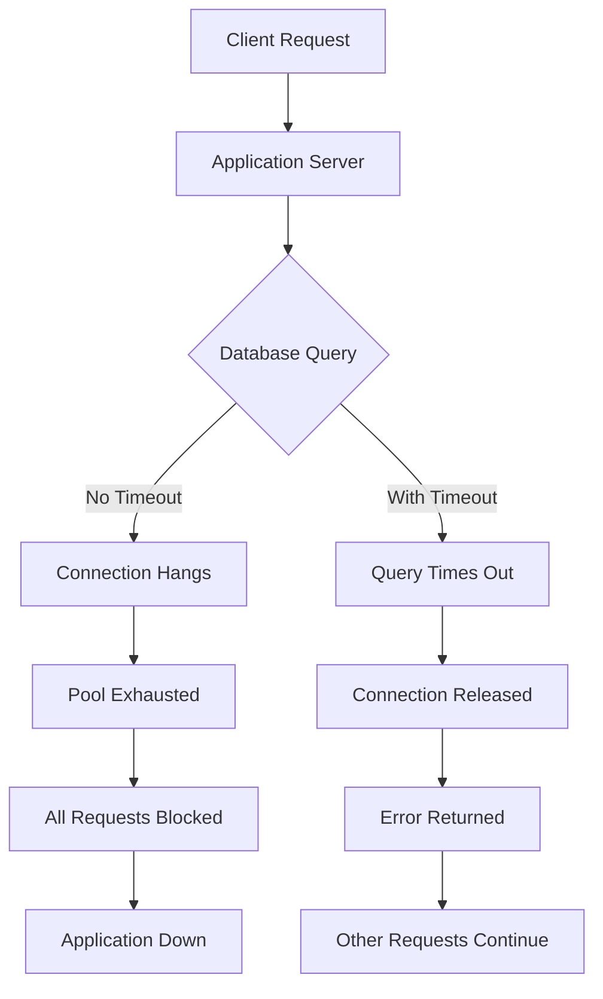
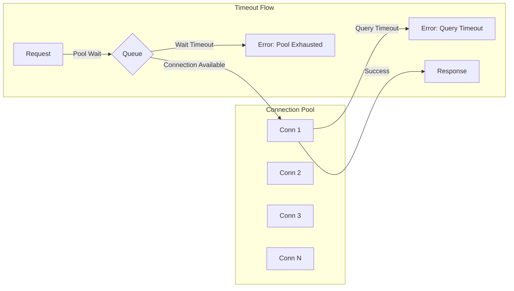

# How to Implement Connection Timeout Configuration

Author: [nawazdhandala](https://github.com/nawazdhandala)

Tags: Database, Timeouts, Reliability, Configuration

Description: Learn to implement connection timeout configuration for preventing resource exhaustion and improving reliability.

---

Connection timeouts are one of the most overlooked settings in application development. Without proper timeout configuration, a single slow database query or unresponsive service can exhaust your connection pool, bringing down your entire application. This guide covers practical timeout strategies across databases, HTTP clients, and message queues.

## Why Connection Timeouts Matter

When a connection hangs indefinitely, it holds resources that other requests need. This creates a cascading failure where one slow dependency causes your entire system to become unresponsive.



## Types of Connection Timeouts

Understanding the different timeout types helps you configure each appropriately.

| Timeout Type | What It Controls | Typical Value |
|--------------|------------------|---------------|
| **Connect timeout** | Time to establish connection | 5-10 seconds |
| **Read/Query timeout** | Time waiting for response | 30-60 seconds |
| **Idle timeout** | Time before closing idle connection | 5-10 minutes |
| **Pool wait timeout** | Time waiting for available connection | 5-10 seconds |
| **Socket timeout** | Low-level network timeout | 30-60 seconds |

## Database Connection Timeouts

### PostgreSQL with Node.js

The pg library provides several timeout options. The connectionTimeoutMillis controls how long to wait when establishing a new connection, while query_timeout limits individual query execution time.

```javascript
const { Pool } = require('pg');

// Configure connection pool with comprehensive timeouts
const pool = new Pool({
  host: process.env.DB_HOST,
  port: 5432,
  database: 'myapp',
  user: process.env.DB_USER,
  password: process.env.DB_PASSWORD,

  // Pool configuration
  max: 20,                        // Maximum connections in pool
  min: 5,                         // Minimum connections to maintain

  // Connection timeouts
  connectionTimeoutMillis: 10000, // Wait 10s to connect
  idleTimeoutMillis: 30000,       // Close idle connections after 30s

  // Query timeout (statement_timeout in PostgreSQL)
  query_timeout: 30000,           // Cancel queries after 30s
});

// Handle pool errors
pool.on('error', (err, client) => {
  console.error('Unexpected pool error:', err.message);
});

// Wrapper function with timeout handling
async function queryWithTimeout(sql, params, timeoutMs = 30000) {
  const client = await pool.connect();

  try {
    // Set statement timeout for this session
    await client.query(`SET statement_timeout = ${timeoutMs}`);

    const result = await client.query(sql, params);
    return result.rows;
  } catch (error) {
    if (error.code === '57014') {
      // PostgreSQL cancellation error code
      throw new Error(`Query timed out after ${timeoutMs}ms`);
    }
    throw error;
  } finally {
    // Always release connection back to pool
    client.release();
  }
}

// Usage
try {
  const users = await queryWithTimeout(
    'SELECT * FROM users WHERE active = $1',
    [true],
    5000  // 5 second timeout for this query
  );
} catch (error) {
  console.error('Query failed:', error.message);
}
```

### MySQL with Connection Pool

MySQL2 provides similar timeout controls. The connectTimeout applies when establishing connections, while the timeout option on individual queries limits execution time.

```javascript
const mysql = require('mysql2/promise');

// Create connection pool with timeouts
const pool = mysql.createPool({
  host: process.env.DB_HOST,
  user: process.env.DB_USER,
  password: process.env.DB_PASSWORD,
  database: 'myapp',

  // Pool settings
  connectionLimit: 20,
  queueLimit: 0,              // Unlimited queue (set a limit in production)

  // Timeouts
  connectTimeout: 10000,      // 10s to establish connection
  waitForConnections: true,

  // Enable connection validation
  enableKeepAlive: true,
  keepAliveInitialDelay: 10000,
});

// Query with explicit timeout
async function executeQuery(sql, params, timeoutMs = 30000) {
  const connection = await pool.getConnection();

  try {
    // Set session-level timeout
    await connection.query(
      `SET SESSION max_execution_time = ${timeoutMs}`
    );

    const [rows] = await connection.query({
      sql,
      values: params,
      timeout: timeoutMs,
    });

    return rows;
  } finally {
    connection.release();
  }
}
```

### MongoDB Connection Configuration

MongoDB provides granular timeout control through serverSelectionTimeoutMS and socketTimeoutMS. The connection string accepts these as query parameters.

```javascript
const { MongoClient } = require('mongodb');

// Connection string with timeout parameters
const uri = 'mongodb://localhost:27017/myapp?' +
  'connectTimeoutMS=10000&' +     // 10s to connect
  'socketTimeoutMS=45000&' +      // 45s socket timeout
  'serverSelectionTimeoutMS=5000'; // 5s to find server

const client = new MongoClient(uri, {
  // Additional timeout options
  maxPoolSize: 50,
  minPoolSize: 10,
  maxIdleTimeMS: 60000,           // Close idle connections after 60s
  waitQueueTimeoutMS: 10000,      // Wait 10s for available connection

  // Server monitoring
  heartbeatFrequencyMS: 10000,    // Check server health every 10s
});

// Query with timeout using maxTimeMS
async function findWithTimeout(collection, filter, timeoutMs = 30000) {
  const db = client.db('myapp');

  return db.collection(collection)
    .find(filter)
    .maxTimeMS(timeoutMs)         // Query-level timeout
    .toArray();
}
```

## HTTP Client Timeouts

### Axios Configuration

HTTP clients need separate timeouts for connection establishment and response reading. Axios combines these but allows granular control through AbortController.

```javascript
const axios = require('axios');

// Create axios instance with default timeouts
const httpClient = axios.create({
  baseURL: 'https://api.example.com',
  timeout: 30000,                 // Overall timeout

  // Decomposed timeouts (Node.js specific)
  httpAgent: new require('http').Agent({
    keepAlive: true,
    timeout: 60000,               // Socket timeout
  }),
  httpsAgent: new require('https').Agent({
    keepAlive: true,
    timeout: 60000,
  }),
});

// Request with custom timeout using AbortController
async function fetchWithTimeout(url, options = {}) {
  const { timeout = 30000, ...config } = options;

  const controller = new AbortController();
  const timeoutId = setTimeout(() => controller.abort(), timeout);

  try {
    const response = await httpClient.get(url, {
      ...config,
      signal: controller.signal,
    });
    return response.data;
  } catch (error) {
    if (error.code === 'ECONNABORTED' || error.name === 'AbortError') {
      throw new Error(`Request timed out after ${timeout}ms`);
    }
    throw error;
  } finally {
    clearTimeout(timeoutId);
  }
}
```

### Native fetch with Timeout

Modern Node.js and browsers support fetch with AbortSignal.timeout for cleaner timeout handling.

```javascript
// Using AbortSignal.timeout (Node.js 18+)
async function fetchData(url, timeoutMs = 30000) {
  try {
    const response = await fetch(url, {
      signal: AbortSignal.timeout(timeoutMs),
    });

    if (!response.ok) {
      throw new Error(`HTTP ${response.status}`);
    }

    return await response.json();
  } catch (error) {
    if (error.name === 'TimeoutError') {
      throw new Error(`Request to ${url} timed out after ${timeoutMs}ms`);
    }
    throw error;
  }
}
```

## Connection Pool Timeout Strategy

The relationship between pool size and timeouts requires careful tuning. Too few connections with long timeouts causes request queuing. Too many connections wastes resources.



This configuration class manages different timeout tiers based on operation importance.

```javascript
// Timeout configuration by operation priority
class TimeoutConfig {
  constructor() {
    this.tiers = {
      // Critical operations: short timeouts, fail fast
      critical: {
        connect: 5000,
        query: 10000,
        poolWait: 3000,
      },
      // Normal operations: standard timeouts
      normal: {
        connect: 10000,
        query: 30000,
        poolWait: 10000,
      },
      // Background jobs: longer timeouts acceptable
      background: {
        connect: 30000,
        query: 120000,
        poolWait: 30000,
      },
    };
  }

  get(tier = 'normal') {
    return this.tiers[tier] || this.tiers.normal;
  }

  // Adjust timeouts based on current load
  adjustForLoad(tier, loadFactor) {
    const base = this.get(tier);

    // Reduce timeouts under high load to fail fast
    if (loadFactor > 0.8) {
      return {
        connect: Math.floor(base.connect * 0.5),
        query: Math.floor(base.query * 0.5),
        poolWait: Math.floor(base.poolWait * 0.3),
      };
    }

    return base;
  }
}

const timeoutConfig = new TimeoutConfig();

// Usage in application
async function getUserData(userId, priority = 'normal') {
  const timeouts = timeoutConfig.get(priority);

  return queryWithTimeout(
    'SELECT * FROM users WHERE id = $1',
    [userId],
    timeouts.query
  );
}
```

## Environment-Based Configuration

Timeout values should differ between environments. Development needs longer timeouts for debugging, while production requires stricter limits.

```javascript
// Load timeout configuration from environment
const config = {
  database: {
    connect: parseInt(process.env.DB_CONNECT_TIMEOUT) || 10000,
    query: parseInt(process.env.DB_QUERY_TIMEOUT) || 30000,
    idle: parseInt(process.env.DB_IDLE_TIMEOUT) || 60000,
    poolWait: parseInt(process.env.DB_POOL_WAIT_TIMEOUT) || 10000,
  },
  http: {
    connect: parseInt(process.env.HTTP_CONNECT_TIMEOUT) || 5000,
    read: parseInt(process.env.HTTP_READ_TIMEOUT) || 30000,
  },
  redis: {
    connect: parseInt(process.env.REDIS_CONNECT_TIMEOUT) || 5000,
    command: parseInt(process.env.REDIS_COMMAND_TIMEOUT) || 5000,
  },
};

// Validate timeouts at startup
function validateTimeouts(config) {
  const errors = [];

  // Connect timeout should be less than query timeout
  if (config.database.connect >= config.database.query) {
    errors.push('DB connect timeout should be less than query timeout');
  }

  // Pool wait should be reasonable
  if (config.database.poolWait > 30000) {
    errors.push('DB pool wait timeout seems too high');
  }

  if (errors.length > 0) {
    console.warn('Timeout configuration warnings:', errors);
  }

  return config;
}

module.exports = validateTimeouts(config);
```

## Timeout Monitoring

Tracking timeout occurrences helps identify problematic queries and services before they cause outages.

```javascript
const prometheus = require('prom-client');

// Metrics for timeout monitoring
const timeoutCounter = new prometheus.Counter({
  name: 'connection_timeouts_total',
  help: 'Total number of connection timeouts',
  labelNames: ['service', 'operation', 'timeout_type'],
});

const connectionDuration = new prometheus.Histogram({
  name: 'connection_duration_seconds',
  help: 'Time spent waiting for connections',
  labelNames: ['service', 'result'],
  buckets: [0.01, 0.05, 0.1, 0.5, 1, 2, 5, 10],
});

// Wrapper that tracks timeout metrics
async function withTimeoutMetrics(service, operation, fn, timeoutMs) {
  const startTime = Date.now();

  try {
    const result = await fn();

    connectionDuration.observe(
      { service, result: 'success' },
      (Date.now() - startTime) / 1000
    );

    return result;
  } catch (error) {
    const duration = Date.now() - startTime;

    connectionDuration.observe(
      { service, result: 'failure' },
      duration / 1000
    );

    // Check if this was a timeout
    if (duration >= timeoutMs * 0.9) {
      timeoutCounter.inc({
        service,
        operation,
        timeout_type: 'query',
      });
    }

    throw error;
  }
}
```

## Summary

| Component | Key Timeouts | Recommended Range |
|-----------|--------------|-------------------|
| **Database** | Connect, Query, Idle | 5-10s, 30-60s, 5-10m |
| **HTTP Client** | Connect, Read | 5-10s, 30-60s |
| **Connection Pool** | Wait, Idle | 5-10s, 5-10m |
| **Redis** | Connect, Command | 3-5s, 3-5s |

Proper timeout configuration prevents resource exhaustion and makes failures predictable. Start with conservative values and adjust based on your monitoring data. Always test timeouts under load to verify they protect your system without causing false failures during normal operation.
