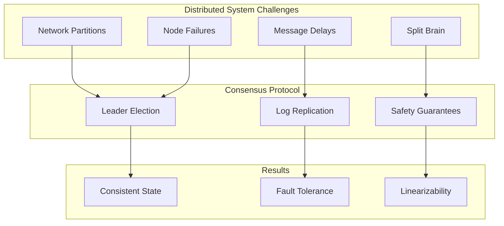
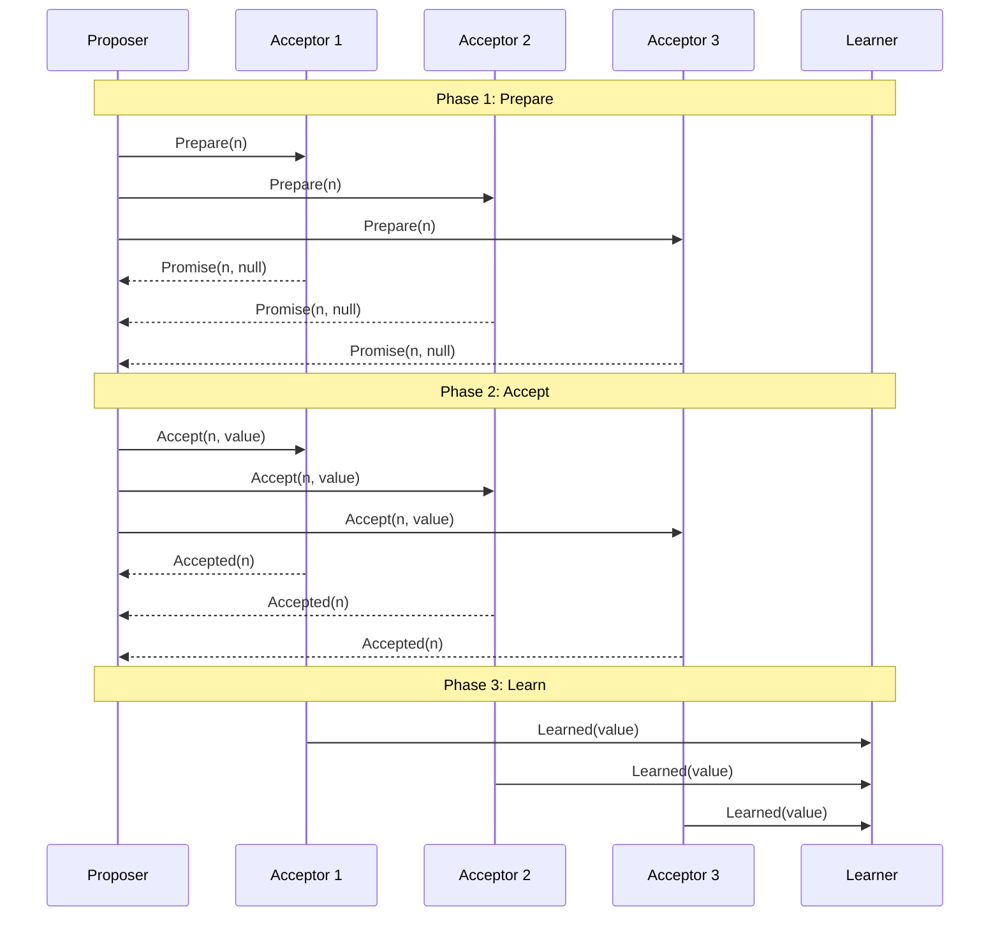
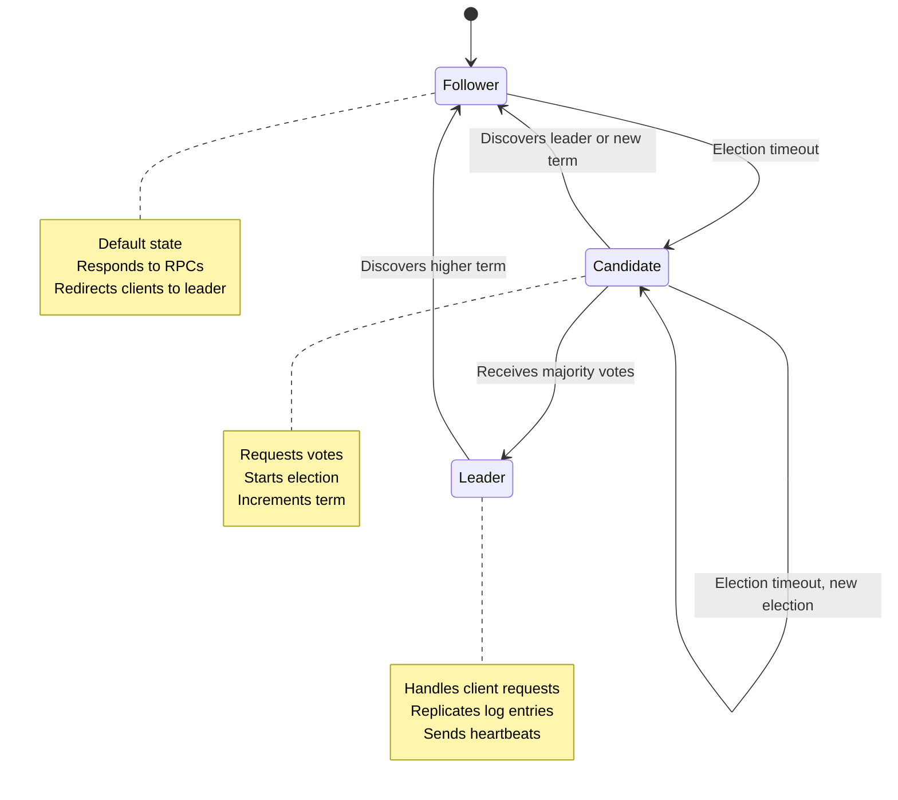
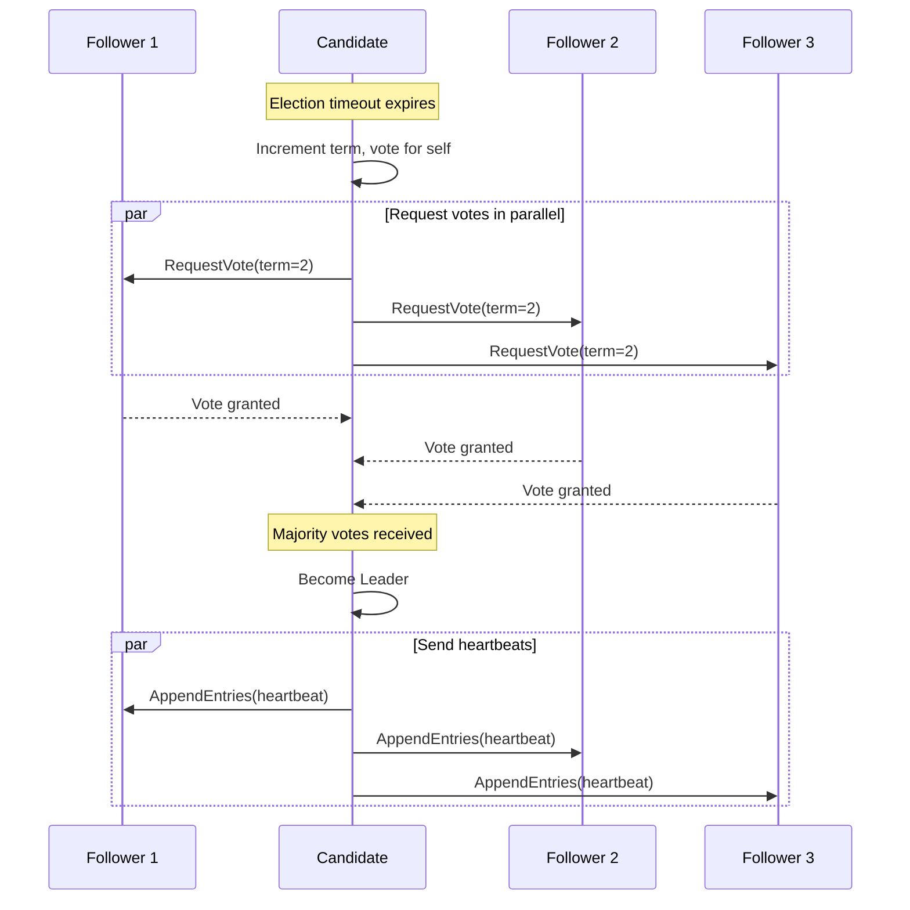
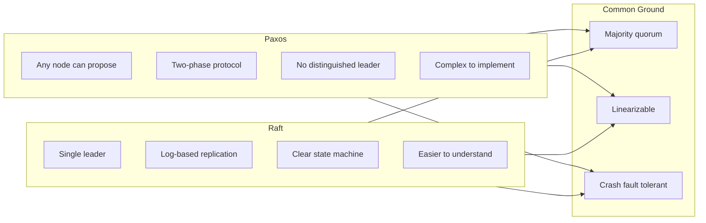
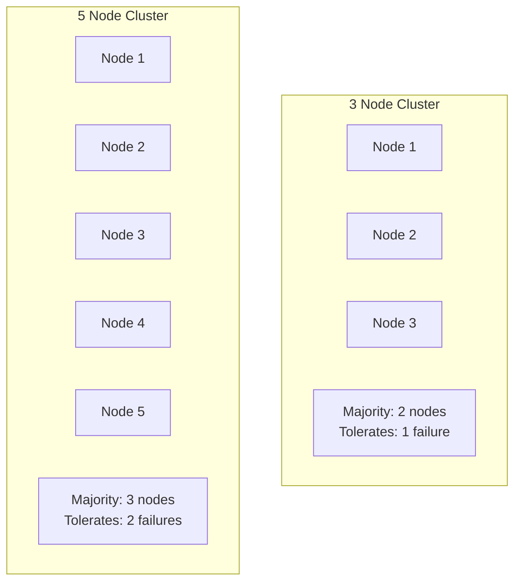

# How to Implement Consensus Protocols

Author: [nawazdhandala](https://github.com/nawazdhandala)

Tags: Distributed Systems, Consensus, Architecture, SRE

Description: Learn how consensus protocols like Raft and Paxos work for distributed agreement.

---

## Introduction

In distributed systems, achieving agreement among multiple nodes is one of the most fundamental and challenging problems. Consensus protocols provide the foundation for building reliable distributed systems by ensuring that all nodes agree on a single value or sequence of operations, even in the presence of failures.

This guide explores two of the most important consensus protocols: Paxos and Raft. We will examine how they work, their differences, and how to implement them in practice using tools like etcd.

## Why Consensus Matters

Distributed systems face several challenges that make consensus essential:

- **Network partitions**: Nodes may become temporarily unreachable
- **Node failures**: Servers can crash and restart at any time
- **Message delays**: Network latency can cause messages to arrive out of order
- **Byzantine failures**: In some systems, nodes may behave maliciously

Consensus protocols solve these problems by providing guarantees about agreement, validity, and termination.



## Understanding Paxos

Paxos, invented by Leslie Lamport in 1989, is one of the first consensus protocols to be proven correct. While notoriously difficult to understand, it forms the basis for many production systems.

### Paxos Roles

In Paxos, nodes can play three roles:

1. **Proposers**: Propose values to be agreed upon
2. **Acceptors**: Vote on proposals and store accepted values
3. **Learners**: Learn the final agreed value



### Basic Paxos Implementation

Here is a simplified implementation of the Paxos protocol in Python:

```python
"""
Basic Paxos Implementation
This module implements a simplified version of the Paxos consensus protocol.
"""

import threading
from dataclasses import dataclass
from typing import Optional, Any, Dict, Tuple
import time
import random


@dataclass
class Proposal:
    """
    Represents a Paxos proposal with a unique number and value.
    The proposal number must be globally unique and monotonically increasing.
    """
    number: int          # Unique proposal number (must be globally unique)
    value: Optional[Any] # The proposed value (can be any type)


class Acceptor:
    """
    Paxos Acceptor role implementation.

    Acceptors are the "memory" of the protocol. They must:
    1. Never forget what they have promised or accepted
    2. Only accept proposals with numbers >= their promised number
    3. Always respond to prepare requests with their highest accepted proposal
    """

    def __init__(self, node_id: str):
        self.node_id = node_id

        # The highest proposal number this acceptor has promised to consider
        self.promised_number: int = 0

        # The highest numbered proposal this acceptor has accepted
        self.accepted_proposal: Optional[Proposal] = None

        # Thread lock for safe concurrent access
        self.lock = threading.Lock()

    def prepare(self, proposal_number: int) -> Tuple[bool, Optional[Proposal]]:
        """
        Handle a prepare request from a proposer.

        Phase 1b of Paxos: If the proposal number is higher than any
        previously promised number, promise not to accept any lower
        numbered proposals.

        Args:
            proposal_number: The proposal number from the proposer

        Returns:
            Tuple of (success, previously_accepted_proposal)
            - success: True if we promise to consider this proposal
            - previously_accepted_proposal: Any value we already accepted
        """
        with self.lock:
            if proposal_number > self.promised_number:
                # Update our promise to this higher number
                self.promised_number = proposal_number

                # Return any previously accepted value so proposer can use it
                return True, self.accepted_proposal
            else:
                # Reject: we already promised to a higher numbered proposal
                return False, None

    def accept(self, proposal: Proposal) -> bool:
        """
        Handle an accept request from a proposer.

        Phase 2b of Paxos: Accept the proposal if its number is >=
        our promised number.

        Args:
            proposal: The proposal to potentially accept

        Returns:
            True if the proposal was accepted, False otherwise
        """
        with self.lock:
            if proposal.number >= self.promised_number:
                # Accept this proposal and update our state
                self.promised_number = proposal.number
                self.accepted_proposal = proposal
                return True
            else:
                # Reject: we promised to consider a higher numbered proposal
                return False


class Proposer:
    """
    Paxos Proposer role implementation.

    Proposers drive the consensus process by:
    1. Generating unique proposal numbers
    2. Running the two-phase protocol
    3. Ensuring progress even with competing proposers
    """

    def __init__(self, node_id: str, acceptors: list):
        self.node_id = node_id
        self.acceptors = acceptors

        # Counter for generating unique proposal numbers
        # In practice, this should include the node_id for global uniqueness
        self.proposal_counter = 0

        self.lock = threading.Lock()

    def generate_proposal_number(self) -> int:
        """
        Generate a unique, monotonically increasing proposal number.

        In a real implementation, this should combine:
        - A local counter
        - The node ID (to ensure global uniqueness)
        - Possibly a timestamp
        """
        with self.lock:
            self.proposal_counter += 1
            # Combine counter with node_id hash for uniqueness
            return self.proposal_counter * 1000 + hash(self.node_id) % 1000

    def propose(self, value: Any) -> Optional[Any]:
        """
        Run the full Paxos protocol to propose a value.

        This implements both phases of Basic Paxos:
        - Phase 1 (Prepare): Get promises from a majority
        - Phase 2 (Accept): Get acceptances from a majority

        Args:
            value: The value we want the cluster to agree on

        Returns:
            The agreed-upon value (might differ from input if another
            value was already accepted)
        """
        proposal_number = self.generate_proposal_number()
        majority = len(self.acceptors) // 2 + 1

        # ============================================
        # PHASE 1: PREPARE
        # ============================================
        # Send prepare requests to all acceptors
        promises = []
        highest_accepted = None

        for acceptor in self.acceptors:
            success, accepted = acceptor.prepare(proposal_number)
            if success:
                promises.append(acceptor)

                # Track the highest numbered accepted proposal
                # We must use this value instead of our own
                if accepted and (highest_accepted is None or
                               accepted.number > highest_accepted.number):
                    highest_accepted = accepted

        # Check if we got promises from a majority
        if len(promises) < majority:
            # Failed to get majority - another proposer may have a higher number
            return None

        # ============================================
        # PHASE 2: ACCEPT
        # ============================================
        # Use highest accepted value if one exists (Paxos safety requirement)
        # Otherwise, use our proposed value
        final_value = highest_accepted.value if highest_accepted else value
        proposal = Proposal(number=proposal_number, value=final_value)

        # Send accept requests to all acceptors that promised
        acceptances = 0
        for acceptor in promises:
            if acceptor.accept(proposal):
                acceptances += 1

        # Check if we got acceptances from a majority
        if acceptances >= majority:
            return final_value  # Consensus achieved!
        else:
            return None  # Failed - try again with higher proposal number


# Example usage demonstrating the protocol
def run_paxos_example():
    """
    Demonstrate Basic Paxos with 3 acceptors.
    """
    # Create a cluster of 3 acceptors (tolerates 1 failure)
    acceptors = [
        Acceptor("acceptor-1"),
        Acceptor("acceptor-2"),
        Acceptor("acceptor-3")
    ]

    # Create a proposer
    proposer = Proposer("proposer-1", acceptors)

    # Propose a value
    agreed_value = proposer.propose("configuration-v1")

    if agreed_value:
        print(f"Consensus reached on value: {agreed_value}")
    else:
        print("Failed to reach consensus")


if __name__ == "__main__":
    run_paxos_example()
```

## Understanding Raft

Raft was designed in 2014 by Diego Ongaro and John Ousterhout specifically to be more understandable than Paxos while providing equivalent guarantees. Raft decomposes consensus into three relatively independent subproblems:

1. **Leader Election**: Selecting a single leader among servers
2. **Log Replication**: The leader accepts commands and replicates them
3. **Safety**: Ensuring state machines execute the same commands in the same order

### Raft Node States



### Leader Election in Raft

The leader election process ensures exactly one leader per term:



### Raft Implementation

Here is a comprehensive Raft implementation:

```python
"""
Raft Consensus Protocol Implementation

This module implements the Raft consensus algorithm including:
- Leader election with randomized timeouts
- Log replication with consistency checks
- Safety guarantees through term-based voting
"""

import threading
import time
import random
from enum import Enum
from dataclasses import dataclass, field
from typing import Optional, List, Dict, Any, Callable
from collections import defaultdict


class NodeState(Enum):
    """
    The three possible states for a Raft node.
    All nodes start as followers.
    """
    FOLLOWER = "follower"
    CANDIDATE = "candidate"
    LEADER = "leader"


@dataclass
class LogEntry:
    """
    A single entry in the Raft log.

    Each entry contains:
    - term: The term when the entry was received by the leader
    - command: The state machine command to execute
    - index: Position in the log (1-indexed)
    """
    term: int
    command: Any
    index: int


@dataclass
class RequestVoteRequest:
    """Request sent by candidates to gather votes."""
    term: int           # Candidate's current term
    candidate_id: str   # ID of the candidate requesting the vote
    last_log_index: int # Index of candidate's last log entry
    last_log_term: int  # Term of candidate's last log entry


@dataclass
class RequestVoteResponse:
    """Response to a vote request."""
    term: int           # Current term of the responding node
    vote_granted: bool  # True if the vote was granted


@dataclass
class AppendEntriesRequest:
    """
    Request sent by leader to replicate log entries.
    Also used as heartbeat when entries is empty.
    """
    term: int                    # Leader's current term
    leader_id: str               # ID of the leader
    prev_log_index: int          # Index of log entry before new ones
    prev_log_term: int           # Term of prev_log_index entry
    entries: List[LogEntry]      # Log entries to store (empty for heartbeat)
    leader_commit: int           # Leader's commit index


@dataclass
class AppendEntriesResponse:
    """Response to an append entries request."""
    term: int      # Current term of the responding node
    success: bool  # True if follower contained matching prev entry


class RaftNode:
    """
    A single Raft consensus node.

    This implementation handles:
    - State transitions between follower, candidate, and leader
    - Leader election with randomized timeouts
    - Log replication with consistency guarantees
    - Commit index advancement
    """

    def __init__(
        self,
        node_id: str,
        peers: List[str],
        send_rpc: Callable,
        apply_command: Callable
    ):
        """
        Initialize a Raft node.

        Args:
            node_id: Unique identifier for this node
            peers: List of peer node IDs in the cluster
            send_rpc: Function to send RPCs to other nodes
            apply_command: Function to apply committed commands to state machine
        """
        self.node_id = node_id
        self.peers = peers
        self.send_rpc = send_rpc
        self.apply_command = apply_command

        # ============================================
        # PERSISTENT STATE (must survive restarts)
        # ============================================
        self.current_term = 0       # Latest term server has seen
        self.voted_for = None       # CandidateId that received vote in current term
        self.log: List[LogEntry] = []  # Log entries

        # ============================================
        # VOLATILE STATE (all servers)
        # ============================================
        self.commit_index = 0  # Index of highest log entry known to be committed
        self.last_applied = 0  # Index of highest log entry applied to state machine
        self.state = NodeState.FOLLOWER

        # ============================================
        # VOLATILE STATE (leaders only, reinitialized after election)
        # ============================================
        # next_index[peer]: index of next log entry to send to that peer
        self.next_index: Dict[str, int] = {}
        # match_index[peer]: index of highest log entry known to be replicated
        self.match_index: Dict[str, int] = {}

        # ============================================
        # TIMING AND SYNCHRONIZATION
        # ============================================
        self.lock = threading.RLock()
        self.election_timeout = self._random_election_timeout()
        self.last_heartbeat = time.time()

        # Start background threads
        self._start_election_timer()
        self._start_heartbeat_sender()

    def _random_election_timeout(self) -> float:
        """
        Generate a random election timeout between 150-300ms.

        Randomization prevents split votes where multiple candidates
        start elections simultaneously.
        """
        return random.uniform(0.150, 0.300)

    def _start_election_timer(self):
        """
        Start the election timeout timer.

        If no heartbeat is received within the timeout,
        this node will start an election.
        """
        def election_timer():
            while True:
                time.sleep(0.050)  # Check every 50ms

                with self.lock:
                    if self.state == NodeState.LEADER:
                        continue

                    elapsed = time.time() - self.last_heartbeat
                    if elapsed >= self.election_timeout:
                        self._start_election()

        thread = threading.Thread(target=election_timer, daemon=True)
        thread.start()

    def _start_heartbeat_sender(self):
        """
        Start sending periodic heartbeats when this node is leader.

        Heartbeats prevent followers from starting elections
        and carry commit index updates.
        """
        def heartbeat_sender():
            while True:
                time.sleep(0.050)  # Send heartbeats every 50ms

                with self.lock:
                    if self.state == NodeState.LEADER:
                        self._send_heartbeats()

        thread = threading.Thread(target=heartbeat_sender, daemon=True)
        thread.start()

    def _start_election(self):
        """
        Start a new election.

        This is called when the election timeout expires without
        receiving a heartbeat from a valid leader.
        """
        with self.lock:
            # Transition to candidate state
            self.state = NodeState.CANDIDATE
            self.current_term += 1  # Increment term for new election
            self.voted_for = self.node_id  # Vote for self
            self.election_timeout = self._random_election_timeout()
            self.last_heartbeat = time.time()  # Reset election timer

            # Prepare vote request
            last_log_index = len(self.log)
            last_log_term = self.log[-1].term if self.log else 0

            request = RequestVoteRequest(
                term=self.current_term,
                candidate_id=self.node_id,
                last_log_index=last_log_index,
                last_log_term=last_log_term
            )

        # Request votes from all peers
        votes_received = 1  # Start with vote for self

        for peer in self.peers:
            response = self.send_rpc(peer, "request_vote", request)

            if response is None:
                continue  # Peer unreachable

            with self.lock:
                # Check if we discovered a higher term
                if response.term > self.current_term:
                    self._step_down(response.term)
                    return

                if response.vote_granted:
                    votes_received += 1

        # Check if we won the election
        with self.lock:
            majority = (len(self.peers) + 1) // 2 + 1

            if self.state == NodeState.CANDIDATE and votes_received >= majority:
                self._become_leader()

    def _become_leader(self):
        """
        Transition to leader state after winning an election.

        Initializes leader state and sends initial heartbeats
        to establish authority.
        """
        self.state = NodeState.LEADER

        # Initialize leader volatile state
        # next_index starts at leader's last log index + 1
        last_log_index = len(self.log)
        for peer in self.peers:
            self.next_index[peer] = last_log_index + 1
            self.match_index[peer] = 0

        # Send initial heartbeats immediately
        self._send_heartbeats()

    def _step_down(self, new_term: int):
        """
        Step down to follower when a higher term is discovered.

        This ensures that at most one leader exists per term.
        """
        self.current_term = new_term
        self.state = NodeState.FOLLOWER
        self.voted_for = None
        self.last_heartbeat = time.time()

    def _send_heartbeats(self):
        """
        Send AppendEntries RPCs to all peers.

        These serve as heartbeats (when entries is empty) and
        carry log entries for replication.
        """
        for peer in self.peers:
            self._send_append_entries(peer)

    def _send_append_entries(self, peer: str):
        """
        Send AppendEntries RPC to a specific peer.

        Includes log entries that the peer is missing.
        """
        with self.lock:
            if self.state != NodeState.LEADER:
                return

            next_idx = self.next_index.get(peer, 1)
            prev_log_index = next_idx - 1
            prev_log_term = self.log[prev_log_index - 1].term if prev_log_index > 0 else 0

            # Get entries to send (if any)
            entries = self.log[next_idx - 1:] if next_idx <= len(self.log) else []

            request = AppendEntriesRequest(
                term=self.current_term,
                leader_id=self.node_id,
                prev_log_index=prev_log_index,
                prev_log_term=prev_log_term,
                entries=entries,
                leader_commit=self.commit_index
            )

        response = self.send_rpc(peer, "append_entries", request)

        if response is None:
            return

        with self.lock:
            if response.term > self.current_term:
                self._step_down(response.term)
                return

            if response.success:
                # Update next_index and match_index for this peer
                self.next_index[peer] = next_idx + len(entries)
                self.match_index[peer] = self.next_index[peer] - 1

                # Try to advance commit index
                self._advance_commit_index()
            else:
                # Decrement next_index and retry
                # This handles log inconsistencies
                self.next_index[peer] = max(1, next_idx - 1)

    def _advance_commit_index(self):
        """
        Advance the commit index if possible.

        A log entry is committed when it has been replicated
        to a majority of servers AND it is from the current term.
        """
        for n in range(self.commit_index + 1, len(self.log) + 1):
            # Count replications (including self)
            replication_count = 1
            for peer in self.peers:
                if self.match_index.get(peer, 0) >= n:
                    replication_count += 1

            majority = (len(self.peers) + 1) // 2 + 1

            # Only commit entries from current term (Raft safety property)
            if replication_count >= majority and self.log[n - 1].term == self.current_term:
                self.commit_index = n

    def handle_request_vote(self, request: RequestVoteRequest) -> RequestVoteResponse:
        """
        Handle a RequestVote RPC from a candidate.

        Grants vote if:
        1. Candidate's term >= current term
        2. Haven't voted for another candidate in this term
        3. Candidate's log is at least as up-to-date as ours
        """
        with self.lock:
            # Check if candidate's term is outdated
            if request.term < self.current_term:
                return RequestVoteResponse(term=self.current_term, vote_granted=False)

            # Step down if we see a higher term
            if request.term > self.current_term:
                self._step_down(request.term)

            # Check if we can vote for this candidate
            vote_granted = False

            if self.voted_for is None or self.voted_for == request.candidate_id:
                # Check if candidate's log is at least as up-to-date
                last_log_index = len(self.log)
                last_log_term = self.log[-1].term if self.log else 0

                log_is_current = (
                    request.last_log_term > last_log_term or
                    (request.last_log_term == last_log_term and
                     request.last_log_index >= last_log_index)
                )

                if log_is_current:
                    vote_granted = True
                    self.voted_for = request.candidate_id
                    self.last_heartbeat = time.time()  # Reset election timer

            return RequestVoteResponse(term=self.current_term, vote_granted=vote_granted)

    def handle_append_entries(self, request: AppendEntriesRequest) -> AppendEntriesResponse:
        """
        Handle an AppendEntries RPC from the leader.

        This handles both heartbeats and log replication.
        """
        with self.lock:
            # Reject if leader's term is outdated
            if request.term < self.current_term:
                return AppendEntriesResponse(term=self.current_term, success=False)

            # Recognize the leader and reset election timer
            self.last_heartbeat = time.time()

            # Step down if we see a higher term
            if request.term > self.current_term:
                self._step_down(request.term)

            # If we're a candidate and see a valid leader, step down
            if self.state == NodeState.CANDIDATE:
                self.state = NodeState.FOLLOWER

            # Check log consistency
            if request.prev_log_index > 0:
                if len(self.log) < request.prev_log_index:
                    # We don't have the previous entry
                    return AppendEntriesResponse(term=self.current_term, success=False)

                if self.log[request.prev_log_index - 1].term != request.prev_log_term:
                    # Previous entry term doesn't match - truncate log
                    self.log = self.log[:request.prev_log_index - 1]
                    return AppendEntriesResponse(term=self.current_term, success=False)

            # Append new entries (after removing any conflicting ones)
            for entry in request.entries:
                if entry.index <= len(self.log):
                    if self.log[entry.index - 1].term != entry.term:
                        # Conflict - remove this and all following entries
                        self.log = self.log[:entry.index - 1]
                        self.log.append(entry)
                else:
                    self.log.append(entry)

            # Update commit index
            if request.leader_commit > self.commit_index:
                self.commit_index = min(request.leader_commit, len(self.log))

            # Apply committed entries to state machine
            self._apply_committed_entries()

            return AppendEntriesResponse(term=self.current_term, success=True)

    def _apply_committed_entries(self):
        """
        Apply all committed but not yet applied entries to the state machine.
        """
        while self.last_applied < self.commit_index:
            self.last_applied += 1
            entry = self.log[self.last_applied - 1]
            self.apply_command(entry.command)

    def submit_command(self, command: Any) -> bool:
        """
        Submit a command to be replicated (only valid on leader).

        Returns True if this node is the leader and accepted the command.
        """
        with self.lock:
            if self.state != NodeState.LEADER:
                return False

            # Append to local log
            entry = LogEntry(
                term=self.current_term,
                command=command,
                index=len(self.log) + 1
            )
            self.log.append(entry)

            return True
```

## Practical Implementation with etcd

etcd is a distributed key-value store that uses Raft for consensus. It is widely used in production systems, including Kubernetes. Here is how to work with etcd for distributed consensus.

### Setting Up an etcd Cluster

```yaml
# docker-compose.yml for a 3-node etcd cluster
version: '3.8'

services:
  etcd1:
    image: quay.io/coreos/etcd:v3.5.9
    container_name: etcd1
    command:
      - etcd
      - --name=etcd1
      - --data-dir=/etcd-data
      # Cluster configuration
      - --initial-advertise-peer-urls=http://etcd1:2380
      - --listen-peer-urls=http://0.0.0.0:2380
      - --advertise-client-urls=http://etcd1:2379
      - --listen-client-urls=http://0.0.0.0:2379
      # Initial cluster members
      - --initial-cluster=etcd1=http://etcd1:2380,etcd2=http://etcd2:2380,etcd3=http://etcd3:2380
      - --initial-cluster-state=new
      - --initial-cluster-token=etcd-cluster-1
    volumes:
      - etcd1-data:/etcd-data
    networks:
      - etcd-network

  etcd2:
    image: quay.io/coreos/etcd:v3.5.9
    container_name: etcd2
    command:
      - etcd
      - --name=etcd2
      - --data-dir=/etcd-data
      - --initial-advertise-peer-urls=http://etcd2:2380
      - --listen-peer-urls=http://0.0.0.0:2380
      - --advertise-client-urls=http://etcd2:2379
      - --listen-client-urls=http://0.0.0.0:2379
      - --initial-cluster=etcd1=http://etcd1:2380,etcd2=http://etcd2:2380,etcd3=http://etcd3:2380
      - --initial-cluster-state=new
      - --initial-cluster-token=etcd-cluster-1
    volumes:
      - etcd2-data:/etcd-data
    networks:
      - etcd-network

  etcd3:
    image: quay.io/coreos/etcd:v3.5.9
    container_name: etcd3
    command:
      - etcd
      - --name=etcd3
      - --data-dir=/etcd-data
      - --initial-advertise-peer-urls=http://etcd3:2380
      - --listen-peer-urls=http://0.0.0.0:2380
      - --advertise-client-urls=http://etcd3:2379
      - --listen-client-urls=http://0.0.0.0:2379
      - --initial-cluster=etcd1=http://etcd1:2380,etcd2=http://etcd2:2380,etcd3=http://etcd3:2380
      - --initial-cluster-state=new
      - --initial-cluster-token=etcd-cluster-1
    volumes:
      - etcd3-data:/etcd-data
    networks:
      - etcd-network

volumes:
  etcd1-data:
  etcd2-data:
  etcd3-data:

networks:
  etcd-network:
    driver: bridge
```

### Using etcd for Distributed Coordination

```python
"""
etcd Client Implementation for Distributed Coordination

This module demonstrates how to use etcd for:
- Leader election
- Distributed locking
- Configuration management
- Service discovery
"""

import etcd3
import threading
import time
from typing import Optional, Callable
from contextlib import contextmanager


class EtcdLeaderElection:
    """
    Implements leader election using etcd leases and transactions.

    This provides automatic failover - if the leader crashes,
    its lease expires and another node becomes leader.
    """

    def __init__(
        self,
        client: etcd3.Etcd3Client,
        election_path: str,
        node_id: str,
        lease_ttl: int = 10
    ):
        """
        Initialize the leader election mechanism.

        Args:
            client: etcd3 client connection
            election_path: Key path for the election (e.g., "/elections/my-service")
            node_id: Unique identifier for this node
            lease_ttl: Lease time-to-live in seconds (leader must renew before expiry)
        """
        self.client = client
        self.election_path = election_path
        self.node_id = node_id
        self.lease_ttl = lease_ttl

        self.lease: Optional[etcd3.Lease] = None
        self.is_leader = False
        self._stop_event = threading.Event()
        self._leader_thread: Optional[threading.Thread] = None

    def start_election(self, on_elected: Callable, on_revoked: Callable):
        """
        Start participating in leader election.

        Args:
            on_elected: Callback when this node becomes leader
            on_revoked: Callback when leadership is lost
        """
        def election_loop():
            while not self._stop_event.is_set():
                try:
                    # Create a lease for our leadership claim
                    self.lease = self.client.lease(ttl=self.lease_ttl)

                    # Try to become leader using a transaction
                    # This is atomic - only succeeds if the key doesn't exist
                    success, _ = self.client.transaction(
                        compare=[
                            # Condition: key doesn't exist (create_revision == 0)
                            self.client.transactions.create(self.election_path) == 0
                        ],
                        success=[
                            # If condition met: create key with our node_id
                            self.client.transactions.put(
                                self.election_path,
                                self.node_id,
                                lease=self.lease
                            )
                        ],
                        failure=[]  # Do nothing if key already exists
                    )

                    if success:
                        # We are the leader!
                        self.is_leader = True
                        on_elected()

                        # Keep the lease alive while we're leader
                        self._maintain_leadership(on_revoked)
                    else:
                        # Another node is leader - wait for change
                        self._wait_for_leader_change()

                except Exception as e:
                    print(f"Election error: {e}")
                    time.sleep(1)  # Back off before retrying

        self._leader_thread = threading.Thread(target=election_loop, daemon=True)
        self._leader_thread.start()

    def _maintain_leadership(self, on_revoked: Callable):
        """
        Maintain leadership by keeping the lease alive.

        If we fail to refresh the lease, another node can take over.
        """
        try:
            # Refresh lease periodically (every TTL/3 seconds)
            for _ in self.lease.refresh():
                if self._stop_event.is_set():
                    break
                time.sleep(self.lease_ttl / 3)
        except Exception:
            pass
        finally:
            # Leadership lost
            self.is_leader = False
            on_revoked()

    def _wait_for_leader_change(self):
        """
        Watch for changes to the election key.

        When the current leader's lease expires, we'll be notified
        and can try to become leader.
        """
        events_iterator, cancel = self.client.watch(self.election_path)

        try:
            for event in events_iterator:
                if isinstance(event, etcd3.events.DeleteEvent):
                    # Leader is gone - break to try election
                    break

                if self._stop_event.is_set():
                    break
        finally:
            cancel()

    def resign(self):
        """
        Voluntarily give up leadership.

        Call this for graceful shutdown.
        """
        self._stop_event.set()

        if self.lease:
            try:
                self.lease.revoke()
            except Exception:
                pass

        self.is_leader = False


class EtcdDistributedLock:
    """
    Distributed lock implementation using etcd.

    Provides mutual exclusion across multiple processes/nodes.
    """

    def __init__(
        self,
        client: etcd3.Etcd3Client,
        lock_name: str,
        ttl: int = 30
    ):
        """
        Initialize a distributed lock.

        Args:
            client: etcd3 client connection
            lock_name: Name of the lock (will be prefixed with /locks/)
            ttl: Lock TTL in seconds (prevents deadlock if holder crashes)
        """
        self.client = client
        self.lock_path = f"/locks/{lock_name}"
        self.ttl = ttl
        self.lease: Optional[etcd3.Lease] = None

    @contextmanager
    def acquire(self, timeout: float = 30.0):
        """
        Acquire the lock with a context manager.

        Usage:
            with lock.acquire():
                # Critical section
                pass

        Args:
            timeout: Maximum time to wait for the lock
        """
        start_time = time.time()
        acquired = False

        try:
            while time.time() - start_time < timeout:
                # Create a lease for our lock hold
                self.lease = self.client.lease(ttl=self.ttl)

                # Try to acquire lock atomically
                success, _ = self.client.transaction(
                    compare=[
                        self.client.transactions.create(self.lock_path) == 0
                    ],
                    success=[
                        self.client.transactions.put(
                            self.lock_path,
                            "locked",
                            lease=self.lease
                        )
                    ],
                    failure=[]
                )

                if success:
                    acquired = True

                    # Start lease keepalive in background
                    keepalive_thread = threading.Thread(
                        target=self._keepalive,
                        daemon=True
                    )
                    keepalive_thread.start()

                    yield  # Lock acquired - execute critical section
                    return
                else:
                    # Lock held by someone else - wait for release
                    self.lease.revoke()
                    self._wait_for_unlock(timeout - (time.time() - start_time))

            raise TimeoutError(f"Failed to acquire lock '{self.lock_path}' within {timeout}s")

        finally:
            if acquired:
                self._release()

    def _keepalive(self):
        """Keep the lease alive while we hold the lock."""
        try:
            for _ in self.lease.refresh():
                time.sleep(self.ttl / 3)
        except Exception:
            pass

    def _wait_for_unlock(self, timeout: float):
        """Wait for the lock to be released."""
        events_iterator, cancel = self.client.watch(self.lock_path)

        try:
            # Set up timeout
            timer = threading.Timer(timeout, cancel)
            timer.start()

            for event in events_iterator:
                if isinstance(event, etcd3.events.DeleteEvent):
                    break
        finally:
            timer.cancel()
            cancel()

    def _release(self):
        """Release the lock by revoking the lease."""
        if self.lease:
            try:
                self.lease.revoke()
            except Exception:
                pass


class EtcdServiceDiscovery:
    """
    Service discovery using etcd.

    Services register themselves with etcd, and clients can
    discover available service instances.
    """

    def __init__(self, client: etcd3.Etcd3Client, service_prefix: str = "/services"):
        """
        Initialize service discovery.

        Args:
            client: etcd3 client connection
            service_prefix: Prefix for service registration keys
        """
        self.client = client
        self.service_prefix = service_prefix
        self.registrations: dict = {}

    def register(
        self,
        service_name: str,
        instance_id: str,
        address: str,
        port: int,
        metadata: dict = None,
        ttl: int = 30
    ):
        """
        Register a service instance.

        Args:
            service_name: Name of the service (e.g., "api-server")
            instance_id: Unique ID for this instance
            address: IP address or hostname
            port: Service port
            metadata: Optional metadata (version, region, etc.)
            ttl: Registration TTL (must be refreshed)
        """
        import json

        key = f"{self.service_prefix}/{service_name}/{instance_id}"
        value = json.dumps({
            "address": address,
            "port": port,
            "metadata": metadata or {}
        })

        # Create lease and register
        lease = self.client.lease(ttl=ttl)
        self.client.put(key, value, lease=lease)

        # Start keepalive
        def keepalive():
            try:
                for _ in lease.refresh():
                    time.sleep(ttl / 3)
            except Exception:
                pass

        thread = threading.Thread(target=keepalive, daemon=True)
        thread.start()

        self.registrations[key] = lease

    def discover(self, service_name: str) -> list:
        """
        Discover all instances of a service.

        Args:
            service_name: Name of the service to discover

        Returns:
            List of service instance dictionaries
        """
        import json

        prefix = f"{self.service_prefix}/{service_name}/"
        instances = []

        for value, metadata in self.client.get_prefix(prefix):
            if value:
                instance = json.loads(value.decode())
                instance["key"] = metadata.key.decode()
                instances.append(instance)

        return instances

    def watch_service(self, service_name: str, callback: Callable):
        """
        Watch for changes to a service's instances.

        Args:
            service_name: Service to watch
            callback: Function called with (event_type, instance) on changes
        """
        import json

        prefix = f"{self.service_prefix}/{service_name}/"

        def watch_loop():
            events_iterator, cancel = self.client.watch_prefix(prefix)

            for event in events_iterator:
                if isinstance(event, etcd3.events.PutEvent):
                    instance = json.loads(event.value.decode())
                    callback("added", instance)
                elif isinstance(event, etcd3.events.DeleteEvent):
                    callback("removed", {"key": event.key.decode()})

        thread = threading.Thread(target=watch_loop, daemon=True)
        thread.start()


# Example usage
def main():
    """Demonstrate etcd-based distributed coordination."""

    # Connect to etcd cluster
    client = etcd3.client(
        host='localhost',
        port=2379
    )

    # Example 1: Leader Election
    print("Starting leader election...")

    election = EtcdLeaderElection(
        client=client,
        election_path="/elections/my-service",
        node_id="node-1"
    )

    election.start_election(
        on_elected=lambda: print("I am now the leader!"),
        on_revoked=lambda: print("Leadership lost")
    )

    # Example 2: Distributed Lock
    print("\nUsing distributed lock...")

    lock = EtcdDistributedLock(client, "my-resource")

    with lock.acquire(timeout=10):
        print("Lock acquired - executing critical section")
        time.sleep(2)

    print("Lock released")

    # Example 3: Service Discovery
    print("\nRegistering service...")

    discovery = EtcdServiceDiscovery(client)

    # Register this instance
    discovery.register(
        service_name="api-server",
        instance_id="instance-1",
        address="192.168.1.100",
        port=8080,
        metadata={"version": "1.0.0", "region": "us-east-1"}
    )

    # Discover all instances
    instances = discovery.discover("api-server")
    print(f"Found {len(instances)} api-server instances: {instances}")


if __name__ == "__main__":
    main()
```

## Comparing Paxos and Raft



| Aspect | Paxos | Raft |
|--------|-------|------|
| Leader | Optional (Multi-Paxos uses one) | Required |
| Understandability | Difficult | Designed for clarity |
| Log ordering | Not inherent | Strictly ordered |
| Membership changes | Complex | Built-in reconfiguration |
| Industry adoption | Google Chubby, Apache Zookeeper | etcd, Consul, TiKV |

## Best Practices for Production

### 1. Cluster Sizing

Always use an odd number of nodes (3, 5, or 7) to maximize fault tolerance:

- **3 nodes**: Tolerates 1 failure
- **5 nodes**: Tolerates 2 failures
- **7 nodes**: Tolerates 3 failures (rarely needed)



### 2. Network Configuration

```yaml
# Production etcd configuration
# /etc/etcd/etcd.conf.yml

name: 'etcd-node-1'
data-dir: '/var/lib/etcd'

# Listening configuration
listen-peer-urls: 'https://10.0.1.10:2380'
listen-client-urls: 'https://10.0.1.10:2379,https://127.0.0.1:2379'

# Advertising configuration
initial-advertise-peer-urls: 'https://10.0.1.10:2380'
advertise-client-urls: 'https://10.0.1.10:2379'

# Cluster configuration
initial-cluster: 'etcd-node-1=https://10.0.1.10:2380,etcd-node-2=https://10.0.1.11:2380,etcd-node-3=https://10.0.1.12:2380'
initial-cluster-token: 'production-cluster-1'
initial-cluster-state: 'new'

# TLS configuration for security
client-transport-security:
  cert-file: '/etc/etcd/ssl/server.crt'
  key-file: '/etc/etcd/ssl/server.key'
  trusted-ca-file: '/etc/etcd/ssl/ca.crt'
  client-cert-auth: true

peer-transport-security:
  cert-file: '/etc/etcd/ssl/peer.crt'
  key-file: '/etc/etcd/ssl/peer.key'
  trusted-ca-file: '/etc/etcd/ssl/ca.crt'
  client-cert-auth: true

# Performance tuning
heartbeat-interval: 100        # Milliseconds between heartbeats
election-timeout: 1000         # Milliseconds before starting election
snapshot-count: 10000          # Number of transactions before snapshot
max-snapshots: 5               # Maximum snapshot files to retain
max-wals: 5                    # Maximum WAL files to retain
```

### 3. Monitoring and Observability

Monitor these key metrics for healthy consensus:

```python
"""
Monitoring metrics for consensus protocols.

These metrics help identify issues before they cause outages.
"""

# Key metrics to monitor
CONSENSUS_METRICS = {
    # Leader metrics
    "etcd_server_has_leader": {
        "description": "Whether a leader exists (1 = yes, 0 = no)",
        "alert_threshold": "== 0 for > 30s",
        "severity": "critical"
    },
    "etcd_server_leader_changes_seen_total": {
        "description": "Number of leader changes",
        "alert_threshold": "> 3 per hour",
        "severity": "warning"
    },

    # Proposal metrics
    "etcd_server_proposals_committed_total": {
        "description": "Total committed proposals",
        "alert_threshold": "rate < expected_write_rate",
        "severity": "warning"
    },
    "etcd_server_proposals_failed_total": {
        "description": "Total failed proposals",
        "alert_threshold": "rate > 0",
        "severity": "warning"
    },
    "etcd_server_proposals_pending": {
        "description": "Current pending proposals",
        "alert_threshold": "> 5 for > 1m",
        "severity": "warning"
    },

    # Latency metrics
    "etcd_disk_wal_fsync_duration_seconds": {
        "description": "WAL fsync latency",
        "alert_threshold": "p99 > 10ms",
        "severity": "warning"
    },
    "etcd_network_peer_round_trip_time_seconds": {
        "description": "Network RTT to peers",
        "alert_threshold": "p99 > election_timeout / 2",
        "severity": "critical"
    }
}
```

## Conclusion

Consensus protocols are the foundation of reliable distributed systems. While Paxos provides the theoretical foundation, Raft offers a more practical and understandable approach. For production systems, using battle-tested implementations like etcd provides the benefits of consensus without the complexity of building it yourself.

Key takeaways:

1. **Start with etcd**: Unless you have specific requirements, use etcd rather than implementing Raft yourself
2. **Understand the theory**: Knowing how Raft works helps debug issues and make architectural decisions
3. **Monitor everything**: Leader elections, proposal latency, and network health are critical metrics
4. **Plan for failures**: Design your system assuming nodes will fail and network partitions will occur
5. **Test chaos**: Regularly test your system's behavior under failure conditions

## Further Reading

- [Raft Paper](https://raft.github.io/raft.pdf) - "In Search of an Understandable Consensus Algorithm"
- [Paxos Made Simple](https://lamport.azurewebsites.net/pubs/paxos-simple.pdf) - Leslie Lamport's accessible explanation
- [etcd Documentation](https://etcd.io/docs/) - Official etcd guides and references
- [Designing Data-Intensive Applications](https://dataintensive.net/) - Comprehensive coverage of distributed systems concepts
