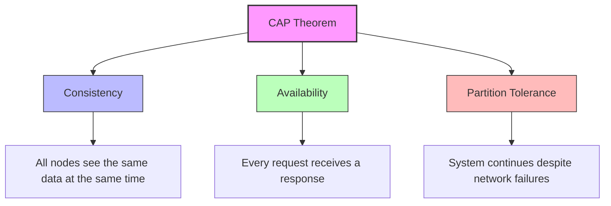
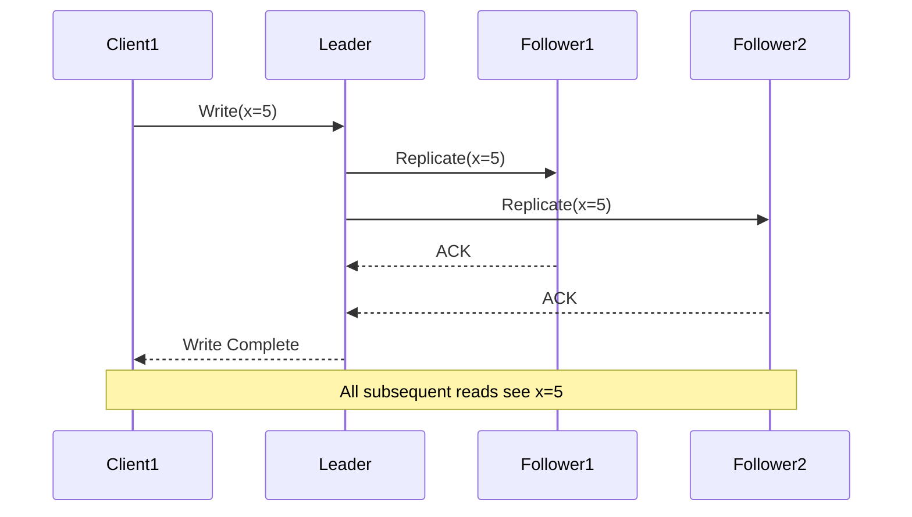
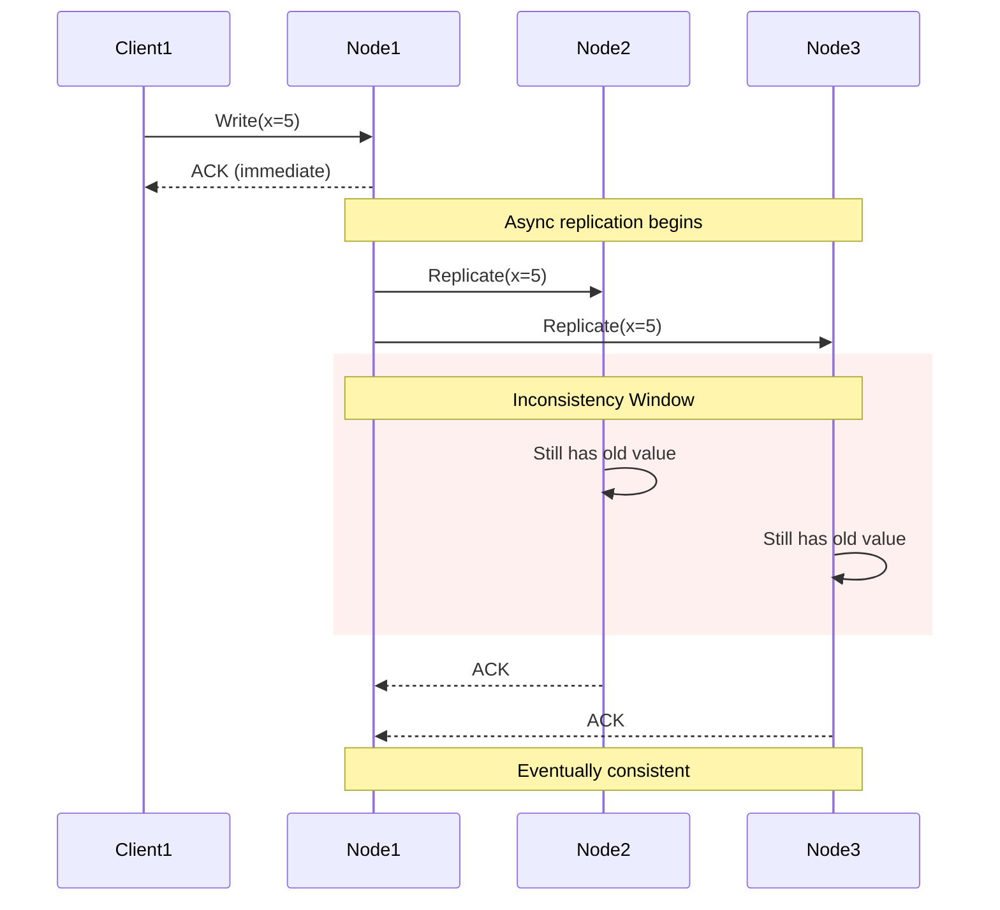
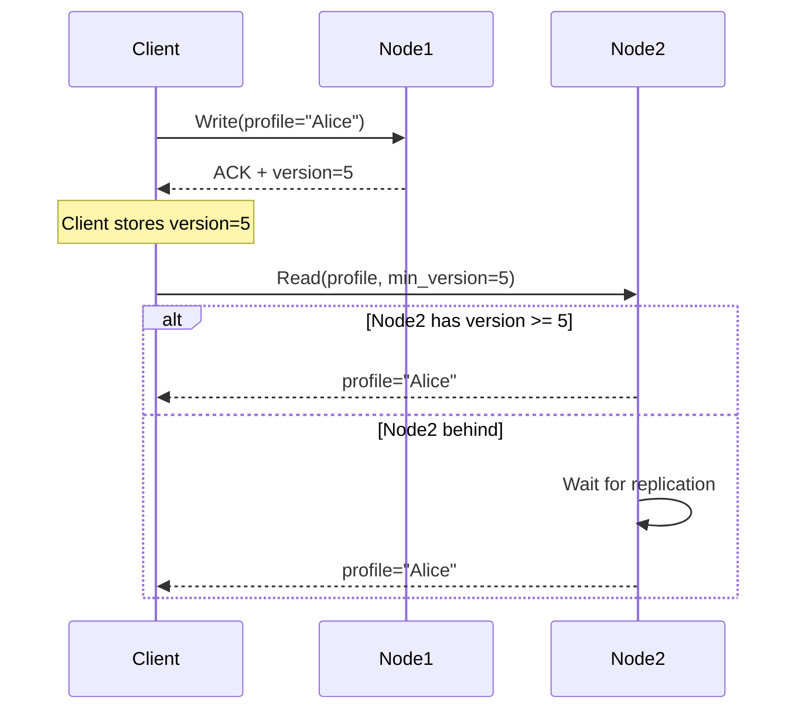
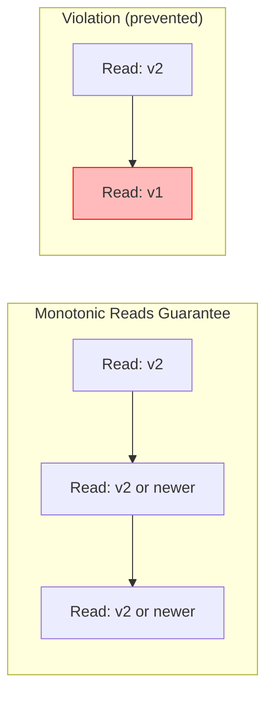
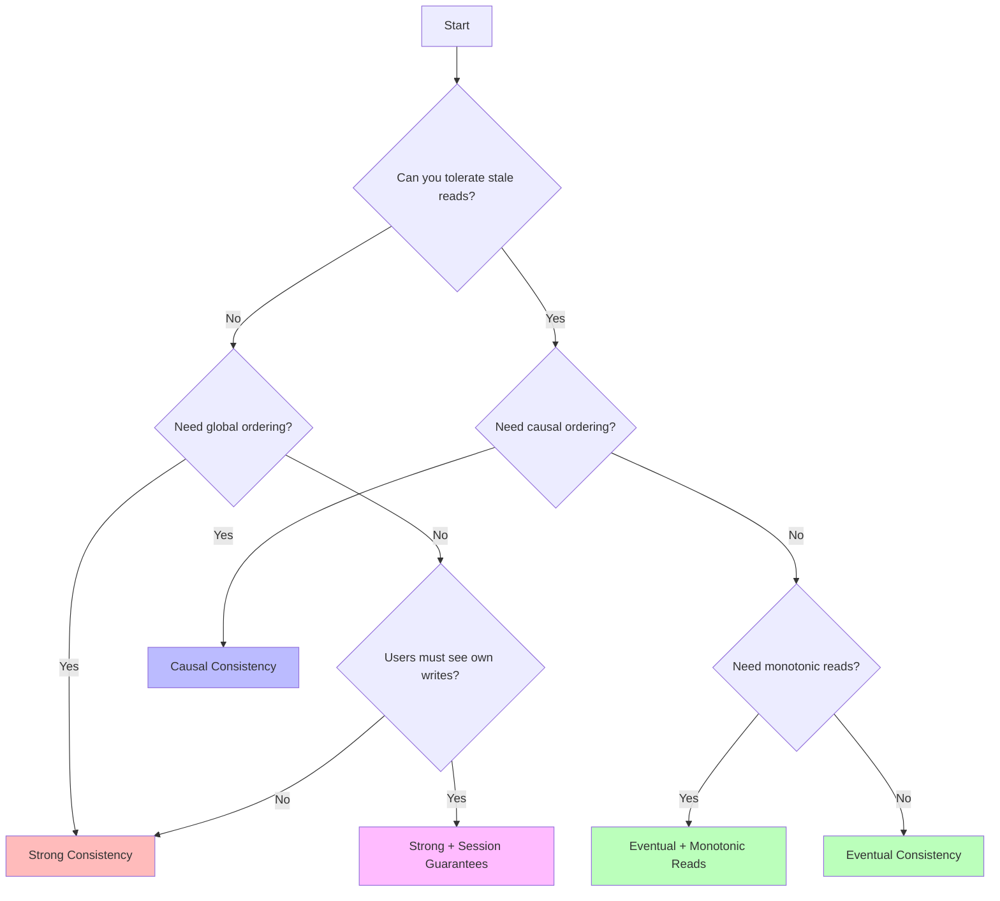

# How to Create Consistency Models

Author: [nawazdhandala](https://github.com/nawazdhandala)

Tags: Distributed Systems, Consistency, CAP Theorem, Database

Description: Learn about consistency models and how to choose the right one for your system.

---

## What Are Consistency Models?

A consistency model defines the contract between a distributed system and its clients regarding when and how updates become visible across different nodes. It answers the fundamental question: "After I write data, when can I expect to read it back?"

Choosing the right consistency model is one of the most consequential decisions in distributed system design. It affects everything from user experience to system complexity to operational overhead.

## The CAP Theorem Context

Before diving into consistency models, understand the constraints:



In the presence of network partitions (which are inevitable), you must choose between consistency and availability. This fundamental trade-off shapes every consistency model.

## Strong Consistency

Strong consistency (also called linearizability) guarantees that all operations appear to execute atomically in some sequential order, and that order is consistent with the real-time ordering of operations.

### How It Works



### Implementation Example

Here is a simplified strong consistency coordinator in Python:

```python
import threading
from typing import Dict, List, Optional
from dataclasses import dataclass
from enum import Enum
import time

class ConsistencyLevel(Enum):
    STRONG = "strong"
    EVENTUAL = "eventual"
    QUORUM = "quorum"

@dataclass
class WriteOperation:
    key: str
    value: any
    timestamp: float
    version: int

class StrongConsistencyStore:
    """
    Implements strong consistency using a leader-based approach
    with synchronous replication to all followers.
    """

    def __init__(self, node_id: str, is_leader: bool = False):
        self.node_id = node_id
        self.is_leader = is_leader
        self.data: Dict[str, any] = {}
        self.versions: Dict[str, int] = {}
        self.lock = threading.RLock()
        self.followers: List['StrongConsistencyStore'] = []

    def register_follower(self, follower: 'StrongConsistencyStore'):
        """Register a follower node for replication."""
        self.followers.append(follower)

    def write(self, key: str, value: any) -> bool:
        """
        Write with strong consistency.
        Blocks until all followers acknowledge.
        """
        if not self.is_leader:
            raise Exception("Writes must go through the leader")

        with self.lock:
            # Increment version
            current_version = self.versions.get(key, 0) + 1
            operation = WriteOperation(
                key=key,
                value=value,
                timestamp=time.time(),
                version=current_version
            )

            # Replicate to ALL followers synchronously
            acks = []
            for follower in self.followers:
                try:
                    success = follower.apply_write(operation)
                    acks.append(success)
                except Exception as e:
                    # In strong consistency, any failure aborts the write
                    self._rollback_write(operation)
                    return False

            # Only commit locally after all followers acknowledge
            if all(acks):
                self.data[key] = value
                self.versions[key] = current_version
                return True
            else:
                self._rollback_write(operation)
                return False

    def apply_write(self, operation: WriteOperation) -> bool:
        """Apply a write operation from the leader."""
        with self.lock:
            # Version check prevents out-of-order writes
            current = self.versions.get(operation.key, 0)
            if operation.version <= current:
                return False  # Stale write

            self.data[operation.key] = operation.value
            self.versions[operation.key] = operation.version
            return True

    def read(self, key: str) -> Optional[any]:
        """Read always returns the most recent committed value."""
        with self.lock:
            return self.data.get(key)

    def _rollback_write(self, operation: WriteOperation):
        """Rollback a failed write on followers."""
        for follower in self.followers:
            try:
                follower.rollback(operation)
            except:
                pass  # Best effort rollback
```

### When to Use Strong Consistency

- Financial transactions where money cannot be lost or duplicated
- Inventory systems where overselling is unacceptable
- Distributed locks and leader election
- Any system where "reading stale data" causes business-critical issues

### Trade-offs

| Benefit | Cost |
|---------|------|
| Simplest programming model | Higher latency (wait for all nodes) |
| No stale reads | Lower availability during partitions |
| Predictable behavior | More expensive coordination |

## Eventual Consistency

Eventual consistency guarantees that if no new updates are made, eventually all reads will return the last updated value. The system converges to a consistent state "eventually."

### How It Works



### Implementation Example

```python
import asyncio
import random
from typing import Dict, Set, Optional
from dataclasses import dataclass, field
from collections import defaultdict
import time

@dataclass
class VectorClock:
    """Vector clock for tracking causality in distributed systems."""
    clocks: Dict[str, int] = field(default_factory=dict)

    def increment(self, node_id: str):
        self.clocks[node_id] = self.clocks.get(node_id, 0) + 1

    def merge(self, other: 'VectorClock'):
        """Merge two vector clocks, taking max of each component."""
        all_nodes = set(self.clocks.keys()) | set(other.clocks.keys())
        for node in all_nodes:
            self.clocks[node] = max(
                self.clocks.get(node, 0),
                other.clocks.get(node, 0)
            )

    def happens_before(self, other: 'VectorClock') -> bool:
        """Check if this clock happens before other."""
        dominated = False
        for node, time in other.clocks.items():
            self_time = self.clocks.get(node, 0)
            if self_time > time:
                return False
            if self_time < time:
                dominated = True
        return dominated

    def concurrent_with(self, other: 'VectorClock') -> bool:
        """Check if two events are concurrent (neither happens before)."""
        return not self.happens_before(other) and not other.happens_before(self)

@dataclass
class VersionedValue:
    value: any
    vector_clock: VectorClock
    timestamp: float

class EventualConsistencyStore:
    """
    Implements eventual consistency with:
    - Asynchronous replication
    - Vector clocks for conflict detection
    - Last-writer-wins conflict resolution
    """

    def __init__(self, node_id: str):
        self.node_id = node_id
        self.data: Dict[str, VersionedValue] = {}
        self.peers: Set['EventualConsistencyStore'] = set()
        self.pending_replications: asyncio.Queue = asyncio.Queue()

    def connect_peer(self, peer: 'EventualConsistencyStore'):
        """Connect to a peer node for replication."""
        self.peers.add(peer)

    async def write(self, key: str, value: any) -> bool:
        """
        Write with eventual consistency.
        Returns immediately after local write.
        """
        # Create new vector clock
        clock = VectorClock()
        if key in self.data:
            clock = VectorClock(self.data[key].vector_clock.clocks.copy())
        clock.increment(self.node_id)

        versioned = VersionedValue(
            value=value,
            vector_clock=clock,
            timestamp=time.time()
        )

        # Write locally first
        self.data[key] = versioned

        # Queue async replication (fire and forget)
        await self._schedule_replication(key, versioned)

        return True  # Immediate acknowledgment

    async def _schedule_replication(self, key: str, versioned: VersionedValue):
        """Schedule asynchronous replication to peers."""
        for peer in self.peers:
            # Simulate network delay and potential failures
            asyncio.create_task(self._replicate_to_peer(peer, key, versioned))

    async def _replicate_to_peer(
        self,
        peer: 'EventualConsistencyStore',
        key: str,
        versioned: VersionedValue
    ):
        """Replicate a value to a peer with retry logic."""
        max_retries = 3
        for attempt in range(max_retries):
            try:
                # Simulate network delay
                await asyncio.sleep(random.uniform(0.01, 0.1))
                await peer.receive_replication(key, versioned)
                return
            except Exception as e:
                if attempt == max_retries - 1:
                    # Log failure, will be reconciled via anti-entropy
                    print(f"Replication failed to {peer.node_id}: {e}")
                await asyncio.sleep(0.1 * (attempt + 1))

    async def receive_replication(self, key: str, incoming: VersionedValue):
        """
        Receive a replicated value and resolve conflicts.
        Uses last-writer-wins with vector clock tiebreaker.
        """
        if key not in self.data:
            self.data[key] = incoming
            return

        existing = self.data[key]

        # Check causality using vector clocks
        if incoming.vector_clock.happens_before(existing.vector_clock):
            # Incoming is older, ignore
            return
        elif existing.vector_clock.happens_before(incoming.vector_clock):
            # Incoming is newer, accept
            self.data[key] = incoming
        else:
            # Concurrent writes - need conflict resolution
            # Using last-writer-wins based on timestamp
            if incoming.timestamp > existing.timestamp:
                self.data[key] = incoming
            # If timestamps equal, could use node_id as tiebreaker

    def read(self, key: str) -> Optional[any]:
        """Read the local value (may be stale)."""
        if key in self.data:
            return self.data[key].value
        return None

    async def anti_entropy_sync(self, peer: 'EventualConsistencyStore'):
        """
        Periodic anti-entropy synchronization.
        Compares and exchanges data to ensure convergence.
        """
        for key, versioned in self.data.items():
            await peer.receive_replication(key, versioned)
        for key, versioned in peer.data.items():
            await self.receive_replication(key, versioned)
```

### When to Use Eventual Consistency

- Social media feeds where slight delays are acceptable
- Shopping carts (with conflict resolution strategy)
- Session data and user preferences
- Analytics and metrics collection
- DNS and caching systems

### Trade-offs

| Benefit | Cost |
|---------|------|
| High availability | Possible stale reads |
| Low latency writes | Complex conflict resolution |
| Partition tolerant | Harder to reason about |

## Causal Consistency

Causal consistency preserves the order of causally related operations while allowing concurrent operations to be seen in any order. It sits between strong and eventual consistency.

### How It Works

```mermaid
graph TD
    subgraph "Causally Related"
        A[Post: "Hello World"] --> B[Comment: "Nice post!"]
        B --> C[Reply: "Thanks!"]
    end

    subgraph "Concurrent - Order doesn't matter"
        D[Like from User1]
        E[Like from User2]
    end

    A -.-> D
    A -.-> E

    style A fill:#bbf
    style B fill:#bbf
    style C fill:#bbf
    style D fill:#bfb
    style E fill:#bfb
```

### Implementation Example

```python
from typing import Dict, List, Set, Optional, Tuple
from dataclasses import dataclass, field
from collections import defaultdict
import threading

@dataclass
class CausalContext:
    """
    Tracks causal dependencies using a dependency set.
    Each operation carries the context of operations it depends on.
    """
    # Map of node_id -> highest seen sequence number
    dependencies: Dict[str, int] = field(default_factory=dict)

    def copy(self) -> 'CausalContext':
        return CausalContext(dict(self.dependencies))

    def add_dependency(self, node_id: str, seq: int):
        current = self.dependencies.get(node_id, 0)
        self.dependencies[node_id] = max(current, seq)

    def satisfies(self, other: 'CausalContext') -> bool:
        """Check if this context satisfies all dependencies in other."""
        for node_id, seq in other.dependencies.items():
            if self.dependencies.get(node_id, 0) < seq:
                return False
        return True

@dataclass
class CausalOperation:
    key: str
    value: any
    origin_node: str
    sequence: int
    causal_context: CausalContext

class CausalConsistencyStore:
    """
    Implements causal consistency using explicit dependency tracking.
    Operations are only made visible when their causal dependencies are satisfied.
    """

    def __init__(self, node_id: str):
        self.node_id = node_id
        self.sequence = 0
        self.data: Dict[str, any] = {}
        self.lock = threading.RLock()

        # Current causal context (what we've seen)
        self.current_context = CausalContext()

        # Pending operations waiting for dependencies
        self.pending: List[CausalOperation] = []

        # Per-key version tracking
        self.key_versions: Dict[str, Tuple[str, int]] = {}

        # Connected peers
        self.peers: Set['CausalConsistencyStore'] = set()

    def connect_peer(self, peer: 'CausalConsistencyStore'):
        self.peers.add(peer)

    def write(self, key: str, value: any, client_context: CausalContext = None) -> CausalContext:
        """
        Write with causal consistency.
        Takes the client's context to establish causal dependencies.
        Returns updated context for the client to use in subsequent operations.
        """
        with self.lock:
            self.sequence += 1

            # Build operation context from client's view + local state
            op_context = CausalContext()
            if client_context:
                op_context.dependencies = dict(client_context.dependencies)
            op_context.add_dependency(self.node_id, self.sequence)

            operation = CausalOperation(
                key=key,
                value=value,
                origin_node=self.node_id,
                sequence=self.sequence,
                causal_context=op_context
            )

            # Apply locally
            self._apply_operation(operation)

            # Replicate to peers asynchronously
            self._replicate_to_peers(operation)

            # Return updated context for client
            return op_context.copy()

    def read(self, key: str, client_context: CausalContext = None) -> Tuple[Optional[any], CausalContext]:
        """
        Read with causal consistency.
        May block if client's causal dependencies aren't satisfied yet.
        Returns value and updated context.
        """
        with self.lock:
            # First, try to apply any pending operations
            self._try_apply_pending()

            # Check if we satisfy client's causal dependencies
            if client_context and not self.current_context.satisfies(client_context):
                # In a real system, might wait or return error
                # Here we just return what we have
                pass

            value = self.data.get(key)
            return value, self.current_context.copy()

    def _apply_operation(self, op: CausalOperation):
        """Apply an operation to local state."""
        self.data[op.key] = op.value
        self.key_versions[op.key] = (op.origin_node, op.sequence)
        self.current_context.add_dependency(op.origin_node, op.sequence)

    def receive_operation(self, op: CausalOperation):
        """
        Receive an operation from a peer.
        Only apply if causal dependencies are satisfied.
        """
        with self.lock:
            # Check if we already have this operation
            if self.current_context.dependencies.get(op.origin_node, 0) >= op.sequence:
                return  # Already seen

            # Check if dependencies are satisfied
            if self._can_apply(op):
                self._apply_operation(op)
                # Try to apply any pending operations that might now be ready
                self._try_apply_pending()
            else:
                # Queue for later
                self.pending.append(op)

    def _can_apply(self, op: CausalOperation) -> bool:
        """Check if all causal dependencies are satisfied."""
        for node_id, seq in op.causal_context.dependencies.items():
            if node_id == op.origin_node:
                # Don't need to check dependency on self
                continue
            if self.current_context.dependencies.get(node_id, 0) < seq:
                return False
        return True

    def _try_apply_pending(self):
        """Try to apply pending operations whose dependencies are now satisfied."""
        changed = True
        while changed:
            changed = False
            still_pending = []
            for op in self.pending:
                if self._can_apply(op):
                    self._apply_operation(op)
                    changed = True
                else:
                    still_pending.append(op)
            self.pending = still_pending

    def _replicate_to_peers(self, op: CausalOperation):
        """Replicate operation to all connected peers."""
        for peer in self.peers:
            # In real system, this would be async
            peer.receive_operation(op)


# Example usage demonstrating causal ordering
def demonstrate_causal_consistency():
    """
    Demonstrates that causally related operations are always
    seen in the correct order, even with concurrent writes.
    """
    # Create three nodes
    node_a = CausalConsistencyStore("A")
    node_b = CausalConsistencyStore("B")
    node_c = CausalConsistencyStore("C")

    # Connect nodes
    node_a.connect_peer(node_b)
    node_a.connect_peer(node_c)
    node_b.connect_peer(node_a)
    node_b.connect_peer(node_c)
    node_c.connect_peer(node_a)
    node_c.connect_peer(node_b)

    # Client writes to node A
    ctx1 = node_a.write("post", "Hello World")

    # Same client (with context) writes a reply
    ctx2 = node_a.write("reply", "First comment!", ctx1)

    # Node C will always see "post" before "reply"
    # because of causal dependency tracking
    post_value, _ = node_c.read("post")
    reply_value, _ = node_c.read("reply")

    print(f"Post: {post_value}")   # Always "Hello World"
    print(f"Reply: {reply_value}") # Always "First comment!"
```

### When to Use Causal Consistency

- Social applications (comments must follow posts)
- Collaborative editing
- Chat applications (messages in a thread must be ordered)
- Any system where "happens-before" relationships matter

### Trade-offs

| Benefit | Cost |
|---------|------|
| Intuitive ordering for related events | More metadata overhead |
| Better availability than strong | Concurrent events may diverge |
| Lower latency than strong | More complex implementation |

## Read-Your-Writes Consistency

Read-your-writes (also called "read-your-own-writes") guarantees that a client will always see their own writes, even if they connect to different nodes.

### How It Works



### Implementation Example

```python
from typing import Dict, Optional, Tuple
from dataclasses import dataclass
import threading
import time

@dataclass
class SessionContext:
    """
    Client session context that tracks write versions.
    Must be passed with each request.
    """
    # Key -> minimum version client expects to see
    write_versions: Dict[str, int]

    def __init__(self):
        self.write_versions = {}

    def record_write(self, key: str, version: int):
        """Record a write the client has made."""
        current = self.write_versions.get(key, 0)
        self.write_versions[key] = max(current, version)

    def get_min_version(self, key: str) -> int:
        """Get minimum version client expects for a key."""
        return self.write_versions.get(key, 0)

class ReadYourWritesStore:
    """
    Implements read-your-writes consistency.
    Clients always see their own writes, even across different nodes.
    """

    def __init__(self, node_id: str):
        self.node_id = node_id
        self.data: Dict[str, any] = {}
        self.versions: Dict[str, int] = {}
        self.lock = threading.RLock()
        self.peers: list = []

        # Version condition variables for waiting
        self.version_conditions: Dict[str, threading.Condition] = {}

    def connect_peer(self, peer: 'ReadYourWritesStore'):
        self.peers.append(peer)

    def write(
        self,
        key: str,
        value: any,
        session: SessionContext
    ) -> int:
        """
        Write a value and update session context.
        Returns the new version number.
        """
        with self.lock:
            new_version = self.versions.get(key, 0) + 1
            self.data[key] = value
            self.versions[key] = new_version

            # Update session so client knows their write version
            session.record_write(key, new_version)

            # Notify anyone waiting for this version
            if key in self.version_conditions:
                with self.version_conditions[key]:
                    self.version_conditions[key].notify_all()

            # Async replication to peers
            self._replicate_async(key, value, new_version)

            return new_version

    def read(
        self,
        key: str,
        session: SessionContext,
        timeout: float = 5.0
    ) -> Optional[any]:
        """
        Read a value, ensuring we return at least the version
        the client has written (from their session context).
        """
        min_version = session.get_min_version(key)

        with self.lock:
            current_version = self.versions.get(key, 0)

            if current_version >= min_version:
                return self.data.get(key)

        # Need to wait for replication
        return self._wait_for_version(key, min_version, timeout)

    def _wait_for_version(
        self,
        key: str,
        min_version: int,
        timeout: float
    ) -> Optional[any]:
        """Wait for a specific version to be replicated."""

        # Create condition variable if needed
        with self.lock:
            if key not in self.version_conditions:
                self.version_conditions[key] = threading.Condition()

        condition = self.version_conditions[key]
        deadline = time.time() + timeout

        with condition:
            while True:
                with self.lock:
                    if self.versions.get(key, 0) >= min_version:
                        return self.data.get(key)

                remaining = deadline - time.time()
                if remaining <= 0:
                    # Timeout - return what we have or None
                    with self.lock:
                        return self.data.get(key)

                condition.wait(timeout=remaining)

    def receive_replication(self, key: str, value: any, version: int):
        """Receive replicated data from another node."""
        with self.lock:
            current = self.versions.get(key, 0)
            if version > current:
                self.data[key] = value
                self.versions[key] = version

                # Notify waiters
                if key in self.version_conditions:
                    with self.version_conditions[key]:
                        self.version_conditions[key].notify_all()

    def _replicate_async(self, key: str, value: any, version: int):
        """Asynchronously replicate to peers."""
        for peer in self.peers:
            # In production, use actual async/threading
            threading.Thread(
                target=peer.receive_replication,
                args=(key, value, version)
            ).start()


# Example: User profile updates
def demonstrate_read_your_writes():
    """
    Shows how a user always sees their own profile updates,
    even when reads go to different nodes.
    """
    node1 = ReadYourWritesStore("node1")
    node2 = ReadYourWritesStore("node2")
    node1.connect_peer(node2)
    node2.connect_peer(node1)

    # User's session context
    user_session = SessionContext()

    # User updates profile on node1
    node1.write("user:123:name", "Alice", user_session)
    print(f"Session after write: {user_session.write_versions}")

    # User's next request goes to node2
    # Without read-your-writes, might see stale data
    # With read-your-writes, guaranteed to see "Alice"
    name = node2.read("user:123:name", user_session)
    print(f"Read from node2: {name}")  # Always "Alice"
```

### When to Use Read-Your-Writes

- User profile systems
- Settings and preferences
- Shopping cart updates
- Any user-facing system where seeing your own changes is expected

## Monotonic Reads

Monotonic reads guarantee that if a client reads a value, subsequent reads will never return an older value. Time never goes backward from the client's perspective.

### How It Works



### Implementation Example

```python
from typing import Dict, Optional, Tuple
from dataclasses import dataclass, field
import threading

@dataclass
class MonotonicReadContext:
    """
    Tracks the highest version seen for each key.
    Ensures reads never go backward.
    """
    seen_versions: Dict[str, int] = field(default_factory=dict)

    def update_seen(self, key: str, version: int):
        """Update the highest version seen for a key."""
        current = self.seen_versions.get(key, 0)
        self.seen_versions[key] = max(current, version)

    def get_minimum(self, key: str) -> int:
        """Get minimum acceptable version for a read."""
        return self.seen_versions.get(key, 0)

class MonotonicReadsStore:
    """
    Implements monotonic reads consistency.
    Once a client sees a version, they never see older versions.
    """

    def __init__(self, node_id: str):
        self.node_id = node_id
        self.data: Dict[str, Tuple[any, int]] = {}  # key -> (value, version)
        self.lock = threading.RLock()
        self.peers: list = []

    def write(self, key: str, value: any) -> int:
        """Write a value, returning the new version."""
        with self.lock:
            current_version = self.data.get(key, (None, 0))[1]
            new_version = current_version + 1
            self.data[key] = (value, new_version)

            # Async replication
            for peer in self.peers:
                peer.receive_replication(key, value, new_version)

            return new_version

    def read(
        self,
        key: str,
        context: MonotonicReadContext
    ) -> Tuple[Optional[any], int]:
        """
        Read ensuring monotonicity.
        Returns (value, version) and updates context.
        """
        min_version = context.get_minimum(key)

        with self.lock:
            if key not in self.data:
                return None, 0

            value, version = self.data[key]

            # Ensure we don't return older than what client has seen
            if version < min_version:
                # In production: wait, redirect, or fetch from authoritative source
                # Here we'll indicate the issue
                raise StaleDataException(
                    f"Local version {version} < required {min_version}"
                )

            # Update client's context
            context.update_seen(key, version)

            return value, version

    def receive_replication(self, key: str, value: any, version: int):
        """Receive replicated data."""
        with self.lock:
            current = self.data.get(key, (None, 0))[1]
            if version > current:
                self.data[key] = (value, version)

class StaleDataException(Exception):
    """Raised when node has stale data."""
    pass


class MonotonicReadsLoadBalancer:
    """
    Load balancer that ensures monotonic reads by
    routing to nodes with sufficient version.
    """

    def __init__(self):
        self.nodes: list = []

    def add_node(self, node: MonotonicReadsStore):
        self.nodes.append(node)

    def read(
        self,
        key: str,
        context: MonotonicReadContext
    ) -> Tuple[Optional[any], int]:
        """
        Route read to a node that can satisfy monotonicity.
        """
        min_version = context.get_minimum(key)

        # Try nodes until we find one with sufficient version
        for node in self.nodes:
            try:
                return node.read(key, context)
            except StaleDataException:
                continue

        # All nodes stale - wait or return error
        raise StaleDataException("No node has required version")
```

## Consistency Model Selection

Choosing the right consistency model requires understanding your system's requirements.

### Decision Framework



### Consistency Model Comparison

| Model | Latency | Availability | Complexity | Use Case |
|-------|---------|--------------|------------|----------|
| Strong | High | Lower | Low | Financial, inventory |
| Eventual | Low | High | Medium | Social, analytics |
| Causal | Medium | Medium | High | Chat, collaboration |
| Read-Your-Writes | Medium | Medium | Medium | User profiles |
| Monotonic Reads | Medium | Medium | Medium | Data feeds |

### Hybrid Approach

Many production systems use multiple consistency models for different operations:

```python
class HybridConsistencyStore:
    """
    Uses different consistency models for different operations.
    """

    def __init__(self, node_id: str):
        self.strong_store = StrongConsistencyStore(node_id)
        self.eventual_store = EventualConsistencyStore(node_id)

    async def write(self, key: str, value: any, consistency: ConsistencyLevel):
        """Write with specified consistency level."""
        if consistency == ConsistencyLevel.STRONG:
            return self.strong_store.write(key, value)
        else:
            return await self.eventual_store.write(key, value)

    async def transfer_money(
        self,
        from_account: str,
        to_account: str,
        amount: float
    ):
        """Financial operation - always strong consistency."""
        # Debit and credit must be atomic and strongly consistent
        self.strong_store.write(f"balance:{from_account}", -amount)
        self.strong_store.write(f"balance:{to_account}", amount)

    async def update_profile_picture(self, user_id: str, url: str):
        """Profile picture - eventual consistency is fine."""
        await self.eventual_store.write(f"avatar:{user_id}", url)

    async def post_comment(
        self,
        post_id: str,
        comment: str,
        causal_context: CausalContext
    ):
        """Comment must causally follow the post."""
        # Use causal consistency for social features
        causal_store = CausalConsistencyStore(self.node_id)
        return causal_store.write(
            f"comment:{post_id}",
            comment,
            causal_context
        )
```

## Best Practices

### 1. Start Simple, Add Complexity as Needed

Begin with the simplest model that meets your requirements. Strong consistency is easier to reason about, even if it has performance costs.

### 2. Document Your Consistency Guarantees

Make it explicit what guarantees your system provides:

```python
class DataStore:
    """
    Consistency Guarantees:
    - Writes: Acknowledged after replication to quorum (2 of 3 nodes)
    - Reads: May return stale data up to 5 seconds old
    - Session: Read-your-writes within same session
    - Cross-session: Eventual consistency
    """
    pass
```

### 3. Test Your Consistency Model

Write tests that verify your consistency guarantees under failure conditions:

```python
import pytest

async def test_read_your_writes_across_nodes():
    """Verify read-your-writes works even when reads go to different nodes."""
    node1 = ReadYourWritesStore("node1")
    node2 = ReadYourWritesStore("node2")
    node1.connect_peer(node2)

    session = SessionContext()

    # Write to node1
    node1.write("key", "value", session)

    # Read from node2 - must see the write
    result = node2.read("key", session)
    assert result == "value"
```

### 4. Monitor Replication Lag

Track how far behind your replicas are:

```python
class ConsistencyMetrics:
    def __init__(self):
        self.replication_lag_seconds = Gauge(
            'replication_lag_seconds',
            'Seconds behind the leader'
        )
        self.stale_reads = Counter(
            'stale_reads_total',
            'Number of reads that returned stale data'
        )
```

## Summary

Consistency models are fundamental to distributed systems design. The right choice depends on your specific requirements:

- **Strong consistency** when correctness is paramount
- **Eventual consistency** when availability and latency matter more
- **Causal consistency** when you need ordering guarantees without global coordination
- **Read-your-writes** and **monotonic reads** for better user experience

Most production systems use a combination of models, applying stronger guarantees only where necessary. Start with your business requirements, understand the trade-offs, and choose accordingly.

## Further Reading

- Designing Data-Intensive Applications by Martin Kleppmann
- CAP Twelve Years Later: How the "Rules" Have Changed
- Consistency Models in Distributed Systems (Jepsen.io)
