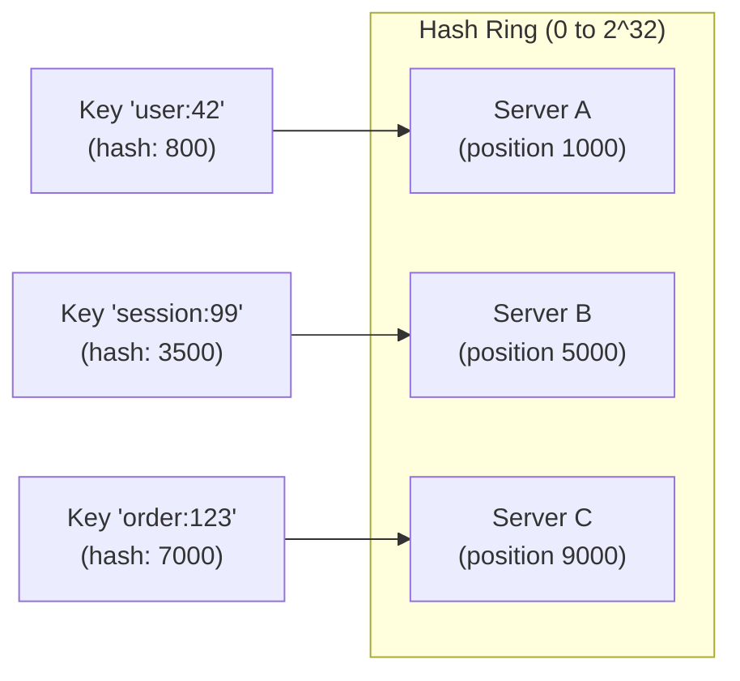
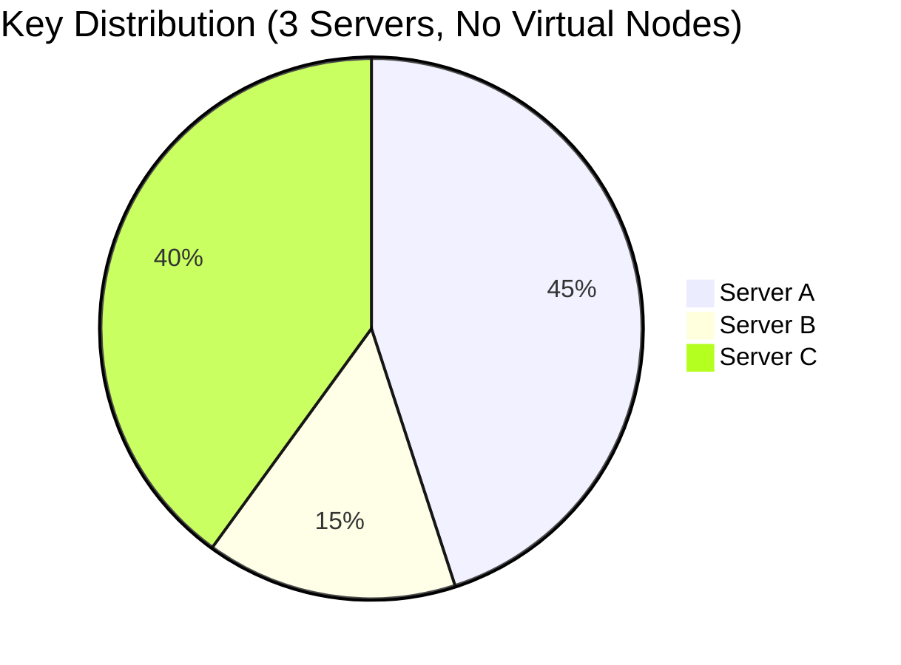

# How to Build Consistent Hashing Implementation

Author: [nawazdhandala](https://github.com/nawazdhandala)

Tags: Database, Distributed Systems, Algorithms, DevOps

Description: Learn to implement consistent hashing from scratch with virtual nodes, replication, and rebalancing for building scalable distributed systems.

---

Distributing data across multiple servers sounds simple until a server goes down or you need to add capacity. Traditional modulo-based hashing breaks when the number of servers changes, forcing you to rehash and move most of your data. Consistent hashing solves this by minimizing data movement when nodes join or leave the cluster.

## Why Traditional Hashing Fails

Consider a simple hash-based distribution where you assign keys to servers using `hash(key) % server_count`. When you have 3 servers and add a fourth, roughly 75% of your keys need to move to different servers. In a cache cluster, this causes a thundering herd of cache misses. In a database cluster, it means massive data migration.

| Servers | Key Movement on Add/Remove |
|---------|---------------------------|
| **Modulo hashing** | ~75% of keys move |
| **Consistent hashing** | ~1/n keys move (only affected partition) |

## How Consistent Hashing Works

Consistent hashing maps both keys and servers onto a circular ring using the same hash function. Each key belongs to the first server encountered when walking clockwise from the key's position on the ring.



When Server B fails, only the keys between A and B need to move to C. The rest of the cluster remains unaffected.

## Basic Implementation

This implementation creates a hash ring using a sorted map. Keys are assigned to servers by finding the first server position greater than or equal to the key's hash. The modular arithmetic handles wraparound at the end of the ring.

```javascript
const crypto = require('crypto');

// Hash function that returns a 32-bit integer
// MD5 is fast and provides good distribution for our use case
function hash(key) {
  return crypto
    .createHash('md5')
    .update(key)
    .digest()
    .readUInt32BE(0);
}

class ConsistentHash {
  constructor() {
    // Sorted array of positions on the ring
    this.ring = [];
    // Map from ring position to server name
    this.nodeMap = new Map();
    // Set of all server names
    this.nodes = new Set();
  }

  // Add a server to the ring
  addNode(node) {
    if (this.nodes.has(node)) {
      return;
    }

    const position = hash(node);
    this.ring.push(position);
    // Keep ring sorted for binary search
    this.ring.sort((a, b) => a - b);
    this.nodeMap.set(position, node);
    this.nodes.add(node);
  }

  // Remove a server from the ring
  removeNode(node) {
    if (!this.nodes.has(node)) {
      return;
    }

    const position = hash(node);
    this.ring = this.ring.filter(p => p !== position);
    this.nodeMap.delete(position);
    this.nodes.delete(node);
  }

  // Find which server owns a given key
  getNode(key) {
    if (this.ring.length === 0) {
      return null;
    }

    const keyHash = hash(key);

    // Binary search for the first position >= keyHash
    let left = 0;
    let right = this.ring.length;

    while (left < right) {
      const mid = Math.floor((left + right) / 2);
      if (this.ring[mid] < keyHash) {
        left = mid + 1;
      } else {
        right = mid;
      }
    }

    // Wrap around to the first node if we've gone past the end
    const index = left === this.ring.length ? 0 : left;
    return this.nodeMap.get(this.ring[index]);
  }
}

// Usage
const ch = new ConsistentHash();
ch.addNode('server-1');
ch.addNode('server-2');
ch.addNode('server-3');

console.log(ch.getNode('user:42'));     // server-2
console.log(ch.getNode('session:99'));  // server-1
console.log(ch.getNode('order:123'));   // server-3
```

## The Problem with Basic Consistent Hashing

With only one point per server on the ring, data distribution is uneven. A server might own 60% of the key space while another owns only 10%. The distribution also changes dramatically when nodes join or leave.



## Virtual Nodes for Better Distribution

Virtual nodes solve the distribution problem by placing each physical server at multiple positions on the ring. Instead of one point per server, we create 100-200 virtual nodes per server. This spreads the load more evenly and makes rebalancing smoother.

```javascript
class ConsistentHashWithVNodes {
  constructor(options = {}) {
    // Number of virtual nodes per physical node
    // Higher values give better distribution but use more memory
    this.replicaCount = options.replicaCount || 150;
    this.ring = [];
    this.nodeMap = new Map();
    this.nodes = new Set();
  }

  // Generate position for a virtual node
  // Each virtual node gets a unique position by appending an index
  hashVNode(node, index) {
    return hash(`${node}:${index}`);
  }

  addNode(node) {
    if (this.nodes.has(node)) {
      return;
    }

    // Add multiple virtual nodes for this physical node
    for (let i = 0; i < this.replicaCount; i++) {
      const position = this.hashVNode(node, i);
      this.ring.push(position);
      this.nodeMap.set(position, node);
    }

    // Keep ring sorted
    this.ring.sort((a, b) => a - b);
    this.nodes.add(node);
  }

  removeNode(node) {
    if (!this.nodes.has(node)) {
      return;
    }

    // Remove all virtual nodes for this physical node
    for (let i = 0; i < this.replicaCount; i++) {
      const position = this.hashVNode(node, i);
      this.ring = this.ring.filter(p => p !== position);
      this.nodeMap.delete(position);
    }

    this.nodes.delete(node);
  }

  getNode(key) {
    if (this.ring.length === 0) {
      return null;
    }

    const keyHash = hash(key);

    // Binary search for first position >= keyHash
    let left = 0;
    let right = this.ring.length;

    while (left < right) {
      const mid = Math.floor((left + right) / 2);
      if (this.ring[mid] < keyHash) {
        left = mid + 1;
      } else {
        right = mid;
      }
    }

    const index = left === this.ring.length ? 0 : left;
    return this.nodeMap.get(this.ring[index]);
  }

  // Get distribution statistics
  getDistribution() {
    const distribution = {};
    for (const node of this.nodes) {
      distribution[node] = 0;
    }

    // Sample 10000 random keys and count distribution
    for (let i = 0; i < 10000; i++) {
      const key = `test-key-${i}`;
      const node = this.getNode(key);
      distribution[node]++;
    }

    return distribution;
  }
}

// Compare distribution
const basic = new ConsistentHash();
const vnodes = new ConsistentHashWithVNodes({ replicaCount: 150 });

['server-1', 'server-2', 'server-3'].forEach(s => {
  basic.addNode(s);
  vnodes.addNode(s);
});

console.log('Basic distribution:', basic.getDistribution());
// { 'server-1': 4521, 'server-2': 1203, 'server-3': 4276 }

console.log('VNode distribution:', vnodes.getDistribution());
// { 'server-1': 3342, 'server-2': 3298, 'server-3': 3360 }
```

With 150 virtual nodes per server, the distribution becomes nearly uniform, typically within 5% deviation from the ideal.

## Replication for Fault Tolerance

In production systems, you need data replicated across multiple servers to survive failures. The consistent hash ring makes replication straightforward: store each key on N consecutive servers clockwise from its position.

```javascript
class ReplicatedConsistentHash {
  constructor(options = {}) {
    this.replicaCount = options.replicaCount || 150;
    this.replicationFactor = options.replicationFactor || 3;
    this.ring = [];
    this.nodeMap = new Map();
    this.nodes = new Set();
  }

  hashVNode(node, index) {
    return hash(`${node}:${index}`);
  }

  addNode(node) {
    if (this.nodes.has(node)) {
      return;
    }

    for (let i = 0; i < this.replicaCount; i++) {
      const position = this.hashVNode(node, i);
      this.ring.push(position);
      this.nodeMap.set(position, node);
    }

    this.ring.sort((a, b) => a - b);
    this.nodes.add(node);
  }

  removeNode(node) {
    if (!this.nodes.has(node)) {
      return;
    }

    for (let i = 0; i < this.replicaCount; i++) {
      const position = this.hashVNode(node, i);
      this.ring = this.ring.filter(p => p !== position);
      this.nodeMap.delete(position);
    }

    this.nodes.delete(node);
  }

  // Get N unique physical nodes for a key
  // Used for replication: store data on all returned nodes
  getNodes(key) {
    if (this.ring.length === 0) {
      return [];
    }

    const keyHash = hash(key);
    const result = [];
    const seen = new Set();

    // Find starting position
    let left = 0;
    let right = this.ring.length;

    while (left < right) {
      const mid = Math.floor((left + right) / 2);
      if (this.ring[mid] < keyHash) {
        left = mid + 1;
      } else {
        right = mid;
      }
    }

    // Walk clockwise, collecting unique physical nodes
    let index = left === this.ring.length ? 0 : left;
    let checked = 0;

    while (result.length < this.replicationFactor && checked < this.ring.length) {
      const node = this.nodeMap.get(this.ring[index]);

      // Only add if this is a new physical node
      if (!seen.has(node)) {
        result.push(node);
        seen.add(node);
      }

      index = (index + 1) % this.ring.length;
      checked++;
    }

    return result;
  }

  // Get the primary node (first in the preference list)
  getPrimary(key) {
    const nodes = this.getNodes(key);
    return nodes.length > 0 ? nodes[0] : null;
  }
}

// Usage
const rch = new ReplicatedConsistentHash({
  replicaCount: 150,
  replicationFactor: 3,
});

rch.addNode('server-1');
rch.addNode('server-2');
rch.addNode('server-3');
rch.addNode('server-4');
rch.addNode('server-5');

console.log(rch.getNodes('user:42'));
// ['server-3', 'server-1', 'server-5']
// Data should be stored on all three for redundancy
```

## Handling Node Failures and Rebalancing

When a node fails or is added, you need to move data. The key insight is that only keys owned by the changed node need to move. This implementation tracks what data needs to move during cluster changes.

```javascript
class ConsistentHashCluster {
  constructor(options = {}) {
    this.replicaCount = options.replicaCount || 150;
    this.replicationFactor = options.replicationFactor || 3;
    this.ring = [];
    this.nodeMap = new Map();
    this.nodes = new Set();

    // Track key ownership for rebalancing
    this.keyOwnership = new Map();
  }

  hashVNode(node, index) {
    return hash(`${node}:${index}`);
  }

  // Returns keys that need to be moved when adding a node
  addNode(node) {
    if (this.nodes.has(node)) {
      return { keysToFetch: [] };
    }

    // Take a snapshot of current ownership for affected keys
    const affectedKeys = [];

    for (let i = 0; i < this.replicaCount; i++) {
      const position = this.hashVNode(node, i);
      this.ring.push(position);
      this.nodeMap.set(position, node);
    }

    this.ring.sort((a, b) => a - b);
    this.nodes.add(node);

    // Find keys that the new node should now own
    const keysToFetch = [];
    for (const [key, oldOwners] of this.keyOwnership) {
      const newOwners = this.getNodes(key);

      // If new node is in the owner list, it needs to fetch data
      if (newOwners.includes(node)) {
        // Find a node that has the data to copy from
        const sourceNode = oldOwners.find(n => n !== node && this.nodes.has(n));
        if (sourceNode) {
          keysToFetch.push({ key, source: sourceNode, target: node });
        }
      }

      // Update ownership
      this.keyOwnership.set(key, newOwners);
    }

    return { keysToFetch };
  }

  // Returns keys that need to be redistributed when removing a node
  removeNode(node) {
    if (!this.nodes.has(node)) {
      return { keysToMove: [] };
    }

    // Find keys that were owned by this node
    const keysToMove = [];

    for (const [key, owners] of this.keyOwnership) {
      if (owners.includes(node)) {
        // This key needs to find a new home
        keysToMove.push({ key, oldOwner: node });
      }
    }

    // Remove from ring
    for (let i = 0; i < this.replicaCount; i++) {
      const position = this.hashVNode(node, i);
      this.ring = this.ring.filter(p => p !== position);
      this.nodeMap.delete(position);
    }

    this.nodes.delete(node);

    // Calculate new owners and update ownership
    const result = [];
    for (const { key, oldOwner } of keysToMove) {
      const newOwners = this.getNodes(key);
      const oldOwners = this.keyOwnership.get(key) || [];

      // Find nodes that have copies of the data
      const sourcesWithData = oldOwners.filter(n => n !== node && this.nodes.has(n));

      // Find new nodes that need copies
      const newNodes = newOwners.filter(n => !oldOwners.includes(n) || n === node);

      for (const target of newNodes) {
        if (sourcesWithData.length > 0) {
          result.push({
            key,
            source: sourcesWithData[0],
            target,
          });
        }
      }

      this.keyOwnership.set(key, newOwners);
    }

    return { keysToMove: result };
  }

  getNodes(key) {
    if (this.ring.length === 0) {
      return [];
    }

    const keyHash = hash(key);
    const result = [];
    const seen = new Set();

    let left = 0;
    let right = this.ring.length;

    while (left < right) {
      const mid = Math.floor((left + right) / 2);
      if (this.ring[mid] < keyHash) {
        left = mid + 1;
      } else {
        right = mid;
      }
    }

    let index = left === this.ring.length ? 0 : left;
    let checked = 0;

    while (result.length < this.replicationFactor && checked < this.ring.length) {
      const node = this.nodeMap.get(this.ring[index]);

      if (!seen.has(node)) {
        result.push(node);
        seen.add(node);
      }

      index = (index + 1) % this.ring.length;
      checked++;
    }

    return result;
  }

  // Register a key's ownership (call when writing data)
  registerKey(key) {
    const owners = this.getNodes(key);
    this.keyOwnership.set(key, owners);
    return owners;
  }
}
```

## Weighted Nodes for Heterogeneous Clusters

Not all servers are equal. A server with more RAM or faster disks should handle more keys. Weighted consistent hashing assigns more virtual nodes to more capable servers.

```javascript
class WeightedConsistentHash {
  constructor(options = {}) {
    // Base number of virtual nodes (scaled by weight)
    this.baseReplicaCount = options.baseReplicaCount || 100;
    this.ring = [];
    this.nodeMap = new Map();
    this.nodes = new Map(); // node -> weight
  }

  hashVNode(node, index) {
    return hash(`${node}:${index}`);
  }

  // Add node with a weight (1.0 = normal, 2.0 = double capacity)
  addNode(node, weight = 1.0) {
    if (this.nodes.has(node)) {
      return;
    }

    // Scale virtual nodes by weight
    const replicaCount = Math.floor(this.baseReplicaCount * weight);

    for (let i = 0; i < replicaCount; i++) {
      const position = this.hashVNode(node, i);
      this.ring.push(position);
      this.nodeMap.set(position, node);
    }

    this.ring.sort((a, b) => a - b);
    this.nodes.set(node, { weight, replicaCount });
  }

  removeNode(node) {
    const nodeInfo = this.nodes.get(node);
    if (!nodeInfo) {
      return;
    }

    for (let i = 0; i < nodeInfo.replicaCount; i++) {
      const position = this.hashVNode(node, i);
      this.ring = this.ring.filter(p => p !== position);
      this.nodeMap.delete(position);
    }

    this.nodes.delete(node);
  }

  // Update weight (requires removing and re-adding)
  updateWeight(node, newWeight) {
    if (!this.nodes.has(node)) {
      return;
    }

    this.removeNode(node);
    this.addNode(node, newWeight);
  }

  getNode(key) {
    if (this.ring.length === 0) {
      return null;
    }

    const keyHash = hash(key);

    let left = 0;
    let right = this.ring.length;

    while (left < right) {
      const mid = Math.floor((left + right) / 2);
      if (this.ring[mid] < keyHash) {
        left = mid + 1;
      } else {
        right = mid;
      }
    }

    const index = left === this.ring.length ? 0 : left;
    return this.nodeMap.get(this.ring[index]);
  }

  getDistribution() {
    const distribution = {};
    for (const [node] of this.nodes) {
      distribution[node] = 0;
    }

    for (let i = 0; i < 10000; i++) {
      const key = `test-key-${i}`;
      const node = this.getNode(key);
      distribution[node]++;
    }

    return distribution;
  }
}

// Usage: heterogeneous cluster
const wch = new WeightedConsistentHash();

// Small server: weight 1.0
wch.addNode('small-server', 1.0);

// Medium server: weight 2.0 (handles twice the load)
wch.addNode('medium-server', 2.0);

// Large server: weight 4.0 (handles 4x the load)
wch.addNode('large-server', 4.0);

console.log(wch.getDistribution());
// Approximately:
// { 'small-server': 1428, 'medium-server': 2857, 'large-server': 5715 }
// Ratio is roughly 1:2:4 as expected
```

## Complete Production Implementation

Here is a full implementation combining all the features: virtual nodes, replication, weighted nodes, and rebalancing support with proper error handling.

```javascript
const crypto = require('crypto');
const EventEmitter = require('events');

function hash(key) {
  return crypto
    .createHash('md5')
    .update(key)
    .digest()
    .readUInt32BE(0);
}

class ProductionConsistentHash extends EventEmitter {
  constructor(options = {}) {
    super();

    this.baseReplicaCount = options.baseReplicaCount || 150;
    this.replicationFactor = options.replicationFactor || 3;

    this.ring = [];
    this.nodeMap = new Map();
    this.nodes = new Map();
    this.keyOwnership = new Map();
  }

  hashVNode(node, index) {
    return hash(`${node}:${index}`);
  }

  addNode(nodeId, options = {}) {
    const { weight = 1.0, metadata = {} } = options;

    if (this.nodes.has(nodeId)) {
      throw new Error(`Node ${nodeId} already exists`);
    }

    const replicaCount = Math.floor(this.baseReplicaCount * weight);
    const positions = [];

    for (let i = 0; i < replicaCount; i++) {
      const position = this.hashVNode(nodeId, i);
      positions.push(position);
      this.ring.push(position);
      this.nodeMap.set(position, nodeId);
    }

    this.ring.sort((a, b) => a - b);

    this.nodes.set(nodeId, {
      weight,
      replicaCount,
      positions,
      metadata,
      addedAt: Date.now(),
    });

    // Calculate rebalancing operations
    const rebalanceOps = this.calculateRebalance('add', nodeId);

    this.emit('nodeAdded', { nodeId, weight, rebalanceOps });

    return rebalanceOps;
  }

  removeNode(nodeId) {
    const nodeInfo = this.nodes.get(nodeId);
    if (!nodeInfo) {
      throw new Error(`Node ${nodeId} not found`);
    }

    // Calculate rebalancing before removal
    const rebalanceOps = this.calculateRebalance('remove', nodeId);

    // Remove from ring
    for (const position of nodeInfo.positions) {
      const idx = this.ring.indexOf(position);
      if (idx !== -1) {
        this.ring.splice(idx, 1);
      }
      this.nodeMap.delete(position);
    }

    this.nodes.delete(nodeId);

    this.emit('nodeRemoved', { nodeId, rebalanceOps });

    return rebalanceOps;
  }

  calculateRebalance(operation, changedNode) {
    const ops = [];

    for (const [key, oldOwners] of this.keyOwnership) {
      const newOwners = this.getNodesForKey(key);

      if (operation === 'add') {
        // New node might need to receive data
        if (newOwners.includes(changedNode)) {
          const source = oldOwners.find(n => n !== changedNode);
          if (source) {
            ops.push({
              type: 'copy',
              key,
              source,
              target: changedNode,
            });
          }
        }
      } else if (operation === 'remove') {
        // Data needs to move to remaining nodes
        if (oldOwners.includes(changedNode)) {
          const sources = oldOwners.filter(n => n !== changedNode);
          const targets = newOwners.filter(n => !oldOwners.includes(n));

          for (const target of targets) {
            if (sources.length > 0) {
              ops.push({
                type: 'copy',
                key,
                source: sources[0],
                target,
              });
            }
          }
        }
      }

      this.keyOwnership.set(key, newOwners);
    }

    return ops;
  }

  getNodesForKey(key) {
    if (this.ring.length === 0) {
      return [];
    }

    const keyHash = hash(key);
    const result = [];
    const seen = new Set();

    // Binary search
    let left = 0;
    let right = this.ring.length;

    while (left < right) {
      const mid = Math.floor((left + right) / 2);
      if (this.ring[mid] < keyHash) {
        left = mid + 1;
      } else {
        right = mid;
      }
    }

    // Collect unique nodes
    let index = left === this.ring.length ? 0 : left;
    let checked = 0;
    const maxNodes = Math.min(this.replicationFactor, this.nodes.size);

    while (result.length < maxNodes && checked < this.ring.length) {
      const nodeId = this.nodeMap.get(this.ring[index]);

      if (!seen.has(nodeId)) {
        result.push(nodeId);
        seen.add(nodeId);
      }

      index = (index + 1) % this.ring.length;
      checked++;
    }

    return result;
  }

  // Write a key and track ownership
  write(key) {
    const nodes = this.getNodesForKey(key);
    this.keyOwnership.set(key, nodes);
    return nodes;
  }

  // Read a key (returns nodes that have the data)
  read(key) {
    return this.keyOwnership.get(key) || this.getNodesForKey(key);
  }

  // Get cluster statistics
  getStats() {
    const distribution = {};
    for (const [nodeId] of this.nodes) {
      distribution[nodeId] = 0;
    }

    for (let i = 0; i < 10000; i++) {
      const nodes = this.getNodesForKey(`sample-${i}`);
      for (const node of nodes) {
        distribution[node]++;
      }
    }

    return {
      nodeCount: this.nodes.size,
      ringSize: this.ring.length,
      keyCount: this.keyOwnership.size,
      distribution,
    };
  }
}

// Usage example
const cluster = new ProductionConsistentHash({
  baseReplicaCount: 150,
  replicationFactor: 3,
});

cluster.on('nodeAdded', ({ nodeId, rebalanceOps }) => {
  console.log(`Node ${nodeId} added, ${rebalanceOps.length} keys to rebalance`);
});

cluster.on('nodeRemoved', ({ nodeId, rebalanceOps }) => {
  console.log(`Node ${nodeId} removed, ${rebalanceOps.length} keys to rebalance`);
});

// Build cluster
cluster.addNode('node-1', { weight: 1.0 });
cluster.addNode('node-2', { weight: 1.0 });
cluster.addNode('node-3', { weight: 2.0 }); // Higher capacity

// Write some data
for (let i = 0; i < 1000; i++) {
  cluster.write(`key-${i}`);
}

console.log('Stats:', cluster.getStats());

// Add a new node (triggers rebalancing)
const rebalanceOps = cluster.addNode('node-4', { weight: 1.0 });
console.log(`Need to move ${rebalanceOps.length} keys to new node`);

// Simulate node failure
const failoverOps = cluster.removeNode('node-2');
console.log(`Need to redistribute ${failoverOps.length} keys after failure`);
```

## Real-World Applications

Consistent hashing is used in many distributed systems. Here is how you might integrate it with a simple distributed cache.

```javascript
class DistributedCache {
  constructor(options = {}) {
    this.consistentHash = new ProductionConsistentHash({
      baseReplicaCount: 150,
      replicationFactor: options.replicationFactor || 2,
    });

    // Simulated node connections (in production, use real connections)
    this.nodeConnections = new Map();
  }

  addNode(nodeId, connection) {
    this.nodeConnections.set(nodeId, connection);
    return this.consistentHash.addNode(nodeId);
  }

  removeNode(nodeId) {
    this.nodeConnections.delete(nodeId);
    return this.consistentHash.removeNode(nodeId);
  }

  async set(key, value, ttl) {
    const nodes = this.consistentHash.write(key);

    // Write to all replica nodes
    const writePromises = nodes.map(async (nodeId) => {
      const connection = this.nodeConnections.get(nodeId);
      if (connection) {
        return connection.set(key, value, ttl);
      }
    });

    await Promise.all(writePromises);
    return nodes;
  }

  async get(key) {
    const nodes = this.consistentHash.read(key);

    // Try nodes in order until one succeeds
    for (const nodeId of nodes) {
      const connection = this.nodeConnections.get(nodeId);
      if (connection) {
        try {
          const value = await connection.get(key);
          if (value !== undefined) {
            return value;
          }
        } catch (error) {
          // Node failed, try next replica
          console.log(`Node ${nodeId} failed, trying next replica`);
        }
      }
    }

    return undefined;
  }

  async delete(key) {
    const nodes = this.consistentHash.read(key);

    const deletePromises = nodes.map(async (nodeId) => {
      const connection = this.nodeConnections.get(nodeId);
      if (connection) {
        return connection.delete(key);
      }
    });

    await Promise.all(deletePromises);
  }
}
```

## Performance Considerations

| Operation | Time Complexity | Notes |
|-----------|----------------|-------|
| **Add node** | O(R log N) | R = replicas, N = ring size |
| **Remove node** | O(R log N) | Requires ring reconstruction |
| **Get node** | O(log N) | Binary search on sorted ring |
| **Rebalance** | O(K/N) | K = total keys, only affected keys move |

For a cluster with 10 nodes and 150 virtual nodes each, the ring has 1500 entries. Lookups are fast at O(log 1500), and adding or removing a node only affects about 10% of keys.

## Summary

Consistent hashing is fundamental to building distributed systems that scale. The key principles are:

1. **Hash ring** maps keys and nodes to the same space, enabling minimal key movement when the cluster changes.

2. **Virtual nodes** spread each physical node across multiple ring positions for even distribution.

3. **Replication** stores keys on N consecutive nodes for fault tolerance.

4. **Weighted nodes** let you assign more load to more capable servers.

5. **Rebalancing** only moves keys affected by node changes, not the entire dataset.

Whether you are building a distributed cache, database, or message queue, consistent hashing gives you predictable behavior when nodes fail or when you need to scale out.
