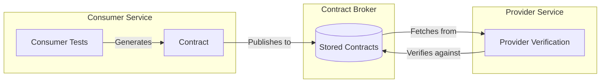
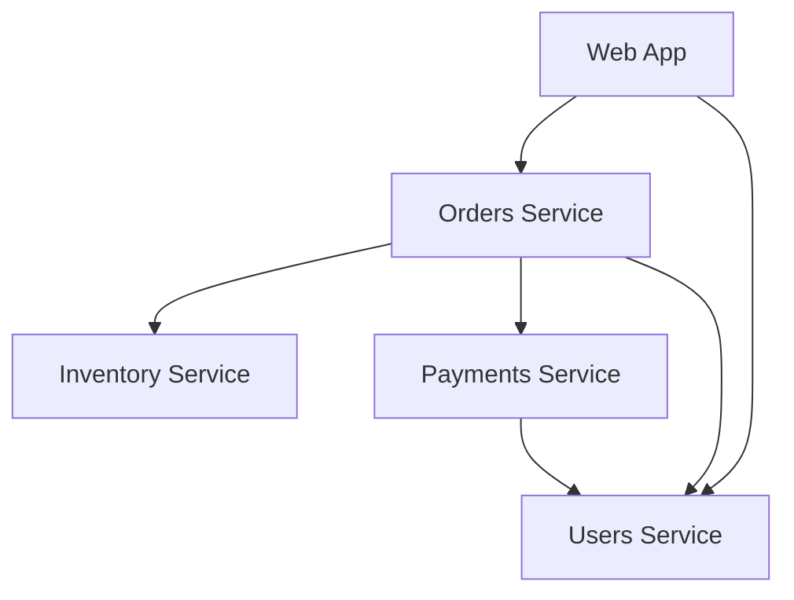
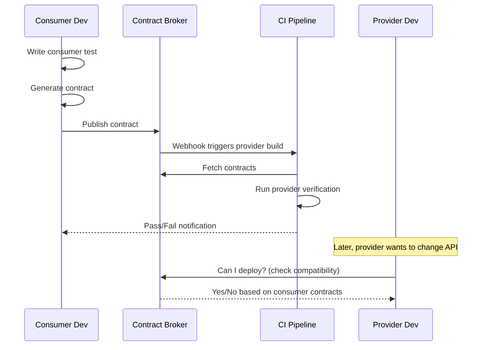
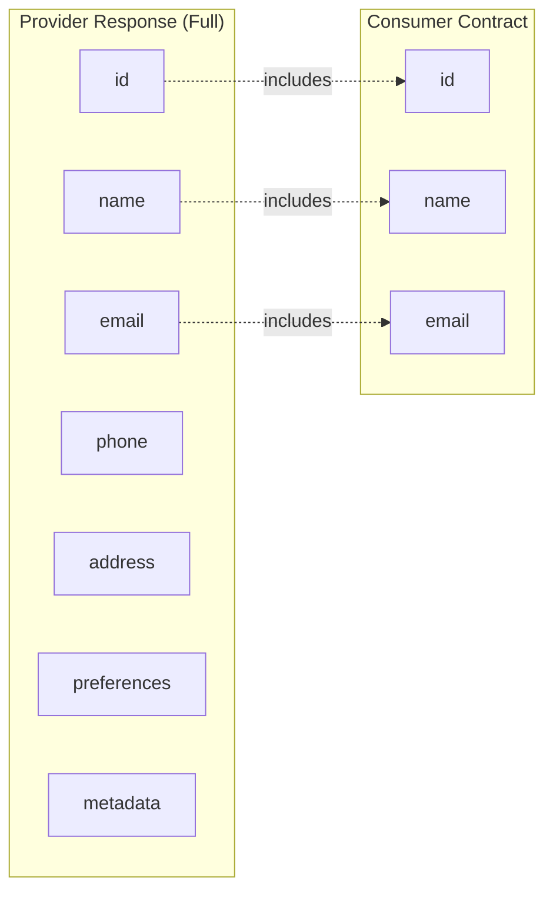

# How to Implement Consumer Driven Contracts

Author: [nawazdhandala](https://github.com/nawazdhandala)

Tags: Testing, API, Microservices, DevOps, Contract Testing

Description: Learn how to implement consumer driven contracts to catch API breaking changes early, improve team collaboration, and ship microservices with confidence.

---

When your API changes break a downstream service at 2 AM, you realize integration tests alone are not enough. Consumer Driven Contracts (CDC) flip the testing model: consumers define what they need, and providers verify they still deliver it. This guide walks through the why, how, and practical implementation of CDC testing in your microservices architecture.

---

## Table of Contents

1. What Are Consumer Driven Contracts?
2. Why Traditional Testing Falls Short
3. The CDC Workflow
4. Core Concepts
5. Setting Up Pact (JavaScript/TypeScript)
6. Writing Consumer Tests
7. Publishing Contracts to a Broker
8. Writing Provider Verification Tests
9. Integrating with CI/CD
10. Best Practices
11. Common Pitfalls
12. When Not to Use CDC
13. Summary

---

## 1. What Are Consumer Driven Contracts?

A Consumer Driven Contract is a formal agreement between an API consumer and provider that specifies the expected request and response formats. The key insight is that **consumers define the contract**, not providers.



| Term | Definition |
|------|------------|
| Consumer | A service that calls another service's API |
| Provider | A service that exposes an API |
| Contract | A document specifying expected interactions |
| Pact | The most popular CDC testing framework |
| Broker | A central repository for storing and sharing contracts |

---

## 2. Why Traditional Testing Falls Short

Consider a typical microservices setup:



Traditional approaches have significant gaps:

| Approach | Problem |
|----------|---------|
| Unit Tests | Test services in isolation, miss integration issues |
| Integration Tests | Require all services running, slow and flaky |
| E2E Tests | Expensive to maintain, fail for unrelated reasons |
| Manual Testing | Does not scale, human error prone |

**The real pain point:** Provider teams change their API, unaware that it breaks consumers. This surfaces in staging or production, not during development.

CDC testing catches these issues at build time, before code is merged.

---

## 3. The CDC Workflow

Here is how CDC fits into your development cycle:



The workflow ensures:
1. Consumers define exactly what they need
2. Providers verify they fulfill those needs
3. Breaking changes are caught before deployment
4. Both teams can deploy independently with confidence

---

## 4. Core Concepts

### Interactions

An interaction defines a single request-response pair that the consumer expects:

```typescript
// Conceptual structure of an interaction
{
  description: "a request for user details",
  providerState: "user 123 exists",
  request: {
    method: "GET",
    path: "/users/123",
    headers: { "Accept": "application/json" }
  },
  response: {
    status: 200,
    headers: { "Content-Type": "application/json" },
    body: {
      id: 123,
      name: "John Doe",
      email: "john@example.com"
    }
  }
}
```

### Provider States

Provider states set up preconditions before verification. They allow the same endpoint to return different responses based on context:

- "user 123 exists" returns user data
- "user 123 does not exist" returns 404
- "database is unavailable" returns 503

### Matchers

Instead of exact values, matchers define patterns:

| Matcher Type | Use Case | Example |
|--------------|----------|---------|
| Exact | Specific required value | `"status": "active"` |
| Type | Any value of correct type | `like(123)` matches any integer |
| Regex | Pattern matching | `term({generate: "2024-01-30", matcher: "\\d{4}-\\d{2}-\\d{2}"})` |
| Array | Collection constraints | `eachLike({id: 1})` |

---

## 5. Setting Up Pact (JavaScript/TypeScript)

Pact is the most widely adopted CDC framework. Let us set it up for a Node.js project.

Install the required dependencies for consumer and provider testing:

```bash
npm install --save-dev @pact-foundation/pact @pact-foundation/pact-node
```

Create a directory structure that keeps contracts organized:

```
project/
├── src/
│   └── services/
│       └── userService.ts
├── tests/
│   ├── consumer/
│   │   └── userService.consumer.pact.test.ts
│   └── provider/
│       └── userApi.provider.pact.test.ts
└── pacts/
    └── (generated contract files)
```

---

## 6. Writing Consumer Tests

The consumer test defines what the consumer needs from the provider. Here is a complete example.

First, set up the user service that will be tested. This is a simple HTTP client:

```typescript
// src/services/userService.ts

// A simple service that fetches user data from an API
export interface User {
  id: number;
  name: string;
  email: string;
  createdAt: string;
}

export class UserService {
  constructor(private baseUrl: string) {}

  // Fetch a single user by ID
  async getUser(userId: number): Promise<User> {
    const response = await fetch(`${this.baseUrl}/users/${userId}`, {
      headers: { 'Accept': 'application/json' }
    });

    if (!response.ok) {
      throw new Error(`User not found: ${response.status}`);
    }

    return response.json();
  }

  // Create a new user
  async createUser(userData: Omit<User, 'id' | 'createdAt'>): Promise<User> {
    const response = await fetch(`${this.baseUrl}/users`, {
      method: 'POST',
      headers: {
        'Content-Type': 'application/json',
        'Accept': 'application/json'
      },
      body: JSON.stringify(userData)
    });

    if (!response.ok) {
      throw new Error(`Failed to create user: ${response.status}`);
    }

    return response.json();
  }
}
```

Now write the consumer test that generates the contract. The test runs against a mock server:

```typescript
// tests/consumer/userService.consumer.pact.test.ts

import { PactV3, MatchersV3 } from '@pact-foundation/pact';
import { UserService } from '../../src/services/userService';
import path from 'path';

// Initialize matchers for flexible contract definitions
const { like, regex, eachLike, integer, string, timestamp } = MatchersV3;

// Configure the Pact mock provider
const provider = new PactV3({
  consumer: 'OrdersService',      // Name of the consuming service
  provider: 'UsersService',       // Name of the providing service
  dir: path.resolve(process.cwd(), 'pacts'),  // Output directory for contracts
  logLevel: 'warn'
});

describe('User Service Consumer Contract', () => {

  describe('GET /users/:id', () => {

    it('returns user details when user exists', async () => {
      // Define the expected interaction
      provider
        .given('user 123 exists')           // Provider state (precondition)
        .uponReceiving('a request for user 123')
        .withRequest({
          method: 'GET',
          path: '/users/123',
          headers: { 'Accept': 'application/json' }
        })
        .willRespondWith({
          status: 200,
          headers: { 'Content-Type': 'application/json' },
          body: {
            // Use matchers instead of exact values for flexibility
            id: integer(123),
            name: string('John Doe'),
            email: regex('john@example.com', '^[\\w.-]+@[\\w.-]+\\.[a-z]{2,}$'),
            createdAt: timestamp("yyyy-MM-dd'T'HH:mm:ss.SSS'Z'", '2024-01-15T10:30:00.000Z')
          }
        });

      // Execute the test against the mock server
      await provider.executeTest(async (mockServer) => {
        const userService = new UserService(mockServer.url);
        const user = await userService.getUser(123);

        // Verify the consumer can parse and use the response
        expect(user.id).toBe(123);
        expect(user.name).toBeDefined();
        expect(user.email).toContain('@');
      });
    });

    it('returns 404 when user does not exist', async () => {
      provider
        .given('user 999 does not exist')
        .uponReceiving('a request for non-existent user')
        .withRequest({
          method: 'GET',
          path: '/users/999',
          headers: { 'Accept': 'application/json' }
        })
        .willRespondWith({
          status: 404,
          headers: { 'Content-Type': 'application/json' },
          body: {
            error: string('User not found'),
            code: string('USER_NOT_FOUND')
          }
        });

      await provider.executeTest(async (mockServer) => {
        const userService = new UserService(mockServer.url);

        await expect(userService.getUser(999))
          .rejects
          .toThrow('User not found');
      });
    });
  });

  describe('POST /users', () => {

    it('creates a new user successfully', async () => {
      provider
        .given('the users service is available')
        .uponReceiving('a request to create a new user')
        .withRequest({
          method: 'POST',
          path: '/users',
          headers: {
            'Content-Type': 'application/json',
            'Accept': 'application/json'
          },
          body: {
            name: 'Jane Smith',
            email: 'jane@example.com'
          }
        })
        .willRespondWith({
          status: 201,
          headers: { 'Content-Type': 'application/json' },
          body: {
            id: integer(456),
            name: string('Jane Smith'),
            email: string('jane@example.com'),
            createdAt: timestamp("yyyy-MM-dd'T'HH:mm:ss.SSS'Z'", '2024-01-30T14:00:00.000Z')
          }
        });

      await provider.executeTest(async (mockServer) => {
        const userService = new UserService(mockServer.url);
        const newUser = await userService.createUser({
          name: 'Jane Smith',
          email: 'jane@example.com'
        });

        expect(newUser.id).toBeDefined();
        expect(newUser.name).toBe('Jane Smith');
      });
    });
  });
});
```

Run the consumer tests to generate the contract file:

```bash
npm test -- tests/consumer/
```

This generates a contract file at `pacts/OrdersService-UsersService.json`.

---

## 7. Publishing Contracts to a Broker

A contract broker acts as the central source of truth. Pactflow is a managed option, or you can self-host Pact Broker.

Create a script to publish contracts after consumer tests pass:

```typescript
// scripts/publish-pacts.ts

import { Publisher } from '@pact-foundation/pact-node';
import path from 'path';

// Read configuration from environment variables
const publishOptions = {
  pactFilesOrDirs: [path.resolve(process.cwd(), 'pacts')],
  pactBroker: process.env.PACT_BROKER_BASE_URL || 'https://your-broker.pactflow.io',
  pactBrokerToken: process.env.PACT_BROKER_TOKEN,
  consumerVersion: process.env.GIT_COMMIT || '1.0.0',

  // Tags help track which environments have which versions
  tags: [
    process.env.GIT_BRANCH || 'main',
    process.env.ENVIRONMENT || 'development'
  ],

  // Build URL helps trace contracts back to CI runs
  buildUrl: process.env.CI_BUILD_URL
};

async function publishPacts() {
  console.log('Publishing pacts to broker...');
  console.log(`Consumer version: ${publishOptions.consumerVersion}`);
  console.log(`Tags: ${publishOptions.tags.join(', ')}`);

  try {
    await new Publisher(publishOptions).publish();
    console.log('Pacts published successfully!');
  } catch (error) {
    console.error('Failed to publish pacts:', error);
    process.exit(1);
  }
}

publishPacts();
```

Add a publish script to your package.json:

```json
{
  "scripts": {
    "test:consumer": "jest tests/consumer/",
    "pact:publish": "ts-node scripts/publish-pacts.ts"
  }
}
```

---

## 8. Writing Provider Verification Tests

The provider runs verification tests against all published contracts from its consumers.

Here is a provider verification test for an Express.js API:

```typescript
// tests/provider/userApi.provider.pact.test.ts

import { Verifier } from '@pact-foundation/pact';
import { app } from '../../src/app';  // Your Express app
import { Server } from 'http';

describe('Users API Provider Verification', () => {
  let server: Server;
  const port = 3001;

  // Start the real server before verification
  beforeAll((done) => {
    server = app.listen(port, () => {
      console.log(`Provider API running on port ${port}`);
      done();
    });
  });

  afterAll((done) => {
    server.close(done);
  });

  it('validates the contract with OrdersService', async () => {
    const verifier = new Verifier({
      providerBaseUrl: `http://localhost:${port}`,
      provider: 'UsersService',

      // Fetch contracts from the broker
      pactBrokerUrl: process.env.PACT_BROKER_BASE_URL,
      pactBrokerToken: process.env.PACT_BROKER_TOKEN,

      // Only verify contracts from consumers tagged for this environment
      consumerVersionSelectors: [
        { tag: 'main', latest: true },
        { tag: 'production', latest: true },
        { deployed: true }  // All currently deployed consumer versions
      ],

      // Provider version for tracking
      providerVersion: process.env.GIT_COMMIT || '1.0.0',
      providerVersionTags: [process.env.GIT_BRANCH || 'main'],

      // Publish verification results back to the broker
      publishVerificationResult: process.env.CI === 'true',

      // State handlers set up test data based on provider states
      stateHandlers: {
        'user 123 exists': async () => {
          // Insert test user into database or mock
          await setupTestUser({
            id: 123,
            name: 'John Doe',
            email: 'john@example.com',
            createdAt: '2024-01-15T10:30:00.000Z'
          });
        },

        'user 999 does not exist': async () => {
          // Ensure user 999 is not in the database
          await removeTestUser(999);
        },

        'the users service is available': async () => {
          // General setup, ensure service is ready
          await resetTestDatabase();
        }
      }
    });

    await verifier.verifyProvider();
  });
});

// Helper functions for test data setup
async function setupTestUser(user: any) {
  // Implementation depends on your data layer
  // Could be database insertion or mock setup
}

async function removeTestUser(userId: number) {
  // Clean up specific test data
}

async function resetTestDatabase() {
  // Reset to known state
}
```

---

## 9. Integrating with CI/CD

Here is a complete GitHub Actions workflow that runs CDC tests:

```yaml
# .github/workflows/contract-tests.yml

name: Contract Tests

on:
  push:
    branches: [main, develop]
  pull_request:
    branches: [main]

env:
  PACT_BROKER_BASE_URL: ${{ secrets.PACT_BROKER_URL }}
  PACT_BROKER_TOKEN: ${{ secrets.PACT_BROKER_TOKEN }}

jobs:
  consumer-tests:
    runs-on: ubuntu-latest
    steps:
      - uses: actions/checkout@v4

      - name: Setup Node.js
        uses: actions/setup-node@v4
        with:
          node-version: '20'
          cache: 'npm'

      - name: Install dependencies
        run: npm ci

      - name: Run consumer contract tests
        run: npm run test:consumer

      - name: Publish pacts to broker
        if: github.ref == 'refs/heads/main'
        env:
          GIT_COMMIT: ${{ github.sha }}
          GIT_BRANCH: ${{ github.ref_name }}
          CI_BUILD_URL: ${{ github.server_url }}/${{ github.repository }}/actions/runs/${{ github.run_id }}
        run: npm run pact:publish

  provider-verification:
    runs-on: ubuntu-latest
    needs: consumer-tests  # Run after contracts are published
    steps:
      - uses: actions/checkout@v4

      - name: Setup Node.js
        uses: actions/setup-node@v4
        with:
          node-version: '20'
          cache: 'npm'

      - name: Install dependencies
        run: npm ci

      - name: Run provider verification
        env:
          GIT_COMMIT: ${{ github.sha }}
          GIT_BRANCH: ${{ github.ref_name }}
          CI: 'true'
        run: npm run test:provider

  can-i-deploy:
    runs-on: ubuntu-latest
    needs: [consumer-tests, provider-verification]
    steps:
      - name: Check if safe to deploy
        run: |
          # Use Pact CLI to check deployment safety
          docker run --rm \
            pactfoundation/pact-cli:latest \
            broker can-i-deploy \
            --pacticipant OrdersService \
            --version ${{ github.sha }} \
            --to-environment production \
            --broker-base-url ${{ secrets.PACT_BROKER_URL }} \
            --broker-token ${{ secrets.PACT_BROKER_TOKEN }}
```

The `can-i-deploy` command is crucial. It checks the broker matrix to verify that the current version is compatible with all deployed consumers/providers.

---

## 10. Best Practices

### Contract Scope

Keep contracts focused on what the consumer actually uses:



The consumer only needs three fields. The provider can add or modify the other fields freely without breaking the contract.

### Versioning Strategy

Use semantic versioning with git commits:

| Scenario | Version Tag | Behavior |
|----------|-------------|----------|
| Feature branch | `feature-xyz` | Isolated testing |
| Main branch | `main`, `{git-sha}` | Integration verification |
| Release | `v1.2.3`, `production` | Deployment gating |

### State Management

Keep provider states simple and composable:

```typescript
// Good: Simple, reusable states
const stateHandlers = {
  'user exists': setupUser,
  'user has orders': setupUserWithOrders,
  'user has no orders': setupUserWithoutOrders
};

// Avoid: Complex compound states that are hard to maintain
// 'user 123 exists with 5 orders and premium subscription active'
```

### Matcher Selection

Choose matchers based on what actually matters to the consumer:

| Consumer Need | Matcher | Why |
|---------------|---------|-----|
| Specific enum value | Exact match | Value is critical to logic |
| Any valid ID | `integer()` | Just needs a number |
| Date in specific format | `timestamp()` | Format matters for parsing |
| Email address | `regex()` | Pattern validation |

---

## 11. Common Pitfalls

### Over-specifying Contracts

The contract includes fields the consumer does not use:

```typescript
// Problematic: Testing fields the consumer does not actually need
body: {
  id: integer(123),
  name: string('John'),
  email: string('john@example.com'),
  internalAuditId: string('xyz'),      // Consumer never uses this
  legacySystemRef: string('abc')       // Consumer never uses this
}

// Better: Only specify what you consume
body: {
  id: integer(123),
  name: string('John'),
  email: string('john@example.com')
}
```

### Missing Provider States

Forgetting to handle edge cases:

```typescript
// Always test error paths
provider
  .given('authentication token is expired')
  .uponReceiving('a request with expired token')
  .withRequest({...})
  .willRespondWith({
    status: 401,
    body: { error: 'Token expired', code: 'AUTH_TOKEN_EXPIRED' }
  });
```

### Flaky State Setup

Provider verification fails because state handlers are unreliable:

```typescript
// Problematic: Race conditions, external dependencies
stateHandlers: {
  'user exists': async () => {
    await fetch('https://external-service.com/setup-user');  // Unreliable
  }
}

// Better: Use local test doubles or in-memory state
stateHandlers: {
  'user exists': async () => {
    testDatabase.users.insert({ id: 123, name: 'Test User' });
  }
}
```

---

## 12. When Not to Use CDC

CDC is powerful but not universal. Skip it when:

| Scenario | Why CDC Is Not Ideal | Alternative |
|----------|---------------------|-------------|
| Public APIs | Unknown consumers, cannot collect contracts | OpenAPI + versioning |
| Internal monolith | Single deployment, no integration risk | Unit + integration tests |
| Unstable schemas | Contract churn creates noise | Schema validation + feature flags |
| Fire-and-forget events | No request-response pattern | Schema registry (Avro, Protobuf) |

For event-driven architectures, consider schema registries that enforce compatibility at the message level rather than at the interaction level.

---

## 13. Summary

Consumer Driven Contracts shift API compatibility testing left, catching breaking changes during development instead of deployment.

| Without CDC | With CDC |
|-------------|----------|
| Breaking changes found in staging/production | Breaking changes found at build time |
| Provider teams guess what consumers need | Consumers explicitly declare needs |
| Integration tests require full environment | Contract tests run in isolation |
| Deployments coupled across teams | Independent deployments with confidence |

Implementation checklist:

- [ ] Install Pact in consumer and provider projects
- [ ] Write consumer tests that generate contracts
- [ ] Set up a Pact Broker (managed or self-hosted)
- [ ] Implement provider verification with state handlers
- [ ] Integrate `can-i-deploy` into CI/CD pipelines
- [ ] Train teams on contract ownership and maintenance

Start with one high-risk integration. Prove the value, then expand coverage to other service boundaries.

---

**Related Reading:**

- [Traces and Spans in OpenTelemetry](/blog/post/2025-08-27-traces-and-spans-in-opentelemetry/view) - Understand how requests flow across your microservices
- [SRE Best Practices](/blog/post/2025-11-28-sre-best-practices/view) - Build reliability into your deployment pipeline

*Need visibility into how your microservices communicate? [OneUptime](https://oneuptime.com) provides distributed tracing, monitoring, and alerting to complement your contract testing strategy.*
