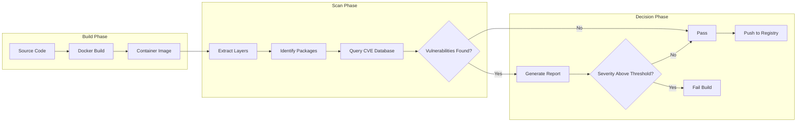
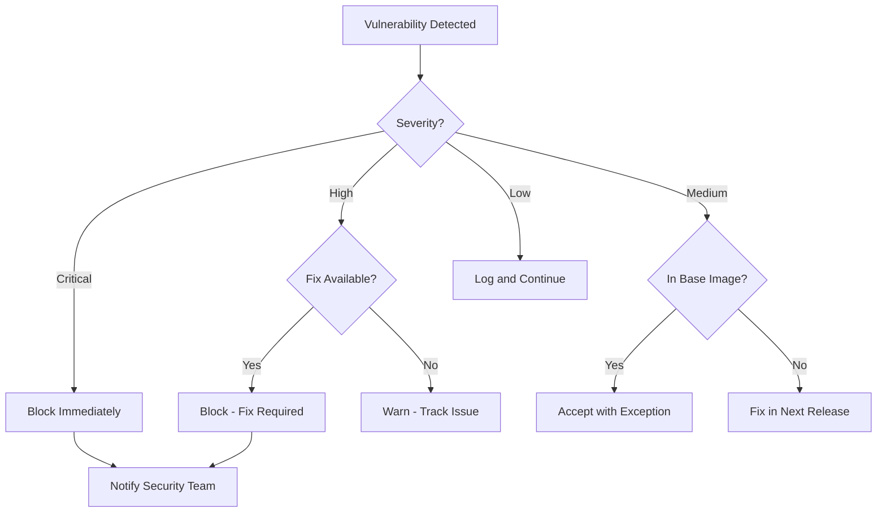

# How to Build Container Scanning Integration

Author: [nawazdhandala](https://github.com/nawazdhandala)

Tags: Testing, Security, Containers, CICD

Description: Integrate container scanning tools like Trivy and Grype into your CI/CD pipeline to catch vulnerabilities before they reach production.

---

Container images ship your application along with operating system packages, language runtimes, and dependencies. Each layer can harbor vulnerabilities. Container scanning detects these issues early so you can fix them before deployment.

## How Container Scanning Works

Container scanners unpack your image, identify installed packages and libraries, and compare them against vulnerability databases like NVD, GitHub Advisory Database, and vendor-specific feeds.



## Popular Container Scanning Tools

### Trivy

Trivy is an open source scanner by Aqua Security. It scans container images, filesystems, Git repositories, and Kubernetes clusters.

```bash
# Install Trivy on macOS
brew install trivy

# Install on Linux
curl -sfL https://raw.githubusercontent.com/aquasecurity/trivy/main/contrib/install.sh | sh -s -- -b /usr/local/bin

# Scan an image
trivy image nginx:1.25
```

### Grype

Grype is an open source vulnerability scanner from Anchore. It integrates well with Syft for SBOM generation.

```bash
# Install Grype on macOS
brew install grype

# Install on Linux
curl -sSfL https://raw.githubusercontent.com/anchore/grype/main/install.sh | sh -s -- -b /usr/local/bin

# Scan an image
grype nginx:1.25
```

## Basic Scanning Commands

### Trivy Scanning Options

```bash
# Scan image with full output
trivy image myapp:latest

# Scan and output JSON for parsing
trivy image --format json --output results.json myapp:latest

# Scan only for high and critical vulnerabilities
trivy image --severity HIGH,CRITICAL myapp:latest

# Scan a local image (not yet pushed to registry)
trivy image --input myapp.tar

# Scan and fail if vulnerabilities exceed threshold
# Exit code 1 if HIGH or CRITICAL vulnerabilities found
trivy image --exit-code 1 --severity HIGH,CRITICAL myapp:latest

# Ignore unfixed vulnerabilities (focus on actionable items)
trivy image --ignore-unfixed myapp:latest

# Scan filesystem instead of image
trivy fs /path/to/project
```

### Grype Scanning Options

```bash
# Scan image with default output
grype myapp:latest

# Output JSON format
grype myapp:latest -o json > results.json

# Fail on high severity or above
grype myapp:latest --fail-on high

# Scan from SBOM file (faster for repeated scans)
syft myapp:latest -o spdx-json > sbom.json
grype sbom:sbom.json

# Scan local directory
grype dir:/path/to/project

# Scan specific file types only
grype myapp:latest --scope all-layers
```

## CI/CD Integration

### GitHub Actions with Trivy

```yaml
# .github/workflows/container-scan.yml
name: Container Security Scan

on:
  push:
    branches: [main]
  pull_request:
    branches: [main]

jobs:
  build-and-scan:
    runs-on: ubuntu-latest
    steps:
      - name: Checkout code
        uses: actions/checkout@v4

      - name: Build Docker image
        run: |
          docker build -t myapp:${{ github.sha }} .

      - name: Run Trivy vulnerability scanner
        uses: aquasecurity/trivy-action@master
        with:
          # Image to scan
          image-ref: myapp:${{ github.sha }}
          # Output format: table, json, sarif
          format: sarif
          # Write results to file
          output: trivy-results.sarif
          # Fail build on high/critical vulnerabilities
          exit-code: 1
          # Only report these severity levels
          severity: HIGH,CRITICAL
          # Ignore vulnerabilities without fixes
          ignore-unfixed: true

      - name: Upload scan results to GitHub Security
        uses: github/codeql-action/upload-sarif@v3
        # Upload even if scan found vulnerabilities
        if: always()
        with:
          sarif_file: trivy-results.sarif
```

### GitHub Actions with Grype

```yaml
# .github/workflows/grype-scan.yml
name: Grype Container Scan

on:
  push:
    branches: [main]

jobs:
  scan:
    runs-on: ubuntu-latest
    steps:
      - name: Checkout
        uses: actions/checkout@v4

      - name: Build image
        run: docker build -t myapp:${{ github.sha }} .

      - name: Scan with Grype
        uses: anchore/scan-action@v4
        id: scan
        with:
          image: myapp:${{ github.sha }}
          fail-build: true
          severity-cutoff: high
          # Generate SBOM alongside scan
          output-format: sarif

      - name: Upload SARIF report
        uses: github/codeql-action/upload-sarif@v3
        if: always()
        with:
          sarif_file: ${{ steps.scan.outputs.sarif }}
```

### GitLab CI Integration

```yaml
# .gitlab-ci.yml
stages:
  - build
  - scan
  - deploy

variables:
  # Image name with registry prefix
  IMAGE_NAME: $CI_REGISTRY_IMAGE:$CI_COMMIT_SHA

build:
  stage: build
  image: docker:24
  services:
    - docker:24-dind
  script:
    - docker login -u $CI_REGISTRY_USER -p $CI_REGISTRY_PASSWORD $CI_REGISTRY
    - docker build -t $IMAGE_NAME .
    - docker push $IMAGE_NAME

container_scan:
  stage: scan
  image:
    name: aquasec/trivy:latest
    entrypoint: [""]
  script:
    # Update vulnerability database
    - trivy image --download-db-only
    # Run scan with exit code on high/critical
    - trivy image
        --exit-code 1
        --severity HIGH,CRITICAL
        --ignore-unfixed
        --format template
        --template "@/contrib/gitlab.tpl"
        --output gl-container-scanning-report.json
        $IMAGE_NAME
  artifacts:
    reports:
      container_scanning: gl-container-scanning-report.json
    when: always
  allow_failure: false

deploy:
  stage: deploy
  needs: [container_scan]
  script:
    - echo "Deploying verified image"
```

## Registry Scanning Configuration

Scanning images already in your registry catches new CVEs discovered after the initial push.

### AWS ECR Scanning

```bash
# Enable basic scanning (uses Clair)
aws ecr put-image-scanning-configuration \
  --repository-name myapp \
  --image-scanning-configuration scanOnPush=true

# Enable enhanced scanning (uses Inspector)
aws ecr put-registry-scanning-configuration \
  --scan-type ENHANCED \
  --rules '[{
    "scanFrequency": "CONTINUOUS_SCAN",
    "repositoryFilters": [{"filter": "*", "filterType": "WILDCARD"}]
  }]'

# Get scan findings
aws ecr describe-image-scan-findings \
  --repository-name myapp \
  --image-id imageTag=latest
```

### Harbor Registry

Harbor is an open source registry with built-in Trivy scanning.

```yaml
# Harbor scanner configuration via API
# POST /api/v2.0/scanners
{
  "name": "Trivy",
  "description": "Trivy vulnerability scanner",
  "url": "http://trivy-adapter:8080",
  "auth": "None",
  "skip_certVerify": false,
  "use_internal_addr": true
}

# Enable automatic scanning on push
# PUT /api/v2.0/projects/{project_name}
{
  "metadata": {
    "auto_scan": "true"
  }
}
```

### Scheduled Registry Scans

```yaml
# Kubernetes CronJob for periodic registry scanning
apiVersion: batch/v1
kind: CronJob
metadata:
  name: registry-scan
  namespace: security
spec:
  # Run every day at 2 AM
  schedule: "0 2 * * *"
  jobTemplate:
    spec:
      template:
        spec:
          containers:
            - name: scanner
              image: aquasec/trivy:latest
              command:
                - /bin/sh
                - -c
                - |
                  # Scan all images in registry
                  for image in $(cat /config/images.txt); do
                    trivy image \
                      --severity HIGH,CRITICAL \
                      --format json \
                      --output /reports/${image//\//_}.json \
                      $image
                  done
              volumeMounts:
                - name: config
                  mountPath: /config
                - name: reports
                  mountPath: /reports
          volumes:
            - name: config
              configMap:
                name: scan-targets
            - name: reports
              persistentVolumeClaim:
                claimName: scan-reports
          restartPolicy: OnFailure
```

## Vulnerability Severity Thresholds

Define clear policies for which vulnerabilities block deployment.



### Threshold Configuration File

```yaml
# .trivy.yaml
# Place in repository root for automatic detection
severity:
  - CRITICAL
  - HIGH

exit-code: 1
ignore-unfixed: true
timeout: 10m

# Ignore specific CVEs (document reasons)
ignorefile: .trivyignore

vulnerability:
  type:
    - os
    - library
```

### Ignore File for Accepted Risks

```text
# .trivyignore
# Each ignored CVE requires justification

# CVE-2023-12345: False positive, not exploitable in our config
# Approved by: security@example.com on 2024-01-15
# Review date: 2024-07-15
CVE-2023-12345

# CVE-2023-67890: No fix available, mitigated by network policy
# Tracking issue: JIRA-1234
CVE-2023-67890
```

### Grype Configuration

```yaml
# .grype.yaml
ignore:
  # Ignore by CVE ID
  - vulnerability: CVE-2023-12345
  # Ignore by package
  - package:
      name: openssl
      version: 1.1.1k
      type: deb
  # Ignore by path (useful for test dependencies)
  - package:
      location: "**/test/**"

fail-on-severity: high

check-for-app-update: false

# Output options
output: table
```

## Base Image Selection Guidelines

Your base image choice determines your vulnerability baseline.

### Image Size vs Security Comparison

| Base Image | Size | Package Manager | Shell | Typical CVE Count |
|------------|------|-----------------|-------|-------------------|
| ubuntu:22.04 | 77MB | apt | yes | 50-100 |
| debian:12-slim | 74MB | apt | yes | 30-60 |
| alpine:3.19 | 7MB | apk | yes | 5-15 |
| gcr.io/distroless/static | 2MB | none | no | 0-5 |
| gcr.io/distroless/base | 20MB | none | no | 5-10 |
| chainguard/static | 1MB | none | no | 0 |

### Recommended Base Images by Use Case

```dockerfile
# For Go applications - use static distroless
# Zero OS packages means minimal attack surface
FROM gcr.io/distroless/static-debian12
COPY myapp /
ENTRYPOINT ["/myapp"]

# For Node.js applications - use distroless nodejs
# Includes only the Node runtime
FROM gcr.io/distroless/nodejs20-debian12
COPY --from=build /app /app
WORKDIR /app
CMD ["server.js"]

# For Python applications - use slim base
# Balance between size and functionality
FROM python:3.12-slim-bookworm
# Remove unnecessary packages after install
RUN pip install --no-cache-dir -r requirements.txt && \
    apt-get purge -y --auto-remove && \
    rm -rf /var/lib/apt/lists/*

# For Java applications - use distroless java
FROM gcr.io/distroless/java21-debian12
COPY target/app.jar /app.jar
ENTRYPOINT ["java", "-jar", "/app.jar"]
```

### Chainguard Images for Zero CVE Base

```dockerfile
# Chainguard images are rebuilt daily with latest patches
FROM cgr.dev/chainguard/static:latest
COPY myapp /usr/bin/myapp
ENTRYPOINT ["/usr/bin/myapp"]

# Node.js variant
FROM cgr.dev/chainguard/node:latest
COPY --chown=node:node app/ /app
WORKDIR /app
CMD ["server.js"]
```

## Complete CI Pipeline Example

```yaml
# .github/workflows/secure-build.yml
name: Secure Container Build

on:
  push:
    branches: [main]
  pull_request:

env:
  REGISTRY: ghcr.io
  IMAGE_NAME: ${{ github.repository }}

jobs:
  build:
    runs-on: ubuntu-latest
    outputs:
      image-tag: ${{ steps.meta.outputs.tags }}
      image-digest: ${{ steps.build.outputs.digest }}
    steps:
      - uses: actions/checkout@v4

      - name: Set up Docker Buildx
        uses: docker/setup-buildx-action@v3

      - name: Log in to registry
        uses: docker/login-action@v3
        with:
          registry: ${{ env.REGISTRY }}
          username: ${{ github.actor }}
          password: ${{ secrets.GITHUB_TOKEN }}

      - name: Extract metadata
        id: meta
        uses: docker/metadata-action@v5
        with:
          images: ${{ env.REGISTRY }}/${{ env.IMAGE_NAME }}
          tags: |
            type=sha,prefix=
            type=ref,event=branch

      - name: Build and push
        id: build
        uses: docker/build-push-action@v5
        with:
          context: .
          push: true
          tags: ${{ steps.meta.outputs.tags }}
          labels: ${{ steps.meta.outputs.labels }}
          cache-from: type=gha
          cache-to: type=gha,mode=max

  scan:
    needs: build
    runs-on: ubuntu-latest
    steps:
      - name: Run Trivy scanner
        uses: aquasecurity/trivy-action@master
        with:
          image-ref: ${{ needs.build.outputs.image-tag }}
          format: sarif
          output: trivy-results.sarif
          exit-code: 1
          severity: HIGH,CRITICAL
          ignore-unfixed: true
          vuln-type: os,library

      - name: Upload to GitHub Security
        uses: github/codeql-action/upload-sarif@v3
        if: always()
        with:
          sarif_file: trivy-results.sarif

  sbom:
    needs: build
    runs-on: ubuntu-latest
    steps:
      - name: Generate SBOM
        uses: anchore/sbom-action@v0
        with:
          image: ${{ needs.build.outputs.image-tag }}
          format: spdx-json
          output-file: sbom.spdx.json

      - name: Upload SBOM
        uses: actions/upload-artifact@v4
        with:
          name: sbom
          path: sbom.spdx.json

      - name: Attest SBOM to image
        uses: actions/attest-sbom@v1
        with:
          subject-name: ${{ env.REGISTRY }}/${{ env.IMAGE_NAME }}
          subject-digest: ${{ needs.build.outputs.image-digest }}
          sbom-path: sbom.spdx.json

  deploy:
    needs: [build, scan, sbom]
    runs-on: ubuntu-latest
    if: github.ref == 'refs/heads/main'
    steps:
      - name: Deploy to production
        run: |
          echo "Deploying verified image: ${{ needs.build.outputs.image-tag }}"
          # Add your deployment commands here
```

## Monitoring and Alerting

### Scan Results Dashboard

Track vulnerability trends over time with metrics.

```yaml
# prometheus-rules.yaml
groups:
  - name: container-security
    rules:
      - alert: CriticalVulnerabilityDetected
        expr: container_vulnerabilities{severity="CRITICAL"} > 0
        for: 0m
        labels:
          severity: critical
        annotations:
          summary: Critical vulnerability in {{ $labels.image }}
          description: Found {{ $value }} critical vulnerabilities

      - alert: HighVulnerabilityCount
        expr: sum(container_vulnerabilities{severity="HIGH"}) by (image) > 10
        for: 1h
        labels:
          severity: warning
        annotations:
          summary: High vulnerability count in {{ $labels.image }}
```

### Webhook for Scan Results

```javascript
// webhook-handler.js
// Receive scan results and notify team
const express = require('express');
const app = express();

app.post('/scan-results', express.json(), (req, res) => {
  const { image, vulnerabilities, timestamp } = req.body;

  // Count by severity
  const critical = vulnerabilities.filter(v => v.severity === 'CRITICAL').length;
  const high = vulnerabilities.filter(v => v.severity === 'HIGH').length;

  // Send alert if thresholds exceeded
  if (critical > 0 || high > 5) {
    sendSlackAlert({
      channel: '#security-alerts',
      text: `Vulnerability scan failed for ${image}`,
      attachments: [{
        color: 'danger',
        fields: [
          { title: 'Critical', value: critical, short: true },
          { title: 'High', value: high, short: true },
          { title: 'Scan Time', value: timestamp, short: false }
        ]
      }]
    });
  }

  res.status(200).send('OK');
});

app.listen(3000);
```

## Security Checklist

- [ ] Scan images on every build, not just releases
- [ ] Set severity thresholds that match your risk tolerance
- [ ] Use distroless or minimal base images
- [ ] Document every ignored vulnerability with justification
- [ ] Enable continuous scanning in your registry
- [ ] Generate and store SBOMs for compliance
- [ ] Alert on new critical vulnerabilities in deployed images
- [ ] Review and update base images monthly
- [ ] Include scanning in pull request checks
- [ ] Track vulnerability trends over time

---

Container scanning is not optional. Vulnerabilities in your images are vulnerabilities in production. Start with basic CI scanning, add registry scanning, and build toward continuous monitoring. The goal is catching CVEs before attackers do.
