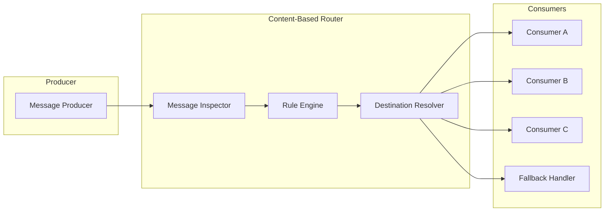
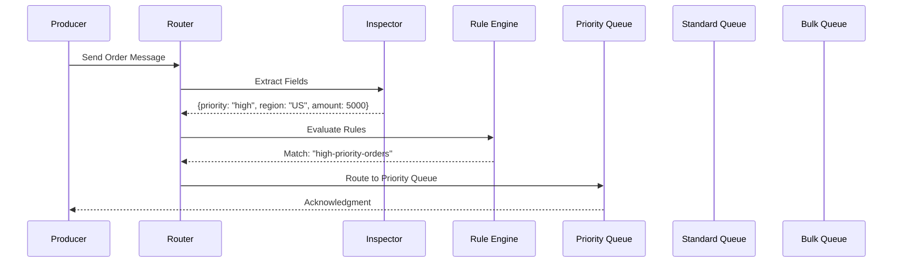
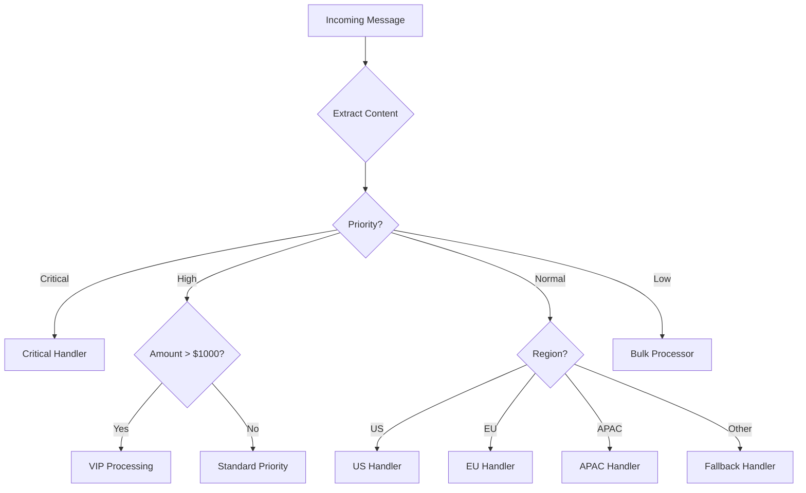
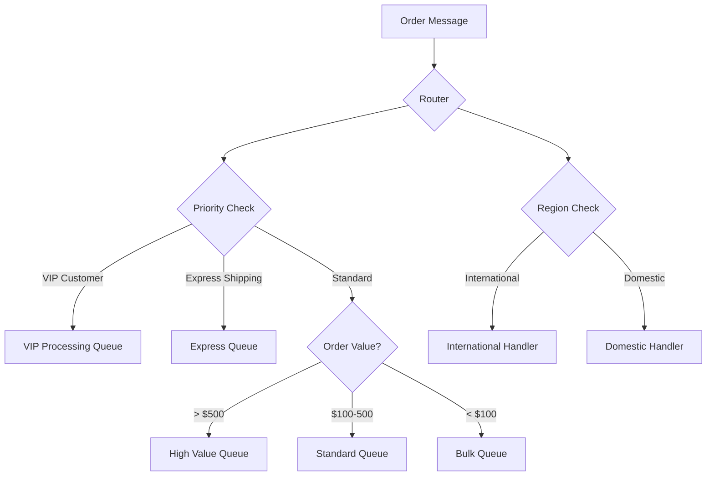
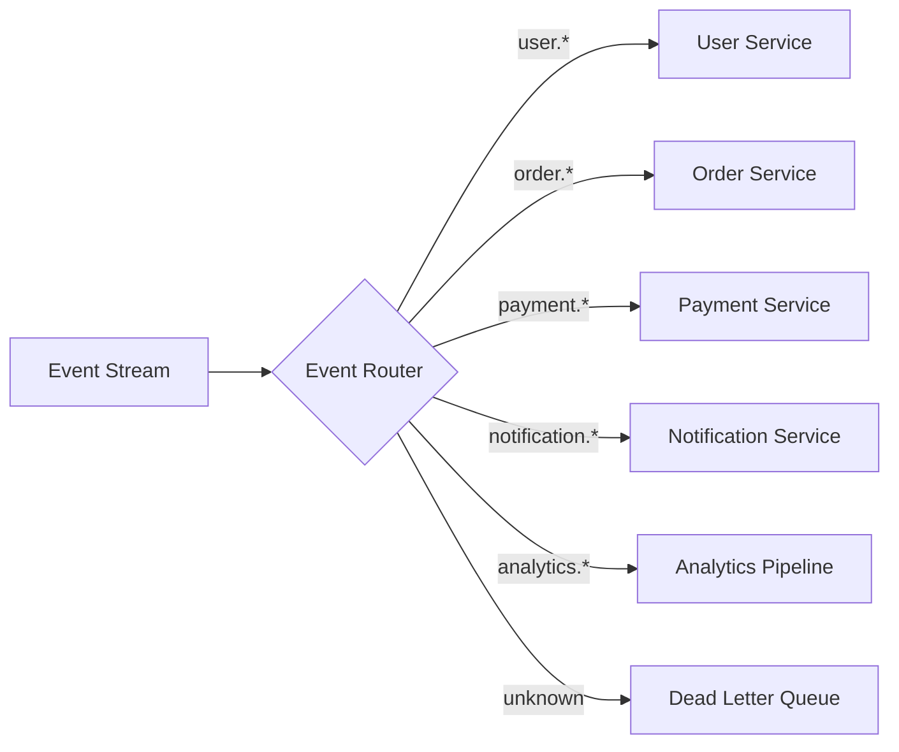

# How to Create Content-Based Router

Author: [nawazdhandala](https://github.com/nawazdhandala)

Tags: Message Queues, Integration Patterns, Design Patterns, Backend

Description: Learn how to implement content-based routing for dynamic message distribution.

---

> Content-based routing examines the content of each message and dynamically routes it to the appropriate destination based on predefined rules. It is one of the most powerful enterprise integration patterns for building flexible, decoupled systems.

In message-driven architectures, not all messages should go to the same place. An order message might need different handling based on priority, region, or product type. A content-based router inspects each message and forwards it to the right channel without the sender needing to know the destination.

This guide walks through the pattern fundamentals, implementation strategies, and production-ready code examples in TypeScript/Node.js.

---

## Table of Contents

1. What is Content-Based Routing?
2. When to Use Content-Based Routing
3. Core Components
4. Visual Architecture
5. Basic Implementation
6. Rule Engine Design
7. Dynamic Destinations
8. Practical Routing Examples
9. Advanced Patterns
10. Error Handling and Fallbacks
11. Performance Considerations
12. Testing Strategies
13. Common Anti-Patterns
14. Production Checklist

---

## 1. What is Content-Based Routing?

A content-based router is a message processing component that:

1. Receives an incoming message
2. Examines the message content (headers, body, metadata)
3. Evaluates routing rules against the content
4. Forwards the message to one or more destinations

| Concept | Description |
|---------|-------------|
| Message Inspector | Component that extracts relevant fields from incoming messages |
| Routing Rule | A condition that maps message attributes to destinations |
| Destination | The target channel, queue, service, or handler for the message |
| Fallback | Default destination when no rules match |
| Router | The orchestrator that ties inspection, rules, and routing together |

Unlike static routing (where the sender specifies the destination), content-based routing decouples producers from consumers entirely. The router becomes the intelligent middleware.

---

## 2. When to Use Content-Based Routing

Content-based routing shines in these scenarios:

| Scenario | Example |
|----------|---------|
| Multi-tenant systems | Route messages to tenant-specific handlers |
| Priority handling | Send high-priority orders to expedited processing |
| Geographic distribution | Route to regional data centers based on user location |
| Version routing | Direct messages to different API versions based on client headers |
| Load distribution | Spread traffic across specialized worker pools |
| Compliance filtering | Route sensitive data through compliant processing pipelines |

When NOT to use:

- Simple fanout (use pub/sub instead)
- Static, unchanging routes (use direct queues)
- Performance-critical paths where inspection overhead matters

---

## 3. Core Components



### Message Inspector

The inspector extracts routing-relevant fields from the message. This might include:

- Message headers (content-type, priority, tenant-id)
- Body fields (order type, region, amount)
- Metadata (timestamp, source, correlation-id)

### Rule Engine

The rule engine evaluates conditions against extracted fields. Rules can be:

- Simple equality checks
- Range comparisons
- Pattern matching (regex)
- Complex boolean logic (AND, OR, NOT)

### Destination Resolver

Once rules are evaluated, the resolver determines the actual destination:

- Queue names
- Topic patterns
- HTTP endpoints
- Function handlers

---

## 4. Visual Architecture

Here is how a content-based router fits into a typical message flow:



And here is a more complex routing decision tree:



---

## 5. Basic Implementation

Let us start with a foundational implementation:

```typescript
// types.ts
// Define the core types for our content-based router

// Represents any message flowing through the system
export interface Message {
  id: string;
  headers: Record<string, string>;
  body: Record<string, any>;
  metadata: {
    timestamp: number;
    source: string;
    correlationId?: string;
  };
}

// A routing rule with a condition and target destination
export interface RoutingRule {
  name: string;
  condition: (message: Message) => boolean;
  destination: string;
  priority: number; // Lower number = higher priority
}

// Configuration for the router
export interface RouterConfig {
  rules: RoutingRule[];
  fallbackDestination: string;
  enableLogging: boolean;
}

// Result of a routing decision
export interface RoutingResult {
  message: Message;
  destination: string;
  matchedRule: string | null;
  processingTimeMs: number;
}
```

```typescript
// content-based-router.ts
// The main router implementation

import { Message, RoutingRule, RouterConfig, RoutingResult } from './types';

export class ContentBasedRouter {
  private rules: RoutingRule[];
  private fallbackDestination: string;
  private enableLogging: boolean;

  constructor(config: RouterConfig) {
    // Sort rules by priority (ascending) so highest priority rules evaluate first
    this.rules = [...config.rules].sort((a, b) => a.priority - b.priority);
    this.fallbackDestination = config.fallbackDestination;
    this.enableLogging = config.enableLogging;
  }

  // Main routing method - evaluates all rules and returns the destination
  route(message: Message): RoutingResult {
    const startTime = performance.now();

    // Find the first matching rule (rules are pre-sorted by priority)
    for (const rule of this.rules) {
      try {
        if (rule.condition(message)) {
          const result = this.createResult(
            message,
            rule.destination,
            rule.name,
            startTime
          );
          this.log(`Message ${message.id} routed to ${rule.destination} via rule: ${rule.name}`);
          return result;
        }
      } catch (error) {
        // Log rule evaluation errors but continue to next rule
        this.log(`Error evaluating rule ${rule.name}: ${error}`);
      }
    }

    // No rules matched - use fallback
    const result = this.createResult(
      message,
      this.fallbackDestination,
      null,
      startTime
    );
    this.log(`Message ${message.id} routed to fallback: ${this.fallbackDestination}`);
    return result;
  }

  // Create a standardized routing result
  private createResult(
    message: Message,
    destination: string,
    matchedRule: string | null,
    startTime: number
  ): RoutingResult {
    return {
      message,
      destination,
      matchedRule,
      processingTimeMs: performance.now() - startTime,
    };
  }

  // Conditional logging based on configuration
  private log(message: string): void {
    if (this.enableLogging) {
      console.log(`[ContentBasedRouter] ${message}`);
    }
  }

  // Dynamically add a new rule at runtime
  addRule(rule: RoutingRule): void {
    this.rules.push(rule);
    this.rules.sort((a, b) => a.priority - b.priority);
  }

  // Remove a rule by name
  removeRule(ruleName: string): boolean {
    const index = this.rules.findIndex(r => r.name === ruleName);
    if (index !== -1) {
      this.rules.splice(index, 1);
      return true;
    }
    return false;
  }
}
```

---

## 6. Rule Engine Design

A robust rule engine supports multiple condition types:

```typescript
// rule-engine.ts
// Flexible rule engine with support for various condition types

import { Message, RoutingRule } from './types';

// Builder pattern for creating routing rules
export class RuleBuilder {
  private name: string = '';
  private priority: number = 100;
  private conditions: Array<(msg: Message) => boolean> = [];
  private destination: string = '';

  // Set the rule name (required for identification)
  withName(name: string): RuleBuilder {
    this.name = name;
    return this;
  }

  // Set rule priority (lower = evaluated first)
  withPriority(priority: number): RuleBuilder {
    this.priority = priority;
    return this;
  }

  // Set the target destination
  toDestination(destination: string): RuleBuilder {
    this.destination = destination;
    return this;
  }

  // Add condition: header equals specific value
  whereHeaderEquals(header: string, value: string): RuleBuilder {
    this.conditions.push((msg) => msg.headers[header] === value);
    return this;
  }

  // Add condition: header matches regex pattern
  whereHeaderMatches(header: string, pattern: RegExp): RuleBuilder {
    this.conditions.push((msg) => pattern.test(msg.headers[header] || ''));
    return this;
  }

  // Add condition: body field equals value
  whereBodyFieldEquals(field: string, value: any): RuleBuilder {
    this.conditions.push((msg) => this.getNestedField(msg.body, field) === value);
    return this;
  }

  // Add condition: body field greater than value
  whereBodyFieldGreaterThan(field: string, value: number): RuleBuilder {
    this.conditions.push((msg) => {
      const fieldValue = this.getNestedField(msg.body, field);
      return typeof fieldValue === 'number' && fieldValue > value;
    });
    return this;
  }

  // Add condition: body field less than value
  whereBodyFieldLessThan(field: string, value: number): RuleBuilder {
    this.conditions.push((msg) => {
      const fieldValue = this.getNestedField(msg.body, field);
      return typeof fieldValue === 'number' && fieldValue < value;
    });
    return this;
  }

  // Add condition: body field is in list of values
  whereBodyFieldIn(field: string, values: any[]): RuleBuilder {
    this.conditions.push((msg) => values.includes(this.getNestedField(msg.body, field)));
    return this;
  }

  // Add condition: body field contains substring
  whereBodyFieldContains(field: string, substring: string): RuleBuilder {
    this.conditions.push((msg) => {
      const fieldValue = this.getNestedField(msg.body, field);
      return typeof fieldValue === 'string' && fieldValue.includes(substring);
    });
    return this;
  }

  // Add condition: check if field exists
  whereFieldExists(field: string): RuleBuilder {
    this.conditions.push((msg) => this.getNestedField(msg.body, field) !== undefined);
    return this;
  }

  // Add a custom condition function
  whereCustom(condition: (msg: Message) => boolean): RuleBuilder {
    this.conditions.push(condition);
    return this;
  }

  // Build the final rule (all conditions must match - AND logic)
  build(): RoutingRule {
    if (!this.name || !this.destination) {
      throw new Error('Rule must have a name and destination');
    }

    return {
      name: this.name,
      priority: this.priority,
      destination: this.destination,
      // All conditions must be true for the rule to match
      condition: (msg: Message) => this.conditions.every(cond => cond(msg)),
    };
  }

  // Helper: access nested fields using dot notation (e.g., "order.customer.region")
  private getNestedField(obj: Record<string, any>, path: string): any {
    return path.split('.').reduce((current, key) => current?.[key], obj);
  }
}

// Factory function for cleaner API
export function rule(): RuleBuilder {
  return new RuleBuilder();
}
```

---

## 7. Dynamic Destinations

Sometimes destinations need to be computed at runtime:

```typescript
// dynamic-router.ts
// Router with support for dynamic destination resolution

import { Message, RoutingResult } from './types';

// Dynamic destination resolver function type
type DestinationResolver = (message: Message) => string | Promise<string>;

// Rule with dynamic destination support
interface DynamicRoutingRule {
  name: string;
  condition: (message: Message) => boolean;
  destinationResolver: DestinationResolver;
  priority: number;
}

export class DynamicContentRouter {
  private rules: DynamicRoutingRule[] = [];
  private fallbackResolver: DestinationResolver;

  constructor(fallbackResolver: DestinationResolver) {
    this.fallbackResolver = fallbackResolver;
  }

  // Add a rule with dynamic destination resolution
  addRule(
    name: string,
    condition: (message: Message) => boolean,
    destinationResolver: DestinationResolver,
    priority: number = 100
  ): void {
    this.rules.push({ name, condition, destinationResolver, priority });
    this.rules.sort((a, b) => a.priority - b.priority);
  }

  // Route with async destination resolution
  async route(message: Message): Promise<RoutingResult> {
    const startTime = performance.now();

    for (const rule of this.rules) {
      if (rule.condition(message)) {
        // Resolve destination dynamically (may be async)
        const destination = await rule.destinationResolver(message);
        return {
          message,
          destination,
          matchedRule: rule.name,
          processingTimeMs: performance.now() - startTime,
        };
      }
    }

    // Fallback with dynamic resolution
    const destination = await this.fallbackResolver(message);
    return {
      message,
      destination,
      matchedRule: null,
      processingTimeMs: performance.now() - startTime,
    };
  }
}

// Example: Tenant-based dynamic routing
export function createTenantRouter(): DynamicContentRouter {
  const router = new DynamicContentRouter(
    // Fallback: default tenant queue
    () => 'queue://default-tenant'
  );

  // Route to tenant-specific queue based on header
  router.addRule(
    'tenant-routing',
    (msg) => !!msg.headers['x-tenant-id'],
    (msg) => `queue://tenant-${msg.headers['x-tenant-id']}`,
    10
  );

  return router;
}

// Example: Region-based dynamic routing with external lookup
export function createRegionRouter(
  regionLookupService: (country: string) => Promise<string>
): DynamicContentRouter {
  const router = new DynamicContentRouter(
    () => 'queue://global-default'
  );

  // Route based on customer country with async region lookup
  router.addRule(
    'region-routing',
    (msg) => !!msg.body.customer?.country,
    async (msg) => {
      const region = await regionLookupService(msg.body.customer.country);
      return `queue://region-${region}`;
    },
    10
  );

  return router;
}
```

---

## 8. Practical Routing Examples

Let us look at real-world routing scenarios:

### E-Commerce Order Routing



```typescript
// order-router.ts
// Complete e-commerce order routing implementation

import { ContentBasedRouter } from './content-based-router';
import { rule } from './rule-engine';
import { Message, RouterConfig } from './types';

// Create router configured for e-commerce order processing
export function createOrderRouter(): ContentBasedRouter {
  const config: RouterConfig = {
    fallbackDestination: 'queue://orders.standard',
    enableLogging: true,
    rules: [
      // Priority 1: VIP customers always get special treatment
      rule()
        .withName('vip-customer')
        .withPriority(1)
        .whereBodyFieldEquals('customer.tier', 'VIP')
        .toDestination('queue://orders.vip')
        .build(),

      // Priority 2: Express shipping orders need immediate processing
      rule()
        .withName('express-shipping')
        .withPriority(2)
        .whereBodyFieldEquals('shipping.method', 'express')
        .toDestination('queue://orders.express')
        .build(),

      // Priority 3: High-value orders get dedicated handling
      rule()
        .withName('high-value-order')
        .withPriority(3)
        .whereBodyFieldGreaterThan('total', 500)
        .toDestination('queue://orders.high-value')
        .build(),

      // Priority 4: International orders route to specialized handler
      rule()
        .withName('international-order')
        .withPriority(4)
        .whereCustom((msg) => msg.body.shipping?.country !== 'US')
        .toDestination('queue://orders.international')
        .build(),

      // Priority 5: Bulk/low-value orders for batch processing
      rule()
        .withName('bulk-order')
        .withPriority(5)
        .whereBodyFieldLessThan('total', 50)
        .toDestination('queue://orders.bulk')
        .build(),
    ],
  };

  return new ContentBasedRouter(config);
}

// Usage example
function processIncomingOrder(orderData: any): void {
  const router = createOrderRouter();

  const message: Message = {
    id: `order-${Date.now()}`,
    headers: {
      'content-type': 'application/json',
      'x-source': 'web-checkout',
    },
    body: orderData,
    metadata: {
      timestamp: Date.now(),
      source: 'checkout-service',
      correlationId: orderData.sessionId,
    },
  };

  const result = router.route(message);
  console.log(`Order ${message.id} routed to ${result.destination}`);
  console.log(`Matched rule: ${result.matchedRule || 'fallback'}`);
  console.log(`Processing time: ${result.processingTimeMs.toFixed(2)}ms`);
}
```

### Multi-Tenant SaaS Routing

```typescript
// tenant-router.ts
// Route messages to tenant-specific processing pipelines

import { ContentBasedRouter } from './content-based-router';
import { rule } from './rule-engine';
import { RouterConfig } from './types';

// Tenant configuration loaded from database or config service
interface TenantConfig {
  tenantId: string;
  tier: 'free' | 'pro' | 'enterprise';
  region: string;
  dedicatedQueue?: string;
}

export function createTenantRouter(tenants: TenantConfig[]): ContentBasedRouter {
  const rules = [];

  // Generate rules for each tenant based on their configuration
  for (const tenant of tenants) {
    // Enterprise tenants with dedicated queues
    if (tenant.dedicatedQueue) {
      rules.push(
        rule()
          .withName(`tenant-${tenant.tenantId}-dedicated`)
          .withPriority(1) // Highest priority
          .whereHeaderEquals('x-tenant-id', tenant.tenantId)
          .toDestination(tenant.dedicatedQueue)
          .build()
      );
      continue;
    }

    // Route based on tier and region
    const destination = `queue://tenant.${tenant.tier}.${tenant.region}`;
    rules.push(
      rule()
        .withName(`tenant-${tenant.tenantId}`)
        .withPriority(10 + (tenant.tier === 'enterprise' ? 0 : tenant.tier === 'pro' ? 1 : 2))
        .whereHeaderEquals('x-tenant-id', tenant.tenantId)
        .toDestination(destination)
        .build()
    );
  }

  const config: RouterConfig = {
    rules,
    fallbackDestination: 'queue://tenant.unknown',
    enableLogging: true,
  };

  return new ContentBasedRouter(config);
}
```

### Event Type Routing



```typescript
// event-router.ts
// Route events based on event type patterns

import { ContentBasedRouter } from './content-based-router';
import { rule } from './rule-engine';
import { RouterConfig } from './types';

export function createEventRouter(): ContentBasedRouter {
  const config: RouterConfig = {
    fallbackDestination: 'queue://events.dlq', // Dead letter queue for unknown events
    enableLogging: true,
    rules: [
      // User domain events
      rule()
        .withName('user-events')
        .withPriority(10)
        .whereHeaderMatches('event-type', /^user\./)
        .toDestination('queue://events.user')
        .build(),

      // Order domain events
      rule()
        .withName('order-events')
        .withPriority(10)
        .whereHeaderMatches('event-type', /^order\./)
        .toDestination('queue://events.order')
        .build(),

      // Payment domain events (higher priority for financial data)
      rule()
        .withName('payment-events')
        .withPriority(5)
        .whereHeaderMatches('event-type', /^payment\./)
        .toDestination('queue://events.payment')
        .build(),

      // Notification events
      rule()
        .withName('notification-events')
        .withPriority(10)
        .whereHeaderMatches('event-type', /^notification\./)
        .toDestination('queue://events.notification')
        .build(),

      // Analytics events (low priority, high volume)
      rule()
        .withName('analytics-events')
        .withPriority(100)
        .whereHeaderMatches('event-type', /^analytics\./)
        .toDestination('queue://events.analytics')
        .build(),

      // Audit events (must be processed reliably)
      rule()
        .withName('audit-events')
        .withPriority(1)
        .whereHeaderMatches('event-type', /^audit\./)
        .toDestination('queue://events.audit')
        .build(),
    ],
  };

  return new ContentBasedRouter(config);
}
```

---

## 9. Advanced Patterns

### Multi-Destination Routing

Sometimes a message needs to go to multiple destinations:

```typescript
// multi-destination-router.ts
// Router that can send messages to multiple destinations

import { Message, RoutingRule } from './types';

interface MultiDestinationRule {
  name: string;
  condition: (message: Message) => boolean;
  destinations: string[];
  priority: number;
}

interface MultiRoutingResult {
  message: Message;
  destinations: string[];
  matchedRules: string[];
  processingTimeMs: number;
}

export class MultiDestinationRouter {
  private rules: MultiDestinationRule[] = [];
  private fallbackDestinations: string[];

  constructor(fallbackDestinations: string[]) {
    this.fallbackDestinations = fallbackDestinations;
  }

  addRule(
    name: string,
    condition: (message: Message) => boolean,
    destinations: string[],
    priority: number = 100
  ): void {
    this.rules.push({ name, condition, destinations, priority });
    this.rules.sort((a, b) => a.priority - b.priority);
  }

  // Route to ALL matching destinations (not just first match)
  routeToAll(message: Message): MultiRoutingResult {
    const startTime = performance.now();
    const destinations: string[] = [];
    const matchedRules: string[] = [];

    // Evaluate all rules and collect all matching destinations
    for (const rule of this.rules) {
      if (rule.condition(message)) {
        destinations.push(...rule.destinations);
        matchedRules.push(rule.name);
      }
    }

    // Use fallback if no rules matched
    if (destinations.length === 0) {
      destinations.push(...this.fallbackDestinations);
    }

    return {
      message,
      destinations: [...new Set(destinations)], // Remove duplicates
      matchedRules,
      processingTimeMs: performance.now() - startTime,
    };
  }
}

// Example: Route order events to multiple systems
export function createOrderEventRouter(): MultiDestinationRouter {
  const router = new MultiDestinationRouter(['queue://events.dlq']);

  // All orders go to analytics and audit
  router.addRule(
    'all-orders-base',
    (msg) => msg.headers['event-type']?.startsWith('order.'),
    ['queue://analytics.orders', 'queue://audit.orders'],
    100
  );

  // High-value orders also notify finance team
  router.addRule(
    'high-value-orders',
    (msg) => msg.body.total > 1000,
    ['queue://finance.high-value'],
    50
  );

  // International orders notify compliance
  router.addRule(
    'international-orders',
    (msg) => msg.body.shipping?.country !== 'US',
    ['queue://compliance.international'],
    50
  );

  return router;
}
```

### Weighted Routing for A/B Testing

```typescript
// weighted-router.ts
// Route messages based on weights for A/B testing or gradual rollouts

import { Message } from './types';

interface WeightedDestination {
  destination: string;
  weight: number; // Percentage (0-100)
}

interface WeightedRoutingResult {
  message: Message;
  destination: string;
  variant: string;
  processingTimeMs: number;
}

export class WeightedRouter {
  private destinations: WeightedDestination[];
  private totalWeight: number;

  constructor(destinations: WeightedDestination[]) {
    this.destinations = destinations;
    this.totalWeight = destinations.reduce((sum, d) => sum + d.weight, 0);

    // Validate weights sum to 100
    if (Math.abs(this.totalWeight - 100) > 0.01) {
      console.warn(`Weights sum to ${this.totalWeight}, not 100. Normalizing...`);
    }
  }

  route(message: Message): WeightedRoutingResult {
    const startTime = performance.now();

    // Use message ID for consistent routing (same message always goes to same destination)
    const hash = this.hashString(message.id);
    const normalizedHash = hash % 100;

    let cumulativeWeight = 0;
    for (const dest of this.destinations) {
      cumulativeWeight += (dest.weight / this.totalWeight) * 100;
      if (normalizedHash < cumulativeWeight) {
        return {
          message,
          destination: dest.destination,
          variant: dest.destination,
          processingTimeMs: performance.now() - startTime,
        };
      }
    }

    // Fallback to last destination
    return {
      message,
      destination: this.destinations[this.destinations.length - 1].destination,
      variant: this.destinations[this.destinations.length - 1].destination,
      processingTimeMs: performance.now() - startTime,
    };
  }

  // Simple string hash for consistent routing
  private hashString(str: string): number {
    let hash = 0;
    for (let i = 0; i < str.length; i++) {
      const char = str.charCodeAt(i);
      hash = ((hash << 5) - hash) + char;
      hash = hash & hash; // Convert to 32-bit integer
    }
    return Math.abs(hash);
  }
}

// Example: Gradual rollout of new order processing system
export function createRolloutRouter(): WeightedRouter {
  return new WeightedRouter([
    { destination: 'queue://orders.v1', weight: 90 },  // 90% to stable system
    { destination: 'queue://orders.v2', weight: 10 },  // 10% to new system
  ]);
}
```

---

## 10. Error Handling and Fallbacks

Robust error handling is critical for production routers:

```typescript
// resilient-router.ts
// Router with comprehensive error handling and circuit breaker

import { Message, RoutingResult, RoutingRule, RouterConfig } from './types';

// Circuit breaker states
type CircuitState = 'closed' | 'open' | 'half-open';

interface CircuitBreakerConfig {
  failureThreshold: number;    // Failures before opening circuit
  recoveryTimeMs: number;      // Time before attempting recovery
  halfOpenRequests: number;    // Requests to test in half-open state
}

interface DestinationHealth {
  failures: number;
  lastFailure: number;
  state: CircuitState;
  halfOpenAttempts: number;
}

export class ResilientRouter {
  private rules: RoutingRule[];
  private fallbackDestination: string;
  private circuitConfig: CircuitBreakerConfig;
  private destinationHealth: Map<string, DestinationHealth> = new Map();

  constructor(config: RouterConfig, circuitConfig: CircuitBreakerConfig) {
    this.rules = [...config.rules].sort((a, b) => a.priority - b.priority);
    this.fallbackDestination = config.fallbackDestination;
    this.circuitConfig = circuitConfig;
  }

  async route(message: Message): Promise<RoutingResult> {
    const startTime = performance.now();

    // Try each matching rule, skipping destinations with open circuits
    for (const rule of this.rules) {
      try {
        if (rule.condition(message)) {
          // Check if destination circuit is open
          if (this.isCircuitOpen(rule.destination)) {
            console.log(`Circuit open for ${rule.destination}, trying next rule`);
            continue;
          }

          return this.createResult(message, rule.destination, rule.name, startTime);
        }
      } catch (error) {
        console.error(`Rule ${rule.name} evaluation failed:`, error);
        // Continue to next rule on evaluation error
      }
    }

    // All rules failed or had open circuits - use fallback
    return this.createResult(message, this.fallbackDestination, null, startTime);
  }

  // Record successful delivery to destination
  recordSuccess(destination: string): void {
    const health = this.getOrCreateHealth(destination);

    if (health.state === 'half-open') {
      health.halfOpenAttempts++;
      if (health.halfOpenAttempts >= this.circuitConfig.halfOpenRequests) {
        // Enough successful requests - close circuit
        health.state = 'closed';
        health.failures = 0;
        health.halfOpenAttempts = 0;
        console.log(`Circuit closed for ${destination}`);
      }
    }
  }

  // Record failed delivery to destination
  recordFailure(destination: string): void {
    const health = this.getOrCreateHealth(destination);
    health.failures++;
    health.lastFailure = Date.now();

    if (health.state === 'half-open') {
      // Failure during half-open - reopen circuit
      health.state = 'open';
      health.halfOpenAttempts = 0;
      console.log(`Circuit reopened for ${destination}`);
    } else if (health.failures >= this.circuitConfig.failureThreshold) {
      // Too many failures - open circuit
      health.state = 'open';
      console.log(`Circuit opened for ${destination} after ${health.failures} failures`);
    }
  }

  private isCircuitOpen(destination: string): boolean {
    const health = this.destinationHealth.get(destination);
    if (!health) return false;

    if (health.state === 'open') {
      // Check if recovery time has passed
      const timeSinceFailure = Date.now() - health.lastFailure;
      if (timeSinceFailure >= this.circuitConfig.recoveryTimeMs) {
        health.state = 'half-open';
        health.halfOpenAttempts = 0;
        console.log(`Circuit half-open for ${destination}, testing...`);
        return false; // Allow test request
      }
      return true; // Still open
    }

    return false;
  }

  private getOrCreateHealth(destination: string): DestinationHealth {
    let health = this.destinationHealth.get(destination);
    if (!health) {
      health = {
        failures: 0,
        lastFailure: 0,
        state: 'closed',
        halfOpenAttempts: 0,
      };
      this.destinationHealth.set(destination, health);
    }
    return health;
  }

  private createResult(
    message: Message,
    destination: string,
    matchedRule: string | null,
    startTime: number
  ): RoutingResult {
    return {
      message,
      destination,
      matchedRule,
      processingTimeMs: performance.now() - startTime,
    };
  }
}
```

---

## 11. Performance Considerations

Content-based routing adds processing overhead. Here are strategies to optimize:

```typescript
// optimized-router.ts
// Performance-optimized router with caching and indexing

import { Message, RoutingRule, RoutingResult } from './types';

// Cache routing decisions for identical message patterns
interface CacheEntry {
  destination: string;
  matchedRule: string | null;
  timestamp: number;
}

export class OptimizedRouter {
  private rules: RoutingRule[];
  private fallbackDestination: string;
  private cache: Map<string, CacheEntry> = new Map();
  private cacheTtlMs: number;
  private maxCacheSize: number;

  // Index rules by common header patterns for faster lookup
  private headerIndex: Map<string, RoutingRule[]> = new Map();

  constructor(
    rules: RoutingRule[],
    fallbackDestination: string,
    cacheTtlMs: number = 60000,
    maxCacheSize: number = 10000
  ) {
    this.rules = [...rules].sort((a, b) => a.priority - b.priority);
    this.fallbackDestination = fallbackDestination;
    this.cacheTtlMs = cacheTtlMs;
    this.maxCacheSize = maxCacheSize;
  }

  route(message: Message): RoutingResult {
    const startTime = performance.now();

    // Try cache first
    const cacheKey = this.computeCacheKey(message);
    const cached = this.cache.get(cacheKey);
    if (cached && Date.now() - cached.timestamp < this.cacheTtlMs) {
      return {
        message,
        destination: cached.destination,
        matchedRule: cached.matchedRule,
        processingTimeMs: performance.now() - startTime,
      };
    }

    // Evaluate rules
    for (const rule of this.rules) {
      if (rule.condition(message)) {
        const result = {
          message,
          destination: rule.destination,
          matchedRule: rule.name,
          processingTimeMs: performance.now() - startTime,
        };

        // Cache the result
        this.cacheResult(cacheKey, rule.destination, rule.name);
        return result;
      }
    }

    // Fallback
    const result = {
      message,
      destination: this.fallbackDestination,
      matchedRule: null,
      processingTimeMs: performance.now() - startTime,
    };

    this.cacheResult(cacheKey, this.fallbackDestination, null);
    return result;
  }

  // Compute cache key from routing-relevant message fields
  private computeCacheKey(message: Message): string {
    // Only include fields that affect routing decisions
    const keyParts = [
      message.headers['x-tenant-id'] || '',
      message.headers['event-type'] || '',
      message.headers['priority'] || '',
      message.body.type || '',
      message.body.region || '',
    ];
    return keyParts.join('|');
  }

  private cacheResult(key: string, destination: string, matchedRule: string | null): void {
    // Evict oldest entries if cache is full
    if (this.cache.size >= this.maxCacheSize) {
      const oldestKey = this.cache.keys().next().value;
      if (oldestKey) {
        this.cache.delete(oldestKey);
      }
    }

    this.cache.set(key, {
      destination,
      matchedRule,
      timestamp: Date.now(),
    });
  }

  // Clear cache (useful after rule updates)
  clearCache(): void {
    this.cache.clear();
  }

  // Get cache statistics
  getCacheStats(): { size: number; hitRate: number } {
    return {
      size: this.cache.size,
      hitRate: 0, // Would need hit/miss tracking for real implementation
    };
  }
}
```

### Performance Tips

| Technique | Benefit | Trade-off |
|-----------|---------|-----------|
| Rule caching | Avoid re-evaluation for similar messages | Memory usage, cache invalidation complexity |
| Priority ordering | Evaluate likely matches first | Must know traffic patterns |
| Header indexing | O(1) lookup for header-based rules | Setup complexity |
| Lazy evaluation | Skip expensive conditions if earlier ones fail | Rule ordering matters |
| Batch routing | Amortize overhead across multiple messages | Adds latency for individual messages |

---

## 12. Testing Strategies

Comprehensive testing ensures routing correctness:

```typescript
// router.test.ts
// Test suite for content-based router

import { ContentBasedRouter } from './content-based-router';
import { rule } from './rule-engine';
import { Message, RouterConfig } from './types';

// Helper to create test messages
function createMessage(overrides: Partial<Message> = {}): Message {
  return {
    id: `test-${Date.now()}`,
    headers: {},
    body: {},
    metadata: {
      timestamp: Date.now(),
      source: 'test',
    },
    ...overrides,
  };
}

describe('ContentBasedRouter', () => {
  let router: ContentBasedRouter;

  beforeEach(() => {
    const config: RouterConfig = {
      fallbackDestination: 'queue://fallback',
      enableLogging: false,
      rules: [
        rule()
          .withName('priority-high')
          .withPriority(1)
          .whereHeaderEquals('priority', 'high')
          .toDestination('queue://high-priority')
          .build(),

        rule()
          .withName('order-type')
          .withPriority(10)
          .whereBodyFieldEquals('type', 'order')
          .toDestination('queue://orders')
          .build(),

        rule()
          .withName('large-amount')
          .withPriority(20)
          .whereBodyFieldGreaterThan('amount', 1000)
          .toDestination('queue://large-transactions')
          .build(),
      ],
    };

    router = new ContentBasedRouter(config);
  });

  describe('rule matching', () => {
    it('should route high priority messages to high-priority queue', () => {
      const message = createMessage({
        headers: { priority: 'high' },
      });

      const result = router.route(message);

      expect(result.destination).toBe('queue://high-priority');
      expect(result.matchedRule).toBe('priority-high');
    });

    it('should route orders to orders queue', () => {
      const message = createMessage({
        body: { type: 'order', amount: 100 },
      });

      const result = router.route(message);

      expect(result.destination).toBe('queue://orders');
      expect(result.matchedRule).toBe('order-type');
    });

    it('should respect rule priority', () => {
      // Message matches both high-priority (priority 1) and order-type (priority 10)
      const message = createMessage({
        headers: { priority: 'high' },
        body: { type: 'order' },
      });

      const result = router.route(message);

      // Should match high-priority first due to lower priority number
      expect(result.destination).toBe('queue://high-priority');
      expect(result.matchedRule).toBe('priority-high');
    });

    it('should use fallback when no rules match', () => {
      const message = createMessage({
        body: { type: 'unknown' },
      });

      const result = router.route(message);

      expect(result.destination).toBe('queue://fallback');
      expect(result.matchedRule).toBeNull();
    });
  });

  describe('performance', () => {
    it('should route messages in under 1ms', () => {
      const message = createMessage({
        headers: { priority: 'high' },
      });

      const result = router.route(message);

      expect(result.processingTimeMs).toBeLessThan(1);
    });

    it('should handle high throughput', () => {
      const messages = Array.from({ length: 10000 }, (_, i) =>
        createMessage({
          id: `msg-${i}`,
          body: { type: i % 2 === 0 ? 'order' : 'event' },
        })
      );

      const startTime = performance.now();
      for (const message of messages) {
        router.route(message);
      }
      const totalTime = performance.now() - startTime;

      // Should process 10k messages in under 100ms
      expect(totalTime).toBeLessThan(100);
      console.log(`Processed 10000 messages in ${totalTime.toFixed(2)}ms`);
    });
  });

  describe('dynamic rules', () => {
    it('should allow adding rules at runtime', () => {
      router.addRule(
        rule()
          .withName('new-rule')
          .withPriority(0) // Highest priority
          .whereBodyFieldEquals('urgent', true)
          .toDestination('queue://urgent')
          .build()
      );

      const message = createMessage({
        body: { urgent: true },
      });

      const result = router.route(message);

      expect(result.destination).toBe('queue://urgent');
    });

    it('should allow removing rules at runtime', () => {
      router.removeRule('priority-high');

      const message = createMessage({
        headers: { priority: 'high' },
      });

      const result = router.route(message);

      // Should fall through to next matching rule or fallback
      expect(result.matchedRule).not.toBe('priority-high');
    });
  });
});
```

---

## 13. Common Anti-Patterns

| Anti-Pattern | Problem | Solution |
|--------------|---------|----------|
| God Router | Single router with hundreds of rules | Split into domain-specific routers |
| Deep Nesting | Complex nested conditions hard to debug | Flatten with multiple simpler rules |
| String Matching | Brittle exact string comparisons | Use enums, constants, or patterns |
| Missing Fallback | Unknown messages cause failures | Always define a fallback destination |
| Mutable Rules | Concurrent rule modifications cause race conditions | Use immutable rule sets or proper synchronization |
| No Logging | Hard to debug routing decisions | Log all routing decisions with context |
| Overly Broad Rules | Rules match more messages than intended | Be specific, add constraints |

### Example: Refactoring a God Router

```typescript
// Before: God router with mixed concerns
const godRouter = new ContentBasedRouter({
  rules: [
    // User rules
    rule().whereBodyFieldEquals('type', 'user.created').toDestination('queue://users'),
    rule().whereBodyFieldEquals('type', 'user.updated').toDestination('queue://users'),
    // Order rules
    rule().whereBodyFieldEquals('type', 'order.created').toDestination('queue://orders'),
    // Payment rules
    rule().whereBodyFieldEquals('type', 'payment.completed').toDestination('queue://payments'),
    // ... 50 more rules
  ],
  fallbackDestination: 'queue://dlq',
  enableLogging: true,
});

// After: Domain-specific routers
const userRouter = createUserRouter();
const orderRouter = createOrderRouter();
const paymentRouter = createPaymentRouter();

// Composite router that delegates to domain routers
function routeMessage(message: Message): RoutingResult {
  const domain = message.body.type?.split('.')[0];

  switch (domain) {
    case 'user':
      return userRouter.route(message);
    case 'order':
      return orderRouter.route(message);
    case 'payment':
      return paymentRouter.route(message);
    default:
      return { message, destination: 'queue://dlq', matchedRule: null, processingTimeMs: 0 };
  }
}
```

---

## 14. Production Checklist

Before deploying a content-based router to production:

### Configuration

- [ ] All routing rules have meaningful names for logging/debugging
- [ ] Rules are ordered by priority correctly
- [ ] Fallback destination is defined and monitored
- [ ] Rule conditions handle null/undefined values gracefully

### Monitoring

- [ ] Routing decisions are logged with message IDs
- [ ] Metrics track messages per destination
- [ ] Alerts for high fallback destination traffic
- [ ] Circuit breaker states are monitored

### Performance

- [ ] Rules are tested for performance under load
- [ ] Caching is implemented for repetitive patterns
- [ ] Batch processing is considered for high-volume scenarios

### Reliability

- [ ] Circuit breakers protect against destination failures
- [ ] Dead letter queue captures unroutable messages
- [ ] Graceful degradation when routing service is unavailable

### Operations

- [ ] Rule changes can be deployed without restart
- [ ] Rollback plan for rule changes
- [ ] Documentation for each routing rule
- [ ] Runbook for common routing issues

---

## Summary

Content-based routing is a powerful pattern for building flexible, decoupled message-driven systems. The key components are:

| Component | Purpose |
|-----------|---------|
| Message Inspector | Extract routing-relevant fields from messages |
| Rule Engine | Evaluate conditions and determine matches |
| Destination Resolver | Map matched rules to actual destinations |
| Error Handler | Manage failures with circuits and fallbacks |

When implementing content-based routing:

1. Start simple with basic rules and add complexity as needed
2. Always define a fallback for unmatched messages
3. Order rules by priority for predictable behavior
4. Monitor routing decisions and destination health
5. Test rules thoroughly with edge cases

Content-based routing enables you to evolve your message consumers independently from producers, making it easier to scale, maintain, and extend your integration architecture over time.

---

### See Also

- [Enterprise Integration Patterns](https://www.enterpriseintegrationpatterns.com/patterns/messaging/ContentBasedRouter.html) - The original pattern definition
- [Message Queue Fundamentals](/blog/post/message-queue-fundamentals) - Understanding the basics of message-driven architecture
- [Circuit Breaker Pattern](/blog/post/circuit-breaker-pattern) - Protecting against cascading failures

