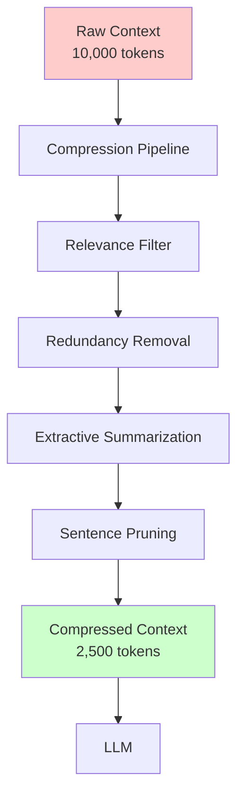
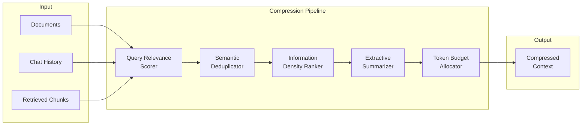
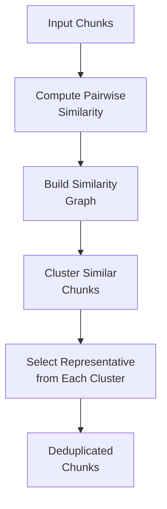
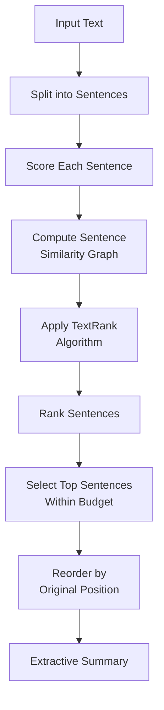
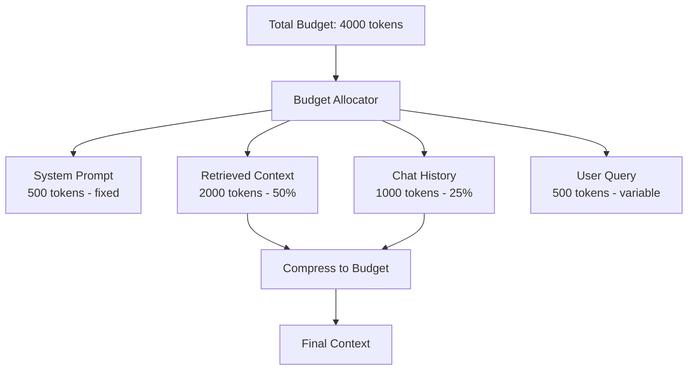
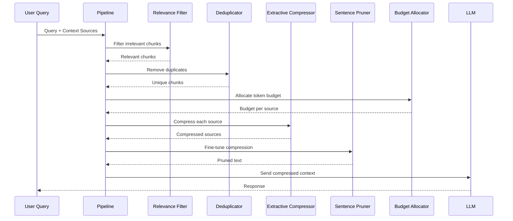

# How to Build Context Compression

Author: [nawazdhandala](https://github.com/nawazdhandala)

Tags: LLM, Context Compression, RAG, Token Optimization

Description: Learn to implement context compression with extractive summarization, sentence filtering, and information density optimization for efficient LLM usage.

---

Context compression is essential for building cost-effective and performant LLM applications. As context windows grow larger, so do API costs and latency. By intelligently compressing context before sending it to an LLM, you can reduce token usage by 50-80% while preserving the information needed for accurate responses. This guide covers practical techniques for building context compression systems that maintain quality while dramatically reducing costs.

## Why Context Compression Matters

Every token sent to an LLM has a cost - both in API fees and processing time. When building RAG systems, agents, or chat applications, context can quickly balloon to thousands of tokens. Context compression addresses this by removing redundant, irrelevant, or low-value content before it reaches the model.



The benefits of context compression include:

1. **Reduced API costs** - Fewer tokens mean lower bills
2. **Faster responses** - Less input means faster processing
3. **Better focus** - Removing noise helps the model concentrate on relevant information
4. **Longer effective context** - Fit more meaningful content in fixed context windows

## Compression Architecture Overview

A robust context compression system combines multiple techniques in a pipeline. Each stage targets a different type of waste in your context.



Let us build each component step by step.

## Relevance Filtering

The first compression stage removes content that is not relevant to the current query. This is the highest-impact optimization since irrelevant content provides zero value while consuming tokens.

```python
import numpy as np
from typing import List, Tuple
from dataclasses import dataclass
from sentence_transformers import SentenceTransformer

@dataclass
class TextChunk:
    content: str
    source: str
    metadata: dict

class RelevanceFilter:
    """Filter chunks based on semantic relevance to a query."""

    def __init__(
        self,
        model_name: str = 'all-MiniLM-L6-v2',
        relevance_threshold: float = 0.3
    ):
        self.model = SentenceTransformer(model_name)
        self.relevance_threshold = relevance_threshold

    def compute_relevance(
        self,
        query: str,
        chunks: List[TextChunk]
    ) -> List[Tuple[TextChunk, float]]:
        """Compute relevance scores for each chunk against the query."""

        # Encode query and chunks
        query_embedding = self.model.encode(query, normalize_embeddings=True)
        chunk_texts = [chunk.content for chunk in chunks]
        chunk_embeddings = self.model.encode(
            chunk_texts,
            normalize_embeddings=True
        )

        # Compute cosine similarities
        similarities = np.dot(chunk_embeddings, query_embedding)

        # Pair chunks with scores
        scored_chunks = [
            (chunk, float(score))
            for chunk, score in zip(chunks, similarities)
        ]

        return sorted(scored_chunks, key=lambda x: x[1], reverse=True)

    def filter(
        self,
        query: str,
        chunks: List[TextChunk],
        top_k: int = None
    ) -> List[TextChunk]:
        """Filter chunks to those relevant to the query."""

        scored_chunks = self.compute_relevance(query, chunks)

        # Apply threshold filter
        relevant = [
            (chunk, score) for chunk, score in scored_chunks
            if score >= self.relevance_threshold
        ]

        # Apply top-k limit if specified
        if top_k is not None:
            relevant = relevant[:top_k]

        return [chunk for chunk, _ in relevant]
```

The relevance filter uses embedding similarity to score each chunk against the query. Chunks below the threshold are discarded entirely, providing immediate token savings.

### Adaptive Threshold Selection

A fixed threshold may not work well across different query types. Here is an adaptive approach that adjusts based on score distribution.

```python
class AdaptiveRelevanceFilter(RelevanceFilter):
    """Relevance filter with adaptive threshold selection."""

    def __init__(
        self,
        model_name: str = 'all-MiniLM-L6-v2',
        min_threshold: float = 0.2,
        percentile: float = 0.3
    ):
        super().__init__(model_name, min_threshold)
        self.percentile = percentile

    def _compute_adaptive_threshold(
        self,
        scores: List[float]
    ) -> float:
        """Compute threshold based on score distribution."""

        if not scores:
            return self.relevance_threshold

        # Use percentile-based threshold
        sorted_scores = sorted(scores, reverse=True)
        percentile_idx = int(len(sorted_scores) * self.percentile)
        percentile_threshold = sorted_scores[min(percentile_idx, len(sorted_scores) - 1)]

        # Use the higher of fixed minimum or percentile threshold
        return max(self.relevance_threshold, percentile_threshold)

    def filter(
        self,
        query: str,
        chunks: List[TextChunk],
        top_k: int = None
    ) -> List[TextChunk]:
        """Filter with adaptive threshold."""

        scored_chunks = self.compute_relevance(query, chunks)
        scores = [score for _, score in scored_chunks]

        # Compute adaptive threshold
        threshold = self._compute_adaptive_threshold(scores)

        # Apply threshold filter
        relevant = [
            (chunk, score) for chunk, score in scored_chunks
            if score >= threshold
        ]

        if top_k is not None:
            relevant = relevant[:top_k]

        return [chunk for chunk, _ in relevant]
```

## Semantic Deduplication

After relevance filtering, the next step is removing redundant information. Multiple retrieved chunks often contain overlapping content. Semantic deduplication identifies and removes this redundancy.



```python
from typing import List, Set
import numpy as np
from collections import defaultdict

class SemanticDeduplicator:
    """Remove semantically redundant chunks."""

    def __init__(
        self,
        model_name: str = 'all-MiniLM-L6-v2',
        similarity_threshold: float = 0.85
    ):
        self.model = SentenceTransformer(model_name)
        self.similarity_threshold = similarity_threshold

    def _compute_similarity_matrix(
        self,
        embeddings: np.ndarray
    ) -> np.ndarray:
        """Compute pairwise cosine similarity matrix."""

        # Normalize embeddings
        norms = np.linalg.norm(embeddings, axis=1, keepdims=True)
        normalized = embeddings / norms

        # Compute similarity matrix
        return np.dot(normalized, normalized.T)

    def _find_clusters(
        self,
        similarity_matrix: np.ndarray
    ) -> List[Set[int]]:
        """Find clusters of similar chunks using connected components."""

        n = len(similarity_matrix)
        visited = set()
        clusters = []

        for i in range(n):
            if i in visited:
                continue

            # BFS to find connected component
            cluster = set()
            queue = [i]

            while queue:
                node = queue.pop(0)
                if node in visited:
                    continue

                visited.add(node)
                cluster.add(node)

                # Find similar neighbors
                for j in range(n):
                    if j not in visited and similarity_matrix[node, j] >= self.similarity_threshold:
                        queue.append(j)

            clusters.append(cluster)

        return clusters

    def _select_representative(
        self,
        cluster: Set[int],
        chunks: List[TextChunk],
        embeddings: np.ndarray
    ) -> int:
        """Select the most representative chunk from a cluster."""

        if len(cluster) == 1:
            return list(cluster)[0]

        cluster_list = list(cluster)
        cluster_embeddings = embeddings[cluster_list]

        # Compute centroid
        centroid = np.mean(cluster_embeddings, axis=0)
        centroid = centroid / np.linalg.norm(centroid)

        # Find chunk closest to centroid
        similarities = np.dot(cluster_embeddings, centroid)
        best_idx = np.argmax(similarities)

        return cluster_list[best_idx]

    def deduplicate(
        self,
        chunks: List[TextChunk]
    ) -> List[TextChunk]:
        """Remove semantically redundant chunks."""

        if len(chunks) <= 1:
            return chunks

        # Encode all chunks
        texts = [chunk.content for chunk in chunks]
        embeddings = self.model.encode(texts, normalize_embeddings=True)

        # Compute similarity matrix
        similarity_matrix = self._compute_similarity_matrix(embeddings)

        # Find clusters
        clusters = self._find_clusters(similarity_matrix)

        # Select representative from each cluster
        representatives = []
        for cluster in clusters:
            rep_idx = self._select_representative(cluster, chunks, embeddings)
            representatives.append(chunks[rep_idx])

        return representatives
```

This deduplicator groups semantically similar chunks together and keeps only one representative from each group. The selection favors chunks closest to the cluster centroid, which typically contain the most complete information.

## Information Density Scoring

Not all sentences carry equal information value. Information density scoring identifies which sentences pack the most meaning per token.

```python
import re
from typing import List, Tuple
from collections import Counter
import math

class InformationDensityScorer:
    """Score sentences by information density."""

    def __init__(self):
        self.stopwords = set([
            'the', 'a', 'an', 'is', 'are', 'was', 'were', 'be', 'been',
            'being', 'have', 'has', 'had', 'do', 'does', 'did', 'will',
            'would', 'could', 'should', 'may', 'might', 'must', 'shall',
            'can', 'need', 'dare', 'ought', 'used', 'to', 'of', 'in',
            'for', 'on', 'with', 'at', 'by', 'from', 'as', 'into',
            'through', 'during', 'before', 'after', 'above', 'below',
            'between', 'under', 'again', 'further', 'then', 'once',
            'here', 'there', 'when', 'where', 'why', 'how', 'all',
            'each', 'few', 'more', 'most', 'other', 'some', 'such',
            'no', 'nor', 'not', 'only', 'own', 'same', 'so', 'than',
            'too', 'very', 'just', 'and', 'but', 'if', 'or', 'because',
            'until', 'while', 'although', 'though', 'this', 'that',
            'these', 'those', 'it', 'its'
        ])

    def _tokenize(self, text: str) -> List[str]:
        """Simple word tokenization."""
        return re.findall(r'\b\w+\b', text.lower())

    def _split_sentences(self, text: str) -> List[str]:
        """Split text into sentences."""
        # Simple sentence splitting
        sentences = re.split(r'(?<=[.!?])\s+', text)
        return [s.strip() for s in sentences if s.strip()]

    def _compute_term_frequencies(
        self,
        documents: List[str]
    ) -> Tuple[Counter, dict]:
        """Compute term frequencies and document frequencies."""

        all_terms = Counter()
        doc_frequencies = Counter()

        for doc in documents:
            tokens = self._tokenize(doc)
            all_terms.update(tokens)
            doc_frequencies.update(set(tokens))

        return all_terms, doc_frequencies

    def _compute_tfidf(
        self,
        sentence: str,
        term_freq: Counter,
        doc_freq: Counter,
        num_docs: int
    ) -> float:
        """Compute TF-IDF score for a sentence."""

        tokens = self._tokenize(sentence)

        if not tokens:
            return 0.0

        score = 0.0
        for token in tokens:
            if token in self.stopwords:
                continue

            tf = term_freq.get(token, 0)
            df = doc_freq.get(token, 1)

            # TF-IDF formula
            idf = math.log((num_docs + 1) / (df + 1)) + 1
            score += tf * idf

        # Normalize by sentence length
        content_tokens = [t for t in tokens if t not in self.stopwords]
        if content_tokens:
            score /= len(content_tokens)

        return score

    def _compute_entity_density(self, sentence: str) -> float:
        """Estimate named entity density using patterns."""

        tokens = self._tokenize(sentence)
        if not tokens:
            return 0.0

        # Count capitalized words as potential entities
        original_words = re.findall(r'\b\w+\b', sentence)
        entity_count = sum(
            1 for word in original_words
            if word[0].isupper() and word.lower() not in self.stopwords
        )

        # Count numbers and specific patterns
        number_count = len(re.findall(r'\b\d+(?:\.\d+)?\b', sentence))

        return (entity_count + number_count) / len(tokens)

    def _compute_specificity(self, sentence: str) -> float:
        """Compute how specific vs generic a sentence is."""

        tokens = self._tokenize(sentence)
        if not tokens:
            return 0.0

        # Generic phrases reduce specificity
        generic_patterns = [
            r'\b(generally|usually|often|sometimes|typically)\b',
            r'\b(things|stuff|something|anything)\b',
            r'\b(very|really|quite|pretty)\b',
            r'\b(etc|and so on|and more)\b'
        ]

        generic_count = sum(
            len(re.findall(pattern, sentence.lower()))
            for pattern in generic_patterns
        )

        # Technical terms increase specificity
        technical_patterns = [
            r'\b\w+(?:tion|sion|ment|ity|ness|ance|ence)\b',  # Nominalizations
            r'\b(?:API|SDK|HTTP|JSON|SQL|CPU|GPU|RAM)\b',  # Acronyms
            r'\b\w+\(\)',  # Function-like patterns
        ]

        technical_count = sum(
            len(re.findall(pattern, sentence))
            for pattern in technical_patterns
        )

        specificity = 1.0 - (generic_count * 0.2) + (technical_count * 0.1)
        return max(0.0, min(1.0, specificity))

    def score_sentences(
        self,
        text: str,
        context_documents: List[str] = None
    ) -> List[Tuple[str, float]]:
        """Score each sentence by information density."""

        sentences = self._split_sentences(text)

        if not sentences:
            return []

        # Build term statistics from context
        all_docs = context_documents or []
        all_docs.append(text)

        term_freq, doc_freq = self._compute_term_frequencies(all_docs)
        num_docs = len(all_docs)

        scored_sentences = []

        for sentence in sentences:
            # Compute component scores
            tfidf_score = self._compute_tfidf(
                sentence, term_freq, doc_freq, num_docs
            )
            entity_density = self._compute_entity_density(sentence)
            specificity = self._compute_specificity(sentence)

            # Combine scores with weights
            final_score = (
                0.4 * tfidf_score +
                0.3 * entity_density +
                0.3 * specificity
            )

            scored_sentences.append((sentence, final_score))

        return scored_sentences
```

The information density scorer combines three signals:

1. **TF-IDF** - Identifies terms that are important in this context but not overly common
2. **Entity density** - Counts named entities, numbers, and specific references
3. **Specificity** - Penalizes vague language and rewards technical precision

## Extractive Summarization

Extractive summarization selects the most important sentences to include while respecting a token budget. This is different from abstractive summarization - we keep original sentences rather than generating new ones.



```python
import numpy as np
from typing import List, Tuple, Optional
import re

class ExtractiveCompressor:
    """Compress text using extractive summarization."""

    def __init__(
        self,
        model_name: str = 'all-MiniLM-L6-v2',
        damping: float = 0.85,
        max_iterations: int = 100,
        convergence_threshold: float = 0.0001
    ):
        self.model = SentenceTransformer(model_name)
        self.damping = damping
        self.max_iterations = max_iterations
        self.convergence_threshold = convergence_threshold
        self.density_scorer = InformationDensityScorer()

    def _split_sentences(self, text: str) -> List[str]:
        """Split text into sentences."""
        sentences = re.split(r'(?<=[.!?])\s+', text)
        return [s.strip() for s in sentences if s.strip()]

    def _estimate_tokens(self, text: str) -> int:
        """Estimate token count - rough approximation."""
        # Average English word is about 1.3 tokens
        words = len(text.split())
        return int(words * 1.3)

    def _compute_textrank(
        self,
        similarity_matrix: np.ndarray
    ) -> np.ndarray:
        """Apply TextRank algorithm to compute sentence importance."""

        n = len(similarity_matrix)

        # Normalize similarity matrix
        row_sums = similarity_matrix.sum(axis=1, keepdims=True)
        row_sums[row_sums == 0] = 1  # Avoid division by zero
        transition_matrix = similarity_matrix / row_sums

        # Initialize scores uniformly
        scores = np.ones(n) / n

        # Power iteration
        for _ in range(self.max_iterations):
            new_scores = (
                (1 - self.damping) / n +
                self.damping * transition_matrix.T.dot(scores)
            )

            # Check convergence
            if np.abs(new_scores - scores).sum() < self.convergence_threshold:
                break

            scores = new_scores

        return scores

    def compress(
        self,
        text: str,
        target_tokens: int,
        query: Optional[str] = None
    ) -> str:
        """Compress text to target token count using extractive summarization."""

        sentences = self._split_sentences(text)

        if not sentences:
            return text

        # Check if compression is needed
        current_tokens = self._estimate_tokens(text)
        if current_tokens <= target_tokens:
            return text

        # Encode sentences
        embeddings = self.model.encode(sentences, normalize_embeddings=True)

        # Compute similarity matrix
        similarity_matrix = np.dot(embeddings, embeddings.T)

        # Apply TextRank
        textrank_scores = self._compute_textrank(similarity_matrix)

        # Get information density scores
        density_scores = self.density_scorer.score_sentences(text)
        density_dict = {s: score for s, score in density_scores}

        # Combine scores
        combined_scores = []
        for i, sentence in enumerate(sentences):
            tr_score = textrank_scores[i]
            density_score = density_dict.get(sentence, 0.5)

            # Add query relevance if provided
            if query is not None:
                query_embedding = self.model.encode(query, normalize_embeddings=True)
                query_relevance = np.dot(embeddings[i], query_embedding)
            else:
                query_relevance = 0.5

            # Weighted combination
            final_score = (
                0.4 * tr_score +
                0.3 * density_score +
                0.3 * query_relevance
            )

            combined_scores.append((i, sentence, final_score))

        # Sort by score
        combined_scores.sort(key=lambda x: x[2], reverse=True)

        # Select sentences within token budget
        selected = []
        current_budget = 0

        for idx, sentence, score in combined_scores:
            sentence_tokens = self._estimate_tokens(sentence)

            if current_budget + sentence_tokens <= target_tokens:
                selected.append((idx, sentence))
                current_budget += sentence_tokens

        # Reorder by original position
        selected.sort(key=lambda x: x[0])

        return ' '.join(sentence for _, sentence in selected)
```

The extractive compressor uses TextRank - a graph-based ranking algorithm similar to PageRank - combined with information density and optional query relevance to select the most important sentences.

## Sentence-Level Pruning

For fine-grained compression, we can prune individual sentences by removing less important clauses and phrases while preserving meaning.

```python
import re
from typing import List, Tuple

class SentencePruner:
    """Prune sentences while preserving essential meaning."""

    def __init__(self):
        # Patterns for removable elements
        self.removable_patterns = [
            # Parenthetical asides
            (r'\s*\([^)]+\)\s*', ' '),
            # Em-dash asides
            (r'\s*--[^-]+--\s*', ' '),
            # Hedge phrases
            (r'\b(I think|I believe|In my opinion|It seems that|Perhaps|Maybe)\b\s*,?\s*', ''),
            # Filler phrases
            (r'\b(actually|basically|essentially|literally|obviously|clearly)\b\s*', ''),
            # Redundant adverbs
            (r'\b(very|really|quite|extremely|absolutely)\s+', ''),
            # Weak qualifiers
            (r'\b(somewhat|rather|fairly|pretty much)\b\s*', ''),
            # Verbose phrases
            (r'\bin order to\b', 'to'),
            (r'\bdue to the fact that\b', 'because'),
            (r'\bat this point in time\b', 'now'),
            (r'\bin the event that\b', 'if'),
            (r'\bfor the purpose of\b', 'to'),
            (r'\bwith regard to\b', 'about'),
            (r'\bin spite of the fact that\b', 'although'),
            (r'\bhas the ability to\b', 'can'),
        ]

    def _apply_pattern(
        self,
        text: str,
        pattern: str,
        replacement: str
    ) -> str:
        """Apply a single pruning pattern."""
        return re.sub(pattern, replacement, text, flags=re.IGNORECASE)

    def _clean_whitespace(self, text: str) -> str:
        """Clean up extra whitespace."""
        text = re.sub(r'\s+', ' ', text)
        text = re.sub(r'\s+([.,!?;:])', r'\1', text)
        return text.strip()

    def prune(self, sentence: str) -> str:
        """Prune a sentence while preserving meaning."""

        result = sentence

        for pattern, replacement in self.removable_patterns:
            result = self._apply_pattern(result, pattern, replacement)

        result = self._clean_whitespace(result)

        return result

    def prune_text(self, text: str) -> str:
        """Prune all sentences in a text."""

        sentences = re.split(r'(?<=[.!?])\s+', text)
        pruned = [self.prune(s) for s in sentences if s.strip()]

        return ' '.join(pruned)


class AggressivePruner(SentencePruner):
    """More aggressive pruning for tighter compression."""

    def __init__(self):
        super().__init__()

        # Add more aggressive patterns
        self.removable_patterns.extend([
            # Example phrases
            (r',?\s*for example,?\s*', ', '),
            (r',?\s*such as [^,]+,?\s*', ' '),
            (r',?\s*e\.g\.,?\s*[^,]+,?\s*', ' '),
            (r',?\s*i\.e\.,?\s*[^,]+,?\s*', ' '),
            # Temporal qualifiers
            (r'\b(currently|presently|at present)\b\s*,?\s*', ''),
            # Attribution phrases
            (r'\baccording to [^,]+,?\s*', ''),
            # Trailing clauses that add little
            (r',\s*which is [^.]+(?=\.)', ''),
        ])
```

Sentence pruning removes filler words, redundant phrases, and verbose constructions. The aggressive variant goes further by removing examples and qualifiers - useful when extreme compression is needed.

## Token Budget Allocator

When compressing multiple sources (documents, chat history, retrieved chunks), a token budget allocator decides how to distribute available tokens across sources.



```python
from typing import Dict, List, Optional
from dataclasses import dataclass
from enum import Enum

class SourcePriority(Enum):
    CRITICAL = 1  # Must include, minimal compression
    HIGH = 2      # Important, moderate compression allowed
    MEDIUM = 3    # Useful, can compress significantly
    LOW = 4       # Nice to have, aggressive compression

@dataclass
class ContextSource:
    name: str
    content: str
    priority: SourcePriority
    min_tokens: int = 0  # Minimum tokens to allocate
    max_tokens: Optional[int] = None  # Maximum tokens to use

class TokenBudgetAllocator:
    """Allocate token budget across multiple context sources."""

    def __init__(
        self,
        total_budget: int,
        reserved_for_response: int = 500
    ):
        self.total_budget = total_budget
        self.reserved_for_response = reserved_for_response
        self.available_budget = total_budget - reserved_for_response

    def _estimate_tokens(self, text: str) -> int:
        """Estimate token count."""
        return int(len(text.split()) * 1.3)

    def _priority_weight(self, priority: SourcePriority) -> float:
        """Get allocation weight for priority level."""
        weights = {
            SourcePriority.CRITICAL: 4.0,
            SourcePriority.HIGH: 2.0,
            SourcePriority.MEDIUM: 1.0,
            SourcePriority.LOW: 0.5
        }
        return weights[priority]

    def allocate(
        self,
        sources: List[ContextSource]
    ) -> Dict[str, int]:
        """Allocate tokens to each source."""

        # Calculate total weights
        total_weight = sum(
            self._priority_weight(s.priority)
            for s in sources
        )

        # Initial allocation based on weights
        allocations = {}
        remaining_budget = self.available_budget

        # First pass - allocate minimum requirements
        for source in sources:
            if source.min_tokens > 0:
                allocations[source.name] = source.min_tokens
                remaining_budget -= source.min_tokens

        # Second pass - distribute remaining budget by weight
        for source in sources:
            if source.name in allocations:
                continue

            weight = self._priority_weight(source.priority)
            base_allocation = int(remaining_budget * (weight / total_weight))

            # Apply max limit if specified
            if source.max_tokens is not None:
                base_allocation = min(base_allocation, source.max_tokens)

            # Do not allocate more than the source contains
            source_tokens = self._estimate_tokens(source.content)
            base_allocation = min(base_allocation, source_tokens)

            allocations[source.name] = base_allocation

        return allocations

    def compress_sources(
        self,
        sources: List[ContextSource],
        compressor: ExtractiveCompressor
    ) -> Dict[str, str]:
        """Compress each source to its allocated budget."""

        allocations = self.allocate(sources)
        compressed = {}

        for source in sources:
            budget = allocations.get(source.name, 0)

            if budget == 0:
                compressed[source.name] = ''
                continue

            current_tokens = self._estimate_tokens(source.content)

            if current_tokens <= budget:
                compressed[source.name] = source.content
            else:
                compressed[source.name] = compressor.compress(
                    source.content,
                    target_tokens=budget
                )

        return compressed
```

The budget allocator uses priority weights to distribute tokens fairly while respecting minimum and maximum constraints for each source.

## Complete Compression Pipeline

Now let us combine all components into a complete compression pipeline.



```python
from typing import List, Dict, Optional
from dataclasses import dataclass

@dataclass
class CompressionResult:
    original_tokens: int
    compressed_tokens: int
    compression_ratio: float
    compressed_text: str
    sources_used: List[str]

class ContextCompressionPipeline:
    """Complete context compression pipeline."""

    def __init__(
        self,
        model_name: str = 'all-MiniLM-L6-v2',
        total_budget: int = 4000,
        relevance_threshold: float = 0.3,
        dedup_threshold: float = 0.85
    ):
        self.relevance_filter = AdaptiveRelevanceFilter(
            model_name=model_name,
            min_threshold=relevance_threshold
        )
        self.deduplicator = SemanticDeduplicator(
            model_name=model_name,
            similarity_threshold=dedup_threshold
        )
        self.compressor = ExtractiveCompressor(model_name=model_name)
        self.pruner = SentencePruner()
        self.budget_allocator = TokenBudgetAllocator(total_budget=total_budget)

    def _estimate_tokens(self, text: str) -> int:
        """Estimate token count."""
        return int(len(text.split()) * 1.3)

    def compress(
        self,
        query: str,
        chunks: List[TextChunk],
        system_prompt: str = '',
        chat_history: str = ''
    ) -> CompressionResult:
        """
        Compress context for LLM consumption.

        Args:
            query: The user query
            chunks: Retrieved context chunks
            system_prompt: System prompt (usually not compressed)
            chat_history: Previous conversation turns

        Returns:
            CompressionResult with compressed context and metrics
        """

        # Calculate original token count
        original_text = ' '.join(c.content for c in chunks)
        original_tokens = (
            self._estimate_tokens(system_prompt) +
            self._estimate_tokens(chat_history) +
            self._estimate_tokens(original_text) +
            self._estimate_tokens(query)
        )

        # Step 1: Relevance filtering
        relevant_chunks = self.relevance_filter.filter(
            query=query,
            chunks=chunks,
            top_k=20  # Keep top 20 most relevant
        )

        # Step 2: Semantic deduplication
        unique_chunks = self.deduplicator.deduplicate(relevant_chunks)

        # Step 3: Create context sources with priorities
        sources = [
            ContextSource(
                name='system_prompt',
                content=system_prompt,
                priority=SourcePriority.CRITICAL,
                min_tokens=self._estimate_tokens(system_prompt)
            ),
            ContextSource(
                name='query',
                content=query,
                priority=SourcePriority.CRITICAL,
                min_tokens=self._estimate_tokens(query)
            ),
            ContextSource(
                name='retrieved_context',
                content=' '.join(c.content for c in unique_chunks),
                priority=SourcePriority.HIGH
            ),
            ContextSource(
                name='chat_history',
                content=chat_history,
                priority=SourcePriority.MEDIUM
            )
        ]

        # Step 4: Allocate budget and compress
        compressed_sources = self.budget_allocator.compress_sources(
            sources=sources,
            compressor=self.compressor
        )

        # Step 5: Apply sentence pruning for fine-tuning
        for name, content in compressed_sources.items():
            if name not in ['system_prompt', 'query']:
                compressed_sources[name] = self.pruner.prune_text(content)

        # Build final compressed text
        final_text = self._build_final_context(compressed_sources)
        compressed_tokens = self._estimate_tokens(final_text)

        return CompressionResult(
            original_tokens=original_tokens,
            compressed_tokens=compressed_tokens,
            compression_ratio=compressed_tokens / original_tokens if original_tokens > 0 else 1.0,
            compressed_text=final_text,
            sources_used=[c.source for c in unique_chunks]
        )

    def _build_final_context(
        self,
        compressed_sources: Dict[str, str]
    ) -> str:
        """Build the final context string."""

        parts = []

        if compressed_sources.get('system_prompt'):
            parts.append(compressed_sources['system_prompt'])

        if compressed_sources.get('retrieved_context'):
            parts.append(f"Context:\n{compressed_sources['retrieved_context']}")

        if compressed_sources.get('chat_history'):
            parts.append(f"Previous conversation:\n{compressed_sources['chat_history']}")

        if compressed_sources.get('query'):
            parts.append(f"User query: {compressed_sources['query']}")

        return '\n\n'.join(parts)
```

## Usage Example

Here is how to use the complete compression pipeline in practice.

```python
# Initialize the pipeline
pipeline = ContextCompressionPipeline(
    total_budget=4000,
    relevance_threshold=0.25,
    dedup_threshold=0.85
)

# Sample retrieved chunks
chunks = [
    TextChunk(
        content="Context compression reduces token usage in LLM applications by removing redundant and irrelevant information before sending to the model.",
        source="doc1.md",
        metadata={"section": "introduction"}
    ),
    TextChunk(
        content="Token optimization is crucial for managing API costs. Each token sent to the LLM incurs a cost, and context windows have limits.",
        source="doc2.md",
        metadata={"section": "costs"}
    ),
    TextChunk(
        content="Context compression helps reduce token usage in LLM apps by filtering out unnecessary content before model inference.",
        source="doc3.md",
        metadata={"section": "overview"}
    ),
    TextChunk(
        content="Weather today is sunny with temperatures around 72 degrees Fahrenheit.",
        source="weather.md",
        metadata={"section": "forecast"}
    ),
    TextChunk(
        content="Extractive summarization selects important sentences from the original text rather than generating new content.",
        source="doc4.md",
        metadata={"section": "techniques"}
    )
]

# Compress context
result = pipeline.compress(
    query="How does context compression work?",
    chunks=chunks,
    system_prompt="You are a helpful assistant that explains technical concepts clearly.",
    chat_history=""
)

print(f"Original tokens: {result.original_tokens}")
print(f"Compressed tokens: {result.compressed_tokens}")
print(f"Compression ratio: {result.compression_ratio:.2%}")
print(f"\nCompressed context:\n{result.compressed_text}")
```

## Performance Optimization

For production deployments, consider these optimizations.

### Batch Processing

Process multiple chunks in batches to reduce embedding computation overhead.

```python
class BatchedRelevanceFilter(RelevanceFilter):
    """Relevance filter optimized for batch processing."""

    def compute_relevance_batch(
        self,
        queries: List[str],
        chunks: List[TextChunk]
    ) -> Dict[str, List[Tuple[TextChunk, float]]]:
        """Compute relevance for multiple queries at once."""

        # Encode all queries and chunks in batches
        query_embeddings = self.model.encode(
            queries,
            normalize_embeddings=True,
            batch_size=32
        )

        chunk_texts = [chunk.content for chunk in chunks]
        chunk_embeddings = self.model.encode(
            chunk_texts,
            normalize_embeddings=True,
            batch_size=64
        )

        # Compute all similarities at once
        similarities = np.dot(query_embeddings, chunk_embeddings.T)

        results = {}
        for i, query in enumerate(queries):
            query_scores = similarities[i]
            scored = [
                (chunk, float(score))
                for chunk, score in zip(chunks, query_scores)
            ]
            scored.sort(key=lambda x: x[1], reverse=True)
            results[query] = scored

        return results
```

### Caching Embeddings

Cache embeddings to avoid recomputing for frequently accessed content.

```python
from functools import lru_cache
import hashlib

class CachedEmbedder:
    """Embedder with LRU caching."""

    def __init__(
        self,
        model_name: str = 'all-MiniLM-L6-v2',
        cache_size: int = 10000
    ):
        self.model = SentenceTransformer(model_name)
        self.cache_size = cache_size
        self._cache = {}

    def _hash_text(self, text: str) -> str:
        """Create hash key for text."""
        return hashlib.md5(text.encode()).hexdigest()

    def encode(self, texts: List[str]) -> np.ndarray:
        """Encode texts with caching."""

        results = []
        texts_to_encode = []
        indices_to_encode = []

        for i, text in enumerate(texts):
            key = self._hash_text(text)
            if key in self._cache:
                results.append((i, self._cache[key]))
            else:
                texts_to_encode.append(text)
                indices_to_encode.append(i)

        # Encode uncached texts
        if texts_to_encode:
            new_embeddings = self.model.encode(
                texts_to_encode,
                normalize_embeddings=True
            )

            for idx, text, embedding in zip(
                indices_to_encode,
                texts_to_encode,
                new_embeddings
            ):
                key = self._hash_text(text)
                self._cache[key] = embedding
                results.append((idx, embedding))

                # Evict oldest if cache is full
                if len(self._cache) > self.cache_size:
                    oldest_key = next(iter(self._cache))
                    del self._cache[oldest_key]

        # Sort by original index and return
        results.sort(key=lambda x: x[0])
        return np.array([emb for _, emb in results])
```

## Measuring Compression Quality

Compression is only valuable if it preserves essential information. Here is how to measure quality.

```python
from typing import Tuple

class CompressionQualityMetrics:
    """Metrics for evaluating compression quality."""

    def __init__(self, model_name: str = 'all-MiniLM-L6-v2'):
        self.model = SentenceTransformer(model_name)

    def semantic_similarity(
        self,
        original: str,
        compressed: str
    ) -> float:
        """Measure semantic similarity between original and compressed."""

        embeddings = self.model.encode(
            [original, compressed],
            normalize_embeddings=True
        )

        return float(np.dot(embeddings[0], embeddings[1]))

    def information_retention(
        self,
        original: str,
        compressed: str,
        key_terms: List[str]
    ) -> float:
        """Measure retention of key information terms."""

        original_lower = original.lower()
        compressed_lower = compressed.lower()

        retained = sum(
            1 for term in key_terms
            if term.lower() in compressed_lower
        )

        original_count = sum(
            1 for term in key_terms
            if term.lower() in original_lower
        )

        if original_count == 0:
            return 1.0

        return retained / original_count

    def compression_efficiency(
        self,
        original_tokens: int,
        compressed_tokens: int,
        semantic_similarity: float
    ) -> float:
        """
        Combined metric balancing compression ratio and quality.

        Higher is better - rewards high compression with minimal quality loss.
        """

        compression_ratio = 1 - (compressed_tokens / original_tokens)
        quality_factor = semantic_similarity ** 2  # Penalize quality loss

        return compression_ratio * quality_factor

    def evaluate(
        self,
        original: str,
        compressed: str,
        key_terms: List[str] = None
    ) -> Dict[str, float]:
        """Run all quality metrics."""

        original_tokens = int(len(original.split()) * 1.3)
        compressed_tokens = int(len(compressed.split()) * 1.3)

        similarity = self.semantic_similarity(original, compressed)

        retention = 1.0
        if key_terms:
            retention = self.information_retention(
                original, compressed, key_terms
            )

        efficiency = self.compression_efficiency(
            original_tokens, compressed_tokens, similarity
        )

        return {
            'original_tokens': original_tokens,
            'compressed_tokens': compressed_tokens,
            'compression_ratio': compressed_tokens / original_tokens,
            'semantic_similarity': similarity,
            'information_retention': retention,
            'compression_efficiency': efficiency
        }
```

## Best Practices

When implementing context compression, keep these guidelines in mind:

1. **Measure before optimizing** - Establish baseline metrics for token usage and response quality before adding compression.

2. **Preserve query relevance** - Always prioritize content directly relevant to the user query. Irrelevant content provides zero value regardless of its information density.

3. **Test compression quality** - Monitor semantic similarity and information retention. Compression that degrades response quality is counterproductive.

4. **Use adaptive thresholds** - Fixed thresholds rarely work well across different query types. Adapt based on score distributions.

5. **Cache aggressively** - Embedding computation is expensive. Cache embeddings for frequently accessed content.

6. **Respect source priorities** - Not all context sources are equal. System prompts and user queries should rarely be compressed.

7. **Monitor in production** - Track compression ratios, latency impact, and downstream response quality in production.

## Conclusion

Context compression is a powerful technique for building efficient LLM applications. By combining relevance filtering, semantic deduplication, extractive summarization, and sentence pruning, you can reduce token usage by 50-80% while preserving the information needed for high-quality responses.

The key is balance - compress aggressively enough to reduce costs and latency, but not so much that you lose essential information. Use the quality metrics described here to find the right balance for your use case.

Start with relevance filtering - it provides the highest impact with the lowest risk. Then add deduplication and extractive summarization as needed. Monitor quality metrics throughout, and adjust thresholds based on real-world performance.

Effective context compression is not just about reducing tokens - it is about focusing the model on what matters most.
