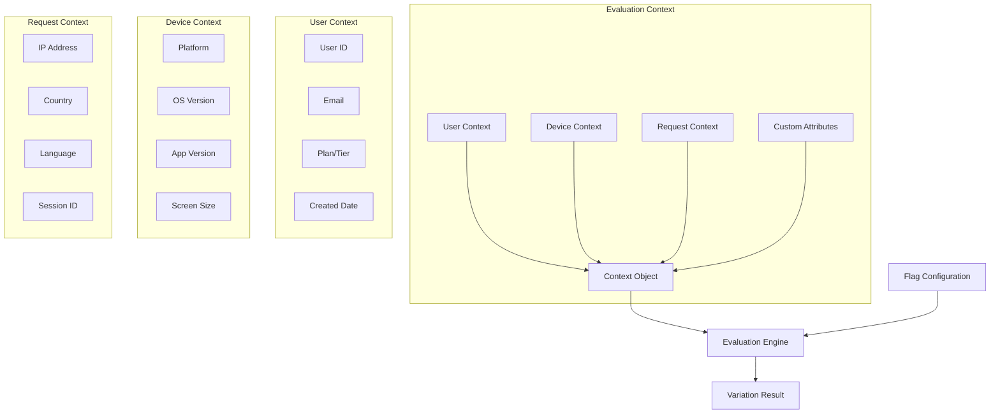
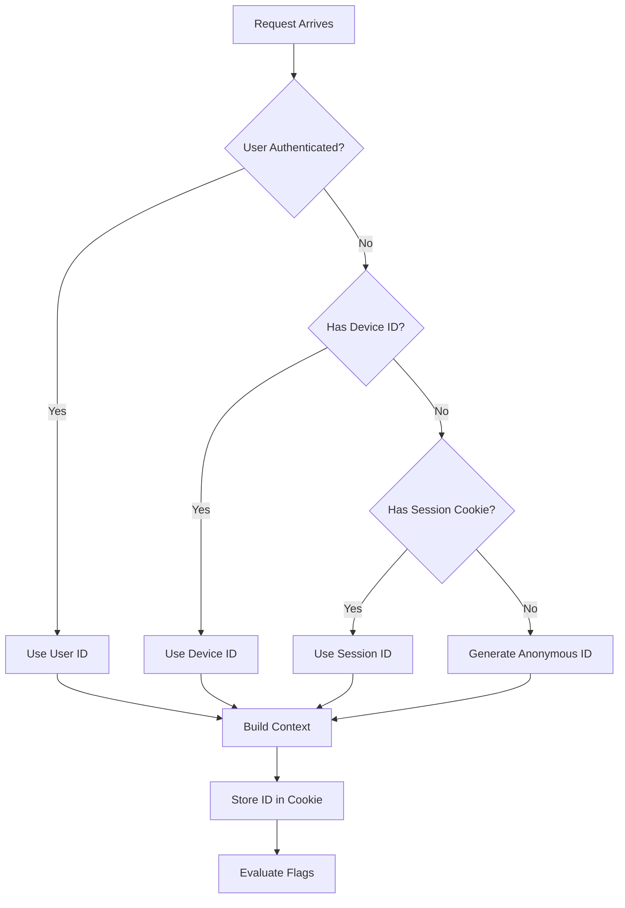
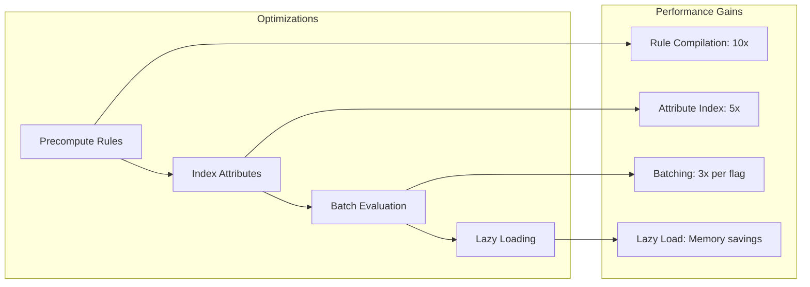

# How to Implement Context Evaluation

Author: [nawazdhandala](https://github.com/nawazdhandala)

Tags: Feature Flags, Context, Targeting, Evaluation

Description: Learn how to evaluate feature flags based on user and request context.

---

Context evaluation is the core mechanism that makes feature flags powerful. Instead of simple on/off switches, context-aware flags can serve different variations based on who is making the request, what device they use, where they are located, and dozens of other attributes. This guide walks through building a robust context evaluation system from scratch.

## Understanding Context in Feature Flags

Context is the collection of attributes that describe the current evaluation environment. It typically includes user information, device details, geographic data, and custom application attributes.



The evaluation engine takes this context and compares it against flag rules to determine which variation to serve. Getting the context structure right is fundamental to building flexible targeting rules.

## Context Data Structure

A well-designed context structure supports both built-in and custom attributes. Here is a TypeScript implementation that balances flexibility with type safety.

```typescript
// context.ts - Core context data structures

// Built-in user attributes with known types
interface UserContext {
  key: string;                    // Unique identifier (required)
  email?: string;
  name?: string;
  firstName?: string;
  lastName?: string;
  avatar?: string;
  country?: string;
  ip?: string;
  anonymous?: boolean;
  privateAttributes?: string[];   // Attributes to exclude from analytics
  custom?: Record<string, ContextValue>;  // Custom user attributes
}

// Device and application context
interface DeviceContext {
  key?: string;                   // Device identifier
  platform?: 'ios' | 'android' | 'web' | 'desktop';
  os?: string;
  osVersion?: string;
  appVersion?: string;
  manufacturer?: string;
  model?: string;
  screenWidth?: number;
  screenHeight?: number;
  custom?: Record<string, ContextValue>;
}

// Request-level context
interface RequestContext {
  requestId?: string;
  sessionId?: string;
  referrer?: string;
  url?: string;
  userAgent?: string;
  custom?: Record<string, ContextValue>;
}

// Supported context value types
type ContextValue =
  | string
  | number
  | boolean
  | Date
  | string[]
  | number[];

// The complete evaluation context
interface EvaluationContext {
  user: UserContext;
  device?: DeviceContext;
  request?: RequestContext;
  environment?: string;
  application?: string;
  custom?: Record<string, ContextValue>;
}

// Builder pattern for constructing context
class ContextBuilder {
  private context: EvaluationContext;

  constructor(userKey: string) {
    this.context = {
      user: { key: userKey }
    };
  }

  // User attributes
  withEmail(email: string): this {
    this.context.user.email = email;
    return this;
  }

  withCountry(country: string): this {
    this.context.user.country = country;
    return this;
  }

  withCustomUserAttribute(key: string, value: ContextValue): this {
    if (!this.context.user.custom) {
      this.context.user.custom = {};
    }
    this.context.user.custom[key] = value;
    return this;
  }

  // Device attributes
  withDevice(device: DeviceContext): this {
    this.context.device = device;
    return this;
  }

  withPlatform(platform: DeviceContext['platform']): this {
    if (!this.context.device) {
      this.context.device = {};
    }
    this.context.device.platform = platform;
    return this;
  }

  withAppVersion(version: string): this {
    if (!this.context.device) {
      this.context.device = {};
    }
    this.context.device.appVersion = version;
    return this;
  }

  // Request attributes
  withRequest(request: RequestContext): this {
    this.context.request = request;
    return this;
  }

  // Environment
  withEnvironment(env: string): this {
    this.context.environment = env;
    return this;
  }

  // Mark user as anonymous
  asAnonymous(): this {
    this.context.user.anonymous = true;
    return this;
  }

  // Private attributes (excluded from analytics)
  withPrivateAttributes(...attrs: string[]): this {
    this.context.user.privateAttributes = attrs;
    return this;
  }

  build(): EvaluationContext {
    return this.context;
  }
}

// Usage example
const context = new ContextBuilder('user_123')
  .withEmail('alice@example.com')
  .withCountry('US')
  .withCustomUserAttribute('plan', 'enterprise')
  .withCustomUserAttribute('teamSize', 50)
  .withPlatform('web')
  .withAppVersion('2.5.0')
  .withEnvironment('production')
  .build();
```

This structure separates concerns into logical groups while allowing arbitrary custom attributes. The builder pattern ensures contexts are constructed correctly.

## Evaluation Logic

The evaluation engine processes targeting rules against the context to determine the flag variation. Here is the core evaluation logic.

```python
# evaluator.py - Context-aware flag evaluation engine

import hashlib
import re
from dataclasses import dataclass, field
from typing import Any, Dict, List, Optional, Union
from enum import Enum
from datetime import datetime

class Operator(Enum):
    """Comparison operators for targeting rules."""
    EQUALS = "equals"
    NOT_EQUALS = "not_equals"
    CONTAINS = "contains"
    NOT_CONTAINS = "not_contains"
    STARTS_WITH = "starts_with"
    ENDS_WITH = "ends_with"
    MATCHES_REGEX = "matches_regex"
    IN_LIST = "in_list"
    NOT_IN_LIST = "not_in_list"
    GREATER_THAN = "greater_than"
    GREATER_THAN_OR_EQUAL = "greater_than_or_equal"
    LESS_THAN = "less_than"
    LESS_THAN_OR_EQUAL = "less_than_or_equal"
    SEMVER_EQUALS = "semver_equals"
    SEMVER_GREATER = "semver_greater"
    SEMVER_LESS = "semver_less"
    BEFORE = "before"  # Date comparison
    AFTER = "after"    # Date comparison

@dataclass
class Condition:
    """A single condition in a targeting rule."""
    attribute: str       # Dot notation path: "user.custom.plan"
    operator: Operator
    value: Any
    negate: bool = False

@dataclass
class TargetingRule:
    """A rule that matches contexts to variations."""
    id: str
    conditions: List[Condition]
    variation: str
    rollout_percentage: Optional[float] = None  # 0-100

@dataclass
class EvaluationResult:
    """The result of evaluating a flag."""
    flag_key: str
    variation: str
    value: Any
    reason: str
    rule_id: Optional[str] = None

class ContextEvaluator:
    """Evaluates feature flags against context."""

    def __init__(self):
        self._operator_handlers = {
            Operator.EQUALS: self._equals,
            Operator.NOT_EQUALS: self._not_equals,
            Operator.CONTAINS: self._contains,
            Operator.NOT_CONTAINS: self._not_contains,
            Operator.STARTS_WITH: self._starts_with,
            Operator.ENDS_WITH: self._ends_with,
            Operator.MATCHES_REGEX: self._matches_regex,
            Operator.IN_LIST: self._in_list,
            Operator.NOT_IN_LIST: self._not_in_list,
            Operator.GREATER_THAN: self._greater_than,
            Operator.GREATER_THAN_OR_EQUAL: self._greater_than_or_equal,
            Operator.LESS_THAN: self._less_than,
            Operator.LESS_THAN_OR_EQUAL: self._less_than_or_equal,
            Operator.SEMVER_EQUALS: self._semver_equals,
            Operator.SEMVER_GREATER: self._semver_greater,
            Operator.SEMVER_LESS: self._semver_less,
            Operator.BEFORE: self._before,
            Operator.AFTER: self._after,
        }

    def evaluate(
        self,
        flag: Dict,
        context: Dict,
        default_value: Any = None
    ) -> EvaluationResult:
        """Evaluate a flag for the given context."""

        flag_key = flag["key"]

        # Check if flag is enabled globally
        if not flag.get("enabled", True):
            return EvaluationResult(
                flag_key=flag_key,
                variation=flag["defaultVariation"],
                value=flag["variations"][flag["defaultVariation"]],
                reason="FLAG_DISABLED"
            )

        # Evaluate targeting rules in order
        for rule in flag.get("targetingRules", []):
            if self._matches_rule(rule, context):
                # Check rollout percentage if specified
                if rule.get("rollout_percentage") is not None:
                    if not self._in_rollout(
                        flag_key,
                        rule["id"],
                        context,
                        rule["rollout_percentage"]
                    ):
                        continue  # Try next rule

                return EvaluationResult(
                    flag_key=flag_key,
                    variation=rule["variation"],
                    value=flag["variations"][rule["variation"]],
                    reason="RULE_MATCH",
                    rule_id=rule["id"]
                )

        # Apply default rollout if configured
        if "rollout" in flag:
            variation = self._evaluate_rollout(flag, context)
            return EvaluationResult(
                flag_key=flag_key,
                variation=variation,
                value=flag["variations"][variation],
                reason="ROLLOUT"
            )

        # Return default
        default_var = flag.get("defaultVariation", "off")
        return EvaluationResult(
            flag_key=flag_key,
            variation=default_var,
            value=flag["variations"].get(default_var, default_value),
            reason="DEFAULT"
        )

    def _matches_rule(self, rule: Dict, context: Dict) -> bool:
        """Check if all conditions in a rule match."""
        for condition in rule.get("conditions", []):
            if not self._evaluate_condition(condition, context):
                return False
        return True

    def _evaluate_condition(
        self,
        condition: Dict,
        context: Dict
    ) -> bool:
        """Evaluate a single condition against context."""

        # Get the attribute value from context
        attr_value = self._get_attribute(condition["attribute"], context)

        # Handle missing attributes
        if attr_value is None:
            # Missing attribute never matches (except NOT_IN_LIST)
            if condition["operator"] == Operator.NOT_IN_LIST.value:
                return True
            return False

        # Get the operator handler
        operator = Operator(condition["operator"])
        handler = self._operator_handlers.get(operator)

        if not handler:
            return False

        result = handler(attr_value, condition["value"])

        # Apply negation if specified
        if condition.get("negate", False):
            result = not result

        return result

    def _get_attribute(
        self,
        path: str,
        context: Dict
    ) -> Optional[Any]:
        """Get nested attribute using dot notation."""

        parts = path.split(".")
        value = context

        for part in parts:
            if isinstance(value, dict):
                value = value.get(part)
            else:
                return None

            if value is None:
                return None

        return value

    # Operator implementations
    def _equals(self, attr: Any, target: Any) -> bool:
        return str(attr).lower() == str(target).lower()

    def _not_equals(self, attr: Any, target: Any) -> bool:
        return not self._equals(attr, target)

    def _contains(self, attr: Any, target: Any) -> bool:
        return str(target).lower() in str(attr).lower()

    def _not_contains(self, attr: Any, target: Any) -> bool:
        return not self._contains(attr, target)

    def _starts_with(self, attr: Any, target: Any) -> bool:
        return str(attr).lower().startswith(str(target).lower())

    def _ends_with(self, attr: Any, target: Any) -> bool:
        return str(attr).lower().endswith(str(target).lower())

    def _matches_regex(self, attr: Any, pattern: str) -> bool:
        try:
            return bool(re.match(pattern, str(attr)))
        except re.error:
            return False

    def _in_list(self, attr: Any, targets: List) -> bool:
        return attr in targets or str(attr) in [str(t) for t in targets]

    def _not_in_list(self, attr: Any, targets: List) -> bool:
        return not self._in_list(attr, targets)

    def _greater_than(self, attr: Any, target: Any) -> bool:
        try:
            return float(attr) > float(target)
        except (ValueError, TypeError):
            return False

    def _greater_than_or_equal(self, attr: Any, target: Any) -> bool:
        try:
            return float(attr) >= float(target)
        except (ValueError, TypeError):
            return False

    def _less_than(self, attr: Any, target: Any) -> bool:
        try:
            return float(attr) < float(target)
        except (ValueError, TypeError):
            return False

    def _less_than_or_equal(self, attr: Any, target: Any) -> bool:
        try:
            return float(attr) <= float(target)
        except (ValueError, TypeError):
            return False

    def _parse_semver(self, version: str) -> tuple:
        """Parse semantic version string."""
        parts = str(version).split(".")
        return tuple(int(p) for p in parts[:3])

    def _semver_equals(self, attr: Any, target: Any) -> bool:
        try:
            return self._parse_semver(attr) == self._parse_semver(target)
        except (ValueError, TypeError):
            return False

    def _semver_greater(self, attr: Any, target: Any) -> bool:
        try:
            return self._parse_semver(attr) > self._parse_semver(target)
        except (ValueError, TypeError):
            return False

    def _semver_less(self, attr: Any, target: Any) -> bool:
        try:
            return self._parse_semver(attr) < self._parse_semver(target)
        except (ValueError, TypeError):
            return False

    def _before(self, attr: Any, target: Any) -> bool:
        try:
            attr_date = datetime.fromisoformat(str(attr))
            target_date = datetime.fromisoformat(str(target))
            return attr_date < target_date
        except (ValueError, TypeError):
            return False

    def _after(self, attr: Any, target: Any) -> bool:
        try:
            attr_date = datetime.fromisoformat(str(attr))
            target_date = datetime.fromisoformat(str(target))
            return attr_date > target_date
        except (ValueError, TypeError):
            return False

    def _in_rollout(
        self,
        flag_key: str,
        rule_id: str,
        context: Dict,
        percentage: float
    ) -> bool:
        """Check if context falls within rollout percentage."""
        bucket_key = self._get_bucket_key(context)
        bucket = self._get_bucket(f"{flag_key}:{rule_id}", bucket_key)
        return bucket < percentage

    def _evaluate_rollout(self, flag: Dict, context: Dict) -> str:
        """Determine variation based on percentage rollout."""
        rollout = flag["rollout"]
        bucket_key = self._get_bucket_key(context)
        bucket = self._get_bucket(flag["key"], bucket_key)

        cumulative = 0.0
        for dist in rollout.get("distribution", []):
            cumulative += dist["weight"]
            if bucket < cumulative:
                return dist["variation"]

        return rollout["distribution"][-1]["variation"]

    def _get_bucket_key(self, context: Dict) -> str:
        """Get the key to use for bucket assignment."""
        # Prefer user key, fall back to device key or session
        return (
            context.get("user", {}).get("key") or
            context.get("device", {}).get("key") or
            context.get("request", {}).get("sessionId") or
            "anonymous"
        )

    def _get_bucket(self, salt: str, key: str) -> float:
        """Generate a consistent bucket number 0-100."""
        hash_input = f"{salt}:{key}"
        hash_bytes = hashlib.sha256(hash_input.encode()).digest()
        hash_int = int.from_bytes(hash_bytes[:4], "big")
        return (hash_int / 0xFFFFFFFF) * 100
```

This evaluation engine supports a comprehensive set of operators and handles edge cases like missing attributes, type coercion, and semantic versioning.

## Custom Attributes

Custom attributes extend the context with application-specific data. Here is how to design a flexible custom attribute system.

```typescript
// custom-attributes.ts - Handling custom attributes

import { z } from 'zod';

// Schema for validating custom attribute values
const ContextValueSchema = z.union([
  z.string(),
  z.number(),
  z.boolean(),
  z.date(),
  z.array(z.string()),
  z.array(z.number()),
]);

type ContextValue = z.infer<typeof ContextValueSchema>;

// Custom attribute definition with metadata
interface CustomAttributeDefinition {
  key: string;
  name: string;
  description: string;
  type: 'string' | 'number' | 'boolean' | 'date' | 'string[]' | 'number[]';
  examples?: ContextValue[];
  validValues?: ContextValue[];  // For enum-like attributes
}

// Registry of known custom attributes
class CustomAttributeRegistry {
  private attributes: Map<string, CustomAttributeDefinition> = new Map();

  register(definition: CustomAttributeDefinition): void {
    this.attributes.set(definition.key, definition);
  }

  get(key: string): CustomAttributeDefinition | undefined {
    return this.attributes.get(key);
  }

  validate(key: string, value: ContextValue): boolean {
    const definition = this.attributes.get(key);

    if (!definition) {
      // Allow unknown attributes but log warning
      console.warn(`Unknown custom attribute: ${key}`);
      return true;
    }

    // Type validation
    const typeValid = this.validateType(value, definition.type);
    if (!typeValid) {
      return false;
    }

    // Valid values check (if defined)
    if (definition.validValues && definition.validValues.length > 0) {
      return definition.validValues.includes(value);
    }

    return true;
  }

  private validateType(value: ContextValue, type: string): boolean {
    switch (type) {
      case 'string':
        return typeof value === 'string';
      case 'number':
        return typeof value === 'number';
      case 'boolean':
        return typeof value === 'boolean';
      case 'date':
        return value instanceof Date || !isNaN(Date.parse(String(value)));
      case 'string[]':
        return Array.isArray(value) && value.every(v => typeof v === 'string');
      case 'number[]':
        return Array.isArray(value) && value.every(v => typeof v === 'number');
      default:
        return false;
    }
  }

  listAll(): CustomAttributeDefinition[] {
    return Array.from(this.attributes.values());
  }
}

// Initialize registry with common attributes
const registry = new CustomAttributeRegistry();

registry.register({
  key: 'plan',
  name: 'Subscription Plan',
  description: 'User subscription tier',
  type: 'string',
  validValues: ['free', 'starter', 'pro', 'enterprise'],
});

registry.register({
  key: 'teamSize',
  name: 'Team Size',
  description: 'Number of users in the team',
  type: 'number',
  examples: [1, 5, 10, 50, 100],
});

registry.register({
  key: 'betaFeatures',
  name: 'Beta Features',
  description: 'List of beta features user has access to',
  type: 'string[]',
  examples: [['dark-mode', 'new-editor'], ['ai-assist']],
});

registry.register({
  key: 'signupDate',
  name: 'Signup Date',
  description: 'When the user created their account',
  type: 'date',
});

// Helper to merge custom attributes into context
function enrichContext(
  baseContext: EvaluationContext,
  customAttributes: Record<string, ContextValue>
): EvaluationContext {
  // Validate all custom attributes
  for (const [key, value] of Object.entries(customAttributes)) {
    if (!registry.validate(key, value)) {
      console.error(`Invalid custom attribute: ${key} = ${value}`);
      delete customAttributes[key];
    }
  }

  return {
    ...baseContext,
    user: {
      ...baseContext.user,
      custom: {
        ...baseContext.user.custom,
        ...customAttributes,
      },
    },
  };
}

// Usage example
const context = enrichContext(
  { user: { key: 'user_123' } },
  {
    plan: 'enterprise',
    teamSize: 50,
    betaFeatures: ['dark-mode', 'new-editor'],
    signupDate: new Date('2024-01-15'),
  }
);
```

Custom attributes allow targeting based on business-specific data like subscription plans, feature entitlements, or user behavior metrics.

## Anonymous Context Handling

Not all users are logged in. Anonymous context handling ensures feature flags work correctly for unauthenticated visitors.



Here is a robust implementation for handling anonymous users.

```typescript
// anonymous-context.ts - Handling anonymous users

import { v4 as uuidv4 } from 'uuid';
import Cookies from 'js-cookie';

const ANONYMOUS_ID_COOKIE = 'ff_anonymous_id';
const ANONYMOUS_ID_TTL_DAYS = 365;

interface AnonymousContext {
  key: string;
  anonymous: true;
  device?: {
    key: string;
    fingerprint?: string;
  };
  session?: {
    id: string;
    startedAt: Date;
  };
}

class AnonymousContextManager {
  private storage: Storage | null;

  constructor() {
    // Check if localStorage is available
    try {
      this.storage = typeof window !== 'undefined' ? window.localStorage : null;
    } catch {
      this.storage = null;
    }
  }

  /**
   * Get or create a stable anonymous identifier.
   * Persists across sessions using cookies and localStorage.
   */
  getAnonymousId(): string {
    // Try cookie first (works across subdomains)
    let id = Cookies.get(ANONYMOUS_ID_COOKIE);

    if (id) {
      return id;
    }

    // Try localStorage as backup
    if (this.storage) {
      id = this.storage.getItem(ANONYMOUS_ID_COOKIE);
      if (id) {
        // Sync to cookie
        this.persistId(id);
        return id;
      }
    }

    // Generate new ID
    id = this.generateAnonymousId();
    this.persistId(id);

    return id;
  }

  /**
   * Generate a new anonymous identifier.
   * Uses UUID v4 with optional prefix for debugging.
   */
  private generateAnonymousId(): string {
    return `anon_${uuidv4()}`;
  }

  /**
   * Persist anonymous ID to cookie and localStorage.
   */
  private persistId(id: string): void {
    // Set cookie
    Cookies.set(ANONYMOUS_ID_COOKIE, id, {
      expires: ANONYMOUS_ID_TTL_DAYS,
      sameSite: 'Lax',
      secure: window.location.protocol === 'https:',
    });

    // Set localStorage as backup
    if (this.storage) {
      this.storage.setItem(ANONYMOUS_ID_COOKIE, id);
    }
  }

  /**
   * Build complete anonymous context.
   */
  buildAnonymousContext(): AnonymousContext {
    const anonymousId = this.getAnonymousId();

    return {
      key: anonymousId,
      anonymous: true,
      device: {
        key: this.getDeviceId(),
        fingerprint: this.getDeviceFingerprint(),
      },
      session: {
        id: this.getSessionId(),
        startedAt: new Date(),
      },
    };
  }

  /**
   * Get or generate device identifier.
   * More stable than session but less than user ID.
   */
  private getDeviceId(): string {
    const key = 'ff_device_id';

    if (this.storage) {
      let deviceId = this.storage.getItem(key);
      if (!deviceId) {
        deviceId = `device_${uuidv4()}`;
        this.storage.setItem(key, deviceId);
      }
      return deviceId;
    }

    return this.getAnonymousId();  // Fallback
  }

  /**
   * Generate a basic device fingerprint.
   * Note: This is not foolproof but helps with consistency.
   */
  private getDeviceFingerprint(): string {
    if (typeof window === 'undefined') {
      return 'server';
    }

    const components = [
      navigator.userAgent,
      navigator.language,
      screen.width,
      screen.height,
      screen.colorDepth,
      new Date().getTimezoneOffset(),
    ];

    // Simple hash of components
    const str = components.join('|');
    let hash = 0;
    for (let i = 0; i < str.length; i++) {
      const char = str.charCodeAt(i);
      hash = ((hash << 5) - hash) + char;
      hash = hash & hash;
    }

    return `fp_${Math.abs(hash).toString(36)}`;
  }

  /**
   * Get session identifier.
   * Resets when browser is closed.
   */
  private getSessionId(): string {
    const key = 'ff_session_id';

    try {
      let sessionId = sessionStorage.getItem(key);
      if (!sessionId) {
        sessionId = `session_${uuidv4()}`;
        sessionStorage.setItem(key, sessionId);
      }
      return sessionId;
    } catch {
      return `session_${Date.now()}`;
    }
  }

  /**
   * Convert anonymous context to authenticated.
   * Called when user logs in.
   */
  promoteToAuthenticated(
    anonymousContext: AnonymousContext,
    userId: string
  ): void {
    // Track the conversion for analytics
    console.log(
      `Promoting anonymous user ${anonymousContext.key} to ${userId}`
    );

    // Optionally link the anonymous history to the user
    // This allows carrying over experiment assignments
  }

  /**
   * Clear anonymous identifiers.
   * Called when user explicitly opts out.
   */
  clear(): void {
    Cookies.remove(ANONYMOUS_ID_COOKIE);
    if (this.storage) {
      this.storage.removeItem(ANONYMOUS_ID_COOKIE);
      this.storage.removeItem('ff_device_id');
    }
    try {
      sessionStorage.removeItem('ff_session_id');
    } catch {
      // Ignore
    }
  }
}

// Server-side anonymous context handling
class ServerAnonymousContext {
  /**
   * Extract or generate anonymous ID from request.
   */
  static fromRequest(req: {
    cookies: Record<string, string>;
    headers: Record<string, string>;
    ip?: string;
  }): AnonymousContext {
    // Try to get existing anonymous ID from cookie
    let anonymousId = req.cookies[ANONYMOUS_ID_COOKIE];

    if (!anonymousId) {
      // Generate new ID
      anonymousId = `anon_${uuidv4()}`;
    }

    return {
      key: anonymousId,
      anonymous: true,
      device: {
        key: this.extractDeviceKey(req.headers['user-agent'] || ''),
      },
      session: {
        id: req.cookies['session_id'] || `session_${Date.now()}`,
        startedAt: new Date(),
      },
    };
  }

  /**
   * Set anonymous ID cookie in response.
   */
  static setResponseCookie(
    res: { setHeader: (name: string, value: string) => void },
    anonymousId: string
  ): void {
    const maxAge = ANONYMOUS_ID_TTL_DAYS * 24 * 60 * 60;
    res.setHeader(
      'Set-Cookie',
      `${ANONYMOUS_ID_COOKIE}=${anonymousId}; Max-Age=${maxAge}; Path=/; SameSite=Lax; Secure`
    );
  }

  private static extractDeviceKey(userAgent: string): string {
    // Simple hash of user agent for device grouping
    let hash = 0;
    for (let i = 0; i < userAgent.length; i++) {
      const char = userAgent.charCodeAt(i);
      hash = ((hash << 5) - hash) + char;
      hash = hash & hash;
    }
    return `device_${Math.abs(hash).toString(36)}`;
  }
}

export {
  AnonymousContextManager,
  ServerAnonymousContext,
  AnonymousContext,
};
```

This implementation ensures anonymous users get consistent flag evaluations across page views and sessions while respecting privacy by not requiring user identification.

## Context Caching

Evaluating flags against complex rules for every request is expensive. Caching context evaluations improves performance significantly.

```python
# context_cache.py - Caching layer for context evaluations

import hashlib
import json
import time
from typing import Any, Dict, Optional, Tuple
from dataclasses import dataclass
from functools import lru_cache
import redis

@dataclass
class CacheConfig:
    """Configuration for context caching."""
    enabled: bool = True
    ttl_seconds: int = 60           # How long to cache evaluations
    max_memory_items: int = 10000   # Max items in memory cache
    redis_url: Optional[str] = None # Redis URL for distributed cache

class ContextCache:
    """Multi-layer cache for flag evaluations."""

    def __init__(self, config: CacheConfig):
        self.config = config
        self._memory_cache: Dict[str, Tuple[Any, float]] = {}
        self._redis: Optional[redis.Redis] = None

        if config.redis_url:
            self._redis = redis.from_url(config.redis_url)

    def _compute_cache_key(
        self,
        flag_key: str,
        context: Dict,
        flag_version: str
    ) -> str:
        """Generate a deterministic cache key from flag and context."""

        # Extract only the attributes that affect evaluation
        relevant_context = self._extract_relevant_context(context)

        # Create stable JSON representation
        context_str = json.dumps(relevant_context, sort_keys=True)

        # Hash for shorter key
        context_hash = hashlib.sha256(context_str.encode()).hexdigest()[:16]

        return f"ff:{flag_key}:{flag_version}:{context_hash}"

    def _extract_relevant_context(self, context: Dict) -> Dict:
        """Extract only attributes that affect flag evaluation."""

        relevant = {}

        # User attributes (excluding private ones)
        if "user" in context:
            user = context["user"]
            private_attrs = set(user.get("privateAttributes", []))

            relevant["user"] = {
                k: v for k, v in user.items()
                if k not in private_attrs and k != "privateAttributes"
            }

        # Include other context sections
        for key in ["device", "environment", "custom"]:
            if key in context:
                relevant[key] = context[key]

        return relevant

    def get(
        self,
        flag_key: str,
        context: Dict,
        flag_version: str
    ) -> Optional[Any]:
        """Get cached evaluation result."""

        if not self.config.enabled:
            return None

        cache_key = self._compute_cache_key(flag_key, context, flag_version)

        # Try memory cache first
        if cache_key in self._memory_cache:
            value, expiry = self._memory_cache[cache_key]
            if time.time() < expiry:
                return value
            else:
                del self._memory_cache[cache_key]

        # Try Redis cache
        if self._redis:
            try:
                cached = self._redis.get(cache_key)
                if cached:
                    result = json.loads(cached)
                    # Populate memory cache
                    self._set_memory(cache_key, result)
                    return result
            except redis.RedisError:
                pass  # Fall through to evaluation

        return None

    def set(
        self,
        flag_key: str,
        context: Dict,
        flag_version: str,
        result: Any
    ) -> None:
        """Cache an evaluation result."""

        if not self.config.enabled:
            return

        cache_key = self._compute_cache_key(flag_key, context, flag_version)

        # Set in memory cache
        self._set_memory(cache_key, result)

        # Set in Redis cache
        if self._redis:
            try:
                self._redis.setex(
                    cache_key,
                    self.config.ttl_seconds,
                    json.dumps(result)
                )
            except redis.RedisError:
                pass  # Memory cache is still set

    def _set_memory(self, key: str, value: Any) -> None:
        """Set value in memory cache with eviction."""

        # Simple eviction when cache is full
        if len(self._memory_cache) >= self.config.max_memory_items:
            # Remove oldest 10% of entries
            sorted_keys = sorted(
                self._memory_cache.keys(),
                key=lambda k: self._memory_cache[k][1]
            )
            for k in sorted_keys[:len(sorted_keys) // 10]:
                del self._memory_cache[k]

        expiry = time.time() + self.config.ttl_seconds
        self._memory_cache[key] = (value, expiry)

    def invalidate(self, flag_key: str) -> None:
        """Invalidate all cached evaluations for a flag."""

        # Clear from memory cache
        prefix = f"ff:{flag_key}:"
        keys_to_delete = [
            k for k in self._memory_cache.keys()
            if k.startswith(prefix)
        ]
        for key in keys_to_delete:
            del self._memory_cache[key]

        # Clear from Redis using SCAN to avoid blocking
        if self._redis:
            try:
                cursor = 0
                while True:
                    cursor, keys = self._redis.scan(
                        cursor,
                        match=f"{prefix}*",
                        count=100
                    )
                    if keys:
                        self._redis.delete(*keys)
                    if cursor == 0:
                        break
            except redis.RedisError:
                pass

    def clear(self) -> None:
        """Clear all cached evaluations."""
        self._memory_cache.clear()
        if self._redis:
            try:
                # Use SCAN to find and delete all flag cache keys
                cursor = 0
                while True:
                    cursor, keys = self._redis.scan(
                        cursor,
                        match="ff:*",
                        count=100
                    )
                    if keys:
                        self._redis.delete(*keys)
                    if cursor == 0:
                        break
            except redis.RedisError:
                pass

    def stats(self) -> Dict[str, Any]:
        """Get cache statistics."""
        return {
            "memory_items": len(self._memory_cache),
            "memory_max": self.config.max_memory_items,
            "ttl_seconds": self.config.ttl_seconds,
            "redis_connected": self._redis is not None,
        }


# Cached evaluator wrapper
class CachedEvaluator:
    """Wraps evaluator with caching layer."""

    def __init__(self, evaluator, cache: ContextCache):
        self.evaluator = evaluator
        self.cache = cache

    def evaluate(
        self,
        flag: Dict,
        context: Dict,
        default_value: Any = None
    ) -> Any:
        """Evaluate with caching."""

        flag_key = flag["key"]
        flag_version = flag.get("version", "1")

        # Try cache
        cached = self.cache.get(flag_key, context, flag_version)
        if cached is not None:
            return cached

        # Evaluate
        result = self.evaluator.evaluate(flag, context, default_value)

        # Cache result
        self.cache.set(flag_key, context, flag_version, result)

        return result
```

This caching implementation uses a two-tier approach with memory cache for hot data and Redis for distributed caching across multiple server instances.

## Performance Optimization

Beyond caching, several optimizations ensure flag evaluation stays fast even with complex targeting rules.



Here is an optimized evaluator implementation.

```typescript
// optimized-evaluator.ts - Performance-optimized flag evaluation

interface CompiledCondition {
  attributePath: string[];
  operator: string;
  value: any;
  matcher: (attrValue: any) => boolean;
}

interface CompiledRule {
  id: string;
  conditions: CompiledCondition[];
  variation: string;
  rolloutPercentage?: number;
}

interface CompiledFlag {
  key: string;
  version: string;
  enabled: boolean;
  rules: CompiledRule[];
  defaultVariation: string;
  variations: Record<string, any>;
  requiredAttributes: Set<string>;
}

class OptimizedEvaluator {
  private compiledFlags: Map<string, CompiledFlag> = new Map();
  private attributeIndex: Map<string, Set<string>> = new Map();

  /**
   * Compile flags for faster evaluation.
   * Call this when flags are loaded or updated.
   */
  compileFlags(flags: any[]): void {
    this.compiledFlags.clear();
    this.attributeIndex.clear();

    for (const flag of flags) {
      const compiled = this.compileFlag(flag);
      this.compiledFlags.set(flag.key, compiled);

      // Build attribute index
      for (const attr of compiled.requiredAttributes) {
        if (!this.attributeIndex.has(attr)) {
          this.attributeIndex.set(attr, new Set());
        }
        this.attributeIndex.get(attr)!.add(flag.key);
      }
    }
  }

  private compileFlag(flag: any): CompiledFlag {
    const requiredAttributes = new Set<string>();
    const rules: CompiledRule[] = [];

    for (const rule of flag.targetingRules || []) {
      const compiledConditions: CompiledCondition[] = [];

      for (const condition of rule.conditions || []) {
        const attributePath = condition.attribute.split('.');
        requiredAttributes.add(condition.attribute);

        compiledConditions.push({
          attributePath,
          operator: condition.operator,
          value: condition.value,
          matcher: this.compileMatcher(condition.operator, condition.value),
        });
      }

      rules.push({
        id: rule.id,
        conditions: compiledConditions,
        variation: rule.variation,
        rolloutPercentage: rule.rolloutPercentage,
      });
    }

    return {
      key: flag.key,
      version: flag.version || '1',
      enabled: flag.enabled !== false,
      rules,
      defaultVariation: flag.defaultVariation,
      variations: flag.variations,
      requiredAttributes,
    };
  }

  /**
   * Pre-compile matcher functions for each operator.
   * Avoids switch statements during evaluation.
   */
  private compileMatcher(
    operator: string,
    targetValue: any
  ): (attrValue: any) => boolean {
    switch (operator) {
      case 'equals':
        return (v) => String(v).toLowerCase() === String(targetValue).toLowerCase();

      case 'not_equals':
        return (v) => String(v).toLowerCase() !== String(targetValue).toLowerCase();

      case 'contains':
        const lowerTarget = String(targetValue).toLowerCase();
        return (v) => String(v).toLowerCase().includes(lowerTarget);

      case 'in_list':
        const valueSet = new Set(
          Array.isArray(targetValue)
            ? targetValue.map(v => String(v).toLowerCase())
            : [String(targetValue).toLowerCase()]
        );
        return (v) => valueSet.has(String(v).toLowerCase());

      case 'greater_than':
        const numTarget = Number(targetValue);
        return (v) => Number(v) > numTarget;

      case 'less_than':
        const numTarget2 = Number(targetValue);
        return (v) => Number(v) < numTarget2;

      case 'matches_regex':
        const regex = new RegExp(targetValue);
        return (v) => regex.test(String(v));

      case 'semver_greater':
        const targetParts = this.parseSemver(targetValue);
        return (v) => {
          const parts = this.parseSemver(v);
          return this.compareSemver(parts, targetParts) > 0;
        };

      default:
        return () => false;
    }
  }

  private parseSemver(version: any): number[] {
    return String(version).split('.').map(p => parseInt(p, 10) || 0);
  }

  private compareSemver(a: number[], b: number[]): number {
    for (let i = 0; i < 3; i++) {
      if ((a[i] || 0) > (b[i] || 0)) return 1;
      if ((a[i] || 0) < (b[i] || 0)) return -1;
    }
    return 0;
  }

  /**
   * Evaluate a single flag efficiently.
   */
  evaluate(flagKey: string, context: any): any {
    const flag = this.compiledFlags.get(flagKey);

    if (!flag) {
      return { variation: 'default', value: null, reason: 'FLAG_NOT_FOUND' };
    }

    if (!flag.enabled) {
      return {
        variation: flag.defaultVariation,
        value: flag.variations[flag.defaultVariation],
        reason: 'FLAG_DISABLED',
      };
    }

    // Evaluate rules
    for (const rule of flag.rules) {
      if (this.matchesRule(rule, context)) {
        // Check rollout if specified
        if (rule.rolloutPercentage !== undefined) {
          if (!this.inRollout(flagKey, rule.id, context, rule.rolloutPercentage)) {
            continue;
          }
        }

        return {
          variation: rule.variation,
          value: flag.variations[rule.variation],
          reason: 'RULE_MATCH',
          ruleId: rule.id,
        };
      }
    }

    return {
      variation: flag.defaultVariation,
      value: flag.variations[flag.defaultVariation],
      reason: 'DEFAULT',
    };
  }

  private matchesRule(rule: CompiledRule, context: any): boolean {
    for (const condition of rule.conditions) {
      const attrValue = this.getAttributeFast(condition.attributePath, context);

      if (attrValue === undefined) {
        return false;
      }

      if (!condition.matcher(attrValue)) {
        return false;
      }
    }

    return true;
  }

  /**
   * Fast attribute access using pre-split path.
   */
  private getAttributeFast(path: string[], context: any): any {
    let value = context;

    for (const part of path) {
      if (value === null || value === undefined) {
        return undefined;
      }
      value = value[part];
    }

    return value;
  }

  private inRollout(
    flagKey: string,
    ruleId: string,
    context: any,
    percentage: number
  ): boolean {
    const key = context.user?.key || context.device?.key || 'anonymous';
    const bucket = this.getBucket(`${flagKey}:${ruleId}`, key);
    return bucket < percentage;
  }

  private getBucket(salt: string, key: string): number {
    // Simple hash for bucketing
    const str = `${salt}:${key}`;
    let hash = 0;
    for (let i = 0; i < str.length; i++) {
      const char = str.charCodeAt(i);
      hash = ((hash << 5) - hash) + char;
      hash = hash | 0;
    }
    return Math.abs(hash % 100);
  }

  /**
   * Batch evaluate multiple flags for the same context.
   * More efficient than evaluating one at a time.
   */
  evaluateBatch(
    flagKeys: string[],
    context: any
  ): Map<string, any> {
    const results = new Map<string, any>();

    for (const flagKey of flagKeys) {
      results.set(flagKey, this.evaluate(flagKey, context));
    }

    return results;
  }

  /**
   * Find which flags might be affected by a context change.
   * Useful for optimizing re-evaluation.
   */
  getFlagsAffectedByAttribute(attribute: string): string[] {
    return Array.from(this.attributeIndex.get(attribute) || []);
  }
}

export { OptimizedEvaluator };
```

Key optimizations in this implementation include pre-compiling matcher functions to avoid runtime switch statements, splitting attribute paths once during compilation, using Sets for fast list membership checks, and maintaining an attribute index for targeted re-evaluation.

## Integration Example

Here is a complete example showing how all these pieces work together in a real application.

```typescript
// app.ts - Complete integration example

import express from 'express';
import { OptimizedEvaluator } from './optimized-evaluator';
import { AnonymousContextManager, ServerAnonymousContext } from './anonymous-context';
import { ContextCache, CacheConfig } from './context-cache';
import { ContextBuilder } from './context';

const app = express();

// Initialize components
const evaluator = new OptimizedEvaluator();
const cache = new ContextCache({
  enabled: true,
  ttl_seconds: 60,
  redis_url: process.env.REDIS_URL,
});

// Load and compile flags (in production, fetch from flag service)
const flags = [
  {
    key: 'new_checkout',
    version: '3',
    enabled: true,
    variations: {
      on: true,
      off: false,
    },
    defaultVariation: 'off',
    targetingRules: [
      {
        id: 'enterprise-users',
        conditions: [
          { attribute: 'user.custom.plan', operator: 'equals', value: 'enterprise' },
        ],
        variation: 'on',
      },
      {
        id: 'beta-testers',
        conditions: [
          { attribute: 'user.custom.betaTester', operator: 'equals', value: true },
        ],
        variation: 'on',
      },
      {
        id: 'gradual-rollout',
        conditions: [],
        variation: 'on',
        rolloutPercentage: 25,
      },
    ],
  },
  {
    key: 'pricing_experiment',
    version: '1',
    enabled: true,
    variations: {
      control: { price: 9.99, label: 'Standard' },
      variant_a: { price: 7.99, label: 'Discounted' },
      variant_b: { price: 12.99, label: 'Premium' },
    },
    defaultVariation: 'control',
    rollout: {
      distribution: [
        { variation: 'control', weight: 50 },
        { variation: 'variant_a', weight: 25 },
        { variation: 'variant_b', weight: 25 },
      ],
    },
  },
];

evaluator.compileFlags(flags);

// Middleware to build context from request
app.use((req, res, next) => {
  // Get or create user context
  if (req.headers['x-user-id']) {
    // Authenticated user
    req.flagContext = new ContextBuilder(req.headers['x-user-id'] as string)
      .withEmail(req.headers['x-user-email'] as string)
      .withCustomUserAttribute('plan', req.headers['x-user-plan'] || 'free')
      .withCustomUserAttribute('betaTester', req.headers['x-beta-tester'] === 'true')
      .withPlatform(detectPlatform(req.headers['user-agent']))
      .withAppVersion(req.headers['x-app-version'] as string)
      .withEnvironment(process.env.NODE_ENV || 'development')
      .build();
  } else {
    // Anonymous user
    const anonContext = ServerAnonymousContext.fromRequest({
      cookies: req.cookies || {},
      headers: req.headers as Record<string, string>,
      ip: req.ip,
    });

    req.flagContext = {
      user: anonContext,
      device: anonContext.device,
      environment: process.env.NODE_ENV || 'development',
    };

    // Set cookie for anonymous tracking
    ServerAnonymousContext.setResponseCookie(res, anonContext.key);
  }

  next();
});

function detectPlatform(userAgent?: string): 'ios' | 'android' | 'web' | 'desktop' {
  if (!userAgent) return 'web';
  if (/iPhone|iPad|iPod/i.test(userAgent)) return 'ios';
  if (/Android/i.test(userAgent)) return 'android';
  if (/Electron/i.test(userAgent)) return 'desktop';
  return 'web';
}

// Helper to evaluate flags with caching
function evaluateFlag(flagKey: string, context: any): any {
  const flag = flags.find(f => f.key === flagKey);
  if (!flag) {
    return { variation: 'default', value: null, reason: 'FLAG_NOT_FOUND' };
  }

  // Check cache
  const cached = cache.get(flagKey, context, flag.version);
  if (cached) {
    return cached;
  }

  // Evaluate
  const result = evaluator.evaluate(flagKey, context);

  // Cache result
  cache.set(flagKey, context, flag.version, result);

  return result;
}

// API endpoint using feature flags
app.get('/api/checkout', (req, res) => {
  const newCheckout = evaluateFlag('new_checkout', req.flagContext);

  if (newCheckout.value === true) {
    res.json({
      version: 'v2',
      features: ['instant-checkout', 'saved-cards', 'one-click-buy'],
    });
  } else {
    res.json({
      version: 'v1',
      features: ['standard-checkout'],
    });
  }
});

// Pricing endpoint with A/B test
app.get('/api/pricing', (req, res) => {
  const experiment = evaluateFlag('pricing_experiment', req.flagContext);

  res.json({
    variation: experiment.variation,
    price: experiment.value.price,
    label: experiment.value.label,
  });
});

// Endpoint to get all flag values for client
app.get('/api/flags', (req, res) => {
  const flagKeys = ['new_checkout', 'pricing_experiment'];
  const results = evaluator.evaluateBatch(flagKeys, req.flagContext);

  const response: Record<string, any> = {};
  for (const [key, result] of results) {
    response[key] = {
      variation: result.variation,
      value: result.value,
    };
  }

  res.json(response);
});

// Start server
app.listen(3000, () => {
  console.log('Server running on port 3000');
});
```

This example demonstrates building context from HTTP request data, handling both authenticated and anonymous users, caching evaluation results, batch evaluation for multiple flags, and serving different variations based on context.

Context evaluation transforms feature flags from simple toggles into powerful targeting tools. By carefully designing your context structure, implementing efficient evaluation logic, handling anonymous users properly, and optimizing for performance, you can build a feature flag system that scales with your application and enables sophisticated release strategies.
