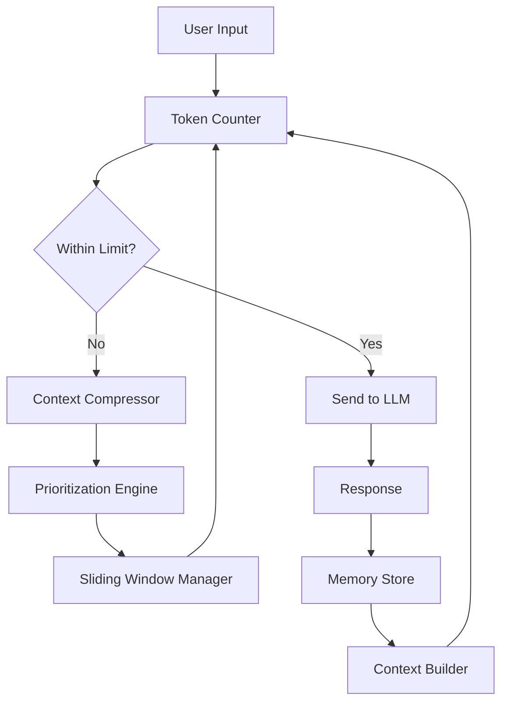
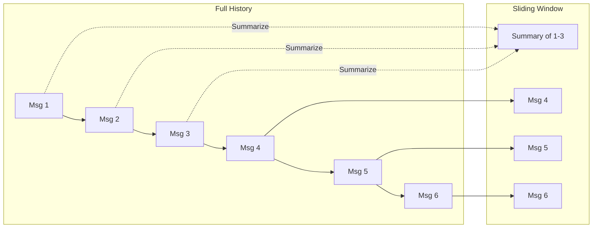
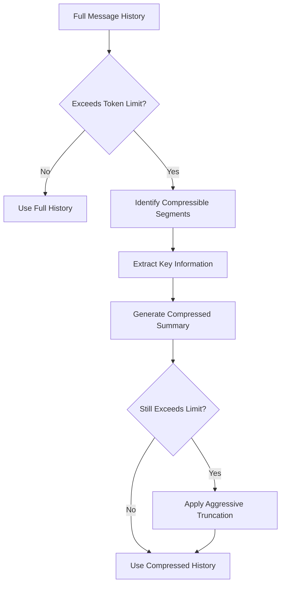

# How to Create Context Window Management

Author: [nawazdhandala](https://github.com/nawazdhandala)

Tags: LLM, RAG, AI, NLP

Description: A practical guide to building effective context window management systems for LLM applications, covering chunking strategies, sliding windows, and memory architectures that maximize token efficiency while preserving conversation coherence.

---

Large Language Models have finite context windows. Whether you are working with 8K, 32K, or 128K tokens, you will eventually hit the ceiling. When that happens, your application either crashes, loses important context, or produces incoherent responses. This guide shows you how to build robust context window management that keeps your LLM applications running smoothly.

## Why Context Window Management Matters

Every LLM has a maximum number of tokens it can process in a single request. This includes both your input (system prompt, conversation history, user query) and the generated output. Once you exceed this limit, you have three options:

1. **Truncate blindly** and lose important information
2. **Fail the request** and frustrate your users
3. **Manage context intelligently** and maintain conversation quality

Option three is what we are building today.

## Understanding Token Economics

Before diving into implementation, let us understand what we are working with.

| Model | Context Window | Approximate Words | Cost Consideration |
|-------|---------------|-------------------|-------------------|
| GPT-3.5 | 16K tokens | ~12,000 words | Lower cost, smaller context |
| GPT-4 | 128K tokens | ~96,000 words | Higher cost, larger context |
| Claude 3.5 | 200K tokens | ~150,000 words | Premium pricing |
| Llama 3 | 8K-128K tokens | Varies by variant | Self-hosted options |

> The goal is not to use the maximum context available. The goal is to use the minimum context required for high-quality responses.

---

## Core Architecture

A well-designed context window management system has four key components:



Let us build each component.

---

## Step 1: Token Counting

Accurate token counting is the foundation of context management. Different models use different tokenizers, so you need model-specific counting.

The following utility provides accurate token counting for both OpenAI and open-source models using the tiktoken library:

```python
import tiktoken
from typing import List, Dict, Union

class TokenCounter:
    """
    Accurate token counting for different LLM providers.
    Uses tiktoken for OpenAI models and approximations for others.
    """

    def __init__(self, model: str = "gpt-4"):
        self.model = model
        self._encoder = None
        self._load_encoder()

    def _load_encoder(self):
        """Load the appropriate tokenizer for the model."""
        try:
            # OpenAI models use tiktoken
            if "gpt" in self.model.lower():
                self._encoder = tiktoken.encoding_for_model(self.model)
            else:
                # Fallback to cl100k_base for other models
                self._encoder = tiktoken.get_encoding("cl100k_base")
        except KeyError:
            self._encoder = tiktoken.get_encoding("cl100k_base")

    def count_tokens(self, text: str) -> int:
        """Count tokens in a string."""
        if not text:
            return 0
        return len(self._encoder.encode(text))

    def count_messages(self, messages: List[Dict[str, str]]) -> int:
        """
        Count tokens in a conversation history.
        Accounts for message formatting overhead.
        """
        total = 0
        # Each message has ~4 tokens of overhead (role, content markers)
        overhead_per_message = 4

        for message in messages:
            total += overhead_per_message
            total += self.count_tokens(message.get("role", ""))
            total += self.count_tokens(message.get("content", ""))

        # Conversation has ~3 tokens of overhead
        return total + 3

    def estimate_response_tokens(self, prompt_tokens: int, max_tokens: int = 4096) -> int:
        """
        Estimate how many tokens to reserve for the response.
        Generally reserve 20-30% of remaining context for response.
        """
        return min(max_tokens, int(prompt_tokens * 0.3))
```

---

## Step 2: Message Prioritization

Not all messages are equally important. System prompts, recent exchanges, and user preferences should be preserved while older context can be summarized or dropped.

This prioritization engine assigns importance scores to messages, ensuring critical context is preserved during compression:

```python
from enum import Enum
from dataclasses import dataclass
from typing import List, Optional
import time

class MessagePriority(Enum):
    """Priority levels for different message types."""
    CRITICAL = 100    # System prompts, user preferences
    HIGH = 75         # Recent user messages, error context
    MEDIUM = 50       # Recent assistant responses
    LOW = 25          # Older conversation history
    DISPOSABLE = 10   # Greetings, acknowledgments

@dataclass
class PrioritizedMessage:
    """A message with priority metadata."""
    role: str
    content: str
    priority: MessagePriority
    timestamp: float
    token_count: int
    is_summarizable: bool = True

class PrioritizationEngine:
    """
    Assigns priority scores to messages based on:
    - Message type (system, user, assistant)
    - Recency (newer = higher priority)
    - Content analysis (questions, errors, key information)
    """

    def __init__(self, token_counter: TokenCounter):
        self.counter = token_counter
        self.critical_keywords = ["error", "exception", "fail", "important", "must", "required"]
        self.disposable_patterns = ["hello", "hi", "thanks", "okay", "got it", "sure"]

    def prioritize_messages(
        self,
        messages: List[Dict[str, str]],
        current_time: Optional[float] = None
    ) -> List[PrioritizedMessage]:
        """Convert raw messages to prioritized messages."""

        if current_time is None:
            current_time = time.time()

        prioritized = []
        total_messages = len(messages)

        for idx, msg in enumerate(messages):
            role = msg.get("role", "user")
            content = msg.get("content", "")

            # Calculate base priority
            priority = self._calculate_priority(role, content, idx, total_messages)

            # Calculate recency score (0-1, higher = more recent)
            recency = (idx + 1) / total_messages

            # Adjust priority based on recency
            adjusted_priority = self._adjust_for_recency(priority, recency)

            prioritized.append(PrioritizedMessage(
                role=role,
                content=content,
                priority=adjusted_priority,
                timestamp=current_time - (total_messages - idx) * 60,
                token_count=self.counter.count_tokens(content),
                is_summarizable=self._is_summarizable(role, content)
            ))

        return prioritized

    def _calculate_priority(
        self,
        role: str,
        content: str,
        index: int,
        total: int
    ) -> MessagePriority:
        """Determine base priority from message attributes."""

        content_lower = content.lower()

        # System messages are always critical
        if role == "system":
            return MessagePriority.CRITICAL

        # Check for critical keywords
        if any(kw in content_lower for kw in self.critical_keywords):
            return MessagePriority.HIGH

        # Check for disposable patterns
        if any(pattern in content_lower for pattern in self.disposable_patterns):
            if len(content) < 50:  # Short acknowledgments
                return MessagePriority.DISPOSABLE

        # Recent messages get higher priority
        if index >= total - 3:
            return MessagePriority.HIGH if role == "user" else MessagePriority.MEDIUM

        return MessagePriority.LOW

    def _adjust_for_recency(
        self,
        priority: MessagePriority,
        recency: float
    ) -> MessagePriority:
        """Boost priority for recent messages."""
        if recency > 0.8 and priority.value < MessagePriority.HIGH.value:
            return MessagePriority.MEDIUM
        return priority

    def _is_summarizable(self, role: str, content: str) -> bool:
        """Determine if a message can be summarized."""
        # System prompts should not be summarized
        if role == "system":
            return False
        # Very short messages don't benefit from summarization
        if len(content) < 100:
            return False
        return True
```

---

## Step 3: Sliding Window Manager

The sliding window approach maintains a fixed-size window of recent context while compressing or discarding older content.



The sliding window manager maintains recent context while intelligently compressing older messages:

```python
from typing import Tuple, Optional
from dataclasses import dataclass

@dataclass
class WindowConfig:
    """Configuration for the sliding window."""
    max_tokens: int = 8000           # Maximum tokens in context
    reserve_for_response: int = 2000  # Tokens reserved for LLM response
    min_recent_messages: int = 4      # Always keep at least this many recent messages
    summary_target_tokens: int = 500  # Target size for summaries

class SlidingWindowManager:
    """
    Manages a sliding window over conversation history.
    Keeps recent messages intact while summarizing older ones.
    """

    def __init__(
        self,
        config: WindowConfig,
        token_counter: TokenCounter,
        prioritization_engine: PrioritizationEngine
    ):
        self.config = config
        self.counter = token_counter
        self.prioritizer = prioritization_engine
        self.summary_cache: Dict[str, str] = {}

    def fit_to_window(
        self,
        messages: List[Dict[str, str]],
        system_prompt: str
    ) -> Tuple[List[Dict[str, str]], Optional[str]]:
        """
        Fit messages into the context window.
        Returns (fitted_messages, summary_of_dropped_content).
        """

        available_tokens = self.config.max_tokens - self.config.reserve_for_response
        system_tokens = self.counter.count_tokens(system_prompt)
        remaining_tokens = available_tokens - system_tokens

        # Prioritize messages
        prioritized = self.prioritizer.prioritize_messages(messages)

        # Sort by priority (descending) then by timestamp (ascending for same priority)
        sorted_messages = sorted(
            prioritized,
            key=lambda m: (-m.priority.value, m.timestamp)
        )

        # Select messages that fit
        selected = []
        used_tokens = 0
        dropped = []

        for msg in sorted_messages:
            if used_tokens + msg.token_count <= remaining_tokens:
                selected.append(msg)
                used_tokens += msg.token_count
            else:
                dropped.append(msg)

        # Ensure chronological order for selected messages
        selected.sort(key=lambda m: m.timestamp)

        # Generate summary of dropped content if significant
        summary = None
        if dropped and sum(m.token_count for m in dropped) > 100:
            summary = self._generate_summary_prompt(dropped)

        # Convert back to message format
        fitted_messages = [{"role": m.role, "content": m.content} for m in selected]

        return fitted_messages, summary

    def _generate_summary_prompt(
        self,
        dropped_messages: List[PrioritizedMessage]
    ) -> str:
        """
        Generate a summary instruction for dropped messages.
        This can be prepended to the system prompt.
        """

        # Group by role
        user_points = []
        assistant_points = []

        for msg in dropped_messages:
            # Extract key points (simplified - in production, use an LLM)
            excerpt = msg.content[:200] + "..." if len(msg.content) > 200 else msg.content
            if msg.role == "user":
                user_points.append(excerpt)
            else:
                assistant_points.append(excerpt)

        summary_parts = []
        if user_points:
            summary_parts.append(f"Earlier user context: {'; '.join(user_points[:3])}")
        if assistant_points:
            summary_parts.append(f"Earlier discussion covered: {'; '.join(assistant_points[:3])}")

        return "[Previous conversation summary: " + " | ".join(summary_parts) + "]"
```

---

## Step 4: Context Compression

When the sliding window is not enough, you need active compression. This involves summarizing content while preserving key information.



The context compressor uses an LLM to intelligently summarize conversation segments while preserving critical information:

```python
from abc import ABC, abstractmethod
from typing import List, Dict, Callable

class CompressionStrategy(ABC):
    """Base class for compression strategies."""

    @abstractmethod
    def compress(
        self,
        messages: List[Dict[str, str]],
        target_tokens: int
    ) -> List[Dict[str, str]]:
        pass

class LLMSummarizationStrategy(CompressionStrategy):
    """
    Uses an LLM to summarize conversation segments.
    Most effective but adds latency and cost.
    """

    def __init__(self, llm_client: Callable, token_counter: TokenCounter):
        self.llm = llm_client
        self.counter = token_counter

    def compress(
        self,
        messages: List[Dict[str, str]],
        target_tokens: int
    ) -> List[Dict[str, str]]:
        """Compress messages using LLM summarization."""

        # Prepare content for summarization
        conversation_text = "\n".join([
            f"{m['role'].upper()}: {m['content']}"
            for m in messages
        ])

        # Generate summary
        summary_prompt = f"""Summarize the following conversation, preserving:
1. Key decisions and conclusions
2. Important facts and numbers mentioned
3. User preferences and requirements
4. Any errors or issues discussed

Keep the summary under {target_tokens} tokens.

Conversation:
{conversation_text}

Summary:"""

        summary = self.llm(summary_prompt)

        return [{"role": "system", "content": f"[Previous conversation summary: {summary}]"}]

class ExtractionStrategy(CompressionStrategy):
    """
    Extracts key information without LLM calls.
    Faster but less intelligent.
    """

    def __init__(self, token_counter: TokenCounter):
        self.counter = token_counter
        self.key_patterns = [
            r'\b(decided|conclusion|agreed|must|should|will|error|failed)\b',
            r'\b(\d+(?:\.\d+)?)\s*(?:GB|MB|KB|ms|seconds|minutes|hours|dollars|\$|%)\b',
            r'\b(API|URL|endpoint|key|token|password|username)\b'
        ]

    def compress(
        self,
        messages: List[Dict[str, str]],
        target_tokens: int
    ) -> List[Dict[str, str]]:
        """Extract key sentences matching important patterns."""

        import re

        extracted = []
        current_tokens = 0

        for msg in messages:
            content = msg['content']
            sentences = content.split('. ')

            for sentence in sentences:
                # Check if sentence contains key information
                is_important = any(
                    re.search(pattern, sentence, re.IGNORECASE)
                    for pattern in self.key_patterns
                )

                if is_important:
                    sentence_tokens = self.counter.count_tokens(sentence)
                    if current_tokens + sentence_tokens <= target_tokens:
                        extracted.append(sentence)
                        current_tokens += sentence_tokens

        if extracted:
            summary = ". ".join(extracted)
            return [{"role": "system", "content": f"[Key points from earlier: {summary}]"}]

        return []

class ContextCompressor:
    """
    Main compressor that orchestrates different strategies.
    """

    def __init__(
        self,
        strategies: List[CompressionStrategy],
        token_counter: TokenCounter
    ):
        self.strategies = strategies
        self.counter = token_counter

    def compress(
        self,
        messages: List[Dict[str, str]],
        target_tokens: int,
        preserve_recent: int = 4
    ) -> List[Dict[str, str]]:
        """
        Compress conversation to fit target token count.
        Always preserves the most recent messages.
        """

        if not messages:
            return []

        # Always keep recent messages
        recent = messages[-preserve_recent:] if len(messages) > preserve_recent else messages
        older = messages[:-preserve_recent] if len(messages) > preserve_recent else []

        recent_tokens = self.counter.count_messages(recent)
        remaining_budget = target_tokens - recent_tokens

        if remaining_budget <= 0 or not older:
            return recent

        # Try compression strategies in order
        compressed_older = []
        for strategy in self.strategies:
            try:
                compressed_older = strategy.compress(older, remaining_budget)
                if compressed_older:
                    break
            except Exception as e:
                print(f"Compression strategy failed: {e}")
                continue

        return compressed_older + recent
```

---

## Step 5: Memory Store

Long-running applications need persistent memory. This component stores conversation history and retrieves relevant context.

The memory store provides both short-term (recent messages) and long-term (semantic search) memory capabilities:

```python
from typing import List, Dict, Optional, Tuple
from dataclasses import dataclass, field
import json
import hashlib
from datetime import datetime

@dataclass
class ConversationMemory:
    """Stores a single conversation with metadata."""
    conversation_id: str
    messages: List[Dict[str, str]] = field(default_factory=list)
    summary: Optional[str] = None
    created_at: datetime = field(default_factory=datetime.now)
    updated_at: datetime = field(default_factory=datetime.now)
    metadata: Dict = field(default_factory=dict)

    def add_message(self, role: str, content: str):
        self.messages.append({"role": role, "content": content})
        self.updated_at = datetime.now()

class MemoryStore:
    """
    Manages conversation memory with support for:
    - Short-term memory (recent conversations)
    - Long-term memory (summaries and key facts)
    - Semantic retrieval (finding relevant past context)
    """

    def __init__(
        self,
        token_counter: TokenCounter,
        max_conversations: int = 100,
        embedding_fn: Optional[Callable] = None
    ):
        self.counter = token_counter
        self.max_conversations = max_conversations
        self.embedding_fn = embedding_fn

        # In-memory storage (use Redis/PostgreSQL in production)
        self.conversations: Dict[str, ConversationMemory] = {}
        self.global_facts: List[Dict[str, str]] = []
        self.embeddings: Dict[str, List[float]] = {}

    def create_conversation(
        self,
        conversation_id: Optional[str] = None,
        metadata: Optional[Dict] = None
    ) -> str:
        """Create a new conversation."""

        if conversation_id is None:
            conversation_id = hashlib.md5(
                str(datetime.now().timestamp()).encode()
            ).hexdigest()[:12]

        self.conversations[conversation_id] = ConversationMemory(
            conversation_id=conversation_id,
            metadata=metadata or {}
        )

        self._enforce_limits()
        return conversation_id

    def add_exchange(
        self,
        conversation_id: str,
        user_message: str,
        assistant_message: str
    ):
        """Add a user-assistant exchange to a conversation."""

        if conversation_id not in self.conversations:
            self.create_conversation(conversation_id)

        conv = self.conversations[conversation_id]
        conv.add_message("user", user_message)
        conv.add_message("assistant", assistant_message)

        # Update embeddings for semantic search
        if self.embedding_fn:
            combined = f"{user_message} {assistant_message}"
            embedding = self.embedding_fn(combined)
            self.embeddings[f"{conversation_id}:{len(conv.messages)}"] = embedding

    def get_recent_context(
        self,
        conversation_id: str,
        max_tokens: int
    ) -> List[Dict[str, str]]:
        """Get recent messages that fit within token budget."""

        if conversation_id not in self.conversations:
            return []

        messages = self.conversations[conversation_id].messages

        # Work backwards from most recent
        selected = []
        used_tokens = 0

        for msg in reversed(messages):
            msg_tokens = self.counter.count_tokens(msg['content'])
            if used_tokens + msg_tokens <= max_tokens:
                selected.insert(0, msg)
                used_tokens += msg_tokens
            else:
                break

        return selected

    def search_relevant_context(
        self,
        query: str,
        max_results: int = 5,
        similarity_threshold: float = 0.7
    ) -> List[Dict[str, str]]:
        """
        Search for relevant past context using semantic similarity.
        Requires embedding_fn to be set.
        """

        if not self.embedding_fn or not self.embeddings:
            return []

        query_embedding = self.embedding_fn(query)

        # Calculate similarities
        similarities = []
        for key, embedding in self.embeddings.items():
            similarity = self._cosine_similarity(query_embedding, embedding)
            if similarity >= similarity_threshold:
                similarities.append((key, similarity))

        # Sort by similarity
        similarities.sort(key=lambda x: x[1], reverse=True)

        # Retrieve actual messages
        results = []
        for key, score in similarities[:max_results]:
            conv_id, msg_idx = key.rsplit(":", 1)
            msg_idx = int(msg_idx)

            if conv_id in self.conversations:
                conv = self.conversations[conv_id]
                if msg_idx <= len(conv.messages):
                    # Get the exchange (user + assistant pair)
                    start_idx = max(0, msg_idx - 2)
                    results.extend(conv.messages[start_idx:msg_idx])

        return results

    def store_fact(self, fact: str, source: str = "conversation"):
        """Store a key fact for long-term memory."""
        self.global_facts.append({
            "fact": fact,
            "source": source,
            "timestamp": datetime.now().isoformat()
        })

    def get_relevant_facts(self, query: str, max_facts: int = 5) -> List[str]:
        """Retrieve facts relevant to the query."""
        # Simple keyword matching (use semantic search in production)
        query_words = set(query.lower().split())

        scored_facts = []
        for fact_entry in self.global_facts:
            fact_words = set(fact_entry['fact'].lower().split())
            overlap = len(query_words & fact_words)
            if overlap > 0:
                scored_facts.append((fact_entry['fact'], overlap))

        scored_facts.sort(key=lambda x: x[1], reverse=True)
        return [f[0] for f in scored_facts[:max_facts]]

    def _cosine_similarity(self, a: List[float], b: List[float]) -> float:
        """Calculate cosine similarity between two vectors."""
        dot_product = sum(x * y for x, y in zip(a, b))
        norm_a = sum(x ** 2 for x in a) ** 0.5
        norm_b = sum(x ** 2 for x in b) ** 0.5

        if norm_a == 0 or norm_b == 0:
            return 0.0

        return dot_product / (norm_a * norm_b)

    def _enforce_limits(self):
        """Remove oldest conversations when limit is exceeded."""
        if len(self.conversations) > self.max_conversations:
            # Sort by updated_at and remove oldest
            sorted_convs = sorted(
                self.conversations.items(),
                key=lambda x: x[1].updated_at
            )

            to_remove = len(self.conversations) - self.max_conversations
            for conv_id, _ in sorted_convs[:to_remove]:
                del self.conversations[conv_id]
                # Clean up embeddings
                keys_to_remove = [
                    k for k in self.embeddings
                    if k.startswith(f"{conv_id}:")
                ]
                for k in keys_to_remove:
                    del self.embeddings[k]
```

---

## Step 6: Putting It All Together

Now let us combine all components into a unified context manager.

This is the main class that orchestrates all components to provide a clean API for context management:

```python
from typing import List, Dict, Optional, Callable

class ContextWindowManager:
    """
    Main orchestrator for context window management.
    Combines token counting, prioritization, sliding window,
    compression, and memory management.
    """

    def __init__(
        self,
        model: str = "gpt-4",
        max_tokens: int = 8000,
        reserve_for_response: int = 2000,
        llm_client: Optional[Callable] = None,
        embedding_fn: Optional[Callable] = None
    ):
        # Initialize components
        self.counter = TokenCounter(model)
        self.prioritizer = PrioritizationEngine(self.counter)

        window_config = WindowConfig(
            max_tokens=max_tokens,
            reserve_for_response=reserve_for_response
        )
        self.window_manager = SlidingWindowManager(
            window_config,
            self.counter,
            self.prioritizer
        )

        # Set up compression strategies
        strategies = []
        if llm_client:
            strategies.append(LLMSummarizationStrategy(llm_client, self.counter))
        strategies.append(ExtractionStrategy(self.counter))

        self.compressor = ContextCompressor(strategies, self.counter)
        self.memory = MemoryStore(self.counter, embedding_fn=embedding_fn)

        self.max_tokens = max_tokens
        self.reserve_for_response = reserve_for_response

    def build_context(
        self,
        conversation_id: str,
        system_prompt: str,
        user_message: str,
        include_relevant_history: bool = True
    ) -> Dict:
        """
        Build optimized context for an LLM call.

        Returns a dict with:
        - messages: List of messages ready for the LLM
        - token_count: Total tokens used
        - was_compressed: Whether compression was applied
        - dropped_summary: Summary of dropped content (if any)
        """

        # Get recent conversation history
        available_for_history = (
            self.max_tokens
            - self.reserve_for_response
            - self.counter.count_tokens(system_prompt)
            - self.counter.count_tokens(user_message)
            - 100  # Buffer for formatting
        )

        recent_messages = self.memory.get_recent_context(
            conversation_id,
            available_for_history
        )

        # Optionally include semantically relevant past context
        relevant_context = []
        if include_relevant_history and self.memory.embedding_fn:
            relevant_context = self.memory.search_relevant_context(
                user_message,
                max_results=3
            )

        # Combine and deduplicate
        all_messages = self._merge_contexts(recent_messages, relevant_context)

        # Apply sliding window and compression if needed
        fitted_messages, summary = self.window_manager.fit_to_window(
            all_messages,
            system_prompt
        )

        was_compressed = summary is not None

        # Build final message list
        messages = []

        # System prompt with optional summary
        full_system = system_prompt
        if summary:
            full_system = f"{summary}\n\n{system_prompt}"

        # Add relevant facts
        facts = self.memory.get_relevant_facts(user_message)
        if facts:
            facts_str = "\n".join([f"- {f}" for f in facts])
            full_system = f"{full_system}\n\nRelevant context:\n{facts_str}"

        messages.append({"role": "system", "content": full_system})
        messages.extend(fitted_messages)
        messages.append({"role": "user", "content": user_message})

        return {
            "messages": messages,
            "token_count": self.counter.count_messages(messages),
            "was_compressed": was_compressed,
            "dropped_summary": summary
        }

    def record_exchange(
        self,
        conversation_id: str,
        user_message: str,
        assistant_response: str
    ):
        """Record a completed exchange for future context."""
        self.memory.add_exchange(conversation_id, user_message, assistant_response)

    def extract_and_store_facts(
        self,
        assistant_response: str,
        llm_client: Optional[Callable] = None
    ):
        """
        Extract key facts from a response and store them.
        Use an LLM for better extraction if available.
        """

        if llm_client:
            extraction_prompt = f"""Extract key facts from this text that should be remembered for future conversations.
Return only factual statements, one per line. If no important facts, return "NONE".

Text: {assistant_response}

Facts:"""
            facts_text = llm_client(extraction_prompt)

            if facts_text.strip() != "NONE":
                for line in facts_text.strip().split("\n"):
                    if line.strip():
                        self.memory.store_fact(line.strip())

    def _merge_contexts(
        self,
        recent: List[Dict[str, str]],
        relevant: List[Dict[str, str]]
    ) -> List[Dict[str, str]]:
        """Merge recent and relevant context, removing duplicates."""

        seen_content = set()
        merged = []

        # Recent messages take priority
        for msg in recent:
            content_hash = hash(msg['content'][:100])
            if content_hash not in seen_content:
                seen_content.add(content_hash)
                merged.append(msg)

        # Add relevant context that is not already present
        for msg in relevant:
            content_hash = hash(msg['content'][:100])
            if content_hash not in seen_content:
                seen_content.add(content_hash)
                merged.append(msg)

        return merged

    def get_usage_stats(self, conversation_id: str) -> Dict:
        """Get statistics about context usage for a conversation."""

        if conversation_id not in self.memory.conversations:
            return {"error": "Conversation not found"}

        conv = self.memory.conversations[conversation_id]
        total_tokens = self.counter.count_messages(conv.messages)

        return {
            "conversation_id": conversation_id,
            "message_count": len(conv.messages),
            "total_tokens": total_tokens,
            "utilization": total_tokens / self.max_tokens,
            "created_at": conv.created_at.isoformat(),
            "updated_at": conv.updated_at.isoformat()
        }
```

---

## Real-World Usage Example

Here is how you would use this system in a production chatbot:

```python
from openai import OpenAI

# Initialize the OpenAI client
client = OpenAI()

def llm_call(prompt: str) -> str:
    """Wrapper for LLM calls."""
    response = client.chat.completions.create(
        model="gpt-4",
        messages=[{"role": "user", "content": prompt}],
        max_tokens=1000
    )
    return response.choices[0].message.content

def get_embedding(text: str) -> List[float]:
    """Get embeddings for semantic search."""
    response = client.embeddings.create(
        model="text-embedding-3-small",
        input=text
    )
    return response.data[0].embedding

# Initialize the context manager
context_manager = ContextWindowManager(
    model="gpt-4",
    max_tokens=8000,
    reserve_for_response=2000,
    llm_client=llm_call,
    embedding_fn=get_embedding
)

# Create a conversation
conv_id = context_manager.memory.create_conversation(
    metadata={"user_id": "user_123", "topic": "kubernetes_help"}
)

# System prompt for the assistant
system_prompt = """You are a helpful DevOps assistant specializing in Kubernetes and container orchestration.
Provide clear, actionable advice. When troubleshooting, ask clarifying questions if needed."""

# Simulate a conversation
exchanges = [
    "How do I debug a pod that keeps crashing?",
    "I see CrashLoopBackOff in the status. What does that mean?",
    "The logs show OOMKilled. How do I fix that?",
    "What are good default memory limits for a Node.js app?",
    "Can you show me how to set resource limits in my deployment?"
]

for user_message in exchanges:
    # Build optimized context
    context = context_manager.build_context(
        conversation_id=conv_id,
        system_prompt=system_prompt,
        user_message=user_message
    )

    print(f"Token count: {context['token_count']}")
    print(f"Was compressed: {context['was_compressed']}")

    # Make the LLM call
    response = client.chat.completions.create(
        model="gpt-4",
        messages=context["messages"],
        max_tokens=2000
    )

    assistant_response = response.choices[0].message.content

    # Record the exchange for future context
    context_manager.record_exchange(conv_id, user_message, assistant_response)

    # Extract and store important facts
    context_manager.extract_and_store_facts(assistant_response, llm_call)

    print(f"User: {user_message}")
    print(f"Assistant: {assistant_response[:200]}...")
    print("---")

# Check usage statistics
stats = context_manager.get_usage_stats(conv_id)
print(f"Final stats: {stats}")
```

---

## Performance Considerations

When deploying context window management in production, keep these factors in mind:

| Factor | Recommendation | Impact |
|--------|---------------|--------|
| Token counting | Cache tokenizer, batch count operations | Reduces latency by 50-70% |
| Compression | Use async LLM calls for summarization | Prevents blocking main thread |
| Memory store | Use Redis or PostgreSQL for persistence | Survives restarts, scales horizontally |
| Embeddings | Pre-compute and cache embeddings | Reduces API calls and cost |
| Prioritization | Tune weights based on your use case | Improves context quality |

---

## Common Pitfalls to Avoid

1. **Counting tokens after truncation**: Always count before you truncate, not after. You need to know the original size to make good decisions.

2. **Ignoring message formatting overhead**: Each message has metadata tokens. A conversation with 100 short messages uses more tokens than you might expect.

3. **Over-aggressive compression**: Summarizing everything loses nuance. Keep recent exchanges intact and only compress older content.

4. **Not accounting for response tokens**: If you fill the context window completely, the model has no room to respond.

5. **Static window sizes**: Different queries need different amounts of context. A simple question needs less history than a complex debugging session.

---

## Key Takeaways

- **Token counting is foundational.** Get it right and everything else becomes easier.

- **Prioritize intelligently.** Not all messages are equal. System prompts and recent exchanges matter more than old greetings.

- **Compress, do not delete.** Summarizing old context preserves information while freeing tokens.

- **Use semantic search.** Sometimes the most relevant context is not the most recent. Embeddings help you find what matters.

- **Monitor and tune.** Track compression rates, context utilization, and response quality. Adjust your parameters based on real usage.

> The best context window management is invisible to users. They just experience an AI that remembers what matters and forgets what does not.

---

## Related Reading

- [How to reduce noise in OpenTelemetry](https://oneuptime.com/blog/post/2025-08-25-how-to-reduce-noise-in-opentelemetry/view)
- [What is OpenTelemetry Collector and Why Use One](https://oneuptime.com/blog/post/2025-09-18-what-is-opentelemetry-collector-and-why-use-one/view)
- [Python Structured Logging with OpenTelemetry](https://oneuptime.com/blog/post/2025-01-06-python-structured-logging-opentelemetry/view)
