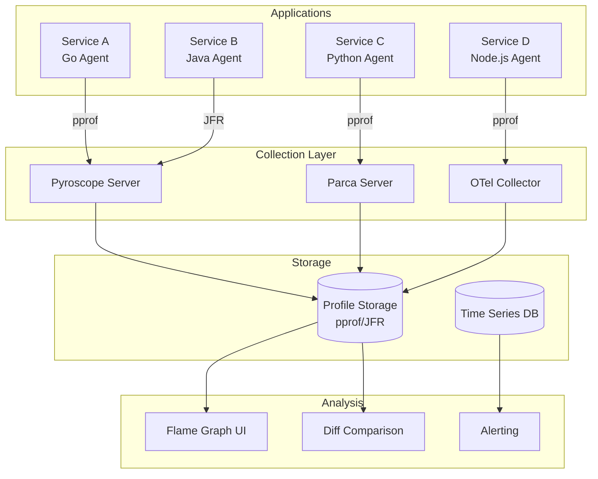
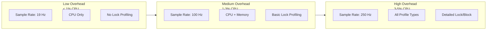
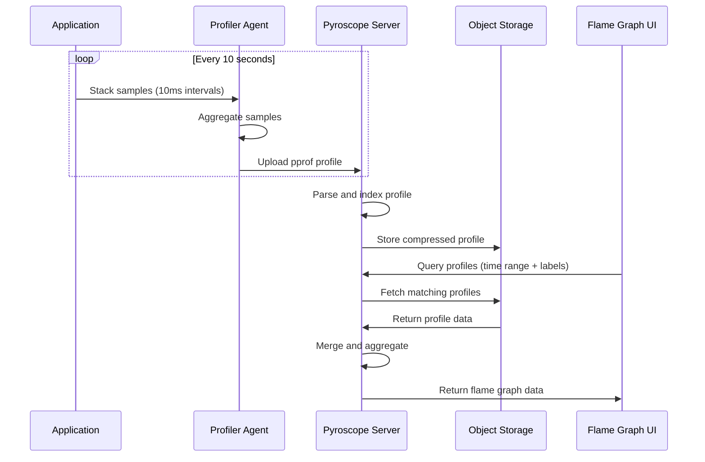

# How to Build Continuous Profiling Setup

Author: [nawazdhandala](https://github.com/nawazdhandala)

Tags: Performance, Profiling, Observability, Production

Description: A practical guide to setting up continuous profiling in production with low overhead sampling, profile aggregation, and flame graph analysis using Pyroscope, Parca, and Datadog.

---

Continuous profiling is the missing piece of production observability. While logs tell you what happened, metrics tell you how much, and traces tell you where, profiles tell you **why** your code is slow or resource hungry. This guide covers setting up continuous profiling from scratch with practical examples.

## What Is Continuous Profiling?

Continuous profiling means constantly sampling your application's runtime behavior in production. Instead of attaching a profiler during an incident, you collect lightweight samples continuously and analyze them later.

**Key benefits:**
- Find CPU hotspots without reproducing issues locally
- Detect memory leaks before they cause outages
- Compare profiles across deployments to catch regressions
- Correlate performance with specific code paths

## Profiling Architecture Overview

A production profiling setup consists of agents collecting samples, a backend for storage and aggregation, and a UI for visualization.



## Tool Comparison

| Feature | Pyroscope | Parca | Datadog Profiling |
|---------|-----------|-------|-------------------|
| Deployment | Self-hosted / Cloud | Self-hosted | SaaS |
| Languages | Go, Java, Python, Ruby, Node.js, .NET, Rust | Go, C/C++, Java, Python | Go, Java, Python, Ruby, Node.js, .NET |
| Storage | Custom / S3 | Object storage | Managed |
| Profile Types | CPU, Memory, Goroutines, Mutex | CPU, Memory | CPU, Memory, Wall time, Lock |
| Overhead | ~1-3% CPU | ~1-2% CPU | ~1-2% CPU |
| Cost | Free (OSS) / Paid Cloud | Free (OSS) | Per host pricing |
| Integration | Grafana native | Standalone UI | Full APM suite |

## Setting Up Pyroscope

Pyroscope is an open source continuous profiling platform with excellent language support.

### Pyroscope Server Deployment

Deploy Pyroscope using Docker or Kubernetes.

```yaml
# docker-compose.yml for local development
version: '3.8'

services:
  pyroscope:
    image: grafana/pyroscope:latest
    ports:
      - "4040:4040"  # HTTP API and UI
    volumes:
      - pyroscope-data:/var/lib/pyroscope
    environment:
      # Storage configuration
      - PYROSCOPE_STORAGE_TYPE=filesystem
      # Retention period for profiles
      - PYROSCOPE_RETENTION_PERIOD=168h
      # Log level for debugging
      - PYROSCOPE_LOG_LEVEL=info

volumes:
  pyroscope-data:
```

For production Kubernetes deployment:

```yaml
# pyroscope-deployment.yaml
apiVersion: apps/v1
kind: Deployment
metadata:
  name: pyroscope
  namespace: observability
spec:
  replicas: 1
  selector:
    matchLabels:
      app: pyroscope
  template:
    metadata:
      labels:
        app: pyroscope
    spec:
      containers:
        - name: pyroscope
          image: grafana/pyroscope:latest
          ports:
            - containerPort: 4040
          resources:
            requests:
              memory: "512Mi"
              cpu: "250m"
            limits:
              memory: "2Gi"
              cpu: "1000m"
          volumeMounts:
            - name: storage
              mountPath: /var/lib/pyroscope
          env:
            # Use S3 for production storage
            - name: PYROSCOPE_STORAGE_TYPE
              value: "s3"
            - name: PYROSCOPE_S3_BUCKET
              value: "pyroscope-profiles"
            - name: PYROSCOPE_S3_REGION
              value: "us-east-1"
      volumes:
        - name: storage
          persistentVolumeClaim:
            claimName: pyroscope-pvc
---
apiVersion: v1
kind: Service
metadata:
  name: pyroscope
  namespace: observability
spec:
  selector:
    app: pyroscope
  ports:
    - port: 4040
      targetPort: 4040
```

### Go Application Integration

```go
package main

import (
    "log"
    "os"
    "runtime"

    "github.com/grafana/pyroscope-go"
)

func main() {
    // Configure runtime settings for better profiling accuracy
    // Setting mutex profiling rate to 5 means we sample every 5th mutex event
    runtime.SetMutexProfileFraction(5)
    // Block profiling rate in nanoseconds - sample blocking events lasting > 1ms
    runtime.SetBlockProfileRate(1000000)

    // Initialize Pyroscope profiler
    _, err := pyroscope.Start(pyroscope.Config{
        // Application name appears in the Pyroscope UI
        ApplicationName: "order-service",
        // Server address where Pyroscope is running
        ServerAddress:   os.Getenv("PYROSCOPE_SERVER_URL"),
        // Logger for debugging profiler issues
        Logger:          pyroscope.StandardLogger,

        // Tags help filter profiles in the UI
        // Use environment, version, and instance for easy filtering
        Tags: map[string]string{
            "env":      os.Getenv("ENVIRONMENT"),
            "version":  os.Getenv("APP_VERSION"),
            "hostname": os.Getenv("HOSTNAME"),
        },

        // Profile types to collect
        // Start with CPU and allocations, add more as needed
        ProfileTypes: []pyroscope.ProfileType{
            pyroscope.ProfileCPU,           // Where is CPU time spent?
            pyroscope.ProfileAllocObjects,  // What objects are allocated?
            pyroscope.ProfileAllocSpace,    // How much memory allocated?
            pyroscope.ProfileInuseObjects,  // What objects are currently live?
            pyroscope.ProfileInuseSpace,    // How much memory is in use?
            pyroscope.ProfileGoroutines,    // How many goroutines and where?
            pyroscope.ProfileMutexCount,    // How often are mutexes contended?
            pyroscope.ProfileMutexDuration, // How long do mutex waits take?
            pyroscope.ProfileBlockCount,    // How often does blocking occur?
            pyroscope.ProfileBlockDuration, // How long are blocking waits?
        },
    })
    if err != nil {
        log.Fatalf("Failed to start Pyroscope: %v", err)
    }

    // Your application code here
    runServer()
}
```

### Python Application Integration

```python
import os
import pyroscope

# Initialize Pyroscope at application startup
# This must be called before any significant work begins
pyroscope.configure(
    # Application name for identification in UI
    application_name="payment-service",
    # Pyroscope server URL
    server_address=os.getenv("PYROSCOPE_SERVER_URL", "http://pyroscope:4040"),

    # Enable specific profile types
    # CPU profiling uses sampling to minimize overhead
    enable_cpu_profiling=True,
    # Memory profiling tracks allocations
    enable_memory_profiling=True,
    # GIL profiling shows Global Interpreter Lock contention
    enable_gil_profiling=True,
    # Thread ID tracking for multi-threaded applications
    enable_thread_id=True,

    # Sampling rate: 100 means sample 100 times per second
    # Higher values give more detail but increase overhead
    sample_rate=100,

    # Tags for filtering in UI
    tags={
        "env": os.getenv("ENVIRONMENT", "development"),
        "version": os.getenv("APP_VERSION", "unknown"),
        "region": os.getenv("AWS_REGION", "local"),
    },
)


# Use context manager for profiling specific code blocks
# This adds extra detail for critical operations
def process_payment(payment_data):
    # Tag this span with operation-specific labels
    with pyroscope.tag_wrapper({"operation": "payment", "type": payment_data["type"]}):
        # All CPU/memory usage in this block is tagged
        validate_payment(payment_data)
        charge_customer(payment_data)
        send_receipt(payment_data)
```

### Node.js Application Integration

```javascript
const Pyroscope = require('@pyroscope/nodejs');

// Initialize Pyroscope before importing other modules
// This ensures all code is profiled from the start
Pyroscope.init({
  // Server URL where Pyroscope is running
  serverAddress: process.env.PYROSCOPE_SERVER_URL || 'http://pyroscope:4040',
  // Application name shown in UI
  appName: 'api-gateway',

  // Tags for filtering and grouping profiles
  tags: {
    env: process.env.NODE_ENV || 'development',
    version: process.env.APP_VERSION || '1.0.0',
    hostname: process.env.HOSTNAME || 'local',
  },

  // Wall time profiling includes time spent waiting
  // CPU profiling only counts actual CPU work
  wall: true,

  // Heap profiling tracks memory allocations
  heap: true,

  // Sample rate in Hz (samples per second)
  // 100 Hz is a good balance of detail vs overhead
  sampleRate: 100,
});

// Start profiling - call this after configuration
Pyroscope.start();

// For Express.js, add middleware to tag requests
const express = require('express');
const app = express();

app.use((req, res, next) => {
  // Wrap each request with tags for filtering
  Pyroscope.wrapWithLabels(
    {
      route: req.route?.path || req.path,
      method: req.method,
    },
    () => next()
  );
});

// Graceful shutdown to flush pending profiles
process.on('SIGTERM', async () => {
  await Pyroscope.stop();
  process.exit(0);
});
```

### Java Application Integration

```java
import io.pyroscope.javaagent.PyroscopeAgent;
import io.pyroscope.javaagent.config.Config;
import io.pyroscope.javaagent.EventType;
import io.pyroscope.http.Format;

public class Application {
    public static void main(String[] args) {
        // Configure Pyroscope agent before starting application
        PyroscopeAgent.start(
            new Config.Builder()
                // Application name for identification
                .setApplicationName("inventory-service")
                // Pyroscope server URL
                .setServerAddress(System.getenv("PYROSCOPE_SERVER_URL"))
                // Use pprof format for better compatibility
                .setFormat(Format.JFR)

                // Profile types to collect
                // CPU sampling shows where processing time is spent
                .setProfilingEvent(EventType.CPU)
                // Allocation profiling shows memory usage patterns
                .setProfilingAlloc(true)
                // Lock profiling shows thread contention
                .setProfilingLock(true)

                // Sampling interval in nanoseconds
                // 10ms (10000000ns) is a good default
                .setProfilingInterval(10000000)

                // Labels for filtering
                .setLabels(Map.of(
                    "env", System.getenv("ENVIRONMENT"),
                    "version", System.getenv("APP_VERSION"),
                    "hostname", System.getenv("HOSTNAME")
                ))
                .build()
        );

        // Start your application
        SpringApplication.run(Application.class, args);
    }
}
```

## Setting Up Parca

Parca is a Prometheus-inspired continuous profiling system with eBPF-based collection.

### Parca Server Deployment

```yaml
# parca-deployment.yaml
apiVersion: apps/v1
kind: Deployment
metadata:
  name: parca
  namespace: observability
spec:
  replicas: 1
  selector:
    matchLabels:
      app: parca
  template:
    metadata:
      labels:
        app: parca
    spec:
      containers:
        - name: parca
          image: ghcr.io/parca-dev/parca:latest
          args:
            # Enable persistent storage
            - "--storage-path=/var/lib/parca"
            # Retention period for profiles
            - "--storage-retention-time=168h"
            # Listen address
            - "--http-address=:7070"
          ports:
            - containerPort: 7070
          volumeMounts:
            - name: storage
              mountPath: /var/lib/parca
          resources:
            requests:
              memory: "1Gi"
              cpu: "500m"
            limits:
              memory: "4Gi"
              cpu: "2000m"
      volumes:
        - name: storage
          persistentVolumeClaim:
            claimName: parca-pvc
```

### Parca Agent for eBPF Profiling

The Parca Agent uses eBPF to profile all processes without code changes.

```yaml
# parca-agent-daemonset.yaml
apiVersion: apps/v1
kind: DaemonSet
metadata:
  name: parca-agent
  namespace: observability
spec:
  selector:
    matchLabels:
      app: parca-agent
  template:
    metadata:
      labels:
        app: parca-agent
    spec:
      # Host PID namespace required for eBPF profiling
      hostPID: true
      containers:
        - name: parca-agent
          image: ghcr.io/parca-dev/parca-agent:latest
          args:
            # Where to send profiles
            - "--remote-store-address=parca.observability.svc:7070"
            - "--remote-store-insecure"
            # Node name for labeling
            - "--node=$(NODE_NAME)"
            # Sample rate in Hz
            - "--profiling-sample-frequency=19"
            # CPU profiling duration per collection
            - "--profiling-duration=10s"
          env:
            - name: NODE_NAME
              valueFrom:
                fieldRef:
                  fieldPath: spec.nodeName
          securityContext:
            # Privileged required for eBPF
            privileged: true
          volumeMounts:
            # Required mounts for eBPF and symbol resolution
            - name: sys-kernel
              mountPath: /sys/kernel
              readOnly: true
            - name: modules
              mountPath: /lib/modules
              readOnly: true
      volumes:
        - name: sys-kernel
          hostPath:
            path: /sys/kernel
        - name: modules
          hostPath:
            path: /lib/modules
```

## Datadog Continuous Profiling

For teams using Datadog, profiling integrates with their APM.

### Go with Datadog

```go
package main

import (
    "log"
    "os"

    "gopkg.in/DataDog/dd-trace-go.v1/profiler"
)

func main() {
    // Start the Datadog profiler
    err := profiler.Start(
        // Use environment variables for configuration
        profiler.WithService(os.Getenv("DD_SERVICE")),
        profiler.WithEnv(os.Getenv("DD_ENV")),
        profiler.WithVersion(os.Getenv("DD_VERSION")),
        // Datadog API key
        profiler.WithAPIKey(os.Getenv("DD_API_KEY")),

        // Profile types to collect
        profiler.WithProfileTypes(
            profiler.CPUProfile,        // CPU usage
            profiler.HeapProfile,       // Heap allocations
            profiler.GoroutineProfile,  // Goroutine count and stacks
            profiler.MutexProfile,      // Mutex contention
            profiler.BlockProfile,      // Blocking operations
        ),

        // Upload interval - how often to send profiles
        // 60 seconds is the default and recommended value
        profiler.WithPeriod(60*time.Second),
    )
    if err != nil {
        log.Fatalf("Failed to start profiler: %v", err)
    }
    defer profiler.Stop()

    // Your application code
    runServer()
}
```

### Python with Datadog

```python
import os
from ddtrace.profiling import Profiler
from ddtrace import tracer

# Initialize the Datadog tracer first
tracer.configure(
    hostname=os.getenv("DD_AGENT_HOST", "localhost"),
    port=8126,
)

# Create and start the profiler
profiler = Profiler(
    # Service name for identification
    service=os.getenv("DD_SERVICE", "my-service"),
    # Environment tag
    env=os.getenv("DD_ENV", "production"),
    # Version tag for comparing across deployments
    version=os.getenv("DD_VERSION", "1.0.0"),

    # Enable memory profiling
    # This tracks allocations and heap usage
    enable_memory_profiling=True,

    # Enable lock profiling for threading issues
    enable_lock_profiling=True,

    # Enable exception profiling
    # This captures where exceptions are raised
    enable_exception_profiling=True,

    # Enable GC profiling for garbage collection analysis
    enable_gc_profiling=True,
)

# Start the profiler
profiler.start()

# Your application code here
```

## Low Overhead Sampling Configuration

Continuous profiling must have minimal production impact. Here are configurations for different overhead budgets.

### Overhead Budget Guide



### Low Overhead Configuration (Production Default)

```go
// Go: Low overhead configuration
// Use this for high-traffic production services
_, err := pyroscope.Start(pyroscope.Config{
    ApplicationName: "production-service",
    ServerAddress:   os.Getenv("PYROSCOPE_SERVER_URL"),

    // Only collect CPU profiles
    // This has the lowest overhead (~0.5-1%)
    ProfileTypes: []pyroscope.ProfileType{
        pyroscope.ProfileCPU,
    },

    // Upload every 15 seconds to reduce network overhead
    UploadRate: 15 * time.Second,

    Tags: map[string]string{
        "env": "production",
    },
})
```

```python
# Python: Low overhead configuration
pyroscope.configure(
    application_name="production-service",
    server_address=os.getenv("PYROSCOPE_SERVER_URL"),

    # Only CPU profiling
    enable_cpu_profiling=True,
    enable_memory_profiling=False,
    enable_gil_profiling=False,

    # Low sample rate: 19 Hz is prime to avoid aliasing
    # This reduces overhead while still catching hotspots
    sample_rate=19,

    tags={"env": "production"},
)
```

### Medium Overhead Configuration (Staging/Debug)

```go
// Go: Medium overhead for detailed analysis
_, err := pyroscope.Start(pyroscope.Config{
    ApplicationName: "staging-service",
    ServerAddress:   os.Getenv("PYROSCOPE_SERVER_URL"),

    // CPU and memory profiling
    ProfileTypes: []pyroscope.ProfileType{
        pyroscope.ProfileCPU,
        pyroscope.ProfileAllocObjects,
        pyroscope.ProfileAllocSpace,
        pyroscope.ProfileInuseSpace,
    },

    // Faster uploads for quicker feedback
    UploadRate: 10 * time.Second,

    Tags: map[string]string{
        "env": "staging",
    },
})

// Enable mutex profiling at low rate
// Fraction of 5 means sample 1 in 5 mutex operations
runtime.SetMutexProfileFraction(5)
```

### Dynamic Profiling Toggle

Enable detailed profiling on demand without restarts.

```go
package profiling

import (
    "net/http"
    "sync/atomic"
    "runtime"
)

var detailedProfilingEnabled int32

// Handler to toggle detailed profiling via HTTP
func ToggleHandler(w http.ResponseWriter, r *http.Request) {
    if r.Method != http.MethodPost {
        http.Error(w, "Method not allowed", http.StatusMethodNotAllowed)
        return
    }

    // Toggle the state
    current := atomic.LoadInt32(&detailedProfilingEnabled)
    if current == 0 {
        // Enable detailed profiling
        atomic.StoreInt32(&detailedProfilingEnabled, 1)
        runtime.SetMutexProfileFraction(5)
        runtime.SetBlockProfileRate(1000000)
        w.Write([]byte("Detailed profiling enabled"))
    } else {
        // Disable detailed profiling
        atomic.StoreInt32(&detailedProfilingEnabled, 0)
        runtime.SetMutexProfileFraction(0)
        runtime.SetBlockProfileRate(0)
        w.Write([]byte("Detailed profiling disabled"))
    }
}

// Check if detailed profiling is enabled
func IsDetailedProfilingEnabled() bool {
    return atomic.LoadInt32(&detailedProfilingEnabled) == 1
}
```

## Profile Aggregation and Comparison

### Querying Profiles with Labels

```bash
# Query profiles for a specific service and time range
# Pyroscope uses a label-based query language
curl "http://pyroscope:4040/render?query=order-service.cpu{env=production}&from=now-1h&until=now"

# Compare two time periods
curl "http://pyroscope:4040/render/diff?leftQuery=order-service.cpu{version=1.2.3}&rightQuery=order-service.cpu{version=1.2.4}"
```

### Automated Comparison Script

```python
#!/usr/bin/env python3
"""
Compare profiles between deployments to catch performance regressions.
Run this in CI/CD after deploying to staging.
"""

import requests
import sys
from datetime import datetime, timedelta

PYROSCOPE_URL = "http://pyroscope:4040"
SERVICE_NAME = "order-service"
THRESHOLD_PERCENT = 10  # Alert if CPU increased by more than 10%


def get_profile_data(query: str, start: datetime, end: datetime) -> dict:
    """Fetch aggregated profile data from Pyroscope."""
    response = requests.get(
        f"{PYROSCOPE_URL}/render",
        params={
            "query": query,
            "from": int(start.timestamp()),
            "until": int(end.timestamp()),
            "format": "json",
        },
    )
    response.raise_for_status()
    return response.json()


def compare_profiles(baseline_version: str, new_version: str) -> dict:
    """Compare CPU profiles between two versions."""
    now = datetime.now()
    one_hour_ago = now - timedelta(hours=1)

    # Get baseline profile (previous version, last deployment period)
    baseline = get_profile_data(
        f"{SERVICE_NAME}.cpu{{version={baseline_version}}}",
        one_hour_ago - timedelta(hours=24),  # Previous day
        one_hour_ago,
    )

    # Get new profile (current version)
    new = get_profile_data(
        f"{SERVICE_NAME}.cpu{{version={new_version}}}",
        one_hour_ago,
        now,
    )

    # Compare total CPU time
    baseline_total = sum(baseline.get("flamebearer", {}).get("levels", [[0]])[0])
    new_total = sum(new.get("flamebearer", {}).get("levels", [[0]])[0])

    if baseline_total == 0:
        return {"status": "no_baseline", "message": "No baseline data available"}

    change_percent = ((new_total - baseline_total) / baseline_total) * 100

    return {
        "status": "regression" if change_percent > THRESHOLD_PERCENT else "ok",
        "baseline_version": baseline_version,
        "new_version": new_version,
        "baseline_cpu": baseline_total,
        "new_cpu": new_total,
        "change_percent": round(change_percent, 2),
    }


if __name__ == "__main__":
    if len(sys.argv) != 3:
        print("Usage: compare_profiles.py <baseline_version> <new_version>")
        sys.exit(1)

    result = compare_profiles(sys.argv[1], sys.argv[2])
    print(f"Profile comparison: {result}")

    if result["status"] == "regression":
        print(f"WARNING: CPU usage increased by {result['change_percent']}%")
        sys.exit(1)
```

## Profile Data Flow

Understanding how profile data moves through your system helps with debugging and capacity planning.



## Best Practices

### 1. Use Consistent Labels

```go
// Good: Consistent, low-cardinality labels
tags := map[string]string{
    "env":      "production",     // Environment
    "service":  "order-service",  // Service name
    "version":  "1.2.3",          // Application version
    "region":   "us-east-1",      // Deployment region
}

// Bad: High-cardinality labels cause storage explosion
tags := map[string]string{
    "request_id": uuid.New().String(),  // Unique per request - DO NOT DO THIS
    "user_id":    user.ID,              // Too many unique values
}
```

### 2. Profile Critical Code Paths

```python
# Tag specific operations for easier filtering
def process_checkout(cart):
    # Tag this entire operation
    with pyroscope.tag_wrapper({"operation": "checkout"}):
        # Validate cart
        with pyroscope.tag_wrapper({"step": "validation"}):
            validate_cart(cart)

        # Process payment
        with pyroscope.tag_wrapper({"step": "payment"}):
            charge_customer(cart)

        # Update inventory
        with pyroscope.tag_wrapper({"step": "inventory"}):
            update_inventory(cart)
```

### 3. Set Up Alerts on Profile Metrics

```yaml
# Prometheus alerting rule for CPU regression
groups:
  - name: profiling
    rules:
      - alert: CPUProfileRegression
        expr: |
          (
            sum(rate(pyroscope_profiles_cpu_total{env="production"}[1h]))
            /
            sum(rate(pyroscope_profiles_cpu_total{env="production"}[1h] offset 1d))
          ) > 1.2
        for: 30m
        labels:
          severity: warning
        annotations:
          summary: "CPU usage increased by more than 20% compared to yesterday"
          description: "Service {{ $labels.service }} shows CPU regression"
```

### 4. Integrate with CI/CD

```yaml
# GitHub Actions workflow for profile comparison
name: Profile Comparison

on:
  deployment_status:
    types: [completed]

jobs:
  compare-profiles:
    if: github.event.deployment_status.state == 'success'
    runs-on: ubuntu-latest
    steps:
      - uses: actions/checkout@v4

      - name: Wait for profiles to accumulate
        run: sleep 300  # Wait 5 minutes for profile data

      - name: Compare profiles
        run: |
          python scripts/compare_profiles.py \
            ${{ github.event.deployment.payload.previous_version }} \
            ${{ github.event.deployment.payload.version }}
        env:
          PYROSCOPE_URL: ${{ secrets.PYROSCOPE_URL }}
```

## Summary

| Component | Recommendation |
|-----------|----------------|
| **Tool Selection** | Pyroscope for self-hosted, Datadog for existing APM users |
| **Sample Rate** | 19-100 Hz depending on overhead budget |
| **Profile Types** | Start with CPU, add memory and locks as needed |
| **Labels** | Low-cardinality: env, service, version, region |
| **Retention** | 7-14 days for production, longer for release comparisons |
| **Comparison** | Automate in CI/CD to catch regressions |

Continuous profiling transforms performance debugging from guesswork into data-driven analysis. Start with CPU profiling on your most critical services, establish baselines, and gradually expand coverage as you build confidence in the low overhead.

**Related Reading:**
- [Basics of Profiling](https://oneuptime.com/blog/post/2025-09-09-basics-of-profiling/view)
- [Traces and Spans in OpenTelemetry](https://oneuptime.com/blog/post/2025-08-27-traces-and-spans-in-opentelemetry/view)
- [The Three Pillars of Observability](https://oneuptime.com/blog/post/2025-08-20-three-pillars-of-observability-logs-metrics-traces/view)

---

*Looking for unified observability with traces, metrics, logs, and profiling? OneUptime provides a single platform for all your monitoring needs. Send your OpenTelemetry data to OneUptime and get complete visibility into your production systems.*
