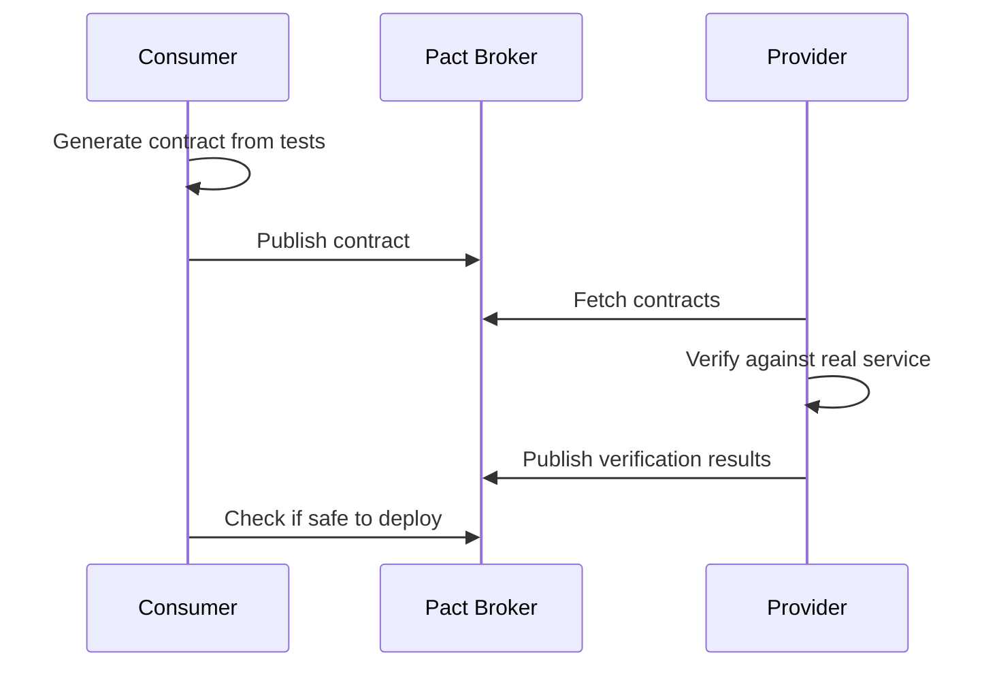
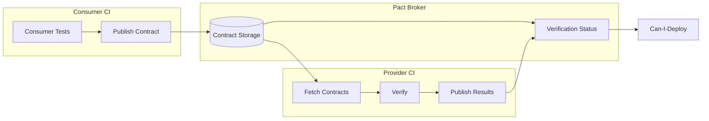

# How to Build Contract Testing with Pact

Author: [nawazdhandala](https://www.github.com/nawazdhandala)

Tags: Contract Testing, Pact, Microservices, Testing, API

Description: Implement consumer-driven contract testing with Pact for reliable API integrations between microservices with broker workflows.

---

Integration testing in microservices is notoriously difficult. You either spin up the entire system for end-to-end tests (slow and flaky) or mock everything and hope for the best (unrealistic). Contract testing with Pact offers a middle ground that catches integration issues early without the overhead of running all your services.

## What is Consumer-Driven Contract Testing?

In consumer-driven contract testing, the service that calls an API (the consumer) defines what it needs from the provider. These expectations become contracts that providers must satisfy. The key insight is that consumers only care about the parts of an API they actually use.



## Setting Up the Consumer Side

Start by installing the Pact library for your consumer service. This example uses Node.js, but Pact has libraries for most languages.

```bash
npm install @pact-foundation/pact --save-dev
```

### Writing Consumer Tests

Consumer tests define what your service expects from a provider. The Pact mock server stands in for the real provider during tests.

```javascript
// tests/userServiceConsumer.pact.js
const { Pact } = require('@pact-foundation/pact');
const { UserClient } = require('../src/userClient');
const path = require('path');

// Initialize Pact with consumer and provider names
// These names identify the contract relationship
const provider = new Pact({
  consumer: 'OrderService',      // Name of this service
  provider: 'UserService',       // Name of the service we call
  port: 1234,                    // Port for the mock server
  log: path.resolve(process.cwd(), 'logs', 'pact.log'),
  dir: path.resolve(process.cwd(), 'pacts'),  // Where contracts are saved
  logLevel: 'warn',
});

describe('User Service Contract', () => {
  // Start the mock server before all tests
  beforeAll(() => provider.setup());

  // Write the contract file after all tests complete
  afterAll(() => provider.finalize());

  // Clear interactions between tests
  afterEach(() => provider.verify());

  describe('get user by ID', () => {
    it('returns a user when one exists', async () => {
      // Define the expected interaction
      // This becomes part of the contract
      await provider.addInteraction({
        state: 'a user with ID 123 exists',  // Provider state
        uponReceiving: 'a request for user 123',
        withRequest: {
          method: 'GET',
          path: '/api/users/123',
          headers: {
            Accept: 'application/json',
          },
        },
        willRespondWith: {
          status: 200,
          headers: {
            'Content-Type': 'application/json',
          },
          body: {
            id: 123,
            name: 'Jane Doe',
            email: 'jane@example.com',
            // Only specify fields your consumer actually uses
            // This keeps contracts minimal and flexible
          },
        },
      });

      // Run the actual test against the mock server
      const client = new UserClient(`http://localhost:1234`);
      const user = await client.getUser(123);

      // Assert your consumer code handles the response correctly
      expect(user.id).toBe(123);
      expect(user.name).toBe('Jane Doe');
    });
  });
});
```

### Using Matchers for Flexible Contracts

Hard-coded values make contracts brittle. Pact matchers let you specify the shape of data without exact values.

```javascript
const { Matchers } = require('@pact-foundation/pact');
const { like, eachLike, term, integer, string, boolean } = Matchers;

await provider.addInteraction({
  state: 'users exist in the system',
  uponReceiving: 'a request for all users',
  withRequest: {
    method: 'GET',
    path: '/api/users',
    query: {
      // term() matches by regex but uses example for mock
      status: term({
        matcher: '^(active|inactive)$',
        generate: 'active',
      }),
    },
  },
  willRespondWith: {
    status: 200,
    body: {
      // eachLike() means array with at least one item matching this shape
      users: eachLike({
        id: integer(1),           // Any integer, example value 1
        name: string('Jane'),     // Any string
        active: boolean(true),    // Any boolean
        // like() matches structure, not exact value
        metadata: like({
          createdAt: '2024-01-15T10:00:00Z',
          updatedAt: '2024-01-20T14:30:00Z',
        }),
      }),
      // Pagination info
      total: integer(100),
      page: integer(1),
    },
  },
});
```

## Setting Up the Provider Side

The provider runs verification against the contracts published by consumers. This confirms the real service behaves as consumers expect.

```bash
npm install @pact-foundation/pact --save-dev
```

### Provider Verification

Provider tests fetch contracts and replay the recorded interactions against the real service.

```javascript
// tests/userServiceProvider.pact.js
const { Verifier } = require('@pact-foundation/pact');
const { app } = require('../src/app');

describe('User Service Provider Verification', () => {
  let server;

  // Start your real service before verification
  beforeAll((done) => {
    server = app.listen(3000, done);
  });

  afterAll((done) => {
    server.close(done);
  });

  it('validates the expectations of OrderService', async () => {
    const options = {
      provider: 'UserService',
      providerBaseUrl: 'http://localhost:3000',

      // Fetch contracts from broker (recommended)
      pactBrokerUrl: 'https://your-broker.pactflow.io',
      pactBrokerToken: process.env.PACT_BROKER_TOKEN,

      // Or use local pact files during development
      // pactUrls: ['./pacts/orderservice-userservice.json'],

      // Provider states let you set up test data
      stateHandlers: {
        'a user with ID 123 exists': async () => {
          // Insert test user into database
          await db.users.create({
            id: 123,
            name: 'Jane Doe',
            email: 'jane@example.com',
          });
        },
        'no users exist': async () => {
          // Clear all users
          await db.users.deleteAll();
        },
      },

      // Publish verification results back to broker
      publishVerificationResult: true,
      providerVersion: process.env.GIT_COMMIT,
      providerVersionBranch: process.env.GIT_BRANCH,
    };

    await new Verifier(options).verifyProvider();
  });
});
```

## The Pact Broker

The Pact Broker is central to making contract testing practical. It stores contracts, tracks verification status, and enables can-i-deploy checks.



### Publishing Contracts

After consumer tests pass, publish the generated contracts to the broker.

```bash
# Using the Pact CLI
pact-broker publish ./pacts \
  --consumer-app-version=$(git rev-parse HEAD) \
  --branch=$(git branch --show-current) \
  --broker-base-url=https://your-broker.pactflow.io \
  --broker-token=$PACT_BROKER_TOKEN
```

Or programmatically in your CI pipeline:

```javascript
// scripts/publish-pacts.js
const pact = require('@pact-foundation/pact-node');

const opts = {
  pactFilesOrDirs: ['./pacts'],
  pactBroker: 'https://your-broker.pactflow.io',
  pactBrokerToken: process.env.PACT_BROKER_TOKEN,
  consumerVersion: process.env.GIT_COMMIT,
  branch: process.env.GIT_BRANCH,
  tags: [process.env.ENVIRONMENT || 'dev'],
};

pact.publishPacts(opts)
  .then(() => console.log('Pacts published successfully'))
  .catch((e) => {
    console.error('Failed to publish pacts:', e);
    process.exit(1);
  });
```

## Can-I-Deploy: The Safety Gate

Before deploying any service, check if it's safe using can-i-deploy. This verifies all contract dependencies are satisfied.

```bash
# Check if OrderService can deploy to production
pact-broker can-i-deploy \
  --pacticipant OrderService \
  --version $(git rev-parse HEAD) \
  --to-environment production \
  --broker-base-url https://your-broker.pactflow.io \
  --broker-token $PACT_BROKER_TOKEN
```

The response tells you whether deployment is safe:

```
Computer says yes \o/

CONSUMER       | C.VERSION | PROVIDER    | P.VERSION | SUCCESS?
---------------|-----------|-------------|-----------|----------
OrderService   | a]23f8b   | UserService | 8d2e4f1   | true
OrderService   | ab23f8b   | PaymentSvc  | 12c9a3b   | true

All required verification results are published and successful
```

### Recording Deployments

After successful deployment, record it so other services know what versions are in each environment.

```bash
pact-broker record-deployment \
  --pacticipant UserService \
  --version $(git rev-parse HEAD) \
  --environment production \
  --broker-base-url https://your-broker.pactflow.io \
  --broker-token $PACT_BROKER_TOKEN
```

## Handling Breaking Changes

When a provider needs to make a breaking change, the workflow reveals affected consumers.

```javascript
// Provider wants to rename 'name' to 'fullName'
// Verification will fail for consumers using 'name'

// Step 1: Add the new field alongside the old one
{
  id: 123,
  name: 'Jane Doe',        // Keep for backward compatibility
  fullName: 'Jane Doe',    // New field
}

// Step 2: Update consumers to use 'fullName'
// Consumers publish new contracts expecting 'fullName'

// Step 3: Once all consumers migrate, remove 'name'
// Verification passes because no contract expects 'name'
```

## Webhook Integration

Configure webhooks to trigger provider verification when new contracts are published.

```bash
# Create webhook that triggers provider CI when contracts change
pact-broker create-webhook \
  'https://api.github.com/repos/org/user-service/dispatches' \
  --request=POST \
  --header='Authorization: token ${GITHUB_TOKEN}' \
  --header='Accept: application/vnd.github.v3+json' \
  --data='{"event_type":"contract_requiring_verification","client_payload":{"pact_url":"${pactbroker.pactUrl}"}}' \
  --contract-requiring-verification-published \
  --provider=UserService \
  --broker-base-url=https://your-broker.pactflow.io \
  --broker-token=$PACT_BROKER_TOKEN
```

## CI/CD Integration Example

Here is a complete GitHub Actions workflow integrating contract testing:

```yaml
# .github/workflows/contract-tests.yml
name: Contract Tests

on:
  push:
    branches: [main, develop]
  pull_request:
    branches: [main]

jobs:
  consumer-tests:
    runs-on: ubuntu-latest
    steps:
      - uses: actions/checkout@v4

      - name: Setup Node.js
        uses: actions/setup-node@v4
        with:
          node-version: '20'

      - name: Install dependencies
        run: npm ci

      - name: Run consumer contract tests
        run: npm run test:contract

      - name: Publish contracts to broker
        run: |
          npx pact-broker publish ./pacts \
            --consumer-app-version=${{ github.sha }} \
            --branch=${{ github.ref_name }} \
            --broker-base-url=${{ secrets.PACT_BROKER_URL }} \
            --broker-token=${{ secrets.PACT_BROKER_TOKEN }}

  can-i-deploy:
    needs: consumer-tests
    runs-on: ubuntu-latest
    steps:
      - name: Check deployment safety
        run: |
          npx pact-broker can-i-deploy \
            --pacticipant=OrderService \
            --version=${{ github.sha }} \
            --to-environment=production \
            --broker-base-url=${{ secrets.PACT_BROKER_URL }} \
            --broker-token=${{ secrets.PACT_BROKER_TOKEN }}
```

## Best Practices

| Practice | Rationale |
|----------|-----------|
| Test only what you use | Minimal contracts are more stable |
| Use matchers liberally | Avoid over-specifying exact values |
| Keep provider states simple | Complex setup indicates design issues |
| Run verification in CI | Catch issues before deployment |
| Use semantic versioning | Track breaking changes clearly |
| Record all deployments | Enable accurate can-i-deploy checks |

Contract testing with Pact bridges the gap between unit tests and end-to-end tests. It catches integration issues early, runs fast, and gives you confidence that services will work together in production. The investment in setting up a Pact Broker pays off quickly when you can deploy independently without fear of breaking other services.
