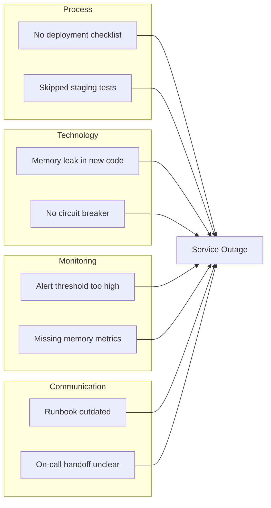
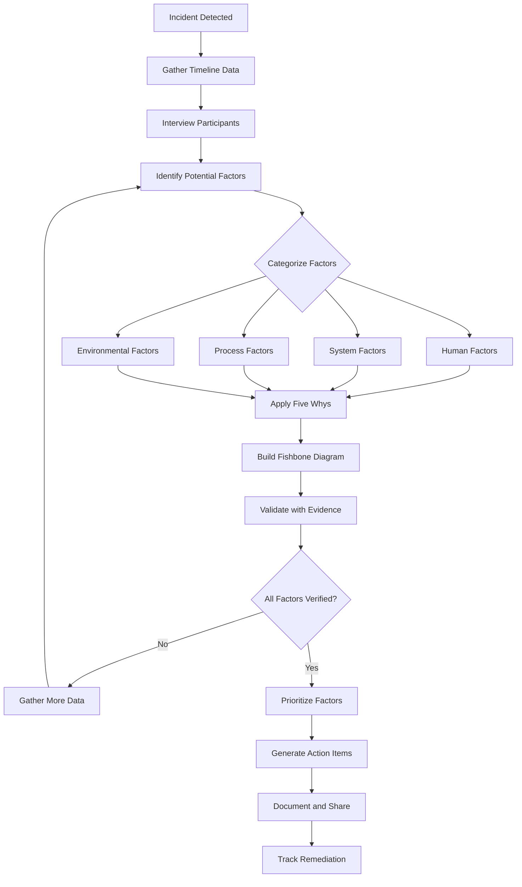
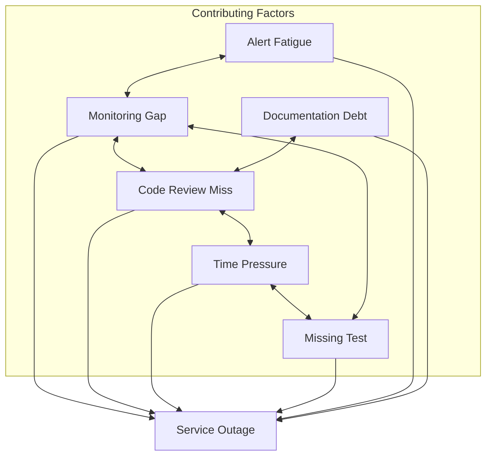

# How to Build Contributing Factor Analysis

Author: [nawazdhandala](https://github.com/nawazdhandala)

Tags: SRE, IncidentManagement, Analysis, Postmortem

Description: Learn how to conduct effective contributing factor analysis to understand incidents holistically and prevent future failures.

---

## Introduction

When an incident occurs, the instinct is to find "the root cause" and fix it. But complex systems rarely fail for a single reason. Contributing factor analysis helps teams understand the full picture of what went wrong by examining multiple interacting causes rather than hunting for a single culprit.

This guide walks through practical techniques for identifying contributing factors, conducting thorough analysis, and building systems that learn from failures.

## What Are Contributing Factors?

Contributing factors are the conditions, actions, and circumstances that combined to make an incident possible. Unlike root cause analysis, which implies a single source of failure, contributing factor analysis acknowledges that incidents emerge from the interaction of multiple elements.

Consider a database outage. The immediate trigger might be a failed disk, but contributing factors could include:

- Monitoring gaps that delayed detection
- Documentation that was outdated
- Time pressure that led to skipped verification steps
- Alert fatigue that caused initial warnings to be dismissed

Each factor alone might not cause an incident, but together they create the conditions for failure.

## The Five Whys Technique

The Five Whys is a simple but powerful technique for digging beneath surface symptoms. By repeatedly asking "why," you can uncover deeper contributing factors.

### Example: API Latency Incident

**Problem:** API response times spiked to 30 seconds during peak traffic.

1. **Why did response times spike?**
   Because the database connection pool was exhausted.

2. **Why was the connection pool exhausted?**
   Because a new feature was making excessive database queries.

3. **Why was the feature making excessive queries?**
   Because it was missing query batching and caching.

4. **Why was batching and caching missing?**
   Because the code review did not include performance testing.

5. **Why did the code review skip performance testing?**
   Because there was no checklist or automated gate for performance validation.

This reveals multiple contributing factors: the code itself, the review process, and missing automation.

### Five Whys Implementation

Here is a simple data structure for tracking Five Whys analysis:

```python
# five_whys.py
# A simple class to conduct and store Five Whys analysis

from dataclasses import dataclass, field
from typing import List, Optional
from datetime import datetime


@dataclass
class WhyStep:
    """Represents a single 'why' question and answer pair."""
    question: str
    answer: str
    evidence: Optional[str] = None  # Links to logs, metrics, or other proof
    timestamp: datetime = field(default_factory=datetime.now)


@dataclass
class FiveWhysAnalysis:
    """Container for a complete Five Whys analysis session."""
    incident_id: str
    initial_problem: str
    steps: List[WhyStep] = field(default_factory=list)
    contributing_factors: List[str] = field(default_factory=list)

    def add_why(self, question: str, answer: str, evidence: Optional[str] = None):
        """Add a new why step to the analysis."""
        step = WhyStep(
            question=question,
            answer=answer,
            evidence=evidence
        )
        self.steps.append(step)
        return self

    def extract_factors(self) -> List[str]:
        """
        Extract contributing factors from the analysis.
        Each answer potentially reveals a contributing factor.
        """
        factors = []
        for step in self.steps:
            # Each answer represents a potential contributing factor
            factors.append(step.answer)
        self.contributing_factors = factors
        return factors

    def to_report(self) -> str:
        """Generate a markdown report of the analysis."""
        lines = [
            f"# Five Whys Analysis: {self.incident_id}",
            "",
            f"**Initial Problem:** {self.initial_problem}",
            "",
            "## Analysis Steps",
            ""
        ]

        for i, step in enumerate(self.steps, 1):
            lines.append(f"### Why #{i}")
            lines.append(f"**Q:** {step.question}")
            lines.append(f"**A:** {step.answer}")
            if step.evidence:
                lines.append(f"**Evidence:** {step.evidence}")
            lines.append("")

        lines.append("## Contributing Factors Identified")
        lines.append("")
        for factor in self.contributing_factors:
            lines.append(f"- {factor}")

        return "\n".join(lines)


# Example usage
if __name__ == "__main__":
    analysis = FiveWhysAnalysis(
        incident_id="INC-2024-0042",
        initial_problem="API response times exceeded 30 seconds"
    )

    # Walk through the analysis
    analysis.add_why(
        question="Why did response times spike?",
        answer="Database connection pool was exhausted",
        evidence="Connection pool metrics showed 100% utilization"
    )
    analysis.add_why(
        question="Why was the connection pool exhausted?",
        answer="New feature made excessive database queries",
        evidence="Query logs showed 10x normal query volume"
    )
    analysis.add_why(
        question="Why was the feature making excessive queries?",
        answer="Missing query batching and caching implementation",
        evidence="Code review of feature branch"
    )
    analysis.add_why(
        question="Why was batching and caching missing?",
        answer="Performance review was not part of code review process",
        evidence="Code review checklist document"
    )
    analysis.add_why(
        question="Why was performance review not included?",
        answer="No automated performance gates in CI/CD pipeline",
        evidence="Pipeline configuration files"
    )

    # Extract and display factors
    analysis.extract_factors()
    print(analysis.to_report())
```

## Fishbone Diagrams (Ishikawa Diagrams)

Fishbone diagrams provide a visual way to categorize contributing factors. They help teams explore different dimensions of an incident systematically.

### Standard Categories for Incident Analysis

Traditional fishbone diagrams use the "6 Ms":

- **Methods:** Processes and procedures
- **Machines:** Infrastructure and tools
- **Materials:** Data and inputs
- **Measurements:** Monitoring and metrics
- **Mother Nature:** External factors and environment
- **Manpower:** People and skills

For software incidents, adapted categories work better:

- **Process:** Deployment, review, and operational procedures
- **Technology:** Infrastructure, code, and dependencies
- **Monitoring:** Observability and alerting
- **Communication:** Handoffs and documentation
- **Environment:** External services and conditions
- **People:** Training, fatigue, and cognitive load

### Fishbone Diagram for a Service Outage



### Fishbone Analysis Implementation

```python
# fishbone.py
# Build and analyze fishbone diagrams programmatically

from dataclasses import dataclass, field
from typing import Dict, List
from enum import Enum


class FactorCategory(Enum):
    """Categories for organizing contributing factors."""
    PROCESS = "Process"
    TECHNOLOGY = "Technology"
    MONITORING = "Monitoring"
    COMMUNICATION = "Communication"
    ENVIRONMENT = "Environment"
    PEOPLE = "People"


@dataclass
class ContributingFactor:
    """A single contributing factor with metadata."""
    description: str
    category: FactorCategory
    severity: str  # "high", "medium", "low"
    evidence: str
    actionable: bool = True


@dataclass
class FishboneAnalysis:
    """Container for fishbone diagram analysis."""
    incident_id: str
    incident_summary: str
    factors: Dict[FactorCategory, List[ContributingFactor]] = field(
        default_factory=lambda: {cat: [] for cat in FactorCategory}
    )

    def add_factor(
        self,
        description: str,
        category: FactorCategory,
        severity: str = "medium",
        evidence: str = "",
        actionable: bool = True
    ):
        """Add a contributing factor to the appropriate category."""
        factor = ContributingFactor(
            description=description,
            category=category,
            severity=severity,
            evidence=evidence,
            actionable=actionable
        )
        self.factors[category].append(factor)
        return self

    def get_high_severity_factors(self) -> List[ContributingFactor]:
        """Return all factors marked as high severity."""
        high_severity = []
        for category_factors in self.factors.values():
            for factor in category_factors:
                if factor.severity == "high":
                    high_severity.append(factor)
        return high_severity

    def get_actionable_items(self) -> List[ContributingFactor]:
        """Return all factors that can be addressed with action items."""
        actionable = []
        for category_factors in self.factors.values():
            for factor in category_factors:
                if factor.actionable:
                    actionable.append(factor)
        return actionable

    def generate_mermaid(self) -> str:
        """Generate a Mermaid flowchart representation."""
        lines = ["flowchart LR"]

        # Create subgraphs for each category with factors
        for category in FactorCategory:
            category_factors = self.factors[category]
            if category_factors:
                lines.append(f"    subgraph {category.value}")
                for i, factor in enumerate(category_factors):
                    # Create a short ID and truncate long descriptions
                    factor_id = f"{category.name[:1]}{i}"
                    desc = factor.description[:30]
                    if len(factor.description) > 30:
                        desc += "..."
                    lines.append(f"        {factor_id}[{desc}]")
                lines.append("    end")

        # Connect all factors to the incident
        lines.append(f"    Incident[{self.incident_summary[:20]}...]")
        for category in FactorCategory:
            for i, factor in enumerate(self.factors[category]):
                factor_id = f"{category.name[:1]}{i}"
                lines.append(f"    {factor_id} --> Incident")

        return "\n".join(lines)


# Example usage
if __name__ == "__main__":
    analysis = FishboneAnalysis(
        incident_id="INC-2024-0042",
        incident_summary="Production API outage lasting 45 minutes"
    )

    # Add factors across categories
    analysis.add_factor(
        description="No deployment checklist enforced",
        category=FactorCategory.PROCESS,
        severity="high",
        evidence="Deployment was done without following standard procedure"
    )
    analysis.add_factor(
        description="Memory leak in connection pooling",
        category=FactorCategory.TECHNOLOGY,
        severity="high",
        evidence="Memory profiling showed unbounded growth"
    )
    analysis.add_factor(
        description="Alert threshold set too high",
        category=FactorCategory.MONITORING,
        severity="medium",
        evidence="Alert only fired after 30 minutes of degradation"
    )
    analysis.add_factor(
        description="Runbook not updated for new architecture",
        category=FactorCategory.COMMUNICATION,
        severity="medium",
        evidence="On-call engineer followed outdated steps"
    )

    # Generate outputs
    print("High Severity Factors:")
    for factor in analysis.get_high_severity_factors():
        print(f"  - {factor.description}")

    print("\nMermaid Diagram:")
    print(analysis.generate_mermaid())
```

## The Contributing Factor Analysis Process

Here is a complete workflow for conducting contributing factor analysis:



## Human Factors vs. System Factors

A critical distinction in contributing factor analysis is between human factors and system factors. Blaming individuals rarely prevents future incidents. Instead, focus on the systems that allowed errors to happen.

### Human Factors to Consider

Human factors are conditions that affect how people perform:

- **Cognitive Load:** Was the engineer handling too many alerts?
- **Time Pressure:** Did deadlines force shortcuts?
- **Training Gaps:** Was the necessary knowledge available?
- **Fatigue:** Was this during a long on-call shift?
- **Communication:** Were expectations clear?

### System Factors to Consider

System factors are the technical and organizational elements:

- **Automation Gaps:** What manual steps could fail?
- **Safeguards:** Were there missing guardrails?
- **Observability:** Could the problem be detected earlier?
- **Redundancy:** Were there single points of failure?
- **Dependencies:** Did external systems contribute?

### Categorizing Factors

```python
# factor_analysis.py
# Comprehensive contributing factor analysis with human and system factors

from dataclasses import dataclass, field
from typing import List, Dict, Optional
from enum import Enum
from datetime import datetime


class FactorType(Enum):
    """High-level factor classification."""
    HUMAN = "human"
    SYSTEM = "system"
    PROCESS = "process"
    ENVIRONMENTAL = "environmental"


class HumanFactorCategory(Enum):
    """Specific categories for human factors."""
    COGNITIVE_LOAD = "cognitive_load"
    TIME_PRESSURE = "time_pressure"
    TRAINING = "training"
    FATIGUE = "fatigue"
    COMMUNICATION = "communication"
    DECISION_MAKING = "decision_making"


class SystemFactorCategory(Enum):
    """Specific categories for system factors."""
    AUTOMATION = "automation"
    SAFEGUARDS = "safeguards"
    OBSERVABILITY = "observability"
    REDUNDANCY = "redundancy"
    DEPENDENCIES = "dependencies"
    CAPACITY = "capacity"


@dataclass
class Factor:
    """A contributing factor with full context."""
    id: str
    description: str
    factor_type: FactorType
    subcategory: str
    evidence: List[str] = field(default_factory=list)
    related_factors: List[str] = field(default_factory=list)  # IDs of related factors
    remediation_possible: bool = True

    def add_evidence(self, evidence: str):
        """Add supporting evidence for this factor."""
        self.evidence.append(evidence)
        return self

    def link_to(self, other_factor_id: str):
        """Link this factor to a related factor."""
        if other_factor_id not in self.related_factors:
            self.related_factors.append(other_factor_id)
        return self


@dataclass
class IncidentAnalysis:
    """Complete contributing factor analysis for an incident."""
    incident_id: str
    incident_title: str
    occurred_at: datetime
    duration_minutes: int
    impact: str
    factors: Dict[str, Factor] = field(default_factory=dict)

    def add_human_factor(
        self,
        factor_id: str,
        description: str,
        category: HumanFactorCategory
    ) -> Factor:
        """Add a human factor to the analysis."""
        factor = Factor(
            id=factor_id,
            description=description,
            factor_type=FactorType.HUMAN,
            subcategory=category.value
        )
        self.factors[factor_id] = factor
        return factor

    def add_system_factor(
        self,
        factor_id: str,
        description: str,
        category: SystemFactorCategory
    ) -> Factor:
        """Add a system factor to the analysis."""
        factor = Factor(
            id=factor_id,
            description=description,
            factor_type=FactorType.SYSTEM,
            subcategory=category.value
        )
        self.factors[factor_id] = factor
        return factor

    def get_factors_by_type(self, factor_type: FactorType) -> List[Factor]:
        """Get all factors of a specific type."""
        return [f for f in self.factors.values() if f.factor_type == factor_type]

    def find_factor_chains(self) -> List[List[str]]:
        """
        Find chains of related factors.
        Returns lists of factor IDs that are connected.
        """
        chains = []
        visited = set()

        def build_chain(factor_id: str, current_chain: List[str]):
            if factor_id in visited:
                return
            visited.add(factor_id)
            current_chain.append(factor_id)

            factor = self.factors.get(factor_id)
            if factor:
                for related_id in factor.related_factors:
                    build_chain(related_id, current_chain)

        for factor_id in self.factors:
            if factor_id not in visited:
                chain = []
                build_chain(factor_id, chain)
                if len(chain) > 1:
                    chains.append(chain)

        return chains

    def generate_summary(self) -> str:
        """Generate a summary report of the analysis."""
        human_factors = self.get_factors_by_type(FactorType.HUMAN)
        system_factors = self.get_factors_by_type(FactorType.SYSTEM)

        lines = [
            f"# Contributing Factor Analysis: {self.incident_id}",
            "",
            f"**Incident:** {self.incident_title}",
            f"**Duration:** {self.duration_minutes} minutes",
            f"**Impact:** {self.impact}",
            "",
            "## Human Factors",
            ""
        ]

        for factor in human_factors:
            lines.append(f"### {factor.id}: {factor.description}")
            lines.append(f"Category: {factor.subcategory}")
            if factor.evidence:
                lines.append("Evidence:")
                for e in factor.evidence:
                    lines.append(f"  - {e}")
            lines.append("")

        lines.append("## System Factors")
        lines.append("")

        for factor in system_factors:
            lines.append(f"### {factor.id}: {factor.description}")
            lines.append(f"Category: {factor.subcategory}")
            if factor.evidence:
                lines.append("Evidence:")
                for e in factor.evidence:
                    lines.append(f"  - {e}")
            lines.append("")

        return "\n".join(lines)


# Example usage
if __name__ == "__main__":
    analysis = IncidentAnalysis(
        incident_id="INC-2024-0042",
        incident_title="Production database connection exhaustion",
        occurred_at=datetime(2024, 3, 15, 14, 30),
        duration_minutes=45,
        impact="Complete service unavailability for 2000 users"
    )

    # Add human factors
    hf1 = analysis.add_human_factor(
        "HF-001",
        "Engineer was handling 3 other incidents simultaneously",
        HumanFactorCategory.COGNITIVE_LOAD
    )
    hf1.add_evidence("Incident timeline shows parallel ticket assignments")
    hf1.add_evidence("On-call engineer interview notes")

    hf2 = analysis.add_human_factor(
        "HF-002",
        "Release deadline pressure led to abbreviated testing",
        HumanFactorCategory.TIME_PRESSURE
    )
    hf2.add_evidence("Sprint planning documents show compressed timeline")

    # Add system factors
    sf1 = analysis.add_system_factor(
        "SF-001",
        "No automated connection pool monitoring",
        SystemFactorCategory.OBSERVABILITY
    )
    sf1.add_evidence("Monitoring configuration review")

    sf2 = analysis.add_system_factor(
        "SF-002",
        "Missing circuit breaker on database connections",
        SystemFactorCategory.SAFEGUARDS
    )
    sf2.add_evidence("Architecture review documents")

    # Link related factors
    hf2.link_to("SF-001")  # Time pressure led to skipping monitoring setup

    print(analysis.generate_summary())
```

## Avoiding the Single Root Cause Fallacy

The "root cause" mindset is tempting because it promises simple solutions. But complex systems fail in complex ways. Here is why the single root cause approach falls short:

### Problems with Single Root Cause Thinking

1. **Premature Closure:** Finding one cause stops the investigation too early
2. **Missed Patterns:** Systemic issues remain hidden
3. **Blame Culture:** Single causes often point to single people
4. **Incomplete Fixes:** Addressing one cause leaves others active
5. **Repeated Incidents:** Similar failures recur from unaddressed factors

### A Better Approach: Contributing Factor Networks

Instead of a tree with a single root, think of incidents as networks of contributing factors:



### Implementation: Factor Network Analysis

```python
# factor_network.py
# Analyze contributing factors as an interconnected network

from dataclasses import dataclass, field
from typing import Dict, List, Set, Tuple
from collections import defaultdict


@dataclass
class FactorNode:
    """A node in the contributing factor network."""
    id: str
    description: str
    category: str
    connections: Set[str] = field(default_factory=set)

    def connect_to(self, other_id: str):
        """Create a bidirectional connection to another factor."""
        self.connections.add(other_id)


@dataclass
class FactorNetwork:
    """
    Network representation of contributing factors.
    Captures relationships between factors rather than a single root.
    """
    incident_id: str
    nodes: Dict[str, FactorNode] = field(default_factory=dict)

    def add_factor(self, factor_id: str, description: str, category: str):
        """Add a factor node to the network."""
        node = FactorNode(
            id=factor_id,
            description=description,
            category=category
        )
        self.nodes[factor_id] = node
        return node

    def connect_factors(self, factor_a: str, factor_b: str):
        """Create a bidirectional connection between two factors."""
        if factor_a in self.nodes and factor_b in self.nodes:
            self.nodes[factor_a].connections.add(factor_b)
            self.nodes[factor_b].connections.add(factor_a)

    def calculate_centrality(self) -> Dict[str, int]:
        """
        Calculate how connected each factor is.
        More connections suggest more systemic importance.
        """
        return {
            node_id: len(node.connections)
            for node_id, node in self.nodes.items()
        }

    def find_clusters(self) -> List[Set[str]]:
        """
        Find clusters of tightly connected factors.
        Clusters may represent systemic issues.
        """
        visited = set()
        clusters = []

        def dfs(node_id: str, cluster: Set[str]):
            if node_id in visited:
                return
            visited.add(node_id)
            cluster.add(node_id)
            for connected_id in self.nodes[node_id].connections:
                dfs(connected_id, cluster)

        for node_id in self.nodes:
            if node_id not in visited:
                cluster = set()
                dfs(node_id, cluster)
                clusters.append(cluster)

        return clusters

    def identify_key_factors(self, threshold: int = 2) -> List[FactorNode]:
        """
        Identify factors that are highly connected.
        These are often systemic issues worth prioritizing.
        """
        centrality = self.calculate_centrality()
        return [
            self.nodes[node_id]
            for node_id, connections in centrality.items()
            if connections >= threshold
        ]

    def generate_report(self) -> str:
        """Generate a network analysis report."""
        centrality = self.calculate_centrality()
        clusters = self.find_clusters()
        key_factors = self.identify_key_factors()

        lines = [
            f"# Factor Network Analysis: {self.incident_id}",
            "",
            "## Factor Connectivity",
            "",
            "| Factor | Category | Connections |",
            "|--------|----------|-------------|"
        ]

        # Sort by connectivity
        sorted_nodes = sorted(
            self.nodes.values(),
            key=lambda n: centrality[n.id],
            reverse=True
        )

        for node in sorted_nodes:
            lines.append(
                f"| {node.id} | {node.category} | {centrality[node.id]} |"
            )

        lines.append("")
        lines.append("## Key Factors (High Connectivity)")
        lines.append("")

        for factor in key_factors:
            lines.append(f"- **{factor.id}**: {factor.description}")
            lines.append(f"  Connected to: {', '.join(factor.connections)}")

        lines.append("")
        lines.append("## Factor Clusters")
        lines.append("")

        for i, cluster in enumerate(clusters, 1):
            cluster_factors = [self.nodes[fid].description for fid in cluster]
            lines.append(f"**Cluster {i}:**")
            for desc in cluster_factors:
                lines.append(f"  - {desc}")

        return "\n".join(lines)


# Example usage
if __name__ == "__main__":
    network = FactorNetwork(incident_id="INC-2024-0042")

    # Add factors
    network.add_factor("F1", "Missing database connection monitoring", "Observability")
    network.add_factor("F2", "Code review skipped performance check", "Process")
    network.add_factor("F3", "Sprint deadline pressure", "Organizational")
    network.add_factor("F4", "No load testing in staging", "Testing")
    network.add_factor("F5", "Alert fatigue from noisy alerts", "Observability")
    network.add_factor("F6", "Runbook not updated", "Documentation")

    # Connect related factors
    network.connect_factors("F1", "F2")  # Monitoring and review gaps related
    network.connect_factors("F2", "F3")  # Deadline pressure affected reviews
    network.connect_factors("F3", "F4")  # Deadline pressure affected testing
    network.connect_factors("F4", "F1")  # Testing and monitoring both gaps
    network.connect_factors("F5", "F1")  # Both observability issues
    network.connect_factors("F6", "F2")  # Documentation and review process

    print(network.generate_report())
```

## Putting It All Together

Here is a complete workflow for conducting contributing factor analysis on a real incident:

### Step 1: Gather Data

Collect all available information before analysis:

```python
# data_collection.py
# Structured data collection for incident analysis

from dataclasses import dataclass, field
from typing import List, Dict
from datetime import datetime


@dataclass
class TimelineEvent:
    """A single event in the incident timeline."""
    timestamp: datetime
    description: str
    source: str  # Where this information came from
    actor: str = ""  # Who was involved


@dataclass
class InterviewNote:
    """Notes from interviewing incident participants."""
    participant: str
    role: str
    notes: str
    recorded_at: datetime = field(default_factory=datetime.now)


@dataclass
class IncidentData:
    """All data collected for incident analysis."""
    incident_id: str
    timeline: List[TimelineEvent] = field(default_factory=list)
    interviews: List[InterviewNote] = field(default_factory=list)
    logs: Dict[str, str] = field(default_factory=dict)  # source -> log excerpts
    metrics: Dict[str, str] = field(default_factory=dict)  # metric -> observation

    def add_timeline_event(
        self,
        timestamp: datetime,
        description: str,
        source: str,
        actor: str = ""
    ):
        """Add an event to the timeline."""
        event = TimelineEvent(
            timestamp=timestamp,
            description=description,
            source=source,
            actor=actor
        )
        self.timeline.append(event)
        # Keep timeline sorted by timestamp
        self.timeline.sort(key=lambda e: e.timestamp)
        return self

    def add_interview(self, participant: str, role: str, notes: str):
        """Add interview notes."""
        interview = InterviewNote(
            participant=participant,
            role=role,
            notes=notes
        )
        self.interviews.append(interview)
        return self

    def add_log_excerpt(self, source: str, excerpt: str):
        """Add relevant log excerpts."""
        self.logs[source] = excerpt
        return self

    def add_metric_observation(self, metric: str, observation: str):
        """Add metric observations."""
        self.metrics[metric] = observation
        return self

    def get_timeline_summary(self) -> str:
        """Generate a timeline summary."""
        lines = ["## Incident Timeline", ""]
        for event in self.timeline:
            time_str = event.timestamp.strftime("%Y-%m-%d %H:%M:%S")
            lines.append(f"- **{time_str}**: {event.description}")
            if event.actor:
                lines.append(f"  - Actor: {event.actor}")
            lines.append(f"  - Source: {event.source}")
        return "\n".join(lines)
```

### Step 2: Run the Analysis

Combine all techniques into a comprehensive analysis:

```python
# complete_analysis.py
# Full contributing factor analysis workflow

from dataclasses import dataclass, field
from typing import List, Dict, Optional
from datetime import datetime
from enum import Enum


class ActionPriority(Enum):
    """Priority levels for remediation actions."""
    CRITICAL = 1
    HIGH = 2
    MEDIUM = 3
    LOW = 4


@dataclass
class RemediationAction:
    """An action item to address a contributing factor."""
    id: str
    description: str
    factor_ids: List[str]  # Factors this action addresses
    priority: ActionPriority
    owner: str = ""
    due_date: Optional[datetime] = None
    status: str = "open"


@dataclass
class CompleteAnalysis:
    """
    Complete contributing factor analysis combining all techniques.
    This is the main class for conducting thorough incident analysis.
    """
    incident_id: str
    incident_summary: str

    # Data from various analysis techniques
    five_whys_results: List[Dict] = field(default_factory=list)
    fishbone_factors: Dict[str, List[str]] = field(default_factory=dict)
    factor_network: Dict[str, List[str]] = field(default_factory=dict)

    # Categorized factors
    human_factors: List[Dict] = field(default_factory=list)
    system_factors: List[Dict] = field(default_factory=list)
    process_factors: List[Dict] = field(default_factory=list)

    # Outputs
    actions: List[RemediationAction] = field(default_factory=list)

    def add_five_whys_chain(self, problem: str, chain: List[Dict[str, str]]):
        """
        Add a Five Whys analysis chain.
        Each item in chain should have 'question' and 'answer' keys.
        """
        self.five_whys_results.append({
            "problem": problem,
            "chain": chain
        })

    def add_fishbone_factor(self, category: str, factor: str):
        """Add a factor to the fishbone diagram."""
        if category not in self.fishbone_factors:
            self.fishbone_factors[category] = []
        self.fishbone_factors[category].append(factor)

    def add_factor_connection(self, factor_a: str, factor_b: str):
        """Add a connection between factors in the network."""
        if factor_a not in self.factor_network:
            self.factor_network[factor_a] = []
        if factor_b not in self.factor_network:
            self.factor_network[factor_b] = []
        self.factor_network[factor_a].append(factor_b)
        self.factor_network[factor_b].append(factor_a)

    def categorize_factor(
        self,
        factor_id: str,
        description: str,
        category: str,
        evidence: List[str]
    ):
        """Categorize a factor as human, system, or process."""
        factor_data = {
            "id": factor_id,
            "description": description,
            "evidence": evidence
        }

        if category == "human":
            self.human_factors.append(factor_data)
        elif category == "system":
            self.system_factors.append(factor_data)
        elif category == "process":
            self.process_factors.append(factor_data)

    def create_action(
        self,
        action_id: str,
        description: str,
        addresses_factors: List[str],
        priority: ActionPriority,
        owner: str = "",
        due_date: Optional[datetime] = None
    ):
        """Create a remediation action item."""
        action = RemediationAction(
            id=action_id,
            description=description,
            factor_ids=addresses_factors,
            priority=priority,
            owner=owner,
            due_date=due_date
        )
        self.actions.append(action)
        return action

    def get_all_factors(self) -> List[Dict]:
        """Get all identified factors across categories."""
        return self.human_factors + self.system_factors + self.process_factors

    def generate_final_report(self) -> str:
        """Generate the complete analysis report."""
        lines = [
            f"# Contributing Factor Analysis Report",
            f"## Incident: {self.incident_id}",
            "",
            f"**Summary:** {self.incident_summary}",
            "",
            "---",
            "",
            "## Five Whys Analysis",
            ""
        ]

        for i, analysis in enumerate(self.five_whys_results, 1):
            lines.append(f"### Chain {i}: {analysis['problem']}")
            for j, step in enumerate(analysis['chain'], 1):
                lines.append(f"{j}. **Why?** {step['question']}")
                lines.append(f"   **Because:** {step['answer']}")
            lines.append("")

        lines.append("## Fishbone Diagram Factors")
        lines.append("")
        for category, factors in self.fishbone_factors.items():
            lines.append(f"### {category}")
            for factor in factors:
                lines.append(f"- {factor}")
            lines.append("")

        lines.append("## Factor Categories")
        lines.append("")
        lines.append("### Human Factors")
        for factor in self.human_factors:
            lines.append(f"- **{factor['id']}**: {factor['description']}")
        lines.append("")

        lines.append("### System Factors")
        for factor in self.system_factors:
            lines.append(f"- **{factor['id']}**: {factor['description']}")
        lines.append("")

        lines.append("### Process Factors")
        for factor in self.process_factors:
            lines.append(f"- **{factor['id']}**: {factor['description']}")
        lines.append("")

        lines.append("## Remediation Actions")
        lines.append("")
        lines.append("| Priority | Action | Addresses | Owner | Status |")
        lines.append("|----------|--------|-----------|-------|--------|")

        # Sort actions by priority
        sorted_actions = sorted(self.actions, key=lambda a: a.priority.value)
        for action in sorted_actions:
            factors = ", ".join(action.factor_ids)
            lines.append(
                f"| {action.priority.name} | {action.description} | "
                f"{factors} | {action.owner or 'TBD'} | {action.status} |"
            )

        return "\n".join(lines)


# Example: Running a complete analysis
if __name__ == "__main__":
    analysis = CompleteAnalysis(
        incident_id="INC-2024-0042",
        incident_summary="45-minute API outage due to database connection exhaustion"
    )

    # Add Five Whys analysis
    analysis.add_five_whys_chain(
        problem="API became unresponsive",
        chain=[
            {"question": "Why was API unresponsive?",
             "answer": "Database connections exhausted"},
            {"question": "Why were connections exhausted?",
             "answer": "New feature made excessive queries"},
            {"question": "Why excessive queries?",
             "answer": "Missing query batching"},
            {"question": "Why missing batching?",
             "answer": "Not caught in code review"},
            {"question": "Why not caught?",
             "answer": "No performance checklist"}
        ]
    )

    # Add fishbone factors
    analysis.add_fishbone_factor("Process", "No performance review checklist")
    analysis.add_fishbone_factor("Process", "Staging environment not production-like")
    analysis.add_fishbone_factor("Technology", "Missing circuit breaker")
    analysis.add_fishbone_factor("Technology", "No connection pool limits")
    analysis.add_fishbone_factor("Monitoring", "Alert threshold too high")
    analysis.add_fishbone_factor("Communication", "Runbook outdated")

    # Categorize factors
    analysis.categorize_factor(
        "HF-001",
        "Engineer under time pressure skipped performance testing",
        "human",
        ["Sprint planning docs", "Interview notes"]
    )
    analysis.categorize_factor(
        "SF-001",
        "No automated performance gates in CI/CD",
        "system",
        ["Pipeline configuration"]
    )
    analysis.categorize_factor(
        "PF-001",
        "Code review process lacks performance criteria",
        "process",
        ["Review guidelines document"]
    )

    # Create remediation actions
    analysis.create_action(
        "ACT-001",
        "Add performance testing gate to CI/CD pipeline",
        ["SF-001", "PF-001"],
        ActionPriority.HIGH,
        owner="Platform Team"
    )
    analysis.create_action(
        "ACT-002",
        "Implement circuit breaker for database connections",
        ["SF-001"],
        ActionPriority.CRITICAL,
        owner="Backend Team"
    )
    analysis.create_action(
        "ACT-003",
        "Update code review checklist with performance criteria",
        ["PF-001", "HF-001"],
        ActionPriority.MEDIUM,
        owner="Engineering Manager"
    )

    print(analysis.generate_final_report())
```

## Key Takeaways

Contributing factor analysis transforms how teams learn from incidents:

1. **Multiple factors, not single causes:** Incidents emerge from the interaction of many factors. Look for patterns, not blame.

2. **Use structured techniques:** Five Whys and fishbone diagrams provide systematic ways to explore causes. Use them together for complete coverage.

3. **Distinguish human and system factors:** Focus on changing systems rather than blaming individuals. Ask what made the error possible, not who made it.

4. **Build factor networks:** Understanding how factors connect reveals systemic issues that simple lists miss.

5. **Generate actionable items:** Analysis without action is wasted effort. Every analysis should produce prioritized, assigned remediation tasks.

6. **Document and share:** The value of analysis multiplies when shared across teams. Build institutional knowledge from every incident.

By treating incidents as learning opportunities rather than failures to punish, teams build more resilient systems and healthier cultures.

## Further Reading

- "The Field Guide to Understanding Human Error" by Sidney Dekker
- "Behind Human Error" by David Woods and others
- Google SRE Book chapters on postmortems
- "Drift into Failure" by Sidney Dekker
- "Engineering a Safer World" by Nancy Leveson
