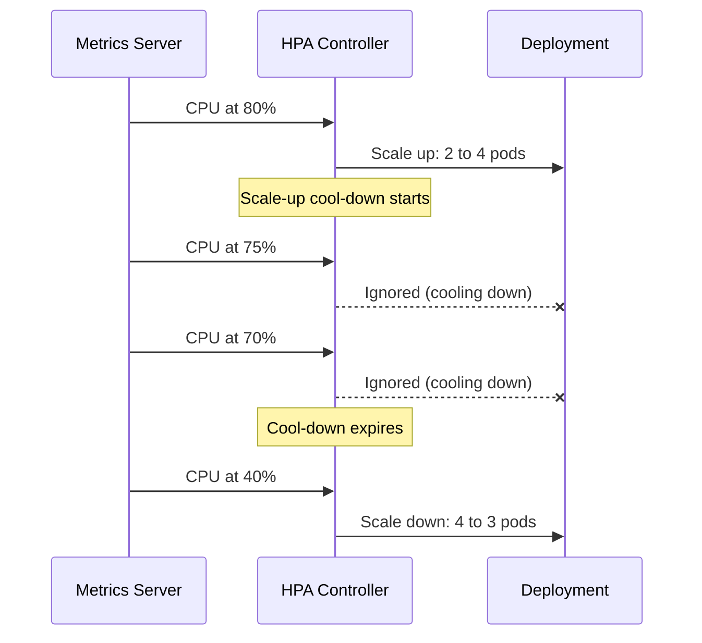
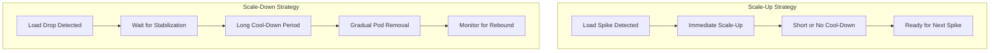
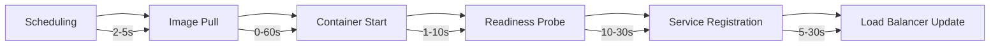
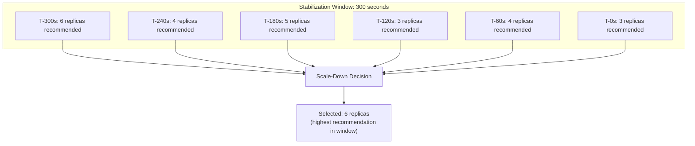
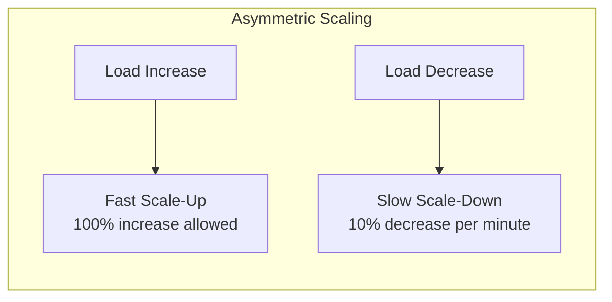
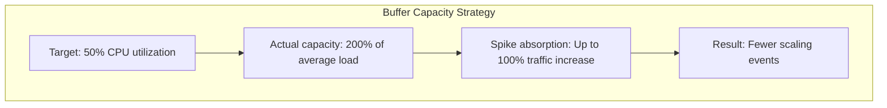

# How to Build Cool-Down Periods

Author: [nawazdhandala](https://github.com/nawazdhandala)

Tags: Auto-Scaling, Kubernetes, Infrastructure, DevOps

Description: Learn how to configure cool-down periods to prevent scaling oscillation.

---

Your autoscaler just triggered. Pods spin up. Traffic normalizes. Then they spin down. Traffic spikes again. More pods. This cycle repeats every few minutes, burning resources and destabilizing your application. This is **scaling oscillation**, also known as flapping, and cool-down periods are your defense against it.

Cool-down periods introduce intentional delays between scaling actions, giving your system time to stabilize before making another decision. Without them, autoscalers react to every metric fluctuation, creating chaos instead of stability.

---

## What Are Cool-Down Periods?

A cool-down period is a waiting interval after a scaling action during which no further scaling decisions are made. It allows metrics to stabilize and prevents rapid, oscillating scale events.



The key insight: **metrics lag behind reality**. When you add pods, it takes time for load balancers to distribute traffic and for new pods to warm up. If you scale again immediately based on stale metrics, you overshoot in both directions.

---

## Scale-Up vs Scale-Down Cool-Down

Not all scaling actions are equal. Scale-up and scale-down have fundamentally different risk profiles and should use different cool-down strategies.

### Scale-Up Cool-Down

Scale-up responds to increasing demand. You want this to happen quickly to maintain performance, so cool-down periods are typically shorter or eliminated entirely.

```yaml
apiVersion: autoscaling/v2
kind: HorizontalPodAutoscaler
metadata:
  name: web-app
  namespace: production
spec:
  scaleTargetRef:
    apiVersion: apps/v1
    kind: Deployment
    name: web-app
  minReplicas: 3
  maxReplicas: 20
  metrics:
    - type: Resource
      resource:
        name: cpu
        target:
          type: Utilization
          averageUtilization: 70
  behavior:
    scaleUp:
      stabilizationWindowSeconds: 0    # React immediately to load spikes
      policies:
        - type: Percent
          value: 100                   # Allow doubling replicas
          periodSeconds: 60            # Evaluate every 60 seconds
        - type: Pods
          value: 4                     # Add at least 4 pods per scale event
          periodSeconds: 60
      selectPolicy: Max                # Use whichever policy adds more pods
```

**Why minimal scale-up cool-down?**
- User experience degrades immediately under load
- Over-provisioning temporarily is cheaper than dropped requests
- New pods take time to become ready anyway

### Scale-Down Cool-Down

Scale-down removes capacity. This is inherently riskier because you cannot instantly reverse the decision if traffic returns. Longer cool-down periods are essential.

```yaml
  behavior:
    scaleDown:
      stabilizationWindowSeconds: 300  # Wait 5 minutes before scaling down
      policies:
        - type: Pods
          value: 1                     # Remove only 1 pod at a time
          periodSeconds: 60            # Evaluate every 60 seconds
        - type: Percent
          value: 10                    # Remove at most 10% of pods
          periodSeconds: 60
      selectPolicy: Min                # Use whichever policy removes fewer pods
```

**Why aggressive scale-down cool-down?**
- Traffic patterns are often bursty and irregular
- Scaling down too fast leads to immediate scale-up needs
- Gradual scale-down allows observation of actual impact



---

## Metric Stabilization Time

The ideal cool-down period depends on how long your metrics take to stabilize after a scaling event. Several factors influence this.

### Pod Startup Time

From scheduling to serving traffic, a pod goes through multiple phases. Your cool-down must account for this entire duration.



**Typical timeline:**
- Fast path (cached images, quick startup): 15-30 seconds
- Average case: 30-90 seconds
- Slow path (large images, warm-up required): 2-5 minutes

### Metric Collection Delay

Metrics don't update instantly. There's inherent lag in the collection pipeline.

```yaml
# Metrics collection timeline
# T+0:   Pod starts handling requests
# T+15s: Metrics scraped by metrics-server
# T+30s: Metrics available to HPA
# T+45s: HPA makes scaling decision
# T+60s: New pods scheduled

# Total lag: ~60 seconds minimum
```

### Calculating Minimum Cool-Down

Use this formula to determine your minimum cool-down period:

```
Minimum Cool-Down = Pod Startup Time + Metric Collection Interval + Safety Buffer

Example:
- Pod startup: 30 seconds
- Metric interval: 15 seconds
- Safety buffer: 30 seconds
- Minimum cool-down: 75 seconds (round up to 90 seconds or 2 minutes)
```

---

## Workload-Specific Configuration

Different workloads have different scaling characteristics. One-size-fits-all cool-down periods lead to either instability or slow responses.

### Web Applications (Stateless)

Web apps scale quickly and handle traffic distribution well.

```yaml
apiVersion: autoscaling/v2
kind: HorizontalPodAutoscaler
metadata:
  name: web-frontend
spec:
  scaleTargetRef:
    apiVersion: apps/v1
    kind: Deployment
    name: web-frontend
  minReplicas: 3
  maxReplicas: 50
  metrics:
    - type: Resource
      resource:
        name: cpu
        target:
          type: Utilization
          averageUtilization: 65
  behavior:
    scaleUp:
      stabilizationWindowSeconds: 0
      policies:
        - type: Percent
          value: 100
          periodSeconds: 15
    scaleDown:
      stabilizationWindowSeconds: 300    # 5 minutes
      policies:
        - type: Percent
          value: 10
          periodSeconds: 60
```

### API Services (Connection-Heavy)

APIs often have connection pools and warm caches that take time to rebuild.

```yaml
apiVersion: autoscaling/v2
kind: HorizontalPodAutoscaler
metadata:
  name: api-service
spec:
  scaleTargetRef:
    apiVersion: apps/v1
    kind: Deployment
    name: api-service
  minReplicas: 5
  maxReplicas: 30
  metrics:
    - type: Resource
      resource:
        name: cpu
        target:
          type: Utilization
          averageUtilization: 60
    - type: Resource
      resource:
        name: memory
        target:
          type: Utilization
          averageUtilization: 70
  behavior:
    scaleUp:
      stabilizationWindowSeconds: 60     # Wait 1 minute for connections to establish
      policies:
        - type: Pods
          value: 3
          periodSeconds: 60
    scaleDown:
      stabilizationWindowSeconds: 600    # 10 minutes - connections need time to drain
      policies:
        - type: Pods
          value: 1
          periodSeconds: 120             # Remove 1 pod every 2 minutes max
```

### Background Workers (Queue-Based)

Workers processing queues can tolerate more aggressive scaling.

```yaml
apiVersion: autoscaling/v2
kind: HorizontalPodAutoscaler
metadata:
  name: queue-worker
spec:
  scaleTargetRef:
    apiVersion: apps/v1
    kind: Deployment
    name: queue-worker
  minReplicas: 2
  maxReplicas: 100
  metrics:
    - type: External
      external:
        metric:
          name: rabbitmq_queue_messages
          selector:
            matchLabels:
              queue: jobs
        target:
          type: AverageValue
          averageValue: "100"            # 100 messages per worker
  behavior:
    scaleUp:
      stabilizationWindowSeconds: 0
      policies:
        - type: Percent
          value: 200                     # Triple workers if queue is backing up
          periodSeconds: 30
    scaleDown:
      stabilizationWindowSeconds: 180    # 3 minutes
      policies:
        - type: Percent
          value: 50                      # Halve workers when queue drains
          periodSeconds: 60
```

### Database Proxies (Connection-Critical)

Database proxies require extreme caution due to connection state.

```yaml
apiVersion: autoscaling/v2
kind: HorizontalPodAutoscaler
metadata:
  name: pgbouncer
spec:
  scaleTargetRef:
    apiVersion: apps/v1
    kind: Deployment
    name: pgbouncer
  minReplicas: 3
  maxReplicas: 10
  metrics:
    - type: Resource
      resource:
        name: cpu
        target:
          type: Utilization
          averageUtilization: 50
  behavior:
    scaleUp:
      stabilizationWindowSeconds: 120    # 2 minutes
      policies:
        - type: Pods
          value: 1                       # Add only 1 at a time
          periodSeconds: 120
    scaleDown:
      stabilizationWindowSeconds: 900    # 15 minutes
      policies:
        - type: Pods
          value: 1
          periodSeconds: 300             # Remove 1 every 5 minutes
```

---

## Stabilization Windows

Kubernetes 1.18+ introduced the `stabilizationWindowSeconds` parameter, which provides sophisticated anti-flapping behavior beyond simple cool-down.

### How Stabilization Windows Work

The stabilization window looks back at all scaling recommendations over a time period and selects the most conservative one.



For scale-down, the HPA selects the **highest** recommendation in the window (most conservative). For scale-up, it selects the **highest** as well (most aggressive response to load).

### Configuring Stabilization Windows

```yaml
behavior:
  scaleUp:
    stabilizationWindowSeconds: 0        # No stabilization for scale-up
  scaleDown:
    stabilizationWindowSeconds: 300      # 5-minute stabilization window
```

**Key difference from simple cool-down:**
- Cool-down: Ignores all recommendations for a fixed period
- Stabilization window: Considers all recommendations and picks the safest

### When to Use Each

| Scenario | Simple Cool-Down | Stabilization Window |
|----------|------------------|---------------------|
| Predictable traffic | Works well | Overkill |
| Spiky traffic | May cause oscillation | Prevents oscillation |
| Gradual ramp-up | Works well | Works well |
| Sudden drops | May over-scale-down | Protects capacity |

---

## Anti-Flapping Strategies

Beyond cool-down periods, several strategies help prevent scaling oscillation.

### Strategy 1: Asymmetric Scaling Rates

Scale up aggressively, scale down conservatively.

```yaml
behavior:
  scaleUp:
    policies:
      - type: Percent
        value: 100                       # Double capacity
        periodSeconds: 30
  scaleDown:
    policies:
      - type: Percent
        value: 10                        # Remove 10% at a time
        periodSeconds: 60
```



### Strategy 2: Hysteresis Thresholds

Use different thresholds for scale-up and scale-down decisions. Kubernetes doesn't support this natively, but you can approximate it with KEDA.

```yaml
apiVersion: keda.sh/v1alpha1
kind: ScaledObject
metadata:
  name: web-app
spec:
  scaleTargetRef:
    name: web-app
  minReplicaCount: 3
  maxReplicaCount: 20
  triggers:
    - type: prometheus
      metadata:
        serverAddress: http://prometheus:9090
        metricName: http_requests_per_second
        query: sum(rate(http_requests_total[2m]))
        threshold: "1000"                # Scale up at 1000 RPS
  advanced:
    horizontalPodAutoscalerConfig:
      behavior:
        scaleDown:
          stabilizationWindowSeconds: 300
          policies:
            - type: Percent
              value: 10
              periodSeconds: 60
```

### Strategy 3: Predictive Pre-Scaling

For predictable traffic patterns, schedule scaling ahead of demand.

```yaml
apiVersion: batch/v1
kind: CronJob
metadata:
  name: pre-scale-morning
spec:
  schedule: "0 8 * * 1-5"               # 8 AM on weekdays
  jobTemplate:
    spec:
      template:
        spec:
          containers:
            - name: scaler
              image: bitnami/kubectl
              command:
                - /bin/sh
                - -c
                - kubectl scale deployment web-app --replicas=10 -n production
          restartPolicy: OnFailure
---
apiVersion: batch/v1
kind: CronJob
metadata:
  name: scale-down-evening
spec:
  schedule: "0 20 * * 1-5"              # 8 PM on weekdays
  jobTemplate:
    spec:
      template:
        spec:
          containers:
            - name: scaler
              image: bitnami/kubectl
              command:
                - /bin/sh
                - -c
                - kubectl scale deployment web-app --replicas=5 -n production
          restartPolicy: OnFailure
```

### Strategy 4: Buffer Capacity

Always maintain extra capacity to absorb spikes without triggering autoscaling.

```yaml
apiVersion: autoscaling/v2
kind: HorizontalPodAutoscaler
metadata:
  name: web-app
spec:
  scaleTargetRef:
    apiVersion: apps/v1
    kind: Deployment
    name: web-app
  minReplicas: 5                         # Higher minimum for buffer
  maxReplicas: 20
  metrics:
    - type: Resource
      resource:
        name: cpu
        target:
          type: Utilization
          averageUtilization: 50         # Lower threshold leaves headroom
```



### Strategy 5: Pod Disruption Budgets

Combine PDBs with HPA to prevent aggressive scale-down from causing availability issues.

```yaml
apiVersion: policy/v1
kind: PodDisruptionBudget
metadata:
  name: web-app-pdb
spec:
  minAvailable: 3                        # Always keep 3 pods running
  selector:
    matchLabels:
      app: web-app
---
apiVersion: autoscaling/v2
kind: HorizontalPodAutoscaler
metadata:
  name: web-app
spec:
  scaleTargetRef:
    apiVersion: apps/v1
    kind: Deployment
    name: web-app
  minReplicas: 3                         # Match PDB minAvailable
  maxReplicas: 20
```

---

## Monitoring Scaling Behavior

You cannot tune what you don't measure. Monitor these metrics to optimize cool-down periods.

### Key Metrics to Track

```yaml
# Prometheus alerts for scaling issues
apiVersion: monitoring.coreos.com/v1
kind: PrometheusRule
metadata:
  name: hpa-alerts
spec:
  groups:
    - name: hpa
      rules:
        - alert: HPAScalingTooFrequent
          expr: |
            increase(kube_hpa_status_current_replicas[10m]) > 5
          for: 5m
          labels:
            severity: warning
          annotations:
            summary: "HPA {{ $labels.hpa }} is scaling too frequently"

        - alert: HPAAtMaxReplicas
          expr: |
            kube_hpa_status_current_replicas == kube_hpa_spec_max_replicas
          for: 15m
          labels:
            severity: warning
          annotations:
            summary: "HPA {{ $labels.hpa }} is at max replicas for 15+ minutes"

        - alert: HPAUnableToScale
          expr: |
            kube_hpa_status_condition{condition="ScalingActive", status="false"} == 1
          for: 5m
          labels:
            severity: critical
          annotations:
            summary: "HPA {{ $labels.hpa }} cannot scale"
```

### Dashboard Queries

```promql
# Scaling events over time
sum(changes(kube_hpa_status_current_replicas[1h])) by (hpa)

# Current vs desired replicas
kube_hpa_status_current_replicas / kube_hpa_status_desired_replicas

# Time spent at max replicas
sum_over_time((kube_hpa_status_current_replicas == kube_hpa_spec_max_replicas)[24h:5m]) * 5

# Scale-up/down frequency
increase(kube_hpa_status_current_replicas[1h])
```

### Tuning Based on Observations

| Observation | Diagnosis | Action |
|-------------|-----------|--------|
| Scaling every 2-3 minutes | Cool-down too short | Increase stabilizationWindowSeconds |
| Slow response to traffic spikes | Scale-up cool-down too long | Reduce scale-up stabilization |
| Pods removed then immediately added | Scale-down too aggressive | Reduce scale-down percentage, increase window |
| Never scaling despite high CPU | Metrics not reaching HPA | Check metrics-server, resource requests |

---

## Complete Example: Production-Ready HPA

Here's a comprehensive HPA configuration incorporating all the strategies discussed.

```yaml
apiVersion: autoscaling/v2
kind: HorizontalPodAutoscaler
metadata:
  name: production-web-app
  namespace: production
  annotations:
    description: "Production web app HPA with anti-flapping configuration"
spec:
  scaleTargetRef:
    apiVersion: apps/v1
    kind: Deployment
    name: web-app

  # Replica bounds
  minReplicas: 5                         # Always maintain buffer capacity
  maxReplicas: 50                        # Cost ceiling

  # Scaling triggers
  metrics:
    - type: Resource
      resource:
        name: cpu
        target:
          type: Utilization
          averageUtilization: 60         # Target 60% to leave headroom
    - type: Resource
      resource:
        name: memory
        target:
          type: Utilization
          averageUtilization: 70

  # Scaling behavior
  behavior:
    # Scale-up: Fast response to load
    scaleUp:
      stabilizationWindowSeconds: 0      # No delay for scale-up
      policies:
        - type: Percent
          value: 100                     # Allow doubling
          periodSeconds: 60
        - type: Pods
          value: 4                       # Add at least 4 pods
          periodSeconds: 60
      selectPolicy: Max                  # Aggressive scale-up

    # Scale-down: Conservative to prevent flapping
    scaleDown:
      stabilizationWindowSeconds: 300    # 5-minute stabilization window
      policies:
        - type: Percent
          value: 10                      # Remove max 10% at a time
          periodSeconds: 120             # Evaluate every 2 minutes
        - type: Pods
          value: 2                       # Remove max 2 pods at a time
          periodSeconds: 120
      selectPolicy: Min                  # Conservative scale-down
```

---

## Common Pitfalls and Solutions

### Pitfall 1: Zero Cool-Down for Scale-Down

```yaml
# BAD: No protection against flapping
behavior:
  scaleDown:
    stabilizationWindowSeconds: 0
```

**Solution:** Always use at least 2-5 minutes of stabilization for scale-down.

### Pitfall 2: Same Settings for All Workloads

Not all services scale the same way. A stateless web server behaves differently than a database proxy.

**Solution:** Create workload-specific HPA templates.

### Pitfall 3: Ignoring Pod Startup Time

If your pods take 2 minutes to become ready but your cool-down is 30 seconds, you'll over-provision.

**Solution:** Set cool-down >= pod startup time + metric lag.

### Pitfall 4: Not Monitoring Scaling Events

Without visibility into scaling behavior, you're tuning blind.

**Solution:** Set up dashboards and alerts for HPA metrics.

---

## Summary

Cool-down periods are essential for stable autoscaling. The key principles:

1. **Scale up fast, scale down slow** - Protect user experience on spikes, protect capacity on drops
2. **Match cool-down to stabilization time** - Account for pod startup and metric collection lag
3. **Customize for workload type** - Stateless apps, APIs, workers, and databases all behave differently
4. **Use stabilization windows** - They're smarter than simple cool-down timers
5. **Monitor and tune** - Track scaling events and adjust based on real behavior

Get cool-down periods right, and your autoscaler becomes a reliable partner. Get them wrong, and you've built an expensive chaos generator.

---

**Related Reading:**
- [How to Autoscale Deployments with the Horizontal Pod Autoscaler](/blog/post/2025-11-27-hpa-autoscale/view)
- [How to Implement Pod Disruption Budgets for Zero-Downtime Updates](/blog/post/2026-01-06-kubernetes-pod-disruption-budgets/view)
- [SRE Metrics to Track](/blog/post/2025-11-28-sre-metrics-to-track/view)
