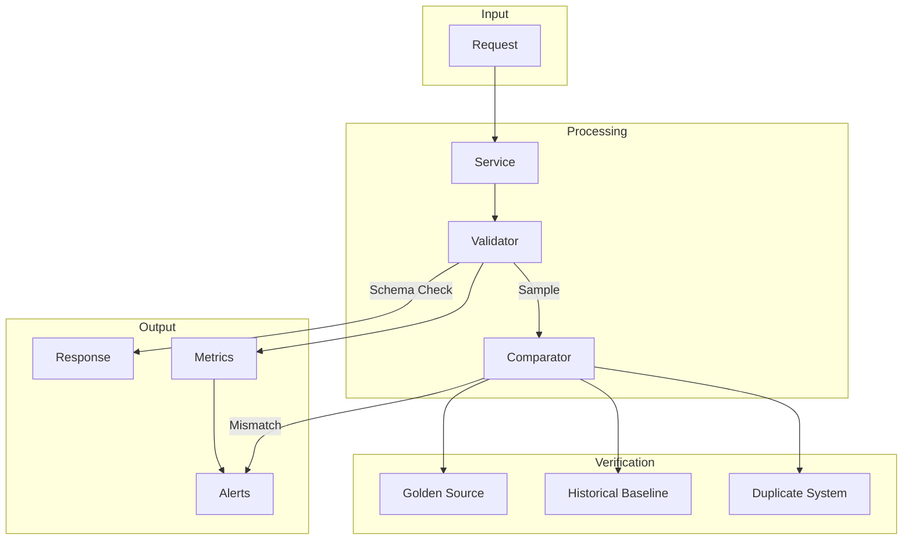
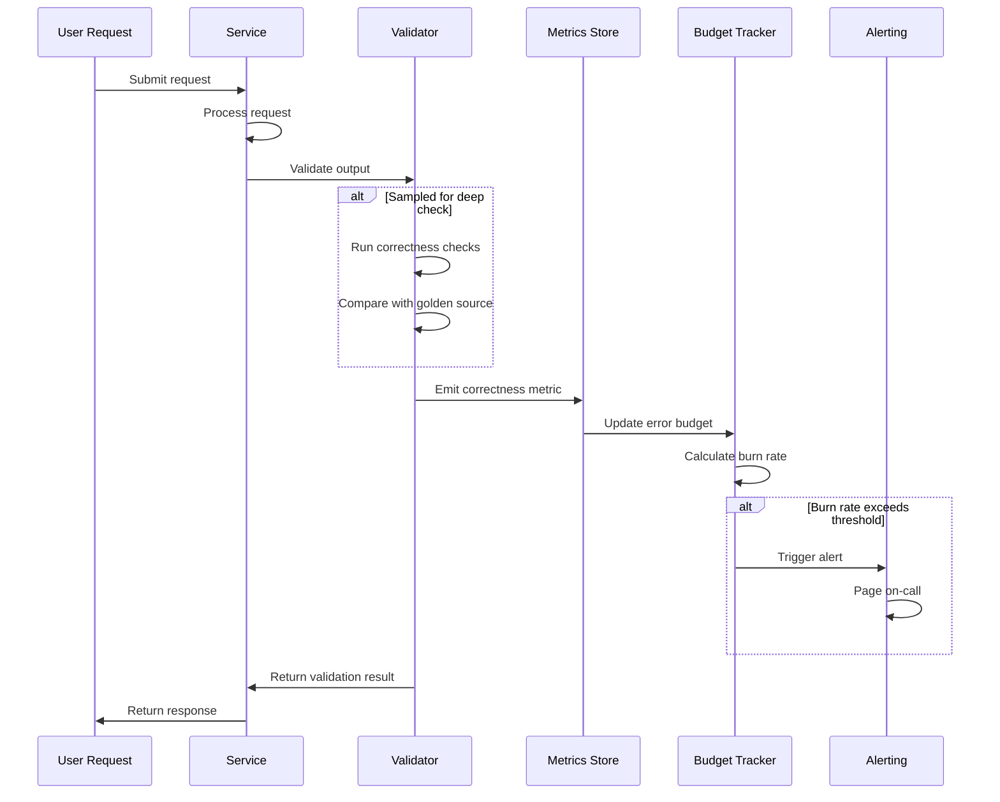

# How to Implement Correctness SLOs

Author: [nawazdhandala](https://github.com/nawazdhandala)

Tags: SRE, SLO, Correctness, DataQuality

Description: Define and measure correctness SLOs to ensure your system produces accurate results and catches data quality issues before users do.

---

Availability tells you if the system responds. Latency tells you how fast. But neither tells you if the answer is right. Correctness SLOs fill that gap by measuring whether your system produces accurate, valid, and consistent results.

## What Is a Correctness SLI?

A Correctness Service Level Indicator (SLI) measures the proportion of outputs that are accurate according to defined validation criteria. Unlike availability (did it respond?) or latency (how fast?), correctness asks: did we return the right answer?

```
Correctness SLI = (Valid Outputs / Total Outputs) * 100
```

Valid outputs meet all correctness criteria:
- Data matches expected format and constraints
- Calculations produce mathematically accurate results
- Results are consistent across redundant systems
- Business rules are correctly applied

## Why Correctness Matters

Silent data corruption is worse than downtime. Users notice when a page fails to load. They may not notice when:
- A financial calculation is off by 0.1%
- Search results omit relevant items
- A recommendation engine returns stale data
- Currency conversions use outdated rates

By the time someone catches the error, damage compounds. Correctness SLOs create early detection.

## Correctness Checking Architecture



## Types of Correctness Validation

### 1. Schema Validation

Verify outputs conform to expected structure and types.

```python
# Schema validation for API responses
from pydantic import BaseModel, Field, validator
from typing import List, Optional
from decimal import Decimal

class OrderItem(BaseModel):
    product_id: str
    quantity: int = Field(gt=0)  # Must be positive
    unit_price: Decimal = Field(ge=0)  # Non-negative price

    @validator('product_id')
    def product_id_format(cls, v):
        # Validate product ID matches expected pattern
        if not v.startswith('PROD-'):
            raise ValueError('Invalid product ID format')
        return v

class OrderResponse(BaseModel):
    order_id: str
    items: List[OrderItem]
    subtotal: Decimal
    tax: Decimal
    total: Decimal

    @validator('total')
    def validate_total(cls, v, values):
        # Verify total equals subtotal plus tax
        expected = values.get('subtotal', 0) + values.get('tax', 0)
        if abs(v - expected) > Decimal('0.01'):
            raise ValueError(f'Total mismatch: {v} != {expected}')
        return v

def validate_order_response(response_data: dict) -> bool:
    """
    Validate order response against schema.
    Returns True if valid, raises ValidationError if not.
    """
    try:
        OrderResponse(**response_data)
        return True
    except Exception as e:
        # Log validation failure for metrics
        log_correctness_failure('schema_validation', str(e))
        raise
```

### 2. Calculation Verification

For systems that perform calculations, verify mathematical accuracy.

```python
# Calculation verification with tolerance
from decimal import Decimal, ROUND_HALF_UP
import logging

class CalculationVerifier:
    def __init__(self, tolerance: Decimal = Decimal('0.001')):
        # Tolerance defines acceptable rounding error
        self.tolerance = tolerance
        self.verification_count = 0
        self.failure_count = 0

    def verify_tax_calculation(
        self,
        subtotal: Decimal,
        tax_rate: Decimal,
        reported_tax: Decimal
    ) -> bool:
        """
        Verify tax calculation is correct within tolerance.
        """
        self.verification_count += 1

        # Calculate expected tax with proper rounding
        expected_tax = (subtotal * tax_rate).quantize(
            Decimal('0.01'),
            rounding=ROUND_HALF_UP
        )

        difference = abs(reported_tax - expected_tax)

        if difference > self.tolerance:
            self.failure_count += 1
            logging.error(
                f"Tax calculation error: "
                f"expected={expected_tax}, got={reported_tax}, "
                f"diff={difference}"
            )
            # Emit metric for correctness SLI
            emit_correctness_metric(
                check_type='tax_calculation',
                is_correct=False,
                error_magnitude=float(difference)
            )
            return False

        emit_correctness_metric(
            check_type='tax_calculation',
            is_correct=True
        )
        return True

    def get_correctness_ratio(self) -> float:
        """
        Return the correctness SLI value.
        """
        if self.verification_count == 0:
            return 1.0
        return (self.verification_count - self.failure_count) / self.verification_count
```

### 3. Cross-System Comparison

Compare outputs between primary and secondary systems.

```python
# Cross-system comparison for correctness verification
import hashlib
import json
from typing import Any, Dict, Tuple
from dataclasses import dataclass
from datetime import datetime

@dataclass
class ComparisonResult:
    matches: bool
    primary_hash: str
    secondary_hash: str
    checked_at: datetime
    differences: list

class CrossSystemVerifier:
    def __init__(self, primary_client, secondary_client):
        self.primary = primary_client
        self.secondary = secondary_client
        self.comparison_count = 0
        self.mismatch_count = 0

    def normalize_response(self, data: Dict[str, Any]) -> Dict[str, Any]:
        """
        Normalize response data for comparison.
        Remove timestamps, request IDs, and other non-deterministic fields.
        """
        excluded_keys = {'timestamp', 'request_id', 'trace_id', 'cache_hit'}
        return {
            k: v for k, v in sorted(data.items())
            if k not in excluded_keys
        }

    def compute_hash(self, data: Dict[str, Any]) -> str:
        """
        Compute deterministic hash of normalized data.
        """
        normalized = self.normalize_response(data)
        json_str = json.dumps(normalized, sort_keys=True, default=str)
        return hashlib.sha256(json_str.encode()).hexdigest()[:16]

    def compare(self, request: Dict[str, Any]) -> ComparisonResult:
        """
        Execute request against both systems and compare results.
        """
        self.comparison_count += 1

        # Query both systems
        primary_result = self.primary.execute(request)
        secondary_result = self.secondary.execute(request)

        # Compute hashes for comparison
        primary_hash = self.compute_hash(primary_result)
        secondary_hash = self.compute_hash(secondary_result)

        matches = primary_hash == secondary_hash
        differences = []

        if not matches:
            self.mismatch_count += 1
            differences = self.find_differences(primary_result, secondary_result)

            # Log mismatch for investigation
            log_correctness_mismatch(
                request=request,
                primary=primary_result,
                secondary=secondary_result,
                differences=differences
            )

        # Emit correctness metric
        emit_correctness_metric(
            check_type='cross_system',
            is_correct=matches
        )

        return ComparisonResult(
            matches=matches,
            primary_hash=primary_hash,
            secondary_hash=secondary_hash,
            checked_at=datetime.utcnow(),
            differences=differences
        )

    def find_differences(
        self,
        primary: Dict[str, Any],
        secondary: Dict[str, Any]
    ) -> list:
        """
        Identify specific fields that differ between systems.
        """
        differences = []
        all_keys = set(primary.keys()) | set(secondary.keys())

        for key in all_keys:
            p_val = primary.get(key)
            s_val = secondary.get(key)
            if p_val != s_val:
                differences.append({
                    'field': key,
                    'primary_value': p_val,
                    'secondary_value': s_val
                })

        return differences
```

## Sampling Strategies

Checking every output is expensive. Smart sampling balances coverage with cost.

### Stratified Sampling

Sample proportionally across different request types.

```python
# Stratified sampling for correctness checks
import random
from collections import defaultdict
from typing import Callable, Dict, Any

class StratifiedSampler:
    def __init__(self, default_rate: float = 0.01):
        # Default: check 1% of requests
        self.default_rate = default_rate
        self.category_rates = {}
        self.category_counts = defaultdict(int)
        self.checked_counts = defaultdict(int)

    def set_category_rate(self, category: str, rate: float):
        """
        Set sampling rate for a specific category.
        Higher rates for high-value or high-risk operations.
        """
        self.category_rates[category] = rate

    def should_check(self, category: str) -> bool:
        """
        Determine if this request should be checked for correctness.
        """
        self.category_counts[category] += 1
        rate = self.category_rates.get(category, self.default_rate)

        if random.random() < rate:
            self.checked_counts[category] += 1
            return True
        return False

    def get_stats(self) -> Dict[str, Dict[str, int]]:
        """
        Return sampling statistics by category.
        """
        return {
            category: {
                'total': self.category_counts[category],
                'checked': self.checked_counts[category],
                'rate': self.checked_counts[category] / max(self.category_counts[category], 1)
            }
            for category in self.category_counts
        }

# Configure sampler with category-specific rates
sampler = StratifiedSampler(default_rate=0.01)
sampler.set_category_rate('payment', 0.10)      # 10% of payments
sampler.set_category_rate('high_value', 0.50)   # 50% of high-value orders
sampler.set_category_rate('new_customer', 0.25) # 25% of new customer orders
```

### Adaptive Sampling

Increase sampling when errors are detected.

```python
# Adaptive sampling that increases rate when errors occur
from datetime import datetime, timedelta
from collections import deque

class AdaptiveSampler:
    def __init__(
        self,
        base_rate: float = 0.01,
        max_rate: float = 1.0,
        window_seconds: int = 300
    ):
        self.base_rate = base_rate
        self.max_rate = max_rate
        self.window = timedelta(seconds=window_seconds)
        self.recent_errors = deque()
        self.current_rate = base_rate

    def record_error(self):
        """
        Record a correctness error, which increases sampling rate.
        """
        self.recent_errors.append(datetime.utcnow())
        self.update_rate()

    def update_rate(self):
        """
        Adjust sampling rate based on recent error frequency.
        """
        now = datetime.utcnow()
        cutoff = now - self.window

        # Remove old errors outside the window
        while self.recent_errors and self.recent_errors[0] < cutoff:
            self.recent_errors.popleft()

        error_count = len(self.recent_errors)

        # Scale rate based on error count
        # 0 errors: base rate
        # 5+ errors: max rate
        if error_count == 0:
            self.current_rate = self.base_rate
        else:
            scale = min(error_count / 5.0, 1.0)
            self.current_rate = self.base_rate + scale * (self.max_rate - self.base_rate)

    def should_check(self) -> bool:
        """
        Determine if this request should be checked.
        """
        self.update_rate()
        return random.random() < self.current_rate
```

## Correctness SLO Definition

Define your correctness target based on business requirements.

```yaml
# Correctness SLO configuration
correctness_slos:
  - name: order_calculation_accuracy
    description: Order totals match expected calculations
    target: 99.99      # 99.99% of orders must be calculated correctly
    window: 30d        # Rolling 30-day window

    sli:
      type: correctness
      numerator: orders_with_correct_totals
      denominator: total_orders_checked

    error_budget:
      monthly_budget: 0.01   # 0.01% error budget
      burn_rate_alert: 2.0   # Alert if burning 2x normal rate

  - name: search_result_relevance
    description: Search results contain expected items
    target: 99.5       # 99.5% of searches return relevant results
    window: 7d

    sli:
      type: correctness
      numerator: searches_with_relevant_results
      denominator: total_searches_checked

  - name: data_consistency
    description: Data matches between primary and replica
    target: 99.999     # Five nines consistency
    window: 30d

    sli:
      type: correctness
      numerator: consistent_reads
      denominator: total_cross_system_checks
```

## Error Budget for Incorrect Results

Track and alert on correctness error budget consumption.

```python
# Error budget tracker for correctness SLOs
from dataclasses import dataclass
from datetime import datetime, timedelta
from typing import Optional

@dataclass
class ErrorBudgetStatus:
    total_budget: float        # Total allowed errors as percentage
    consumed: float            # Percentage consumed
    remaining: float           # Percentage remaining
    burn_rate: float           # Current burn rate (1.0 = normal)
    estimated_exhaustion: Optional[datetime]

class CorrectnessErrorBudget:
    def __init__(
        self,
        slo_target: float,       # e.g., 99.99
        window_days: int = 30
    ):
        self.slo_target = slo_target
        self.error_budget_percent = 100.0 - slo_target  # e.g., 0.01%
        self.window = timedelta(days=window_days)
        self.events = []  # List of (timestamp, is_correct) tuples

    def record_check(self, is_correct: bool):
        """
        Record a correctness check result.
        """
        self.events.append((datetime.utcnow(), is_correct))
        self.prune_old_events()

    def prune_old_events(self):
        """
        Remove events outside the SLO window.
        """
        cutoff = datetime.utcnow() - self.window
        self.events = [
            (ts, correct) for ts, correct in self.events
            if ts >= cutoff
        ]

    def get_status(self) -> ErrorBudgetStatus:
        """
        Calculate current error budget status.
        """
        if not self.events:
            return ErrorBudgetStatus(
                total_budget=self.error_budget_percent,
                consumed=0.0,
                remaining=self.error_budget_percent,
                burn_rate=0.0,
                estimated_exhaustion=None
            )

        total_checks = len(self.events)
        errors = sum(1 for _, correct in self.events if not correct)
        error_rate = (errors / total_checks) * 100

        consumed = min(error_rate / self.error_budget_percent * 100, 100.0)
        remaining = max(self.error_budget_percent - error_rate, 0.0)

        # Calculate burn rate (1.0 = consuming budget at expected rate)
        expected_rate = self.error_budget_percent / self.window.days
        actual_rate = error_rate / max((datetime.utcnow() - self.events[0][0]).days, 1)
        burn_rate = actual_rate / expected_rate if expected_rate > 0 else 0

        # Estimate exhaustion time
        exhaustion = None
        if burn_rate > 1.0 and remaining > 0:
            days_remaining = remaining / (actual_rate - expected_rate)
            exhaustion = datetime.utcnow() + timedelta(days=days_remaining)

        return ErrorBudgetStatus(
            total_budget=self.error_budget_percent,
            consumed=consumed,
            remaining=remaining,
            burn_rate=burn_rate,
            estimated_exhaustion=exhaustion
        )

    def should_alert(self, burn_rate_threshold: float = 2.0) -> bool:
        """
        Determine if burn rate warrants an alert.
        """
        status = self.get_status()
        return status.burn_rate >= burn_rate_threshold
```

## Correctness Monitoring Flow



## Implementing Correctness Metrics

Export correctness metrics for your observability platform.

```python
# OpenTelemetry metrics for correctness SLOs
from opentelemetry import metrics
from opentelemetry.sdk.metrics import MeterProvider
from opentelemetry.sdk.metrics.export import PeriodicExportingMetricReader

# Initialize meter
meter = metrics.get_meter("correctness_slo")

# Counter for total correctness checks
correctness_checks = meter.create_counter(
    name="correctness_checks_total",
    description="Total number of correctness checks performed",
    unit="1"
)

# Counter for correctness failures
correctness_failures = meter.create_counter(
    name="correctness_failures_total",
    description="Total number of correctness check failures",
    unit="1"
)

# Histogram for error magnitude when applicable
error_magnitude = meter.create_histogram(
    name="correctness_error_magnitude",
    description="Magnitude of correctness errors",
    unit="1"
)

def emit_correctness_metric(
    check_type: str,
    is_correct: bool,
    error_magnitude_value: float = None,
    labels: dict = None
):
    """
    Emit correctness check metrics.
    """
    attributes = {
        "check_type": check_type,
        "result": "correct" if is_correct else "incorrect"
    }
    if labels:
        attributes.update(labels)

    # Always increment total checks
    correctness_checks.add(1, attributes)

    # Increment failures if incorrect
    if not is_correct:
        correctness_failures.add(1, attributes)

        # Record error magnitude if provided
        if error_magnitude_value is not None:
            error_magnitude.record(error_magnitude_value, attributes)
```

## Correctness SLO Dashboard Query

Use these queries to build correctness dashboards.

```promql
# Correctness SLI: percentage of correct results
(
  sum(rate(correctness_checks_total{result="correct"}[5m]))
  /
  sum(rate(correctness_checks_total[5m]))
) * 100

# Error budget consumption rate
(
  sum(rate(correctness_failures_total[1h]))
  /
  sum(rate(correctness_checks_total[1h]))
) / (1 - 0.9999) # Divide by error budget percentage

# Burn rate for alerting
(
  sum(rate(correctness_failures_total[1h]))
  /
  sum(rate(correctness_checks_total[1h]))
)
/
(
  sum(rate(correctness_failures_total[30d]))
  /
  sum(rate(correctness_checks_total[30d]))
)
```

## Best Practices

1. **Start with high-value transactions**: Check payments, inventory updates, and financial calculations first
2. **Use golden datasets**: Maintain known-good inputs with verified outputs for regression testing
3. **Sample intelligently**: Check more aggressively for new features, high-value customers, and after deployments
4. **Set realistic targets**: Five nines correctness (99.999%) is harder than five nines availability
5. **Automate verification**: Manual spot-checks do not scale
6. **Track error types**: Distinguish between calculation errors, data format errors, and consistency errors
7. **Correlate with deployments**: Mark deploys in your metrics to catch correctness regressions early

## Common Pitfalls

| Pitfall | Impact | Mitigation |
| --- | --- | --- |
| Checking 100% of requests | Performance degradation, high cost | Use statistical sampling |
| Ignoring floating-point precision | False positives on valid calculations | Define tolerance thresholds |
| No baseline for comparison | Cannot detect gradual drift | Establish and maintain golden sources |
| Alerting on every error | Alert fatigue | Use error budget burn rate |
| Missing edge cases | Errors slip through | Include boundary values in test sets |

---

Availability and latency tell you the system works. Correctness tells you it works right. Build correctness SLOs to catch silent failures before your users do.
