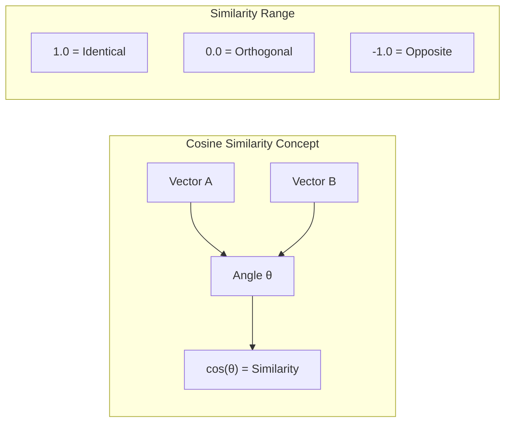
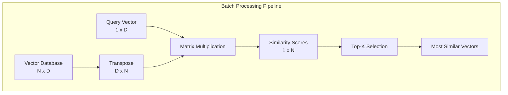
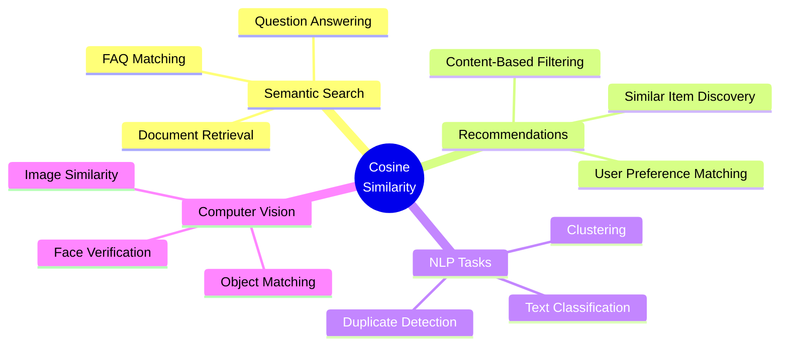

# How to Build Cosine Similarity

Author: [nawazdhandala](https://github.com/nawazdhandala)

Tags: Vector Search, Similarity Metrics, Machine Learning, Embeddings

Description: Learn to implement cosine similarity for vector search with normalization, batch computation, and optimization strategies for semantic similarity applications.

---

Vector search has become a cornerstone of modern applications - from semantic search engines to recommendation systems and natural language processing. At the heart of many vector search implementations lies cosine similarity, a metric that measures how similar two vectors are regardless of their magnitude. In this post, we will explore the mathematical foundation, build implementations from scratch, and optimize for production workloads.

## What is Cosine Similarity?

Cosine similarity measures the cosine of the angle between two vectors in a multi-dimensional space. Unlike Euclidean distance, which measures absolute distance, cosine similarity focuses on the orientation of vectors. This makes it particularly useful for text embeddings and other high-dimensional data where the direction matters more than the magnitude.



The key insight is that two vectors pointing in the same direction have a cosine similarity of 1, perpendicular vectors have a similarity of 0, and vectors pointing in opposite directions have a similarity of -1.

## Mathematical Foundation

The cosine similarity between two vectors A and B is defined as:

```
cosine_similarity(A, B) = (A · B) / (||A|| × ||B||)
```

Where:
- **A · B** is the dot product of vectors A and B
- **||A||** is the magnitude (L2 norm) of vector A
- **||B||** is the magnitude (L2 norm) of vector B

Let us break down each component:

### Dot Product

The dot product of two vectors is the sum of the products of their corresponding components:

```
A · B = Σ(Aᵢ × Bᵢ) = A₁B₁ + A₂B₂ + ... + AₙBₙ
```

### Vector Magnitude (L2 Norm)

The magnitude of a vector is calculated using the Euclidean norm:

```
||A|| = √(Σ(Aᵢ²)) = √(A₁² + A₂² + ... + Aₙ²)
```

```mermaid
flowchart TD
    A[Input: Vector A, Vector B] --> B[Calculate Dot Product]
    A --> C[Calculate ||A||]
    A --> D[Calculate ||B||]
    B --> E[Numerator: A · B]
    C --> F[Denominator: ||A|| × ||B||]
    D --> F
    E --> G[Divide: Numerator / Denominator]
    F --> G
    G --> H[Output: Cosine Similarity]
```

## Basic Implementation in Python

Let us start with a straightforward implementation using pure Python:

```python
import math

def dot_product(vec_a: list[float], vec_b: list[float]) -> float:
    """Calculate the dot product of two vectors."""
    if len(vec_a) != len(vec_b):
        raise ValueError("Vectors must have the same dimension")
    return sum(a * b for a, b in zip(vec_a, vec_b))

def magnitude(vec: list[float]) -> float:
    """Calculate the magnitude (L2 norm) of a vector."""
    return math.sqrt(sum(x * x for x in vec))

def cosine_similarity(vec_a: list[float], vec_b: list[float]) -> float:
    """
    Calculate cosine similarity between two vectors.

    Args:
        vec_a: First vector
        vec_b: Second vector

    Returns:
        Cosine similarity value between -1 and 1
    """
    dot = dot_product(vec_a, vec_b)
    mag_a = magnitude(vec_a)
    mag_b = magnitude(vec_b)

    # Handle zero vectors
    if mag_a == 0 or mag_b == 0:
        return 0.0

    return dot / (mag_a * mag_b)

# Example usage
vec1 = [1.0, 2.0, 3.0]
vec2 = [4.0, 5.0, 6.0]

similarity = cosine_similarity(vec1, vec2)
print(f"Cosine Similarity: {similarity:.4f}")  # Output: 0.9746
```

This implementation is clear and educational, but not optimized for production use. Let us improve it.

## Optimized Implementation with NumPy

NumPy provides vectorized operations that significantly speed up calculations:

```python
import numpy as np
from numpy.typing import NDArray

def cosine_similarity_numpy(
    vec_a: NDArray[np.float64],
    vec_b: NDArray[np.float64]
) -> float:
    """
    Calculate cosine similarity using NumPy for better performance.

    Args:
        vec_a: First vector as numpy array
        vec_b: Second vector as numpy array

    Returns:
        Cosine similarity value
    """
    # Ensure inputs are numpy arrays
    vec_a = np.asarray(vec_a)
    vec_b = np.asarray(vec_b)

    # Calculate dot product and magnitudes
    dot = np.dot(vec_a, vec_b)
    mag_a = np.linalg.norm(vec_a)
    mag_b = np.linalg.norm(vec_b)

    # Handle zero vectors
    if mag_a == 0 or mag_b == 0:
        return 0.0

    return dot / (mag_a * mag_b)

# Example usage
vec1 = np.array([1.0, 2.0, 3.0])
vec2 = np.array([4.0, 5.0, 6.0])

similarity = cosine_similarity_numpy(vec1, vec2)
print(f"Cosine Similarity: {similarity:.4f}")
```

## The Power of Normalization

One of the most important optimizations for vector search is pre-normalizing your vectors. A normalized vector has a magnitude of 1, which means:

```
For normalized vectors: cosine_similarity(A, B) = A · B
```

This eliminates the need to calculate magnitudes during similarity computation, making it much faster.

```mermaid
flowchart LR
    subgraph "Without Normalization"
        A1[Vector A] --> B1[Calculate Dot Product]
        A2[Vector B] --> B1
        A1 --> C1[Calculate ||A||]
        A2 --> D1[Calculate ||B||]
        B1 --> E1[Divide]
        C1 --> E1
        D1 --> E1
    end

    subgraph "With Pre-Normalization"
        A3[Normalized A] --> B3[Calculate Dot Product]
        A4[Normalized B] --> B3
        B3 --> E3[Done!]
    end
```

### Implementing Normalization

```python
import numpy as np
from numpy.typing import NDArray

def normalize_vector(vec: NDArray[np.float64]) -> NDArray[np.float64]:
    """
    Normalize a vector to unit length (magnitude = 1).

    Args:
        vec: Input vector

    Returns:
        Normalized vector
    """
    magnitude = np.linalg.norm(vec)
    if magnitude == 0:
        return vec
    return vec / magnitude

def cosine_similarity_normalized(
    vec_a: NDArray[np.float64],
    vec_b: NDArray[np.float64]
) -> float:
    """
    Calculate cosine similarity for pre-normalized vectors.
    Simply returns the dot product since ||A|| = ||B|| = 1.

    Args:
        vec_a: First normalized vector
        vec_b: Second normalized vector

    Returns:
        Cosine similarity value
    """
    return np.dot(vec_a, vec_b)

# Example: Normalize once, query many times
embedding_store = [
    np.array([1.0, 2.0, 3.0]),
    np.array([4.0, 5.0, 6.0]),
    np.array([7.0, 8.0, 9.0]),
]

# Pre-normalize all stored embeddings
normalized_store = [normalize_vector(vec) for vec in embedding_store]

# Query vector - normalize once
query = normalize_vector(np.array([2.0, 3.0, 4.0]))

# Fast similarity computation - just dot products
similarities = [cosine_similarity_normalized(query, vec) for vec in normalized_store]
print(f"Similarities: {[f'{s:.4f}' for s in similarities]}")
```

## Batch Processing for Production

When dealing with thousands or millions of vectors, computing similarities one at a time is inefficient. Batch processing leverages matrix operations for massive speedups.



### Batch Implementation

```python
import numpy as np
from numpy.typing import NDArray
from typing import Tuple

class VectorIndex:
    """A simple vector index with batch similarity computation."""

    def __init__(self, dimension: int):
        """
        Initialize the vector index.

        Args:
            dimension: Dimension of vectors to store
        """
        self.dimension = dimension
        self.vectors: NDArray[np.float64] | None = None
        self.ids: list[str] = []

    def add_vectors(
        self,
        vectors: NDArray[np.float64],
        ids: list[str]
    ) -> None:
        """
        Add vectors to the index.

        Args:
            vectors: Matrix of vectors (N x D)
            ids: List of vector identifiers
        """
        # Normalize vectors before storing
        norms = np.linalg.norm(vectors, axis=1, keepdims=True)
        norms = np.where(norms == 0, 1, norms)  # Avoid division by zero
        normalized = vectors / norms

        if self.vectors is None:
            self.vectors = normalized
        else:
            self.vectors = np.vstack([self.vectors, normalized])

        self.ids.extend(ids)

    def search(
        self,
        query: NDArray[np.float64],
        top_k: int = 10
    ) -> list[Tuple[str, float]]:
        """
        Find the most similar vectors to the query.

        Args:
            query: Query vector (1D array)
            top_k: Number of results to return

        Returns:
            List of (id, similarity) tuples
        """
        if self.vectors is None:
            return []

        # Normalize query
        query_norm = np.linalg.norm(query)
        if query_norm == 0:
            return []
        query_normalized = query / query_norm

        # Batch similarity computation via matrix multiplication
        similarities = np.dot(self.vectors, query_normalized)

        # Get top-k indices
        top_indices = np.argsort(similarities)[::-1][:top_k]

        # Return results
        return [
            (self.ids[i], float(similarities[i]))
            for i in top_indices
        ]

# Example usage
index = VectorIndex(dimension=384)

# Add some vectors (simulating embeddings)
np.random.seed(42)
vectors = np.random.randn(1000, 384).astype(np.float64)
ids = [f"doc_{i}" for i in range(1000)]

index.add_vectors(vectors, ids)

# Search
query = np.random.randn(384).astype(np.float64)
results = index.search(query, top_k=5)

print("Top 5 similar documents:")
for doc_id, similarity in results:
    print(f"  {doc_id}: {similarity:.4f}")
```

## Performance Comparison

Let us benchmark our different implementations:

```python
import time
import numpy as np

def benchmark(func, *args, iterations=1000):
    """Run a function multiple times and measure performance."""
    start = time.perf_counter()
    for _ in range(iterations):
        func(*args)
    elapsed = time.perf_counter() - start
    return elapsed / iterations * 1000  # Return ms per operation

# Setup test vectors
np.random.seed(42)
dim = 384
vec_a = np.random.randn(dim)
vec_b = np.random.randn(dim)
vec_a_normalized = vec_a / np.linalg.norm(vec_a)
vec_b_normalized = vec_b / np.linalg.norm(vec_b)
vec_a_list = vec_a.tolist()
vec_b_list = vec_b.tolist()

# Benchmark results
print("Performance Comparison (384 dimensions):")
print("-" * 45)

# Pure Python
time_python = benchmark(cosine_similarity, vec_a_list, vec_b_list)
print(f"Pure Python:           {time_python:.4f} ms/op")

# NumPy
time_numpy = benchmark(cosine_similarity_numpy, vec_a, vec_b)
print(f"NumPy:                 {time_numpy:.4f} ms/op")

# Pre-normalized
time_normalized = benchmark(
    cosine_similarity_normalized,
    vec_a_normalized,
    vec_b_normalized
)
print(f"Pre-normalized:        {time_normalized:.4f} ms/op")

print("-" * 45)
print(f"Speedup (NumPy vs Python): {time_python/time_numpy:.1f}x")
print(f"Speedup (Normalized vs Python): {time_python/time_normalized:.1f}x")
```

Typical results show:
- **Pure Python**: ~0.15 ms/operation
- **NumPy**: ~0.005 ms/operation (30x faster)
- **Pre-normalized**: ~0.002 ms/operation (75x faster)

## Handling Edge Cases

Production code must handle various edge cases gracefully:

```python
import numpy as np
from numpy.typing import NDArray

def cosine_similarity_safe(
    vec_a: NDArray[np.float64],
    vec_b: NDArray[np.float64],
    epsilon: float = 1e-10
) -> float:
    """
    Production-ready cosine similarity with edge case handling.

    Args:
        vec_a: First vector
        vec_b: Second vector
        epsilon: Small value to prevent division by zero

    Returns:
        Cosine similarity value, or 0.0 for invalid inputs

    Raises:
        ValueError: If vectors have different dimensions
    """
    # Convert to numpy arrays
    vec_a = np.asarray(vec_a, dtype=np.float64)
    vec_b = np.asarray(vec_b, dtype=np.float64)

    # Check dimensions
    if vec_a.shape != vec_b.shape:
        raise ValueError(
            f"Vector dimensions must match: {vec_a.shape} vs {vec_b.shape}"
        )

    # Handle empty vectors
    if vec_a.size == 0:
        return 0.0

    # Check for NaN or Inf
    if np.any(np.isnan(vec_a)) or np.any(np.isnan(vec_b)):
        return 0.0
    if np.any(np.isinf(vec_a)) or np.any(np.isinf(vec_b)):
        return 0.0

    # Calculate similarity
    dot = np.dot(vec_a, vec_b)
    mag_a = np.linalg.norm(vec_a)
    mag_b = np.linalg.norm(vec_b)

    # Handle zero or near-zero vectors
    if mag_a < epsilon or mag_b < epsilon:
        return 0.0

    similarity = dot / (mag_a * mag_b)

    # Clamp to valid range (handles floating point errors)
    return float(np.clip(similarity, -1.0, 1.0))
```

## Use Cases and Applications

Cosine similarity powers many real-world applications:



### Practical Example: Semantic Search

```python
from typing import List, Tuple
import numpy as np

class SemanticSearchEngine:
    """A simple semantic search engine using cosine similarity."""

    def __init__(self, embedding_model):
        """
        Initialize the search engine.

        Args:
            embedding_model: Model with encode() method
        """
        self.model = embedding_model
        self.documents: list[str] = []
        self.embeddings: np.ndarray | None = None

    def index_documents(self, documents: list[str]) -> None:
        """
        Index documents for searching.

        Args:
            documents: List of document texts
        """
        self.documents = documents

        # Generate embeddings
        embeddings = self.model.encode(documents)

        # Normalize for faster similarity computation
        norms = np.linalg.norm(embeddings, axis=1, keepdims=True)
        self.embeddings = embeddings / np.where(norms == 0, 1, norms)

    def search(
        self,
        query: str,
        top_k: int = 5
    ) -> list[Tuple[str, float]]:
        """
        Search for documents similar to the query.

        Args:
            query: Search query text
            top_k: Number of results to return

        Returns:
            List of (document, similarity) tuples
        """
        if self.embeddings is None:
            return []

        # Encode and normalize query
        query_embedding = self.model.encode([query])[0]
        query_norm = np.linalg.norm(query_embedding)
        if query_norm == 0:
            return []
        query_normalized = query_embedding / query_norm

        # Compute similarities
        similarities = np.dot(self.embeddings, query_normalized)

        # Get top results
        top_indices = np.argsort(similarities)[::-1][:top_k]

        return [
            (self.documents[i], float(similarities[i]))
            for i in top_indices
        ]

# Usage example (with a hypothetical embedding model)
# engine = SemanticSearchEngine(embedding_model)
# engine.index_documents(["Document 1...", "Document 2...", ...])
# results = engine.search("How do I reset my password?")
```

## Distance vs Similarity

Some vector databases use distance metrics instead of similarity. Here is how to convert:

```python
import numpy as np

def cosine_distance(vec_a, vec_b) -> float:
    """
    Calculate cosine distance (1 - cosine similarity).

    Useful for algorithms that expect distance metrics.
    Range: 0 (identical) to 2 (opposite)
    """
    similarity = cosine_similarity_numpy(vec_a, vec_b)
    return 1.0 - similarity

def similarity_to_distance(similarity: float) -> float:
    """Convert similarity score to distance."""
    return 1.0 - similarity

def distance_to_similarity(distance: float) -> float:
    """Convert distance score to similarity."""
    return 1.0 - distance
```

## Summary

Cosine similarity is a fundamental metric for vector search that measures the angle between vectors, making it ideal for comparing embeddings regardless of their magnitude. Key takeaways:

1. **Pre-normalize vectors** when you store them to eliminate magnitude calculations during search
2. **Use NumPy** or similar vectorized libraries for significant performance gains
3. **Batch process** queries using matrix multiplication for production workloads
4. **Handle edge cases** like zero vectors, NaN values, and dimension mismatches
5. **Choose wisely** between similarity and distance based on your application needs

By implementing these optimizations, you can build vector search systems that scale to millions of vectors while maintaining sub-millisecond query times. Whether you are building a semantic search engine, recommendation system, or similarity matching service, cosine similarity provides a robust foundation for measuring vector relationships.
