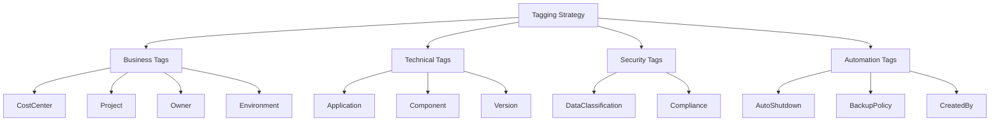
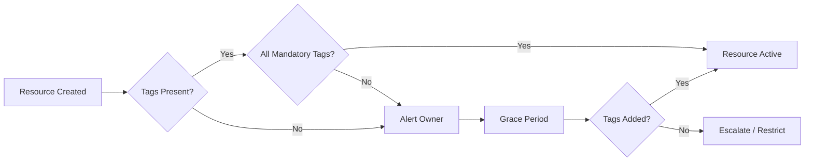
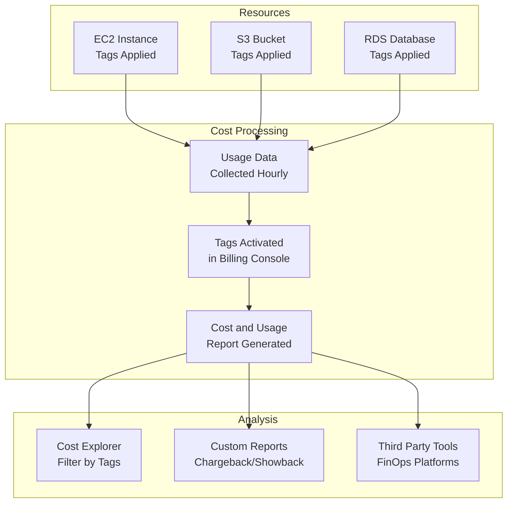
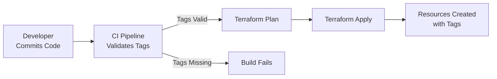

# How to Implement Cost Allocation Tags

Author: [nawazdhandala](https://github.com/nawazdhandala)

Tags: FinOps, Cloud, Cost Optimization, Tagging

Description: Learn how to implement cost allocation tags for tracking cloud spending by team and project.

---

Cost allocation tags are the foundation of cloud financial management. Without proper tagging, your cloud bill becomes an undifferentiated mass of charges that cannot be attributed to specific teams, projects, or cost centers. This guide walks you through implementing a robust tagging strategy across AWS, GCP, and Azure.

## Why Cost Allocation Tags Matter

Organizations often discover that 30 to 50 percent of their cloud spend cannot be attributed to any specific business function. This "unallocated spend" creates accountability gaps and makes it impossible to optimize costs effectively.

Cost allocation tags solve this by:

- Enabling chargeback and showback reporting
- Identifying cost optimization opportunities by team or project
- Supporting budget forecasting and anomaly detection
- Providing visibility into resource ownership

## Tagging Strategy Overview

Before implementing tags, you need a clear strategy. The following diagram illustrates a typical tagging hierarchy:



## Mandatory Tags for Cost Allocation

Define a set of mandatory tags that must be applied to all resources. Here is a recommended minimum set:

| Tag Key | Description | Example Values |
|---------|-------------|----------------|
| `CostCenter` | Financial cost center code | `CC-1234`, `Engineering` |
| `Project` | Project or product name | `mobile-app`, `data-platform` |
| `Owner` | Team or individual responsible | `platform-team`, `john.doe` |
| `Environment` | Deployment environment | `production`, `staging`, `development` |

## Tag Compliance Workflow

Implementing tags is only half the battle. You need a process to ensure compliance:



## AWS Tagging Implementation

### Tagging Resources with AWS CLI

```bash
# Tag an EC2 instance with cost allocation tags
# Replace i-1234567890abcdef0 with your instance ID
aws ec2 create-tags \
    --resources i-1234567890abcdef0 \
    --tags \
        Key=CostCenter,Value=CC-Engineering \
        Key=Project,Value=api-gateway \
        Key=Owner,Value=platform-team \
        Key=Environment,Value=production
```

### Tagging with Terraform (AWS)

```hcl
# Define common tags as a local variable for reuse across resources
locals {
  common_tags = {
    CostCenter  = "CC-Engineering"
    Project     = "api-gateway"
    Owner       = "platform-team"
    Environment = var.environment
    ManagedBy   = "terraform"
    CreatedDate = timestamp()
  }
}

# Apply tags to an EC2 instance
resource "aws_instance" "web_server" {
  ami           = "ami-0abcdef1234567890"
  instance_type = "t3.medium"

  # Merge common tags with resource-specific tags
  tags = merge(
    local.common_tags,
    {
      Name      = "web-server-01"
      Component = "frontend"
    }
  )
}

# Apply tags to an S3 bucket
resource "aws_s3_bucket" "data_bucket" {
  bucket = "my-data-bucket-${var.environment}"

  tags = merge(
    local.common_tags,
    {
      Name             = "data-bucket"
      DataClassification = "confidential"
    }
  )
}
```

### AWS Tag Policies (Organizations)

Use AWS Organizations tag policies to enforce tagging standards:

```json
{
    "tags": {
        "CostCenter": {
            "tag_key": {
                "@@assign": "CostCenter"
            },
            "tag_value": {
                "@@assign": [
                    "CC-Engineering",
                    "CC-Marketing",
                    "CC-Sales",
                    "CC-Operations"
                ]
            },
            "enforced_for": {
                "@@assign": [
                    "ec2:instance",
                    "ec2:volume",
                    "s3:bucket",
                    "rds:db"
                ]
            }
        },
        "Environment": {
            "tag_key": {
                "@@assign": "Environment"
            },
            "tag_value": {
                "@@assign": [
                    "production",
                    "staging",
                    "development",
                    "sandbox"
                ]
            }
        }
    }
}
```

### Enable Cost Allocation Tags in AWS

Tags must be activated for cost allocation in the AWS Billing Console:

```bash
# List all available cost allocation tags
aws ce list-cost-allocation-tags \
    --status Active \
    --type UserDefined

# Update tag status to active for cost allocation
aws ce update-cost-allocation-tags-status \
    --cost-allocation-tags-status \
        TagKey=CostCenter,Status=Active \
        TagKey=Project,Status=Active \
        TagKey=Owner,Status=Active \
        TagKey=Environment,Status=Active
```

## GCP Labeling Implementation

GCP uses "labels" instead of "tags" for cost allocation. The concepts are similar but the implementation differs.

### Labeling Resources with gcloud CLI

```bash
# Add labels to a Compute Engine instance
# Labels in GCP must be lowercase with hyphens (no underscores)
gcloud compute instances update my-instance \
    --zone=us-central1-a \
    --update-labels=cost-center=cc-engineering,project=api-gateway,owner=platform-team,environment=production

# Add labels to a Cloud Storage bucket
gcloud storage buckets update gs://my-data-bucket \
    --update-labels=cost-center=cc-engineering,project=data-platform,data-classification=confidential
```

### Labeling with Terraform (GCP)

```hcl
# Define common labels for reuse across GCP resources
# Note: GCP labels must be lowercase and use hyphens
locals {
  common_labels = {
    cost-center = "cc-engineering"
    project     = "api-gateway"
    owner       = "platform-team"
    environment = var.environment
    managed-by  = "terraform"
  }
}

# Apply labels to a Compute Engine instance
resource "google_compute_instance" "web_server" {
  name         = "web-server-01"
  machine_type = "e2-medium"
  zone         = "us-central1-a"

  boot_disk {
    initialize_params {
      image = "debian-cloud/debian-11"
    }
  }

  network_interface {
    network = "default"
  }

  # Merge common labels with resource-specific labels
  labels = merge(
    local.common_labels,
    {
      component = "frontend"
    }
  )
}

# Apply labels to a Cloud Storage bucket
resource "google_storage_bucket" "data_bucket" {
  name     = "my-data-bucket-${var.environment}"
  location = "US"

  labels = merge(
    local.common_labels,
    {
      data-classification = "confidential"
    }
  )
}
```

### GCP Organization Policy for Labels

Enforce labeling requirements using organization policies:

```yaml
# organization-policy.yaml
# Require specific labels on all supported resources
constraint: constraints/compute.requireLabels
listPolicy:
  allValues: ALLOW
  suggestedValue: cost-center,project,owner,environment
```

## Azure Tagging Implementation

### Tagging Resources with Azure CLI

```bash
# Tag a virtual machine with cost allocation tags
az vm update \
    --resource-group my-resource-group \
    --name my-vm \
    --set tags.CostCenter=CC-Engineering \
         tags.Project=api-gateway \
         tags.Owner=platform-team \
         tags.Environment=production

# Tag a storage account
az storage account update \
    --resource-group my-resource-group \
    --name mystorageaccount \
    --tags CostCenter=CC-Engineering Project=data-platform Owner=data-team Environment=production
```

### Tagging with Terraform (Azure)

```hcl
# Define common tags for reuse across Azure resources
locals {
  common_tags = {
    CostCenter  = "CC-Engineering"
    Project     = "api-gateway"
    Owner       = "platform-team"
    Environment = var.environment
    ManagedBy   = "terraform"
  }
}

# Apply tags to a resource group (tags inherit to child resources)
resource "azurerm_resource_group" "main" {
  name     = "rg-api-gateway-${var.environment}"
  location = "East US"

  tags = local.common_tags
}

# Apply tags to a virtual machine
resource "azurerm_linux_virtual_machine" "web_server" {
  name                = "vm-web-server-01"
  resource_group_name = azurerm_resource_group.main.name
  location            = azurerm_resource_group.main.location
  size                = "Standard_B2s"
  admin_username      = "adminuser"

  network_interface_ids = [
    azurerm_network_interface.main.id,
  ]

  os_disk {
    caching              = "ReadWrite"
    storage_account_type = "Standard_LRS"
  }

  source_image_reference {
    publisher = "Canonical"
    offer     = "0001-com-ubuntu-server-jammy"
    sku       = "22_04-lts"
    version   = "latest"
  }

  # Merge common tags with resource-specific tags
  tags = merge(
    local.common_tags,
    {
      Component = "frontend"
      Role      = "webserver"
    }
  )
}
```

### Azure Policy for Tag Enforcement

Use Azure Policy to enforce mandatory tags:

```json
{
  "mode": "Indexed",
  "policyRule": {
    "if": {
      "anyOf": [
        {
          "field": "[concat('tags[', parameters('tagName'), ']')]",
          "exists": "false"
        },
        {
          "field": "[concat('tags[', parameters('tagName'), ']')]",
          "equals": ""
        }
      ]
    },
    "then": {
      "effect": "deny"
    }
  },
  "parameters": {
    "tagName": {
      "type": "String",
      "metadata": {
        "displayName": "Tag Name",
        "description": "Name of the tag that must be present on resources"
      },
      "defaultValue": "CostCenter"
    }
  }
}
```

## Tag Compliance Monitoring

### AWS Config Rule for Tag Compliance

```hcl
# AWS Config rule to check for required tags
resource "aws_config_config_rule" "required_tags" {
  name = "required-tags-check"

  source {
    owner             = "AWS"
    source_identifier = "REQUIRED_TAGS"
  }

  input_parameters = jsonencode({
    # Define tags that must be present on resources
    tag1Key   = "CostCenter"
    tag2Key   = "Project"
    tag3Key   = "Owner"
    tag4Key   = "Environment"
  })

  # Scope to specific resource types
  scope {
    compliance_resource_types = [
      "AWS::EC2::Instance",
      "AWS::EC2::Volume",
      "AWS::S3::Bucket",
      "AWS::RDS::DBInstance"
    ]
  }
}
```

### Python Script for Tag Compliance Report

```python
"""
Tag Compliance Reporter
Scans AWS resources and generates a compliance report for cost allocation tags.
"""

import boto3
from datetime import datetime
from typing import Dict, List, Any

# Define mandatory tags that must be present on all resources
MANDATORY_TAGS = ["CostCenter", "Project", "Owner", "Environment"]

def get_ec2_instances(region: str) -> List[Dict[str, Any]]:
    """
    Retrieve all EC2 instances in a region with their tags.

    Args:
        region: AWS region to scan

    Returns:
        List of instances with their compliance status
    """
    ec2 = boto3.client("ec2", region_name=region)
    response = ec2.describe_instances()

    instances = []
    for reservation in response["Reservations"]:
        for instance in reservation["Instances"]:
            # Extract tags into a dictionary for easy lookup
            tags = {tag["Key"]: tag["Value"] for tag in instance.get("Tags", [])}

            # Check which mandatory tags are missing
            missing_tags = [tag for tag in MANDATORY_TAGS if tag not in tags]

            instances.append({
                "ResourceId": instance["InstanceId"],
                "ResourceType": "EC2::Instance",
                "Tags": tags,
                "MissingTags": missing_tags,
                "Compliant": len(missing_tags) == 0
            })

    return instances


def get_s3_buckets() -> List[Dict[str, Any]]:
    """
    Retrieve all S3 buckets with their tags.
    S3 is a global service so no region parameter needed.

    Returns:
        List of buckets with their compliance status
    """
    s3 = boto3.client("s3")
    buckets = s3.list_buckets()["Buckets"]

    bucket_compliance = []
    for bucket in buckets:
        bucket_name = bucket["Name"]

        # Get tags for each bucket (requires separate API call)
        try:
            tag_response = s3.get_bucket_tagging(Bucket=bucket_name)
            tags = {tag["Key"]: tag["Value"] for tag in tag_response.get("TagSet", [])}
        except s3.exceptions.ClientError:
            # Bucket has no tags
            tags = {}

        missing_tags = [tag for tag in MANDATORY_TAGS if tag not in tags]

        bucket_compliance.append({
            "ResourceId": bucket_name,
            "ResourceType": "S3::Bucket",
            "Tags": tags,
            "MissingTags": missing_tags,
            "Compliant": len(missing_tags) == 0
        })

    return bucket_compliance


def generate_compliance_report(resources: List[Dict[str, Any]]) -> Dict[str, Any]:
    """
    Generate a summary compliance report from resource data.

    Args:
        resources: List of resources with compliance data

    Returns:
        Summary report with statistics and non-compliant resources
    """
    total = len(resources)
    compliant = sum(1 for r in resources if r["Compliant"])
    non_compliant = total - compliant

    # Group non-compliant resources by missing tag
    missing_tag_counts = {}
    for resource in resources:
        for tag in resource["MissingTags"]:
            missing_tag_counts[tag] = missing_tag_counts.get(tag, 0) + 1

    return {
        "GeneratedAt": datetime.utcnow().isoformat(),
        "TotalResources": total,
        "CompliantResources": compliant,
        "NonCompliantResources": non_compliant,
        "CompliancePercentage": round((compliant / total) * 100, 2) if total > 0 else 0,
        "MissingTagCounts": missing_tag_counts,
        "NonCompliantResourceList": [r for r in resources if not r["Compliant"]]
    }


if __name__ == "__main__":
    # Scan resources across multiple regions
    all_resources = []

    # Scan EC2 instances in us-east-1
    all_resources.extend(get_ec2_instances("us-east-1"))

    # Scan S3 buckets (global)
    all_resources.extend(get_s3_buckets())

    # Generate and print report
    report = generate_compliance_report(all_resources)

    print(f"Tag Compliance Report - {report['GeneratedAt']}")
    print(f"Total Resources: {report['TotalResources']}")
    print(f"Compliant: {report['CompliantResources']}")
    print(f"Non-Compliant: {report['NonCompliantResources']}")
    print(f"Compliance Rate: {report['CompliancePercentage']}%")
```

## Cost Allocation Data Flow

Understanding how tags flow from resources to cost reports helps troubleshoot allocation issues:



## Best Practices for Tag Implementation

### 1. Standardize Tag Names and Values

Create a tagging dictionary that documents all approved tag keys and their allowed values:

```yaml
# tagging-standards.yaml
# Central reference for all approved tags and values

tags:
  CostCenter:
    description: "Financial cost center for billing allocation"
    required: true
    allowed_values:
      - CC-Engineering
      - CC-Marketing
      - CC-Sales
      - CC-Operations
      - CC-Research

  Environment:
    description: "Deployment environment"
    required: true
    allowed_values:
      - production
      - staging
      - development
      - sandbox

  Project:
    description: "Project or product name"
    required: true
    format: "lowercase-with-hyphens"
    examples:
      - api-gateway
      - mobile-app
      - data-platform

  Owner:
    description: "Team or individual responsible for the resource"
    required: true
    format: "team-name or email"
    examples:
      - platform-team
      - john.doe@company.com
```

### 2. Automate Tag Application

Use infrastructure as code and CI/CD pipelines to ensure tags are always applied:



### 3. Handle Untagged Resources

Create a process for identifying and remediating untagged resources:

```bash
#!/bin/bash
# find-untagged-resources.sh
# Identifies EC2 instances missing required cost allocation tags

REQUIRED_TAGS=("CostCenter" "Project" "Owner" "Environment")

echo "Scanning for untagged EC2 instances..."

# Get all instances and their tags
aws ec2 describe-instances \
    --query 'Reservations[].Instances[].{ID:InstanceId,Tags:Tags[*].Key}' \
    --output json | \
jq -r '.[] | select(.Tags == null or
    (["CostCenter","Project","Owner","Environment"] - .Tags | length > 0)) |
    .ID'
```

### 4. Regular Tag Audits

Schedule weekly or monthly tag compliance audits and track improvement over time:

| Metric | Week 1 | Week 2 | Week 3 | Week 4 |
|--------|--------|--------|--------|--------|
| Total Resources | 1,245 | 1,312 | 1,298 | 1,350 |
| Tagged Resources | 812 | 1,089 | 1,201 | 1,323 |
| Compliance Rate | 65% | 83% | 93% | 98% |

## Common Pitfalls to Avoid

1. **Inconsistent naming conventions**: Using both `cost-center` and `CostCenter` creates allocation gaps
2. **Too many tags**: Start with 4 to 6 mandatory tags; add more only when needed
3. **No governance**: Tags without enforcement policies become inconsistent over time
4. **Forgetting tag activation**: AWS tags must be activated in the Billing Console to appear in cost reports
5. **Not tagging all resource types**: Some resources (like data transfer) may not support tags

## Conclusion

Implementing cost allocation tags requires upfront planning but delivers significant long term benefits for cloud financial management. Start with a small set of mandatory tags, enforce them through policies and automation, and gradually expand your tagging strategy as your organization matures.

Key takeaways:

- Define a clear tagging strategy before implementation
- Use infrastructure as code to ensure consistent tag application
- Enforce compliance through cloud provider policies
- Monitor and report on tag compliance regularly
- Automate remediation of untagged resources

With proper tagging in place, you can accurately allocate costs, identify optimization opportunities, and hold teams accountable for their cloud spending.
