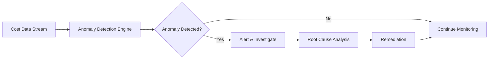
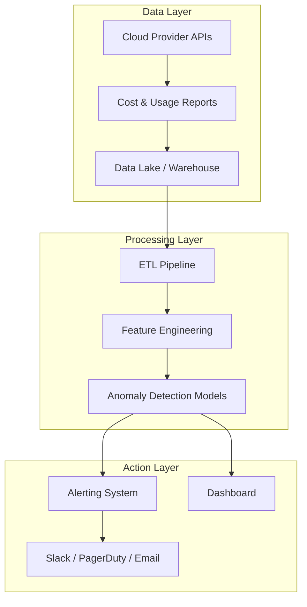
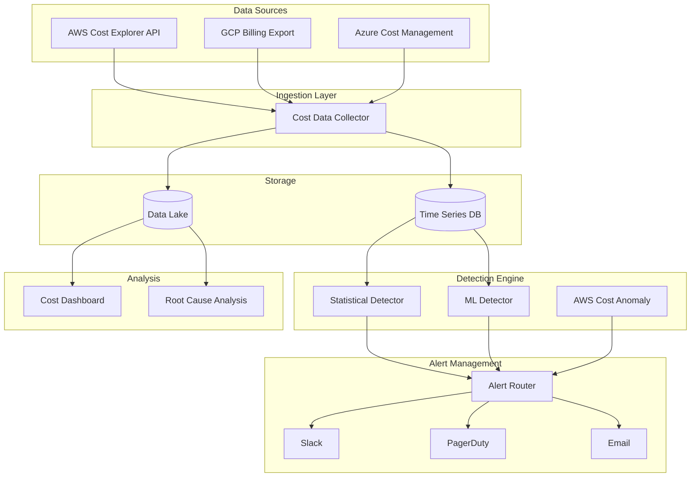

# How to Build Cost Anomaly Detection

Author: [nawazdhandala](https://github.com/nawazdhandala)

Tags: FinOps, Cloud, Cost Optimization, Anomaly Detection

Description: Learn how to detect cost anomalies to catch unexpected spending spikes early.

---

It starts innocently. A developer spins up a GPU instance for a quick ML experiment. Forgets to terminate it. Three weeks later, your cloud bill arrives with an extra $15,000 line item. Or worse: a misconfigured auto-scaler spawns 500 instances during a traffic spike that never happened.

Cloud spending anomalies are silent budget killers. They don't trigger outages. They don't page anyone. They just accumulate until someone opens the invoice.

This post walks you through building a cost anomaly detection system from scratch. We will cover statistical methods, machine learning approaches, and how to leverage AWS Cost Anomaly Detection. By the end, you will have a practical blueprint for catching spending spikes before they become budget disasters.

## Why Cost Anomaly Detection Matters

Traditional budgeting sets a monthly cap and hopes for the best. But cloud costs are dynamic. They fluctuate based on:

- Traffic patterns (marketing campaigns, viral moments)
- Auto-scaling behavior (legitimate or misconfigured)
- New deployments (that expensive NAT gateway nobody noticed)
- Forgotten resources (orphaned EBS volumes, idle RDS instances)
- Pricing changes (reserved instance expirations)

A static budget alert fires when you have already overspent. Anomaly detection catches the *pattern change* early, giving you time to investigate and act.



## The Building Blocks of Cost Anomaly Detection

Before diving into implementation, let's understand what makes a good anomaly detection system:

1. **Data Ingestion**: Pull cost data at regular intervals (hourly or daily)
2. **Baseline Modeling**: Understand what "normal" spending looks like
3. **Anomaly Scoring**: Quantify how unusual current spending is
4. **Alerting**: Notify the right people when thresholds are breached
5. **Root Cause Analysis**: Help identify what changed



## Approach 1: Statistical Anomaly Detection

Statistical methods work well when your spending patterns are relatively stable. They require no training data and are easy to implement.

### Z-Score Method

The Z-score measures how many standard deviations a data point is from the mean. For cost data:

```python
# z_score_detector.py
# Statistical anomaly detection using Z-score method
# Works well for normally distributed cost data with stable patterns

import numpy as np
from datetime import datetime, timedelta
from typing import List, Tuple, Optional
from dataclasses import dataclass


@dataclass
class CostDataPoint:
    """Represents a single cost observation."""
    timestamp: datetime
    amount: float
    service: str
    account_id: str


@dataclass
class AnomalyResult:
    """Result of anomaly detection analysis."""
    data_point: CostDataPoint
    z_score: float
    is_anomaly: bool
    expected_range: Tuple[float, float]


class ZScoreDetector:
    """
    Detects cost anomalies using the Z-score method.

    The Z-score measures how many standard deviations a value
    is from the historical mean. Values beyond the threshold
    (typically 2-3 standard deviations) are flagged as anomalies.
    """

    def __init__(
        self,
        threshold: float = 3.0,
        lookback_days: int = 30,
        min_data_points: int = 7
    ):
        """
        Initialize the detector.

        Args:
            threshold: Number of standard deviations to consider anomalous
            lookback_days: Historical window for calculating baseline
            min_data_points: Minimum observations needed for detection
        """
        self.threshold = threshold
        self.lookback_days = lookback_days
        self.min_data_points = min_data_points
        self.historical_data: List[CostDataPoint] = []

    def add_data_point(self, data_point: CostDataPoint) -> None:
        """Add a new cost observation to the historical buffer."""
        self.historical_data.append(data_point)

        # Remove data points outside the lookback window
        cutoff = datetime.now() - timedelta(days=self.lookback_days)
        self.historical_data = [
            dp for dp in self.historical_data
            if dp.timestamp > cutoff
        ]

    def detect(self, current: CostDataPoint) -> Optional[AnomalyResult]:
        """
        Check if the current cost data point is anomalous.

        Returns None if insufficient historical data exists.
        """
        # Filter historical data for the same service
        relevant_history = [
            dp.amount for dp in self.historical_data
            if dp.service == current.service
        ]

        # Need minimum data points for reliable detection
        if len(relevant_history) < self.min_data_points:
            return None

        # Calculate baseline statistics
        mean = np.mean(relevant_history)
        std = np.std(relevant_history)

        # Avoid division by zero for constant costs
        if std == 0:
            std = mean * 0.01  # Use 1% of mean as minimum std

        # Calculate Z-score
        z_score = (current.amount - mean) / std

        # Determine expected range (mean +/- threshold * std)
        lower_bound = mean - (self.threshold * std)
        upper_bound = mean + (self.threshold * std)

        return AnomalyResult(
            data_point=current,
            z_score=z_score,
            is_anomaly=abs(z_score) > self.threshold,
            expected_range=(max(0, lower_bound), upper_bound)
        )


# Example usage
if __name__ == "__main__":
    detector = ZScoreDetector(threshold=2.5, lookback_days=14)

    # Simulate historical daily costs for EC2
    import random
    base_cost = 1000  # $1000/day baseline

    for day in range(14):
        # Normal variation: +/- 10%
        daily_cost = base_cost * (1 + random.uniform(-0.1, 0.1))
        data_point = CostDataPoint(
            timestamp=datetime.now() - timedelta(days=14-day),
            amount=daily_cost,
            service="EC2",
            account_id="123456789"
        )
        detector.add_data_point(data_point)

    # Test with normal cost
    normal_day = CostDataPoint(
        timestamp=datetime.now(),
        amount=1050,  # Slightly above average
        service="EC2",
        account_id="123456789"
    )
    result = detector.detect(normal_day)
    print(f"Normal day: z_score={result.z_score:.2f}, anomaly={result.is_anomaly}")

    # Test with anomalous cost (50% spike)
    spike_day = CostDataPoint(
        timestamp=datetime.now(),
        amount=1500,  # 50% above baseline
        service="EC2",
        account_id="123456789"
    )
    result = detector.detect(spike_day)
    print(f"Spike day: z_score={result.z_score:.2f}, anomaly={result.is_anomaly}")
    print(f"Expected range: ${result.expected_range[0]:.2f} - ${result.expected_range[1]:.2f}")
```

### Moving Average with Bands

For costs with trends or seasonality, a moving average approach captures gradual changes better:

```python
# moving_average_detector.py
# Anomaly detection using Exponential Moving Average (EMA)
# Better suited for costs with gradual trends

import numpy as np
from collections import deque
from typing import List, Tuple, Optional
from dataclasses import dataclass
from datetime import datetime


@dataclass
class BandResult:
    """Result including confidence bands."""
    current_value: float
    ema: float
    upper_band: float
    lower_band: float
    is_anomaly: bool
    deviation_percent: float


class MovingAverageDetector:
    """
    Detects anomalies using Exponential Moving Average (EMA)
    with dynamic bands based on recent volatility.

    EMA gives more weight to recent observations, making it
    responsive to legitimate trend changes while still catching
    sudden spikes.
    """

    def __init__(
        self,
        span: int = 7,
        band_multiplier: float = 2.0,
        window_size: int = 30
    ):
        """
        Initialize the detector.

        Args:
            span: EMA span (higher = smoother, slower to adapt)
            band_multiplier: Multiplier for standard deviation bands
            window_size: Rolling window for volatility calculation
        """
        self.span = span
        self.band_multiplier = band_multiplier
        self.window_size = window_size

        # EMA smoothing factor: 2 / (span + 1)
        self.alpha = 2 / (span + 1)

        self.ema: Optional[float] = None
        self.values: deque = deque(maxlen=window_size)

    def update(self, value: float) -> BandResult:
        """
        Update the detector with a new value and check for anomaly.

        The EMA is calculated as:
        EMA_t = alpha * value_t + (1 - alpha) * EMA_(t-1)

        Bands are set at EMA +/- (multiplier * rolling_std)
        """
        self.values.append(value)

        # Initialize EMA with first value
        if self.ema is None:
            self.ema = value
        else:
            # Update EMA: new_ema = alpha * current + (1 - alpha) * old_ema
            self.ema = self.alpha * value + (1 - self.alpha) * self.ema

        # Calculate rolling standard deviation for band width
        if len(self.values) >= 3:
            rolling_std = np.std(list(self.values))
        else:
            rolling_std = self.ema * 0.1  # Default to 10% of EMA

        # Calculate bands
        upper_band = self.ema + (self.band_multiplier * rolling_std)
        lower_band = max(0, self.ema - (self.band_multiplier * rolling_std))

        # Check if current value is outside bands
        is_anomaly = value > upper_band or value < lower_band

        # Calculate deviation percentage from EMA
        deviation_percent = ((value - self.ema) / self.ema) * 100 if self.ema > 0 else 0

        return BandResult(
            current_value=value,
            ema=self.ema,
            upper_band=upper_band,
            lower_band=lower_band,
            is_anomaly=is_anomaly,
            deviation_percent=deviation_percent
        )


class ServiceCostTracker:
    """
    Tracks costs across multiple services with individual detectors.

    Each service gets its own detector since spending patterns
    vary significantly between services (EC2 vs Lambda vs S3).
    """

    def __init__(self, **detector_kwargs):
        self.detectors: dict = {}
        self.detector_kwargs = detector_kwargs

    def track(self, service: str, cost: float) -> BandResult:
        """Track cost for a specific service."""
        if service not in self.detectors:
            self.detectors[service] = MovingAverageDetector(**self.detector_kwargs)

        return self.detectors[service].update(cost)

    def get_all_anomalies(self) -> List[Tuple[str, BandResult]]:
        """Get all services currently showing anomalies."""
        anomalies = []
        for service, detector in self.detectors.items():
            if detector.values:
                last_value = detector.values[-1]
                result = BandResult(
                    current_value=last_value,
                    ema=detector.ema,
                    upper_band=detector.ema + (detector.band_multiplier * np.std(list(detector.values))),
                    lower_band=max(0, detector.ema - (detector.band_multiplier * np.std(list(detector.values)))),
                    is_anomaly=False,
                    deviation_percent=0
                )
                # Recheck anomaly status
                result.is_anomaly = (
                    last_value > result.upper_band or
                    last_value < result.lower_band
                )
                if result.is_anomaly:
                    anomalies.append((service, result))
        return anomalies


# Example: Tracking multiple services
if __name__ == "__main__":
    tracker = ServiceCostTracker(span=7, band_multiplier=2.0)

    # Simulate 14 days of costs
    daily_costs = {
        "EC2": [1000, 1020, 980, 1010, 990, 1030, 1000,
                1015, 985, 1025, 995, 1005, 1010, 2500],  # Spike on day 14
        "RDS": [500, 510, 495, 505, 500, 508, 502,
                498, 512, 495, 505, 500, 510, 505],  # Normal
        "Lambda": [100, 105, 98, 102, 101, 99, 103,
                   100, 104, 97, 101, 100, 102, 50]  # Drop on day 14
    }

    print("Cost Anomaly Detection Results")
    print("=" * 50)

    for day in range(14):
        print(f"\nDay {day + 1}:")
        for service, costs in daily_costs.items():
            result = tracker.track(service, costs[day])
            status = "ANOMALY" if result.is_anomaly else "normal"
            print(f"  {service}: ${costs[day]:.0f} "
                  f"(EMA: ${result.ema:.0f}, "
                  f"Band: ${result.lower_band:.0f}-${result.upper_band:.0f}) "
                  f"[{status}]")
```

## Approach 2: Machine Learning Based Detection

For complex environments with multiple seasonality patterns (daily, weekly, monthly), ML models capture non-linear relationships that statistical methods miss.

### Isolation Forest

Isolation Forest works by randomly partitioning data. Anomalies are isolated quickly (fewer partitions needed), while normal points require more splits.

```python
# isolation_forest_detector.py
# ML-based anomaly detection using Isolation Forest
# Effective for multi-dimensional cost data with complex patterns

import numpy as np
import pandas as pd
from sklearn.ensemble import IsolationForest
from sklearn.preprocessing import StandardScaler
from typing import List, Dict, Tuple, Optional
from dataclasses import dataclass
from datetime import datetime, timedelta


@dataclass
class CostFeatures:
    """Feature vector for cost anomaly detection."""
    daily_cost: float
    day_of_week: int  # 0-6 (Monday-Sunday)
    day_of_month: int  # 1-31
    week_of_year: int  # 1-52
    cost_change_pct: float  # Day-over-day change
    rolling_mean_7d: float  # 7-day rolling average
    rolling_std_7d: float  # 7-day rolling std
    cost_vs_last_week: float  # Same day last week comparison


class IsolationForestDetector:
    """
    Anomaly detection using Isolation Forest algorithm.

    Isolation Forest isolates observations by randomly selecting
    a feature and then randomly selecting a split value. Anomalies
    require fewer splits to isolate, resulting in shorter paths
    in the tree structure.

    Benefits:
    - Works well with high-dimensional data
    - No assumptions about data distribution
    - Handles multiple seasonality patterns
    - Computationally efficient
    """

    def __init__(
        self,
        contamination: float = 0.05,
        n_estimators: int = 100,
        random_state: int = 42
    ):
        """
        Initialize the detector.

        Args:
            contamination: Expected proportion of anomalies (0.05 = 5%)
            n_estimators: Number of trees in the forest
            random_state: Random seed for reproducibility
        """
        self.contamination = contamination
        self.model = IsolationForest(
            contamination=contamination,
            n_estimators=n_estimators,
            random_state=random_state,
            n_jobs=-1  # Use all CPU cores
        )
        self.scaler = StandardScaler()
        self.is_fitted = False
        self.feature_names = [
            'daily_cost', 'day_of_week', 'day_of_month', 'week_of_year',
            'cost_change_pct', 'rolling_mean_7d', 'rolling_std_7d',
            'cost_vs_last_week'
        ]

    def _extract_features(
        self,
        costs: List[float],
        dates: List[datetime]
    ) -> np.ndarray:
        """
        Extract feature vectors from raw cost time series.

        Creates temporal features that capture:
        - Day-of-week patterns (weekday vs weekend)
        - Monthly patterns (beginning vs end of month)
        - Trend (day-over-day changes)
        - Volatility (rolling standard deviation)
        - Week-over-week comparison
        """
        df = pd.DataFrame({
            'date': dates,
            'cost': costs
        })
        df = df.sort_values('date').reset_index(drop=True)

        # Temporal features
        df['day_of_week'] = df['date'].dt.dayofweek
        df['day_of_month'] = df['date'].dt.day
        df['week_of_year'] = df['date'].dt.isocalendar().week

        # Trend features
        df['cost_change_pct'] = df['cost'].pct_change().fillna(0) * 100

        # Rolling statistics (7-day window)
        df['rolling_mean_7d'] = df['cost'].rolling(window=7, min_periods=1).mean()
        df['rolling_std_7d'] = df['cost'].rolling(window=7, min_periods=1).std().fillna(0)

        # Week-over-week comparison
        df['cost_vs_last_week'] = (
            (df['cost'] - df['cost'].shift(7)) / df['cost'].shift(7) * 100
        ).fillna(0)

        # Select feature columns
        feature_cols = [
            'cost', 'day_of_week', 'day_of_month', 'week_of_year',
            'cost_change_pct', 'rolling_mean_7d', 'rolling_std_7d',
            'cost_vs_last_week'
        ]

        return df[feature_cols].values

    def fit(self, costs: List[float], dates: List[datetime]) -> None:
        """
        Train the model on historical cost data.

        Requires at least 14 days of data for reliable detection.
        More data (30-90 days) captures weekly and monthly patterns.
        """
        if len(costs) < 14:
            raise ValueError("Need at least 14 days of data to train")

        features = self._extract_features(costs, dates)

        # Scale features to zero mean, unit variance
        features_scaled = self.scaler.fit_transform(features)

        # Train isolation forest
        self.model.fit(features_scaled)
        self.is_fitted = True

    def predict(
        self,
        costs: List[float],
        dates: List[datetime]
    ) -> List[Dict]:
        """
        Predict anomalies in the cost data.

        Returns a list of dictionaries with:
        - date: The date of the observation
        - cost: The cost amount
        - is_anomaly: Boolean flag
        - anomaly_score: Score from -1 (anomaly) to 1 (normal)
        """
        if not self.is_fitted:
            raise ValueError("Model must be fitted before prediction")

        features = self._extract_features(costs, dates)
        features_scaled = self.scaler.transform(features)

        # Get predictions: 1 = normal, -1 = anomaly
        predictions = self.model.predict(features_scaled)

        # Get anomaly scores (lower = more anomalous)
        scores = self.model.score_samples(features_scaled)

        results = []
        for i, (date, cost) in enumerate(zip(dates, costs)):
            results.append({
                'date': date,
                'cost': cost,
                'is_anomaly': predictions[i] == -1,
                'anomaly_score': scores[i]
            })

        return results

    def detect_single(
        self,
        new_cost: float,
        new_date: datetime,
        recent_costs: List[float],
        recent_dates: List[datetime]
    ) -> Dict:
        """
        Detect if a single new data point is anomalous.

        Combines the new point with recent history for feature extraction.
        """
        all_costs = recent_costs + [new_cost]
        all_dates = recent_dates + [new_date]

        results = self.predict(all_costs, all_dates)
        return results[-1]  # Return result for the new point


# Example: Training and using the detector
if __name__ == "__main__":
    # Generate synthetic training data (60 days)
    np.random.seed(42)
    base_date = datetime.now() - timedelta(days=60)

    training_dates = [base_date + timedelta(days=i) for i in range(60)]

    # Simulate realistic cost patterns:
    # - Base cost around $1000
    # - Weekly seasonality (higher on weekdays)
    # - Some random noise
    training_costs = []
    for i, date in enumerate(training_dates):
        base = 1000
        # Weekday boost (Mon-Fri)
        weekday_factor = 1.2 if date.weekday() < 5 else 0.8
        # Random noise (+/- 5%)
        noise = np.random.uniform(0.95, 1.05)
        daily_cost = base * weekday_factor * noise
        training_costs.append(daily_cost)

    # Initialize and train
    detector = IsolationForestDetector(contamination=0.05)
    detector.fit(training_costs, training_dates)
    print("Model trained on 60 days of historical data")

    # Test with normal day
    test_date_normal = datetime.now()
    test_cost_normal = 1150  # Normal weekday cost

    result = detector.detect_single(
        test_cost_normal,
        test_date_normal,
        training_costs[-14:],
        training_dates[-14:]
    )
    print(f"\nNormal test: ${test_cost_normal}")
    print(f"  Anomaly: {result['is_anomaly']}")
    print(f"  Score: {result['anomaly_score']:.3f}")

    # Test with anomaly (3x normal cost)
    test_cost_spike = 3500
    result = detector.detect_single(
        test_cost_spike,
        test_date_normal,
        training_costs[-14:],
        training_dates[-14:]
    )
    print(f"\nSpike test: ${test_cost_spike}")
    print(f"  Anomaly: {result['is_anomaly']}")
    print(f"  Score: {result['anomaly_score']:.3f}")
```

### Prophet for Seasonal Decomposition

Facebook's Prophet excels at capturing multiple seasonality patterns. While primarily a forecasting tool, we can use it to build confidence intervals for anomaly detection:

```python
# prophet_detector.py
# Anomaly detection using Facebook Prophet
# Best for data with strong seasonal patterns (daily, weekly, yearly)

from prophet import Prophet
import pandas as pd
import numpy as np
from typing import List, Dict, Tuple, Optional
from datetime import datetime, timedelta
import warnings
warnings.filterwarnings('ignore')  # Suppress Prophet's verbose output


class ProphetAnomalyDetector:
    """
    Anomaly detection using Facebook Prophet's forecasting capabilities.

    Prophet decomposes time series into:
    - Trend: Long-term increase/decrease
    - Weekly seasonality: Day-of-week patterns
    - Yearly seasonality: Month-of-year patterns
    - Holiday effects: Special event impacts

    We use Prophet's uncertainty intervals to flag values
    that fall outside expected bounds.
    """

    def __init__(
        self,
        interval_width: float = 0.95,
        changepoint_prior_scale: float = 0.05,
        seasonality_mode: str = 'multiplicative'
    ):
        """
        Initialize the detector.

        Args:
            interval_width: Confidence interval width (0.95 = 95%)
            changepoint_prior_scale: Flexibility of trend changes
                                     (lower = smoother trend)
            seasonality_mode: 'additive' or 'multiplicative'
                             Use multiplicative for costs that scale
        """
        self.interval_width = interval_width
        self.changepoint_prior_scale = changepoint_prior_scale
        self.seasonality_mode = seasonality_mode
        self.model: Optional[Prophet] = None

    def fit(self, costs: List[float], dates: List[datetime]) -> None:
        """
        Train Prophet model on historical cost data.

        Prophet requires a DataFrame with columns 'ds' (date) and 'y' (value).
        Minimum 14 days recommended, 30+ days for weekly patterns.
        """
        # Prepare data in Prophet's expected format
        df = pd.DataFrame({
            'ds': pd.to_datetime(dates),
            'y': costs
        })

        # Initialize Prophet with our parameters
        self.model = Prophet(
            interval_width=self.interval_width,
            changepoint_prior_scale=self.changepoint_prior_scale,
            seasonality_mode=self.seasonality_mode,
            daily_seasonality=False,  # Usually too granular for daily costs
            weekly_seasonality=True,
            yearly_seasonality=len(costs) > 365  # Only if enough data
        )

        # Fit the model (suppressing output)
        self.model.fit(df)

    def detect(
        self,
        costs: List[float],
        dates: List[datetime]
    ) -> pd.DataFrame:
        """
        Detect anomalies by comparing actual values to forecasted bounds.

        Returns DataFrame with columns:
        - ds: Date
        - y: Actual cost
        - yhat: Predicted cost
        - yhat_lower: Lower bound of prediction interval
        - yhat_upper: Upper bound of prediction interval
        - is_anomaly: Boolean flag
        - anomaly_direction: 'high', 'low', or None
        """
        if self.model is None:
            raise ValueError("Model must be fitted first")

        # Create future dataframe for prediction
        future = pd.DataFrame({
            'ds': pd.to_datetime(dates)
        })

        # Generate predictions with uncertainty intervals
        forecast = self.model.predict(future)

        # Merge with actual values
        df = forecast[['ds', 'yhat', 'yhat_lower', 'yhat_upper']].copy()
        df['y'] = costs

        # Flag anomalies (outside prediction interval)
        df['is_anomaly'] = (df['y'] < df['yhat_lower']) | (df['y'] > df['yhat_upper'])

        # Determine direction
        df['anomaly_direction'] = None
        df.loc[df['y'] > df['yhat_upper'], 'anomaly_direction'] = 'high'
        df.loc[df['y'] < df['yhat_lower'], 'anomaly_direction'] = 'low'

        # Calculate deviation percentage
        df['deviation_pct'] = ((df['y'] - df['yhat']) / df['yhat'] * 100).round(2)

        return df

    def forecast_with_bounds(
        self,
        periods: int = 7
    ) -> pd.DataFrame:
        """
        Forecast future costs with uncertainty bounds.

        Useful for proactive budget planning and setting
        appropriate alerting thresholds.
        """
        if self.model is None:
            raise ValueError("Model must be fitted first")

        future = self.model.make_future_dataframe(periods=periods)
        forecast = self.model.predict(future)

        return forecast[['ds', 'yhat', 'yhat_lower', 'yhat_upper']].tail(periods)


class MultiServiceProphetDetector:
    """
    Manages Prophet detectors for multiple services.

    Each service gets its own model since spending patterns
    differ significantly (e.g., EC2 vs S3 vs Lambda).
    """

    def __init__(self, **prophet_kwargs):
        self.detectors: Dict[str, ProphetAnomalyDetector] = {}
        self.prophet_kwargs = prophet_kwargs

    def fit_service(
        self,
        service: str,
        costs: List[float],
        dates: List[datetime]
    ) -> None:
        """Train a detector for a specific service."""
        detector = ProphetAnomalyDetector(**self.prophet_kwargs)
        detector.fit(costs, dates)
        self.detectors[service] = detector

    def detect_service(
        self,
        service: str,
        costs: List[float],
        dates: List[datetime]
    ) -> pd.DataFrame:
        """Detect anomalies for a specific service."""
        if service not in self.detectors:
            raise ValueError(f"No model trained for service: {service}")
        return self.detectors[service].detect(costs, dates)

    def get_all_anomalies(
        self,
        cost_data: Dict[str, Tuple[List[float], List[datetime]]]
    ) -> Dict[str, pd.DataFrame]:
        """
        Detect anomalies across all services.

        Args:
            cost_data: Dict mapping service name to (costs, dates) tuple

        Returns:
            Dict mapping service name to anomaly detection results
        """
        results = {}
        for service, (costs, dates) in cost_data.items():
            if service in self.detectors:
                df = self.detect_service(service, costs, dates)
                # Only include if there are anomalies
                if df['is_anomaly'].any():
                    results[service] = df[df['is_anomaly']]
        return results


# Example usage
if __name__ == "__main__":
    # Generate 90 days of synthetic data with weekly seasonality
    np.random.seed(42)
    base_date = datetime.now() - timedelta(days=90)

    dates = [base_date + timedelta(days=i) for i in range(90)]

    # Simulate costs with:
    # - Weekly pattern (higher weekdays)
    # - Gradual upward trend
    # - Random noise
    # - A few intentional anomalies
    costs = []
    for i, date in enumerate(dates):
        base = 1000 + (i * 2)  # Gradual trend: +$2/day
        weekday_factor = 1.3 if date.weekday() < 5 else 0.7
        noise = np.random.uniform(0.95, 1.05)
        daily_cost = base * weekday_factor * noise

        # Insert anomalies on specific days
        if i == 45:  # Day 45: Big spike
            daily_cost *= 2.5
        if i == 60:  # Day 60: Unusual drop
            daily_cost *= 0.3

        costs.append(daily_cost)

    # Split into training and test
    train_costs = costs[:60]
    train_dates = dates[:60]
    test_costs = costs[60:]
    test_dates = dates[60:]

    # Train detector
    detector = ProphetAnomalyDetector(interval_width=0.95)
    detector.fit(train_costs, train_dates)
    print("Prophet model trained on 60 days of data")

    # Detect anomalies in test period
    results = detector.detect(test_costs, test_dates)

    print("\nAnomaly Detection Results (Test Period):")
    print("=" * 60)

    for _, row in results.iterrows():
        status = "ANOMALY" if row['is_anomaly'] else "normal"
        direction = f" ({row['anomaly_direction']})" if row['anomaly_direction'] else ""
        print(f"{row['ds'].strftime('%Y-%m-%d')}: "
              f"Actual=${row['y']:.0f}, "
              f"Expected=${row['yhat']:.0f} "
              f"[{row['yhat_lower']:.0f}-{row['yhat_upper']:.0f}] "
              f"- {status}{direction}")

    # Show 7-day forecast
    print("\n7-Day Cost Forecast:")
    print("-" * 40)
    forecast = detector.forecast_with_bounds(periods=7)
    for _, row in forecast.iterrows():
        print(f"{row['ds'].strftime('%Y-%m-%d')}: "
              f"${row['yhat']:.0f} "
              f"[${row['yhat_lower']:.0f} - ${row['yhat_upper']:.0f}]")
```

## AWS Cost Anomaly Detection Setup

AWS provides a managed service for cost anomaly detection. Here is how to set it up using Terraform:

```hcl
# aws_cost_anomaly_detection.tf
# Terraform configuration for AWS Cost Anomaly Detection
# Monitors spending across services and linked accounts

# Cost Anomaly Detection Monitor
# This creates a monitor that tracks spending patterns
resource "aws_ce_anomaly_monitor" "main" {
  name              = "all-services-monitor"
  monitor_type      = "DIMENSIONAL"

  # Monitor by service - catches per-service anomalies
  monitor_dimension = "SERVICE"

  tags = {
    Environment = "production"
    ManagedBy   = "terraform"
  }
}

# Create a second monitor for linked accounts (useful for multi-account setups)
resource "aws_ce_anomaly_monitor" "linked_accounts" {
  name              = "linked-accounts-monitor"
  monitor_type      = "DIMENSIONAL"
  monitor_dimension = "LINKED_ACCOUNT"

  tags = {
    Environment = "production"
    ManagedBy   = "terraform"
  }
}

# Custom monitor using Cost Categories
# Useful for business-unit level anomaly detection
resource "aws_ce_anomaly_monitor" "cost_category" {
  name         = "business-unit-monitor"
  monitor_type = "CUSTOM"

  # Filter to specific cost category
  monitor_specification = jsonencode({
    And = null
    CostCategories = {
      Key          = "BusinessUnit"
      MatchOptions = null
      Values       = ["Engineering", "Marketing", "Sales"]
    }
    Dimensions   = null
    Not          = null
    Or           = null
    Tags         = null
  })

  tags = {
    Environment = "production"
  }
}

# SNS Topic for anomaly alerts
resource "aws_sns_topic" "cost_anomaly_alerts" {
  name = "cost-anomaly-alerts"

  tags = {
    Purpose = "Cost anomaly notifications"
  }
}

# SNS Topic Policy - Allow Cost Explorer to publish
resource "aws_sns_topic_policy" "cost_anomaly_alerts" {
  arn = aws_sns_topic.cost_anomaly_alerts.arn

  policy = jsonencode({
    Version = "2012-10-17"
    Statement = [
      {
        Sid       = "AllowCostExplorerPublish"
        Effect    = "Allow"
        Principal = {
          Service = "costalerts.amazonaws.com"
        }
        Action    = "SNS:Publish"
        Resource  = aws_sns_topic.cost_anomaly_alerts.arn
      }
    ]
  })
}

# Email subscription (replace with your email)
resource "aws_sns_topic_subscription" "email_alert" {
  topic_arn = aws_sns_topic.cost_anomaly_alerts.arn
  protocol  = "email"
  endpoint  = "finops-team@yourcompany.com"
}

# Anomaly Subscription - Links monitors to alert destinations
resource "aws_ce_anomaly_subscription" "main" {
  name      = "cost-anomaly-subscription"
  frequency = "DAILY"  # Options: DAILY, IMMEDIATE, WEEKLY

  # Link to our monitors
  monitor_arn_list = [
    aws_ce_anomaly_monitor.main.arn,
    aws_ce_anomaly_monitor.linked_accounts.arn,
  ]

  # Alert subscribers
  subscriber {
    type    = "SNS"
    address = aws_sns_topic.cost_anomaly_alerts.arn
  }

  # Threshold settings
  # Only alert when anomaly impact exceeds this amount
  threshold_expression {
    dimension {
      key           = "ANOMALY_TOTAL_IMPACT_ABSOLUTE"
      values        = ["100"]  # Alert when impact > $100
      match_options = ["GREATER_THAN_OR_EQUAL"]
    }
  }

  tags = {
    Environment = "production"
  }
}

# Alternative subscription with percentage-based threshold
resource "aws_ce_anomaly_subscription" "percentage_based" {
  name      = "percentage-anomaly-subscription"
  frequency = "IMMEDIATE"  # Get alerts as soon as detected

  monitor_arn_list = [
    aws_ce_anomaly_monitor.main.arn,
  ]

  subscriber {
    type    = "SNS"
    address = aws_sns_topic.cost_anomaly_alerts.arn
  }

  # Alert when anomaly is 20% above expected
  threshold_expression {
    dimension {
      key           = "ANOMALY_TOTAL_IMPACT_PERCENTAGE"
      values        = ["20"]
      match_options = ["GREATER_THAN_OR_EQUAL"]
    }
  }
}

# Lambda function for custom processing of anomaly alerts
resource "aws_lambda_function" "anomaly_processor" {
  filename         = "anomaly_processor.zip"
  function_name    = "cost-anomaly-processor"
  role            = aws_iam_role.anomaly_processor.arn
  handler         = "index.handler"
  runtime         = "python3.11"
  timeout         = 30

  environment {
    variables = {
      SLACK_WEBHOOK_URL = var.slack_webhook_url
      PAGERDUTY_KEY     = var.pagerduty_integration_key
    }
  }

  tags = {
    Purpose = "Process cost anomaly alerts"
  }
}

# IAM role for Lambda
resource "aws_iam_role" "anomaly_processor" {
  name = "cost-anomaly-processor-role"

  assume_role_policy = jsonencode({
    Version = "2012-10-17"
    Statement = [
      {
        Action = "sts:AssumeRole"
        Effect = "Allow"
        Principal = {
          Service = "lambda.amazonaws.com"
        }
      }
    ]
  })
}

# Lambda permission to be invoked by SNS
resource "aws_lambda_permission" "sns_invoke" {
  statement_id  = "AllowSNSInvoke"
  action        = "lambda:InvokeFunction"
  function_name = aws_lambda_function.anomaly_processor.function_name
  principal     = "sns.amazonaws.com"
  source_arn    = aws_sns_topic.cost_anomaly_alerts.arn
}

# Subscribe Lambda to SNS topic
resource "aws_sns_topic_subscription" "lambda_processor" {
  topic_arn = aws_sns_topic.cost_anomaly_alerts.arn
  protocol  = "lambda"
  endpoint  = aws_lambda_function.anomaly_processor.arn
}

# Outputs for reference
output "monitor_arns" {
  value = {
    services        = aws_ce_anomaly_monitor.main.arn
    linked_accounts = aws_ce_anomaly_monitor.linked_accounts.arn
    cost_category   = aws_ce_anomaly_monitor.cost_category.arn
  }
}

output "sns_topic_arn" {
  value = aws_sns_topic.cost_anomaly_alerts.arn
}
```

For the Lambda function that processes anomaly alerts:

```python
# lambda/anomaly_processor/index.py
# Lambda function to process AWS Cost Anomaly Detection alerts
# Sends formatted notifications to Slack and PagerDuty

import json
import os
import urllib.request
from typing import Dict, Any


def handler(event: Dict[str, Any], context: Any) -> Dict[str, Any]:
    """
    Process SNS notifications from AWS Cost Anomaly Detection.

    The SNS message contains anomaly details including:
    - anomalyId: Unique identifier
    - anomalyStartDate: When the anomaly began
    - anomalyEndDate: When it ended (if resolved)
    - dimensionValue: Which service/account is affected
    - rootCauses: Potential causes identified by AWS
    - impact: Total and daily impact amounts
    """

    slack_webhook = os.environ.get('SLACK_WEBHOOK_URL')
    pagerduty_key = os.environ.get('PAGERDUTY_KEY')

    # Parse SNS message
    for record in event.get('Records', []):
        sns_message = record.get('Sns', {}).get('Message', '{}')
        anomaly = json.loads(sns_message)

        # Extract key information
        anomaly_id = anomaly.get('anomalyId', 'Unknown')
        service = anomaly.get('dimensionValue', 'Unknown Service')
        impact = anomaly.get('impact', {})
        total_impact = impact.get('totalImpact', 0)

        root_causes = anomaly.get('rootCauses', [])
        root_cause_summary = format_root_causes(root_causes)

        # Format message for Slack
        slack_message = format_slack_message(
            anomaly_id=anomaly_id,
            service=service,
            total_impact=total_impact,
            root_causes=root_cause_summary,
            start_date=anomaly.get('anomalyStartDate', 'Unknown')
        )

        # Send to Slack
        if slack_webhook:
            send_slack_notification(slack_webhook, slack_message)

        # Send to PagerDuty if impact is significant
        if pagerduty_key and total_impact > 500:
            send_pagerduty_alert(
                pagerduty_key,
                anomaly_id,
                service,
                total_impact
            )

    return {
        'statusCode': 200,
        'body': json.dumps('Anomaly processed successfully')
    }


def format_root_causes(root_causes: list) -> str:
    """Format root causes into readable summary."""
    if not root_causes:
        return "No specific root causes identified"

    summaries = []
    for cause in root_causes[:3]:  # Limit to top 3
        service = cause.get('service', 'Unknown')
        region = cause.get('region', 'Unknown')
        usage_type = cause.get('usageType', 'Unknown')
        summaries.append(f"- {service} in {region}: {usage_type}")

    return "\n".join(summaries)


def format_slack_message(
    anomaly_id: str,
    service: str,
    total_impact: float,
    root_causes: str,
    start_date: str
) -> Dict:
    """Create a formatted Slack message block."""

    # Color based on impact severity
    if total_impact > 1000:
        color = "danger"  # Red
        severity = "HIGH"
    elif total_impact > 100:
        color = "warning"  # Yellow
        severity = "MEDIUM"
    else:
        color = "good"  # Green
        severity = "LOW"

    return {
        "attachments": [
            {
                "color": color,
                "blocks": [
                    {
                        "type": "header",
                        "text": {
                            "type": "plain_text",
                            "text": f"Cost Anomaly Detected [{severity}]"
                        }
                    },
                    {
                        "type": "section",
                        "fields": [
                            {
                                "type": "mrkdwn",
                                "text": f"*Service:*\n{service}"
                            },
                            {
                                "type": "mrkdwn",
                                "text": f"*Impact:*\n${total_impact:,.2f}"
                            },
                            {
                                "type": "mrkdwn",
                                "text": f"*Started:*\n{start_date}"
                            },
                            {
                                "type": "mrkdwn",
                                "text": f"*Anomaly ID:*\n{anomaly_id}"
                            }
                        ]
                    },
                    {
                        "type": "section",
                        "text": {
                            "type": "mrkdwn",
                            "text": f"*Potential Root Causes:*\n{root_causes}"
                        }
                    },
                    {
                        "type": "actions",
                        "elements": [
                            {
                                "type": "button",
                                "text": {
                                    "type": "plain_text",
                                    "text": "View in AWS Console"
                                },
                                "url": f"https://console.aws.amazon.com/cost-management/home#/anomaly-detection/monitors/{anomaly_id}"
                            }
                        ]
                    }
                ]
            }
        ]
    }


def send_slack_notification(webhook_url: str, message: Dict) -> None:
    """Send notification to Slack webhook."""
    data = json.dumps(message).encode('utf-8')
    req = urllib.request.Request(
        webhook_url,
        data=data,
        headers={'Content-Type': 'application/json'}
    )
    urllib.request.urlopen(req)


def send_pagerduty_alert(
    integration_key: str,
    anomaly_id: str,
    service: str,
    impact: float
) -> None:
    """Create PagerDuty incident for high-impact anomalies."""

    payload = {
        "routing_key": integration_key,
        "event_action": "trigger",
        "dedup_key": anomaly_id,
        "payload": {
            "summary": f"Cost Anomaly: {service} - ${impact:,.2f} impact",
            "severity": "warning" if impact < 1000 else "critical",
            "source": "aws-cost-anomaly-detection",
            "custom_details": {
                "service": service,
                "impact": f"${impact:,.2f}",
                "anomaly_id": anomaly_id
            }
        }
    }

    data = json.dumps(payload).encode('utf-8')
    req = urllib.request.Request(
        "https://events.pagerduty.com/v2/enqueue",
        data=data,
        headers={'Content-Type': 'application/json'}
    )
    urllib.request.urlopen(req)
```

## Architecture Overview

Here is the complete architecture for a robust cost anomaly detection system:



## Best Practices

### 1. Start Simple, Add Complexity

Begin with statistical methods (Z-score, moving average). They are easy to understand, debug, and explain to stakeholders. Add ML models only when you have:
- At least 90 days of historical data
- Complex seasonality patterns statistical methods miss
- Resources to maintain ML pipelines

### 2. Tune Thresholds Per Service

Different services have different volatility profiles:

| Service | Typical Volatility | Recommended Threshold |
|---------|-------------------|----------------------|
| EC2 | Low (predictable) | 2.0 std deviations |
| Lambda | High (bursty) | 3.0 std deviations |
| S3 | Medium | 2.5 std deviations |
| Data Transfer | Very High | 3.5 std deviations |

### 3. Implement Alert Fatigue Prevention

Too many alerts train people to ignore them. Implement:

- **Minimum impact thresholds**: Do not alert on $5 anomalies
- **Cooldown periods**: No repeat alerts for 4 hours on the same service
- **Severity tiers**: Page for $1000+ anomalies, email for $100+
- **Business hours routing**: Non-critical alerts wait until morning

### 4. Connect Anomalies to Actions

An alert without context is noise. Every anomaly notification should include:

- Which service or account is affected
- The expected vs actual cost
- Potential root causes (recent deployments, config changes)
- Direct links to investigate (AWS Console, cost explorer)

### 5. Review and Retrain Regularly

- **Weekly**: Review alert accuracy (false positive rate)
- **Monthly**: Retrain ML models with new data
- **Quarterly**: Audit detection thresholds against actual incidents

## Putting It All Together

Here is a production-ready implementation that combines multiple detection methods:

```python
# ensemble_detector.py
# Production ensemble detector combining multiple methods
# Uses voting to reduce false positives

from typing import List, Dict, Optional, Tuple
from dataclasses import dataclass
from datetime import datetime, timedelta
from enum import Enum
import numpy as np


class DetectorType(Enum):
    ZSCORE = "zscore"
    MOVING_AVERAGE = "moving_average"
    ISOLATION_FOREST = "isolation_forest"


@dataclass
class EnsembleResult:
    """Combined result from multiple detectors."""
    timestamp: datetime
    cost: float
    service: str
    is_anomaly: bool
    confidence: float  # 0-1, based on detector agreement
    detector_votes: Dict[str, bool]
    severity: str  # 'low', 'medium', 'high', 'critical'
    details: Dict[str, any]


class EnsembleAnomalyDetector:
    """
    Combines multiple anomaly detection methods.

    An anomaly is flagged only when multiple detectors agree,
    significantly reducing false positives while maintaining
    sensitivity to real anomalies.

    Voting thresholds:
    - 1/3 agree: Low confidence anomaly
    - 2/3 agree: Medium confidence anomaly
    - 3/3 agree: High confidence anomaly
    """

    def __init__(
        self,
        zscore_threshold: float = 2.5,
        ma_band_multiplier: float = 2.0,
        if_contamination: float = 0.05,
        min_votes_for_anomaly: int = 2
    ):
        """
        Initialize ensemble detector.

        Args:
            zscore_threshold: Z-score threshold for statistical detector
            ma_band_multiplier: Band multiplier for moving average
            if_contamination: Expected anomaly rate for isolation forest
            min_votes_for_anomaly: Minimum detectors that must agree
        """
        self.zscore_threshold = zscore_threshold
        self.ma_band_multiplier = ma_band_multiplier
        self.if_contamination = if_contamination
        self.min_votes = min_votes_for_anomaly

        # Historical data storage per service
        self.history: Dict[str, List[Tuple[datetime, float]]] = {}

        # Detector states per service
        self.ma_states: Dict[str, Dict] = {}

    def _zscore_detect(
        self,
        service: str,
        current_cost: float
    ) -> Tuple[bool, float]:
        """Z-score based detection."""
        history = self.history.get(service, [])
        if len(history) < 7:
            return False, 0.0

        costs = [h[1] for h in history[-30:]]  # Last 30 days
        mean = np.mean(costs)
        std = np.std(costs)

        if std == 0:
            std = mean * 0.01

        z_score = (current_cost - mean) / std
        is_anomaly = abs(z_score) > self.zscore_threshold

        return is_anomaly, z_score

    def _ma_detect(
        self,
        service: str,
        current_cost: float
    ) -> Tuple[bool, Dict]:
        """Moving average with bands detection."""
        if service not in self.ma_states:
            self.ma_states[service] = {
                'ema': current_cost,
                'values': []
            }

        state = self.ma_states[service]
        alpha = 0.2  # EMA smoothing factor

        # Update EMA
        state['ema'] = alpha * current_cost + (1 - alpha) * state['ema']
        state['values'].append(current_cost)

        # Keep last 30 values
        if len(state['values']) > 30:
            state['values'] = state['values'][-30:]

        # Calculate bands
        if len(state['values']) >= 3:
            std = np.std(state['values'])
        else:
            std = state['ema'] * 0.1

        upper = state['ema'] + (self.ma_band_multiplier * std)
        lower = max(0, state['ema'] - (self.ma_band_multiplier * std))

        is_anomaly = current_cost > upper or current_cost < lower

        return is_anomaly, {
            'ema': state['ema'],
            'upper_band': upper,
            'lower_band': lower
        }

    def _calculate_severity(
        self,
        cost: float,
        expected: float,
        confidence: float
    ) -> str:
        """Calculate anomaly severity based on impact and confidence."""
        if expected == 0:
            deviation_pct = 100
        else:
            deviation_pct = abs((cost - expected) / expected) * 100

        # Combine deviation with confidence
        impact_score = deviation_pct * confidence

        if impact_score > 100:
            return 'critical'
        elif impact_score > 50:
            return 'high'
        elif impact_score > 25:
            return 'medium'
        else:
            return 'low'

    def detect(
        self,
        service: str,
        cost: float,
        timestamp: Optional[datetime] = None
    ) -> EnsembleResult:
        """
        Run all detectors and combine results.

        Returns ensemble result with:
        - Final anomaly decision (based on voting)
        - Confidence level (detector agreement)
        - Individual detector results
        - Severity classification
        """
        if timestamp is None:
            timestamp = datetime.now()

        # Add to history
        if service not in self.history:
            self.history[service] = []
        self.history[service].append((timestamp, cost))

        # Keep last 90 days
        cutoff = timestamp - timedelta(days=90)
        self.history[service] = [
            h for h in self.history[service]
            if h[0] > cutoff
        ]

        # Run detectors
        votes = {}
        details = {}

        # Z-score detector
        zscore_anomaly, z_value = self._zscore_detect(service, cost)
        votes[DetectorType.ZSCORE.value] = zscore_anomaly
        details['zscore'] = {'value': z_value, 'threshold': self.zscore_threshold}

        # Moving average detector
        ma_anomaly, ma_details = self._ma_detect(service, cost)
        votes[DetectorType.MOVING_AVERAGE.value] = ma_anomaly
        details['moving_average'] = ma_details

        # Count votes
        vote_count = sum(votes.values())
        total_detectors = len(votes)

        # Determine final decision
        is_anomaly = vote_count >= self.min_votes
        confidence = vote_count / total_detectors

        # Calculate expected value (average of detector expectations)
        expected = ma_details.get('ema', cost)

        # Determine severity
        severity = self._calculate_severity(cost, expected, confidence)

        return EnsembleResult(
            timestamp=timestamp,
            cost=cost,
            service=service,
            is_anomaly=is_anomaly,
            confidence=confidence,
            detector_votes=votes,
            severity=severity if is_anomaly else 'none',
            details=details
        )

    def get_service_baseline(self, service: str) -> Optional[Dict]:
        """Get current baseline statistics for a service."""
        history = self.history.get(service, [])
        if len(history) < 7:
            return None

        costs = [h[1] for h in history]
        return {
            'mean': np.mean(costs),
            'std': np.std(costs),
            'min': np.min(costs),
            'max': np.max(costs),
            'days_of_data': len(costs)
        }


# Example: Running the ensemble detector
if __name__ == "__main__":
    detector = EnsembleAnomalyDetector(
        zscore_threshold=2.5,
        ma_band_multiplier=2.0,
        min_votes_for_anomaly=2
    )

    # Simulate 30 days of normal data
    base_date = datetime.now() - timedelta(days=30)
    np.random.seed(42)

    print("Training period (30 days):")
    print("-" * 50)

    for day in range(30):
        date = base_date + timedelta(days=day)
        # Normal cost around $1000 with 10% variation
        cost = 1000 * np.random.uniform(0.9, 1.1)
        result = detector.detect("EC2", cost, date)

        if day >= 25:  # Show last 5 days of training
            status = "ANOMALY" if result.is_anomaly else "normal"
            print(f"Day {day+1}: ${cost:.0f} - {status} "
                  f"(confidence: {result.confidence:.0%})")

    # Test with various scenarios
    print("\nTest scenarios:")
    print("-" * 50)

    test_cases = [
        ("Normal day", 1050),
        ("Small spike (+30%)", 1300),
        ("Large spike (+100%)", 2000),
        ("Huge spike (+200%)", 3000),
        ("Drop (-50%)", 500),
    ]

    for name, cost in test_cases:
        result = detector.detect("EC2", cost)
        votes_str = ", ".join(
            f"{k}={'Y' if v else 'N'}"
            for k, v in result.detector_votes.items()
        )
        print(f"\n{name}: ${cost}")
        print(f"  Anomaly: {result.is_anomaly}")
        print(f"  Confidence: {result.confidence:.0%}")
        print(f"  Severity: {result.severity}")
        print(f"  Votes: {votes_str}")

    # Show baseline
    print("\nService baseline:")
    print("-" * 50)
    baseline = detector.get_service_baseline("EC2")
    if baseline:
        print(f"  Mean: ${baseline['mean']:.0f}")
        print(f"  Std Dev: ${baseline['std']:.0f}")
        print(f"  Range: ${baseline['min']:.0f} - ${baseline['max']:.0f}")
        print(f"  Data points: {baseline['days_of_data']}")
```

## Conclusion

Cost anomaly detection transforms cloud financial management from reactive invoice shock to proactive spending governance. The key takeaways:

1. **Statistical methods** (Z-score, moving average) work well for stable patterns and are easy to implement and explain.

2. **ML methods** (Isolation Forest, Prophet) capture complex seasonality but require more data and maintenance.

3. **AWS Cost Anomaly Detection** provides a managed solution that integrates directly with your AWS billing data.

4. **Ensemble approaches** combine multiple methods to reduce false positives while maintaining sensitivity.

5. **Alert design matters** as much as detection accuracy. An ignored alert is a useless alert.

Start with the simplest approach that meets your needs. Add complexity only when you have the data and operational maturity to support it. The goal is not perfect detection; it is catching significant anomalies early enough to investigate and act before they become budget disasters.

**Related Reading:**

- [How moving from AWS to Bare-Metal saved us $230,000 /yr.](https://oneuptime.com/blog/post/2023-10-30-moving-from-aws-to-bare-metal/view)
- [Datadog Dollars: Why Your Monitoring Bill Is Breaking the Bank](https://oneuptime.com/blog/post/2025-02-01-datadog-dollars-why-monitoring-is-breaking-the-bank/view)
