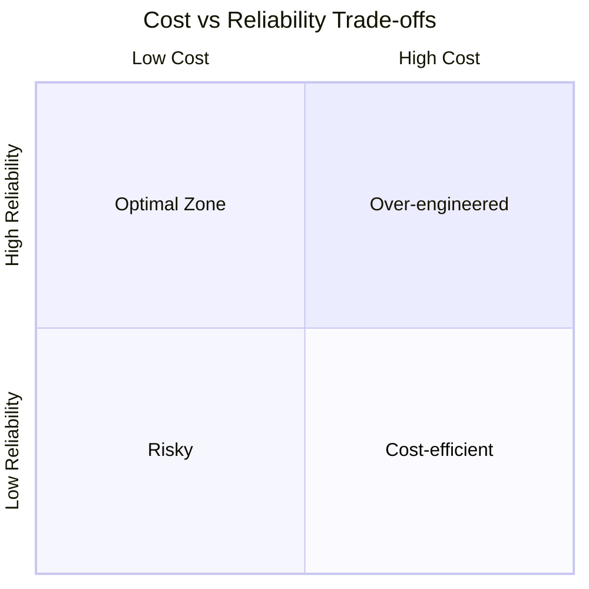
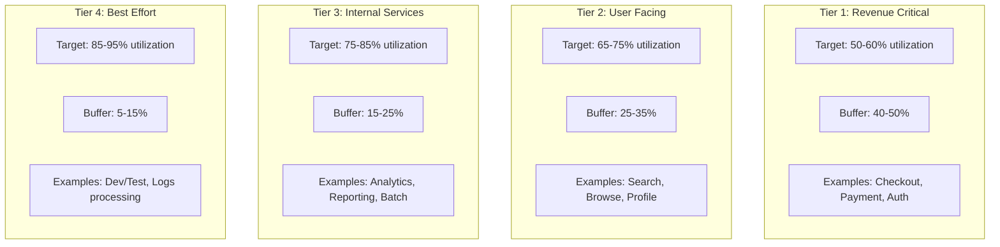
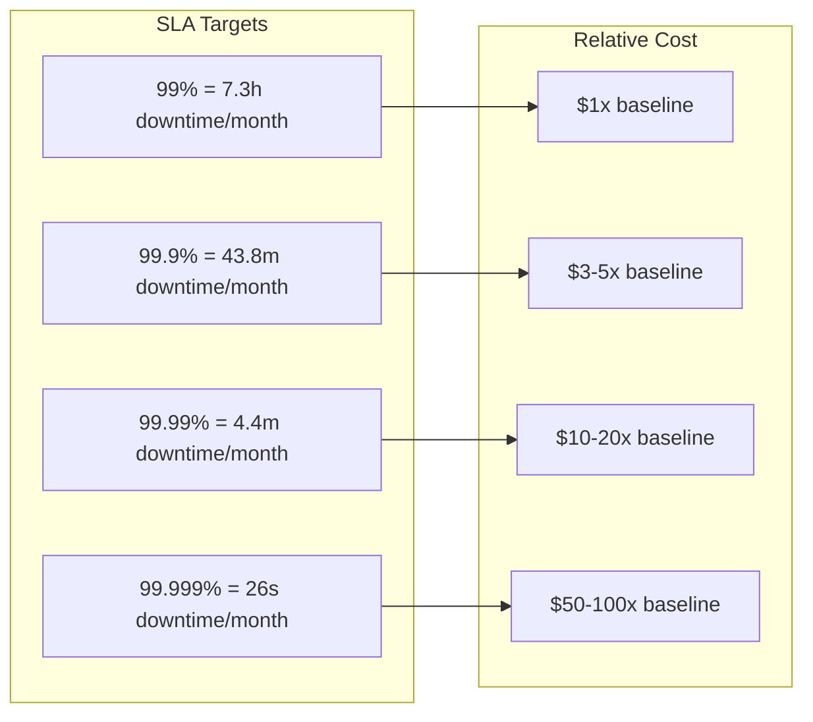
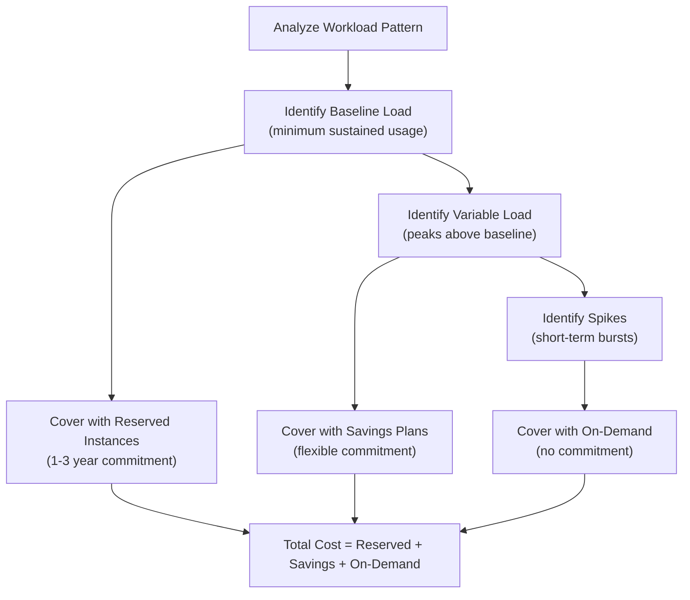
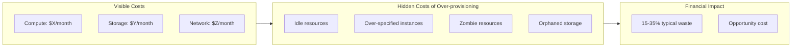
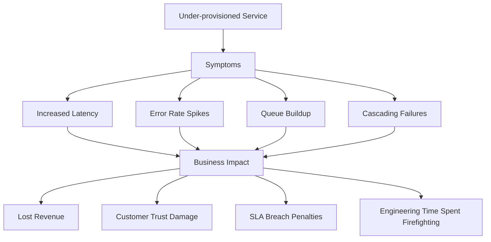

# How to Create Cost-Capacity Trade-offs

Author: [nawazdhandala](https://github.com/nawazdhandala)

Tags: Capacity Planning, Cost Optimization, SRE, FinOps

Description: Learn how to balance cost and capacity for optimal resource utilization.

---

Every infrastructure decision is a trade-off between cost and capacity. Provision too little and you risk outages, poor performance, and frustrated users. Provision too much and you waste money on idle resources. The art of capacity planning lies in finding the sweet spot where reliability meets fiscal responsibility.

This guide provides frameworks, formulas, and practical tools for making cost-capacity decisions systematically rather than by gut feel. Whether you are sizing a new service, planning reserved instance purchases, or deciding how much buffer to maintain, these patterns will help you make defensible choices.

---

## Trade-off Analysis Frameworks

Before making any capacity decision, establish a framework for evaluating trade-offs. The goal is to translate abstract concepts like "reliability" and "cost efficiency" into concrete numbers you can compare.

### The Cost-Reliability Matrix

Every capacity decision falls somewhere on a matrix of cost and reliability. Understanding where your service sits helps you make appropriate trade-offs.



| Quadrant | Cost | Reliability | Action |
|----------|------|-------------|--------|
| Over-engineered | High | High | Reduce capacity or accept as justified for critical services |
| Optimal Zone | Medium | High | Maintain current approach |
| Cost-efficient | Low | Medium | Acceptable for non-critical services |
| Risky | Low | Low | Increase capacity or improve efficiency |

### Decision Framework Algorithm

Use this structured approach for any capacity decision.

```typescript
// capacity-decision.ts - Framework for capacity trade-off analysis
interface CapacityDecision {
  serviceName: string;
  currentCapacity: number;
  peakDemand: number;
  criticality: 'critical' | 'important' | 'standard';
  costPerUnit: number;
  outageHourlyCost: number;
}

interface RecommendedCapacity {
  targetCapacity: number;
  bufferPercentage: number;
  monthlyCost: number;
  rationale: string;
}

function analyzeCapacityTradeoff(decision: CapacityDecision): RecommendedCapacity {
  // Calculate base buffer based on service criticality
  const bufferMultipliers = {
    critical: 1.5,    // 50% buffer for mission-critical services
    important: 1.3,   // 30% buffer for important services
    standard: 1.15,   // 15% buffer for standard services
  };

  const bufferMultiplier = bufferMultipliers[decision.criticality];
  const targetCapacity = Math.ceil(decision.peakDemand * bufferMultiplier);
  const bufferPercentage = (bufferMultiplier - 1) * 100;

  // Calculate monthly cost assuming 730 hours per month
  const monthlyCost = targetCapacity * decision.costPerUnit * 730;

  // Calculate break-even point for additional capacity
  const additionalUnits = targetCapacity - decision.peakDemand;
  const additionalMonthlyCost = additionalUnits * decision.costPerUnit * 730;
  const hoursOfOutageCovered = additionalMonthlyCost / decision.outageHourlyCost;

  const rationale = `Target ${targetCapacity} units provides ${bufferPercentage}% buffer. ` +
    `Additional capacity cost of $${additionalMonthlyCost.toFixed(2)}/month ` +
    `is justified if it prevents ${hoursOfOutageCovered.toFixed(1)} hours of outage per month.`;

  return {
    targetCapacity,
    bufferPercentage,
    monthlyCost,
    rationale,
  };
}

// Example usage
const paymentService: CapacityDecision = {
  serviceName: 'payment-processor',
  currentCapacity: 100,
  peakDemand: 80,
  criticality: 'critical',
  costPerUnit: 0.10,  // $0.10 per unit per hour
  outageHourlyCost: 50000,  // $50,000 per hour of outage
};

const recommendation = analyzeCapacityTradeoff(paymentService);
console.log(recommendation);
// {
//   targetCapacity: 120,
//   bufferPercentage: 50,
//   monthlyCost: 8760,
//   rationale: "Target 120 units provides 50% buffer. Additional capacity cost of $2920.00/month is justified if it prevents 0.1 hours of outage per month."
// }
```

---

## Utilization Targets by Tier

Not all services deserve the same headroom. Setting utilization targets by service tier creates a consistent framework for capacity decisions across your organization.



### Utilization Target Calculator

```typescript
// utilization-targets.ts - Calculate appropriate utilization targets
interface ServiceProfile {
  name: string;
  tier: 1 | 2 | 3 | 4;
  currentUtilization: number;
  currentCapacity: number;
  growthRateMonthly: number;  // Expected monthly growth rate (e.g., 0.05 for 5%)
}

interface UtilizationTarget {
  targetUtilization: { min: number; max: number };
  recommendedCapacity: number;
  capacityChange: number;
  monthsUntilResize: number;
}

const tierTargets = {
  1: { min: 0.50, max: 0.60, description: 'Revenue Critical' },
  2: { min: 0.65, max: 0.75, description: 'User Facing' },
  3: { min: 0.75, max: 0.85, description: 'Internal Services' },
  4: { min: 0.85, max: 0.95, description: 'Best Effort' },
};

function calculateUtilizationTarget(profile: ServiceProfile): UtilizationTarget {
  const target = tierTargets[profile.tier];
  const targetMidpoint = (target.min + target.max) / 2;

  // Current demand = utilization * capacity
  const currentDemand = profile.currentUtilization * profile.currentCapacity;

  // Recommended capacity to hit target midpoint
  const recommendedCapacity = Math.ceil(currentDemand / targetMidpoint);
  const capacityChange = recommendedCapacity - profile.currentCapacity;

  // Calculate months until we hit max utilization at current growth rate
  const monthsUntilMax = profile.growthRateMonthly > 0
    ? Math.log(target.max / profile.currentUtilization) / Math.log(1 + profile.growthRateMonthly)
    : Infinity;

  return {
    targetUtilization: { min: target.min * 100, max: target.max * 100 },
    recommendedCapacity,
    capacityChange,
    monthsUntilResize: Math.floor(monthsUntilMax),
  };
}

// Example: Tier 1 service running hot
const checkoutService: ServiceProfile = {
  name: 'checkout-api',
  tier: 1,
  currentUtilization: 0.72,  // Running at 72% - too high for Tier 1
  currentCapacity: 100,
  growthRateMonthly: 0.03,
};

const checkoutTarget = calculateUtilizationTarget(checkoutService);
console.log(checkoutTarget);
// {
//   targetUtilization: { min: 50, max: 60 },
//   recommendedCapacity: 131,  // Need to scale up
//   capacityChange: 31,
//   monthsUntilResize: -6  // Already over target
// }
```

### Utilization Target Reference Table

| Tier | Min Util | Max Util | Buffer | Use Case | Scaling Trigger |
|------|----------|----------|--------|----------|-----------------|
| 1 | 50% | 60% | 40-50% | Payment, Auth, Checkout | Util > 55% for 1 hour |
| 2 | 65% | 75% | 25-35% | Search, Product Pages | Util > 70% for 2 hours |
| 3 | 75% | 85% | 15-25% | Internal APIs, Workers | Util > 80% for 4 hours |
| 4 | 85% | 95% | 5-15% | Batch Jobs, Dev/Test | Util > 90% for 8 hours |

---

## Reliability Cost Calculation

Every nine of availability has a cost. Understanding this cost helps you make informed decisions about how much reliability to buy.



### Reliability Cost Model

```typescript
// reliability-cost.ts - Model the cost of each nine of availability
interface ReliabilityRequirements {
  targetAvailability: number;  // e.g., 0.999 for 99.9%
  monthlyRevenue: number;
  revenueImpactPercentage: number;  // What % of revenue is affected by downtime
}

interface ReliabilityCost {
  allowedDowntimeMinutes: number;
  costOfDowntimePerMinute: number;
  maxMonthlyDowntimeCost: number;
  infrastructureBudgetCeiling: number;
  recommendation: string;
}

function calculateReliabilityCost(requirements: ReliabilityRequirements): ReliabilityCost {
  // Calculate allowed downtime
  const minutesPerMonth = 30 * 24 * 60;  // 43,200 minutes
  const allowedDowntimeMinutes = minutesPerMonth * (1 - requirements.targetAvailability);

  // Calculate cost of downtime
  const revenuePerMinute = requirements.monthlyRevenue / minutesPerMonth;
  const costOfDowntimePerMinute = revenuePerMinute * requirements.revenueImpactPercentage;

  // Maximum acceptable cost of downtime per month
  const maxMonthlyDowntimeCost = allowedDowntimeMinutes * costOfDowntimePerMinute;

  // Infrastructure budget ceiling: spend up to the cost of one additional outage
  // to prevent that outage
  const infrastructureBudgetCeiling = costOfDowntimePerMinute * 60;  // 1 hour of outage prevention

  const recommendation = allowedDowntimeMinutes < 5
    ? 'Requires active-active multi-region deployment'
    : allowedDowntimeMinutes < 45
    ? 'Requires redundant components with automatic failover'
    : allowedDowntimeMinutes < 450
    ? 'Standard HA deployment with monitoring'
    : 'Basic deployment acceptable';

  return {
    allowedDowntimeMinutes: Math.round(allowedDowntimeMinutes * 10) / 10,
    costOfDowntimePerMinute: Math.round(costOfDowntimePerMinute),
    maxMonthlyDowntimeCost: Math.round(maxMonthlyDowntimeCost),
    infrastructureBudgetCeiling: Math.round(infrastructureBudgetCeiling),
    recommendation,
  };
}

// Example: E-commerce platform
const ecommerceReliability: ReliabilityRequirements = {
  targetAvailability: 0.999,  // 99.9% target
  monthlyRevenue: 10000000,   // $10M monthly revenue
  revenueImpactPercentage: 0.8,  // 80% of revenue impacted during outage
};

const reliabilityCost = calculateReliabilityCost(ecommerceReliability);
console.log(reliabilityCost);
// {
//   allowedDowntimeMinutes: 43.2,
//   costOfDowntimePerMinute: 185,
//   maxMonthlyDowntimeCost: 7992,
//   infrastructureBudgetCeiling: 11111,
//   recommendation: "Requires redundant components with automatic failover"
// }
```

### The Nine Calculator

Use this table to quickly estimate downtime allowances:

| Availability | Monthly Downtime | Annual Downtime | Typical Architecture |
|--------------|------------------|-----------------|---------------------|
| 99% | 7.3 hours | 3.65 days | Single instance |
| 99.5% | 3.65 hours | 1.83 days | Basic redundancy |
| 99.9% | 43.8 minutes | 8.76 hours | HA with failover |
| 99.95% | 21.9 minutes | 4.38 hours | Multi-AZ deployment |
| 99.99% | 4.38 minutes | 52.6 minutes | Multi-region active-passive |
| 99.999% | 26.3 seconds | 5.26 minutes | Multi-region active-active |

---

## Reserved vs On-Demand Decisions

The reserved instance decision is one of the highest-impact cost optimizations. Getting it right requires understanding your baseline load, demand variability, and commitment tolerance.



### Reserved Instance Calculator

```typescript
// reserved-calculator.ts - Optimize reserved vs on-demand mix
interface UsagePattern {
  hourlyUsage: number[];  // 720 hours of usage data (one month)
  onDemandPrice: number;  // Per-hour on-demand price
  reservedPrice1yr: number;  // Per-hour effective price with 1-year reservation
  reservedPrice3yr: number;  // Per-hour effective price with 3-year reservation
  savingsPlansPrice: number;  // Per-hour price with Savings Plans
}

interface ReservationRecommendation {
  reservedUnits: number;
  savingsPlansUnits: number;
  onDemandPeakUnits: number;
  monthlyOnDemandCost: number;
  monthlyOptimizedCost: number;
  monthlySavings: number;
  savingsPercentage: number;
  breakEvenMonths: number;
}

function analyzeReservationStrategy(pattern: UsagePattern): ReservationRecommendation {
  // Sort usage to find percentiles
  const sortedUsage = [...pattern.hourlyUsage].sort((a, b) => a - b);
  const hours = sortedUsage.length;

  // P10 usage - this is your stable baseline, ideal for 3-year reserved
  const p10Index = Math.floor(hours * 0.10);
  const p10Usage = sortedUsage[p10Index];

  // P50 usage - cover with Savings Plans or 1-year reserved
  const p50Index = Math.floor(hours * 0.50);
  const p50Usage = sortedUsage[p50Index];

  // P95 usage - peak handling with on-demand
  const p95Index = Math.floor(hours * 0.95);
  const p95Usage = sortedUsage[p95Index];

  // Allocation strategy
  const reservedUnits = Math.floor(p10Usage);  // Committed baseline
  const savingsPlansUnits = Math.floor(p50Usage - p10Usage);  // Flexible middle tier
  const onDemandPeakUnits = Math.ceil(p95Usage - p50Usage);  // Peaks

  // Calculate costs
  const monthlyOnDemandCost = sortedUsage.reduce((sum, usage) =>
    sum + usage * pattern.onDemandPrice, 0);

  const monthlyReservedCost = reservedUnits * hours * pattern.reservedPrice3yr;
  const monthlySavingsPlansCost = savingsPlansUnits * hours * pattern.savingsPlansPrice;

  // For on-demand portion, only pay when usage exceeds committed capacity
  const onDemandHours = pattern.hourlyUsage.filter(u =>
    u > reservedUnits + savingsPlansUnits);
  const monthlyOnDemandPortionCost = onDemandHours.reduce((sum, usage) =>
    sum + (usage - reservedUnits - savingsPlansUnits) * pattern.onDemandPrice, 0);

  const monthlyOptimizedCost = monthlyReservedCost + monthlySavingsPlansCost + monthlyOnDemandPortionCost;
  const monthlySavings = monthlyOnDemandCost - monthlyOptimizedCost;
  const savingsPercentage = (monthlySavings / monthlyOnDemandCost) * 100;

  // Break-even calculation (assuming upfront payment for reserved)
  const upfrontCost = reservedUnits * pattern.reservedPrice3yr * hours * 12;  // 1 year upfront
  const breakEvenMonths = upfrontCost > 0 ? Math.ceil(upfrontCost / monthlySavings) : 0;

  return {
    reservedUnits,
    savingsPlansUnits,
    onDemandPeakUnits,
    monthlyOnDemandCost: Math.round(monthlyOnDemandCost),
    monthlyOptimizedCost: Math.round(monthlyOptimizedCost),
    monthlySavings: Math.round(monthlySavings),
    savingsPercentage: Math.round(savingsPercentage),
    breakEvenMonths,
  };
}

// Example: Generate sample usage pattern with daily and weekly seasonality
function generateSampleUsage(): number[] {
  const usage: number[] = [];
  for (let hour = 0; hour < 720; hour++) {
    const dayOfWeek = Math.floor(hour / 24) % 7;
    const hourOfDay = hour % 24;

    // Base load
    let load = 50;

    // Business hours boost (9am-6pm)
    if (hourOfDay >= 9 && hourOfDay <= 18) {
      load += 30;
    }

    // Weekend reduction
    if (dayOfWeek >= 5) {
      load *= 0.6;
    }

    // Random variation
    load += (Math.random() - 0.5) * 20;

    usage.push(Math.max(10, load));
  }
  return usage;
}

const usagePattern: UsagePattern = {
  hourlyUsage: generateSampleUsage(),
  onDemandPrice: 0.10,
  reservedPrice1yr: 0.065,
  reservedPrice3yr: 0.04,
  savingsPlansPrice: 0.07,
};

const recommendation = analyzeReservationStrategy(usagePattern);
console.log(recommendation);
```

### Reservation Decision Matrix

| Workload Characteristic | Recommended Strategy | Typical Savings |
|------------------------|---------------------|-----------------|
| Steady state, predictable | 3-year Reserved | 50-70% |
| Predictable with growth | 1-year Reserved + Savings Plans | 30-50% |
| Variable but bounded | Savings Plans | 20-40% |
| Unpredictable spikes | On-Demand + Auto-scaling | 0% (flexibility) |
| Batch/scheduled | Spot Instances | 60-90% |

---

## Over-Provisioning Costs

Over-provisioning is paying for insurance. Understand exactly how much insurance you are buying and whether the premium is worth it.



### Over-Provisioning Analyzer

```typescript
// over-provisioning.ts - Identify and quantify over-provisioned resources
interface ResourceUtilization {
  resourceId: string;
  resourceType: string;
  allocatedCapacity: number;
  peakUtilization: number;  // Percentage (0-100)
  avgUtilization: number;   // Percentage (0-100)
  hourlyCost: number;
}

interface OverProvisioningReport {
  totalMonthlyCost: number;
  wastedMonthlyCost: number;
  wastePercentage: number;
  recommendations: ResourceRecommendation[];
}

interface ResourceRecommendation {
  resourceId: string;
  currentSize: number;
  recommendedSize: number;
  currentMonthlyCost: number;
  optimizedMonthlyCost: number;
  monthlySavings: number;
  risk: 'low' | 'medium' | 'high';
}

function analyzeOverProvisioning(
  resources: ResourceUtilization[],
  targetUtilization: number = 70
): OverProvisioningReport {
  const hoursPerMonth = 730;
  const recommendations: ResourceRecommendation[] = [];
  let totalMonthlyCost = 0;
  let wastedMonthlyCost = 0;

  for (const resource of resources) {
    const monthlyCost = resource.hourlyCost * hoursPerMonth;
    totalMonthlyCost += monthlyCost;

    // Calculate right-sized capacity based on peak utilization
    const peakUtilizationRatio = resource.peakUtilization / 100;
    const rightSizedCapacity = Math.ceil(
      (resource.allocatedCapacity * peakUtilizationRatio) / (targetUtilization / 100)
    );

    // Only recommend resize if it would reduce capacity by at least 20%
    const reductionRatio = rightSizedCapacity / resource.allocatedCapacity;
    if (reductionRatio < 0.8) {
      const optimizedMonthlyCost = monthlyCost * reductionRatio;
      const savings = monthlyCost - optimizedMonthlyCost;
      wastedMonthlyCost += savings;

      // Assess risk based on headroom between peak and target
      const headroom = targetUtilization - resource.peakUtilization;
      const risk = headroom < 10 ? 'high' : headroom < 20 ? 'medium' : 'low';

      recommendations.push({
        resourceId: resource.resourceId,
        currentSize: resource.allocatedCapacity,
        recommendedSize: rightSizedCapacity,
        currentMonthlyCost: Math.round(monthlyCost),
        optimizedMonthlyCost: Math.round(optimizedMonthlyCost),
        monthlySavings: Math.round(savings),
        risk,
      });
    }
  }

  // Sort recommendations by savings descending
  recommendations.sort((a, b) => b.monthlySavings - a.monthlySavings);

  return {
    totalMonthlyCost: Math.round(totalMonthlyCost),
    wastedMonthlyCost: Math.round(wastedMonthlyCost),
    wastePercentage: Math.round((wastedMonthlyCost / totalMonthlyCost) * 100),
    recommendations,
  };
}

// Example analysis
const resources: ResourceUtilization[] = [
  {
    resourceId: 'api-server-prod-01',
    resourceType: 'c5.4xlarge',
    allocatedCapacity: 16,  // vCPUs
    peakUtilization: 35,
    avgUtilization: 18,
    hourlyCost: 0.68,
  },
  {
    resourceId: 'api-server-prod-02',
    resourceType: 'c5.4xlarge',
    allocatedCapacity: 16,
    peakUtilization: 42,
    avgUtilization: 22,
    hourlyCost: 0.68,
  },
  {
    resourceId: 'db-replica-01',
    resourceType: 'r5.2xlarge',
    allocatedCapacity: 8,
    peakUtilization: 28,
    avgUtilization: 12,
    hourlyCost: 0.504,
  },
  {
    resourceId: 'cache-cluster',
    resourceType: 'r5.xlarge',
    allocatedCapacity: 4,
    peakUtilization: 65,
    avgUtilization: 45,
    hourlyCost: 0.252,
  },
];

const report = analyzeOverProvisioning(resources);
console.log(report);
// {
//   totalMonthlyCost: 1533,
//   wastedMonthlyCost: 612,
//   wastePercentage: 40,
//   recommendations: [...]
// }
```

### Common Over-Provisioning Patterns

| Pattern | Symptom | Root Cause | Solution |
|---------|---------|------------|----------|
| Launch Oversize | New services start with large instances | Fear of unknown demand | Start small, auto-scale |
| Abandoned Scale-up | Resources scaled up but never down | Missing scale-down policies | Implement scheduled or metric-based scale-down |
| Memory Hoarders | Large memory instances with low utilization | One-time memory spike | Analyze memory patterns, consider caching |
| IOPS Overspec | Premium storage with low actual IOPS | Pessimistic performance estimates | Monitor actual IOPS, downgrade storage tier |
| Zombie Resources | Unused but running resources | Poor lifecycle management | Implement tagging and cleanup automation |

---

## Under-Provisioning Risks

Under-provisioning saves money until it costs you everything. Understanding the true cost of insufficient capacity helps justify appropriate headroom.



### Under-Provisioning Risk Calculator

```typescript
// under-provisioning-risk.ts - Calculate the true cost of insufficient capacity
interface UnderProvisioningScenario {
  serviceName: string;
  currentCapacity: number;
  expectedPeakDemand: number;
  peakProbability: number;  // Probability of hitting peak in any given month
  outageHourlyCost: number;
  degradedHourlyCost: number;  // Cost when service is slow but not down
  capacityUnitCost: number;  // Hourly cost per capacity unit
}

interface RiskAnalysis {
  shortfallUnits: number;
  monthlyOutageRisk: number;  // Expected hours of outage per month
  monthlyDegradedRisk: number;  // Expected hours of degraded service
  expectedMonthlyCost: number;  // Expected cost of under-provisioning
  additionalCapacityCost: number;  // Cost to provision adequate capacity
  riskRewardRatio: number;  // How many dollars at risk per dollar saved
  recommendation: string;
}

function analyzeUnderProvisioningRisk(scenario: UnderProvisioningScenario): RiskAnalysis {
  const hoursPerMonth = 730;

  // Calculate capacity shortfall
  const shortfallUnits = Math.max(0, scenario.expectedPeakDemand - scenario.currentCapacity);
  const shortfallPercentage = shortfallUnits / scenario.expectedPeakDemand;

  // Estimate outage and degradation hours based on shortfall
  // Assumption: shortfall leads to degraded service, severe shortfall leads to outage
  const peakHoursPerMonth = hoursPerMonth * scenario.peakProbability * 0.2;  // Peak periods
  const degradedHours = shortfallPercentage > 0 ? peakHoursPerMonth * shortfallPercentage : 0;
  const outageHours = shortfallPercentage > 0.3 ? degradedHours * 0.3 : 0;  // Severe shortfall causes outages

  // Calculate expected costs
  const expectedMonthlyCost =
    (outageHours * scenario.outageHourlyCost) +
    (degradedHours * scenario.degradedHourlyCost);

  // Cost to fix
  const additionalCapacityCost = shortfallUnits * scenario.capacityUnitCost * hoursPerMonth;

  // Risk-reward ratio
  const riskRewardRatio = additionalCapacityCost > 0
    ? expectedMonthlyCost / additionalCapacityCost
    : 0;

  let recommendation: string;
  if (riskRewardRatio > 10) {
    recommendation = 'CRITICAL: Immediately provision additional capacity. Risk far exceeds cost.';
  } else if (riskRewardRatio > 3) {
    recommendation = 'HIGH: Provision additional capacity within this sprint.';
  } else if (riskRewardRatio > 1) {
    recommendation = 'MEDIUM: Plan capacity increase for next quarter.';
  } else {
    recommendation = 'LOW: Current capacity is appropriate for the risk profile.';
  }

  return {
    shortfallUnits,
    monthlyOutageRisk: Math.round(outageHours * 100) / 100,
    monthlyDegradedRisk: Math.round(degradedHours * 100) / 100,
    expectedMonthlyCost: Math.round(expectedMonthlyCost),
    additionalCapacityCost: Math.round(additionalCapacityCost),
    riskRewardRatio: Math.round(riskRewardRatio * 10) / 10,
    recommendation,
  };
}

// Example: E-commerce during holiday season
const holidayScenario: UnderProvisioningScenario = {
  serviceName: 'checkout-service',
  currentCapacity: 100,
  expectedPeakDemand: 150,  // 50% higher during holidays
  peakProbability: 0.25,  // One week of holiday shopping per month
  outageHourlyCost: 100000,  // $100K per hour of checkout outage
  degradedHourlyCost: 25000,  // $25K per hour of slow checkout
  capacityUnitCost: 0.50,  // $0.50 per capacity unit per hour
};

const riskAnalysis = analyzeUnderProvisioningRisk(holidayScenario);
console.log(riskAnalysis);
// {
//   shortfallUnits: 50,
//   monthlyOutageRisk: 3.65,
//   monthlyDegradedRisk: 12.17,
//   expectedMonthlyCost: 669250,
//   additionalCapacityCost: 18250,
//   riskRewardRatio: 36.7,
//   recommendation: "CRITICAL: Immediately provision additional capacity. Risk far exceeds cost."
// }
```

### Under-Provisioning Impact Matrix

| Impact Category | Immediate Cost | Long-term Cost | Mitigation |
|-----------------|----------------|----------------|------------|
| Performance Degradation | Lost conversions | Customer churn | Auto-scaling, load shedding |
| Service Outage | Lost revenue | Brand damage | Redundancy, capacity buffer |
| Cascading Failure | Multi-service impact | Extended recovery | Circuit breakers, bulkheads |
| Data Loss | Recovery costs | Compliance fines | Replication, backups |
| SLA Breach | Credit payouts | Contract loss | Conservative SLOs, monitoring |

---

## Building a Cost-Capacity Dashboard

Bring all these metrics together in a dashboard that enables real-time trade-off decisions.

```typescript
// cost-capacity-dashboard.ts - Unified view of cost-capacity metrics
interface ServiceCostCapacity {
  serviceName: string;
  tier: 1 | 2 | 3 | 4;

  // Capacity metrics
  allocatedCapacity: number;
  currentUtilization: number;
  peakUtilization30d: number;

  // Cost metrics
  monthlyCost: number;
  costPerTransaction: number;
  reservedCoverage: number;  // Percentage covered by reserved instances

  // Reliability metrics
  availability30d: number;
  p99Latency: number;
  errorRate: number;

  // Calculated trade-offs
  efficiencyScore: number;  // 0-100
  riskScore: number;  // 0-100
}

function calculateEfficiencyScore(service: ServiceCostCapacity): number {
  const tierTargets = { 1: 55, 2: 70, 3: 80, 4: 90 };
  const targetUtil = tierTargets[service.tier];

  // Efficiency drops if utilization is too far from target (either direction)
  const utilizationGap = Math.abs(service.currentUtilization - targetUtil);
  const utilizationScore = Math.max(0, 100 - utilizationGap * 2);

  // Higher reserved coverage is better
  const reservedScore = service.reservedCoverage;

  // Lower cost per transaction is better (normalized)
  const costScore = Math.max(0, 100 - service.costPerTransaction * 1000);

  return Math.round((utilizationScore * 0.4 + reservedScore * 0.3 + costScore * 0.3));
}

function calculateRiskScore(service: ServiceCostCapacity): number {
  const tierTargets = { 1: 55, 2: 70, 3: 80, 4: 90 };
  const targetUtil = tierTargets[service.tier];

  // Risk increases if running hotter than target
  const overUtilizationRisk = service.currentUtilization > targetUtil
    ? (service.currentUtilization - targetUtil) * 3
    : 0;

  // Risk increases if peak is close to capacity
  const peakRisk = service.peakUtilization30d > 85 ? (service.peakUtilization30d - 85) * 4 : 0;

  // Risk increases with error rate
  const errorRisk = service.errorRate * 100;

  // Risk increases if availability is below target
  const availabilityRisk = service.availability30d < 99.9
    ? (99.9 - service.availability30d) * 50
    : 0;

  return Math.min(100, Math.round(overUtilizationRisk + peakRisk + errorRisk + availabilityRisk));
}

// Example dashboard data
const services: ServiceCostCapacity[] = [
  {
    serviceName: 'payment-api',
    tier: 1,
    allocatedCapacity: 100,
    currentUtilization: 62,
    peakUtilization30d: 78,
    monthlyCost: 15000,
    costPerTransaction: 0.003,
    reservedCoverage: 70,
    availability30d: 99.95,
    p99Latency: 120,
    errorRate: 0.02,
    efficiencyScore: 0,
    riskScore: 0,
  },
  {
    serviceName: 'search-api',
    tier: 2,
    allocatedCapacity: 50,
    currentUtilization: 75,
    peakUtilization30d: 92,
    monthlyCost: 8000,
    costPerTransaction: 0.001,
    reservedCoverage: 40,
    availability30d: 99.85,
    p99Latency: 250,
    errorRate: 0.15,
    efficiencyScore: 0,
    riskScore: 0,
  },
];

// Calculate scores
for (const service of services) {
  service.efficiencyScore = calculateEfficiencyScore(service);
  service.riskScore = calculateRiskScore(service);
}

console.log('Cost-Capacity Dashboard:');
console.table(services.map(s => ({
  Service: s.serviceName,
  Tier: s.tier,
  Utilization: `${s.currentUtilization}%`,
  'Monthly Cost': `$${s.monthlyCost}`,
  Efficiency: s.efficiencyScore,
  Risk: s.riskScore,
  Action: s.riskScore > 50 ? 'SCALE UP' : s.efficiencyScore < 50 ? 'OPTIMIZE' : 'OK',
})));
```

---

## Key Takeaways

Cost-capacity trade-offs are not about minimizing cost or maximizing capacity. They are about making intentional decisions that align with business priorities.

- **Tier your services**: Not everything needs five-nines. Match reliability investments to business value.
- **Quantify the trade-offs**: Convert reliability into dollars so you can compare apples to apples.
- **Set utilization targets by tier**: High-tier services run cooler, low-tier services run hotter.
- **Optimize reserved coverage**: Match commitment levels to workload predictability.
- **Monitor both over and under-provisioning**: Track waste and risk simultaneously.
- **Build dashboards that enable decisions**: Combine cost, capacity, and reliability metrics in one view.

The goal is not perfect efficiency. The goal is intentional inefficiency: knowing exactly how much buffer you are buying, why you are buying it, and what it would cost if you did not have it.

---

**Related Reading:**

- [SRE Metrics Worth Tracking](https://oneuptime.com/blog/post/2025-11-28-sre-metrics-to-track/view)
- [SRE Best Practices That Actually Move the Needle](https://oneuptime.com/blog/post/2025-11-28-sre-best-practices/view)
- [How to Autoscale Deployments with the Horizontal Pod Autoscaler](https://oneuptime.com/blog/post/2025-11-27-hpa-autoscale/view)
