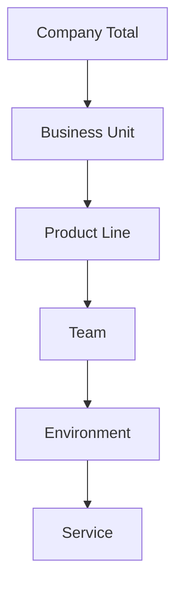
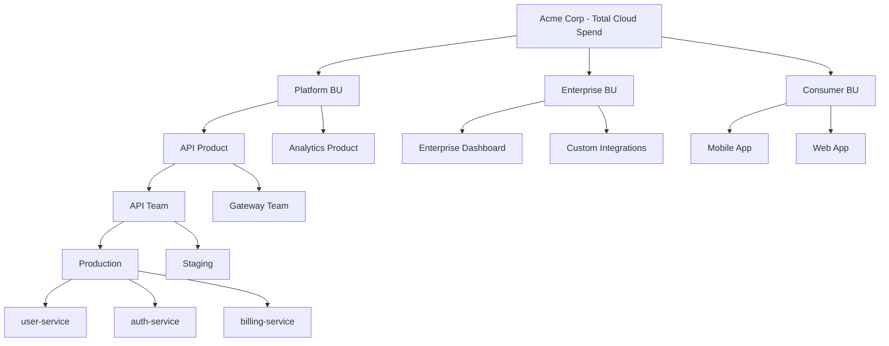
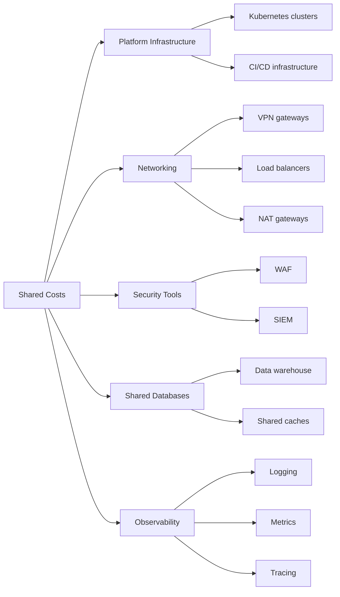

# How to Create Cost Center Mapping

Author: [nawazdhandala](https://github.com/nawazdhandala)

Tags: Cost Management, FinOps, Cloud, Allocation

Description: A practical guide to mapping cloud costs to business units, teams, and products using tagging strategies and allocation rules.

---

Cost center mapping ties your cloud spend to the business units that generate it. Without a clear mapping strategy, finance teams chase engineers for context, engineering teams blame each other for overruns, and leadership makes decisions based on incomplete data. This guide walks through building a cost center hierarchy, implementing consistent tagging, handling shared costs, and creating reports that drive accountability.

---

## Why cost center mapping matters

Cloud bills arrive as a single number. A $50,000 monthly invoice tells you nothing about which team, product, or customer segment drove the spend. Cost center mapping breaks that number into pieces that match your organization structure, letting you:

- Allocate costs to the teams that control them
- Build accurate unit economics for products and features
- Identify optimization opportunities within specific business areas
- Create budgets that engineering teams can own and forecast against
- Support chargeback or showback models that drive accountability

---

## Building your cost hierarchy

Start by defining a hierarchy that reflects how your organization makes decisions. Most companies use a structure like this:



Each level in the hierarchy serves a different audience:

| Level | Primary Audience | Typical Questions |
|-------|------------------|-------------------|
| Business Unit | Executive leadership | How much does each division spend? |
| Product Line | Product managers | What's the infrastructure cost per product? |
| Team | Engineering managers | Is my team within budget? |
| Environment | Operations | How does staging compare to production? |
| Service | Individual engineers | Which microservice costs the most? |

---

## Example hierarchy for a SaaS company



---

## Implementing a tagging strategy

Tags are the foundation of cost allocation. Every resource needs tags that answer: who owns this, what product does it support, and what environment does it run in?

### Required tags for every resource

Define a minimum set of tags that every resource must have:

```yaml
# Minimum required tags
cost-center: "engineering-platform"
product: "api-gateway"
team: "gateway-team"
environment: "production"
owner: "jane.smith@company.com"
```

### Tag naming conventions

Stick to a consistent format across all cloud providers:

| Tag Key | Format | Examples |
|---------|--------|----------|
| cost-center | lowercase-hyphenated | `engineering-platform`, `sales-ops` |
| product | lowercase-hyphenated | `api-gateway`, `mobile-app` |
| team | lowercase-hyphenated | `gateway-team`, `billing-team` |
| environment | lowercase single word | `production`, `staging`, `development` |
| owner | email address | `jane.smith@company.com` |

### Enforcing tag compliance

Tags only work if they're applied consistently. Enforce compliance through:

**Infrastructure as Code validation**

```hcl
# Terraform example: require tags on all AWS resources
variable "required_tags" {
  type = map(string)
  default = {
    cost-center = ""
    product     = ""
    team        = ""
    environment = ""
    owner       = ""
  }
}

resource "aws_instance" "example" {
  ami           = "ami-12345678"
  instance_type = "t3.medium"

  tags = merge(var.required_tags, {
    cost-center = "engineering-platform"
    product     = "api-gateway"
    team        = "gateway-team"
    environment = "production"
    owner       = "jane.smith@company.com"
    Name        = "api-gateway-prod-01"
  })
}
```

**Cloud provider policies**

AWS Organizations Service Control Policies, Azure Policy, and GCP Organization Policies can block resource creation without required tags.

**CI/CD pipeline checks**

Add a step to your deployment pipeline that fails if resources lack required tags:

```bash
#!/bin/bash
# Check for required tags in Terraform plan

REQUIRED_TAGS=("cost-center" "product" "team" "environment" "owner")

for tag in "${REQUIRED_TAGS[@]}"; do
  if ! grep -q "\"$tag\"" terraform.plan.json; then
    echo "ERROR: Missing required tag: $tag"
    exit 1
  fi
done
```

---

## Handling shared costs

Not all costs map cleanly to a single team or product. Shared resources like networking, security tools, databases used by multiple services, and platform infrastructure need allocation rules.

### Common shared cost categories



### Allocation methods

Choose an allocation method based on what's fair and what's measurable:

| Method | When to use | Example |
|--------|-------------|---------|
| Even split | All consumers benefit equally | Security scanning tools split across all teams |
| Usage-based | Consumption varies significantly | Database costs based on query volume |
| Headcount | Cost scales with team size | Shared dev tooling per engineer |
| Revenue | Tie to business outcomes | Platform costs by product revenue share |

### Example: Kubernetes cluster cost allocation

A shared Kubernetes cluster hosts workloads from multiple teams. Allocate costs based on actual resource consumption:

```yaml
# Cost allocation configuration
shared_resource:
  name: "production-kubernetes-cluster"
  total_monthly_cost: 15000
  allocation_method: "usage_based"

allocation_rules:
  - metric: "cpu_requests"
    weight: 0.4
  - metric: "memory_requests"
    weight: 0.4
  - metric: "storage_claims"
    weight: 0.2

team_usage:
  gateway-team:
    cpu_requests: 2000      # millicores
    memory_requests: 8192   # MB
    storage_claims: 100     # GB
  billing-team:
    cpu_requests: 1000
    memory_requests: 4096
    storage_claims: 50
  analytics-team:
    cpu_requests: 3000
    memory_requests: 16384
    storage_claims: 500
```

Calculate each team's share:

```
Total CPU: 6000 millicores
Total Memory: 28672 MB
Total Storage: 650 GB

Gateway team:
  CPU share: (2000/6000) * 0.4 = 0.133
  Memory share: (8192/28672) * 0.4 = 0.114
  Storage share: (100/650) * 0.2 = 0.031
  Total share: 27.8%
  Allocated cost: $4,170

Billing team:
  CPU share: (1000/6000) * 0.4 = 0.067
  Memory share: (4096/28672) * 0.4 = 0.057
  Storage share: (50/650) * 0.2 = 0.015
  Total share: 13.9%
  Allocated cost: $2,085

Analytics team:
  CPU share: (3000/6000) * 0.4 = 0.200
  Memory share: (16384/28672) * 0.4 = 0.229
  Storage share: (500/650) * 0.2 = 0.154
  Total share: 58.3%
  Allocated cost: $8,745
```

---

## Building cost reports

Reports should answer specific questions for specific audiences. Create views at each level of your hierarchy.

### Executive summary report

Show trends and anomalies at the business unit level:

```
Monthly Cloud Cost Summary - January 2026

Business Unit        This Month    Last Month    Change    Budget    Variance
--------------------------------------------------------------------------------
Platform             $125,000      $118,000      +5.9%     $130,000   -3.8%
Enterprise           $89,000       $92,000       -3.3%     $95,000    -6.3%
Consumer             $156,000      $142,000      +9.9%     $150,000   +4.0%
--------------------------------------------------------------------------------
Total                $370,000      $352,000      +5.1%     $375,000   -1.3%

Top cost drivers this month:
1. Consumer BU: Mobile App CDN costs up 18% due to new video feature launch
2. Platform BU: Analytics Product compute up 12% from Q4 reporting load
3. Enterprise BU: Costs down 3.3% from reserved instance purchases
```

### Team-level report

Give engineering managers the detail they need to take action:

```
Gateway Team - January 2026

Service              Environment    Cost       % of Team    MoM Change
------------------------------------------------------------------------
api-gateway          production     $8,200     41%          +2.1%
api-gateway          staging        $1,640     8%           +0.5%
rate-limiter         production     $4,100     21%          -5.2%
rate-limiter         staging        $820       4%           +1.0%
auth-proxy           production     $3,280     16%          +8.4%
auth-proxy           staging        $656       3%           +0.2%
shared-allocation    --             $1,304     7%           +1.2%
------------------------------------------------------------------------
Total                               $20,000    100%         +1.8%

Anomalies detected:
- auth-proxy production up 8.4%: investigate increased traffic or inefficiency
- rate-limiter production down 5.2%: optimization from last sprint taking effect
```

### Cost per customer or transaction

Connect infrastructure costs to business metrics:

```
Unit Economics - January 2026

Product          Monthly Cost    Active Users    Cost/User    Transactions    Cost/Txn
---------------------------------------------------------------------------------------
API Gateway      $45,000         12,500          $3.60        2,500,000       $0.018
Mobile App       $78,000         250,000         $0.31        8,000,000       $0.010
Web Dashboard    $52,000         45,000          $1.16        3,200,000       $0.016
```

---

## Automation and tooling

Manual cost allocation breaks down as you scale. Automate the process:

### Daily cost ingestion

Pull cost data from cloud provider APIs daily. AWS Cost Explorer, Azure Cost Management, and GCP Billing Export all provide programmatic access.

```python
# Example: fetch AWS costs by tag
import boto3
from datetime import datetime, timedelta

client = boto3.client('ce')

response = client.get_cost_and_usage(
    TimePeriod={
        'Start': (datetime.now() - timedelta(days=1)).strftime('%Y-%m-%d'),
        'End': datetime.now().strftime('%Y-%m-%d')
    },
    Granularity='DAILY',
    Metrics=['UnblendedCost'],
    GroupBy=[
        {'Type': 'TAG', 'Key': 'cost-center'},
        {'Type': 'TAG', 'Key': 'team'}
    ]
)

for result in response['ResultsByTime']:
    for group in result['Groups']:
        print(f"{group['Keys']}: ${group['Metrics']['UnblendedCost']['Amount']}")
```

### Scheduled allocation jobs

Run allocation calculations on a schedule. Store results in a data warehouse for reporting.

### Alerting on anomalies

Set up alerts when costs exceed thresholds or change unexpectedly:

- Team exceeds 80% of monthly budget by mid-month
- Service costs increase more than 20% week-over-week
- Untagged resources exceed 5% of total spend

---

## Common mistakes to avoid

**Starting too granular**: Begin with 3-4 levels of hierarchy. You can add more detail later.

**Ignoring untagged resources**: Track and report on untagged spend. Set a goal to reduce it below 5%.

**Static allocation rules**: Review shared cost allocation quarterly. Usage patterns change.

**Reports without owners**: Every report needs someone responsible for reviewing and acting on it.

**Tagging after the fact**: Enforce tags at resource creation time. Retroactive tagging is tedious and error-prone.

---

## Getting started checklist

1. Define your cost hierarchy (start with 3-4 levels)
2. Choose required tags and naming conventions
3. Implement tag enforcement in IaC and CI/CD
4. Identify shared costs and define allocation methods
5. Build reports for each audience (executive, manager, engineer)
6. Set up alerting for anomalies and budget thresholds
7. Schedule monthly reviews to refine allocation rules

Cost center mapping is not a one-time project. It evolves with your organization. Start simple, automate early, and iterate as your needs grow.

---

**Related Reading:**

- [Datadog Dollars: Why Your Monitoring Bill Is Breaking the Bank](https://oneuptime.com/blog/post/2025-02-01-datadog-dollars-why-monitoring-is-breaking-the-bank/view)
- [Organize Your Service Catalog with OneUptime](https://oneuptime.com/blog/post/2025-10-27-service-catalog-with-oneuptime/view)
- [Moving from AWS to Bare-Metal Saved Us $230,000/yr](https://oneuptime.com/blog/post/2023-10-30-moving-from-aws-to-bare-metal/view)
