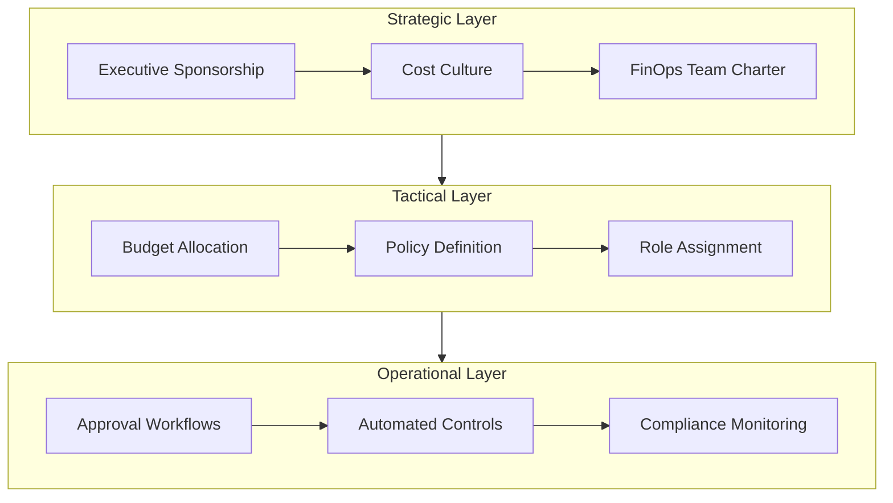
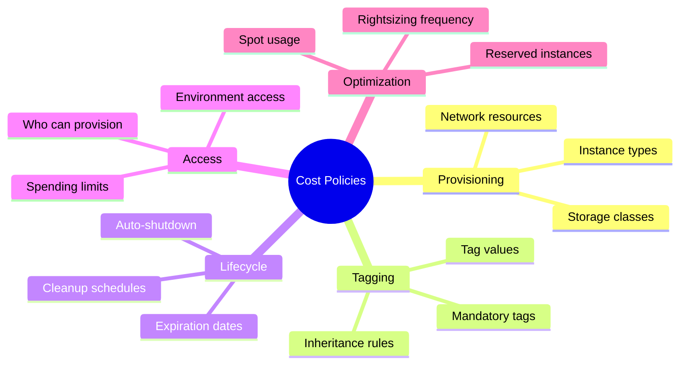
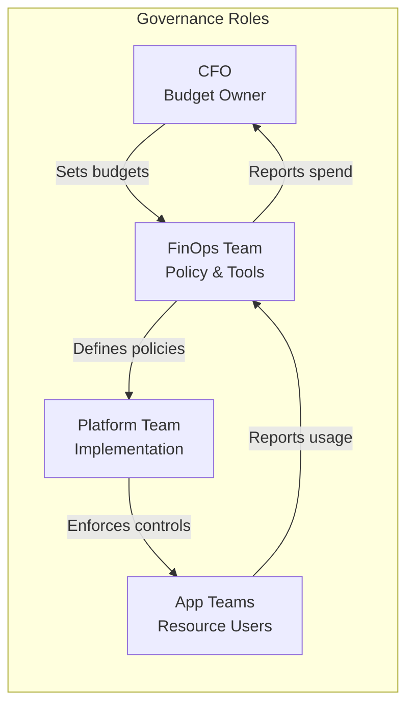
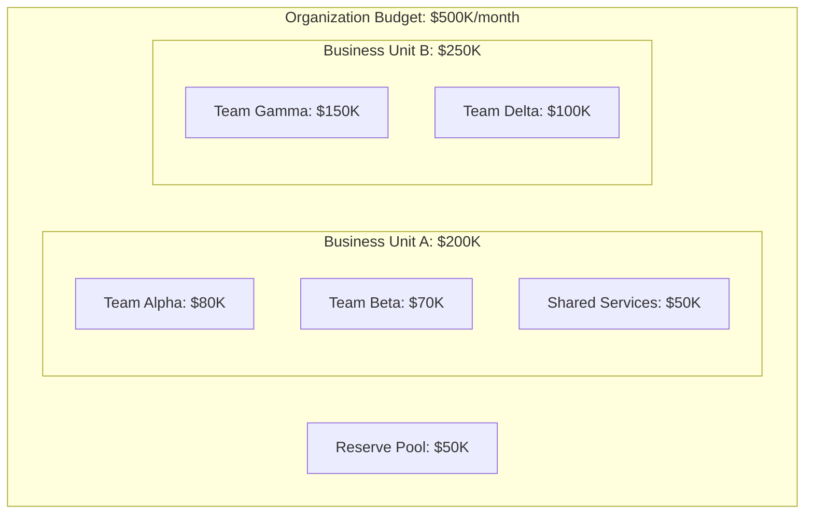
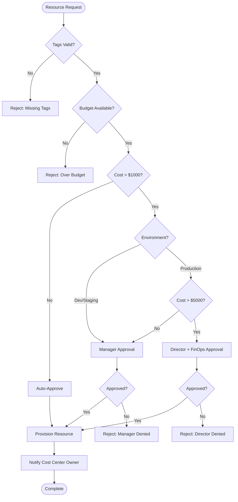
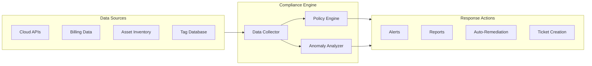
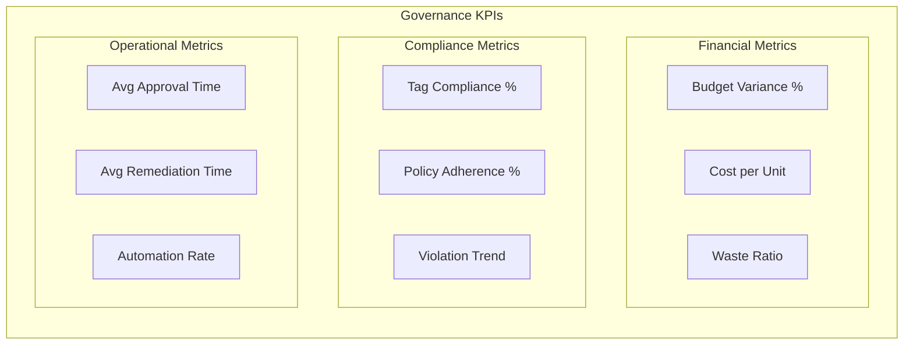

# How to Create Cost Governance

Author: [nawazdhandala](https://github.com/nawazdhandala)

Tags: FinOps, Cost Optimization, Governance, Cloud

Description: Learn how to establish effective cost governance for cloud spending.

---

Cloud costs can spiral out of control faster than any other operational expense. Without proper governance, teams spin up resources with good intentions but zero accountability, leading to bill shock at month's end. Cost governance is the discipline that transforms reactive firefighting into proactive financial stewardship. This guide walks through building a governance framework that scales with your organization.

## Why Cost Governance Matters

Organizations without cost governance typically experience:

- **Shadow IT sprawl**: Teams provision resources outside approved channels
- **Zombie resources**: Forgotten instances running 24/7 with no workload
- **Over-provisioning**: Production systems sized for theoretical peaks that never occur
- **Budget overruns**: Finance learns about cost spikes only after the invoice arrives

Cost governance addresses these problems by establishing clear ownership, policies, and automated controls before costs become unmanageable.

## Governance Framework Design

A robust cost governance framework operates across three layers: strategic, tactical, and operational.



### Strategic Layer Components

**Executive Sponsorship**: Cost governance fails without C-level buy-in. The CFO and CTO must jointly own the initiative, with clear escalation paths for policy violations.

**Cost Culture**: Engineers should understand cloud economics as part of their core competencies. Treat cost efficiency with the same rigor as security or reliability.

**FinOps Team Charter**: Define the central team responsible for tooling, policy enforcement, and cross-functional coordination. This team bridges finance, engineering, and operations.

### Tactical Layer Components

**Budget Allocation**: Distribute cloud budgets by business unit, product, or environment. Each allocation needs an owner accountable for spend within limits.

**Policy Definition**: Document rules for resource provisioning, tagging requirements, and acceptable use patterns.

**Role Assignment**: Map governance responsibilities to specific individuals with authority to approve, deny, or escalate requests.

### Operational Layer Components

**Approval Workflows**: Automate request routing based on cost thresholds and resource types.

**Automated Controls**: Implement guardrails that prevent policy violations before they occur.

**Compliance Monitoring**: Continuously audit infrastructure against governance policies.

## Policy Definition

Effective policies are specific, measurable, and enforceable. Vague guidelines like "minimize cloud spend" accomplish nothing. Here is a policy template structure:

```yaml
# cost-governance-policy.yaml
apiVersion: governance/v1
kind: CostPolicy
metadata:
  name: compute-provisioning-policy
  version: "2.1"
  owner: platform-team
  lastReview: "2026-01-15"
  nextReview: "2026-04-15"

spec:
  scope:
    environments:
      - development
      - staging
      - production
    resourceTypes:
      - compute
      - containers
      - serverless

  rules:
    # Tagging Requirements
    - name: mandatory-tags
      description: "All resources must have required cost allocation tags"
      enforcement: strict
      tags:
        required:
          - cost-center
          - owner
          - environment
          - application
        optional:
          - project
          - ticket-reference

    # Instance Sizing
    - name: right-sizing
      description: "Compute instances must match workload requirements"
      enforcement: warn
      constraints:
        development:
          maxInstanceType: "m5.large"
          maxMemoryGB: 8
          maxVCPUs: 2
        staging:
          maxInstanceType: "m5.xlarge"
          maxMemoryGB: 16
          maxVCPUs: 4
        production:
          requireApproval:
            threshold: "m5.2xlarge"
            approvers:
              - platform-lead
              - finops-team

    # Lifecycle Rules
    - name: resource-lifecycle
      description: "Resources must have defined lifecycle expectations"
      enforcement: strict
      constraints:
        development:
          autoShutdown: true
          shutdownSchedule: "0 20 * * 1-5"  # 8 PM weekdays
          startupSchedule: "0 8 * * 1-5"     # 8 AM weekdays
          maxLifespanDays: 30
        staging:
          autoShutdown: false
          maxLifespanDays: 90
        production:
          requireReview: true
          reviewFrequencyDays: 180

  exceptions:
    process: "Submit exception request via ServiceNow"
    approvers:
      - finops-director
      - engineering-vp
    maxDuration: "90 days"
    renewalRequired: true
```

### Policy Categories

Define policies across these key areas:



## Role and Responsibility Assignment

Clear ownership prevents the "tragedy of the commons" where everyone assumes someone else manages costs. Use a RACI matrix to define responsibilities:



### Role Definitions

```typescript
// governance-roles.ts
interface GovernanceRole {
  name: string;
  responsibilities: string[];
  authority: Authority[];
  accountabilities: string[];
}

interface Authority {
  action: string;
  scope: string;
  limit?: number;
}

const governanceRoles: GovernanceRole[] = [
  {
    name: "FinOps Lead",
    responsibilities: [
      "Define and maintain cost governance policies",
      "Manage cost allocation and chargeback models",
      "Produce monthly cost reports and forecasts",
      "Coordinate optimization initiatives across teams",
      "Train teams on cost-aware practices"
    ],
    authority: [
      { action: "approve", scope: "policy-exceptions", limit: 10000 },
      { action: "modify", scope: "tagging-policies" },
      { action: "escalate", scope: "budget-violations" }
    ],
    accountabilities: [
      "Monthly cost variance < 10%",
      "Policy compliance rate > 95%",
      "Optimization savings targets met"
    ]
  },
  {
    name: "Cost Center Owner",
    responsibilities: [
      "Manage budget for assigned cost center",
      "Approve resource requests within threshold",
      "Review monthly spend against forecast",
      "Identify and eliminate waste in their domain"
    ],
    authority: [
      { action: "approve", scope: "resource-requests", limit: 5000 },
      { action: "provision", scope: "own-cost-center" },
      { action: "terminate", scope: "own-resources" }
    ],
    accountabilities: [
      "Stay within allocated budget",
      "100% tag compliance for owned resources",
      "Quarterly optimization review completed"
    ]
  },
  {
    name: "Engineer",
    responsibilities: [
      "Tag all provisioned resources correctly",
      "Select appropriate resource sizes",
      "Clean up unused resources promptly",
      "Report cost anomalies to cost center owner"
    ],
    authority: [
      { action: "provision", scope: "development", limit: 500 },
      { action: "terminate", scope: "own-resources" }
    ],
    accountabilities: [
      "Resources tagged within 24 hours",
      "No orphaned resources > 7 days",
      "Complete cost awareness training annually"
    ]
  }
];

// Function to check if action is authorized
function isAuthorized(
  role: GovernanceRole,
  action: string,
  scope: string,
  amount?: number
): boolean {
  const authority = role.authority.find(
    (a) => a.action === action && a.scope === scope
  );

  if (!authority) return false;
  if (amount && authority.limit && amount > authority.limit) return false;

  return true;
}

// Example usage
const finOpsLead = governanceRoles[0];
console.log(isAuthorized(finOpsLead, "approve", "policy-exceptions", 8000)); // true
console.log(isAuthorized(finOpsLead, "approve", "policy-exceptions", 15000)); // false
```

## Budget Controls

Budget controls transform policies into automated guardrails. Implement controls at multiple levels to catch issues before they become expensive.

### Budget Hierarchy



### Budget Alert Configuration

```python
# budget_controls.py
from dataclasses import dataclass
from enum import Enum
from typing import List, Optional, Callable
import datetime

class AlertSeverity(Enum):
    INFO = "info"
    WARNING = "warning"
    CRITICAL = "critical"

class AlertAction(Enum):
    NOTIFY = "notify"
    THROTTLE = "throttle"
    BLOCK = "block"

@dataclass
class BudgetThreshold:
    percentage: int
    severity: AlertSeverity
    actions: List[AlertAction]
    recipients: List[str]

@dataclass
class Budget:
    name: str
    owner: str
    amount: float
    period: str  # monthly, quarterly, annual
    cost_center: str
    thresholds: List[BudgetThreshold]
    rollover: bool = False

    def check_thresholds(self, current_spend: float) -> List[dict]:
        """Check current spend against all thresholds and return triggered alerts."""
        alerts = []
        spend_percentage = (current_spend / self.amount) * 100

        for threshold in self.thresholds:
            if spend_percentage >= threshold.percentage:
                alerts.append({
                    "budget": self.name,
                    "threshold": threshold.percentage,
                    "current_percentage": round(spend_percentage, 2),
                    "current_spend": current_spend,
                    "budget_amount": self.amount,
                    "severity": threshold.severity.value,
                    "actions": [a.value for a in threshold.actions],
                    "recipients": threshold.recipients
                })

        return alerts

@dataclass
class ForecastAlert:
    name: str
    budget: Budget
    forecast_days: int
    threshold_percentage: int

    def check_forecast(
        self,
        current_spend: float,
        days_elapsed: int,
        days_in_period: int
    ) -> Optional[dict]:
        """Project spend to end of period and alert if exceeding threshold."""
        if days_elapsed == 0:
            return None

        daily_rate = current_spend / days_elapsed
        projected_spend = daily_rate * days_in_period
        projected_percentage = (projected_spend / self.budget.amount) * 100

        if projected_percentage >= self.threshold_percentage:
            return {
                "alert": self.name,
                "budget": self.budget.name,
                "current_spend": current_spend,
                "projected_spend": round(projected_spend, 2),
                "budget_amount": self.budget.amount,
                "projected_percentage": round(projected_percentage, 2),
                "days_remaining": days_in_period - days_elapsed
            }

        return None


# Example budget configuration
platform_team_budget = Budget(
    name="Platform Team Monthly",
    owner="platform-lead@company.com",
    amount=80000,
    period="monthly",
    cost_center="CC-PLATFORM-001",
    thresholds=[
        BudgetThreshold(
            percentage=50,
            severity=AlertSeverity.INFO,
            actions=[AlertAction.NOTIFY],
            recipients=["platform-lead@company.com"]
        ),
        BudgetThreshold(
            percentage=75,
            severity=AlertSeverity.WARNING,
            actions=[AlertAction.NOTIFY],
            recipients=[
                "platform-lead@company.com",
                "finops@company.com"
            ]
        ),
        BudgetThreshold(
            percentage=90,
            severity=AlertSeverity.WARNING,
            actions=[AlertAction.NOTIFY, AlertAction.THROTTLE],
            recipients=[
                "platform-lead@company.com",
                "finops@company.com",
                "engineering-vp@company.com"
            ]
        ),
        BudgetThreshold(
            percentage=100,
            severity=AlertSeverity.CRITICAL,
            actions=[AlertAction.NOTIFY, AlertAction.BLOCK],
            recipients=[
                "platform-lead@company.com",
                "finops@company.com",
                "engineering-vp@company.com",
                "cfo@company.com"
            ]
        )
    ]
)

# Check current spend
current_spend = 65000
alerts = platform_team_budget.check_thresholds(current_spend)
for alert in alerts:
    print(f"Alert: {alert['severity']} - Budget at {alert['current_percentage']}%")

# Check forecast
forecast_check = ForecastAlert(
    name="Platform Team Forecast",
    budget=platform_team_budget,
    forecast_days=30,
    threshold_percentage=100
)

forecast_alert = forecast_check.check_forecast(
    current_spend=45000,
    days_elapsed=15,
    days_in_period=30
)

if forecast_alert:
    print(f"Forecast Alert: Projected spend ${forecast_alert['projected_spend']}")
```

### Implementing Hard Stops

```python
# hard_stop_controls.py
from typing import Optional
from dataclasses import dataclass
from datetime import datetime, timedelta
import json

@dataclass
class ProvisioningRequest:
    requestor: str
    resource_type: str
    estimated_monthly_cost: float
    cost_center: str
    environment: str
    justification: str
    duration_days: Optional[int] = None

@dataclass
class ProvisioningResult:
    approved: bool
    request: ProvisioningRequest
    reason: str
    requires_approval: bool = False
    approvers: list = None

class HardStopController:
    def __init__(self, budget_service, policy_service):
        self.budget_service = budget_service
        self.policy_service = policy_service

    def evaluate_request(self, request: ProvisioningRequest) -> ProvisioningResult:
        """
        Evaluate a provisioning request against hard stop controls.
        Returns approval decision with reasoning.
        """

        # Check 1: Budget availability
        budget = self.budget_service.get_budget(request.cost_center)
        current_spend = self.budget_service.get_current_spend(request.cost_center)
        remaining = budget.amount - current_spend

        if request.estimated_monthly_cost > remaining:
            return ProvisioningResult(
                approved=False,
                request=request,
                reason=f"Insufficient budget. Remaining: ${remaining:.2f}, "
                       f"Requested: ${request.estimated_monthly_cost:.2f}"
            )

        # Check 2: Environment-specific limits
        env_limits = self.policy_service.get_environment_limits(request.environment)

        if request.estimated_monthly_cost > env_limits.max_resource_cost:
            if request.environment == "development":
                return ProvisioningResult(
                    approved=False,
                    request=request,
                    reason=f"Development environment limit exceeded. "
                           f"Max: ${env_limits.max_resource_cost:.2f}"
                )
            else:
                return ProvisioningResult(
                    approved=False,
                    request=request,
                    reason=f"Requires approval for {request.environment}",
                    requires_approval=True,
                    approvers=env_limits.approvers
                )

        # Check 3: Requestor spending limits
        user_limits = self.policy_service.get_user_limits(request.requestor)
        user_mtd_spend = self.budget_service.get_user_mtd_spend(request.requestor)

        if user_mtd_spend + request.estimated_monthly_cost > user_limits.monthly_limit:
            return ProvisioningResult(
                approved=False,
                request=request,
                reason=f"User monthly limit exceeded. "
                       f"Limit: ${user_limits.monthly_limit:.2f}, "
                       f"Current: ${user_mtd_spend:.2f}",
                requires_approval=True,
                approvers=[user_limits.manager]
            )

        # Check 4: Resource type restrictions
        allowed_types = self.policy_service.get_allowed_resource_types(
            request.environment,
            request.requestor
        )

        if request.resource_type not in allowed_types:
            return ProvisioningResult(
                approved=False,
                request=request,
                reason=f"Resource type '{request.resource_type}' not allowed "
                       f"in {request.environment} environment"
            )

        # All checks passed
        return ProvisioningResult(
            approved=True,
            request=request,
            reason="All governance checks passed"
        )

    def log_decision(self, result: ProvisioningResult):
        """Log all provisioning decisions for audit trail."""
        log_entry = {
            "timestamp": datetime.utcnow().isoformat(),
            "requestor": result.request.requestor,
            "resource_type": result.request.resource_type,
            "cost_center": result.request.cost_center,
            "estimated_cost": result.request.estimated_monthly_cost,
            "approved": result.approved,
            "reason": result.reason,
            "requires_approval": result.requires_approval
        }
        # In production, send to logging service
        print(json.dumps(log_entry, indent=2))
```

## Approval Workflows

Approval workflows route requests to appropriate decision-makers based on cost, risk, and resource type. Automate routing to reduce bottlenecks while maintaining oversight.



### Workflow Implementation

```typescript
// approval-workflow.ts
interface ApprovalRequest {
  id: string;
  requestor: string;
  resourceType: string;
  environment: 'development' | 'staging' | 'production';
  estimatedMonthlyCost: number;
  costCenter: string;
  tags: Record<string, string>;
  justification: string;
  createdAt: Date;
}

interface ApprovalStep {
  approver: string;
  role: string;
  decision?: 'approved' | 'denied' | 'pending';
  decidedAt?: Date;
  comments?: string;
}

interface ApprovalWorkflow {
  request: ApprovalRequest;
  steps: ApprovalStep[];
  currentStep: number;
  status: 'pending' | 'approved' | 'denied' | 'expired';
  expiresAt: Date;
}

class ApprovalEngine {
  private readonly thresholds = {
    autoApprove: 1000,
    managerApprove: 5000,
    directorApprove: Infinity
  };

  private readonly requiredTags = [
    'cost-center',
    'owner',
    'environment',
    'application'
  ];

  async createWorkflow(request: ApprovalRequest): Promise<ApprovalWorkflow> {
    // Validate tags first
    const missingTags = this.requiredTags.filter(
      tag => !request.tags[tag]
    );

    if (missingTags.length > 0) {
      throw new Error(`Missing required tags: ${missingTags.join(', ')}`);
    }

    // Determine approval chain
    const steps = this.determineApprovalChain(request);

    const workflow: ApprovalWorkflow = {
      request,
      steps,
      currentStep: 0,
      status: 'pending',
      expiresAt: new Date(Date.now() + 7 * 24 * 60 * 60 * 1000) // 7 days
    };

    // If no steps required, auto-approve
    if (steps.length === 0) {
      workflow.status = 'approved';
      await this.notifyRequestor(workflow, 'Your request has been auto-approved');
    } else {
      await this.notifyApprover(workflow);
    }

    return workflow;
  }

  private determineApprovalChain(request: ApprovalRequest): ApprovalStep[] {
    const steps: ApprovalStep[] = [];
    const cost = request.estimatedMonthlyCost;

    // Auto-approve low-cost development resources
    if (cost <= this.thresholds.autoApprove &&
        request.environment === 'development') {
      return [];
    }

    // Manager approval for moderate costs
    if (cost <= this.thresholds.managerApprove) {
      steps.push({
        approver: this.getManager(request.requestor),
        role: 'manager',
        decision: 'pending'
      });
      return steps;
    }

    // Director + FinOps for high costs or production
    if (cost > this.thresholds.managerApprove ||
        request.environment === 'production') {
      steps.push({
        approver: this.getManager(request.requestor),
        role: 'manager',
        decision: 'pending'
      });
      steps.push({
        approver: this.getDirector(request.costCenter),
        role: 'director',
        decision: 'pending'
      });
      steps.push({
        approver: 'finops-team@company.com',
        role: 'finops',
        decision: 'pending'
      });
    }

    return steps;
  }

  async processDecision(
    workflow: ApprovalWorkflow,
    approver: string,
    decision: 'approved' | 'denied',
    comments?: string
  ): Promise<ApprovalWorkflow> {
    const currentStep = workflow.steps[workflow.currentStep];

    if (currentStep.approver !== approver) {
      throw new Error('Not authorized to approve this step');
    }

    currentStep.decision = decision;
    currentStep.decidedAt = new Date();
    currentStep.comments = comments;

    if (decision === 'denied') {
      workflow.status = 'denied';
      await this.notifyRequestor(
        workflow,
        `Request denied by ${currentStep.role}: ${comments}`
      );
      return workflow;
    }

    // Move to next step or complete
    if (workflow.currentStep < workflow.steps.length - 1) {
      workflow.currentStep++;
      await this.notifyApprover(workflow);
    } else {
      workflow.status = 'approved';
      await this.notifyRequestor(workflow, 'Your request has been approved');
      await this.triggerProvisioning(workflow);
    }

    return workflow;
  }

  private getManager(requestor: string): string {
    // In production, lookup from HR system or directory
    return `manager-of-${requestor}`;
  }

  private getDirector(costCenter: string): string {
    // In production, lookup from cost center ownership
    return `director-of-${costCenter}`;
  }

  private async notifyApprover(workflow: ApprovalWorkflow): Promise<void> {
    const step = workflow.steps[workflow.currentStep];
    console.log(`Notifying ${step.approver} for approval`);
    // Send email/Slack notification
  }

  private async notifyRequestor(
    workflow: ApprovalWorkflow,
    message: string
  ): Promise<void> {
    console.log(`Notifying ${workflow.request.requestor}: ${message}`);
    // Send email/Slack notification
  }

  private async triggerProvisioning(workflow: ApprovalWorkflow): Promise<void> {
    console.log(`Provisioning approved resource for ${workflow.request.id}`);
    // Trigger infrastructure provisioning
  }
}

// Example usage
const engine = new ApprovalEngine();

const request: ApprovalRequest = {
  id: 'REQ-2026-001',
  requestor: 'engineer@company.com',
  resourceType: 'kubernetes-cluster',
  environment: 'production',
  estimatedMonthlyCost: 8500,
  costCenter: 'CC-PLATFORM-001',
  tags: {
    'cost-center': 'CC-PLATFORM-001',
    'owner': 'engineer@company.com',
    'environment': 'production',
    'application': 'api-gateway'
  },
  justification: 'New production cluster for API gateway migration',
  createdAt: new Date()
};

// This would create a workflow requiring manager, director, and FinOps approval
engine.createWorkflow(request).then(workflow => {
  console.log(`Workflow created with ${workflow.steps.length} approval steps`);
});
```

## Compliance Monitoring

Continuous compliance monitoring identifies policy violations before they accumulate significant cost impact. Implement monitoring across three dimensions: real-time detection, scheduled audits, and trend analysis.



### Compliance Check Implementation

```python
# compliance_monitor.py
from dataclasses import dataclass
from typing import List, Dict, Optional
from enum import Enum
from datetime import datetime, timedelta
import asyncio

class ComplianceStatus(Enum):
    COMPLIANT = "compliant"
    NON_COMPLIANT = "non_compliant"
    WARNING = "warning"
    UNKNOWN = "unknown"

class ViolationSeverity(Enum):
    LOW = "low"
    MEDIUM = "medium"
    HIGH = "high"
    CRITICAL = "critical"

@dataclass
class ComplianceRule:
    id: str
    name: str
    description: str
    category: str
    severity: ViolationSeverity
    check_function: str
    remediation_action: Optional[str] = None
    auto_remediate: bool = False

@dataclass
class ComplianceViolation:
    rule: ComplianceRule
    resource_id: str
    resource_type: str
    detected_at: datetime
    details: Dict
    estimated_cost_impact: float
    remediation_status: str = "pending"

@dataclass
class ComplianceReport:
    generated_at: datetime
    period_start: datetime
    period_end: datetime
    total_resources: int
    compliant_resources: int
    violations: List[ComplianceViolation]
    cost_impact: float

    @property
    def compliance_rate(self) -> float:
        if self.total_resources == 0:
            return 100.0
        return (self.compliant_resources / self.total_resources) * 100


class ComplianceMonitor:
    def __init__(self, cloud_client, policy_service, notification_service):
        self.cloud_client = cloud_client
        self.policy_service = policy_service
        self.notification_service = notification_service
        self.rules = self._load_rules()

    def _load_rules(self) -> List[ComplianceRule]:
        """Load compliance rules from policy service."""
        return [
            ComplianceRule(
                id="TAG-001",
                name="Missing Required Tags",
                description="All resources must have cost-center, owner, and environment tags",
                category="tagging",
                severity=ViolationSeverity.HIGH,
                check_function="check_required_tags",
                remediation_action="notify_owner",
                auto_remediate=False
            ),
            ComplianceRule(
                id="SIZE-001",
                name="Oversized Development Instance",
                description="Development instances should not exceed m5.large",
                category="rightsizing",
                severity=ViolationSeverity.MEDIUM,
                check_function="check_instance_size",
                remediation_action="resize_instance",
                auto_remediate=False
            ),
            ComplianceRule(
                id="IDLE-001",
                name="Idle Resource Detection",
                description="Resources with <5% utilization for 7 days",
                category="optimization",
                severity=ViolationSeverity.MEDIUM,
                check_function="check_idle_resources",
                remediation_action="schedule_termination",
                auto_remediate=False
            ),
            ComplianceRule(
                id="LIFE-001",
                name="Expired Resource",
                description="Resource has exceeded its defined lifespan",
                category="lifecycle",
                severity=ViolationSeverity.HIGH,
                check_function="check_resource_expiry",
                remediation_action="terminate_resource",
                auto_remediate=True
            ),
            ComplianceRule(
                id="UNUSED-001",
                name="Unattached Storage",
                description="Storage volumes not attached to any instance",
                category="waste",
                severity=ViolationSeverity.LOW,
                check_function="check_unattached_storage",
                remediation_action="snapshot_and_delete",
                auto_remediate=False
            )
        ]

    async def check_required_tags(self, resource: Dict) -> Optional[ComplianceViolation]:
        """Check if resource has all required tags."""
        required_tags = ["cost-center", "owner", "environment", "application"]
        resource_tags = resource.get("tags", {})
        missing_tags = [tag for tag in required_tags if tag not in resource_tags]

        if missing_tags:
            rule = next(r for r in self.rules if r.id == "TAG-001")
            return ComplianceViolation(
                rule=rule,
                resource_id=resource["id"],
                resource_type=resource["type"],
                detected_at=datetime.utcnow(),
                details={"missing_tags": missing_tags},
                estimated_cost_impact=resource.get("monthly_cost", 0)
            )
        return None

    async def check_idle_resources(self, resource: Dict) -> Optional[ComplianceViolation]:
        """Check if resource has been idle for extended period."""
        if resource["type"] not in ["ec2", "rds", "kubernetes-node"]:
            return None

        metrics = await self.cloud_client.get_utilization_metrics(
            resource["id"],
            days=7
        )

        avg_cpu = sum(m["cpu"] for m in metrics) / len(metrics) if metrics else 0

        if avg_cpu < 5:
            rule = next(r for r in self.rules if r.id == "IDLE-001")
            return ComplianceViolation(
                rule=rule,
                resource_id=resource["id"],
                resource_type=resource["type"],
                detected_at=datetime.utcnow(),
                details={
                    "average_cpu_percent": round(avg_cpu, 2),
                    "measurement_period_days": 7
                },
                estimated_cost_impact=resource.get("monthly_cost", 0)
            )
        return None

    async def run_compliance_scan(self) -> ComplianceReport:
        """Run full compliance scan across all resources."""
        resources = await self.cloud_client.list_all_resources()
        violations = []
        compliant_count = 0

        for resource in resources:
            resource_violations = []

            # Run all applicable checks
            for rule in self.rules:
                check_func = getattr(self, rule.check_function, None)
                if check_func:
                    violation = await check_func(resource)
                    if violation:
                        resource_violations.append(violation)

                        # Auto-remediate if enabled
                        if rule.auto_remediate:
                            await self.auto_remediate(violation)

            if resource_violations:
                violations.extend(resource_violations)
            else:
                compliant_count += 1

        # Calculate total cost impact
        total_cost_impact = sum(v.estimated_cost_impact for v in violations)

        report = ComplianceReport(
            generated_at=datetime.utcnow(),
            period_start=datetime.utcnow() - timedelta(days=1),
            period_end=datetime.utcnow(),
            total_resources=len(resources),
            compliant_resources=compliant_count,
            violations=violations,
            cost_impact=total_cost_impact
        )

        # Send notifications for critical violations
        await self.send_violation_alerts(violations)

        return report

    async def auto_remediate(self, violation: ComplianceViolation):
        """Execute auto-remediation for violation."""
        print(f"Auto-remediating {violation.rule.id} for {violation.resource_id}")

        remediation_funcs = {
            "terminate_resource": self.cloud_client.terminate_resource,
            "resize_instance": self.cloud_client.resize_instance,
            "snapshot_and_delete": self.cloud_client.snapshot_and_delete
        }

        func = remediation_funcs.get(violation.rule.remediation_action)
        if func:
            await func(violation.resource_id)
            violation.remediation_status = "completed"

    async def send_violation_alerts(self, violations: List[ComplianceViolation]):
        """Send alerts for high and critical violations."""
        critical_violations = [
            v for v in violations
            if v.rule.severity in [ViolationSeverity.HIGH, ViolationSeverity.CRITICAL]
        ]

        if critical_violations:
            await self.notification_service.send_alert(
                channel="finops-alerts",
                title=f"Compliance Alert: {len(critical_violations)} Critical Violations",
                violations=critical_violations
            )

    def generate_compliance_dashboard_data(
        self,
        reports: List[ComplianceReport]
    ) -> Dict:
        """Generate data for compliance dashboard."""
        return {
            "current_compliance_rate": reports[-1].compliance_rate if reports else 0,
            "trend": [
                {
                    "date": r.generated_at.isoformat(),
                    "compliance_rate": r.compliance_rate,
                    "violation_count": len(r.violations),
                    "cost_impact": r.cost_impact
                }
                for r in reports
            ],
            "violations_by_category": self._group_violations_by_category(
                reports[-1].violations if reports else []
            ),
            "top_violators": self._get_top_violators(
                reports[-1].violations if reports else []
            )
        }

    def _group_violations_by_category(
        self,
        violations: List[ComplianceViolation]
    ) -> Dict[str, int]:
        """Group violations by category."""
        categories = {}
        for v in violations:
            cat = v.rule.category
            categories[cat] = categories.get(cat, 0) + 1
        return categories

    def _get_top_violators(
        self,
        violations: List[ComplianceViolation],
        limit: int = 10
    ) -> List[Dict]:
        """Get resources with most violations."""
        resource_violations = {}
        for v in violations:
            rid = v.resource_id
            if rid not in resource_violations:
                resource_violations[rid] = {
                    "resource_id": rid,
                    "resource_type": v.resource_type,
                    "violation_count": 0,
                    "total_cost_impact": 0
                }
            resource_violations[rid]["violation_count"] += 1
            resource_violations[rid]["total_cost_impact"] += v.estimated_cost_impact

        sorted_violators = sorted(
            resource_violations.values(),
            key=lambda x: x["violation_count"],
            reverse=True
        )
        return sorted_violators[:limit]
```

### Compliance Dashboard Metrics

Track these key metrics to measure governance effectiveness:



## Bringing It All Together

Effective cost governance is not a one-time implementation but an ongoing practice. Here is a maturity model to guide your journey:

```mermaid
flowchart LR
    subgraph L1["Level 1: Reactive"]
        A1["Manual tracking"]
        A2["Post-facto analysis"]
        A3["No policies"]
    end

    subgraph L2["Level 2: Informed"]
        B1["Basic tagging"]
        B2["Monthly reporting"]
        B3["Written policies"]
    end

    subgraph L3["Level 3: Proactive"]
        C1["Automated alerts"]
        C2["Approval workflows"]
        C3["Budget controls"]
    end

    subgraph L4["Level 4: Optimized"]
        D1["Predictive forecasting"]
        D2["Auto-remediation"]
        D3["Continuous optimization"]
    end

    L1 --> L2 --> L3 --> L4
```



### Implementation Roadmap

**Phase 1 (Weeks 1-4): Foundation**
- Establish FinOps team and executive sponsorship
- Implement mandatory tagging policy
- Set up basic cost visibility dashboards
- Define initial budget allocations

**Phase 2 (Weeks 5-8): Controls**
- Deploy budget alerts at 50%, 75%, 90%, 100% thresholds
- Implement approval workflows for high-cost resources
- Create role-based access controls for provisioning
- Begin weekly cost review meetings

**Phase 3 (Weeks 9-12): Automation**
- Deploy compliance monitoring with automated scanning
- Implement auto-shutdown for development environments
- Create self-service provisioning with guardrails
- Establish exception request process

**Phase 4 (Ongoing): Optimization**
- Refine policies based on compliance data
- Expand automation coverage
- Implement predictive cost forecasting
- Continuous policy improvement cycle

## Key Takeaways

Cost governance transforms cloud spending from an unpredictable liability into a managed business asset. The core principles:

1. **Start with visibility**: You cannot govern what you cannot see. Tagging and cost allocation come first.

2. **Assign clear ownership**: Every dollar spent must have an accountable owner. Ambiguous ownership leads to waste.

3. **Automate enforcement**: Policies without automation are suggestions. Build guardrails that prevent violations before they occur.

4. **Balance control with agility**: Overly restrictive governance slows innovation. Find the threshold that catches waste without creating bottlenecks.

5. **Measure and iterate**: Track compliance rates, approval times, and cost variance. Use data to continuously improve governance effectiveness.

The investment in governance infrastructure pays dividends through reduced waste, predictable budgets, and teams that think about cost as a first-class engineering concern.
