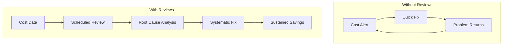
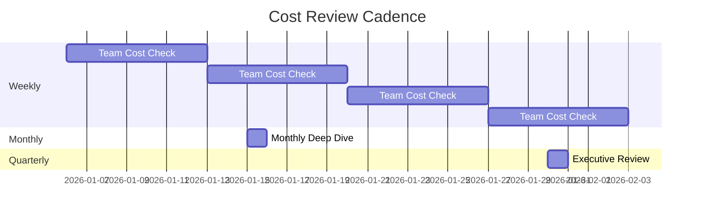
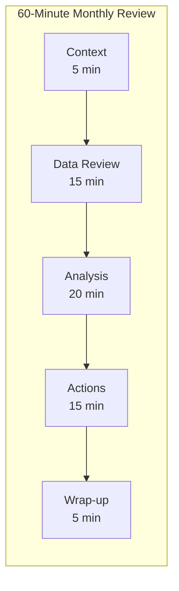
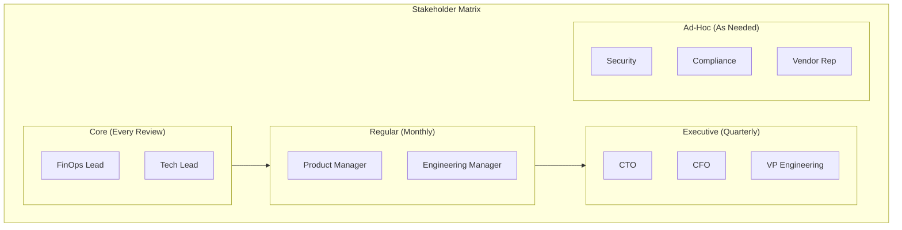
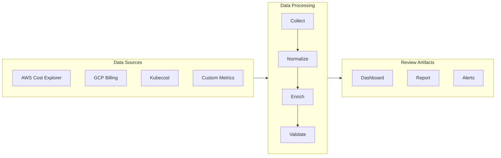
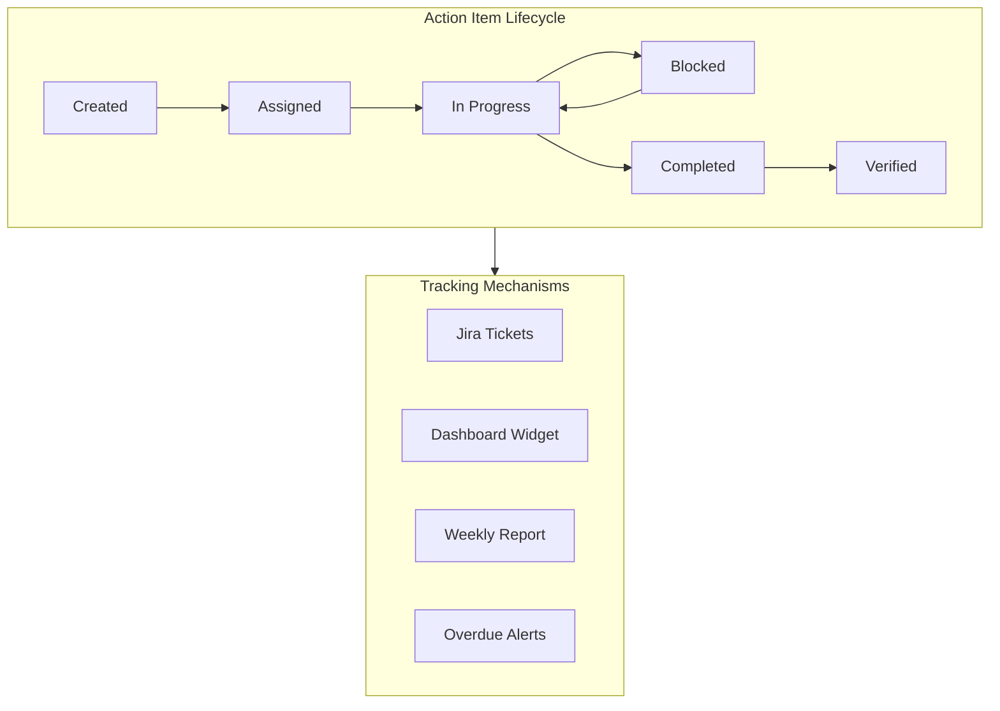
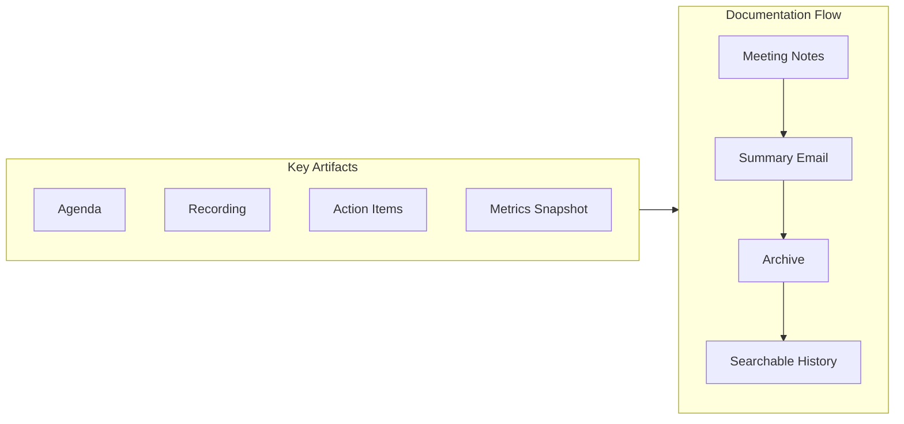
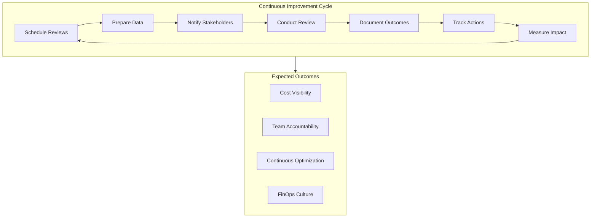

# How to Create Cost Reviews

Author: [nawazdhandala](https://github.com/nawazdhandala)

Tags: FinOps, Cost Optimization, Reviews, Process

Description: Learn how to conduct effective cost reviews for continuous optimization.

---

Cost reviews are the heartbeat of FinOps. Without regular, structured reviews, even the best cost monitoring tools become noise. This guide covers how to establish a cost review practice that drives real optimization outcomes.

## Why Cost Reviews Matter

Dashboards show data. Reviews drive action. The difference between organizations that control cloud costs and those that watch them grow is whether they have a disciplined review process.



## Review Frequency and Cadence

Different review types serve different purposes. Establish a multi-tier cadence.



### Review Tier Configuration

Define each review tier with clear ownership and scope.

```yaml
# config/cost-review-schedule.yaml
# Cost review schedule configuration

review_tiers:
  daily:
    name: "Anomaly Triage"
    frequency: "daily"
    duration_minutes: 15
    attendees:
      - role: on-call-engineer
    focus:
      - cost anomalies from last 24 hours
      - budget threshold breaches
      - unexpected resource provisioning
    output: immediate action or escalation

  weekly:
    name: "Team Cost Review"
    frequency: "weekly"
    day: "monday"
    time: "10:00"
    duration_minutes: 30
    attendees:
      - role: team-lead
      - role: team-engineers
    focus:
      - week-over-week cost trends
      - optimization progress tracking
      - upcoming cost-impacting changes
    output: action items in tracking system

  monthly:
    name: "FinOps Deep Dive"
    frequency: "monthly"
    week: 2
    day: "thursday"
    time: "14:00"
    duration_minutes: 60
    attendees:
      - role: finops-team
      - role: engineering-leads
      - role: product-managers
    focus:
      - month-over-month analysis
      - reserved instance utilization
      - savings plan coverage
      - cross-team optimization opportunities
    output: monthly report and optimization roadmap

  quarterly:
    name: "Executive Cost Review"
    frequency: "quarterly"
    week: 1
    day: "wednesday"
    time: "10:00"
    duration_minutes: 90
    attendees:
      - role: cto
      - role: cfo
      - role: vp-engineering
      - role: finops-lead
    focus:
      - budget vs actual analysis
      - unit economics trends
      - strategic cost initiatives
      - next quarter forecasts
    output: executive summary and budget adjustments
```

### Automated Review Scheduling

Automate the creation and scheduling of review meetings.

```python
#!/usr/bin/env python3
# scripts/schedule_cost_reviews.py
# Automatically schedule cost review meetings

import yaml
from datetime import datetime, timedelta
from google.oauth2.credentials import Credentials
from googleapiclient.discovery import build
from typing import Dict, List

def load_review_config(config_path: str) -> Dict:
    """Load review configuration from YAML file."""
    with open(config_path, 'r') as f:
        return yaml.safe_load(f)

def get_next_review_date(tier_config: Dict) -> datetime:
    """Calculate the next review date based on frequency."""
    now = datetime.now()
    frequency = tier_config['frequency']

    if frequency == 'daily':
        # Next business day at configured time
        next_date = now + timedelta(days=1)
        while next_date.weekday() >= 5:  # Skip weekends
            next_date += timedelta(days=1)
        return next_date

    elif frequency == 'weekly':
        # Find next occurrence of the specified day
        target_day = ['monday', 'tuesday', 'wednesday', 'thursday', 'friday'].index(
            tier_config['day'].lower()
        )
        days_ahead = target_day - now.weekday()
        if days_ahead <= 0:
            days_ahead += 7
        return now + timedelta(days=days_ahead)

    elif frequency == 'monthly':
        # Find the nth week's specified day of next month
        target_week = tier_config.get('week', 1)
        target_day = ['monday', 'tuesday', 'wednesday', 'thursday', 'friday'].index(
            tier_config['day'].lower()
        )

        # Move to first day of next month
        if now.month == 12:
            next_month = datetime(now.year + 1, 1, 1)
        else:
            next_month = datetime(now.year, now.month + 1, 1)

        # Find first occurrence of target day
        days_until_target = (target_day - next_month.weekday()) % 7
        first_occurrence = next_month + timedelta(days=days_until_target)

        # Add weeks to get to target week
        return first_occurrence + timedelta(weeks=target_week - 1)

    elif frequency == 'quarterly':
        # Similar to monthly but for quarters
        current_quarter = (now.month - 1) // 3
        next_quarter_month = ((current_quarter + 1) * 3) % 12 + 1
        next_quarter_year = now.year if next_quarter_month > now.month else now.year + 1

        quarter_start = datetime(next_quarter_year, next_quarter_month, 1)
        target_week = tier_config.get('week', 1)
        target_day = ['monday', 'tuesday', 'wednesday', 'thursday', 'friday'].index(
            tier_config['day'].lower()
        )

        days_until_target = (target_day - quarter_start.weekday()) % 7
        first_occurrence = quarter_start + timedelta(days=days_until_target)

        return first_occurrence + timedelta(weeks=target_week - 1)

    return now

def get_attendees_for_role(role: str, org_config: Dict) -> List[str]:
    """Map roles to actual email addresses."""
    role_mapping = org_config.get('role_mapping', {})
    return role_mapping.get(role, [])

def create_calendar_event(
    service,
    summary: str,
    description: str,
    start_time: datetime,
    duration_minutes: int,
    attendees: List[str]
) -> str:
    """Create a Google Calendar event."""
    end_time = start_time + timedelta(minutes=duration_minutes)

    event = {
        'summary': summary,
        'description': description,
        'start': {
            'dateTime': start_time.isoformat(),
            'timeZone': 'America/New_York',
        },
        'end': {
            'dateTime': end_time.isoformat(),
            'timeZone': 'America/New_York',
        },
        'attendees': [{'email': email} for email in attendees],
        'reminders': {
            'useDefault': False,
            'overrides': [
                {'method': 'email', 'minutes': 24 * 60},
                {'method': 'popup', 'minutes': 30},
            ],
        },
    }

    event = service.events().insert(
        calendarId='primary',
        body=event,
        sendUpdates='all'
    ).execute()

    return event.get('htmlLink')

def main():
    # Load configurations
    review_config = load_review_config('config/cost-review-schedule.yaml')
    org_config = load_review_config('config/organization.yaml')

    # Initialize Google Calendar API
    creds = Credentials.from_authorized_user_file('token.json')
    service = build('calendar', 'v3', credentials=creds)

    # Schedule each tier's review
    for tier_name, tier_config in review_config['review_tiers'].items():
        print(f"Scheduling {tier_name} review: {tier_config['name']}")

        # Calculate next review date
        review_date = get_next_review_date(tier_config)

        # Parse time from config
        time_parts = tier_config.get('time', '10:00').split(':')
        review_datetime = review_date.replace(
            hour=int(time_parts[0]),
            minute=int(time_parts[1]),
            second=0,
            microsecond=0
        )

        # Gather attendees
        attendees = []
        for attendee in tier_config['attendees']:
            role = attendee['role']
            attendees.extend(get_attendees_for_role(role, org_config))

        # Build description
        focus_items = '\n'.join(f"- {item}" for item in tier_config['focus'])
        description = f"""Cost Review: {tier_config['name']}

Focus Areas:
{focus_items}

Expected Output: {tier_config['output']}

Dashboard: https://oneuptime.com/dashboard/costs
"""

        # Create the event
        event_link = create_calendar_event(
            service,
            summary=f"[FinOps] {tier_config['name']}",
            description=description,
            start_time=review_datetime,
            duration_minutes=tier_config['duration_minutes'],
            attendees=attendees
        )

        print(f"  Created: {event_link}")

if __name__ == '__main__':
    main()
```

## Review Agenda Structure

A consistent agenda ensures reviews are efficient and actionable.



### Agenda Template Generator

Generate standardized agendas automatically before each review.

```python
#!/usr/bin/env python3
# scripts/generate_review_agenda.py
# Generate cost review agenda with pre-populated data

import boto3
from datetime import datetime, timedelta
from jinja2 import Template

AGENDA_TEMPLATE = """
# {{ review_type }} Cost Review
**Date:** {{ review_date }}
**Attendees:** {{ attendees | join(', ') }}

---

## 1. Context Setting (5 minutes)
- Review period: {{ period_start }} to {{ period_end }}
- Previous review actions status
- Any significant business context changes

## 2. Cost Overview (15 minutes)

### Total Spend Summary
| Metric | Value | vs Budget | vs Last Period |
|--------|-------|-----------|----------------|
| Total Spend | ${{ total_spend | format_currency }} | {{ budget_variance }}% | {{ period_variance }}% |
| Daily Average | ${{ daily_average | format_currency }} | - | {{ daily_variance }}% |
| Forecasted Month-End | ${{ forecast | format_currency }} | {{ forecast_variance }}% | - |

### Spend by Team
| Team | Spend | Budget | Variance | Trend |
|------|-------|--------|----------|-------|

| {{ team.name }} | ${{ team.spend | format_currency }} | ${{ team.budget | format_currency }} | {{ team.variance }}% | {{ team.trend }} |


### Top Cost Changes

- **{{ change.resource }}**: {{ change.direction }} ${{ change.amount | format_currency }} ({{ change.percentage }}%) - {{ change.reason }}


## 3. Deep Dive Analysis (20 minutes)

### Anomalies Detected

- **{{ anomaly.date }}**: {{ anomaly.description }} (+${{ anomaly.amount | format_currency }})
  - Root cause: {{ anomaly.cause }}
  - Status: {{ anomaly.status }}


### Optimization Opportunities

- **{{ opp.category }}**: {{ opp.description }}
  - Estimated savings: ${{ opp.savings | format_currency }}/month
  - Effort: {{ opp.effort }}
  - Owner: {{ opp.owner }}


### Reserved Instance / Savings Plan Coverage
| Type | Coverage | Target | Gap |
|------|----------|--------|-----|
| Compute (EC2/Fargate) | {{ ri_coverage.compute }}% | 70% | {{ ri_coverage.compute_gap }}% |
| Database (RDS) | {{ ri_coverage.database }}% | 80% | {{ ri_coverage.database_gap }}% |
| Storage | {{ ri_coverage.storage }}% | 60% | {{ ri_coverage.storage_gap }}% |

## 4. Action Items (15 minutes)

### Previous Actions Review

- [ ] {{ action.description }} - **{{ action.owner }}** - {{ action.status }}


### New Action Items
| Action | Owner | Due Date | Expected Savings |
|--------|-------|----------|------------------|
| | | | |
| | | | |
| | | | |

## 5. Wrap-up (5 minutes)
- Confirm action item owners and due dates
- Note any escalations needed
- Confirm next review date: {{ next_review_date }}

---

## Pre-Read Materials
- [Cost Dashboard](https://oneuptime.com/dashboard/costs)
- [Optimization Recommendations](https://oneuptime.com/dashboard/recommendations)
- [Previous Review Notes]({{ previous_review_link }})
"""

def format_currency(value):
    """Format number as currency."""
    return f"{value:,.2f}"

def get_cost_data(start_date: datetime, end_date: datetime) -> dict:
    """Fetch cost data from AWS Cost Explorer."""
    client = boto3.client('ce')

    response = client.get_cost_and_usage(
        TimePeriod={
            'Start': start_date.strftime('%Y-%m-%d'),
            'End': end_date.strftime('%Y-%m-%d')
        },
        Granularity='DAILY',
        Metrics=['UnblendedCost'],
        GroupBy=[{'Type': 'TAG', 'Key': 'team'}]
    )

    # Process response into usable format
    team_costs = {}
    total_spend = 0

    for result in response['ResultsByTime']:
        for group in result['Groups']:
            team = group['Keys'][0].replace('team$', '') or 'untagged'
            cost = float(group['Metrics']['UnblendedCost']['Amount'])
            team_costs[team] = team_costs.get(team, 0) + cost
            total_spend += cost

    return {
        'total_spend': total_spend,
        'team_costs': team_costs,
        'daily_average': total_spend / max((end_date - start_date).days, 1)
    }

def get_anomalies(start_date: datetime, end_date: datetime) -> list:
    """Fetch cost anomalies from AWS Cost Anomaly Detection."""
    client = boto3.client('ce')

    response = client.get_anomalies(
        DateInterval={
            'StartDate': start_date.strftime('%Y-%m-%d'),
            'EndDate': end_date.strftime('%Y-%m-%d')
        },
        MaxResults=10
    )

    anomalies = []
    for anomaly in response.get('Anomalies', []):
        anomalies.append({
            'date': anomaly['AnomalyStartDate'],
            'description': anomaly.get('DimensionValue', 'Unknown'),
            'amount': anomaly['Impact']['TotalImpact'],
            'cause': anomaly.get('RootCauses', [{}])[0].get('Service', 'Unknown'),
            'status': anomaly['AnomalyScore']['CurrentScore']
        })

    return anomalies

def generate_agenda(
    review_type: str,
    review_date: datetime,
    attendees: list,
    budgets: dict
) -> str:
    """Generate the review agenda with populated data."""

    # Calculate date ranges
    if review_type == 'weekly':
        period_start = review_date - timedelta(days=7)
        period_end = review_date
    elif review_type == 'monthly':
        period_start = review_date.replace(day=1)
        period_end = review_date
    else:
        period_start = review_date - timedelta(days=90)
        period_end = review_date

    # Fetch actual cost data
    cost_data = get_cost_data(period_start, period_end)
    anomalies = get_anomalies(period_start, period_end)

    # Calculate team-level data
    team_list = []
    for team, spend in cost_data['team_costs'].items():
        budget = budgets.get(team, 0)
        variance = ((spend - budget) / budget * 100) if budget > 0 else 0
        team_list.append({
            'name': team,
            'spend': spend,
            'budget': budget,
            'variance': round(variance, 1),
            'trend': 'up' if variance > 0 else 'down'
        })

    # Build template context
    context = {
        'review_type': review_type.title(),
        'review_date': review_date.strftime('%Y-%m-%d'),
        'attendees': attendees,
        'period_start': period_start.strftime('%Y-%m-%d'),
        'period_end': period_end.strftime('%Y-%m-%d'),
        'total_spend': cost_data['total_spend'],
        'daily_average': cost_data['daily_average'],
        'budget_variance': round((cost_data['total_spend'] / sum(budgets.values()) - 1) * 100, 1),
        'period_variance': 0,  # Would need previous period data
        'daily_variance': 0,
        'forecast': cost_data['daily_average'] * 30,
        'forecast_variance': 0,
        'team_costs': team_list,
        'top_changes': [],
        'anomalies': anomalies,
        'opportunities': [],
        'ri_coverage': {
            'compute': 65,
            'compute_gap': 5,
            'database': 75,
            'database_gap': 5,
            'storage': 55,
            'storage_gap': 5
        },
        'previous_actions': [],
        'next_review_date': (review_date + timedelta(days=30)).strftime('%Y-%m-%d'),
        'previous_review_link': '#'
    }

    # Render template
    template = Template(AGENDA_TEMPLATE)
    template.environment.filters['format_currency'] = format_currency

    return template.render(**context)

def main():
    agenda = generate_agenda(
        review_type='monthly',
        review_date=datetime.now(),
        attendees=['finops@acme.com', 'engineering@acme.com'],
        budgets={
            'platform': 15000,
            'payments': 10000,
            'authentication': 5000,
            'data-engineering': 20000
        }
    )

    print(agenda)

if __name__ == '__main__':
    main()
```

## Stakeholder Involvement

The right people in the room determine review effectiveness.



### RACI Matrix for Cost Reviews

```yaml
# config/cost-review-raci.yaml
# RACI matrix for cost review responsibilities

activities:
  prepare_cost_data:
    description: "Pull and validate cost data before review"
    responsible: finops-analyst
    accountable: finops-lead
    consulted: []
    informed: [engineering-leads]

  generate_agenda:
    description: "Create review agenda with pre-populated metrics"
    responsible: finops-analyst
    accountable: finops-lead
    consulted: [engineering-leads]
    informed: [all-attendees]

  present_overview:
    description: "Present cost overview and trends"
    responsible: finops-lead
    accountable: finops-lead
    consulted: []
    informed: [all-attendees]

  explain_anomalies:
    description: "Explain cost anomalies and their root causes"
    responsible: team-lead
    accountable: engineering-manager
    consulted: [finops-lead]
    informed: [all-attendees]

  propose_optimizations:
    description: "Suggest optimization opportunities"
    responsible: finops-analyst
    accountable: finops-lead
    consulted: [engineering-leads]
    informed: [product-managers]

  commit_to_actions:
    description: "Commit to specific optimization actions"
    responsible: engineering-leads
    accountable: engineering-manager
    consulted: [finops-lead, product-managers]
    informed: [cto]

  track_progress:
    description: "Track progress on committed actions"
    responsible: finops-analyst
    accountable: finops-lead
    consulted: [engineering-leads]
    informed: [engineering-manager]

  escalate_issues:
    description: "Escalate budget overruns or blockers"
    responsible: finops-lead
    accountable: cto
    consulted: [cfo, engineering-manager]
    informed: [all-stakeholders]

  approve_budget_changes:
    description: "Approve budget adjustments"
    responsible: cfo
    accountable: cfo
    consulted: [cto, finops-lead]
    informed: [engineering-leads]
```

### Stakeholder Notification System

Automatically notify stakeholders before and after reviews.

```python
#!/usr/bin/env python3
# scripts/notify_stakeholders.py
# Send notifications to stakeholders about cost reviews

import yaml
import smtplib
from email.mime.text import MIMEText
from email.mime.multipart import MIMEMultipart
from datetime import datetime, timedelta
from typing import Dict, List

def load_config(path: str) -> Dict:
    """Load configuration from YAML."""
    with open(path, 'r') as f:
        return yaml.safe_load(f)

def get_stakeholders_for_review(
    review_type: str,
    raci_config: Dict,
    org_config: Dict
) -> Dict[str, List[str]]:
    """Get stakeholders grouped by notification type."""
    stakeholders = {
        'required': [],
        'optional': [],
        'informed': []
    }

    # Map RACI roles to notification groups
    for activity, roles in raci_config['activities'].items():
        # Responsible and Accountable = required
        for role in [roles.get('responsible'), roles.get('accountable')]:
            if role:
                emails = org_config['role_mapping'].get(role, [])
                stakeholders['required'].extend(emails)

        # Consulted = optional
        for role in roles.get('consulted', []):
            emails = org_config['role_mapping'].get(role, [])
            stakeholders['optional'].extend(emails)

        # Informed = informed
        for role in roles.get('informed', []):
            emails = org_config['role_mapping'].get(role, [])
            stakeholders['informed'].extend(emails)

    # Deduplicate
    for key in stakeholders:
        stakeholders[key] = list(set(stakeholders[key]))

    return stakeholders

def send_pre_review_notification(
    recipients: List[str],
    review_date: datetime,
    review_type: str,
    agenda_link: str
):
    """Send notification before the review."""
    subject = f"[Upcoming] {review_type.title()} Cost Review - {review_date.strftime('%Y-%m-%d')}"

    body = f"""
Hello,

This is a reminder that the {review_type} cost review is scheduled for {review_date.strftime('%A, %B %d at %H:%M')}.

**Pre-Read Materials:**
- Review Agenda: {agenda_link}
- Cost Dashboard: https://oneuptime.com/dashboard/costs
- Optimization Recommendations: https://oneuptime.com/dashboard/recommendations

**Preparation Checklist:**
- Review your team's cost trends for the period
- Prepare explanations for any anomalies
- Identify optimization opportunities to discuss
- Update status on previous action items

Please come prepared with questions and suggestions.

Best,
FinOps Team
"""

    send_email(recipients, subject, body)

def send_post_review_summary(
    recipients: List[str],
    review_date: datetime,
    review_type: str,
    summary: Dict
):
    """Send summary after the review."""
    subject = f"[Summary] {review_type.title()} Cost Review - {review_date.strftime('%Y-%m-%d')}"

    action_items = '\n'.join(
        f"- {item['description']} (Owner: {item['owner']}, Due: {item['due_date']})"
        for item in summary.get('actions', [])
    )

    body = f"""
Hello,

Here is the summary from today's {review_type} cost review.

**Key Metrics:**
- Total Spend: ${summary['total_spend']:,.2f}
- Budget Variance: {summary['budget_variance']:+.1f}%
- Month-over-Month Change: {summary['mom_change']:+.1f}%

**Key Findings:**
{summary.get('findings', 'No significant findings.')}

**Action Items:**
{action_items if action_items else 'No new action items.'}

**Next Review:** {summary.get('next_review', 'TBD')}

Full notes: {summary.get('notes_link', '#')}

Best,
FinOps Team
"""

    send_email(recipients, subject, body)

def send_email(recipients: List[str], subject: str, body: str):
    """Send email via SMTP."""
    msg = MIMEMultipart()
    msg['Subject'] = subject
    msg['From'] = 'finops@acme.com'
    msg['To'] = ', '.join(recipients)

    msg.attach(MIMEText(body, 'plain'))

    # In production, use proper SMTP configuration
    with smtplib.SMTP('localhost', 587) as server:
        server.send_message(msg)

    print(f"Sent notification to {len(recipients)} recipients")

def main():
    raci_config = load_config('config/cost-review-raci.yaml')
    org_config = load_config('config/organization.yaml')

    review_type = 'monthly'
    review_date = datetime.now() + timedelta(days=2)

    stakeholders = get_stakeholders_for_review(review_type, raci_config, org_config)

    # Send pre-review notification
    all_recipients = stakeholders['required'] + stakeholders['optional']
    send_pre_review_notification(
        recipients=all_recipients,
        review_date=review_date,
        review_type=review_type,
        agenda_link='https://docs.acme.com/finops/agenda-2026-01'
    )

if __name__ == '__main__':
    main()
```

## Data Preparation

Good reviews require good data. Automate preparation to ensure consistency.



### Data Collection Pipeline

```python
#!/usr/bin/env python3
# scripts/prepare_review_data.py
# Collect and prepare data for cost reviews

import boto3
import json
from datetime import datetime, timedelta
from dataclasses import dataclass, asdict
from typing import List, Dict, Optional
import pandas as pd

@dataclass
class CostRecord:
    """Standardized cost record across providers."""
    date: str
    provider: str
    account: str
    service: str
    team: str
    environment: str
    cost: float
    currency: str = 'USD'

@dataclass
class ReviewDataPackage:
    """Complete data package for a cost review."""
    period_start: str
    period_end: str
    total_cost: float
    previous_period_cost: float
    budget: float
    costs_by_team: Dict[str, float]
    costs_by_service: Dict[str, float]
    costs_by_environment: Dict[str, float]
    daily_costs: List[Dict]
    anomalies: List[Dict]
    recommendations: List[Dict]
    generated_at: str

def collect_aws_costs(start_date: datetime, end_date: datetime) -> List[CostRecord]:
    """Collect cost data from AWS."""
    client = boto3.client('ce')

    response = client.get_cost_and_usage(
        TimePeriod={
            'Start': start_date.strftime('%Y-%m-%d'),
            'End': end_date.strftime('%Y-%m-%d')
        },
        Granularity='DAILY',
        Metrics=['UnblendedCost'],
        GroupBy=[
            {'Type': 'DIMENSION', 'Key': 'SERVICE'},
            {'Type': 'TAG', 'Key': 'team'},
            {'Type': 'TAG', 'Key': 'environment'}
        ]
    )

    records = []
    for result in response['ResultsByTime']:
        date = result['TimePeriod']['Start']
        for group in result['Groups']:
            keys = group['Keys']
            cost = float(group['Metrics']['UnblendedCost']['Amount'])

            records.append(CostRecord(
                date=date,
                provider='aws',
                account='production',
                service=keys[0],
                team=keys[1].replace('team$', '') if len(keys) > 1 else 'untagged',
                environment=keys[2].replace('environment$', '') if len(keys) > 2 else 'unknown',
                cost=cost
            ))

    return records

def collect_kubernetes_costs(start_date: datetime, end_date: datetime) -> List[CostRecord]:
    """Collect cost data from Kubecost."""
    # In production, call Kubecost API
    # This is a simplified example
    import requests

    response = requests.get(
        'http://kubecost.internal/model/allocation',
        params={
            'window': f"{start_date.strftime('%Y-%m-%d')},{end_date.strftime('%Y-%m-%d')}",
            'aggregate': 'namespace,label:team'
        }
    )

    records = []
    if response.status_code == 200:
        data = response.json()
        for item in data.get('data', []):
            records.append(CostRecord(
                date=start_date.strftime('%Y-%m-%d'),
                provider='kubernetes',
                account='production-cluster',
                service=item.get('namespace', 'unknown'),
                team=item.get('properties', {}).get('labels', {}).get('team', 'untagged'),
                environment=item.get('properties', {}).get('labels', {}).get('env', 'unknown'),
                cost=item.get('totalCost', 0)
            ))

    return records

def get_anomalies(start_date: datetime, end_date: datetime) -> List[Dict]:
    """Fetch cost anomalies."""
    client = boto3.client('ce')

    try:
        response = client.get_anomalies(
            DateInterval={
                'StartDate': start_date.strftime('%Y-%m-%d'),
                'EndDate': end_date.strftime('%Y-%m-%d')
            }
        )

        return [
            {
                'date': a['AnomalyStartDate'],
                'service': a.get('DimensionValue', 'Unknown'),
                'impact': a['Impact']['TotalImpact'],
                'score': a['AnomalyScore']['CurrentScore']
            }
            for a in response.get('Anomalies', [])
        ]
    except Exception as e:
        print(f"Error fetching anomalies: {e}")
        return []

def get_recommendations() -> List[Dict]:
    """Fetch cost optimization recommendations."""
    client = boto3.client('ce')

    recommendations = []

    # Right-sizing recommendations
    try:
        response = client.get_rightsizing_recommendation(
            Service='AmazonEC2'
        )
        for rec in response.get('RightsizingRecommendations', []):
            recommendations.append({
                'type': 'rightsizing',
                'resource': rec.get('CurrentInstance', {}).get('ResourceId', 'Unknown'),
                'savings': rec.get('RightsizingRecommendation', {}).get('SavingsPercentage', 0),
                'action': rec.get('RightsizingType', 'Modify')
            })
    except Exception as e:
        print(f"Error fetching rightsizing recommendations: {e}")

    # Reserved Instance recommendations
    try:
        response = client.get_reservation_purchase_recommendation(
            Service='AmazonEC2'
        )
        for rec in response.get('Recommendations', []):
            recommendations.append({
                'type': 'reserved_instance',
                'service': 'EC2',
                'savings': rec.get('RecommendationSummary', {}).get('TotalEstimatedMonthlySavingsAmount', 0),
                'action': 'Purchase RI'
            })
    except Exception as e:
        print(f"Error fetching RI recommendations: {e}")

    return recommendations

def prepare_review_data(
    start_date: datetime,
    end_date: datetime,
    budget: float
) -> ReviewDataPackage:
    """Prepare complete data package for review."""

    # Collect data from all sources
    aws_costs = collect_aws_costs(start_date, end_date)
    k8s_costs = collect_kubernetes_costs(start_date, end_date)

    all_costs = aws_costs + k8s_costs

    # Convert to DataFrame for easier aggregation
    df = pd.DataFrame([asdict(r) for r in all_costs])

    # Calculate aggregations
    total_cost = df['cost'].sum()

    costs_by_team = df.groupby('team')['cost'].sum().to_dict()
    costs_by_service = df.groupby('service')['cost'].sum().to_dict()
    costs_by_environment = df.groupby('environment')['cost'].sum().to_dict()

    daily_costs = df.groupby('date')['cost'].sum().reset_index()
    daily_costs = daily_costs.to_dict('records')

    # Get previous period for comparison
    period_days = (end_date - start_date).days
    prev_start = start_date - timedelta(days=period_days)
    prev_costs = collect_aws_costs(prev_start, start_date)
    previous_period_cost = sum(r.cost for r in prev_costs)

    # Get anomalies and recommendations
    anomalies = get_anomalies(start_date, end_date)
    recommendations = get_recommendations()

    return ReviewDataPackage(
        period_start=start_date.strftime('%Y-%m-%d'),
        period_end=end_date.strftime('%Y-%m-%d'),
        total_cost=total_cost,
        previous_period_cost=previous_period_cost,
        budget=budget,
        costs_by_team=costs_by_team,
        costs_by_service=costs_by_service,
        costs_by_environment=costs_by_environment,
        daily_costs=daily_costs,
        anomalies=anomalies,
        recommendations=recommendations,
        generated_at=datetime.now().isoformat()
    )

def save_review_data(data: ReviewDataPackage, output_path: str):
    """Save review data to file."""
    with open(output_path, 'w') as f:
        json.dump(asdict(data), f, indent=2, default=str)
    print(f"Review data saved to {output_path}")

def main():
    end_date = datetime.now()
    start_date = end_date - timedelta(days=30)

    data = prepare_review_data(
        start_date=start_date,
        end_date=end_date,
        budget=50000
    )

    save_review_data(data, f"review_data_{end_date.strftime('%Y%m%d')}.json")

    # Print summary
    print(f"\nReview Data Summary:")
    print(f"  Period: {data.period_start} to {data.period_end}")
    print(f"  Total Cost: ${data.total_cost:,.2f}")
    print(f"  Budget: ${data.budget:,.2f}")
    print(f"  Variance: {((data.total_cost / data.budget) - 1) * 100:+.1f}%")
    print(f"  Teams: {len(data.costs_by_team)}")
    print(f"  Anomalies: {len(data.anomalies)}")
    print(f"  Recommendations: {len(data.recommendations)}")

if __name__ == '__main__':
    main()
```

## Action Item Tracking

Reviews without follow-through are wasted time. Track actions rigorously.



### Action Item Management System

```python
#!/usr/bin/env python3
# scripts/action_item_tracker.py
# Track and manage cost review action items

import json
from datetime import datetime, timedelta
from dataclasses import dataclass, asdict, field
from typing import List, Optional, Dict
from enum import Enum
import requests

class ActionStatus(Enum):
    CREATED = "created"
    ASSIGNED = "assigned"
    IN_PROGRESS = "in_progress"
    BLOCKED = "blocked"
    COMPLETED = "completed"
    VERIFIED = "verified"

class ActionPriority(Enum):
    LOW = "low"
    MEDIUM = "medium"
    HIGH = "high"
    CRITICAL = "critical"

@dataclass
class ActionItem:
    """Cost review action item."""
    id: str
    title: str
    description: str
    owner: str
    due_date: str
    status: str = ActionStatus.CREATED.value
    priority: str = ActionPriority.MEDIUM.value
    estimated_savings: float = 0.0
    actual_savings: float = 0.0
    review_date: str = ""
    created_at: str = field(default_factory=lambda: datetime.now().isoformat())
    updated_at: str = field(default_factory=lambda: datetime.now().isoformat())
    notes: List[str] = field(default_factory=list)
    blockers: List[str] = field(default_factory=list)

class ActionItemTracker:
    """Manage cost review action items."""

    def __init__(self, storage_path: str = "action_items.json"):
        self.storage_path = storage_path
        self.items: Dict[str, ActionItem] = {}
        self._load()

    def _load(self):
        """Load action items from storage."""
        try:
            with open(self.storage_path, 'r') as f:
                data = json.load(f)
                for item_data in data.get('items', []):
                    item = ActionItem(**item_data)
                    self.items[item.id] = item
        except FileNotFoundError:
            self.items = {}

    def _save(self):
        """Save action items to storage."""
        with open(self.storage_path, 'w') as f:
            json.dump({
                'items': [asdict(item) for item in self.items.values()],
                'updated_at': datetime.now().isoformat()
            }, f, indent=2)

    def create_action(
        self,
        title: str,
        description: str,
        owner: str,
        due_date: str,
        priority: ActionPriority = ActionPriority.MEDIUM,
        estimated_savings: float = 0.0,
        review_date: str = ""
    ) -> ActionItem:
        """Create a new action item."""
        item_id = f"ACT-{len(self.items) + 1:04d}"

        item = ActionItem(
            id=item_id,
            title=title,
            description=description,
            owner=owner,
            due_date=due_date,
            priority=priority.value,
            estimated_savings=estimated_savings,
            review_date=review_date or datetime.now().strftime('%Y-%m-%d')
        )

        self.items[item_id] = item
        self._save()

        # Create corresponding Jira ticket
        self._create_jira_ticket(item)

        return item

    def update_status(
        self,
        item_id: str,
        new_status: ActionStatus,
        note: Optional[str] = None
    ):
        """Update action item status."""
        if item_id not in self.items:
            raise ValueError(f"Action item {item_id} not found")

        item = self.items[item_id]
        item.status = new_status.value
        item.updated_at = datetime.now().isoformat()

        if note:
            item.notes.append(f"[{datetime.now().isoformat()}] {note}")

        self._save()

        # Update Jira ticket
        self._update_jira_status(item)

    def add_blocker(self, item_id: str, blocker: str):
        """Add a blocker to an action item."""
        if item_id not in self.items:
            raise ValueError(f"Action item {item_id} not found")

        item = self.items[item_id]
        item.blockers.append(blocker)
        item.status = ActionStatus.BLOCKED.value
        item.updated_at = datetime.now().isoformat()

        self._save()

    def record_savings(self, item_id: str, actual_savings: float):
        """Record actual savings achieved."""
        if item_id not in self.items:
            raise ValueError(f"Action item {item_id} not found")

        item = self.items[item_id]
        item.actual_savings = actual_savings
        item.updated_at = datetime.now().isoformat()

        self._save()

    def get_overdue_items(self) -> List[ActionItem]:
        """Get all overdue action items."""
        today = datetime.now().strftime('%Y-%m-%d')
        return [
            item for item in self.items.values()
            if item.due_date < today and item.status not in [
                ActionStatus.COMPLETED.value,
                ActionStatus.VERIFIED.value
            ]
        ]

    def get_items_by_owner(self, owner: str) -> List[ActionItem]:
        """Get all action items for a specific owner."""
        return [
            item for item in self.items.values()
            if item.owner == owner
        ]

    def get_items_by_status(self, status: ActionStatus) -> List[ActionItem]:
        """Get all action items with a specific status."""
        return [
            item for item in self.items.values()
            if item.status == status.value
        ]

    def generate_summary_report(self) -> Dict:
        """Generate summary report of all action items."""
        total_items = len(self.items)

        by_status = {}
        for status in ActionStatus:
            by_status[status.value] = len(self.get_items_by_status(status))

        overdue = self.get_overdue_items()

        total_estimated = sum(item.estimated_savings for item in self.items.values())
        total_actual = sum(item.actual_savings for item in self.items.values())

        return {
            'total_items': total_items,
            'by_status': by_status,
            'overdue_count': len(overdue),
            'overdue_items': [item.id for item in overdue],
            'total_estimated_savings': total_estimated,
            'total_actual_savings': total_actual,
            'savings_realization': (total_actual / total_estimated * 100) if total_estimated > 0 else 0
        }

    def _create_jira_ticket(self, item: ActionItem):
        """Create a Jira ticket for the action item."""
        # Integration with Jira API
        jira_payload = {
            'fields': {
                'project': {'key': 'FINOPS'},
                'summary': f"[Cost Review] {item.title}",
                'description': item.description,
                'issuetype': {'name': 'Task'},
                'assignee': {'name': item.owner},
                'duedate': item.due_date,
                'labels': ['cost-review', 'finops'],
                'customfield_10001': item.estimated_savings  # Estimated savings field
            }
        }

        # In production, make actual API call
        # requests.post('https://jira.acme.com/rest/api/2/issue', json=jira_payload)
        print(f"Would create Jira ticket for {item.id}")

    def _update_jira_status(self, item: ActionItem):
        """Update Jira ticket status."""
        status_mapping = {
            'created': 'To Do',
            'assigned': 'To Do',
            'in_progress': 'In Progress',
            'blocked': 'Blocked',
            'completed': 'Done',
            'verified': 'Done'
        }

        # In production, make actual API call
        print(f"Would update Jira status for {item.id} to {status_mapping.get(item.status, 'To Do')}")

def send_overdue_alerts(tracker: ActionItemTracker):
    """Send alerts for overdue action items."""
    overdue = tracker.get_overdue_items()

    if not overdue:
        print("No overdue items")
        return

    # Group by owner
    by_owner = {}
    for item in overdue:
        if item.owner not in by_owner:
            by_owner[item.owner] = []
        by_owner[item.owner].append(item)

    for owner, items in by_owner.items():
        print(f"\nOverdue items for {owner}:")
        for item in items:
            days_overdue = (datetime.now() - datetime.fromisoformat(item.due_date.replace('Z', '+00:00').split('+')[0])).days
            print(f"  - {item.id}: {item.title} ({days_overdue} days overdue)")

def main():
    tracker = ActionItemTracker()

    # Create some example action items
    item1 = tracker.create_action(
        title="Right-size payment-service EC2 instances",
        description="Reduce instance sizes based on utilization analysis",
        owner="john@acme.com",
        due_date="2026-02-15",
        priority=ActionPriority.HIGH,
        estimated_savings=2500.00
    )
    print(f"Created: {item1.id}")

    item2 = tracker.create_action(
        title="Purchase RDS reserved instances",
        description="Purchase 1-year RI for production databases",
        owner="jane@acme.com",
        due_date="2026-02-28",
        priority=ActionPriority.MEDIUM,
        estimated_savings=5000.00
    )
    print(f"Created: {item2.id}")

    # Generate report
    report = tracker.generate_summary_report()
    print(f"\nSummary Report:")
    print(f"  Total Items: {report['total_items']}")
    print(f"  By Status: {report['by_status']}")
    print(f"  Overdue: {report['overdue_count']}")
    print(f"  Estimated Savings: ${report['total_estimated_savings']:,.2f}")

    # Check for overdue items
    send_overdue_alerts(tracker)

if __name__ == '__main__':
    main()
```

## Review Documentation

Document decisions and outcomes for future reference and accountability.



### Review Documentation Template

```markdown
# Cost Review Documentation Template

## Review Metadata
- **Date:** YYYY-MM-DD
- **Type:** Weekly / Monthly / Quarterly
- **Attendees:** [List]
- **Duration:** X minutes

## Executive Summary
[2-3 sentence summary of key outcomes]

## Cost Overview

### Period Metrics
| Metric | Value | Target | Status |
|--------|-------|--------|--------|
| Total Spend | $X,XXX | $X,XXX | On Track / Over / Under |
| Daily Run Rate | $XXX | $XXX | On Track / Over / Under |
| Forecasted End-of-Month | $X,XXX | $X,XXX | On Track / Over / Under |

### Variance Analysis
[Explanation of significant variances]

## Key Discussions

### Topic 1: [Title]
- **Context:** [Background]
- **Discussion:** [Key points raised]
- **Decision:** [What was decided]
- **Action:** [Follow-up required]

### Topic 2: [Title]
- **Context:** [Background]
- **Discussion:** [Key points raised]
- **Decision:** [What was decided]
- **Action:** [Follow-up required]

## Anomalies Reviewed
| Date | Description | Impact | Root Cause | Resolution |
|------|-------------|--------|------------|------------|
| | | | | |

## Optimization Decisions
| Opportunity | Decision | Owner | Savings | Timeline |
|-------------|----------|-------|---------|----------|
| | | | | |

## Action Items
| ID | Action | Owner | Due Date | Priority |
|----|--------|-------|----------|----------|
| | | | | |

## Deferred Items
| Item | Reason | Revisit Date |
|------|--------|--------------|
| | | |

## Next Review
- **Date:** YYYY-MM-DD
- **Focus Areas:** [List]

---
**Document Owner:** [Name]
**Last Updated:** YYYY-MM-DD HH:MM
```

### Automated Documentation Generator

```python
#!/usr/bin/env python3
# scripts/generate_review_docs.py
# Generate and store cost review documentation

import json
from datetime import datetime
from dataclasses import dataclass, asdict, field
from typing import List, Dict, Optional
from jinja2 import Template
import hashlib

@dataclass
class ReviewDocument:
    """Cost review documentation."""
    review_id: str
    review_date: str
    review_type: str
    attendees: List[str]
    duration_minutes: int
    executive_summary: str
    metrics: Dict
    discussions: List[Dict]
    anomalies: List[Dict]
    optimization_decisions: List[Dict]
    action_items: List[Dict]
    deferred_items: List[Dict]
    next_review_date: str
    next_review_focus: List[str]
    document_owner: str
    created_at: str = field(default_factory=lambda: datetime.now().isoformat())

DOCUMENTATION_TEMPLATE = """
# {{ review_type }} Cost Review - {{ review_date }}

## Review Metadata
- **Review ID:** {{ review_id }}
- **Date:** {{ review_date }}
- **Type:** {{ review_type }}
- **Attendees:** {{ attendees | join(', ') }}
- **Duration:** {{ duration_minutes }} minutes

## Executive Summary
{{ executive_summary }}

## Cost Overview

### Period Metrics
| Metric | Value | Target | Variance |
|--------|-------|--------|----------|
| Total Spend | ${{ metrics.total_spend | format_currency }} | ${{ metrics.budget | format_currency }} | {{ metrics.variance }}% |
| Daily Run Rate | ${{ metrics.daily_rate | format_currency }} | - | - |
| MoM Change | - | - | {{ metrics.mom_change }}% |

### Top Cost Drivers

{{ loop.index }}. **{{ driver.name }}**: ${{ driver.cost | format_currency }} ({{ driver.percentage }}%)


## Key Discussions


### {{ loop.index }}. {{ discussion.title }}
- **Context:** {{ discussion.context }}
- **Key Points:** {{ discussion.points | join('; ') }}
- **Decision:** {{ discussion.decision }}
- **Follow-up:** {{ discussion.followup }}



## Anomalies Reviewed

| Date | Description | Impact | Root Cause | Status |
|------|-------------|--------|------------|--------|

| {{ anomaly.date }} | {{ anomaly.description }} | ${{ anomaly.impact | format_currency }} | {{ anomaly.root_cause }} | {{ anomaly.status }} |


## Optimization Decisions

| Opportunity | Decision | Owner | Est. Savings | Timeline |
|-------------|----------|-------|--------------|----------|

| {{ opt.opportunity }} | {{ opt.decision }} | {{ opt.owner }} | ${{ opt.savings | format_currency }}/mo | {{ opt.timeline }} |


## Action Items

| ID | Action | Owner | Due Date | Priority | Est. Savings |
|----|--------|-------|----------|----------|--------------|

| {{ item.id }} | {{ item.title }} | {{ item.owner }} | {{ item.due_date }} | {{ item.priority }} | ${{ item.estimated_savings | format_currency }} |


## Deferred Items


| Item | Reason | Revisit Date |
|------|--------|--------------|

| {{ item.item }} | {{ item.reason }} | {{ item.revisit_date }} |


No items deferred.


## Next Review

- **Date:** {{ next_review_date }}
- **Focus Areas:**

  - {{ focus }}


---

**Document Owner:** {{ document_owner }}
**Generated:** {{ created_at }}
**Document Hash:** {{ document_hash }}
"""

def format_currency(value):
    """Format number as currency."""
    if value is None:
        return "0.00"
    return f"{float(value):,.2f}"

class ReviewDocumentationSystem:
    """Manage cost review documentation."""

    def __init__(self, storage_dir: str = "./review_docs"):
        self.storage_dir = storage_dir
        import os
        os.makedirs(storage_dir, exist_ok=True)

    def generate_review_id(self, review_date: str, review_type: str) -> str:
        """Generate unique review ID."""
        date_part = review_date.replace('-', '')
        type_part = review_type[0].upper()
        return f"CR-{date_part}-{type_part}"

    def create_document(
        self,
        review_date: str,
        review_type: str,
        attendees: List[str],
        duration_minutes: int,
        metrics: Dict,
        discussions: List[Dict],
        anomalies: List[Dict],
        optimization_decisions: List[Dict],
        action_items: List[Dict],
        deferred_items: List[Dict],
        next_review_date: str,
        next_review_focus: List[str],
        document_owner: str
    ) -> ReviewDocument:
        """Create a new review document."""

        # Generate executive summary
        variance = metrics.get('variance', 0)
        if variance > 10:
            summary_trend = "significantly over budget"
        elif variance > 0:
            summary_trend = "slightly over budget"
        elif variance > -10:
            summary_trend = "on track"
        else:
            summary_trend = "under budget"

        executive_summary = (
            f"Total spend for the period was ${metrics.get('total_spend', 0):,.2f}, "
            f"which is {summary_trend} ({variance:+.1f}% variance). "
            f"{len(action_items)} action items were identified with estimated monthly savings of "
            f"${sum(item.get('estimated_savings', 0) for item in action_items):,.2f}."
        )

        doc = ReviewDocument(
            review_id=self.generate_review_id(review_date, review_type),
            review_date=review_date,
            review_type=review_type,
            attendees=attendees,
            duration_minutes=duration_minutes,
            executive_summary=executive_summary,
            metrics=metrics,
            discussions=discussions,
            anomalies=anomalies,
            optimization_decisions=optimization_decisions,
            action_items=action_items,
            deferred_items=deferred_items,
            next_review_date=next_review_date,
            next_review_focus=next_review_focus,
            document_owner=document_owner
        )

        return doc

    def render_markdown(self, doc: ReviewDocument) -> str:
        """Render document as Markdown."""
        template = Template(DOCUMENTATION_TEMPLATE)
        template.environment.filters['format_currency'] = format_currency

        # Calculate document hash for integrity
        doc_dict = asdict(doc)
        doc_hash = hashlib.sha256(
            json.dumps(doc_dict, sort_keys=True).encode()
        ).hexdigest()[:12]

        return template.render(
            **doc_dict,
            document_hash=doc_hash
        )

    def save_document(self, doc: ReviewDocument) -> str:
        """Save document to storage."""
        # Save as JSON
        json_path = f"{self.storage_dir}/{doc.review_id}.json"
        with open(json_path, 'w') as f:
            json.dump(asdict(doc), f, indent=2)

        # Save as Markdown
        md_path = f"{self.storage_dir}/{doc.review_id}.md"
        with open(md_path, 'w') as f:
            f.write(self.render_markdown(doc))

        print(f"Document saved: {json_path}, {md_path}")
        return md_path

    def search_documents(
        self,
        start_date: Optional[str] = None,
        end_date: Optional[str] = None,
        review_type: Optional[str] = None,
        keyword: Optional[str] = None
    ) -> List[ReviewDocument]:
        """Search through stored documents."""
        import os

        results = []

        for filename in os.listdir(self.storage_dir):
            if not filename.endswith('.json'):
                continue

            with open(f"{self.storage_dir}/{filename}", 'r') as f:
                doc_data = json.load(f)

            doc = ReviewDocument(**doc_data)

            # Apply filters
            if start_date and doc.review_date < start_date:
                continue
            if end_date and doc.review_date > end_date:
                continue
            if review_type and doc.review_type.lower() != review_type.lower():
                continue
            if keyword:
                doc_text = json.dumps(doc_data).lower()
                if keyword.lower() not in doc_text:
                    continue

            results.append(doc)

        return sorted(results, key=lambda x: x.review_date, reverse=True)

    def get_action_item_history(self, action_id: str) -> List[Dict]:
        """Get history of an action item across reviews."""
        history = []

        for doc in self.search_documents():
            for item in doc.action_items:
                if item.get('id') == action_id:
                    history.append({
                        'review_id': doc.review_id,
                        'review_date': doc.review_date,
                        'status': item.get('status', 'unknown'),
                        'notes': item.get('notes', '')
                    })

        return history

def main():
    system = ReviewDocumentationSystem()

    # Create example document
    doc = system.create_document(
        review_date="2026-01-30",
        review_type="Monthly",
        attendees=["finops@acme.com", "engineering@acme.com", "product@acme.com"],
        duration_minutes=60,
        metrics={
            'total_spend': 48500,
            'budget': 50000,
            'variance': -3.0,
            'daily_rate': 1616.67,
            'mom_change': 5.2,
            'top_drivers': [
                {'name': 'EC2', 'cost': 18000, 'percentage': 37},
                {'name': 'RDS', 'cost': 12000, 'percentage': 25},
                {'name': 'S3', 'cost': 8000, 'percentage': 16}
            ]
        },
        discussions=[
            {
                'title': 'Payment service scaling strategy',
                'context': 'Payment service EC2 costs increased 15% MoM',
                'points': ['Traffic growth justified increase', 'Opportunity to use Spot instances'],
                'decision': 'Implement Spot instances for non-critical workers',
                'followup': 'Platform team to evaluate Spot feasibility'
            }
        ],
        anomalies=[
            {
                'date': '2026-01-15',
                'description': 'Data transfer spike',
                'impact': 2500,
                'root_cause': 'Misconfigured backup job',
                'status': 'Resolved'
            }
        ],
        optimization_decisions=[
            {
                'opportunity': 'Right-size auth-service instances',
                'decision': 'Approved - proceed with downsizing',
                'owner': 'john@acme.com',
                'savings': 1200,
                'timeline': '2 weeks'
            }
        ],
        action_items=[
            {
                'id': 'ACT-0001',
                'title': 'Implement Spot instances for payment workers',
                'owner': 'jane@acme.com',
                'due_date': '2026-02-15',
                'priority': 'High',
                'estimated_savings': 3000
            },
            {
                'id': 'ACT-0002',
                'title': 'Right-size auth-service instances',
                'owner': 'john@acme.com',
                'due_date': '2026-02-10',
                'priority': 'Medium',
                'estimated_savings': 1200
            }
        ],
        deferred_items=[
            {
                'item': 'Reserved instance purchase for analytics',
                'reason': 'Waiting for Q2 capacity planning',
                'revisit_date': '2026-04-01'
            }
        ],
        next_review_date="2026-02-27",
        next_review_focus=[
            'Spot instance implementation progress',
            'Q1 budget reforecast',
            'Reserved instance coverage analysis'
        ],
        document_owner="finops@acme.com"
    )

    # Save and display
    md_path = system.save_document(doc)

    print("\nGenerated Documentation:")
    print("=" * 50)
    print(system.render_markdown(doc))

if __name__ == '__main__':
    main()
```

## Putting It All Together

A complete cost review practice integrates scheduling, data preparation, stakeholder management, action tracking, and documentation into a continuous improvement cycle.



---

Cost reviews transform cloud spending from a black box into a transparent, managed asset. The key is consistency: regular cadence, structured agendas, clear ownership, and rigorous follow-through. Start with weekly team reviews, expand to monthly deep dives, and establish quarterly executive checkpoints. With the right process and tooling, cost optimization becomes a natural part of engineering culture rather than an afterthought.
