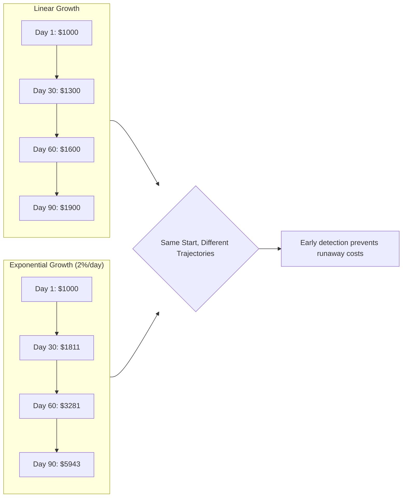
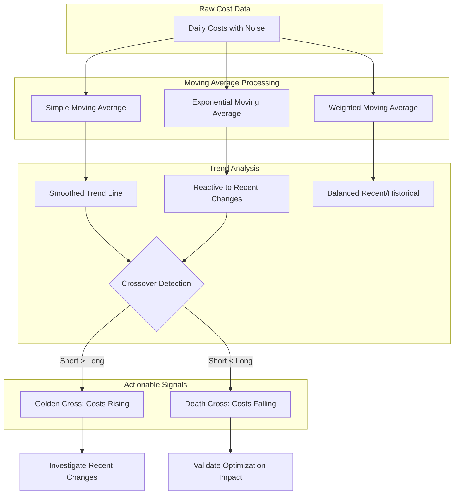
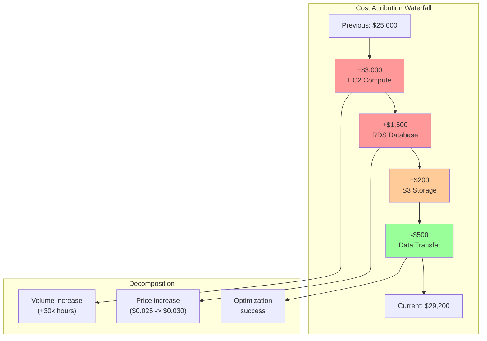
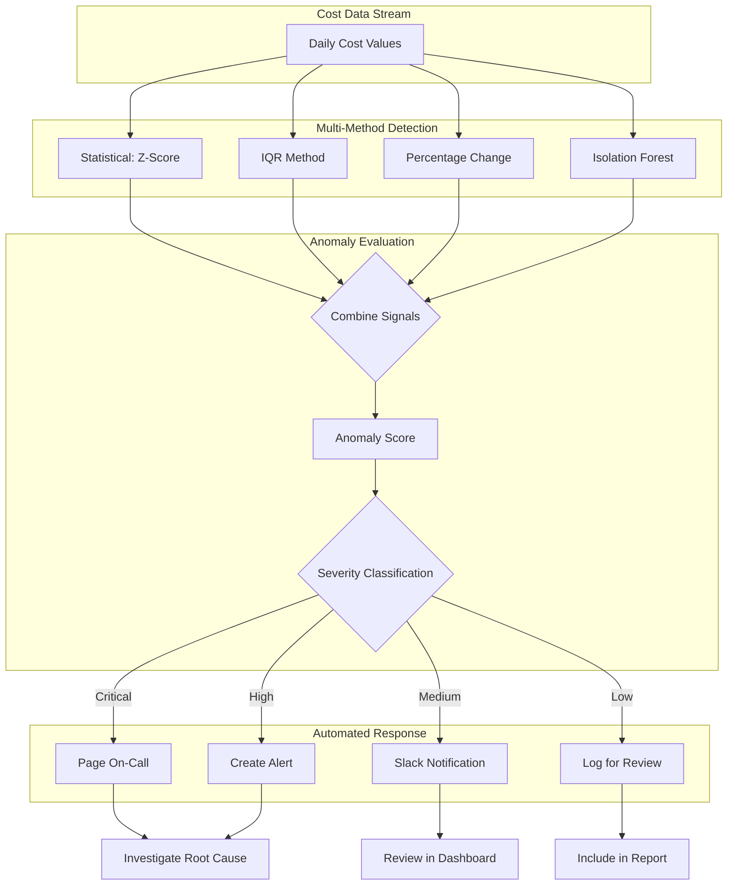
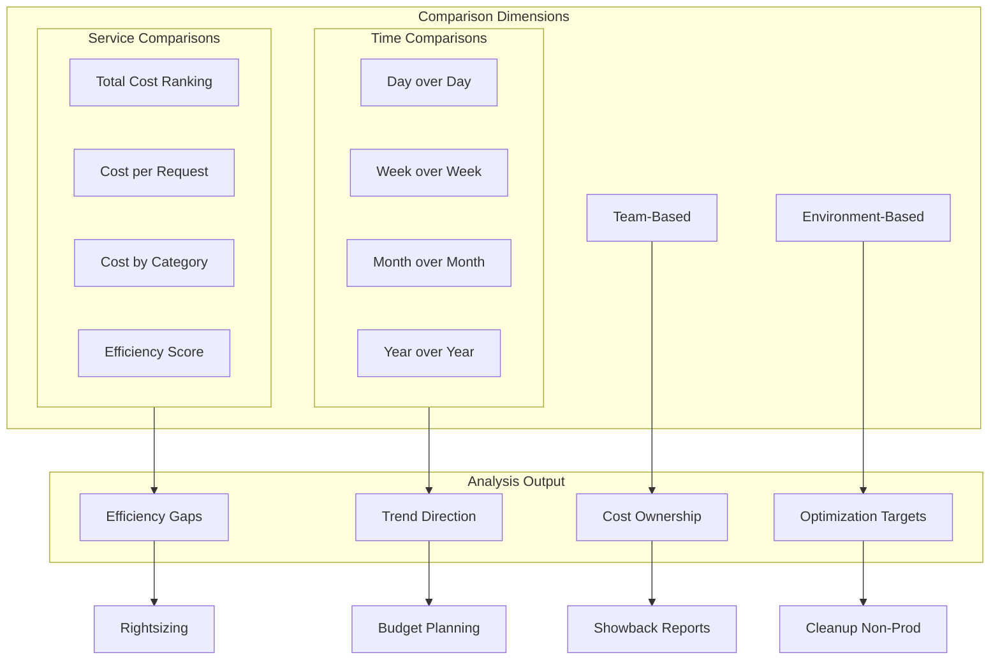

# How to Create Cost Trend Analysis

Author: [nawazdhandala](https://github.com/nawazdhandala)

Tags: Cost Optimization, FinOps, Analysis, Cloud

Description: Learn how to analyze cost trends for identifying optimization opportunities.

---

Cost trend analysis transforms raw cloud spending data into actionable insights. Rather than reacting to surprise bills, trend analysis helps you understand where costs are heading, why they are changing, and where optimization efforts will have the greatest impact.

This guide covers the essential techniques for building a comprehensive cost trend analysis system, from basic time-series patterns to advanced anomaly detection.

---

## Why Cost Trend Analysis Matters

Cloud costs rarely stay static. Traffic patterns shift, new services launch, team sizes change, and infrastructure evolves. Without trend analysis, you are flying blind:

- **Reactive budgeting**: Discovering overruns only after they happen
- **Missed opportunities**: Failing to spot inefficient resources until they compound
- **Poor forecasting**: Unable to predict future spend with confidence
- **Unclear attribution**: Not knowing which changes drove cost increases

Trend analysis shifts you from reactive to proactive cost management.

---

## Trend Identification Methods

The first step in cost analysis is identifying what patterns exist in your spending data.

### Linear Trend Detection

Linear trends reveal steady growth or decline over time. This is the simplest form of trend analysis.

```python
import numpy as np
from datetime import datetime, timedelta
from typing import List, Tuple

class LinearTrendAnalyzer:
    def __init__(self, values: List[float], dates: List[datetime]):
        """
        Analyze linear trends in cost data.

        Args:
            values: List of cost values
            dates: List of corresponding dates
        """
        self.values = np.array(values)
        self.dates = dates
        # Convert dates to numeric values (days since first date)
        self.x = np.array([(d - dates[0]).days for d in dates])

    def calculate_trend(self) -> dict:
        """
        Calculate linear regression trend line.

        Returns:
            Dictionary with slope, intercept, and trend statistics
        """
        n = len(self.x)

        # Calculate linear regression coefficients
        sum_x = np.sum(self.x)
        sum_y = np.sum(self.values)
        sum_xy = np.sum(self.x * self.values)
        sum_x2 = np.sum(self.x ** 2)

        slope = (n * sum_xy - sum_x * sum_y) / (n * sum_x2 - sum_x ** 2)
        intercept = (sum_y - slope * sum_x) / n

        # Calculate R-squared
        y_pred = slope * self.x + intercept
        ss_res = np.sum((self.values - y_pred) ** 2)
        ss_tot = np.sum((self.values - np.mean(self.values)) ** 2)
        r_squared = 1 - (ss_res / ss_tot) if ss_tot > 0 else 0

        # Calculate daily and monthly growth rates
        daily_growth = slope
        monthly_growth = slope * 30

        return {
            "slope": round(slope, 2),
            "intercept": round(intercept, 2),
            "r_squared": round(r_squared, 4),
            "daily_growth": round(daily_growth, 2),
            "monthly_growth": round(monthly_growth, 2),
            "trend_direction": "increasing" if slope > 0 else "decreasing" if slope < 0 else "flat"
        }

    def forecast(self, days_ahead: int) -> List[Tuple[datetime, float]]:
        """
        Forecast future costs based on linear trend.

        Args:
            days_ahead: Number of days to forecast

        Returns:
            List of (date, forecasted_value) tuples
        """
        trend = self.calculate_trend()
        slope = trend["slope"]
        intercept = trend["intercept"]

        forecasts = []
        last_x = self.x[-1]
        last_date = self.dates[-1]

        for i in range(1, days_ahead + 1):
            future_x = last_x + i
            future_date = last_date + timedelta(days=i)
            predicted_value = slope * future_x + intercept
            forecasts.append((future_date, round(max(0, predicted_value), 2)))

        return forecasts

# Example usage
daily_costs = [1200, 1220, 1180, 1250, 1280, 1310, 1290, 1350, 1380, 1400]
dates = [datetime(2024, 1, 1) + timedelta(days=i) for i in range(len(daily_costs))]

analyzer = LinearTrendAnalyzer(daily_costs, dates)
trend = analyzer.calculate_trend()

print(f"Trend Direction: {trend['trend_direction']}")
print(f"Daily Growth: ${trend['daily_growth']}/day")
print(f"Monthly Growth: ${trend['monthly_growth']}/month")
print(f"R-squared: {trend['r_squared']}")

# Forecast next 7 days
forecasts = analyzer.forecast(7)
print("\n7-Day Forecast:")
for date, value in forecasts:
    print(f"  {date.strftime('%Y-%m-%d')}: ${value}")
```

Output:
```
Trend Direction: increasing
Daily Growth: $22.42/day
Monthly Growth: $672.73/month
R-squared: 0.9521

7-Day Forecast:
  2024-01-11: $1466.18
  2024-01-12: $1488.61
  2024-01-13: $1511.03
  2024-01-14: $1533.45
  2024-01-15: $1555.88
  2024-01-16: $1578.30
  2024-01-17: $1600.73
```

### Exponential Trend Detection

When costs grow as a percentage rather than a fixed amount, exponential models fit better.

```python
import numpy as np
from typing import List

class ExponentialTrendAnalyzer:
    def __init__(self, values: List[float]):
        """
        Analyze exponential growth trends in cost data.

        Args:
            values: List of cost values (should be positive)
        """
        self.values = np.array(values)
        self.log_values = np.log(self.values)
        self.x = np.arange(len(values))

    def calculate_trend(self) -> dict:
        """
        Calculate exponential growth rate.

        Returns:
            Dictionary with growth rate and trend statistics
        """
        # Fit linear regression on log-transformed data
        n = len(self.x)
        sum_x = np.sum(self.x)
        sum_y = np.sum(self.log_values)
        sum_xy = np.sum(self.x * self.log_values)
        sum_x2 = np.sum(self.x ** 2)

        log_slope = (n * sum_xy - sum_x * sum_y) / (n * sum_x2 - sum_x ** 2)
        log_intercept = (sum_y - log_slope * sum_x) / n

        # Convert back to exponential form: y = a * e^(b*x)
        # where a = e^intercept, b = slope
        growth_rate = np.exp(log_slope) - 1  # Daily growth rate as percentage
        initial_value = np.exp(log_intercept)

        # Calculate R-squared on original scale
        y_pred = initial_value * np.exp(log_slope * self.x)
        ss_res = np.sum((self.values - y_pred) ** 2)
        ss_tot = np.sum((self.values - np.mean(self.values)) ** 2)
        r_squared = 1 - (ss_res / ss_tot) if ss_tot > 0 else 0

        # Project monthly and annual growth
        monthly_multiplier = (1 + growth_rate) ** 30
        annual_multiplier = (1 + growth_rate) ** 365

        return {
            "daily_growth_rate": round(growth_rate * 100, 2),  # percentage
            "monthly_multiplier": round(monthly_multiplier, 2),
            "annual_multiplier": round(annual_multiplier, 2),
            "r_squared": round(r_squared, 4),
            "initial_value": round(initial_value, 2),
            "doubling_days": round(np.log(2) / log_slope, 1) if log_slope > 0 else None
        }

# Example: Costs growing 2% daily
costs_exponential = [1000, 1020, 1040, 1061, 1082, 1104, 1126, 1149, 1172, 1195]
exp_analyzer = ExponentialTrendAnalyzer(costs_exponential)
exp_trend = exp_analyzer.calculate_trend()

print(f"Daily Growth Rate: {exp_trend['daily_growth_rate']}%")
print(f"Monthly Multiplier: {exp_trend['monthly_multiplier']}x")
print(f"Annual Multiplier: {exp_trend['annual_multiplier']}x")
print(f"Doubling Time: {exp_trend['doubling_days']} days")
```

The following diagram illustrates the difference between linear and exponential cost trends:



---

## Time-Series Analysis

Time-series analysis extracts patterns from sequential cost data, including seasonality, cycles, and underlying trends.

### Seasonal Decomposition

Most cloud costs exhibit seasonal patterns - daily, weekly, or monthly cycles.

```python
import numpy as np
from collections import defaultdict
from typing import List, Dict, Tuple
from datetime import datetime, timedelta

class SeasonalDecomposition:
    def __init__(self, values: List[float], dates: List[datetime],
                 period: str = "weekly"):
        """
        Decompose cost time series into trend, seasonal, and residual components.

        Args:
            values: Cost values
            dates: Corresponding dates
            period: "daily" (hour patterns), "weekly" (day-of-week), or "monthly"
        """
        self.values = np.array(values)
        self.dates = dates
        self.period = period
        self.period_length = self._get_period_length()

    def _get_period_length(self) -> int:
        """Get the number of observations in one seasonal cycle."""
        periods = {
            "daily": 24,    # 24 hours
            "weekly": 7,    # 7 days
            "monthly": 30   # ~30 days
        }
        return periods.get(self.period, 7)

    def _get_seasonal_index(self, date: datetime) -> int:
        """Get the seasonal bucket for a given date."""
        if self.period == "daily":
            return date.hour
        elif self.period == "weekly":
            return date.weekday()
        elif self.period == "monthly":
            return date.day - 1  # 0-indexed
        return 0

    def decompose(self) -> Dict[str, np.ndarray]:
        """
        Perform additive seasonal decomposition.

        Returns:
            Dictionary with trend, seasonal, and residual components
        """
        n = len(self.values)

        # Step 1: Calculate trend using centered moving average
        trend = np.full(n, np.nan)
        half_period = self.period_length // 2

        for i in range(half_period, n - half_period):
            window = self.values[i - half_period:i + half_period + 1]
            trend[i] = np.mean(window)

        # Fill edges with nearest valid values
        first_valid = half_period
        last_valid = n - half_period - 1
        trend[:first_valid] = trend[first_valid]
        trend[last_valid + 1:] = trend[last_valid]

        # Step 2: Calculate seasonal component
        detrended = self.values - trend
        seasonal_indices = defaultdict(list)

        for i, date in enumerate(self.dates):
            idx = self._get_seasonal_index(date)
            seasonal_indices[idx].append(detrended[i])

        # Average seasonal effect for each period
        seasonal_pattern = {}
        for idx, vals in seasonal_indices.items():
            seasonal_pattern[idx] = np.nanmean(vals)

        # Normalize seasonal component to sum to zero
        mean_seasonal = np.mean(list(seasonal_pattern.values()))
        for idx in seasonal_pattern:
            seasonal_pattern[idx] -= mean_seasonal

        # Build seasonal array
        seasonal = np.array([
            seasonal_pattern[self._get_seasonal_index(d)]
            for d in self.dates
        ])

        # Step 3: Calculate residual
        residual = self.values - trend - seasonal

        return {
            "observed": self.values,
            "trend": trend,
            "seasonal": seasonal,
            "residual": residual,
            "seasonal_pattern": seasonal_pattern
        }

    def get_seasonal_insights(self) -> Dict:
        """
        Extract actionable insights from seasonal patterns.

        Returns:
            Dictionary with peak periods, low periods, and recommendations
        """
        decomposition = self.decompose()
        pattern = decomposition["seasonal_pattern"]

        # Find peak and low periods
        peak_idx = max(pattern.keys(), key=lambda k: pattern[k])
        low_idx = min(pattern.keys(), key=lambda k: pattern[k])

        # Day names for weekly patterns
        day_names = ["Monday", "Tuesday", "Wednesday", "Thursday",
                     "Friday", "Saturday", "Sunday"]

        if self.period == "weekly":
            peak_period = day_names[peak_idx]
            low_period = day_names[low_idx]
        else:
            peak_period = str(peak_idx)
            low_period = str(low_idx)

        return {
            "peak_period": peak_period,
            "peak_effect": round(pattern[peak_idx], 2),
            "low_period": low_period,
            "low_effect": round(pattern[low_idx], 2),
            "seasonal_range": round(max(pattern.values()) - min(pattern.values()), 2),
            "pattern": {str(k): round(v, 2) for k, v in pattern.items()}
        }

# Example: Weekly cost pattern
weekly_costs = [
    5200, 5400, 5100, 5300, 5500, 3200, 2800,  # Week 1
    5300, 5500, 5200, 5400, 5600, 3300, 2900,  # Week 2
    5400, 5600, 5300, 5500, 5700, 3400, 3000,  # Week 3
    5500, 5700, 5400, 5600, 5800, 3500, 3100   # Week 4
]
dates = [datetime(2024, 1, 1) + timedelta(days=i) for i in range(len(weekly_costs))]

decomposer = SeasonalDecomposition(weekly_costs, dates, period="weekly")
insights = decomposer.get_seasonal_insights()

print(f"Peak Spending: {insights['peak_period']} (+${insights['peak_effect']})")
print(f"Low Spending: {insights['low_period']} (${insights['low_effect']})")
print(f"Seasonal Range: ${insights['seasonal_range']}")
print("\nDaily Pattern:")
for day, effect in insights['pattern'].items():
    day_name = ["Mon", "Tue", "Wed", "Thu", "Fri", "Sat", "Sun"][int(day)]
    print(f"  {day_name}: {'+' if effect > 0 else ''}{effect}")
```

### Moving Averages for Trend Smoothing

Moving averages smooth out noise and reveal underlying trends.

```python
from typing import List, Optional
import numpy as np

class CostMovingAverages:
    def __init__(self, values: List[float]):
        """
        Calculate various moving averages for cost trend analysis.

        Args:
            values: List of cost values
        """
        self.values = np.array(values)

    def simple_moving_average(self, window: int) -> np.ndarray:
        """
        Calculate simple moving average.

        Args:
            window: Number of periods to average

        Returns:
            Array of moving average values (with NaN for initial periods)
        """
        result = np.full(len(self.values), np.nan)
        for i in range(window - 1, len(self.values)):
            result[i] = np.mean(self.values[i - window + 1:i + 1])
        return result

    def exponential_moving_average(self, span: int) -> np.ndarray:
        """
        Calculate exponential moving average (more weight to recent values).

        Args:
            span: Span for EMA calculation (similar to window size)

        Returns:
            Array of EMA values
        """
        alpha = 2 / (span + 1)
        result = np.zeros(len(self.values))
        result[0] = self.values[0]

        for i in range(1, len(self.values)):
            result[i] = alpha * self.values[i] + (1 - alpha) * result[i - 1]

        return result

    def weighted_moving_average(self, window: int) -> np.ndarray:
        """
        Calculate weighted moving average (linear weights).

        Args:
            window: Number of periods

        Returns:
            Array of weighted moving average values
        """
        weights = np.arange(1, window + 1)
        result = np.full(len(self.values), np.nan)

        for i in range(window - 1, len(self.values)):
            window_values = self.values[i - window + 1:i + 1]
            result[i] = np.sum(window_values * weights) / np.sum(weights)

        return result

    def detect_crossovers(self, short_window: int = 7,
                          long_window: int = 30) -> List[dict]:
        """
        Detect golden cross and death cross signals.

        Short MA crossing above long MA = costs accelerating (golden cross)
        Short MA crossing below long MA = costs decelerating (death cross)

        Returns:
            List of crossover events
        """
        short_ma = self.simple_moving_average(short_window)
        long_ma = self.simple_moving_average(long_window)

        crossovers = []
        for i in range(1, len(self.values)):
            if np.isnan(short_ma[i]) or np.isnan(long_ma[i]):
                continue
            if np.isnan(short_ma[i-1]) or np.isnan(long_ma[i-1]):
                continue

            # Check for crossover
            prev_diff = short_ma[i-1] - long_ma[i-1]
            curr_diff = short_ma[i] - long_ma[i]

            if prev_diff <= 0 and curr_diff > 0:
                crossovers.append({
                    "index": i,
                    "type": "golden_cross",
                    "signal": "Costs accelerating - investigate recent changes",
                    "short_ma": round(short_ma[i], 2),
                    "long_ma": round(long_ma[i], 2)
                })
            elif prev_diff >= 0 and curr_diff < 0:
                crossovers.append({
                    "index": i,
                    "type": "death_cross",
                    "signal": "Costs decelerating - optimization efforts working",
                    "short_ma": round(short_ma[i], 2),
                    "long_ma": round(long_ma[i], 2)
                })

        return crossovers

# Example usage
daily_costs = [
    1000, 1020, 1010, 1030, 1050, 1040, 1060,
    1080, 1100, 1120, 1150, 1180, 1200, 1220,
    1250, 1280, 1300, 1290, 1270, 1250, 1230,
    1200, 1180, 1160, 1140, 1120, 1100, 1080,
    1060, 1050, 1040, 1030, 1020, 1010, 1000
]

ma_analyzer = CostMovingAverages(daily_costs)

sma_7 = ma_analyzer.simple_moving_average(7)
sma_14 = ma_analyzer.simple_moving_average(14)
ema_7 = ma_analyzer.exponential_moving_average(7)

print("Sample Moving Averages (Day 20):")
print(f"  Raw Value: ${daily_costs[20]}")
print(f"  7-day SMA: ${round(sma_7[20], 2)}")
print(f"  14-day SMA: ${round(sma_14[20], 2)}")
print(f"  7-day EMA: ${round(ema_7[20], 2)}")

crossovers = ma_analyzer.detect_crossovers(short_window=5, long_window=14)
print(f"\nDetected {len(crossovers)} crossover signals")
for cross in crossovers:
    print(f"  Day {cross['index']}: {cross['type']} - {cross['signal']}")
```

The following diagram shows how moving averages help identify cost trends:



---

## Cost Driver Correlation

Understanding which factors drive cost changes is essential for targeted optimization.

### Correlation Analysis

```python
import numpy as np
from typing import Dict, List, Tuple

class CostDriverCorrelation:
    def __init__(self):
        """
        Analyze correlations between cost metrics and potential drivers.
        """
        self.data = {}

    def add_metric(self, name: str, values: List[float]):
        """Add a metric time series."""
        self.data[name] = np.array(values)

    def calculate_correlation(self, metric1: str, metric2: str) -> float:
        """
        Calculate Pearson correlation coefficient between two metrics.

        Returns:
            Correlation coefficient (-1 to 1)
        """
        if metric1 not in self.data or metric2 not in self.data:
            raise ValueError(f"Metric not found")

        x = self.data[metric1]
        y = self.data[metric2]

        # Ensure same length
        min_len = min(len(x), len(y))
        x, y = x[:min_len], y[:min_len]

        # Calculate Pearson correlation
        n = len(x)
        sum_x = np.sum(x)
        sum_y = np.sum(y)
        sum_xy = np.sum(x * y)
        sum_x2 = np.sum(x ** 2)
        sum_y2 = np.sum(y ** 2)

        numerator = n * sum_xy - sum_x * sum_y
        denominator = np.sqrt((n * sum_x2 - sum_x ** 2) * (n * sum_y2 - sum_y ** 2))

        if denominator == 0:
            return 0.0

        return numerator / denominator

    def find_cost_drivers(self, cost_metric: str,
                          threshold: float = 0.5) -> List[Dict]:
        """
        Find metrics most correlated with costs.

        Args:
            cost_metric: Name of the cost metric
            threshold: Minimum absolute correlation to report

        Returns:
            List of correlated metrics sorted by correlation strength
        """
        drivers = []

        for metric in self.data.keys():
            if metric == cost_metric:
                continue

            corr = self.calculate_correlation(cost_metric, metric)
            abs_corr = abs(corr)

            if abs_corr >= threshold:
                drivers.append({
                    "metric": metric,
                    "correlation": round(corr, 3),
                    "strength": "strong" if abs_corr > 0.7 else "moderate",
                    "relationship": "positive" if corr > 0 else "negative"
                })

        return sorted(drivers, key=lambda x: abs(x["correlation"]), reverse=True)

    def calculate_lagged_correlation(self, metric1: str, metric2: str,
                                     max_lag: int = 7) -> Dict[int, float]:
        """
        Calculate correlation at different time lags.

        Useful for finding leading indicators of cost changes.

        Args:
            metric1: First metric (e.g., cost)
            metric2: Second metric (potential driver)
            max_lag: Maximum lag to test (in time periods)

        Returns:
            Dictionary mapping lag to correlation coefficient
        """
        x = self.data[metric1]
        y = self.data[metric2]

        correlations = {}

        for lag in range(-max_lag, max_lag + 1):
            if lag < 0:
                # metric2 leads metric1
                x_shifted = x[-lag:]
                y_shifted = y[:lag]
            elif lag > 0:
                # metric1 leads metric2
                x_shifted = x[:-lag]
                y_shifted = y[lag:]
            else:
                x_shifted = x
                y_shifted = y

            if len(x_shifted) < 3:
                continue

            # Calculate correlation
            n = len(x_shifted)
            mean_x, mean_y = np.mean(x_shifted), np.mean(y_shifted)
            std_x, std_y = np.std(x_shifted), np.std(y_shifted)

            if std_x == 0 or std_y == 0:
                correlations[lag] = 0.0
                continue

            corr = np.mean((x_shifted - mean_x) * (y_shifted - mean_y)) / (std_x * std_y)
            correlations[lag] = round(corr, 3)

        return correlations

# Example: Analyze cost drivers
analyzer = CostDriverCorrelation()

# Add cost and potential driver metrics (30 days of data)
np.random.seed(42)
base_traffic = np.linspace(1000, 2000, 30) + np.random.normal(0, 50, 30)
base_cost = base_traffic * 0.05 + np.random.normal(0, 5, 30)

analyzer.add_metric("daily_cost", list(base_cost))
analyzer.add_metric("api_requests", list(base_traffic))
analyzer.add_metric("active_users", list(base_traffic * 0.1 + np.random.normal(0, 5, 30)))
analyzer.add_metric("storage_gb", list(np.linspace(100, 150, 30)))
analyzer.add_metric("cpu_hours", list(base_traffic * 0.001 + np.random.normal(0, 0.5, 30)))
analyzer.add_metric("random_metric", list(np.random.normal(50, 10, 30)))

# Find cost drivers
drivers = analyzer.find_cost_drivers("daily_cost", threshold=0.5)
print("Cost Drivers (correlation > 0.5):")
for driver in drivers:
    print(f"  {driver['metric']}: {driver['correlation']} ({driver['strength']} {driver['relationship']})")

# Check lagged correlation for leading indicators
lagged = analyzer.calculate_lagged_correlation("daily_cost", "api_requests", max_lag=5)
print("\nLagged Correlation (API Requests vs Cost):")
for lag, corr in sorted(lagged.items()):
    indicator = "<-- API leads" if lag < 0 else "--> Cost leads" if lag > 0 else "(same day)"
    print(f"  Lag {lag:+d}: {corr} {indicator}")
```

### Attribution Analysis

Break down cost changes into contributing factors.

```python
from typing import Dict, List, Optional
from dataclasses import dataclass
from datetime import datetime

@dataclass
class CostComponent:
    name: str
    previous_value: float
    current_value: float
    unit_cost_previous: Optional[float] = None
    unit_cost_current: Optional[float] = None
    units_previous: Optional[float] = None
    units_current: Optional[float] = None

class CostAttribution:
    def __init__(self):
        """
        Attribute cost changes to specific factors.
        """
        self.components: List[CostComponent] = []

    def add_component(self, component: CostComponent):
        """Add a cost component for analysis."""
        self.components.append(component)

    def analyze_change(self) -> Dict:
        """
        Analyze total cost change and attribute to components.

        Returns:
            Attribution breakdown with percentages
        """
        total_previous = sum(c.previous_value for c in self.components)
        total_current = sum(c.current_value for c in self.components)
        total_change = total_current - total_previous

        attributions = []
        for comp in self.components:
            change = comp.current_value - comp.previous_value

            # Calculate attribution percentage
            if total_change != 0:
                contribution_pct = (change / abs(total_change)) * 100
            else:
                contribution_pct = 0

            attribution = {
                "component": comp.name,
                "previous": comp.previous_value,
                "current": comp.current_value,
                "change": round(change, 2),
                "change_pct": round((change / comp.previous_value * 100)
                                   if comp.previous_value else 0, 1),
                "contribution_to_total": round(contribution_pct, 1)
            }

            # If unit-level data available, decompose further
            if all([comp.unit_cost_previous, comp.unit_cost_current,
                   comp.units_previous, comp.units_current]):

                # Price effect: change in unit cost * average units
                avg_units = (comp.units_previous + comp.units_current) / 2
                price_effect = (comp.unit_cost_current - comp.unit_cost_previous) * avg_units

                # Volume effect: change in units * average unit cost
                avg_price = (comp.unit_cost_previous + comp.unit_cost_current) / 2
                volume_effect = (comp.units_current - comp.units_previous) * avg_price

                attribution["price_effect"] = round(price_effect, 2)
                attribution["volume_effect"] = round(volume_effect, 2)

            attributions.append(attribution)

        # Sort by absolute contribution
        attributions.sort(key=lambda x: abs(x["change"]), reverse=True)

        return {
            "total_previous": round(total_previous, 2),
            "total_current": round(total_current, 2),
            "total_change": round(total_change, 2),
            "total_change_pct": round((total_change / total_previous * 100)
                                      if total_previous else 0, 1),
            "attributions": attributions
        }

    def waterfall_breakdown(self) -> List[Dict]:
        """
        Generate waterfall chart data for cost attribution.

        Returns:
            List of waterfall segments for visualization
        """
        analysis = self.analyze_change()

        waterfall = []
        running_total = analysis["total_previous"]

        # Starting point
        waterfall.append({
            "label": "Previous Period",
            "value": analysis["total_previous"],
            "running_total": running_total,
            "type": "total"
        })

        # Add each component's change
        for attr in analysis["attributions"]:
            running_total += attr["change"]
            waterfall.append({
                "label": attr["component"],
                "value": attr["change"],
                "running_total": round(running_total, 2),
                "type": "increase" if attr["change"] > 0 else "decrease"
            })

        # Ending point
        waterfall.append({
            "label": "Current Period",
            "value": analysis["total_current"],
            "running_total": analysis["total_current"],
            "type": "total"
        })

        return waterfall

# Example: Monthly cost attribution
attribution = CostAttribution()

attribution.add_component(CostComponent(
    name="EC2 Compute",
    previous_value=15000,
    current_value=18000,
    unit_cost_previous=0.10,
    unit_cost_current=0.10,
    units_previous=150000,
    units_current=180000
))

attribution.add_component(CostComponent(
    name="RDS Database",
    previous_value=5000,
    current_value=6500,
    unit_cost_previous=0.025,
    unit_cost_current=0.030,  # Price increase
    units_previous=200000,
    units_current=200000      # Same usage
))

attribution.add_component(CostComponent(
    name="S3 Storage",
    previous_value=2000,
    current_value=2200
))

attribution.add_component(CostComponent(
    name="Data Transfer",
    previous_value=3000,
    current_value=2500  # Reduced
))

analysis = attribution.analyze_change()

print(f"Total Cost Change: ${analysis['total_change']:+,.0f} ({analysis['total_change_pct']:+.1f}%)")
print(f"\nCost Attribution:")
for attr in analysis["attributions"]:
    print(f"\n  {attr['component']}:")
    print(f"    Change: ${attr['change']:+,.0f} ({attr['change_pct']:+.1f}%)")
    print(f"    Contribution to total: {attr['contribution_to_total']:+.1f}%")
    if "price_effect" in attr:
        print(f"    - Price effect: ${attr['price_effect']:+,.0f}")
        print(f"    - Volume effect: ${attr['volume_effect']:+,.0f}")

waterfall = attribution.waterfall_breakdown()
print("\nWaterfall Chart Data:")
for segment in waterfall:
    symbol = "=" if segment["type"] == "total" else "+" if segment["type"] == "increase" else "-"
    print(f"  {symbol} {segment['label']}: ${segment['value']:,.0f} (Running: ${segment['running_total']:,.0f})")
```

The following diagram illustrates the cost attribution waterfall:



---

## Anomaly Detection

Detecting unusual cost patterns early prevents budget surprises.

### Statistical Anomaly Detection

```python
import numpy as np
from typing import List, Dict, Tuple, Optional
from datetime import datetime, timedelta
from collections import deque

class CostAnomalyDetector:
    def __init__(self,
                 baseline_window: int = 30,
                 sensitivity: float = 2.5,
                 min_samples: int = 7):
        """
        Detect cost anomalies using statistical methods.

        Args:
            baseline_window: Days of history for baseline calculation
            sensitivity: Number of standard deviations for threshold
            min_samples: Minimum samples before detecting anomalies
        """
        self.baseline_window = baseline_window
        self.sensitivity = sensitivity
        self.min_samples = min_samples
        self.history = deque(maxlen=baseline_window)

    def add_observation(self, value: float, timestamp: datetime) -> Optional[Dict]:
        """
        Add a cost observation and check for anomaly.

        Returns:
            Anomaly details if detected, None otherwise
        """
        anomaly = None

        if len(self.history) >= self.min_samples:
            anomaly = self._check_anomaly(value, timestamp)

        self.history.append((timestamp, value))
        return anomaly

    def _check_anomaly(self, value: float, timestamp: datetime) -> Optional[Dict]:
        """Check if value is anomalous compared to baseline."""
        historical_values = [v for _, v in self.history]

        mean = np.mean(historical_values)
        std = np.std(historical_values)

        if std == 0:
            return None

        z_score = (value - mean) / std

        if abs(z_score) > self.sensitivity:
            # Calculate expected range
            lower_bound = mean - self.sensitivity * std
            upper_bound = mean + self.sensitivity * std

            return {
                "timestamp": timestamp.isoformat(),
                "value": round(value, 2),
                "expected_mean": round(mean, 2),
                "expected_std": round(std, 2),
                "z_score": round(z_score, 2),
                "lower_bound": round(max(0, lower_bound), 2),
                "upper_bound": round(upper_bound, 2),
                "type": "spike" if value > mean else "drop",
                "deviation_pct": round((value - mean) / mean * 100, 1),
                "severity": self._classify_severity(abs(z_score))
            }

        return None

    def _classify_severity(self, z_score: float) -> str:
        """Classify anomaly severity based on z-score."""
        if z_score > 4:
            return "critical"
        elif z_score > 3:
            return "high"
        elif z_score > 2.5:
            return "medium"
        return "low"

class IQRAnomalyDetector:
    """
    Detect anomalies using Interquartile Range (IQR) method.
    More robust to outliers than standard deviation.
    """

    def __init__(self, multiplier: float = 1.5):
        """
        Args:
            multiplier: IQR multiplier for bounds (1.5 = standard, 3 = extreme)
        """
        self.multiplier = multiplier
        self.history = []

    def add_observation(self, value: float) -> Optional[Dict]:
        """Add observation and check for anomaly using IQR."""
        self.history.append(value)

        if len(self.history) < 10:
            return None

        q1 = np.percentile(self.history[:-1], 25)
        q3 = np.percentile(self.history[:-1], 75)
        iqr = q3 - q1

        lower_bound = q1 - self.multiplier * iqr
        upper_bound = q3 + self.multiplier * iqr

        if value < lower_bound or value > upper_bound:
            return {
                "value": value,
                "q1": round(q1, 2),
                "q3": round(q3, 2),
                "iqr": round(iqr, 2),
                "lower_bound": round(max(0, lower_bound), 2),
                "upper_bound": round(upper_bound, 2),
                "type": "spike" if value > upper_bound else "drop"
            }

        return None

class PercentageChangeDetector:
    """
    Detect anomalies based on percentage change from previous period.
    Simple but effective for catching sudden changes.
    """

    def __init__(self,
                 threshold_pct: float = 20,
                 compare_to: str = "previous"):
        """
        Args:
            threshold_pct: Percentage change threshold for anomaly
            compare_to: "previous" (day/period) or "average" (rolling average)
        """
        self.threshold_pct = threshold_pct
        self.compare_to = compare_to
        self.history = []

    def add_observation(self, value: float) -> Optional[Dict]:
        """Check for anomaly based on percentage change."""
        if len(self.history) < 1:
            self.history.append(value)
            return None

        if self.compare_to == "previous":
            baseline = self.history[-1]
        else:  # average
            baseline = np.mean(self.history[-7:]) if len(self.history) >= 7 else np.mean(self.history)

        if baseline == 0:
            self.history.append(value)
            return None

        pct_change = ((value - baseline) / baseline) * 100

        self.history.append(value)

        if abs(pct_change) > self.threshold_pct:
            return {
                "value": value,
                "baseline": round(baseline, 2),
                "change_pct": round(pct_change, 1),
                "type": "spike" if pct_change > 0 else "drop"
            }

        return None

# Example: Multi-method anomaly detection
print("=== Cost Anomaly Detection Demo ===\n")

# Simulate 30 days of costs with anomalies on days 15 and 25
np.random.seed(42)
base_costs = 1000 + np.random.normal(0, 50, 30)
base_costs[14] = 1500  # Spike anomaly
base_costs[24] = 600   # Drop anomaly

dates = [datetime(2024, 1, 1) + timedelta(days=i) for i in range(30)]

# Test with statistical detector
stat_detector = CostAnomalyDetector(baseline_window=14, sensitivity=2.5)
print("Statistical Detector Results:")

for i, (date, cost) in enumerate(zip(dates, base_costs)):
    anomaly = stat_detector.add_observation(cost, date)
    if anomaly:
        print(f"  Day {i+1} ({date.strftime('%m/%d')}): {anomaly['type'].upper()}")
        print(f"    Value: ${anomaly['value']:.0f}, Expected: ${anomaly['expected_mean']:.0f} +/- ${anomaly['expected_std']:.0f}")
        print(f"    Deviation: {anomaly['deviation_pct']:+.1f}%, Severity: {anomaly['severity']}")

# Test with percentage change detector
pct_detector = PercentageChangeDetector(threshold_pct=25)
print("\nPercentage Change Detector Results:")

for i, cost in enumerate(base_costs):
    anomaly = pct_detector.add_observation(cost)
    if anomaly:
        print(f"  Day {i+1}: {anomaly['type'].upper()}")
        print(f"    Value: ${anomaly['value']:.0f}, Baseline: ${anomaly['baseline']:.0f}")
        print(f"    Change: {anomaly['change_pct']:+.1f}%")
```

### Machine Learning Anomaly Detection

For more sophisticated pattern detection, isolation forests work well with cost data.

```python
import numpy as np
from typing import List, Dict, Tuple

class SimplifiedIsolationForest:
    """
    Simplified implementation of Isolation Forest for cost anomaly detection.

    Isolation Forest works by randomly partitioning data. Anomalies are
    isolated in fewer partitions than normal points.
    """

    def __init__(self, n_trees: int = 100, sample_size: int = 256,
                 contamination: float = 0.05):
        """
        Args:
            n_trees: Number of isolation trees
            sample_size: Subsample size for each tree
            contamination: Expected proportion of anomalies
        """
        self.n_trees = n_trees
        self.sample_size = sample_size
        self.contamination = contamination
        self.trees = []
        self.threshold = None

    def fit(self, data: np.ndarray):
        """
        Build isolation forest from training data.

        Args:
            data: Training data array (n_samples, n_features)
        """
        if len(data.shape) == 1:
            data = data.reshape(-1, 1)

        self.trees = []
        n_samples = len(data)

        for _ in range(self.n_trees):
            # Subsample data
            if n_samples > self.sample_size:
                indices = np.random.choice(n_samples, self.sample_size, replace=False)
                sample = data[indices]
            else:
                sample = data

            # Build tree
            tree = self._build_tree(sample, depth=0, max_depth=int(np.ceil(np.log2(self.sample_size))))
            self.trees.append(tree)

        # Calculate threshold based on contamination
        scores = self._score_samples(data)
        self.threshold = np.percentile(scores, 100 * (1 - self.contamination))

    def _build_tree(self, data: np.ndarray, depth: int, max_depth: int) -> Dict:
        """Build a single isolation tree recursively."""
        n_samples, n_features = data.shape

        if depth >= max_depth or n_samples <= 1:
            return {"type": "leaf", "size": n_samples}

        # Random feature and split point
        feature = np.random.randint(0, n_features)
        min_val, max_val = data[:, feature].min(), data[:, feature].max()

        if min_val == max_val:
            return {"type": "leaf", "size": n_samples}

        split_value = np.random.uniform(min_val, max_val)

        # Partition data
        left_mask = data[:, feature] < split_value
        left_data = data[left_mask]
        right_data = data[~left_mask]

        return {
            "type": "split",
            "feature": feature,
            "split_value": split_value,
            "left": self._build_tree(left_data, depth + 1, max_depth),
            "right": self._build_tree(right_data, depth + 1, max_depth)
        }

    def _path_length(self, point: np.ndarray, tree: Dict, depth: int = 0) -> float:
        """Calculate path length for a point in a tree."""
        if tree["type"] == "leaf":
            # Average path length for remaining points
            n = tree["size"]
            if n <= 1:
                return depth
            return depth + self._c(n)

        feature = tree["feature"]
        if point[feature] < tree["split_value"]:
            return self._path_length(point, tree["left"], depth + 1)
        else:
            return self._path_length(point, tree["right"], depth + 1)

    def _c(self, n: int) -> float:
        """Average path length of unsuccessful search in BST."""
        if n <= 1:
            return 0
        return 2 * (np.log(n - 1) + 0.5772156649) - (2 * (n - 1) / n)

    def _score_samples(self, data: np.ndarray) -> np.ndarray:
        """Calculate anomaly scores for samples."""
        if len(data.shape) == 1:
            data = data.reshape(-1, 1)

        scores = np.zeros(len(data))

        for i, point in enumerate(data):
            avg_path_length = np.mean([
                self._path_length(point, tree)
                for tree in self.trees
            ])
            # Normalize score (higher = more anomalous)
            scores[i] = 2 ** (-avg_path_length / self._c(self.sample_size))

        return scores

    def predict(self, data: np.ndarray) -> np.ndarray:
        """
        Predict if samples are anomalies.

        Returns:
            Array of 1 (anomaly) or 0 (normal)
        """
        scores = self._score_samples(data)
        return (scores > self.threshold).astype(int)

    def detect_anomalies(self, data: np.ndarray) -> List[Dict]:
        """
        Detect anomalies and return details.

        Returns:
            List of anomaly details with index and score
        """
        if len(data.shape) == 1:
            data = data.reshape(-1, 1)

        scores = self._score_samples(data)
        predictions = scores > self.threshold

        anomalies = []
        for i, (is_anomaly, score) in enumerate(zip(predictions, scores)):
            if is_anomaly:
                anomalies.append({
                    "index": i,
                    "value": float(data[i][0]) if data.shape[1] == 1 else data[i].tolist(),
                    "anomaly_score": round(float(score), 4),
                    "threshold": round(float(self.threshold), 4)
                })

        return anomalies

# Example: Detect cost anomalies with Isolation Forest
print("=== Isolation Forest Anomaly Detection ===\n")

# Generate synthetic cost data with anomalies
np.random.seed(42)
normal_costs = np.random.normal(1000, 100, 90)  # 90 normal days
anomalies = np.array([2500, 3000, 200, 150])    # 4 anomalies
all_costs = np.concatenate([normal_costs, anomalies])
np.random.shuffle(all_costs)

# Train and detect
detector = SimplifiedIsolationForest(n_trees=50, sample_size=64, contamination=0.05)
detector.fit(all_costs)

detected = detector.detect_anomalies(all_costs)
print(f"Detected {len(detected)} anomalies out of {len(all_costs)} samples")
print("\nAnomaly Details:")
for a in detected:
    print(f"  Index {a['index']}: Value=${a['value']:.0f}, Score={a['anomaly_score']:.3f}")
```

The following diagram shows the anomaly detection workflow:



---

## Comparative Analysis

Comparing costs across different dimensions reveals optimization opportunities.

### Period-Over-Period Comparison

```python
from typing import Dict, List, Optional
from datetime import datetime, timedelta
from dataclasses import dataclass
import numpy as np

@dataclass
class PeriodData:
    start_date: datetime
    end_date: datetime
    total_cost: float
    daily_costs: List[float]
    breakdown: Dict[str, float]

class ComparativeAnalyzer:
    def __init__(self):
        """
        Compare costs across different periods and dimensions.
        """
        pass

    def compare_periods(self, current: PeriodData,
                       previous: PeriodData) -> Dict:
        """
        Compare two time periods and calculate changes.

        Returns:
            Detailed comparison with changes and percentages
        """
        total_change = current.total_cost - previous.total_cost
        total_change_pct = (total_change / previous.total_cost * 100
                          if previous.total_cost else 0)

        # Daily average comparison
        current_avg = np.mean(current.daily_costs)
        previous_avg = np.mean(previous.daily_costs)
        avg_change_pct = ((current_avg - previous_avg) / previous_avg * 100
                         if previous_avg else 0)

        # Breakdown comparison
        breakdown_changes = []
        all_categories = set(current.breakdown.keys()) | set(previous.breakdown.keys())

        for category in all_categories:
            curr_val = current.breakdown.get(category, 0)
            prev_val = previous.breakdown.get(category, 0)
            change = curr_val - prev_val
            change_pct = (change / prev_val * 100) if prev_val else (100 if curr_val > 0 else 0)

            breakdown_changes.append({
                "category": category,
                "previous": prev_val,
                "current": curr_val,
                "change": round(change, 2),
                "change_pct": round(change_pct, 1),
                "contribution_pct": round(change / total_change * 100, 1) if total_change else 0
            })

        breakdown_changes.sort(key=lambda x: abs(x["change"]), reverse=True)

        return {
            "period": {
                "current": f"{current.start_date.strftime('%Y-%m-%d')} to {current.end_date.strftime('%Y-%m-%d')}",
                "previous": f"{previous.start_date.strftime('%Y-%m-%d')} to {previous.end_date.strftime('%Y-%m-%d')}"
            },
            "summary": {
                "previous_total": round(previous.total_cost, 2),
                "current_total": round(current.total_cost, 2),
                "total_change": round(total_change, 2),
                "total_change_pct": round(total_change_pct, 1),
                "previous_daily_avg": round(previous_avg, 2),
                "current_daily_avg": round(current_avg, 2),
                "daily_avg_change_pct": round(avg_change_pct, 1)
            },
            "breakdown": breakdown_changes,
            "insights": self._generate_insights(breakdown_changes, total_change)
        }

    def _generate_insights(self, breakdown: List[Dict],
                          total_change: float) -> List[str]:
        """Generate actionable insights from comparison."""
        insights = []

        # Top contributor
        if breakdown:
            top = breakdown[0]
            if abs(top["contribution_pct"]) > 50:
                direction = "increase" if top["change"] > 0 else "decrease"
                insights.append(
                    f"{top['category']} accounts for {abs(top['contribution_pct']):.0f}% "
                    f"of the total {direction}"
                )

        # New or eliminated categories
        for item in breakdown:
            if item["previous"] == 0 and item["current"] > 0:
                insights.append(f"New cost category: {item['category']} (${item['current']:,.0f})")
            elif item["current"] == 0 and item["previous"] > 0:
                insights.append(f"Eliminated: {item['category']} (saved ${item['previous']:,.0f})")

        # Significant changes
        significant = [b for b in breakdown if abs(b["change_pct"]) > 50 and b["previous"] > 0]
        for item in significant:
            if item["change_pct"] > 50:
                insights.append(f"Spike in {item['category']}: +{item['change_pct']:.0f}%")
            elif item["change_pct"] < -50:
                insights.append(f"Reduction in {item['category']}: {item['change_pct']:.0f}%")

        return insights

    def year_over_year(self, current_year: Dict[str, float],
                       previous_year: Dict[str, float]) -> Dict:
        """
        Compare costs year-over-year by month.

        Args:
            current_year: Dict mapping month (1-12) to cost
            previous_year: Dict mapping month (1-12) to cost

        Returns:
            YoY comparison by month
        """
        months = ["Jan", "Feb", "Mar", "Apr", "May", "Jun",
                 "Jul", "Aug", "Sep", "Oct", "Nov", "Dec"]

        comparisons = []
        for month_num in range(1, 13):
            curr = current_year.get(month_num, 0)
            prev = previous_year.get(month_num, 0)
            change = curr - prev
            change_pct = (change / prev * 100) if prev else 0

            comparisons.append({
                "month": months[month_num - 1],
                "previous_year": prev,
                "current_year": curr,
                "change": round(change, 2),
                "change_pct": round(change_pct, 1)
            })

        return {
            "monthly_comparison": comparisons,
            "ytd_previous": sum(previous_year.values()),
            "ytd_current": sum(current_year.values()),
            "ytd_change_pct": round(
                (sum(current_year.values()) - sum(previous_year.values()))
                / sum(previous_year.values()) * 100
                if sum(previous_year.values()) else 0, 1
            )
        }

# Example: Month-over-month comparison
print("=== Period Comparison Analysis ===\n")

previous_month = PeriodData(
    start_date=datetime(2024, 1, 1),
    end_date=datetime(2024, 1, 31),
    total_cost=45000,
    daily_costs=[1400 + np.random.normal(0, 100) for _ in range(31)],
    breakdown={
        "EC2": 20000,
        "RDS": 10000,
        "S3": 5000,
        "Lambda": 3000,
        "CloudFront": 4000,
        "Other": 3000
    }
)

current_month = PeriodData(
    start_date=datetime(2024, 2, 1),
    end_date=datetime(2024, 2, 29),
    total_cost=52000,
    daily_costs=[1800 + np.random.normal(0, 100) for _ in range(29)],
    breakdown={
        "EC2": 25000,    # Increased
        "RDS": 11000,    # Increased
        "S3": 5500,      # Slight increase
        "Lambda": 3500,  # Increased
        "CloudFront": 4000,  # Same
        "EKS": 3000      # New!
    }
)

analyzer = ComparativeAnalyzer()
comparison = analyzer.compare_periods(current_month, previous_month)

print(f"Period: {comparison['period']['previous']} vs {comparison['period']['current']}")
print(f"\nSummary:")
print(f"  Previous Total: ${comparison['summary']['previous_total']:,.0f}")
print(f"  Current Total: ${comparison['summary']['current_total']:,.0f}")
print(f"  Change: ${comparison['summary']['total_change']:+,.0f} ({comparison['summary']['total_change_pct']:+.1f}%)")

print(f"\nTop Changes by Category:")
for item in comparison["breakdown"][:5]:
    print(f"  {item['category']}: ${item['change']:+,.0f} ({item['change_pct']:+.1f}%)")

print(f"\nInsights:")
for insight in comparison["insights"]:
    print(f"  - {insight}")
```

### Service and Team Comparison

```python
from typing import Dict, List
import numpy as np

class ServiceComparison:
    def __init__(self):
        """
        Compare costs across services, teams, or environments.
        """
        self.services = {}

    def add_service(self, name: str, costs: Dict[str, float],
                   metadata: Dict = None):
        """
        Add a service with its cost breakdown and metadata.

        Args:
            name: Service name
            costs: Dict with cost categories (compute, storage, network, etc.)
            metadata: Optional metadata (team, environment, etc.)
        """
        self.services[name] = {
            "costs": costs,
            "total": sum(costs.values()),
            "metadata": metadata or {}
        }

    def compare_efficiency(self, metric: str = "cost_per_request") -> List[Dict]:
        """
        Compare services by efficiency metrics.

        Args:
            metric: Efficiency metric to compare by

        Returns:
            Ranked list of services by efficiency
        """
        rankings = []

        for name, data in self.services.items():
            if metric not in data["metadata"]:
                continue

            metric_value = data["metadata"][metric]
            rankings.append({
                "service": name,
                "total_cost": data["total"],
                metric: metric_value,
                "efficiency_score": round(data["total"] / metric_value, 4) if metric_value else 0
            })

        return sorted(rankings, key=lambda x: x["efficiency_score"])

    def cost_distribution(self) -> Dict:
        """
        Analyze cost distribution across services.

        Returns:
            Distribution statistics and outliers
        """
        totals = [s["total"] for s in self.services.values()]

        if not totals:
            return {}

        mean = np.mean(totals)
        std = np.std(totals)
        median = np.median(totals)

        # Identify outliers (> 2 std from mean)
        outliers = [
            {"service": name, "cost": data["total"],
             "z_score": round((data["total"] - mean) / std, 2) if std else 0}
            for name, data in self.services.items()
            if std and abs(data["total"] - mean) > 2 * std
        ]

        return {
            "statistics": {
                "mean": round(mean, 2),
                "median": round(median, 2),
                "std": round(std, 2),
                "min": round(min(totals), 2),
                "max": round(max(totals), 2),
                "total": round(sum(totals), 2)
            },
            "distribution": {
                "top_10_pct": self._top_n_percent(10),
                "top_20_pct": self._top_n_percent(20)
            },
            "outliers": outliers
        }

    def _top_n_percent(self, n: int) -> Dict:
        """Calculate what percentage of cost comes from top N% of services."""
        sorted_services = sorted(
            self.services.items(),
            key=lambda x: x[1]["total"],
            reverse=True
        )

        total_cost = sum(s["total"] for s in self.services.values())
        n_services = max(1, len(sorted_services) * n // 100)

        top_services = sorted_services[:n_services]
        top_cost = sum(s[1]["total"] for s in top_services)

        return {
            "services": [s[0] for s in top_services],
            "cost": round(top_cost, 2),
            "percentage_of_total": round(top_cost / total_cost * 100, 1) if total_cost else 0
        }

    def compare_by_dimension(self, dimension: str) -> Dict[str, Dict]:
        """
        Aggregate and compare costs by a metadata dimension.

        Args:
            dimension: Metadata field to group by (team, environment, etc.)

        Returns:
            Costs aggregated by dimension value
        """
        aggregated = {}

        for name, data in self.services.items():
            dim_value = data["metadata"].get(dimension, "unknown")

            if dim_value not in aggregated:
                aggregated[dim_value] = {
                    "services": [],
                    "total_cost": 0,
                    "cost_breakdown": {}
                }

            aggregated[dim_value]["services"].append(name)
            aggregated[dim_value]["total_cost"] += data["total"]

            for category, cost in data["costs"].items():
                if category not in aggregated[dim_value]["cost_breakdown"]:
                    aggregated[dim_value]["cost_breakdown"][category] = 0
                aggregated[dim_value]["cost_breakdown"][category] += cost

        return aggregated

# Example: Compare services
print("=== Service Cost Comparison ===\n")

comparison = ServiceComparison()

# Add services with costs and metadata
comparison.add_service("api-gateway",
    costs={"compute": 5000, "network": 2000, "storage": 500},
    metadata={"team": "platform", "environment": "prod", "requests": 10000000, "cost_per_request": 0.00075}
)

comparison.add_service("user-service",
    costs={"compute": 8000, "network": 1000, "storage": 2000, "database": 3000},
    metadata={"team": "core", "environment": "prod", "requests": 5000000, "cost_per_request": 0.0028}
)

comparison.add_service("analytics-pipeline",
    costs={"compute": 15000, "storage": 10000, "network": 500},
    metadata={"team": "data", "environment": "prod", "requests": 100000, "cost_per_request": 0.255}
)

comparison.add_service("dev-environment",
    costs={"compute": 2000, "storage": 500, "network": 100},
    metadata={"team": "engineering", "environment": "dev", "requests": 50000, "cost_per_request": 0.052}
)

# Distribution analysis
distribution = comparison.cost_distribution()
print("Cost Distribution:")
print(f"  Mean: ${distribution['statistics']['mean']:,.0f}")
print(f"  Median: ${distribution['statistics']['median']:,.0f}")
print(f"  Total: ${distribution['statistics']['total']:,.0f}")
print(f"  Top 20% of services account for {distribution['distribution']['top_20_pct']['percentage_of_total']}% of cost")

# Efficiency comparison
print("\nEfficiency Ranking (cost per request):")
efficiency = comparison.compare_efficiency("cost_per_request")
for i, svc in enumerate(efficiency, 1):
    print(f"  {i}. {svc['service']}: ${svc['cost_per_request']}/request (Total: ${svc['total_cost']:,.0f})")

# By team
print("\nCost by Team:")
by_team = comparison.compare_by_dimension("team")
for team, data in sorted(by_team.items(), key=lambda x: x[1]["total_cost"], reverse=True):
    print(f"  {team}: ${data['total_cost']:,.0f} ({len(data['services'])} services)")
```

The following diagram illustrates comparative analysis dimensions:



---

## Trend Visualization

Effective visualization makes trends actionable for stakeholders.

### Dashboard Data Preparation

```python
from typing import Dict, List
from datetime import datetime, timedelta
import numpy as np
import json

class TrendVisualization:
    def __init__(self):
        """
        Prepare cost trend data for visualization dashboards.
        """
        pass

    def prepare_time_series(self, values: List[float],
                           dates: List[datetime],
                           include_trend: bool = True,
                           include_forecast: int = 0) -> Dict:
        """
        Prepare time series data with trend line and optional forecast.

        Args:
            values: Cost values
            dates: Corresponding dates
            include_trend: Whether to include linear trend line
            include_forecast: Number of days to forecast (0 = none)

        Returns:
            Dictionary formatted for charting libraries
        """
        data = {
            "series": [
                {
                    "name": "Actual Cost",
                    "type": "line",
                    "data": [
                        {"x": d.isoformat(), "y": round(v, 2)}
                        for d, v in zip(dates, values)
                    ]
                }
            ],
            "summary": {
                "latest": round(values[-1], 2),
                "average": round(np.mean(values), 2),
                "min": round(min(values), 2),
                "max": round(max(values), 2),
                "total": round(sum(values), 2)
            }
        }

        if include_trend:
            # Calculate trend line
            x = np.arange(len(values))
            slope, intercept = np.polyfit(x, values, 1)
            trend_values = slope * x + intercept

            data["series"].append({
                "name": "Trend",
                "type": "line",
                "dashStyle": "dash",
                "data": [
                    {"x": d.isoformat(), "y": round(v, 2)}
                    for d, v in zip(dates, trend_values)
                ]
            })

            data["trend"] = {
                "direction": "increasing" if slope > 0 else "decreasing",
                "daily_change": round(slope, 2),
                "monthly_projection": round(slope * 30, 2)
            }

        if include_forecast > 0:
            # Extend trend for forecast
            x = np.arange(len(values))
            slope, intercept = np.polyfit(x, values, 1)

            forecast_data = []
            last_date = dates[-1]

            for i in range(1, include_forecast + 1):
                forecast_date = last_date + timedelta(days=i)
                forecast_value = slope * (len(values) + i - 1) + intercept
                forecast_data.append({
                    "x": forecast_date.isoformat(),
                    "y": round(max(0, forecast_value), 2)
                })

            data["series"].append({
                "name": "Forecast",
                "type": "line",
                "dashStyle": "dot",
                "data": forecast_data
            })

        return data

    def prepare_breakdown_chart(self, breakdown: Dict[str, float],
                               chart_type: str = "pie") -> Dict:
        """
        Prepare cost breakdown data for pie/donut/bar charts.

        Args:
            breakdown: Dict mapping category to cost
            chart_type: "pie", "donut", or "bar"

        Returns:
            Chart-ready data structure
        """
        total = sum(breakdown.values())

        sorted_items = sorted(breakdown.items(), key=lambda x: x[1], reverse=True)

        data = {
            "type": chart_type,
            "total": round(total, 2),
            "data": [
                {
                    "name": category,
                    "value": round(cost, 2),
                    "percentage": round(cost / total * 100, 1) if total else 0
                }
                for category, cost in sorted_items
            ]
        }

        # For charts with "Other" category
        if len(data["data"]) > 6:
            top_5 = data["data"][:5]
            other_value = sum(d["value"] for d in data["data"][5:])
            other_pct = sum(d["percentage"] for d in data["data"][5:])

            data["data_grouped"] = top_5 + [{
                "name": "Other",
                "value": round(other_value, 2),
                "percentage": round(other_pct, 1)
            }]

        return data

    def prepare_heatmap(self, data: Dict[str, Dict[str, float]]) -> Dict:
        """
        Prepare data for cost heatmap (e.g., service x time period).

        Args:
            data: Nested dict {row_label: {col_label: value}}

        Returns:
            Heatmap-ready data structure
        """
        rows = list(data.keys())
        cols = list(set(col for row_data in data.values() for col in row_data.keys()))
        cols.sort()

        # Build matrix
        matrix = []
        for row in rows:
            row_values = [data[row].get(col, 0) for col in cols]
            matrix.append(row_values)

        # Calculate color scale bounds
        all_values = [v for row in matrix for v in row]

        return {
            "rows": rows,
            "columns": cols,
            "matrix": matrix,
            "scale": {
                "min": min(all_values),
                "max": max(all_values),
                "mean": np.mean(all_values)
            }
        }

    def prepare_comparison_chart(self, current: Dict[str, float],
                                previous: Dict[str, float],
                                labels: tuple = ("Current", "Previous")) -> Dict:
        """
        Prepare side-by-side comparison chart data.

        Args:
            current: Current period costs by category
            previous: Previous period costs by category
            labels: Tuple of (current_label, previous_label)

        Returns:
            Grouped bar chart data
        """
        categories = sorted(set(current.keys()) | set(previous.keys()))

        return {
            "categories": categories,
            "series": [
                {
                    "name": labels[0],
                    "data": [round(current.get(cat, 0), 2) for cat in categories]
                },
                {
                    "name": labels[1],
                    "data": [round(previous.get(cat, 0), 2) for cat in categories]
                }
            ],
            "changes": [
                {
                    "category": cat,
                    "change": round(current.get(cat, 0) - previous.get(cat, 0), 2),
                    "change_pct": round(
                        (current.get(cat, 0) - previous.get(cat, 0)) / previous.get(cat, 1) * 100
                        if previous.get(cat, 0) else 0, 1
                    )
                }
                for cat in categories
            ]
        }

# Example: Prepare visualization data
print("=== Trend Visualization Data Preparation ===\n")

viz = TrendVisualization()

# Time series data
np.random.seed(42)
daily_costs = [1000 + i * 10 + np.random.normal(0, 50) for i in range(30)]
dates = [datetime(2024, 1, 1) + timedelta(days=i) for i in range(30)]

time_series = viz.prepare_time_series(daily_costs, dates,
                                      include_trend=True,
                                      include_forecast=7)

print("Time Series Chart Data:")
print(f"  Latest: ${time_series['summary']['latest']:,.0f}")
print(f"  Trend: {time_series['trend']['direction']} (${time_series['trend']['daily_change']:+.0f}/day)")
print(f"  30-day projection: ${time_series['trend']['monthly_projection']:+,.0f}")

# Breakdown chart
breakdown = {
    "EC2": 15000,
    "RDS": 8000,
    "S3": 3000,
    "Lambda": 2500,
    "CloudFront": 2000,
    "EKS": 1500,
    "Other": 1000
}

breakdown_chart = viz.prepare_breakdown_chart(breakdown, chart_type="donut")
print(f"\nBreakdown Chart Data:")
print(f"  Total: ${breakdown_chart['total']:,.0f}")
print(f"  Top category: {breakdown_chart['data'][0]['name']} ({breakdown_chart['data'][0]['percentage']}%)")

# Heatmap data (service x day of week)
heatmap_data = {
    "api-service": {"Mon": 500, "Tue": 520, "Wed": 510, "Thu": 530, "Fri": 550, "Sat": 300, "Sun": 280},
    "web-app": {"Mon": 800, "Tue": 850, "Wed": 820, "Thu": 880, "Fri": 900, "Sat": 400, "Sun": 350},
    "batch-jobs": {"Mon": 200, "Tue": 200, "Wed": 200, "Thu": 200, "Fri": 200, "Sat": 1000, "Sun": 1200}
}

heatmap = viz.prepare_heatmap(heatmap_data)
print(f"\nHeatmap Data:")
print(f"  Rows (services): {heatmap['rows']}")
print(f"  Columns (days): {heatmap['columns']}")
print(f"  Value range: ${heatmap['scale']['min']:,.0f} - ${heatmap['scale']['max']:,.0f}")
```

### Report Generation

```python
from datetime import datetime
from typing import Dict, List

class CostTrendReport:
    def __init__(self, report_period: str, generated_at: datetime = None):
        """
        Generate comprehensive cost trend reports.

        Args:
            report_period: Description of the report period
            generated_at: Report generation timestamp
        """
        self.report_period = report_period
        self.generated_at = generated_at or datetime.now()
        self.sections = []

    def add_executive_summary(self, summary: Dict):
        """Add executive summary section."""
        self.sections.append({
            "type": "executive_summary",
            "title": "Executive Summary",
            "content": summary
        })

    def add_trend_analysis(self, trends: Dict):
        """Add trend analysis section."""
        self.sections.append({
            "type": "trend_analysis",
            "title": "Trend Analysis",
            "content": trends
        })

    def add_anomalies(self, anomalies: List[Dict]):
        """Add anomaly section."""
        self.sections.append({
            "type": "anomalies",
            "title": "Detected Anomalies",
            "content": anomalies
        })

    def add_recommendations(self, recommendations: List[str]):
        """Add recommendations section."""
        self.sections.append({
            "type": "recommendations",
            "title": "Recommendations",
            "content": recommendations
        })

    def generate_markdown(self) -> str:
        """Generate report in Markdown format."""
        lines = [
            f"# Cost Trend Analysis Report",
            f"",
            f"**Period:** {self.report_period}",
            f"**Generated:** {self.generated_at.strftime('%Y-%m-%d %H:%M:%S')}",
            f"",
            "---",
            ""
        ]

        for section in self.sections:
            lines.append(f"## {section['title']}")
            lines.append("")

            if section["type"] == "executive_summary":
                content = section["content"]
                lines.append(f"| Metric | Value |")
                lines.append(f"|--------|-------|")
                lines.append(f"| Total Spend | ${content.get('total_spend', 0):,.0f} |")
                lines.append(f"| Change from Previous | {content.get('change_pct', 0):+.1f}% |")
                lines.append(f"| Trend Direction | {content.get('trend', 'N/A')} |")
                lines.append(f"| Forecasted Next Month | ${content.get('forecast', 0):,.0f} |")
                lines.append("")

            elif section["type"] == "trend_analysis":
                content = section["content"]
                lines.append(f"### Overall Trend")
                lines.append(f"- Direction: **{content.get('direction', 'N/A')}**")
                lines.append(f"- Daily change: ${content.get('daily_change', 0):+.2f}")
                lines.append(f"- Monthly projection: ${content.get('monthly_change', 0):+,.0f}")
                lines.append("")

                if "top_drivers" in content:
                    lines.append("### Top Cost Drivers")
                    for driver in content["top_drivers"]:
                        lines.append(f"- {driver['name']}: ${driver['cost']:,.0f} ({driver['change_pct']:+.1f}%)")
                    lines.append("")

            elif section["type"] == "anomalies":
                if section["content"]:
                    lines.append("| Date | Value | Expected | Deviation |")
                    lines.append("|------|-------|----------|-----------|")
                    for anomaly in section["content"]:
                        lines.append(
                            f"| {anomaly.get('date', 'N/A')} | "
                            f"${anomaly.get('value', 0):,.0f} | "
                            f"${anomaly.get('expected', 0):,.0f} | "
                            f"{anomaly.get('deviation_pct', 0):+.1f}% |"
                        )
                    lines.append("")
                else:
                    lines.append("No anomalies detected during this period.")
                    lines.append("")

            elif section["type"] == "recommendations":
                for i, rec in enumerate(section["content"], 1):
                    lines.append(f"{i}. {rec}")
                lines.append("")

        return "\n".join(lines)

# Example: Generate a report
report = CostTrendReport("January 2024")

report.add_executive_summary({
    "total_spend": 125000,
    "change_pct": 12.5,
    "trend": "Increasing",
    "forecast": 140000
})

report.add_trend_analysis({
    "direction": "Increasing",
    "daily_change": 150.50,
    "monthly_change": 4515,
    "top_drivers": [
        {"name": "EC2 Compute", "cost": 45000, "change_pct": 20.0},
        {"name": "RDS Database", "cost": 25000, "change_pct": 15.0},
        {"name": "Data Transfer", "cost": 15000, "change_pct": 8.0}
    ]
})

report.add_anomalies([
    {"date": "2024-01-15", "value": 6500, "expected": 4200, "deviation_pct": 54.8},
    {"date": "2024-01-22", "value": 5800, "expected": 4300, "deviation_pct": 34.9}
])

report.add_recommendations([
    "Investigate EC2 usage spike on Jan 15 - correlates with new deployment",
    "Consider Reserved Instances for consistently running workloads",
    "Review data transfer patterns - potential for CloudFront optimization",
    "Implement automated scaling policies to reduce off-hours compute costs"
])

print(report.generate_markdown())
```

---

## Putting It All Together

Here is a complete cost trend analysis system that combines all the techniques:

```python
from dataclasses import dataclass
from datetime import datetime, timedelta
from typing import Dict, List, Optional
import numpy as np

@dataclass
class CostAnalysisConfig:
    baseline_days: int = 30
    anomaly_sensitivity: float = 2.5
    forecast_days: int = 30
    trend_threshold_pct: float = 5.0

class CostTrendAnalyzer:
    """
    Comprehensive cost trend analysis system.
    """

    def __init__(self, config: CostAnalysisConfig = None):
        self.config = config or CostAnalysisConfig()
        self.cost_history: List[tuple] = []  # (date, value, breakdown)
        self.baselines: Dict = {}
        self.detected_anomalies: List[Dict] = []

    def add_daily_cost(self, date: datetime, total: float,
                      breakdown: Dict[str, float] = None):
        """Add a daily cost observation."""
        self.cost_history.append((date, total, breakdown or {}))
        self.cost_history.sort(key=lambda x: x[0])

    def analyze(self) -> Dict:
        """
        Run comprehensive trend analysis.

        Returns:
            Complete analysis results
        """
        if len(self.cost_history) < 7:
            return {"error": "Insufficient data for analysis"}

        dates = [h[0] for h in self.cost_history]
        values = np.array([h[1] for h in self.cost_history])

        return {
            "period": {
                "start": dates[0].isoformat(),
                "end": dates[-1].isoformat(),
                "days": len(dates)
            },
            "summary": self._calculate_summary(values),
            "trend": self._analyze_trend(values, dates),
            "seasonality": self._analyze_seasonality(values, dates),
            "anomalies": self._detect_anomalies(values, dates),
            "forecast": self._generate_forecast(values, dates),
            "breakdown": self._analyze_breakdown(),
            "recommendations": self._generate_recommendations(values)
        }

    def _calculate_summary(self, values: np.ndarray) -> Dict:
        """Calculate summary statistics."""
        return {
            "total": round(float(np.sum(values)), 2),
            "average": round(float(np.mean(values)), 2),
            "median": round(float(np.median(values)), 2),
            "std": round(float(np.std(values)), 2),
            "min": round(float(np.min(values)), 2),
            "max": round(float(np.max(values)), 2),
            "latest": round(float(values[-1]), 2),
            "coefficient_of_variation": round(float(np.std(values) / np.mean(values) * 100), 1)
        }

    def _analyze_trend(self, values: np.ndarray, dates: List[datetime]) -> Dict:
        """Analyze overall trend direction and strength."""
        x = np.arange(len(values))
        slope, intercept = np.polyfit(x, values, 1)

        # Calculate R-squared
        y_pred = slope * x + intercept
        ss_res = np.sum((values - y_pred) ** 2)
        ss_tot = np.sum((values - np.mean(values)) ** 2)
        r_squared = 1 - (ss_res / ss_tot) if ss_tot > 0 else 0

        # Calculate percentage change
        first_avg = np.mean(values[:7]) if len(values) >= 7 else values[0]
        last_avg = np.mean(values[-7:]) if len(values) >= 7 else values[-1]
        total_change_pct = ((last_avg - first_avg) / first_avg * 100) if first_avg else 0

        # Determine trend strength
        if abs(total_change_pct) < 5:
            direction = "stable"
        elif total_change_pct > 20:
            direction = "strongly_increasing"
        elif total_change_pct > 5:
            direction = "increasing"
        elif total_change_pct < -20:
            direction = "strongly_decreasing"
        else:
            direction = "decreasing"

        return {
            "direction": direction,
            "slope_daily": round(float(slope), 2),
            "slope_monthly": round(float(slope * 30), 2),
            "r_squared": round(float(r_squared), 4),
            "total_change_pct": round(float(total_change_pct), 1),
            "confidence": "high" if r_squared > 0.7 else "medium" if r_squared > 0.4 else "low"
        }

    def _analyze_seasonality(self, values: np.ndarray,
                            dates: List[datetime]) -> Dict:
        """Detect weekly seasonality patterns."""
        if len(values) < 14:
            return {"detected": False, "reason": "insufficient_data"}

        # Group by day of week
        dow_values = {i: [] for i in range(7)}
        for date, value in zip(dates, values):
            dow_values[date.weekday()].append(value)

        # Calculate averages
        dow_averages = {
            i: np.mean(v) if v else 0
            for i, v in dow_values.items()
        }

        overall_avg = np.mean(values)
        day_names = ["Monday", "Tuesday", "Wednesday", "Thursday",
                    "Friday", "Saturday", "Sunday"]

        # Calculate seasonal indices
        seasonal_indices = {
            day_names[i]: round((avg / overall_avg - 1) * 100, 1) if overall_avg else 0
            for i, avg in dow_averages.items()
        }

        # Detect if seasonality is significant
        max_deviation = max(abs(v) for v in seasonal_indices.values())
        is_significant = max_deviation > 10  # >10% deviation is significant

        # Find peaks and troughs
        peak_day = max(seasonal_indices.items(), key=lambda x: x[1])
        trough_day = min(seasonal_indices.items(), key=lambda x: x[1])

        return {
            "detected": is_significant,
            "pattern": "weekly" if is_significant else None,
            "peak": {"day": peak_day[0], "deviation_pct": peak_day[1]},
            "trough": {"day": trough_day[0], "deviation_pct": trough_day[1]},
            "indices": seasonal_indices
        }

    def _detect_anomalies(self, values: np.ndarray,
                         dates: List[datetime]) -> List[Dict]:
        """Detect cost anomalies."""
        anomalies = []

        # Need at least 14 days for baseline
        min_baseline = min(14, self.config.baseline_days)
        if len(values) < min_baseline:
            return anomalies

        for i in range(min_baseline, len(values)):
            baseline = values[max(0, i - self.config.baseline_days):i]
            mean = np.mean(baseline)
            std = np.std(baseline)

            if std == 0:
                continue

            z_score = (values[i] - mean) / std

            if abs(z_score) > self.config.anomaly_sensitivity:
                anomalies.append({
                    "date": dates[i].isoformat(),
                    "value": round(float(values[i]), 2),
                    "expected": round(float(mean), 2),
                    "std": round(float(std), 2),
                    "z_score": round(float(z_score), 2),
                    "deviation_pct": round((values[i] - mean) / mean * 100, 1),
                    "type": "spike" if z_score > 0 else "drop"
                })

        return anomalies

    def _generate_forecast(self, values: np.ndarray,
                          dates: List[datetime]) -> Dict:
        """Generate cost forecast."""
        x = np.arange(len(values))
        slope, intercept = np.polyfit(x, values, 1)

        forecasts = []
        last_date = dates[-1]

        for i in range(1, self.config.forecast_days + 1):
            future_date = last_date + timedelta(days=i)
            predicted = slope * (len(values) + i - 1) + intercept
            forecasts.append({
                "date": future_date.isoformat(),
                "predicted": round(max(0, float(predicted)), 2)
            })

        # Calculate confidence interval
        residuals = values - (slope * x + intercept)
        std_residual = np.std(residuals)

        forecast_30d = sum(f["predicted"] for f in forecasts[:30])
        current_30d = sum(values[-30:]) if len(values) >= 30 else sum(values) / len(values) * 30

        return {
            "daily_forecasts": forecasts[:7],  # First week only for brevity
            "30_day_total": round(forecast_30d, 2),
            "current_30_day_total": round(float(current_30d), 2),
            "projected_change_pct": round((forecast_30d - current_30d) / current_30d * 100, 1) if current_30d else 0,
            "confidence_interval": round(float(1.96 * std_residual), 2)
        }

    def _analyze_breakdown(self) -> Dict:
        """Analyze cost breakdown by category."""
        if not self.cost_history or not self.cost_history[0][2]:
            return {}

        # Get latest breakdown
        latest_breakdown = self.cost_history[-1][2]
        total = sum(latest_breakdown.values())

        # Calculate change from first available breakdown
        first_breakdown = self.cost_history[0][2]

        categories = []
        for cat, cost in sorted(latest_breakdown.items(), key=lambda x: x[1], reverse=True):
            prev_cost = first_breakdown.get(cat, 0)
            change = cost - prev_cost
            change_pct = (change / prev_cost * 100) if prev_cost else (100 if cost > 0 else 0)

            categories.append({
                "category": cat,
                "cost": round(cost, 2),
                "percentage": round(cost / total * 100, 1) if total else 0,
                "previous": round(prev_cost, 2),
                "change": round(change, 2),
                "change_pct": round(change_pct, 1)
            })

        return {
            "total": round(total, 2),
            "categories": categories,
            "top_category": categories[0]["category"] if categories else None
        }

    def _generate_recommendations(self, values: np.ndarray) -> List[str]:
        """Generate optimization recommendations based on analysis."""
        recommendations = []

        trend = self._analyze_trend(values, [])

        # Trend-based recommendations
        if trend["direction"] in ["increasing", "strongly_increasing"]:
            recommendations.append(
                f"Cost trend is {trend['direction'].replace('_', ' ')} at "
                f"${abs(trend['slope_monthly']):,.0f}/month. Review recent changes."
            )

        # Variability-based recommendations
        cv = np.std(values) / np.mean(values) * 100
        if cv > 30:
            recommendations.append(
                f"High cost variability detected (CV={cv:.0f}%). "
                "Consider implementing cost controls or reserved capacity."
            )

        # Anomaly-based recommendations
        anomalies = self._detect_anomalies(values,
            [datetime.now() - timedelta(days=len(values)-i) for i in range(len(values))])
        if anomalies:
            recommendations.append(
                f"{len(anomalies)} cost anomalies detected. "
                "Investigate unusual spending patterns."
            )

        # Seasonality-based recommendations
        seasonality = self._analyze_seasonality(values,
            [datetime.now() - timedelta(days=len(values)-i) for i in range(len(values))])
        if seasonality["detected"]:
            recommendations.append(
                f"Weekly cost pattern detected. Peak on {seasonality['peak']['day']} "
                f"(+{seasonality['peak']['deviation_pct']:.0f}%). Consider scheduled scaling."
            )

        if not recommendations:
            recommendations.append("Cost patterns appear stable. Continue monitoring.")

        return recommendations

# Example: Complete analysis
print("=== Complete Cost Trend Analysis ===\n")

analyzer = CostTrendAnalyzer(CostAnalysisConfig(
    baseline_days=14,
    anomaly_sensitivity=2.5,
    forecast_days=30
))

# Add historical data
np.random.seed(42)
base_date = datetime(2024, 1, 1)

for i in range(45):
    date = base_date + timedelta(days=i)

    # Base cost with upward trend
    base_cost = 1000 + i * 5

    # Weekly seasonality (weekends lower)
    if date.weekday() >= 5:
        base_cost *= 0.6

    # Add noise
    noise = np.random.normal(0, 50)

    # Inject anomalies
    if i == 20:
        noise += 500  # Spike
    if i == 35:
        noise -= 400  # Drop

    daily_cost = max(0, base_cost + noise)

    # Sample breakdown
    breakdown = {
        "Compute": daily_cost * 0.45,
        "Database": daily_cost * 0.25,
        "Storage": daily_cost * 0.15,
        "Network": daily_cost * 0.10,
        "Other": daily_cost * 0.05
    }

    analyzer.add_daily_cost(date, daily_cost, breakdown)

# Run analysis
results = analyzer.analyze()

# Print results
print(f"Period: {results['period']['start']} to {results['period']['end']} ({results['period']['days']} days)\n")

print("Summary:")
print(f"  Total: ${results['summary']['total']:,.0f}")
print(f"  Average: ${results['summary']['average']:,.0f}/day")
print(f"  Range: ${results['summary']['min']:,.0f} - ${results['summary']['max']:,.0f}")

print(f"\nTrend Analysis:")
print(f"  Direction: {results['trend']['direction']}")
print(f"  Monthly change: ${results['trend']['slope_monthly']:+,.0f}")
print(f"  Total change: {results['trend']['total_change_pct']:+.1f}%")
print(f"  Confidence: {results['trend']['confidence']}")

print(f"\nSeasonality:")
if results['seasonality']['detected']:
    print(f"  Pattern: {results['seasonality']['pattern']}")
    print(f"  Peak: {results['seasonality']['peak']['day']} (+{results['seasonality']['peak']['deviation_pct']:.0f}%)")
    print(f"  Trough: {results['seasonality']['trough']['day']} ({results['seasonality']['trough']['deviation_pct']:.0f}%)")
else:
    print("  No significant pattern detected")

print(f"\nAnomalies Detected: {len(results['anomalies'])}")
for a in results['anomalies'][:3]:
    print(f"  - {a['date']}: ${a['value']:,.0f} ({a['type']}, {a['deviation_pct']:+.0f}% from expected)")

print(f"\nForecast (next 30 days):")
print(f"  Projected total: ${results['forecast']['30_day_total']:,.0f}")
print(f"  vs current: ${results['forecast']['current_30_day_total']:,.0f}")
print(f"  Change: {results['forecast']['projected_change_pct']:+.1f}%")

print(f"\nRecommendations:")
for rec in results['recommendations']:
    print(f"  - {rec}")
```

---

## Summary

Effective cost trend analysis requires multiple complementary techniques:

| Technique | Purpose | When to Use |
|-----------|---------|-------------|
| Linear Trend | Identify steady growth/decline | Long-term budget planning |
| Exponential Trend | Detect accelerating costs | Fast-growing services |
| Seasonal Decomposition | Find recurring patterns | Capacity planning |
| Moving Averages | Smooth noise, spot crossovers | Real-time monitoring |
| Correlation Analysis | Identify cost drivers | Root cause analysis |
| Anomaly Detection | Catch unusual spending | Automated alerting |
| Comparative Analysis | Benchmark and attribute | Stakeholder reporting |

The key is combining these methods into a cohesive system that provides:

1. **Real-time visibility** into current spending trends
2. **Early warning** when costs deviate from expected patterns
3. **Clear attribution** of what is driving changes
4. **Actionable forecasts** for budget planning
5. **Automated recommendations** for optimization

By implementing comprehensive cost trend analysis, FinOps teams can shift from reactive cost management to proactive optimization, catching issues before they become budget surprises.

---

**Related Reading:**

- [Datadog Dollars: Why Your Monitoring Bill Is Breaking the Bank](https://oneuptime.com/blog/post/2025-02-01-datadog-dollars-why-monitoring-is-breaking-the-bank/view)
- [18 SRE Metrics Worth Tracking](https://oneuptime.com/blog/post/2025-11-28-sre-metrics-to-track/view)
- [How to Create Threshold Alerting](https://oneuptime.com/blog/post/2026-01-30-threshold-alerting/view)
